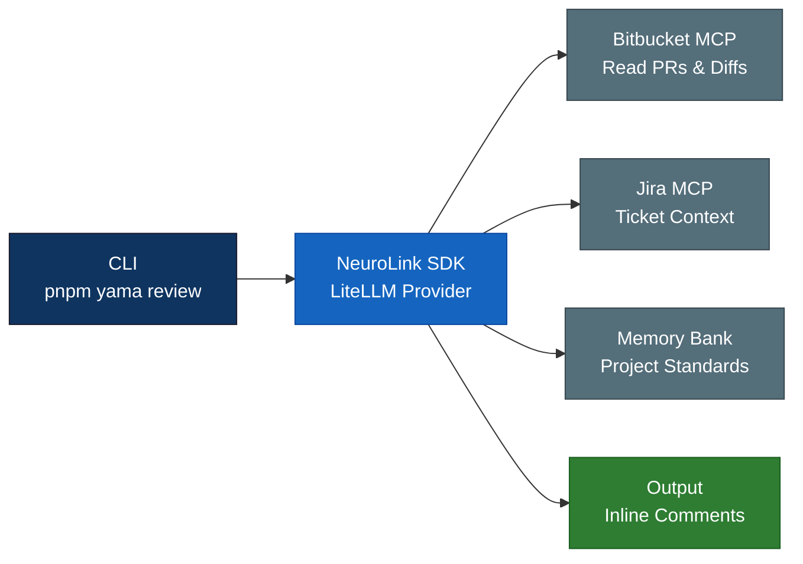
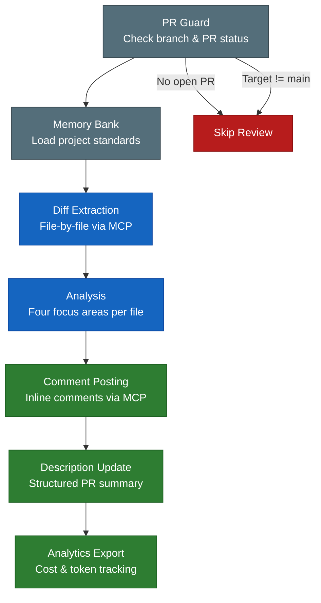
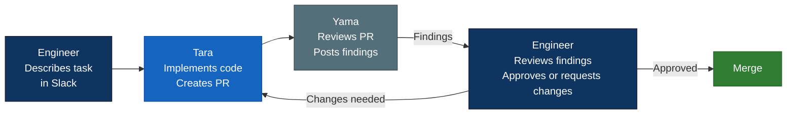

We designed Yama to give every pull request the review quality of your best senior engineer, twenty-four hours a day, seven days a week. Not a linter. Not a style checker. A structured analysis that reads the diff, understands the project context, and posts inline comments grouped by what actually matters: security vulnerabilities, runtime correctness, performance regressions, and code quality.

Yama is a CLI-driven code review tool built on NeuroLink SDK. It fetches PR diffs from Bitbucket Server via MCP, routes them through a LiteLLM-backed language model, and posts structured findings directly as inline comments on the pull request. Every review follows the same protocol. Every file gets the same attention. No reviewer fatigue. No context switching.

This post traces how we built it, the architectural decisions that shaped it, and the lessons we learned running it across production repositories at Juspay.

## The Code Review Bottleneck

Code review is one of the highest-leverage activities in software engineering. It catches bugs before they reach production, spreads knowledge across the team, and enforces architectural standards. But it is also one of the most expensive activities in terms of engineer time and attention.

The numbers are well-documented. A typical PR sits in the review queue for four to eight hours. Reviewers context-switch from their own work, load the PR diff into their head, trace control flow across files they may not have touched in months, and then produce feedback that ranges from superficial style nits to deep architectural concerns. The cognitive cost is high. The consistency is low.

At Juspay, we saw three specific failure modes:

1. **Reviewer fatigue.** By the third PR of the day, review quality drops. The fifth PR gets a cursory glance. Security implications get missed because the reviewer is focused on logic correctness, or vice versa.

2. **Context loss.** A reviewer who has not worked in the payments module for two months does not remember the threading model, the retry semantics, or the specific SQL injection patterns that the ORM abstracts away. They review what they see in the diff, not what they know about the system.

3. **Inconsistency.** Different reviewers apply different standards. One engineer cares deeply about error handling. Another focuses on naming conventions. The same code gets approved by one reviewer and rejected by another, depending on who picks it up.

We did not set out to replace human reviewers. We set out to give every PR a baseline analysis that covers the areas humans most frequently miss when they are tired, rushed, or unfamiliar with the codebase.

## Architecture Overview

Yama's architecture is deliberately simple. Three components connected by NeuroLink's pipe abstraction:



The CLI is the entry point. You invoke it with a branch name or PR number:

```bash
pnpm yama review --branch feature/my-branch
pnpm yama review --pr 1234
```

The CLI instantiates a NeuroLink instance configured with the LiteLLM provider, which routes to our private model deployment. It then uses the Bitbucket Server MCP to fetch the PR diff, reads the project memory bank for context, and performs a file-by-file analysis. Each finding gets posted back to Bitbucket as an inline comment with the exact file path and line number.

The NeuroLink instantiation is minimal:

```typescript
import { NeuroLink } from "@juspay/neurolink";

const neurolink = new NeuroLink({
  defaultProvider: "litellm",
  defaultModel: "private-large",
});
```

The LiteLLM provider gives us access to our private model deployment behind NeuroLink's standard `generate()` and `stream()` interface. The model choice is configurable per project -- some repositories use a larger model for more nuanced analysis, while others use a faster model for quicker turnaround.

## The Four Focus Areas

Every Yama review is structured around four focus areas. This is not arbitrary. We analyzed six months of production incidents at Juspay and categorized the root causes. The four focus areas map directly to the four most common categories of bugs that escaped code review.

| Focus Area | Priority | What It Checks |
|---|---|---|
| Security Analysis | CRITICAL | Injection, auth bypass, data exposure, secret leakage |
| Runtime Correctness | MAJOR | Null references, race conditions, incorrect assumptions |
| Performance Review | MAJOR | N+1 queries, blocking operations, memory leaks |
| Code Quality | MAJOR | Duplication, naming, maintainability, dead code |

The priority levels are not decorative. They drive behavior. A CRITICAL security finding blocks the merge pipeline (configurable per project). A MAJOR finding is a strong recommendation. An informational finding is a suggestion.

The key insight was that each focus area requires a different analytical lens. Security analysis needs to trace data flow from user input to database queries. Runtime correctness needs to reason about null safety and concurrency. Performance needs to identify query patterns and algorithmic complexity. Code quality needs to evaluate naming, structure, and maintainability.

Rather than asking the model to do all four simultaneously, Yama structures the prompt to address each focus area in sequence. The model examines the same diff through four different lenses, producing findings tagged to the appropriate area.

```typescript
// Focus area configuration
const FOCUS_AREAS = [
  {
    name: "Security Analysis",
    priority: "CRITICAL",
    prompt: `Analyze for security vulnerabilities:
      - SQL injection via string concatenation
      - Authentication/authorization bypass
      - Data exposure in logs or responses
      - Hardcoded secrets or credentials
      - Path traversal vulnerabilities
      - SSRF and open redirect risks`,
  },
  {
    name: "Runtime Correctness",
    priority: "MAJOR",
    prompt: `Analyze for runtime errors:
      - Null/undefined dereferences
      - Race conditions in async code
      - Incorrect error handling assumptions
      - Type coercion bugs
      - Off-by-one errors in loops`,
  },
  {
    name: "Performance Review",
    priority: "MAJOR",
    prompt: `Analyze for performance issues:
      - N+1 query patterns
      - Blocking operations in async paths
      - Unbounded memory allocation
      - Missing pagination on queries
      - Unnecessary recomputation`,
  },
  {
    name: "Code Quality",
    priority: "MAJOR",
    prompt: `Analyze for code quality:
      - Code duplication across functions
      - Misleading variable/function names
      - Dead code or unreachable branches
      - Missing error propagation
      - Overly complex conditionals`,
  },
];
```

## The Review Pipeline

The review pipeline has five discrete stages. Each stage has a clear input and output contract. If any stage fails, the pipeline reports the failure and stops cleanly.



### Stage 1: PR Guard

Before any analysis begins, Yama calls `get_branch()` via the Bitbucket MCP. This serves as a guard: if there is no open pull request for the specified branch, or if the PR targets a branch other than `main`, the review is skipped. This prevents wasted compute on feature branches that are still in progress or on PRs that target non-production branches.

```typescript
// PR guard — skip if no open PR or wrong target
const branchInfo = await bitbucketMcp.get_branch({
  workspace: config.workspace,
  repository: config.repository,
  branch: branchName,
});

if (!branchInfo.pullRequest || branchInfo.pullRequest.state !== "OPEN") {
  console.log("No open PR found — skipping review");
  return;
}

if (branchInfo.pullRequest.toRef.id !== "refs/heads/main") {
  console.log(`PR targets ${branchInfo.pullRequest.toRef.id}, not main — skipping`);
  return;
}
```

### Stage 2: Memory Bank

Before Yama reads a single line of diff, it loads the project memory bank. This is a set of markdown files in `memory-bank/` that describe the project's architecture, coding standards, and security guidelines.

The memory bank typically contains:

- `project-overview.md` -- high-level architecture, tech stack, deployment model
- `architecture.md` -- module structure, data flow, integration points
- `coding-standards.md` -- naming conventions, error handling patterns, testing requirements
- `security-guidelines.md` -- authentication model, data classification, approved cryptographic primitives

This context is prepended to every file analysis. The model does not review code in a vacuum. It reviews code against the standards the team has explicitly documented. If the project uses a specific ORM pattern to prevent SQL injection, the memory bank says so, and Yama knows not to flag standard ORM usage as a security risk.

### Stage 3: Diff Extraction

Yama fetches the PR diff file-by-file via the Bitbucket MCP. This is a deliberate architectural choice. We tried reviewing the entire diff at once in early prototypes. The results were mediocre. Large diffs exceeded context limits. Even when they fit, the model's attention degraded across hundreds of lines of unrelated changes.

File-by-file review is more accurate and fits within context limits for every model we tested. The tradeoff is more API calls and higher total token usage. We accepted this tradeoff because review quality matters more than review cost.

```typescript
// Fetch diff with smart filtering
const diff = await bitbucketMcp.get_pull_request_diff({
  workspace: config.workspace,
  repository: config.repository,
  pull_request_id: prId,
  context_lines: 3,
  exclude_patterns: [
    "*.lock",
    "*.svg",
    "*.min.js",
    "*.map",
    "*.png",
    "*.jpg",
    "package-lock.json",
    "pnpm-lock.yaml",
  ],
});
```

The `exclude_patterns` filter is important. Lock files, images, minified JavaScript, and source maps add noise without providing reviewable signal. Filtering them out reduces token usage by thirty to fifty percent on typical PRs.

### Stage 4: Analysis

For each file in the diff, Yama constructs a prompt that includes the project memory bank context, the focus area instructions, and the file diff. The model returns findings in a structured format.

### Stage 5: Comment Posting

Each finding is posted as an inline comment on the PR via the Bitbucket MCP. The comment includes the focus area tag, severity, and a description of the issue.

## Bitbucket Integration

The Bitbucket Server MCP provides the read-write interface that connects Yama to the pull request lifecycle. On the read side, it fetches PR metadata, diffs, file contents, and branch information. On the write side, it posts inline comments and updates PR descriptions.

The inline comment format is structured for scannability:

```typescript
// Inline comment posted per finding
await bitbucketMcp.add_comment({
  workspace: "PROJ",
  repository: "my-repo",
  pull_request_id: 1234,
  comment_text: "[SECURITY][CRITICAL] SQL injection risk in user input handling.\n\n" +
    "The `userId` parameter is concatenated directly into the SQL query string " +
    "at line 42. Use parameterized queries instead.\n\n" +
    "```typescript\n" +
    "// Before (vulnerable)\n" +
    'const query = `SELECT * FROM users WHERE id = ${userId}`;\n\n' +
    "// After (safe)\n" +
    "const query = 'SELECT * FROM users WHERE id = $1';\n" +
    "const result = await db.query(query, [userId]);\n" +
    "```",
  file_path: "src/api/orders.ts",
  line_number: 42,
  line_type: "ADDED",
});
```

Every comment starts with a tag in the format `[FOCUS_AREA][SEVERITY]`. This makes it easy to scan a PR's comment thread and immediately see the distribution of findings. A PR with three `[SECURITY][CRITICAL]` tags looks very different from one with five `[CODE_QUALITY][MAJOR]` suggestions.

The `line_type: "ADDED"` parameter ensures comments attach to the new code, not the old code. Yama only reviews additions and modifications. Deleted lines are not analyzed because there is nothing to fix in code that no longer exists.

## Jira Integration

Yama's Jira integration serves two purposes. First, it reads ticket context to understand the intent behind a PR. If a PR is linked to a Jira ticket, Yama fetches the ticket description and acceptance criteria before starting the review. This means the model can evaluate whether the implementation actually satisfies the stated requirements, not just whether the code is technically correct.

Second, for critical findings, Yama can create follow-up tickets. If a security vulnerability is found but the PR author decides to merge anyway (perhaps the vulnerability is in a non-production code path), Yama creates a Jira ticket tagged with the appropriate severity so the finding does not get lost.

```typescript
// Fetch Jira context for the PR
const linkedTickets = extractTicketIds(prDescription);
const ticketContext = await Promise.all(
  linkedTickets.map(async (ticketId) => {
    const issue = await jiraMcp.get_issue({ issue_key: ticketId });
    return {
      key: issue.key,
      summary: issue.fields.summary,
      description: issue.fields.description,
      acceptanceCriteria: issue.fields.customfield_10100,
    };
  })
);
```

The ticket ID extraction uses a simple regex that matches the `BZ-` prefix convention used across Juspay's Jira instance. Any `BZ-12345` pattern found in the PR title or description triggers a Jira lookup.

## Input and Output Contracts

Yama's configuration lives in `yama.config.yaml` at the repository root. This file defines the model, temperature, token limits, and review behavior.

```yaml
# yama.config.yaml
provider: litellm
model: private-large
temperature: 0.3
max_tokens: 60000
timeout: 600000  # 10 minutes
retry_attempts: 3
memory:
  enabled: true
  max_turns: 300
```

The `temperature: 0.3` is deliberate. Code review requires precision, not creativity. Lower temperatures produce more deterministic outputs, which means more consistent findings across repeated reviews of the same diff. We tested temperatures from 0.1 to 0.7. At 0.1, the model was overly conservative and missed subtle issues. At 0.7, it produced false positives. 0.3 was the sweet spot.

The `timeout: 600000` (ten minutes) and `retry_attempts: 3` handle the reality of large PRs. A review of a 50-file PR with full memory bank context can take several minutes. The retry logic handles transient API failures without restarting the entire review.

The output contract is equally structured. Every finding follows this schema:

```typescript
interface ReviewFinding {
  focusArea: "Security" | "Runtime" | "Performance" | "CodeQuality";
  severity: "CRITICAL" | "MAJOR" | "MINOR" | "INFO";
  filePath: string;
  lineNumber: number;
  lineType: "ADDED" | "MODIFIED";
  title: string;
  description: string;
  suggestion?: string;  // Optional fix recommendation
  confidence: number;   // 0.0 to 1.0
}
```

The `confidence` field drives downstream behavior. Findings with confidence above 0.8 are posted as comments. Findings between 0.5 and 0.8 are posted with a caveat that the reviewer should verify. Findings below 0.5 are logged to analytics but not posted to the PR. This reduces noise significantly.

## Confidence Scoring

Confidence scoring was the hardest part of Yama to get right. The naive approach -- let the model self-report confidence -- produces unreliable numbers. Language models are notoriously poorly calibrated when estimating their own certainty.

We use a multi-signal approach instead:

1. **Diff context.** Findings about code that is fully visible in the diff get a confidence boost. Findings that require reasoning about code outside the diff get a confidence penalty.

2. **Pattern matching.** Findings that match well-known vulnerability patterns (SQL string concatenation, hardcoded credentials, missing null checks) get a confidence boost. Novel or unusual findings get a confidence penalty.

3. **Memory bank alignment.** If the finding contradicts something in the project memory bank (for example, flagging a pattern that the coding standards explicitly endorse), the confidence drops significantly.

4. **Model agreement.** For critical findings, Yama optionally runs a second pass with a different prompt structure. If both passes identify the same issue, confidence increases. If only one pass finds it, confidence decreases.

The confidence thresholds are configurable per project. Security-sensitive repositories can lower the posting threshold to 0.3 to catch more potential issues at the cost of more false positives. Stable, well-tested repositories can raise it to 0.9 to minimize noise.

## Cost Controls

Yama enforces hard cost boundaries on every review. This was a non-negotiable requirement from the beginning. An unbounded AI review running on a large monorepo diff could easily generate hundreds of dollars in API costs.

The cost control system works on two levels:

- **Warning at $1.50.** The review continues, but a cost warning is logged.
- **Hard stop at $2.00.** The review terminates, posts whatever findings it has accumulated so far, and logs the cost overage.

In practice, the median review costs $0.40. A large PR (50+ files) costs around $1.20. Only pathological diffs -- typically generated code or large refactors -- hit the $2.00 limit.

Token usage, tool calls, and cost data are exported to `.yama/analytics/` as JSON after every review. This gives teams visibility into review costs over time and helps identify repositories where the review configuration needs tuning.

```typescript
// Cost guard implementation
const costTracker = {
  totalCost: 0,
  warningThreshold: 1.50,
  hardLimit: 2.00,

  addCost(tokens: number, model: string): boolean {
    const cost = calculateCost(tokens, model);
    this.totalCost += cost;

    if (this.totalCost >= this.hardLimit) {
      console.warn(`Cost hard limit reached: $${this.totalCost.toFixed(2)}`);
      return false; // Signal to stop review
    }

    if (this.totalCost >= this.warningThreshold) {
      console.warn(`Cost warning: $${this.totalCost.toFixed(2)}`);
    }

    return true; // Continue review
  },
};
```

## Smart Filtering

Not every file in a diff deserves analysis. Yama applies a filtering strategy that eliminates noise before the model sees it.

Lock files (`package-lock.json`, `pnpm-lock.yaml`, `yarn.lock`) are excluded because they are machine-generated and contain no reviewable logic. Image files (`*.png`, `*.jpg`, `*.svg`) are excluded for the same reason. Minified JavaScript (`*.min.js`) and source maps (`*.map`) are excluded because they are build artifacts.

Beyond file-type filtering, Yama also applies a file-size heuristic. Files with diffs exceeding 500 lines are split into chunks and reviewed in segments. This prevents context overflow and improves the quality of findings for large files.

The filtering configuration is part of `yama.config.yaml` and can be customized per repository. A repository with generated protobuf files might add `*.pb.go` to the exclusion list. A repository with generated API clients might exclude the entire `generated/` directory.

## Knowledge Base

Yama accumulates review learnings in a knowledge base at `.yama/knowledge-base.md`. Every review that produces findings adds a summary entry to this file. Over time, the knowledge base captures patterns specific to the repository -- common mistakes, recurring issues, and domain-specific concerns.

When the knowledge base exceeds 50 entries, Yama auto-summarizes it. The summarization compresses individual findings into pattern descriptions. Instead of fifty separate "null check missing on line X" entries, the summary says "The `orders` module frequently has null reference risks on database query results. Always check for empty result sets before accessing properties."

This summarized context gets included in future reviews, making Yama progressively better at reviewing code for a specific repository.

## Lessons Learned

After six months of running Yama in production across multiple Juspay repositories, we have a clear picture of what AI code review does well and where it struggles.

**What AI code review gets right:**

- **Consistency.** Every PR gets the same analysis. The model does not get tired, distracted, or biased by who authored the code.
- **Coverage.** The model checks all four focus areas on every file. Human reviewers tend to specialize -- a security-focused reviewer might miss a performance regression, and vice versa.
- **Speed.** A typical review completes in two to five minutes. The PR gets immediate feedback instead of waiting hours for a human reviewer to become available.
- **Documentation.** Every finding includes an explanation and often a suggested fix. This is educational for junior engineers and provides a record for future reference.

**Where AI code review struggles:**

- **Architectural reasoning.** The model can identify local code issues but struggles to evaluate whether the overall approach is correct. It cannot tell you that the feature should have been built as a background job instead of a synchronous API call.
- **Business logic validation.** The model does not know that a 5% discount cap is a business rule, not a magic number. It might flag the hardcoded `0.05` as a code quality issue when it is actually a deliberate business constraint.
- **Cross-file reasoning.** Even with file-by-file review and memory bank context, the model does not have the full picture of how changes in file A affect behavior in file B. This is especially true for indirect dependencies.
- **False positives on idiomatic code.** Every codebase has idioms that look suspicious to an outsider. The memory bank helps, but it cannot capture every project-specific pattern.

The conclusion we reached: AI code review is a powerful complement to human review, not a replacement. Yama handles the systematic, pattern-based analysis that humans do inconsistently. Humans handle the architectural judgment, business logic validation, and cross-system reasoning that the model cannot.

## Yama and Tara: The Development Loop

The most powerful outcome of building both Tara and Yama was the development loop they create together. Tara is the coding agent -- she implements features, fixes bugs, and creates pull requests from Slack threads. Yama is the review agent -- she analyzes those PRs for security, correctness, performance, and quality.



An engineer describes a task in a Slack thread. Tara implements it and creates a PR. Yama reviews the PR and posts findings. The engineer reviews Yama's findings, decides which are actionable, and either approves or asks Tara to make changes. The cycle continues until the PR is ready.

This is not a fully autonomous loop. The engineer is always in the decision seat. But the repetitive work -- implementation, systematic review, iteration -- is handled by the agents. The engineer's time is spent on judgment calls: is this the right approach, does the implementation match the requirement, are Yama's findings valid.

In practice, we have seen this loop reduce the time from task description to merged PR by forty to sixty percent. The engineer is not faster at typing. The agents are handling the parts that used to require context switching, queue waiting, and repetitive analysis.

## Getting Started

If you are using Bitbucket Server and NeuroLink, adding Yama to your repository takes three steps:

1. Install the CLI: `pnpm add -D @juspay/yama`
2. Create `yama.config.yaml` with your workspace and repository configuration
3. Run `pnpm yama review --branch your-branch`

The memory bank is optional but strongly recommended. Create a `memory-bank/` directory with markdown files describing your project's architecture and standards. The more context Yama has, the better its reviews will be.

For CI integration, add Yama to your pull request pipeline. It runs as a post-checkout step and exits with a non-zero code if any CRITICAL findings are detected, which can gate the merge.

> **Every PR deserves a thorough review. Yama makes that possible at scale.**
{: .prompt-tip }

---

**Related posts:**

- [Meet Tara: From Slack Thread to Merged PR](/posts/meet-tara-from-slack-thread-to-merged-pr/)
- [AI in Production: Lessons from Serving Millions of Requests at Juspay](/posts/ai-in-production-juspay-lessons/)
- [MCP Auto-Discovery: Finding and Registering Tools at Runtime](/posts/mcp-auto-discovery-elicitation/)
