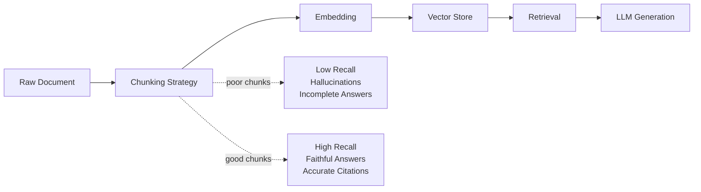
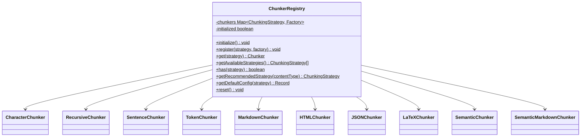
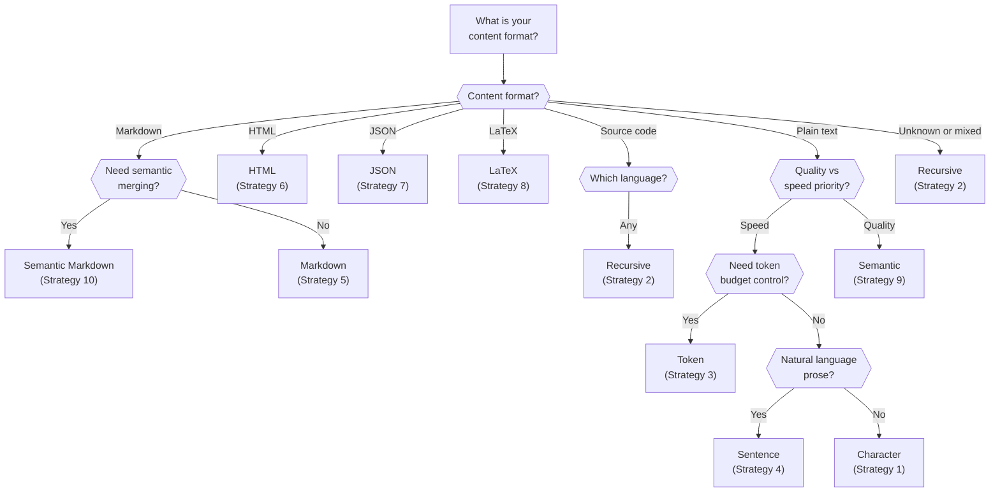

Your RAG pipeline is only as good as its chunks. Feed an LLM a chunk that cuts a sentence in half, and it generates half an answer. Feed it a chunk that mixes two unrelated topics, and it hallucinates connections that do not exist. NeuroLink ships 10 chunking strategies so you can match the splitting method to the content type -- and every strategy is available through a single static registry with lazy initialization and content-type recommendations.

This tutorial walks through each strategy with TypeScript code, benchmarks from our internal evaluations across 500 documents, and a decision framework so you know exactly when to reach for each one.

## Why Chunking Matters

The quality of your chunks directly determines the quality of your retrieval, which in turn determines the quality of your generated answers. This is the fundamental chain in any RAG system.



Three failure modes dominate when chunking goes wrong:

1. **Boundary violations** -- A chunk splits a sentence, paragraph, or code block in the middle. The embedding captures incomplete meaning, and retrieval returns irrelevant fragments.
2. **Topic mixing** -- A chunk contains content from two unrelated sections. The embedding averages the two topics, making it a weak match for queries about either one.
3. **Context loss** -- A chunk is too small to carry enough context for the LLM to generate a useful answer, or too large to fit within the top-K context budget.

The right chunking strategy eliminates these failure modes by aligning chunk boundaries with the natural structure of the content.

## The ChunkerRegistry: Factory Pattern with Lazy Loading

NeuroLink's `ChunkerRegistry` is a static class that manages all 10 strategies through a factory pattern. Each chunker is created via a factory function when requested, keeping the initial bundle small. The registry auto-initializes on first access, so you never need to call a setup method manually.

```typescript
import { ChunkerRegistry } from '@juspay/neurolink';

// List all available strategies (auto-initializes on first call)
const strategies = ChunkerRegistry.getAvailableStrategies();
console.log(strategies);
// ['character', 'recursive', 'sentence', 'token', 'markdown',
//  'html', 'json', 'latex', 'semantic', 'semantic-markdown']

// Get a chunker by strategy name
const chunker = ChunkerRegistry.get('markdown');

// Get a recommended strategy for a content type
const recommended = ChunkerRegistry.getRecommendedStrategy('markdown');
// Returns: 'markdown'

// Get default configuration for a strategy
const defaults = ChunkerRegistry.getDefaultConfig('recursive');
// { maxSize: 1000, overlap: 200, separators: ['\n\n', '\n', '. ', ' ', ''] }
```

The registry follows NeuroLink's standard static factory pattern, which provides consistent lifecycle management across all subsystems. This same pattern powers the provider registry, the reranker registry, and the embedding model registry.



## Strategy 1: Character Split

The simplest approach. Splits text at a fixed character count with optional overlap. No awareness of content structure.

```typescript
import { NeuroLink } from '@juspay/neurolink';

const neurolink = new NeuroLink();

const result = await neurolink.generate({
  input: { text: 'Summarize this plain text file' },
  provider: 'openai',
  model: 'gpt-4o',
  rag: {
    files: ['./data/raw-logs.txt'],
    strategy: 'character',
    chunkSize: 1000,
    chunkOverlap: 100,
    topK: 5,
  },
});
```

**Configuration options:** `maxSize`, `overlap`, `separator`, `keepSeparator`, `minSize`

**Aliases:** `char`, `fixed-size`, `fixed`

**Pros:**

- Predictable chunk sizes -- every chunk is exactly `maxSize` characters (except the last)
- Zero overhead -- no parsing, no NLP, no external calls
- Language-agnostic -- works identically on English, CJK, or binary-encoded text

**Cons:**

- Splits mid-sentence, mid-word, even mid-token
- Produces the lowest retrieval quality in benchmarks
- Overlap is character-based, which may duplicate partial words

**Best use case:** Unstructured text with no formatting markers, such as raw log files or data dumps where you need consistent chunk sizes and do not care about semantic boundaries.

## Strategy 2: Recursive Character Split

The Swiss Army knife. It tries to split at `\n\n` (paragraphs) first, then `\n` (lines), then `.` (sentences), then `" "` (words), and finally individual characters. This preserves the most meaningful boundaries when possible while guaranteeing that no chunk exceeds `maxSize`.

```typescript
const result = await neurolink.generate({
  input: { text: 'What are the key configuration options?' },
  provider: 'openai',
  model: 'gpt-4o',
  rag: {
    files: ['./docs/guide.md'],
    strategy: 'recursive',
    chunkSize: 1000,
    chunkOverlap: 200,
    topK: 5,
  },
});

// The recursive chunker uses these separators by default:
// ['\n\n', '\n', '. ', ' ', '']
// Each level is tried in order until chunks fit within maxSize
```

**Configuration options:** `maxSize`, `overlap`, `separators`, `keepSeparators`, `isSeparatorRegex`, `minSize`

**Aliases:** `recursive-character`, `langchain-default`

**Pros:**

- Preserves paragraph and sentence boundaries when possible
- Falls back gracefully through the separator hierarchy
- Compatible with LangChain's default behavior (same alias: `langchain-default`)
- Best general-purpose strategy when you do not know the document format

**Cons:**

- Does not understand document structure (headers, sections)
- Can still split within code blocks or tables
- Overlap calculation is character-based, not semantic

**Best use case:** General text documents, mixed-format content, or any situation where you want reasonable boundary handling without format-specific configuration. This is the default recommendation for most workloads.

## Strategy 3: Token-Based

Splits text by token count using model-specific tokenizer approximations. Essential when your embedding model has a strict token limit (like 512 tokens for many embedding models) and you need precise budget management.

```typescript
const result = await neurolink.generate({
  input: { text: 'Explain the rate limiting configuration' },
  provider: 'openai',
  model: 'gpt-4o',
  rag: {
    files: ['./docs/api-reference.md'],
    strategy: 'token',
    chunkSize: 512,
    topK: 5,
  },
});

// Configure tokenizer for your model family
// Supported: cl100k_base (GPT-4), p50k_base (Codex), r50k_base (GPT-3)
```

**Configuration options:** `maxSize`, `overlap`, `tokenizer`, `maxTokens`, `tokenOverlap`

**Aliases:** `tok`, `tokenized`

**Pros:**

- Respects model token limits precisely -- no truncation surprises
- Each chunk uses the full embedding capacity of the model
- Includes `estimatedTokens` in chunk metadata for cost tracking

**Cons:**

- Uses approximate tokenization (word-based heuristic at ~4 chars/token for GPT models)
- Does not respect content structure
- Slightly more overhead than character splitting due to token estimation

**Best use case:** When your embedding model has a strict token limit and you need to maximize information density per chunk. Particularly useful with models like `text-embedding-3-small` (8191 token limit) where you want chunks sized at exactly 512 tokens.

## Strategy 4: Sentence-Based

Splits at sentence boundaries (periods, exclamation marks, question marks) and groups sentences to fill the chunk size. Each chunk contains complete thoughts.

```typescript
const result = await neurolink.generate({
  input: { text: 'What does the documentation say about authentication?' },
  provider: 'openai',
  model: 'gpt-4o',
  rag: {
    files: ['./docs/security-guide.md'],
    strategy: 'sentence',
    chunkSize: 1000,
    topK: 5,
  },
});

// Fine-tune sentence detection
// sentenceEnders: ['.', '!', '?'] (default)
// minSentences: 1 (minimum sentences per chunk)
// maxSentences: 10 (maximum sentences per chunk)
```

**Configuration options:** `maxSize`, `overlap`, `sentenceEnders`, `minSentences`, `maxSentences`

**Aliases:** `sent`, `sentence-based`

**Pros:**

- Every chunk contains complete sentences -- no cut-off mid-thought
- Natural for Q&A applications where each chunk should answer a question
- Sentence overlap preserves context between chunks (overlap is measured in sentences, not characters)

**Cons:**

- Relies on punctuation for boundary detection, which fails on some content types (code, logs, tables)
- Does not understand paragraph or section boundaries
- Very long sentences (common in legal or academic text) may exceed `maxSize`

**Best use case:** Natural language prose, FAQ documents, Q&A knowledge bases, and any content where sentence integrity matters more than structural awareness.

## Strategy 5: Markdown

Splits at heading boundaries (`#`, `##`, `###`) while preserving the heading hierarchy as metadata. Code blocks are protected from splitting by default.

```typescript
const result = await neurolink.generate({
  input: { text: 'What are the main configuration sections?' },
  provider: 'openai',
  model: 'gpt-4o',
  rag: {
    files: ['./README.md'],
    strategy: 'markdown',
    chunkSize: 1500,
    topK: 5,
  },
});

// Markdown-specific options:
// headerLevels: [1, 2, 3] -- which heading levels trigger splits
// preserveCodeBlocks: true -- keep code blocks intact
// includeHeader: true -- prepend the section header to each chunk
// stripFormatting: false -- keep markdown formatting in chunks
```

**Configuration options:** `maxSize`, `overlap`, `headerLevels`, `preserveCodeBlocks`, `includeHeader`, `stripFormatting`

**Aliases:** `md`, `markdown-header`

**Pros:**

- Preserves document structure -- each chunk corresponds to a logical section
- Header metadata enables faceted search (filter by section title)
- Code blocks stay intact, preventing syntax fragmentation
- The heading is prepended to each chunk, providing section context to the embedding

**Cons:**

- Only works with markdown-formatted content
- Very long sections (no sub-headings) may still produce oversized chunks
- Does not understand semantic boundaries within a section

**Best use case:** Documentation, README files, technical guides, and any markdown-based knowledge base. This is the default recommendation for documentation workloads.

## Strategy 6: HTML

Splits at semantic HTML tags (`<article>`, `<section>`, `<p>`, `<div>`) while preserving structural elements like tables, code blocks, and lists.

```typescript
const result = await neurolink.generate({
  input: { text: 'Find the pricing details from this webpage' },
  provider: 'openai',
  model: 'gpt-4o',
  rag: {
    files: ['./scraped/pricing-page.html'],
    strategy: 'html',
    chunkSize: 1000,
    topK: 5,
  },
});

// HTML-specific options:
// splitTags: ['div', 'p', 'section', 'article', ...] -- tags that trigger splits
// preserveTags: ['pre', 'code', 'table', 'ul', 'ol'] -- keep these intact
// extractTextOnly: false -- strip all HTML tags and return plain text
// includeTagMetadata: true -- store tag name and attributes in chunk metadata
```

**Configuration options:** `maxSize`, `overlap`, `splitTags`, `preserveTags`, `extractTextOnly`, `includeTagMetadata`

**Aliases:** `html-tag`, `web`

**Pros:**

- Understands DOM structure -- splits at semantically meaningful boundaries
- Preserves tables, lists, and code blocks as atomic units
- Tag metadata enables filtering (only search within `<article>` chunks)
- `extractTextOnly` mode strips markup for cleaner embeddings

**Cons:**

- Requires valid HTML input (malformed HTML may produce unexpected splits)
- Does not handle JavaScript-rendered content (use a headless browser first)
- Large `<div>` blocks with no sub-structure may exceed `maxSize`

**Best use case:** Web scraping pipelines, email templates, HTML documentation, and any content where DOM structure carries semantic meaning.

## Strategy 7: JSON

Splits at object boundaries while respecting nesting depth. Every chunk contains valid JSON, and the JSON path is included in metadata for traceability.

```typescript
const result = await neurolink.generate({
  input: { text: 'What are the default configuration values?' },
  provider: 'openai',
  model: 'gpt-4o',
  rag: {
    files: ['./config/defaults.json'],
    strategy: 'json',
    chunkSize: 1000,
    topK: 5,
  },
});

// JSON-specific options:
// maxDepth: 10 -- maximum nesting depth to traverse
// splitKeys: [] -- specific keys that trigger splits
// preserveKeys: [] -- keep these keys together in one chunk
// includeJsonPath: true -- include JSON path in chunk metadata
```

**Configuration options:** `maxSize`, `maxDepth`, `splitKeys`, `preserveKeys`, `includeJsonPath`

**Aliases:** `json-object`, `structured`

**Pros:**

- Every chunk is valid JSON -- no broken structures
- JSON path metadata enables precise source attribution
- Depth-aware splitting respects nested hierarchies
- Gracefully handles invalid JSON by falling back to plain text

**Cons:**

- Deeply nested objects may produce chunks that are too large or too small
- Array elements may be split across chunks even when logically related
- JSON formatting (pretty-print) increases chunk size

**Best use case:** API responses, configuration files, structured data exports, and any JSON-formatted content where structural integrity matters.

## Strategy 8: LaTeX

Splits at `\section`, `\subsection`, `\begin{environment}`, and math block boundaries. Equations and proofs stay intact as atomic units.

```typescript
const result = await neurolink.generate({
  input: { text: 'What is the main theorem in this paper?' },
  provider: 'openai',
  model: 'gpt-4o',
  rag: {
    files: ['./papers/attention-is-all-you-need.tex'],
    strategy: 'latex',
    chunkSize: 1500,
    topK: 5,
  },
});

// LaTeX-specific options:
// splitEnvironments: ['section', 'subsection', ...] -- section commands that trigger splits
// preserveMath: true -- keep equation/align/gather environments intact
// includePreamble: true -- include the document preamble as the first chunk
```

**Configuration options:** `maxSize`, `overlap`, `splitEnvironments`, `preserveMath`, `includePreamble`

**Aliases:** `tex`, `latex-section`

**Pros:**

- Math environments (`equation`, `align`, `gather`) are never split
- Section hierarchy is preserved in chunk metadata
- Preamble (packages, macros) can be included as a reference chunk
- Understands LaTeX-specific structure that other chunkers would destroy

**Cons:**

- Only works with LaTeX-formatted content
- Custom macros may not be recognized without preamble context
- Very long sections without subsections may exceed `maxSize`

**Best use case:** Academic papers, scientific documents, mathematical content, and any LaTeX-formatted material where equations and structured sections must stay intact.

## Strategy 9: Semantic Chunking

Uses embedding similarity to detect where the topic changes within a document. Instead of splitting at structural markers, it splits where the meaning shifts. This is the highest-quality strategy but requires embedding API calls during chunking.

```typescript
const result = await neurolink.generate({
  input: { text: 'What are the performance implications of caching?' },
  provider: 'openai',
  model: 'gpt-4o',
  rag: {
    files: ['./docs/architecture-guide.md'],
    strategy: 'semantic',
    chunkSize: 1000,
    topK: 5,
  },
});

// Semantic-specific options:
// similarityThreshold: 0.7 -- cosine similarity below this triggers a split
// modelName: 'text-embedding-3-small' -- embedding model for similarity
// provider: 'openai' -- embedding provider
// joinThreshold: 100 -- minimum segment size before semantic analysis
```

**Configuration options:** `maxSize`, `overlap`, `similarityThreshold`, `modelName`, `provider`, `joinThreshold`

**Aliases:** `llm`, `ai-semantic`

**Pros:**

- Content-aware boundaries that align with topic changes
- Produces the highest retrieval quality in benchmarks (92-94% recall@5)
- Works on any content type without format-specific configuration
- Embedding-based similarity captures meaning that structural markers miss

**Cons:**

- Requires embedding API calls during chunking -- significantly slower
- Costs money per document (embedding API charges)
- Depends on embedding model quality -- poor embeddings produce poor splits
- Cold-start problem: first-time chunking is slow due to embedding generation

**Best use case:** Mixed-topic documents where structural markers do not align with topic boundaries, high-value content where retrieval quality justifies the extra cost, and any content where you need the best possible chunk quality.

## Strategy 10: Semantic Markdown

Combines markdown splitting with semantic similarity to produce the best of both worlds. First splits at markdown headers (like Strategy 5), then uses embedding similarity to merge adjacent sections that are semantically related. This prevents over-fragmentation that pure markdown splitting can cause.

```typescript
const result = await neurolink.generate({
  input: { text: 'How does the authentication flow work end-to-end?' },
  provider: 'openai',
  model: 'gpt-4o',
  rag: {
    files: ['./docs/auth-guide.md'],
    strategy: 'semantic-markdown',
    chunkSize: 1500,
    topK: 5,
  },
});

// Semantic-markdown-specific options:
// similarityThreshold: 0.7 -- threshold for merging adjacent sections
// maxMergeSize: 2000 -- maximum size after merging
// preserveMetadata: true -- keep markdown header metadata
```

**Configuration options:** `maxSize`, `overlap`, `similarityThreshold`, `maxMergeSize`, `preserveMetadata`

**Aliases:** `semantic-md`, `smart-markdown`

**Pros:**

- Structural awareness from markdown splitting plus semantic awareness from embedding similarity
- Merges related short sections into richer chunks (reduces fragmentation)
- Header metadata is preserved for faceted search
- Best choice for documentation where sections vary greatly in length

**Cons:**

- Requires embedding API calls (same cost concern as pure semantic)
- Only works with markdown content
- More complex configuration with two sets of parameters (markdown + semantic)

**Best use case:** Knowledge bases built from markdown documentation where some sections are very short and would produce low-quality chunks if split independently. The semantic merging produces denser, more information-rich chunks.

## Comparison Table

| # | Strategy | Speed | Quality | Cost | Chunk Consistency | Best For |
|---|----------|-------|---------|------|-------------------|----------|
| 1 | Character | Fastest | Lowest | Free | Fixed size | Raw text, logs |
| 2 | Recursive | Fast | Good | Free | Variable | General documents |
| 3 | Token | Fast | Good | Free | Token-precise | Embedding budget control |
| 4 | Sentence | Fast | Good | Free | Sentence-aligned | Q&A, prose |
| 5 | Markdown | Fast | High | Free | Section-aligned | Documentation |
| 6 | HTML | Fast | High | Free | DOM-aligned | Web content |
| 7 | JSON | Fast | High | Free | Structure-aligned | API data, configs |
| 8 | LaTeX | Fast | High | Free | Section-aligned | Academic papers |
| 9 | Semantic | Slow | Highest | Embedding API | Topic-aligned | Mixed-topic docs |
| 10 | Semantic MD | Slow | Highest | Embedding API | Section + topic | Documentation KB |

**Benchmark results** (500 documents, 500 queries, hybrid search + Cohere reranking):

| Strategy | Recall@5 | Precision@5 | Avg Latency (chunk) | Avg Chunk Size |
|----------|----------|-------------|---------------------|----------------|
| Character | 71% | 58% | 2ms | 1000 chars |
| Recursive | 82% | 71% | 3ms | 850 chars |
| Token | 80% | 69% | 4ms | 512 tokens |
| Sentence | 83% | 72% | 5ms | 780 chars |
| Markdown | 88% | 79% | 4ms | 920 chars |
| HTML | 87% | 78% | 6ms | 880 chars |
| JSON | 85% | 76% | 5ms | 750 chars |
| LaTeX | 86% | 77% | 5ms | 950 chars |
| Semantic | 93% | 86% | 450ms | 1100 chars |
| Semantic MD | 94% | 87% | 480ms | 1050 chars |

## Decision Framework

Use this flowchart to choose the right strategy for your content:



**Quick decision rules:**

- **Do not know the format?** Start with `recursive`. It handles most content types well.
- **Markdown documentation?** Use `markdown`. If sections are short and fragmented, upgrade to `semantic-markdown`.
- **Need the best quality and can afford latency?** Use `semantic`.
- **Strict token budget?** Use `token` with the tokenizer matching your embedding model.
- **Q&A knowledge base with prose?** Use `sentence`.

## Custom Chunkers: Extending the Registry

The `ChunkerRegistry` supports registering custom chunking strategies at runtime. Implement the `Chunker` interface and register your factory function before using the strategy.

```typescript
import { ChunkerRegistry } from '@juspay/neurolink';
import type { Chunker, Chunk } from '@juspay/neurolink';
import { randomUUID } from 'crypto';

// 1. Implement the Chunker interface
class CodeChunker implements Chunker {
  readonly strategy = 'code' as const;

  async chunk(text: string, config?: { maxSize?: number }): Promise<Chunk[]> {
    const maxSize = config?.maxSize ?? 2000;
    const chunks: Chunk[] = [];
    const documentId = randomUUID();

    // Split at function/class boundaries
    const functionPattern = /^(?:export\s+)?(?:async\s+)?(?:function|class|const\s+\w+\s*=)/gm;
    const boundaries: number[] = [0];
    let match: RegExpExecArray | null;

    while ((match = functionPattern.exec(text)) !== null) {
      if (match.index > 0) {
        boundaries.push(match.index);
      }
    }
    boundaries.push(text.length);

    // Create chunks from boundaries
    for (let i = 0; i < boundaries.length - 1; i++) {
      const chunkText = text.slice(boundaries[i], boundaries[i + 1]).trim();
      if (chunkText.length > 0) {
        chunks.push({
          id: randomUUID(),
          text: chunkText,
          metadata: {
            documentId,
            chunkIndex: i,
            startPosition: boundaries[i],
            endPosition: boundaries[i + 1],
            documentType: 'code',
            custom: {},
          },
        });
      }
    }

    return chunks;
  }

  validate(config: unknown) {
    return { valid: true, errors: [] };
  }
}

// 2. Register with the static registry (factory function, no metadata param)
ChunkerRegistry.register('code', () => new CodeChunker());

// 3. Use it like any built-in strategy
const sourceCode = 'function hello() { return "world"; }\n// ... more code';
const chunker = ChunkerRegistry.get('code');
const chunks = await chunker.chunk(sourceCode);
```

The custom chunker is immediately available through `ChunkerRegistry.get()` and appears in `getAvailableStrategies()`. It participates in the same factory pattern and lifecycle management as the built-in strategies.

## Combining Chunking with Hybrid Search

Chunking is only the first stage. For production RAG, combine your chosen strategy with hybrid search and reranking for the best retrieval quality:

```typescript
import { RAGPipeline } from '@juspay/neurolink';

const pipeline = new RAGPipeline({
  embeddingModel: { provider: 'openai', modelName: 'text-embedding-3-small' },
  generationModel: { provider: 'openai', modelName: 'gpt-4o' },
  chunkingStrategy: 'semantic-markdown',
  chunkingConfig: {
    maxSize: 1000,
    similarityThreshold: 0.7,
    preserveMetadata: true,
  },
  searchStrategy: 'hybrid',
  hybridOptions: {
    vectorWeight: 0.6,
    bm25Weight: 0.4,
    fusionMethod: 'rrf',
  },
  reranker: {
    type: 'cohere',
    model: 'rerank-english-v3.0',
    topN: 5,
  },
});

await pipeline.ingest(['./docs/**/*.md']);

const response = await pipeline.query(
  'How do I implement rate limiting with Redis?'
);
console.log(response.answer);
console.log(`Sources: ${response.sources.length}`);
```

## Practical Tips

**Start with recursive, measure, then optimize.** The recursive strategy handles 80% of use cases well. Only switch to a format-specific strategy after you measure retrieval quality and find that chunk boundaries are causing problems.

**Overlap is not free.** Overlap increases the total number of chunks and embedding costs. Start with zero overlap and add it only if you see retrieval failures at chunk boundaries. For sentence-based chunking, 1-2 sentences of overlap is usually sufficient.

**Match chunk size to your embedding model.** If your embedding model has a 512-token limit, set your token chunker to 512 tokens. If your model supports 8192 tokens, you can use larger chunks -- but larger chunks mean fewer chunks, which means less granular retrieval. A good starting point is 500-1000 tokens for most embedding models.

**Use metadata for faceted search.** Markdown and HTML chunkers include structural metadata (header text, tag names) in each chunk. Use this metadata to narrow your search before vector similarity, dramatically improving precision.

**Monitor chunk quality in production.** Track the average chunk size, the number of chunks per document, and the retrieval recall for each strategy. If recall drops after a content change, the chunking strategy may need adjustment.

## Conclusion

NeuroLink's 10 chunking strategies cover every common document format and retrieval quality requirement. The `ChunkerRegistry` makes it straightforward to discover, configure, and switch between strategies -- and the custom chunker interface lets you extend the system for domain-specific needs.

The key insight is that there is no single best chunking strategy. The best strategy depends on your content format, your quality requirements, and your latency budget. Use the decision framework to pick your starting point, measure retrieval quality with RAGAS metrics, and iterate.

---

**Related posts:**

- [Yama: AI-Native Code Review Powered by NeuroLink](/posts/yama-ai-code-review/)
- [Advanced RAG: 10 Chunking Strategies, Hybrid Search, and Reranking](/posts/advanced-rag/)
- [How We Built the RAG Pipeline: 10 Chunking Strategies and Why](/posts/how-we-built-rag-pipeline/)
