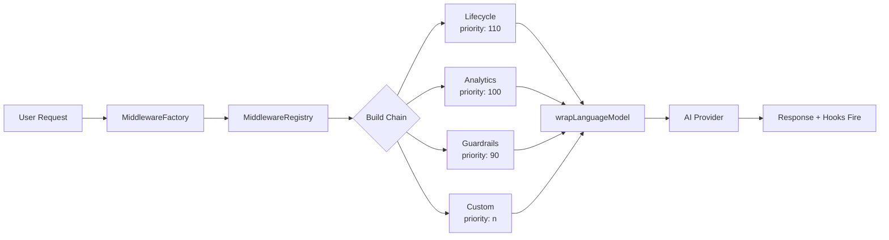
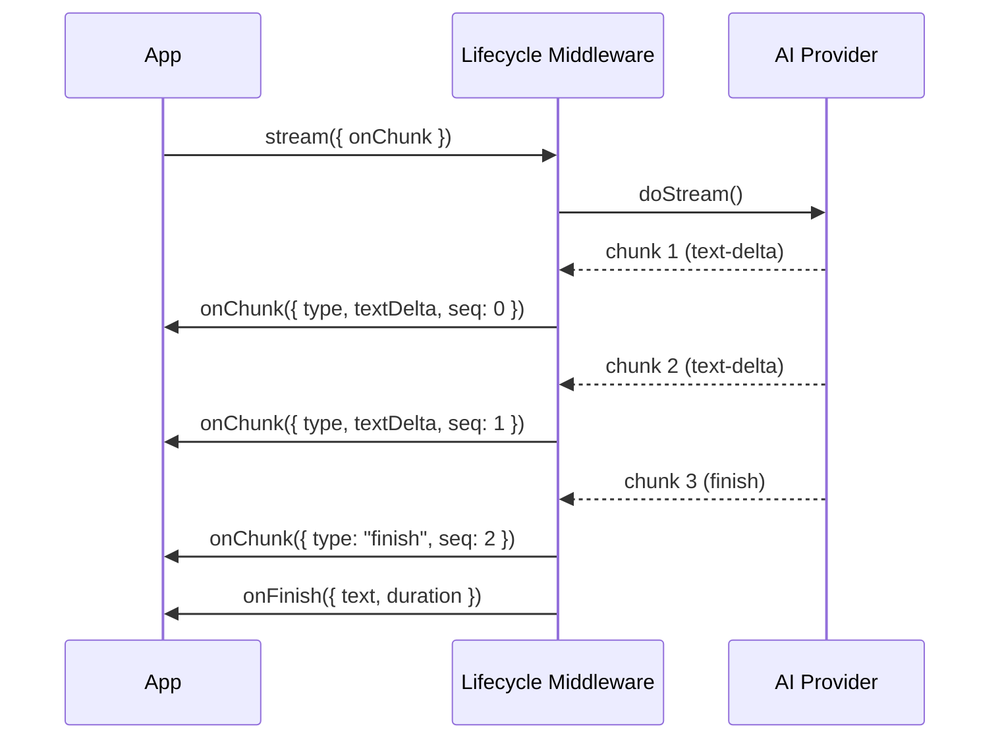
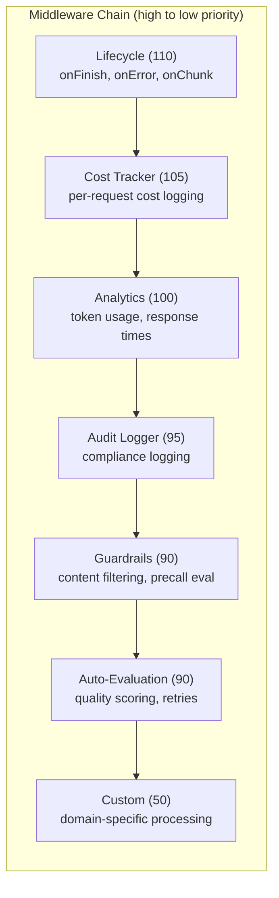

Every AI call has a lifecycle. A request enters the middleware chain, tokens stream back from the provider, the generation completes, or something goes wrong. Until now, observing these stages meant writing custom wrappers around every `generate()` and `stream()` call. NeuroLink v9.30 changes that with lifecycle middleware hooks: `onFinish`, `onError`, and `onChunk` callbacks that let you tap into every stage of the AI request lifecycle without touching your business logic.

This tutorial walks through the lifecycle middleware from the ground up. You will learn how NeuroLink chains middleware, how each hook fires during generation and streaming, and how to compose hooks for logging, analytics, error recovery, and real-time monitoring. By the end, you will have a production-ready cost tracker running as lifecycle middleware.

## The middleware architecture

Before diving into lifecycle hooks, it helps to understand how NeuroLink's middleware pipeline works. The system is built around two core components: the `MiddlewareFactory` orchestrates registration and chain building, while the `MiddlewareRegistry` stores middleware, sorts them by priority, and tracks execution statistics.



Middleware executes in priority order -- higher numbers run first. The lifecycle middleware sits at priority 110, above analytics (100) and guardrails (90). This positioning is deliberate: lifecycle hooks need to observe the entire pipeline, including the time added by analytics tracking and guardrail evaluation.

Each middleware can implement up to three hook functions:

- **`transformParams`** -- modifies request parameters before they reach the provider. This is where precall evaluation and input sanitization happen.
- **`wrapGenerate`** -- wraps synchronous generation calls. You get `doGenerate()` (the function that calls the next middleware or provider) and `params`. Use this for timing, caching, and response transformation.
- **`wrapStream`** -- wraps streaming generation calls. Same pattern as `wrapGenerate`, but for streaming responses where chunks arrive incrementally.

The lifecycle middleware uses `wrapGenerate` and `wrapStream` to intercept the generation lifecycle and fire your callbacks at the right moments.

## How lifecycle middleware activates

Unlike analytics or guardrails, lifecycle middleware is not enabled by a preset. It activates automatically when you pass `onFinish`, `onError`, or `onChunk` callbacks in your generation or streaming options. The `MiddlewareFactory` detects these callbacks and injects the lifecycle middleware into the chain with priority 110.

```typescript
import { NeuroLink } from '@juspay/neurolink';

const neurolink = new NeuroLink();

// Lifecycle middleware activates because onFinish is present
const result = await neurolink.generate({
  input: { text: "Explain middleware patterns" },
  provider: "anthropic",
  model: "claude-sonnet-4-20250514",
  onFinish: ({ text, usage, duration, finishReason }) => {
    console.log(`Completed in ${duration}ms`);
    console.log(`Tokens: ${usage?.promptTokens} in, ${usage?.completionTokens} out`);
    console.log(`Finish reason: ${finishReason}`);
  },
  onError: ({ error, duration, recoverable }) => {
    console.error(`Failed after ${duration}ms: ${error.message}`);
    console.log(`Recoverable: ${recoverable}`);
  },
});
```

Under the hood, the factory calls `createLifecycleMiddleware(config)` with your callbacks as the config object. The resulting middleware is registered with `priority: 110` and `defaultEnabled: false` -- it only participates in the chain when explicitly triggered by the presence of callback functions.

## onChunk: real-time token processing

The `onChunk` hook fires for every chunk in a streaming response. Each invocation receives the chunk type, the text delta (for text chunks), and a monotonically increasing sequence number. This makes it the right place for progress tracking, real-time UI updates, and token-level logging.



Here is a practical example that tracks streaming progress and reports throughput:

```typescript
const result = await neurolink.stream({
  input: { text: "Write a technical overview of middleware patterns" },
  provider: "openai",
  model: "gpt-4o",
  onChunk: ({ type, textDelta, sequenceNumber }) => {
    if (type === "text-delta" && textDelta) {
      // Track characters received for throughput calculation
      process.stdout.write(textDelta);
    }
    if (sequenceNumber % 50 === 0) {
      console.log(`\n[Progress] ${sequenceNumber} chunks received`);
    }
  },
  onFinish: ({ text, duration }) => {
    const tokensPerSecond = text.split(/\s+/).length / (duration / 1000);
    console.log(`\n[Done] ~${tokensPerSecond.toFixed(1)} words/sec over ${duration}ms`);
  },
});
```

Internally, the lifecycle middleware creates a `TransformStream` that wraps the provider's stream. Each chunk passes through the transform function, which fires `onChunk` before forwarding the chunk downstream. The transform also accumulates text deltas so that `onFinish` receives the complete text when the stream ends (via the `flush()` handler).

A critical design decision: `onChunk` callbacks are fire-and-forget. If your callback returns a promise, the middleware calls `Promise.resolve(callbackResult).catch(...)` to swallow errors. This means a slow or failing chunk handler never blocks the stream. If your `onChunk` handler throws, the error is logged as a warning, but the chunk still flows to the consumer.

## onFinish: post-generation analytics

The `onFinish` hook fires after generation completes, whether through `generate()` or at the end of a `stream()`. It receives the full generated text, token usage (prompt and completion counts), wall-clock duration, and the finish reason.

This hook is designed for post-generation concerns: cost tracking, audit logging, quality metrics, and analytics pipelines. Because it fires after the response is assembled, you have access to the complete output.

```typescript
import { NeuroLink } from '@juspay/neurolink';

// Cost tracking with onFinish
const MODEL_COSTS: Record<string, { input: number; output: number }> = {
  "gpt-4o":               { input: 0.0025, output: 0.010 },
  "claude-sonnet-4-20250514": { input: 0.003,  output: 0.015 },
  "gemini-2.0-flash":     { input: 0.0001, output: 0.0004 },
};

const neurolink = new NeuroLink();
const model = "gpt-4o";

const result = await neurolink.generate({
  input: { text: "Summarize the benefits of middleware patterns" },
  provider: "openai",
  model,
  onFinish: ({ text, usage, duration, finishReason }) => {
    if (usage) {
      const costs = MODEL_COSTS[model];
      const inputCost = (usage.promptTokens / 1000) * costs.input;
      const outputCost = (usage.completionTokens / 1000) * costs.output;
      const totalCost = inputCost + outputCost;

      console.log(`[Cost] $${totalCost.toFixed(6)} (${usage.promptTokens} in, ${usage.completionTokens} out)`);
      console.log(`[Perf] ${duration}ms | Reason: ${finishReason}`);
    }
  },
});
```

For streaming responses, `onFinish` fires from the `TransformStream.flush()` handler -- after the last chunk has been forwarded to the consumer. The text is the accumulated concatenation of all `text-delta` chunks. Token usage may not be available in the streaming case (it depends on the provider), but the duration is always accurate because the middleware captures `Date.now()` at the start of `wrapStream`.

> **Note:** `onFinish` callbacks are also fire-and-forget. If your callback is async and rejects, the error is caught and logged as a warning. The response is still returned to the caller. This means you can safely do async work (database writes, API calls) inside `onFinish` without risking the main response.
{: .prompt-info }

## onError: graceful degradation

The `onError` hook fires when any error occurs during generation or streaming. It receives the error object, the wall-clock duration at the time of failure, and a `recoverable` boolean that indicates whether the error is transient (network timeout, rate limit) or permanent (invalid API key, model not found).

The `recoverable` flag comes from NeuroLink's `isRecoverableError()` utility, which classifies errors based on HTTP status codes and error types. This gives your error handler enough context to decide whether to retry, fall back to another provider, or alert an operator.

```typescript
import { NeuroLink } from '@juspay/neurolink';

const neurolink = new NeuroLink();

const result = await neurolink.generate({
  input: { text: "Analyze this dataset" },
  provider: "openai",
  model: "gpt-4o",
  onError: async ({ error, duration, recoverable }) => {
    // Log to your monitoring system
    await fetch("https://monitoring.internal/api/events", {
      method: "POST",
      headers: { "Content-Type": "application/json" },
      body: JSON.stringify({
        event: "ai_generation_error",
        provider: "openai",
        model: "gpt-4o",
        error: error.message,
        duration,
        recoverable,
        timestamp: new Date().toISOString(),
      }),
    });

    // Alert if non-recoverable
    if (!recoverable) {
      console.error(`[ALERT] Non-recoverable error after ${duration}ms: ${error.message}`);
    }
  },
});
```

In the streaming case, `onError` fires in two places: if `doStream()` itself throws (the stream never starts), and if an error occurs during chunk processing inside the `TransformStream.transform()` handler. Both paths capture the duration from the original `startTime`, so you always know how long the request ran before failure.

A key design point: the `onError` hook does not suppress the error. After your callback fires, the original error is re-thrown. This means standard error handling (try/catch, `.catch()`) still works. The hook is for observation, not interception. If you need to intercept errors and provide fallback behavior, combine `onError` with NeuroLink's provider failover system.

## Composing middleware: stacking multiple hooks

Lifecycle hooks compose naturally with NeuroLink's existing middleware. Because the lifecycle middleware runs at priority 110 (above analytics at 100 and guardrails at 90), your hooks observe the full pipeline:

```typescript
import { NeuroLink, MiddlewareFactory } from '@juspay/neurolink';

const neurolink = new NeuroLink();

// Stack lifecycle hooks with built-in middleware
const result = await neurolink.generate({
  input: { text: "Write secure code guidelines" },
  provider: "anthropic",
  model: "claude-sonnet-4-20250514",
  middleware: {
    preset: "all", // Analytics + Guardrails enabled
  },
  onFinish: ({ text, usage, duration }) => {
    // This duration includes analytics + guardrails overhead
    console.log(`[Lifecycle] Total pipeline: ${duration}ms`);
    console.log(`[Lifecycle] Output length: ${text.length} chars`);
  },
  onError: ({ error, recoverable }) => {
    // Fires if any middleware or the provider throws
    console.error(`[Lifecycle] Error: ${error.message} (recoverable: ${recoverable})`);
  },
});
```

You can also register multiple independent middleware that each implement their own hooks. The middleware chain processes them in priority order, so a logging middleware at priority 95 runs inside the lifecycle middleware's timing window:

```typescript
import type { NeuroLinkMiddleware } from '@juspay/neurolink';

const auditMiddleware: NeuroLinkMiddleware = {
  metadata: {
    id: "audit-logger",
    name: "Audit Logger",
    description: "Logs all AI requests for compliance",
    priority: 95,
    defaultEnabled: true,
  },
  wrapGenerate: async ({ doGenerate, params }) => {
    const auditId = crypto.randomUUID();
    console.log(`[Audit ${auditId}] Generation started`);
    const result = await doGenerate();
    console.log(`[Audit ${auditId}] Generation complete`);
    return result;
  },
};
```

The audit middleware at priority 95 runs after lifecycle (110) and analytics (100) but before guardrails (90). The lifecycle middleware's `onFinish` duration will include the audit logger's execution time, giving you accurate end-to-end measurements.

## Built-in middleware: guardrails, rate limiting, caching, and audit logging

NeuroLink ships with four built-in middleware. Each addresses a production concern and integrates with lifecycle hooks.

| Middleware | Priority | Purpose | Lifecycle Integration |
|---|---|---|---|
| **Lifecycle** | 110 | `onFinish`, `onError`, `onChunk` callbacks | The hook source itself |
| **Analytics** | 100 | Token usage, response times, cost data | `onFinish` sees analytics overhead in duration |
| **Guardrails** | 90 | Content filtering, precall evaluation, bad word redaction | `onError` fires if guardrails block a request |
| **Auto-Evaluation** | 90 | RAGAS-style quality scoring, retry on low scores | `onFinish` reflects retry attempts in duration |

The factory registers all four during `initialize()` and exposes three presets for quick configuration:

```typescript
import { MiddlewareFactory } from '@juspay/neurolink';

const factory = new MiddlewareFactory();

// "default" preset: analytics only
factory.applyMiddleware(model, context, { preset: "default" });

// "all" preset: analytics + guardrails
factory.applyMiddleware(model, context, { preset: "all" });

// "security" preset: guardrails only
factory.applyMiddleware(model, context, { preset: "security" });
```

Lifecycle middleware does not belong to any preset. It activates on demand when you pass callback functions. This keeps the default pipeline lean while giving you full observability when you need it.

## Building a custom cost tracker: full walkthrough

Let us build a production-grade cost tracking middleware that combines lifecycle hooks with NeuroLink's analytics data. The tracker will log per-request costs, maintain running totals, and alert when spending exceeds a threshold.

### Step 1: Define the cost tracker middleware

```typescript
import type { NeuroLinkMiddleware } from '@juspay/neurolink';

interface CostRecord {
  requestId: string;
  provider: string;
  model: string;
  inputTokens: number;
  outputTokens: number;
  cost: number;
  duration: number;
  timestamp: string;
}

const MODEL_PRICING: Record<string, { input: number; output: number }> = {
  "gpt-4o":               { input: 0.0025, output: 0.010 },
  "gpt-4o-mini":          { input: 0.00015, output: 0.0006 },
  "claude-sonnet-4-20250514": { input: 0.003, output: 0.015 },
  "gemini-2.0-flash":     { input: 0.0001, output: 0.0004 },
};

class CostTracker {
  private records: CostRecord[] = [];
  private totalCost = 0;
  private alertThreshold: number;
  private alertCallback?: (total: number, record: CostRecord) => void;

  constructor(threshold = 10.0, onAlert?: (total: number, record: CostRecord) => void) {
    this.alertThreshold = threshold;
    this.alertCallback = onAlert;
  }

  record(entry: CostRecord): void {
    this.records.push(entry);
    this.totalCost += entry.cost;

    if (this.totalCost > this.alertThreshold && this.alertCallback) {
      this.alertCallback(this.totalCost, entry);
    }
  }

  getTotal(): number {
    return this.totalCost;
  }

  getRecords(): CostRecord[] {
    return [...this.records];
  }
}
```

### Step 2: Create the middleware factory function

```typescript
function createCostTrackerMiddleware(tracker: CostTracker): NeuroLinkMiddleware {
  return {
    metadata: {
      id: "cost-tracker",
      name: "Cost Tracker",
      description: "Tracks per-request costs with lifecycle hooks",
      priority: 105, // Between lifecycle (110) and analytics (100)
      defaultEnabled: true,
    },

    wrapGenerate: async ({ doGenerate, params }) => {
      const startTime = Date.now();
      const requestId = `cost-${Date.now()}-${Math.random().toString(36).slice(2, 8)}`;

      try {
        const result = await doGenerate();
        const duration = Date.now() - startTime;

        // Extract usage from result
        const inputTokens = result.usage?.inputTokens?.total ?? 0;
        const outputTokens = result.usage?.outputTokens?.total ?? 0;

        // Look up pricing (default to zero if unknown model)
        const modelId = params.modelId ?? "unknown";
        const pricing = MODEL_PRICING[modelId] ?? { input: 0, output: 0 };
        const cost = (inputTokens / 1000) * pricing.input
                   + (outputTokens / 1000) * pricing.output;

        tracker.record({
          requestId,
          provider: params.providerId ?? "unknown",
          model: modelId,
          inputTokens,
          outputTokens,
          cost,
          duration,
          timestamp: new Date().toISOString(),
        });

        return result;
      } catch (error) {
        // Record failed requests with zero cost but track duration
        tracker.record({
          requestId,
          provider: params.providerId ?? "unknown",
          model: params.modelId ?? "unknown",
          inputTokens: 0,
          outputTokens: 0,
          cost: 0,
          duration: Date.now() - startTime,
          timestamp: new Date().toISOString(),
        });

        throw error;
      }
    },
  };
}
```

### Step 3: Wire it up

```typescript
import { MiddlewareFactory } from '@juspay/neurolink';

const tracker = new CostTracker(5.0, (total, record) => {
  console.warn(`[COST ALERT] Spending at $${total.toFixed(4)} after ${record.model} request`);
});

const factory = new MiddlewareFactory({
  middleware: [createCostTrackerMiddleware(tracker)],
  preset: "default",
});

// After multiple requests...
console.log(`Total spend: $${tracker.getTotal().toFixed(4)}`);
console.log(`Request count: ${tracker.getRecords().length}`);
```

The cost tracker middleware runs at priority 105, so it executes after lifecycle hooks (110) but before analytics (100). This means the analytics middleware's execution time is included in the cost tracker's duration measurement, giving you the true wall-clock time per request.

## Testing middleware: patterns for unit testing hooks

Testing middleware requires simulating the generation lifecycle without making real API calls. NeuroLink's `createContext()` utility builds test contexts, and you can mock `doGenerate` and `doStream` to control what the middleware sees.

### Testing onFinish with generate

```typescript
import { describe, it, expect, vi } from 'vitest';
import { createLifecycleMiddleware } from '@juspay/neurolink';

describe('Lifecycle Middleware', () => {
  it('calls onFinish with text and duration after generate', async () => {
    const onFinish = vi.fn();
    const middleware = createLifecycleMiddleware({ onFinish });

    // Mock doGenerate to return a controlled result
    const mockResult = {
      content: [{ type: 'text', text: 'Hello, world!' }],
      usage: { inputTokens: { total: 10 }, outputTokens: { total: 5 } },
      finishReason: 'stop',
    };

    const result = await middleware.wrapGenerate!({
      doGenerate: async () => mockResult,
      params: {},
    } as Parameters<NonNullable<typeof middleware.wrapGenerate>>[0]);

    expect(onFinish).toHaveBeenCalledOnce();
    expect(onFinish).toHaveBeenCalledWith(
      expect.objectContaining({
        text: 'Hello, world!',
        finishReason: 'stop',
        usage: { promptTokens: 10, completionTokens: 5 },
      }),
    );
    expect(onFinish.mock.calls[0][0].duration).toBeGreaterThanOrEqual(0);
  });
});
```

### Testing onError fires on provider failure

```typescript
it('calls onError with recoverable flag on provider failure', async () => {
  const onError = vi.fn();
  const middleware = createLifecycleMiddleware({ onError });

  const providerError = new Error('Rate limit exceeded');
  (providerError as NodeJS.ErrnoException).code = 'RATE_LIMIT';

  await expect(
    middleware.wrapGenerate!({
      doGenerate: async () => { throw providerError; },
      params: {},
    } as Parameters<NonNullable<typeof middleware.wrapGenerate>>[0]),
  ).rejects.toThrow('Rate limit exceeded');

  expect(onError).toHaveBeenCalledOnce();
  expect(onError).toHaveBeenCalledWith(
    expect.objectContaining({
      error: providerError,
      recoverable: true,
    }),
  );
});
```

### Testing onChunk with streaming

```typescript
it('calls onChunk for each text-delta in a stream', async () => {
  const onChunk = vi.fn();
  const middleware = createLifecycleMiddleware({ onChunk });

  // Create a mock stream
  const chunks = [
    { type: 'text-delta', textDelta: 'Hello' },
    { type: 'text-delta', textDelta: ', world' },
    { type: 'text-delta', textDelta: '!' },
  ];

  const mockStream = new ReadableStream({
    start(controller) {
      for (const chunk of chunks) {
        controller.enqueue(chunk);
      }
      controller.close();
    },
  });

  const result = await middleware.wrapStream!({
    doStream: async () => ({ stream: mockStream }),
    params: {},
  } as Parameters<NonNullable<typeof middleware.wrapStream>>[0]);

  // Consume the stream to trigger onChunk calls
  const reader = result.stream.getReader();
  while (!(await reader.read()).done) { /* drain */ }

  expect(onChunk).toHaveBeenCalledTimes(3);
  expect(onChunk).toHaveBeenNthCalledWith(1, expect.objectContaining({
    type: 'text-delta',
    textDelta: 'Hello',
    sequenceNumber: 0,
  }));
});
```

The key pattern: mock `doGenerate` or `doStream` to return controlled results, then assert that your callbacks received the expected arguments. The middleware's fire-and-forget error handling means your tests should also verify that callback errors do not break the pipeline.

## Production patterns

### Middleware ordering

Priority ordering determines what your hooks observe. Here is a reference for common configurations:



Getting the order wrong is the most common middleware mistake. If you put analytics below guardrails, your timing data will not include guardrail latency. If you put a cache below evaluation, cached responses will be re-evaluated on every request.

### Error propagation

Lifecycle hooks follow a strict non-interference policy:

1. **`onChunk` errors are swallowed.** A failing chunk handler never blocks the stream. The error is logged as a warning via `logger.warn()`.
2. **`onFinish` errors are swallowed.** A slow database write in your finish handler does not delay the response to the caller.
3. **`onError` errors are swallowed.** If your error handler itself throws, the original error is still propagated.
4. **Provider errors are re-thrown.** After `onError` fires, the original error continues up the call stack.

This design means lifecycle hooks are safe to use in production. A buggy logger or a down monitoring endpoint will never take down your AI pipeline.

### Async middleware patterns

All three hooks support async callbacks. The middleware handles this via `Promise.resolve(callbackResult).catch(...)`, which means:

- You can safely `await` database writes, HTTP requests, or queue publishes inside hooks.
- If the promise rejects, the error is caught and logged -- not propagated.
- For `onChunk`, async work runs concurrently with stream processing. The next chunk does not wait for your callback to complete.

```typescript
// Safe async patterns in lifecycle hooks
onFinish: async ({ text, usage, duration }) => {
  // Database write -- safe even if DB is down
  await db.insert("ai_requests", {
    text: text.slice(0, 500), // Truncate for storage
    tokens: usage?.promptTokens ?? 0,
    duration,
    createdAt: new Date(),
  });
},

onError: async ({ error, recoverable }) => {
  // PagerDuty alert -- safe even if PagerDuty is unreachable
  if (!recoverable) {
    await pagerduty.trigger({
      severity: "critical",
      summary: `Non-recoverable AI error: ${error.message}`,
    });
  }
},
```

### Conditional hooks with middleware conditions

Lifecycle middleware inherits NeuroLink's conditional execution system. You can restrict hooks to specific providers, models, or custom conditions:

```typescript
const result = await neurolink.generate({
  input: { text: "Analyze this" },
  provider: "openai",
  model: "gpt-4o",
  middleware: {
    middlewareConfig: {
      lifecycle: {
        enabled: true,
        conditions: {
          providers: ["openai", "anthropic"],
          custom: (ctx) => ctx.options.environment === "production",
        },
      },
    },
  },
  onFinish: ({ duration }) => {
    // Only fires for OpenAI/Anthropic in production
    metrics.histogram("ai.generation.duration", duration);
  },
});
```

This is useful for reducing overhead in development environments. You can run verbose chunk-level logging in staging while limiting production hooks to high-level finish and error tracking.

## Conclusion

Lifecycle middleware hooks give you three clean insertion points into the AI request lifecycle: `onChunk` for real-time stream observation, `onFinish` for post-generation analytics, and `onError` for failure detection and alerting. The hooks compose with NeuroLink's existing middleware chain, fire-and-forget error handling keeps them safe for production, and the priority system ensures accurate timing measurements.

Three entry points for getting started:

1. **Add `onFinish` to any `generate()` call** for immediate cost and latency tracking.
2. **Add `onChunk` to `stream()` calls** for real-time progress and throughput monitoring.
3. **Add `onError` everywhere** to feed your alerting pipeline with structured error data.

The lifecycle middleware runs at priority 110, observes the full pipeline, and never interferes with the response. It is the observability layer your AI pipeline was missing.

---

**Related posts:**

- [The Middleware System: Analytics, Guardrails, and Custom Pipelines](/posts/middleware-system/)
- [Gemini 3 Native Integration: Google's Latest Models in NeuroLink](/posts/gemini-3-native-integration/)
- [Advanced MCP: Tool Routing, Caching, and Batching Strategies](/posts/advanced-mcp-routing-caching-batching/)
