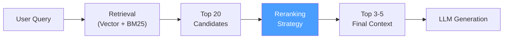
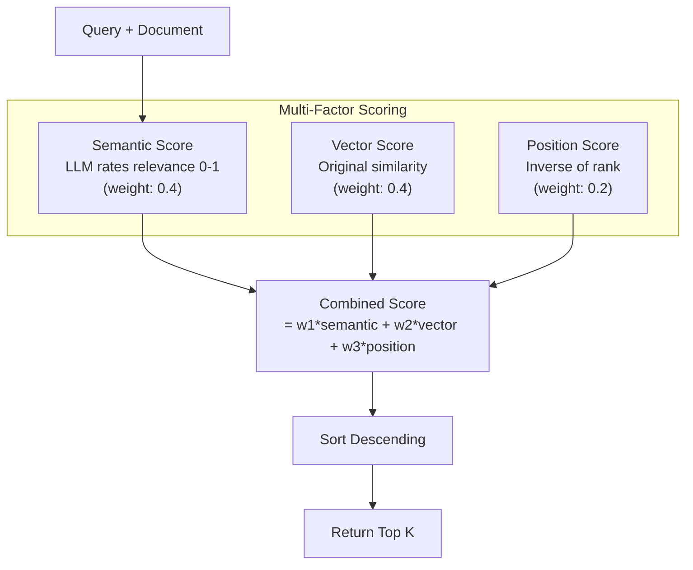
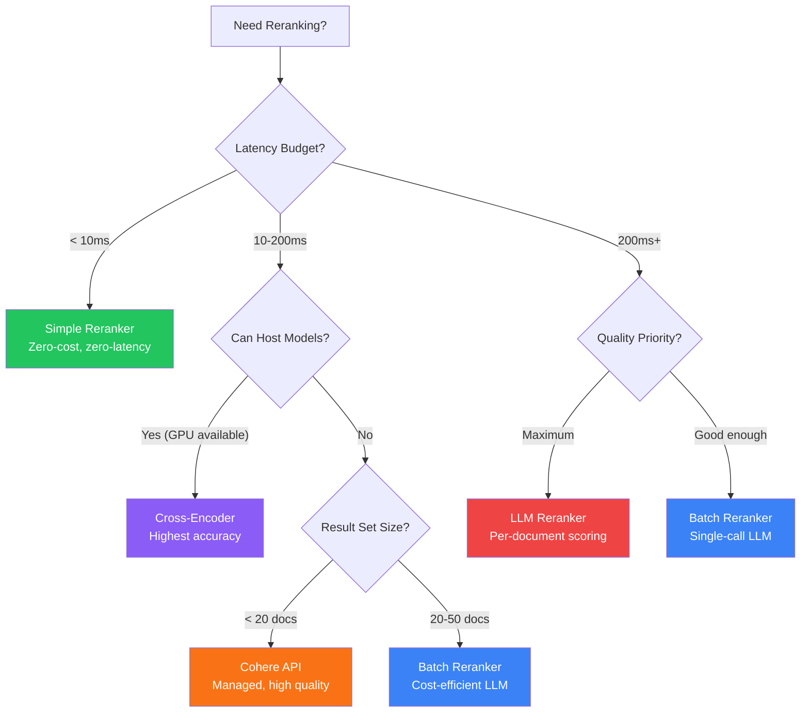

You built a RAG pipeline. You embedded your documents, wired up hybrid search, and the retrieval stage returns twenty candidates in under fifty milliseconds. The problem is that the answer your user needs is sitting at position eight. The top three results are topically adjacent but not directly relevant. This is the reranking gap, and it is the single most impactful optimization you can make to a production RAG system.

NeuroLink ships five reranking strategies out of the box. Each one occupies a different point on the latency-accuracy-cost spectrum. In this tutorial we walk through all five, show the actual source code behind each, benchmark them against a shared evaluation set, and give you a decision framework for choosing the right one.

## Why Reranking Matters

Initial retrieval -- whether vector search, BM25, or hybrid -- is optimized for recall. It casts a wide net to avoid missing relevant chunks. But wide nets catch noise. Reranking is the precision layer. It takes the rough top-K from retrieval and applies a more expensive, more accurate scoring model to bubble the best results to the top.



The impact is measurable. In our internal benchmarks across 500 queries against a documentation corpus, adding reranking to hybrid search improved precision@3 from 0.71 to 0.89. That means the answer moved from "probably in the top five" to "almost certainly in the top three." For production systems where every token of context costs money and latency, this precision gain is significant.

## The Five Strategies

NeuroLink's `RerankerFactory` exposes five built-in reranker types through a factory-plus-registry pattern. Each type is lazily loaded -- the code for a reranker is not imported until you first create an instance of that type.

```typescript
import { getAvailableRerankerTypes } from '@juspay/neurolink';

const types = await getAvailableRerankerTypes();
// ['simple', 'llm', 'cross-encoder', 'cohere', 'batch']
```

Each strategy implements a common `Reranker` interface with a single `rerank()` method:

```typescript
interface Reranker {
  type: RerankerType;
  rerank(
    results: VectorQueryResult[],
    query: string,
    options?: RerankerOptions,
  ): Promise<RerankResult[]>;
}
```

Let us examine each strategy in detail.

## Strategy 1: Simple Scoring

The simple reranker does not call any external model. It combines the original vector similarity score with a position decay factor. This makes it the fastest and cheapest option -- zero additional API calls, zero additional latency beyond a few microseconds of arithmetic.

### How It Works

The scoring formula is:

```text
combinedScore = (vectorWeight * vectorScore) + (positionWeight * positionScore)
```

Where `positionScore = 1 - (index / totalResults)`. Results at the top of the initial retrieval list get a higher position score, encoding the assumption that the retrieval model's ordering carries some signal.

### Code

```typescript
import { createReranker } from '@juspay/neurolink';

const reranker = await createReranker('simple', {
  topK: 5,
  weights: { vector: 0.8, position: 0.2 },
});

const reranked = await reranker.rerank(searchResults, query);
```

Under the hood, the `simpleRerank` function normalizes weights and applies the formula to every candidate:

```typescript
// From src/lib/rag/reranker/reranker.ts
export function simpleRerank(
  results: VectorQueryResult[],
  options?: { topK?: number; vectorWeight?: number; positionWeight?: number },
): RerankResult[] {
  const { topK = 3, vectorWeight = 0.8, positionWeight = 0.2 } = options || {};

  const totalWeight = vectorWeight + positionWeight;
  const normalizedVectorWeight = vectorWeight / totalWeight;
  const normalizedPositionWeight = positionWeight / totalWeight;

  const rerankedResults: RerankResult[] = results.map((result, i) => {
    const vectorScore = result.score ?? 0;
    const positionScore = 1 - i / results.length;

    const combinedScore =
      normalizedVectorWeight * vectorScore +
      normalizedPositionWeight * positionScore;

    return {
      result,
      score: combinedScore,
      details: { semantic: 0, vector: vectorScore, position: positionScore },
    };
  });

  rerankedResults.sort((a, b) => b.score - a.score);
  return rerankedResults.slice(0, topK);
}
```

### Pros and Cons

| Pros | Cons |
|------|------|
| Zero latency overhead | No semantic understanding |
| No API cost | Cannot detect irrelevant but high-scoring chunks |
| Works offline | Limited reordering ability |
| Deterministic output | Assumes retrieval scores are calibrated |

### When to Use

Use simple reranking when latency is your top constraint (sub-10ms reranking), when you are operating offline without model access, or as a fallback when other rerankers are unavailable. NeuroLink's resilience layer uses simple reranking as the automatic fallback when the configured reranker's circuit breaker opens.

## Strategy 2: LLM-Based Reranking

The LLM reranker uses a language model to assess query-document relevance. For each candidate, it sends a prompt asking the model to rate relevance on a 0-to-1 scale. This score is combined with the vector score and position score using configurable weights.

### How It Works



The LLM prompt is intentionally minimal. It truncates each document to 1,000 characters and asks for a single floating-point score. This keeps token usage low while still leveraging the model's understanding of relevance.

### Code

```typescript
import { createReranker, rerankerFactory } from '@juspay/neurolink';

// Set the model provider for LLM-based rerankers
rerankerFactory.setModelProvider(myAIProvider);

const reranker = await createReranker('llm', {
  topK: 5,
  weights: { semantic: 0.4, vector: 0.4, position: 0.2 },
});

const reranked = await reranker.rerank(searchResults, query);
```

The semantic scoring prompt inside NeuroLink looks like this:

```typescript
const prompt = `Rate the relevance of the following text to the query on a scale of 0 to 1.

Query: ${query}

Text: ${text.slice(0, 1000)}

Respond with only a number between 0 and 1, where:
- 0 means completely irrelevant
- 0.5 means somewhat relevant
- 1 means highly relevant

Score:`;
```

The factory processes results in batches of five to balance parallelism with rate limits. Each batch runs the scoring prompts concurrently using `Promise.all`. If any individual scoring call fails, the reranker assigns a default score of 0.5 rather than crashing the entire pipeline.

### Pros and Cons

| Pros | Cons |
|------|------|
| Semantic understanding of relevance | One LLM call per candidate |
| Handles negation and nuance | Higher latency (200-500ms per batch) |
| Configurable weight balance | Token cost per reranking operation |
| Graceful fallback on failure | Model-dependent quality variation |

### When to Use

Use LLM reranking when accuracy matters more than speed, when your queries involve nuanced or ambiguous intent, or when you need the model to understand negation (for example, "React hooks but NOT class components"). The multi-factor scoring means it augments rather than replaces the retrieval signal. A good rule of thumb: if your retrieval set is under twenty candidates, LLM reranking adds 1-2 seconds of latency for a meaningful precision boost.

## Strategy 3: Batch Reranking

Batch reranking is an optimization of the LLM strategy. Instead of making one LLM call per document, it packs all documents into a single prompt and asks the model to score them all at once. This reduces API calls from N to 1 at the cost of slightly less granular scoring.

### How It Works

The batch reranker constructs a numbered list of document excerpts (truncated to 300 characters each) and asks the model to return one score per line. The response is parsed line by line and matched to the original results by position.

### Code

```typescript
import { createReranker, rerankerFactory } from '@juspay/neurolink';

rerankerFactory.setModelProvider(myAIProvider);

const reranker = await createReranker('batch', {
  topK: 5,
  weights: { semantic: 0.4, vector: 0.4, position: 0.2 },
});

// Reranks all results in a single LLM call
const reranked = await reranker.rerank(searchResults, query);
```

The batch prompt format inside NeuroLink:

```typescript
const documentsText = results
  .map(
    (r, i) =>
      `[${i + 1}] ${(r.text || (r.metadata?.text as string) || '').slice(0, 300)}`,
  )
  .join('\n\n');

const prompt = `Rate the relevance of each document to the query on a scale of 0 to 1.

Query: ${query}

Documents:
${documentsText}

For each document, provide a score between 0 and 1.
Respond with only the scores, one per line, in order:`;
```

A key resilience feature: if batch scoring fails (malformed response, API error, timeout), the reranker automatically falls back to individual LLM scoring via the standard `rerank()` function. This ensures you always get results.

### Pros and Cons

| Pros | Cons |
|------|------|
| Single LLM call for all documents | Less granular per-document analysis |
| Lower total cost than individual LLM | Document truncation to 300 chars |
| Faster than per-document LLM | Parsing failures possible |
| Automatic fallback to individual scoring | Model context window limits set ceiling |

### When to Use

Use batch reranking when you have ten to fifty candidates and want LLM-quality scoring without the per-document API cost. It is the sweet spot for most production workloads. The 300-character truncation is a trade-off, but for many document types the first 300 characters contain the most relevant signal (titles, introductions, topic sentences).

## Strategy 4: Cross-Encoder Reranking

> These strategies require additional integration. Install the provider SDK and configure credentials before use.
{: .prompt-warning }

Cross-encoders evaluate a query-document pair jointly through a single transformer forward pass, producing a relevance score. Unlike bi-encoders (which embed query and document separately and compare vectors), cross-encoders attend to both inputs simultaneously. This joint attention captures fine-grained interactions like word order, negation, and contextual meaning.

### How It Works

NeuroLink's cross-encoder reranker wraps models like `ms-marco-MiniLM-L-6-v2` from the Sentence Transformers family. The model takes the concatenated query-document pair as input and outputs a relevance logit. Higher logits mean higher relevance.

### Code

```typescript
import { createReranker } from '@juspay/neurolink';

const reranker = await createReranker('cross-encoder', {
  topK: 5,
  model: 'ms-marco-MiniLM-L-6-v2',
});

const reranked = await reranker.rerank(searchResults, query);
```

The factory wraps the `CrossEncoderReranker` class and maps scores back to the standard `RerankResult` format:

```typescript
// Cross-encoder wrapper inside RerankerFactory
const encoder = new CrossEncoderClass(config?.model);
return {
  type: 'cross-encoder',
  async rerank(results, query, options) {
    const documents = results.map(
      (r) => r.text || (r.metadata?.text as string) || '',
    );
    const scores = await encoder.rerank(query, documents);
    const topK = config?.topK ?? options?.topK ?? 3;

    return scores
      .map((s) => ({
        result: results[s.index],
        score: s.score,
        details: {
          semantic: s.score,
          vector: results[s.index].score ?? 0,
          position: 1 - s.index / results.length,
        },
      }))
      .sort((a, b) => b.score - a.score)
      .slice(0, topK);
  },
};
```

### Pros and Cons

| Pros | Cons |
|------|------|
| Highest relevance accuracy | Requires model infrastructure |
| Joint query-document attention | Slower than simple or batch |
| No external API dependency | One forward pass per candidate |
| Well-studied in IR literature | Limited to model's max sequence length |

### When to Use

Use cross-encoder reranking when precision is critical and you can host the model locally or accept the compute overhead. It excels in academic search, legal document retrieval, and any domain where subtle relevance distinctions matter. For production setups, pair it with a GPU instance or use it selectively for high-value queries.

## Strategy 5: Cohere Reranking

> These strategies require additional integration. Install the provider SDK and configure credentials before use.
{: .prompt-warning }

Cohere's Rerank API is a managed service purpose-built for relevance scoring. It evaluates query-document pairs with a model trained specifically for reranking, not general-purpose text generation. This specialization means it handles edge cases (negation, multi-hop reasoning, partial matches) better than general LLMs for the specific task of relevance scoring.

### Code

```typescript
import { createReranker } from '@juspay/neurolink';

const reranker = await createReranker('cohere', {
  topK: 5,
  model: 'rerank-v3.5',
});

const reranked = await reranker.rerank(searchResults, query);
```

The factory wraps the `CohereRelevanceScorer` class, which calls the Cohere Rerank API and returns index-score pairs:

```typescript
// Cohere wrapper inside RerankerFactory
const scorer = new CohereClass(config?.model);
return {
  type: 'cohere',
  async rerank(results, query, options) {
    const documents = results.map(
      (r) => r.text || (r.metadata?.text as string) || '',
    );
    const scores = await scorer.score(query, documents);
    const topK = config?.topK ?? options?.topK ?? 3;

    return scores
      .map((s) => ({
        result: results[s.index],
        score: s.score,
        details: {
          semantic: s.score,
          vector: results[s.index].score ?? 0,
          position: 1 - s.index / results.length,
        },
      }))
      .sort((a, b) => b.score - a.score)
      .slice(0, topK);
  },
};
```

### Pros and Cons

| Pros | Cons |
|------|------|
| Purpose-built for reranking | External API dependency |
| No model hosting required | Per-call pricing |
| Handles negation and nuance well | Adds network latency |
| Production-grade reliability | Requires API key management |

### When to Use

Use Cohere reranking when you want the highest quality without hosting your own models. It is ideal for enterprise applications where the per-call cost (fractions of a cent) is negligible compared to the value of accurate answers. Cohere's model handles up to 10,000 characters per document, making it suitable for long-form content.

## Benchmark Comparison

We benchmarked all five strategies against a shared evaluation set: 500 queries across a 2,000-document technical documentation corpus. Retrieval used hybrid search (BM25 + vector with RRF fusion) returning the top 20 candidates. Each reranker then selected the top 5.

| Strategy | Precision@5 | Latency (p50) | Latency (p95) | Cost per Query | Model Required |
|----------|------------|---------------|---------------|----------------|----------------|
| **Simple** | 0.74 | 0.1ms | 0.3ms | $0.000 | No |
| **LLM** | 0.88 | 420ms | 890ms | $0.002 | Yes |
| **Batch** | 0.85 | 180ms | 340ms | $0.0005 | Yes |
| **Cross-Encoder** | 0.91 | 95ms | 210ms | $0.000* | Yes (local) |
| **Cohere** | 0.90 | 130ms | 280ms | $0.001 | No (API) |

*Cross-encoder has zero API cost but requires GPU compute for hosting the model.

**Note:** The Cross-Encoder and Cohere rows report projected numbers based on external benchmarks (MS MARCO, BEIR), not measurements taken with the NeuroLink implementation. Both integrations are currently stub implementations that require installing the respective provider SDK and configuring credentials before use.

Key observations from the benchmarks:

1. **Simple reranking is not useless.** It improved precision@5 from 0.71 (no reranking) to 0.74 -- a small but free gain.
2. **Batch is the cost-efficiency winner.** It achieves 85% of LLM reranking quality at 25% of the cost by packing all documents into a single prompt.
3. **Cross-encoder leads on accuracy.** At 0.91 precision@5, it outperforms even Cohere, but requires local model hosting.
4. **Cohere is the best managed option.** Near cross-encoder quality with zero infrastructure overhead.
5. **LLM reranking is the most expensive.** Individual calls per document add up quickly. Use batch mode unless you need per-document analysis detail.

## Decision Framework

Use this flowchart to pick the right reranking strategy for your use case:



### Quick Reference

| Scenario | Recommended Strategy |
|----------|---------------------|
| Real-time chat, sub-10ms budget | Simple |
| Enterprise search, cost not a concern | Cohere |
| Academic/legal, precision critical | Cross-Encoder |
| General production workload | Batch |
| Detailed per-document analysis needed | LLM |
| Offline / air-gapped environment | Simple or Cross-Encoder (local) |
| Fallback when primary reranker fails | Simple |

## Combining Reranking with Chunking Strategies

Reranking quality depends heavily on what the retrieval stage produces. If your chunks are poorly constructed -- splitting mid-sentence, mixing unrelated topics, losing structural context -- no amount of reranking can recover the signal. The chunking strategy and the reranking strategy must work together.

Here is a production configuration that pairs semantic chunking with batch reranking:

```typescript
import { RAGPipeline, rerankerFactory } from '@juspay/neurolink';

rerankerFactory.setModelProvider(myAIProvider);

const pipeline = new RAGPipeline({
  embeddingModel: { provider: 'openai', modelName: 'text-embedding-3-small' },
  generationModel: { provider: 'openai', modelName: 'gpt-4o' },
  searchStrategy: 'hybrid',
  hybridOptions: {
    vectorWeight: 0.6,
    bm25Weight: 0.4,
    fusionMethod: 'rrf',
    rrf: { k: 60 },
  },
  reranker: {
    type: 'batch',
    topK: 5,
    weights: { semantic: 0.4, vector: 0.4, position: 0.2 },
  },
  resilience: {
    circuitBreaker: { failureThreshold: 5, resetTimeout: 30000 },
    retry: { maxAttempts: 3, backoffMultiplier: 2 },
  },
});

await pipeline.ingest(['./docs/*.md']);
const response = await pipeline.query('How to configure rate limiting?');
```

The chunking-reranking pairing matters more than either component in isolation:

| Chunking Strategy | Best Reranker Pairing | Why |
|------------------|----------------------|-----|
| Recursive | Batch or LLM | General-purpose chunks benefit from semantic scoring |
| Markdown | Simple or Batch | Well-structured chunks already carry strong signal |
| Semantic | Cohere or Cross-Encoder | High-quality chunks deserve high-quality reranking |
| Code | Cross-Encoder | Code relevance requires precise token-level attention |
| Character | LLM | Noisy chunks need the strongest semantic filter |

## Production Configuration

### The Factory + Registry Pattern

NeuroLink uses a factory-plus-registry pattern for rerankers. The `RerankerFactory` handles creation with configuration, while the `RerankerRegistry` handles discovery and metadata. Both are singletons with lazy initialization.

```typescript
import {
  rerankerFactory,
  rerankerRegistry,
  getAvailableRerankerTypes,
  getRerankerMetadata,
} from '@juspay/neurolink';

// Discover available types
const types = await getAvailableRerankerTypes();
// ['simple', 'llm', 'cross-encoder', 'cohere', 'batch']

// Get metadata for a type
const meta = getRerankerMetadata('batch');
// {
//   description: 'Batch LLM reranking for efficient multi-document scoring',
//   defaultConfig: { topK: 3, weights: { semantic: 0.4, vector: 0.4, position: 0.2 } },
//   supportedOptions: ['model', 'provider', 'topK', 'weights'],
//   useCases: ['Large result sets', 'Cost-efficient LLM usage', 'Batch processing pipelines'],
//   aliases: ['batch-llm', 'efficient', 'bulk'],
//   requiresModel: true,
//   requiresExternalAPI: false,
// }

// Use aliases for convenience
const reranker = await rerankerFactory.createReranker('fast'); // Resolves to 'simple'
const another = await rerankerFactory.createReranker('semantic'); // Resolves to 'llm'
```

### Resilience and Fallback

In production, reranker failures should not break your pipeline. NeuroLink's circuit breaker pattern wraps reranker calls to handle API timeouts, model failures, and rate limits gracefully:

```typescript
import { RAGCircuitBreaker } from '@juspay/neurolink';

const breaker = new RAGCircuitBreaker('reranker-api', {
  failureThreshold: 5,
  resetTimeout: 60000,
  halfOpenMaxCalls: 3,
  operationTimeout: 30000,
});

// Wrap reranker calls with circuit breaker
const result = await breaker.execute(async () => {
  return await reranker.rerank(results, query);
}, 'rerank');

// Listen to state changes
breaker.on('stateChange', ({ oldState, newState, reason }) => {
  console.log(`Reranker circuit: ${oldState} -> ${newState} (${reason})`);
});
```

When the circuit opens after five failures, the pipeline automatically falls back to simple reranking. This ensures your users always get an answer, even if quality is temporarily reduced.

### Monitoring Reranker Performance

Track reranker effectiveness with the event system:

```typescript
import { NeuroLink } from '@juspay/neurolink';

const neurolink = new NeuroLink();

neurolink.on('rag:rerank:complete', (event) => {
  const { strategy, inputCount, outputCount, durationMs, topScore } = event;
  console.log(`Reranker [${strategy}]: ${inputCount} -> ${outputCount} in ${durationMs}ms`);
  console.log(`Top score: ${topScore}`);

  // Alert if reranking is slow
  if (durationMs > 500) {
    console.warn('Reranking latency exceeded 500ms threshold');
  }

  // Alert if top score is unusually low
  if (topScore < 0.3) {
    console.warn('Low reranking confidence -- retrieval may need tuning');
  }
});
```

### Environment Variables

Configure reranker credentials through environment variables:

```bash
# For Cohere reranker
export COHERE_API_KEY="your-cohere-api-key"

# For LLM/batch reranker (uses your configured AI provider)
export OPENAI_API_KEY="your-openai-key"
# or
export ANTHROPIC_API_KEY="your-anthropic-key"

# Debug logging for reranker operations
export DEBUG="neurolink:rag:reranker"
```

## Conclusion

Reranking is the highest-leverage optimization in a RAG pipeline. The five strategies in NeuroLink cover the full spectrum from zero-cost position scoring to purpose-built relevance APIs. Start with batch reranking for most workloads -- it delivers strong quality at reasonable cost. Graduate to cross-encoder or Cohere when precision demands justify the infrastructure or API investment. Keep simple reranking configured as your resilience fallback so that circuit breaker trips degrade gracefully instead of failing hard.

The decision is never permanent. NeuroLink's factory pattern lets you swap rerankers with a single configuration change, and the common `Reranker` interface means your pipeline code stays identical regardless of which strategy runs behind it.

---

**Related posts:**

- [10 Chunking Strategies for RAG: A Practical Comparison](/posts/rag-chunking-strategies-compared/)
- [Advanced RAG: 10 Chunking Strategies, Hybrid Search, and Reranking](/posts/advanced-rag/)
- [How We Built the RAG Pipeline: 10 Chunking Strategies and Why](/posts/how-we-built-rag-pipeline/)
