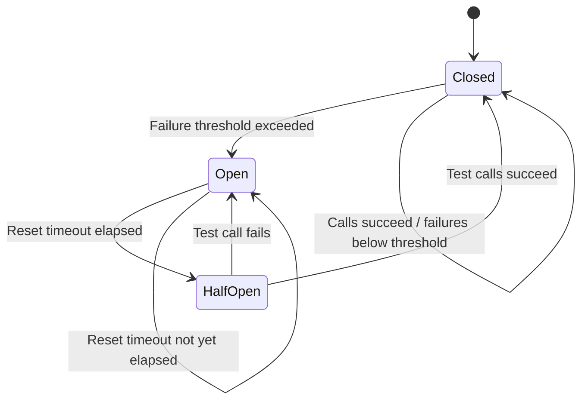
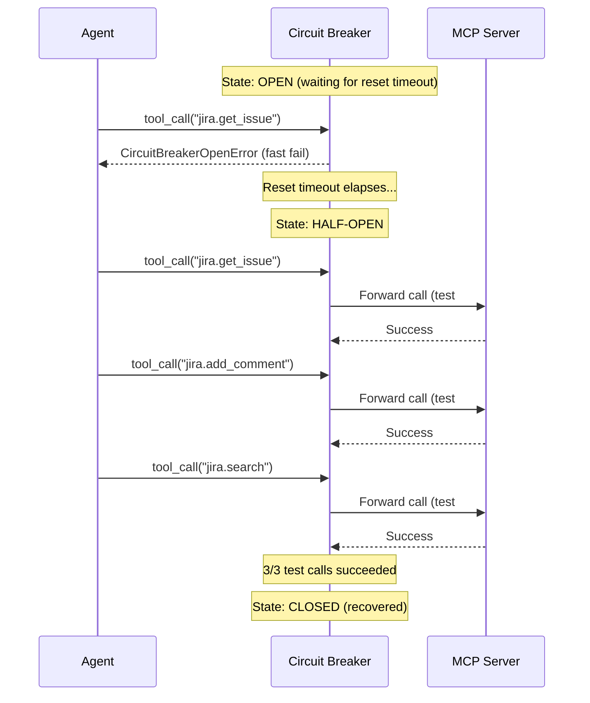
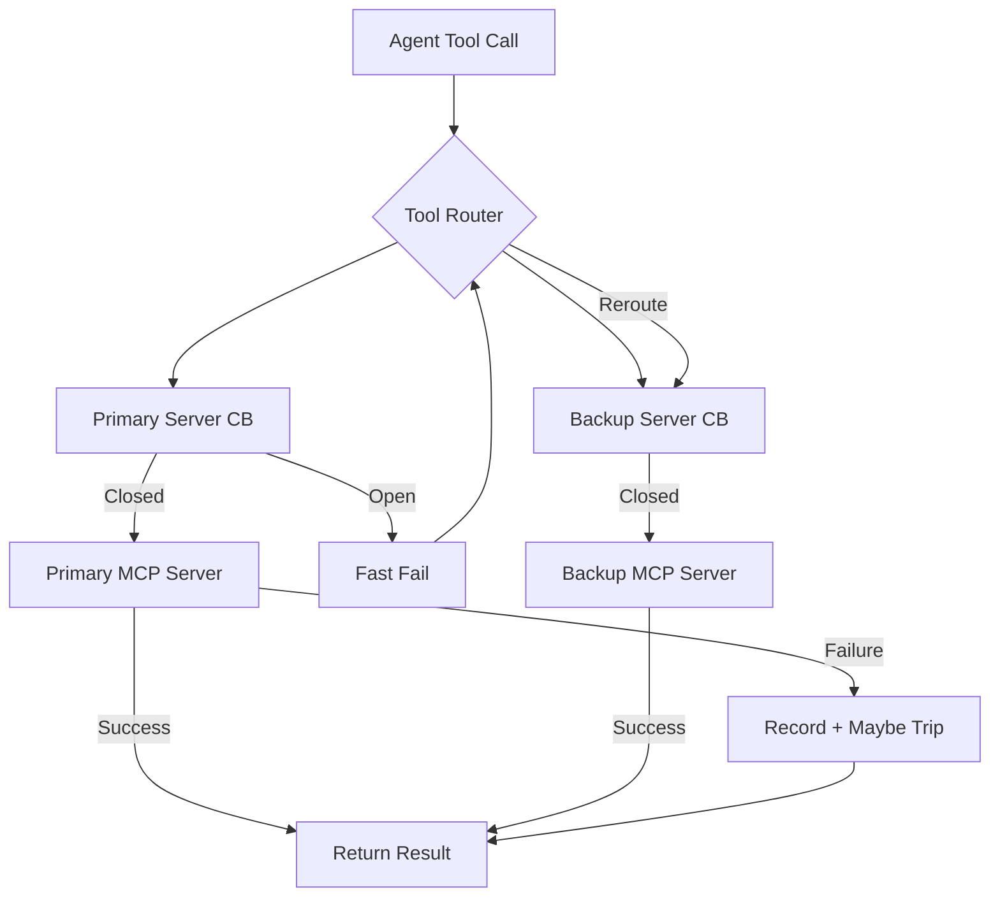
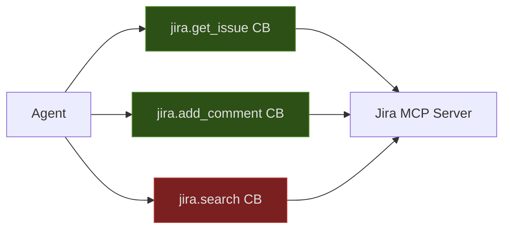

We designed NeuroLink's MCP circuit breaker because a single flaky Jira MCP server was taking down entire AI agent workflows. One tool returning timeouts should not cascade into every other tool call queuing up behind it, exhausting connection pools, and eventually crashing the whole system. The circuit breaker pattern -- borrowed from electrical engineering and popularized by Michael Nygard's "Release It!" -- gives us a clean abstraction for isolating failures and letting the system heal itself.

This post walks through the real implementation in NeuroLink's codebase: the state machine, the MCP-specific failure modes it handles, the configuration surface, and the production monitoring patterns we use to keep hundreds of MCP tool connections healthy at scale.

## The cascading failure problem

When an AI agent calls external tools via MCP, each tool call is a network request to an external process -- a Bitbucket server, a Jira instance, a database query tool, a Slack integration. In a typical agentic workflow, the model might chain five or six tool calls in sequence. If the first tool hangs for 30 seconds before timing out, every subsequent call stacks up behind it.

Here is what happens without a circuit breaker:

```text
Agent Request
  -> tool_call("jira.get_issue", {key: "BZ-1234"})     [TIMEOUT 30s]
  -> tool_call("jira.add_comment", {key: "BZ-1234"})   [TIMEOUT 30s]
  -> tool_call("bitbucket.create_pr", {...})            [TIMEOUT 30s]
  -> tool_call("slack.send_message", {...})             [TIMEOUT 30s]
Total wall time: 120+ seconds for what should be a 2-second workflow
```

The problem compounds when multiple agents share the same MCP server pool. Hundreds of requests pile up against a dead service, exhausting memory, file descriptors, and event loop capacity. The failure of one external dependency becomes a system-wide outage.

A circuit breaker solves this by detecting repeated failures and short-circuiting subsequent calls immediately, without waiting for another timeout. Instead of 30 seconds of wasted time per call, the agent gets an instant error and can route around the failure.

## The circuit breaker state machine

The circuit breaker operates as a three-state finite state machine. Every MCP tool call passes through this state machine before reaching the external server.



### Closed state (normal operation)

In the closed state, all tool calls pass through to the external MCP server. The circuit breaker records every call outcome -- success or failure -- in a sliding time window. As long as the failure count stays below the configured threshold, the circuit remains closed.

```typescript
// From NeuroLink's MCPCircuitBreaker
// Default configuration
const config: CircuitBreakerConfig = {
  failureThreshold: 5,          // Open after 5 failures
  resetTimeout: 60000,          // Wait 60s before attempting recovery
  halfOpenMaxCalls: 3,          // Allow 3 test calls in half-open
  operationTimeout: 60000,      // Individual call timeout
  minimumCallsBeforeCalculation: 10,  // Need 10 calls before evaluating
  statisticsWindowSize: 300000, // 5-minute sliding window
};
```

The `minimumCallsBeforeCalculation` parameter prevents the circuit from tripping on the first few calls during startup. You need a statistically meaningful sample before making decisions about service health.

### Open state (failure isolation)

When failures hit the threshold, the circuit opens. Every subsequent call is rejected immediately with a `CircuitBreakerOpenError` -- no network request, no timeout wait, no resource consumption.

```typescript
// NeuroLink's CircuitBreakerOpenError provides structured metadata
// so the AI model and downstream consumers can reason about the failure
export class CircuitBreakerOpenError extends Error {
  readonly breakerName: string;    // e.g., "tool-execution-jira-get_issue"
  readonly retryAfter: string;     // ISO timestamp for next retry window
  readonly retryAfterMs: number;   // Milliseconds until retry
  readonly breakerState: CircuitBreakerState;
  readonly failureCount: number;   // Failures that caused the trip

  // Example error message:
  // "Circuit breaker 'tool-execution-jira-get_issue' is open.
  //  Tool temporarily unavailable after 5 failures.
  //  Retry after: 2026-03-27T04:31:00.000Z (60s)."
}
```

This is critical for AI agents. The structured error gives the model enough context to make intelligent decisions: skip the tool, try an alternative, or inform the user about a temporary limitation.

### Half-open state (recovery probing)

After the reset timeout elapses, the circuit transitions to half-open. A limited number of test calls are allowed through to probe whether the external service has recovered.



If any test call fails during the half-open phase, the circuit immediately snaps back to open with a fresh reset timeout. This prevents the system from hammering a service that is only partially recovered.

## MCP-specific failure modes

MCP tool calls fail differently from standard HTTP requests. The circuit breaker needs to handle failure modes unique to the MCP protocol and the way AI agents interact with tools.

### Server startup latency

MCP servers often need significant startup time -- especially when spawning external processes via stdio transport. The default operation timeout in NeuroLink is 60 seconds (configurable via `MCP_OPERATION_TIMEOUT` environment variable), specifically to accommodate this:

```typescript
// From NeuroLink's mcpCircuitBreaker.ts
const DEFAULT_OPERATION_TIMEOUT = Math.max(
  10000,
  Number(process.env.MCP_OPERATION_TIMEOUT) || 60000,
);
```

The `Math.max(10000, ...)` floor prevents misconfiguration from setting dangerously low timeouts. A 1-second timeout on an MCP server that needs 5 seconds to initialize would cause immediate circuit trips on every cold start.

### Transport-layer failures

MCP supports multiple transport protocols -- stdio, SSE, WebSocket, HTTP, TCP, and Unix sockets. Each has distinct failure characteristics:

| Transport | Common Failure | Circuit Breaker Behavior |
|-----------|----------------|--------------------------|
| stdio | Process crash/exit | Immediate failure recording |
| SSE | Connection drop | Timeout-based detection |
| WebSocket | Frame errors | Immediate failure recording |
| HTTP | 5xx responses | Failure with status metadata |

### Half-open call limiting

Unlike a typical HTTP circuit breaker that might allow a single test request, NeuroLink's implementation allows up to `halfOpenMaxCalls` (default 3) test calls before deciding to close the circuit. This accounts for MCP tools that need multiple successful interactions to warm up their state:

```typescript
// In the execute method
if (this.state === "half-open" &&
    this.halfOpenCalls >= this.config.halfOpenMaxCalls) {
  // Half-open call limit exceeded -- revert to open
  this.lastFailureTime = Date.now();
  this.changeState("open",
    "Half-open call limit reached, reverting to open");

  throw new CircuitBreakerOpenError({
    breakerName: this.name,
    retryAfter: new Date(
      this.lastFailureTime + this.config.resetTimeout
    ),
    retryAfterMs: this.config.resetTimeout,
    breakerState: "open",
    failureCount: this.getStats().failedCalls,
  });
}
```

## Implementation walkthrough

The `MCPCircuitBreaker` class extends Node.js `EventEmitter` to provide real-time observability hooks. Let us walk through the core execution flow.

### The execute method

Every MCP tool call passes through `execute()`. This single method encapsulates the entire state machine:

```typescript
async execute<T>(operation: () => Promise<T>): Promise<T> {
  const startTime = Date.now();

  try {
    // 1. Check if circuit is open
    if (this.state === "open") {
      const retryAfterMs =
        this.config.resetTimeout - (Date.now() - this.lastFailureTime);
      if (retryAfterMs > 0) {
        throw new CircuitBreakerOpenError({
          breakerName: this.name,
          retryAfter: new Date(
            this.lastFailureTime + this.config.resetTimeout
          ),
          retryAfterMs,
          breakerState: "open",
          failureCount: this.getStats().failedCalls,
        });
      }
      // Transition to half-open
      this.changeState("half-open", "Reset timeout reached");
    }

    // 2. Execute with timeout protection
    const result = await Promise.race([
      operation(),
      this.timeoutPromise<T>(this.config.operationTimeout),
    ]);

    // 3. Record success and handle state transitions
    this.recordCall(true, Date.now() - startTime);

    if (this.state === "half-open") {
      this.halfOpenCalls++;
      if (this.halfOpenCalls >= this.config.halfOpenMaxCalls) {
        this.changeState("closed", "Half-open test successful");
      }
    }

    return result;
  } catch (error) {
    // 4. Record failure and evaluate threshold
    this.recordCall(false, Date.now() - startTime);

    if (this.state === "half-open") {
      this.changeState("open",
        `Half-open test failed: ${error.message}`);
    } else if (this.state === "closed") {
      this.checkFailureThreshold();
    }

    throw error;
  }
}
```

The `Promise.race` with `timeoutPromise` ensures that even if the MCP server hangs indefinitely, the circuit breaker will still detect the failure and record it within the configured timeout window.

### Failure threshold evaluation

The threshold check uses a sliding time window rather than a simple counter. This is important because a burst of 5 failures followed by 1000 successes should not keep the circuit open:

```typescript
private checkFailureThreshold(): void {
  const windowStart = Date.now() - this.config.statisticsWindowSize;
  const windowCalls = this.callHistory.filter(
    (call) => call.timestamp >= windowStart
  );

  // Need minimum calls before calculating failure rate
  if (windowCalls.length < this.config.minimumCallsBeforeCalculation) {
    return;
  }

  const failedCalls = windowCalls.filter(
    (call) => !call.success
  ).length;

  // Open circuit if failure count exceeds threshold
  if (failedCalls >= this.config.failureThreshold) {
    this.changeState("open",
      `Failure threshold exceeded: ${failedCalls} failures`);

    this.emit("circuitOpen", {
      failureRate: failedCalls / windowCalls.length,
      totalCalls: windowCalls.length,
      timestamp: new Date(),
    });
  }
}
```

The `minimumCallsBeforeCalculation` parameter (default 10) prevents premature circuit trips during low-traffic periods. If you have only made 3 calls and 2 failed, that is a 67% failure rate -- but it is not statistically meaningful enough to justify isolating the service.

## Configuration

NeuroLink exposes the full configuration surface through the `CircuitBreakerConfig` type:

```typescript
type CircuitBreakerConfig = {
  /** Number of failures before opening the circuit */
  failureThreshold: number;        // default: 5

  /** Time to wait before attempting reset (ms) */
  resetTimeout: number;            // default: 60000

  /** Maximum calls allowed in half-open state */
  halfOpenMaxCalls: number;        // default: 3

  /** Timeout for individual operations (ms) */
  operationTimeout: number;        // default: 60000

  /** Minimum calls before calculating failure rate */
  minimumCallsBeforeCalculation: number;  // default: 10

  /** Window size for calculating failure rate (ms) */
  statisticsWindowSize: number;    // default: 300000 (5 min)
};
```

### Tuning guidelines

The right configuration depends on your tool's characteristics:

| Tool Profile | failureThreshold | resetTimeout | halfOpenMaxCalls | operationTimeout |
|---|---|---|---|---|
| Fast API (Slack, GitHub) | 5 | 30000 | 2 | 10000 |
| Database query tool | 3 | 60000 | 3 | 30000 |
| Long-running analysis | 5 | 120000 | 1 | 120000 |
| Flaky external service | 10 | 30000 | 5 | 15000 |
| MCP stdio server (cold start) | 5 | 60000 | 3 | 60000 |

For flaky services, increase the `failureThreshold` to avoid thrashing between open and closed states. For services with expensive recovery, increase `resetTimeout` to give them more breathing room.

## Monitoring and alerting

The circuit breaker emits events through Node.js `EventEmitter`, which integrates with OpenTelemetry tracing for production observability.

### Event-driven monitoring

```typescript
const breaker = new MCPCircuitBreaker("jira-tools", {
  failureThreshold: 5,
  resetTimeout: 60000,
});

// Monitor state transitions
breaker.on("stateChange", (event) => {
  console.log(`[${event.timestamp.toISOString()}] ` +
    `Circuit ${event.oldState} -> ${event.newState}: ` +
    `${event.reason}`);

  // Alert on circuit open
  if (event.newState === "open") {
    alerting.send({
      severity: "warning",
      message: `MCP circuit breaker opened: jira-tools`,
      details: event.reason,
    });
  }
});

// Track failure patterns
breaker.on("callFailure", (event) => {
  metrics.increment("mcp.circuit_breaker.failures", {
    breaker: "jira-tools",
    duration_ms: event.duration,
  });
});

// Track recovery
breaker.on("circuitClosed", (event) => {
  metrics.increment("mcp.circuit_breaker.recoveries", {
    breaker: "jira-tools",
  });
});
```

### OpenTelemetry integration

NeuroLink's circuit breaker records state transitions and half-open test events directly on the active OpenTelemetry span:

```typescript
// Recorded automatically on state change
activeSpan.addEvent("circuit.state_change", {
  "circuit.name": this.name,
  "circuit.from_state": oldState,
  "circuit.to_state": newState,
  "circuit.reason": reason,
  "circuit.failure_count": failureCount,
});

// Recorded during half-open test calls
activeSpan.addEvent("circuit.half_open_test", {
  "circuit.name": this.name,
  "circuit.half_open_call": currentCall,
  "circuit.half_open_max_calls": maxCalls,
});
```

These span events appear in your tracing backend (Jaeger, Grafana Tempo, Honeycomb) and let you correlate circuit breaker behavior with specific agent requests.

### Health dashboard

The `CircuitBreakerManager` provides a fleet-wide health view across all managed breakers:

```typescript
const manager = globalCircuitBreakerManager;

// Get health summary for all breakers
const health = manager.getHealthSummary();
// {
//   totalBreakers: 12,
//   closedBreakers: 10,
//   openBreakers: 1,
//   halfOpenBreakers: 1,
//   unhealthyBreakers: ["jira-tools"]
// }

// Get detailed stats for every breaker
const allStats = manager.getAllStats();
// {
//   "jira-tools": { state: "open", failureRate: 0.6, ... },
//   "bitbucket-tools": { state: "closed", failureRate: 0.02, ... },
//   "slack-tools": { state: "half-open", failureRate: 0.3, ... },
// }
```

## Integration with tool routing

The circuit breaker pattern becomes especially powerful when combined with NeuroLink's MCP tool routing system. When a circuit opens, the tool router can automatically redirect calls to a backup server.



Here is how you wire this up in practice:

```typescript
import {
  MCPCircuitBreaker,
  CircuitBreakerManager,
} from "@juspay/neurolink";

const manager = new CircuitBreakerManager();

// Create breakers for primary and backup servers
const primaryBreaker = manager.getBreaker("jira-primary", {
  failureThreshold: 5,
  resetTimeout: 30000,
});
const backupBreaker = manager.getBreaker("jira-backup", {
  failureThreshold: 3,
  resetTimeout: 60000,
});

async function executeWithFailover<T>(
  toolName: string,
  args: Record<string, unknown>,
  primaryExecute: () => Promise<T>,
  backupExecute: () => Promise<T>,
): Promise<T> {
  // Try primary first
  try {
    return await primaryBreaker.execute(primaryExecute);
  } catch (error) {
    // If primary circuit is open, try backup immediately
    if (error instanceof CircuitBreakerOpenError) {
      console.log(
        `Primary circuit open for ${toolName}, ` +
        `routing to backup`
      );
      return await backupBreaker.execute(backupExecute);
    }
    // For other errors, still try backup
    return await backupBreaker.execute(backupExecute);
  }
}
```

## Testing circuit breakers

Circuit breakers are notoriously difficult to test because they involve time-dependent state transitions. Here are the patterns we use in NeuroLink's test suite.

### Unit testing state transitions

```typescript
import { MCPCircuitBreaker } from "@juspay/neurolink";

describe("MCPCircuitBreaker", () => {
  let breaker: MCPCircuitBreaker;

  beforeEach(() => {
    breaker = new MCPCircuitBreaker("test-breaker", {
      failureThreshold: 3,
      resetTimeout: 1000,
      halfOpenMaxCalls: 2,
      minimumCallsBeforeCalculation: 3,
      statisticsWindowSize: 60000,
      operationTimeout: 5000,
    });
  });

  afterEach(() => {
    breaker.destroy(); // Clean up timers
  });

  it("should open after reaching failure threshold", async () => {
    const failingOp = () =>
      Promise.reject(new Error("Service unavailable"));

    // Fill minimum calls requirement
    for (let i = 0; i < 3; i++) {
      await breaker.execute(failingOp).catch(() => {});
    }

    expect(breaker.isOpen()).toBe(true);

    // Subsequent calls should fail fast
    await expect(
      breaker.execute(() => Promise.resolve("ok"))
    ).rejects.toThrow("Circuit breaker");
  });

  it("should transition to half-open after reset timeout",
    async () => {
      // Trip the circuit
      for (let i = 0; i < 3; i++) {
        await breaker.execute(
          () => Promise.reject(new Error("fail"))
        ).catch(() => {});
      }
      expect(breaker.isOpen()).toBe(true);

      // Wait for reset timeout
      await new Promise((r) => setTimeout(r, 1100));

      // Next call should be allowed (half-open)
      const result = await breaker.execute(
        () => Promise.resolve("recovered")
      );
      expect(result).toBe("recovered");
      expect(breaker.isHalfOpen()).toBe(true);
    }
  );

  it("should close after successful half-open tests",
    async () => {
      // Trip the circuit
      for (let i = 0; i < 3; i++) {
        await breaker.execute(
          () => Promise.reject(new Error("fail"))
        ).catch(() => {});
      }

      // Wait for reset timeout
      await new Promise((r) => setTimeout(r, 1100));

      // Two successful calls should close the circuit
      await breaker.execute(() => Promise.resolve("ok"));
      await breaker.execute(() => Promise.resolve("ok"));

      expect(breaker.isClosed()).toBe(true);
    }
  );
});
```

### Testing with the manager

```typescript
describe("CircuitBreakerManager", () => {
  it("should track fleet health", () => {
    const manager = new CircuitBreakerManager();

    manager.getBreaker("service-a");
    manager.getBreaker("service-b");
    const breakerC = manager.getBreaker("service-c");

    // Force one breaker open
    breakerC.forceOpen("simulated outage");

    const health = manager.getHealthSummary();
    expect(health.totalBreakers).toBe(3);
    expect(health.openBreakers).toBe(1);
    expect(health.unhealthyBreakers).toContain("service-c");

    // Clean up
    manager.destroyAll();
  });
});
```

### Lifecycle and memory leak prevention

The `destroy()` method is essential for preventing memory leaks. Each circuit breaker starts a periodic cleanup timer. If you create breakers dynamically (for example, one per MCP server connection), failing to destroy them will leak timers:

```typescript
// Create a breaker for a temporary MCP connection
const breaker = new MCPCircuitBreaker("temp-server", {
  failureThreshold: 3,
  resetTimeout: 30000,
});

try {
  const result = await breaker.execute(async () => {
    return await mcpServer.callTool("analyze", { data });
  });
  return result;
} finally {
  // Always clean up when the breaker is no longer needed
  breaker.destroy();
  // Clears the interval timer, removes event listeners,
  // and frees the call history array
}
```

The `CircuitBreakerManager.destroyAll()` method should be called during application shutdown to clean up every managed breaker at once.

## Production patterns

### Per-tool breakers

In production, create one circuit breaker per MCP tool rather than per server. A single flaky tool should not take down access to all tools on the same server:



In this scenario, `jira.search` might be timing out due to a complex query, but `jira.get_issue` and `jira.add_comment` continue working fine. Per-tool breakers give you this granularity.

### Graceful shutdown

When your application shuts down, destroy all circuit breakers to prevent timer leaks and flush any pending metrics:

```typescript
process.on("SIGTERM", async () => {
  console.log("Shutting down gracefully...");

  // Destroy all circuit breakers
  globalCircuitBreakerManager.destroyAll();

  // Continue with other shutdown tasks
  await server.close();
  process.exit(0);
});
```

### Manual override

For operational emergencies, the circuit breaker supports manual force-open and reset. This is useful during planned maintenance or when you know a service is about to go down:

```typescript
// Force open during planned maintenance
const jiraBreaker = globalCircuitBreakerManager
  .getBreaker("jira-tools");
jiraBreaker.forceOpen("Planned Jira maintenance window");

// After maintenance completes, manually reset
jiraBreaker.reset();
// Clears all call history and resets to closed state
```

## Conclusion

The circuit breaker pattern is essential infrastructure for any AI system that depends on external tools via MCP. Without it, a single flaky dependency cascades into a system-wide outage. With it, failures are isolated, recovery is automatic, and your agents can make intelligent decisions about routing around problems.

NeuroLink's `MCPCircuitBreaker` provides the three-state machine (closed, open, half-open), sliding window failure detection, configurable thresholds, OpenTelemetry integration, and a fleet-wide manager for monitoring dozens of breakers simultaneously. The implementation sits at the intersection of traditional distributed systems resilience and the specific needs of AI tool orchestration -- handling MCP transport diversity, server startup latency, and the need for structured error metadata that LLMs can reason about.

Start by adding circuit breakers to your most critical MCP tools. Monitor the state transitions in your tracing backend. Tune the thresholds based on observed failure patterns. And always remember to call `destroy()` when you are done.

---

**Related posts:**

- [Advanced MCP: Tool Routing, Caching, and Batching Strategies](/posts/advanced-mcp-routing-caching-batching/)
- [5 Reranking Strategies for Production RAG Pipelines](/posts/rag-reranking-strategies/)
- [Multi-Provider Failover: Never Lose an API Call](/posts/provider-failover-patterns/)
