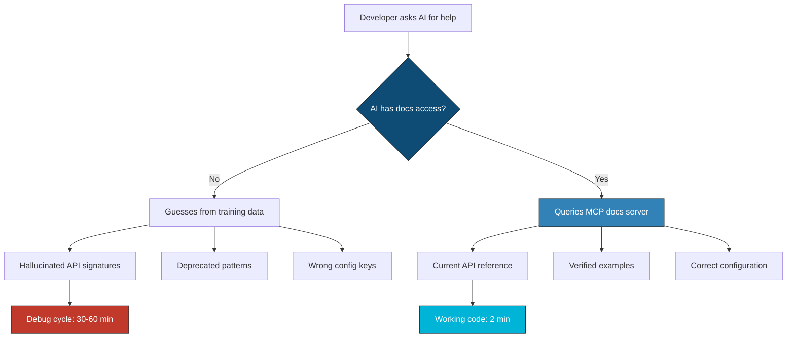
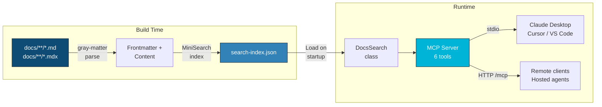
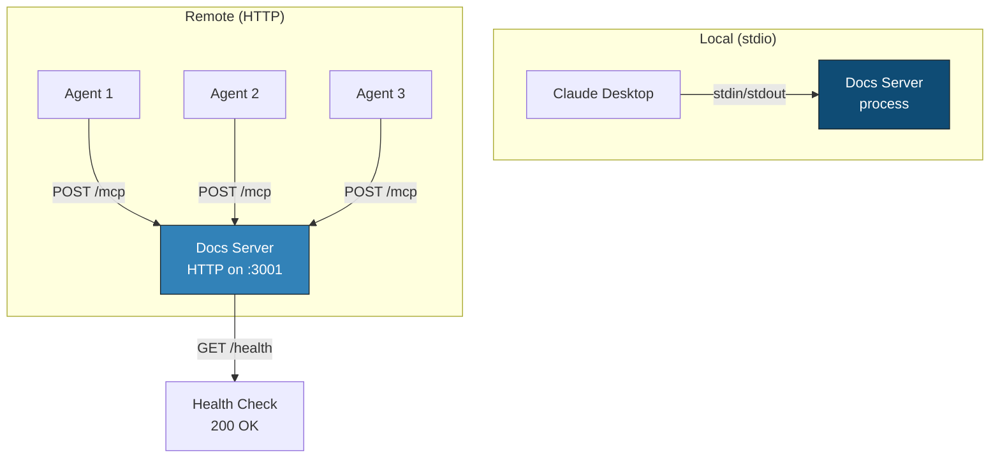

We designed NeuroLink's documentation so that AI agents could read it as easily as humans. The problem was straightforward: when a developer asks Claude or Cursor for help with NeuroLink, the AI has no access to our documentation. It hallucinates API signatures, invents configuration options, and recommends patterns we deprecated two releases ago. We needed documentation that could speak MCP -- and that meant building a docs server directly into our Docusaurus site.

This post walks through how we built a live MCP documentation server that indexes 360+ pages at build time, exposes six tools through the Model Context Protocol, supports both stdio and HTTP transports, and runs via a single `npx` command. The architecture turns static documentation into a queryable knowledge base that any MCP-compatible AI client can consume in real time.

## The Documentation Discovery Problem

Documentation has a fundamental discoverability problem in the age of AI-assisted development. The traditional model assumes a human navigates to a docs site, uses search or sidebar navigation, reads a page, and applies the information. AI coding assistants break every step of this model.

When a developer types "help me set up RAG with NeuroLink" into Claude Code, the AI has two choices: guess based on training data, or use tools to find the answer. Without a docs server, it guesses. The guess might be close for popular libraries with extensive training data representation, but for an SDK that evolves across 200+ exports and 13 providers, the guess is usually wrong in the details that matter -- parameter names, configuration keys, import paths.

The cost of wrong documentation is not just developer frustration. It is wasted debugging time, incorrect implementations that pass initial testing but fail in production, and eroded trust in both the AI assistant and the SDK. Every hallucinated API signature is a support ticket waiting to happen.



The solution is to make documentation a first-class tool that AI agents can invoke. Not a static site that the AI scrapes. Not a PDF dumped into a context window. A structured, searchable, versioned knowledge base exposed through MCP tools that return exactly the information the agent needs -- nothing more, nothing less.

---

## Architecture: Docusaurus Meets MCP

The architecture has three layers: the Docusaurus documentation site that authors write and maintain, a search index generated at build time, and an MCP server that exposes the index through typed tool definitions. Each layer has a single responsibility.



### Why This Separation Matters

The build-time index means the MCP server starts in milliseconds. It does not crawl the docs site on every query. It does not require a running Docusaurus dev server. It loads a pre-built JSON file into memory, builds a MiniSearch index, and begins serving queries immediately.

This separation also means the MCP server can be distributed as part of the npm package. When a developer runs `npx -y @juspay/neurolink docs`, the search index ships with the package. No build step required on the client side. No API keys. No configuration.

The Docusaurus build pipeline already processes every Markdown and MDX file to generate the static site. The search index plugin hooks into the same pipeline, so the index is always in sync with the deployed documentation. When a docs page changes, the next build updates both the site and the search index atomically.

---

## The Search Index: Build-Time Indexing

The search index is generated by a custom Docusaurus plugin that runs during the build phase. It walks every Markdown and MDX file in the `docs/` directory, parses frontmatter with `gray-matter`, strips Markdown syntax to extract plain text, and builds a structured JSON index.

### The Plugin

The `docusaurus-plugin-search-index` plugin integrates with the Docusaurus build lifecycle through two hooks: `postBuild` for production builds and `configureWebpack` for development builds. This ensures the index is always current during both local development and CI deployments.

```typescript
// plugins/docusaurus-plugin-search-index/index.js (simplified)
module.exports = function searchIndexPlugin(context, options = {}) {
  const docsDir = options.docsDir || path.resolve(context.siteDir, "docs");

  const excludeGlobs = options.exclude || [
    "**/api/**",
    "**/cli-guide.md",
    "**/mastra-features-implementation/**",
    "**/404.md",
  ];

  return {
    name: "docusaurus-plugin-search-index",

    async postBuild({ outDir }) {
      await generateIndex(docsDir, outDir, isExcluded);
    },

    configureWebpack() {
      return {
        plugins: [{
          apply(compiler) {
            compiler.hooks.afterEmit.tapAsync(
              "SearchIndexPlugin",
              (compilation, callback) => {
                const staticDir = path.resolve(context.siteDir, "static");
                generateIndex(docsDir, staticDir, isExcluded)
                  .then(() => callback());
              },
            );
          },
        }],
      };
    },
  };
};
```

### Content Extraction

Each document goes through a multi-step extraction pipeline. The plugin parses frontmatter for structured metadata (title, description, tags), strips Markdown syntax from the body content to get plain text for full-text indexing, and extracts section headings with their content for granular search results.

The stripping is aggressive. Code blocks, inline code, images, links (keeping link text), HTML tags, heading markers, bold and italic markers, blockquotes, list markers, MDX imports and exports, and admonition markers are all removed. The result is clean prose that MiniSearch can tokenize and index effectively.

```typescript
// Content extraction produces structured documents
interface IndexDocument {
  id: string;
  title: string;
  description: string;
  content: string;       // Plain text, stripped of markdown
  section: string;       // Top-level directory (e.g., "features", "sdk")
  tags: string[];
  path: string;          // URL path for linking
}
```

### Section-Level Indexing

The plugin does not just index whole pages. It extracts every heading and the content beneath it as a separate index entry. A search for "streaming retry" can return a specific section of a page rather than the entire page, giving AI agents precisely the information they need without the noise.

Each section entry carries its own URL with an anchor fragment. When the AI agent retrieves a result, it gets a direct link to the relevant section. This is critical for AI assistants that present source links to users -- the link takes the user to the exact section that answered their question, not to the top of a lengthy page.

### The Output

The build produces a single `search-index.json` file that lands in the `static/` directory. For NeuroLink's 360+ documentation pages, the index contains entries for every page plus every section heading. The file is included in the npm package distribution, so it ships with `@juspay/neurolink` and requires no separate download.

---

## The MCP Server: Six Tools for Documentation Access

The MCP server is the runtime component that loads the search index and exposes it through typed tool definitions. It uses the `@modelcontextprotocol/sdk` to register tools and handle transport connections.

### Server Initialization

On startup, the server resolves the search index path (checking the local `static/` directory first, then falling back to the npm package path), loads the JSON, and initializes the `DocsSearch` class. The entire startup sequence -- file read, JSON parse, MiniSearch index build -- completes in under 100 milliseconds for the full 360+ page index.

```typescript
// mcp-server/index.ts (simplified)
import { McpServer } from "@modelcontextprotocol/sdk/server/mcp.js";
import { DocsSearch } from "./search.js";
import { createToolDefinitions } from "./tools.js";

function createServer(search: DocsSearch): McpServer {
  const server = new McpServer({
    name: "neurolink-docs",
    version: "1.0.0",
  });

  const tools = createToolDefinitions(search);

  for (const tool of Object.values(tools)) {
    server.tool(
      tool.name,
      tool.description,
      tool.paramsSchema,
      async (args) => tool.handler(args),
    );
  }

  return server;
}
```

### The Six Tools

The server exposes six tools, each designed for a specific documentation access pattern that AI agents commonly need.

**`search_docs`** is the primary entry point. It performs full-text search across all documentation with optional section filtering. The search uses MiniSearch with field-level boosting: titles are weighted 3x, descriptions 2x, and tags 1.5x over body content. Fuzzy matching (0.2 threshold) and prefix search are enabled by default, so queries like "strem" still match "streaming."

**`get_page`** retrieves the full content of a specific documentation page by its path. This is the tool AI agents use after a search narrows down the relevant page. Instead of returning a snippet, it returns the complete page content, giving the agent full context for answering detailed questions.

**`list_sections`** returns the documentation table of contents -- all 27 sections with their page counts and page listings. AI agents use this as a discovery tool when they do not know what search terms to use. It provides the same navigational overview that a human gets from the sidebar.

**`get_api_reference`** provides SDK API reference access with optional method-name filtering. When an agent needs to know the exact signature of `neurolink.generate()`, this tool returns the relevant API documentation without requiring the agent to guess the correct search query.

**`get_examples`** searches across example, cookbook, and demo sections. AI agents use this when they need working code rather than conceptual documentation. It searches three sections simultaneously and deduplicates results.

**`get_changelog`** returns recent release notes and changelog entries, sorted by date. AI agents use this to answer questions about what changed in a specific version or what the latest release includes.

### Tool Schema Validation

Every tool parameter is validated with Zod schemas. The `search_docs` tool validates that `query` is a string, `limit` is an integer between 1 and 50, and `section` is an optional string. Invalid parameters produce structured error messages that help the AI agent self-correct.

```typescript
// mcp-server/tools.ts — search_docs schema
paramsSchema: {
  query: z
    .string()
    .describe("Search query (e.g. 'RAG pipeline', 'MCP configuration')"),
  limit: z
    .number()
    .int()
    .min(1)
    .max(50)
    .optional()
    .describe("Max results to return (default: 10, max: 50)"),
  section: z
    .string()
    .optional()
    .describe("Filter by section (e.g. 'features', 'sdk', 'mcp')"),
},
```

---

## Search Integration: MiniSearch Under the Hood

The search layer wraps MiniSearch with domain-specific logic for documentation querying. The `DocsSearch` class manages the index, provides section-based filtering, and exposes convenience methods for the tool handlers.

### Index Structure

On load, the class builds three data structures from the raw index: a `Map<string, IndexDocument>` for O(1) page retrieval by path, a `Map<string, IndexDocument[]>` for section-based filtering, and the MiniSearch index for full-text search. This triple structure supports all six tool access patterns without redundant computation.

```typescript
// mcp-server/search.ts
export class DocsSearch {
  private miniSearch: MiniSearch<IndexDocument>;
  private documents: Map<string, IndexDocument> = new Map();
  private sections: Map<string, IndexDocument[]> = new Map();

  loadIndex(indexData: SearchIndex): void {
    this.documents.clear();
    this.sections.clear();
    this.miniSearch = new MiniSearch(MINISEARCH_CONFIG);

    for (const doc of indexData.documents) {
      this.documents.set(doc.id, doc);
    }

    for (const doc of this.documents.values()) {
      const sectionDocs = this.sections.get(doc.section) || [];
      sectionDocs.push(doc);
      this.sections.set(doc.section, sectionDocs);
    }

    this.miniSearch.addAll(Array.from(this.documents.values()));
  }

  search(query: string, limit = 10, section?: string): SearchResult[] {
    const options = section
      ? { filter: (result: Record<string, unknown>) =>
            result["section"] === section }
      : undefined;
    const results = this.miniSearch.search(query, options);
    return results.slice(0, limit).map((r) => ({
      id: String(r.id),
      title: String(r["title"] ?? ""),
      description: String(r["description"] ?? ""),
      section: String(r["section"] ?? ""),
      path: String(r["path"] ?? ""),
      score: r.score,
    }));
  }
}
```

### Search Configuration

The MiniSearch configuration is tuned for documentation search patterns. Title matches receive 3x boost because when a developer searches for "streaming," the page titled "Streaming Best Practices" is almost always the most relevant result. Description receives 2x boost because well-written descriptions are strong relevance signals. Tags receive 1.5x boost because they capture topic relationships that might not appear in the title.

Fuzzy matching at 0.2 threshold tolerates minor typos without introducing irrelevant results. Prefix search enables partial-word matching, so a search for "multi" returns pages about multi-model, multi-provider, and multi-agent patterns.

---

## Live Querying from AI Agents

The real value of the docs server emerges when AI agents use it in practice. A developer asks Claude Code for help with NeuroLink, and instead of guessing, the AI queries the docs server for authoritative answers.

### The Agent Workflow

When a developer types "How do I configure RAG with NeuroLink?" into an MCP-compatible AI client:

1. The AI recognizes it needs NeuroLink documentation
2. It calls `search_docs` with `{ "query": "RAG configuration", "section": "features" }`
3. The docs server returns ranked results with titles, descriptions, and paths
4. The AI calls `get_page` with the most relevant path
5. It reads the full page content and synthesizes an answer with correct API signatures, configuration keys, and import paths

This workflow takes under 200 milliseconds for both the search and page retrieval. The AI agent gets authoritative documentation instead of guessing, and the developer gets a correct answer instead of a plausible-sounding hallucination.

### Client Configuration

The docs server works with every major MCP-compatible client. The configuration is intentionally identical across clients -- only the config file location changes.

For Claude Desktop:

```json
{
  "mcpServers": {
    "neurolink-docs": {
      "command": "npx",
      "args": ["-y", "@juspay/neurolink", "docs"]
    }
  }
}
```

For Claude Code:

```bash
claude mcp add neurolink-docs -- npx -y @juspay/neurolink docs
```

The `npx -y @juspay/neurolink docs` command is the same everywhere. The CLI dispatches to the docs server entry point, which initializes the search index and starts the MCP server on stdio transport. The first run downloads the package; subsequent runs use the npm cache.

---

## Dual Transport: Stdio and HTTP

The server supports two transport protocols to cover both local and remote deployment scenarios.

### Stdio Transport

Stdio is the default transport for local development. The MCP client spawns the docs server as a child process and communicates via stdin/stdout. This is the simplest deployment model -- no network configuration, no ports, no CORS. The AI client manages the process lifecycle automatically.

### HTTP Transport

For remote or hosted deployments, the server supports HTTP transport with the Streamable HTTP protocol from the MCP SDK. This enables scenarios where the docs server runs on a central server and multiple AI agents connect to it over the network.



The HTTP server exposes two endpoints: `POST /mcp` for MCP protocol messages and `GET /health` for health checks. CORS headers are set to allow any origin, enabling browser-based AI agents to connect directly. Session management uses `randomUUID()` to generate unique session identifiers for each connection.

Starting the HTTP server:

```bash
# Default port 3001
neurolink docs --transport http

# Custom port
neurolink docs --transport http --port 8080
```

The hosted version runs at `https://docs.neurolink.ink/mcp`, meaning developers who do not want to run a local server can point their AI clients at the hosted endpoint with zero installation.

---

## Testing the Docs Server

Testing an MCP server requires verifying both the tool definitions and the search quality. We test at three levels: unit tests for the search engine, integration tests for the MCP protocol, and end-to-end tests that simulate real AI agent interactions.

### Search Quality Testing

The search engine is tested against a curated set of query-to-expected-result pairs. For each query, we verify that the expected page appears in the top N results. This catches regressions where a documentation change pushes a relevant page out of the top results.

```typescript
// Example search quality test cases
const searchTests = [
  { query: "RAG pipeline",      expectTop: "features/rag" },
  { query: "streaming setup",   expectTop: "features/streaming" },
  { query: "MCP configuration", expectTop: "mcp/configuration" },
  { query: "bedrock provider",  expectTop: "getting-started/providers" },
  { query: "generate method",   expectTop: "sdk/api-reference" },
];

for (const test of searchTests) {
  const results = search.search(test.query, 5);
  const topPaths = results.map((r) => r.path);
  assert(
    topPaths.includes(test.expectTop),
    `Expected "${test.expectTop}" in top 5 for "${test.query}"`
  );
}
```

### MCP Protocol Testing

The MCP SDK provides testing utilities for verifying tool registration, parameter validation, and response format. We test that each tool rejects invalid parameters with appropriate error messages and returns well-structured responses for valid inputs.

### Index Freshness Testing

A CI check verifies that the search index is not stale. It compares the modification timestamp of `search-index.json` against the newest file in `docs/`. If the index is older than any documentation file, the build fails with a clear message indicating the index needs regeneration.

---

## Deployment

The docs server ships as part of the `@juspay/neurolink` npm package. The deployment pipeline has two stages: index generation during the docs site build, and package publication that bundles the index.

### Build Pipeline

The CI pipeline builds the Docusaurus site, which triggers the search index plugin. The generated `search-index.json` is committed to the `static/` directory and included in the npm package. When a new version of NeuroLink is published, the documentation index is always in sync with the SDK version.

### Zero-Config Distribution

The distribution model prioritizes zero configuration for end users. Running `npx -y @juspay/neurolink docs` downloads the package (if not cached), resolves the bundled search index, and starts the MCP server. No API keys, no environment variables, no build steps. The developer adds three lines of JSON to their MCP client configuration and has access to the entire NeuroLink documentation through their AI assistant.

This zero-config approach is deliberate. Every configuration step is a point where adoption can fail. If a developer has to generate an API key, set environment variables, or build the index locally, a significant percentage will give up before completing setup. The bundled index eliminates all of these friction points.

---

## Lessons Learned

Building the docs server taught us several lessons about the intersection of documentation and AI tooling.

### Documentation Is an API

When AI agents consume your documentation, it becomes an API. The structure of your content, the consistency of your frontmatter, and the quality of your descriptions all affect the quality of AI-generated answers. Poorly structured documentation produces poor search results, which produces poor AI answers, which produces poor developer experience.

We started treating documentation quality metrics the same way we treat API response quality metrics. Search recall, result relevance, and answer accuracy are measurable and improvable.

### Build-Time Indexing Beats Runtime Crawling

We considered runtime crawling of the docs site, where the MCP server would fetch and parse pages on demand. The build-time index approach is superior in every dimension: startup time (milliseconds vs seconds), reliability (no network dependency), consistency (index matches deployed docs exactly), and distribution (index ships with the package).

The only downside is that the index can become stale if the docs change without rebuilding. The CI check for index freshness addresses this.

### Six Tools Is the Right Number

We started with two tools (search and get_page) and iterated to six. The additional tools -- list_sections, get_api_reference, get_examples, get_changelog -- each address a specific agent workflow pattern that the generic search tool handles poorly.

List_sections is the discovery tool for agents that do not know what to search for. Get_api_reference is the precision tool for agents that need exact method signatures. Get_examples is the implementation tool for agents that need working code. Get_changelog is the context tool for agents that need to understand version differences.

Fewer tools forced agents to use search for everything, which produced suboptimal results for non-search queries. More tools would increase the cognitive load on the agent (which tools to call and when) without proportional benefit.

### MiniSearch Is Sufficient

We evaluated Algolia, Typesense, and MeiliSearch for the server-side search. MiniSearch -- a JavaScript library that runs in-process with no external dependencies -- proved sufficient for our scale. At 360+ pages, the in-memory index loads in milliseconds and searches return in under 10 milliseconds. The fuzzy matching and field boosting cover the query patterns AI agents actually use.

If the documentation grows to thousands of pages, we may revisit this choice. For now, the simplicity of an in-process search engine that ships as a single JSON file outweighs the marginal relevance improvements of a dedicated search service.

### The Hosted Endpoint Changes the Equation

Offering the docs server at `https://docs.neurolink.ink/mcp` eliminates the last adoption barrier. Developers who cannot or do not want to run local processes -- corporate environments with restricted npx access, CI environments, or browser-based AI clients -- can connect to the hosted endpoint with a single URL. The HTTP transport with CORS headers makes this work seamlessly across environments.

---

## What Comes Next

The docs server is live and serving queries. The immediate roadmap includes version-aware search (query against v8 or v9 docs specifically), usage analytics to understand what developers search for most, and expanded tool definitions for provider-specific documentation access. The architecture supports all of these as incremental additions to the existing tool set.

The broader lesson is that documentation in the age of AI assistants is not just a website. It is a service. Building that service on top of your existing documentation pipeline -- rather than as a separate system -- keeps it maintainable, accurate, and in sync with the code it documents.

---

**Related posts:**

- [NeuroLink + Docusaurus: How We Document an AI SDK](/posts/neurolink-docusaurus/)
- [MCP Auto-Discovery: Finding and Registering Tools at Runtime](/posts/mcp-auto-discovery-elicitation/)
- [Tool Annotations: How NeuroLink Auto-Infers Metadata for Smart Routing](/posts/tool-annotations-auto-inference/)
