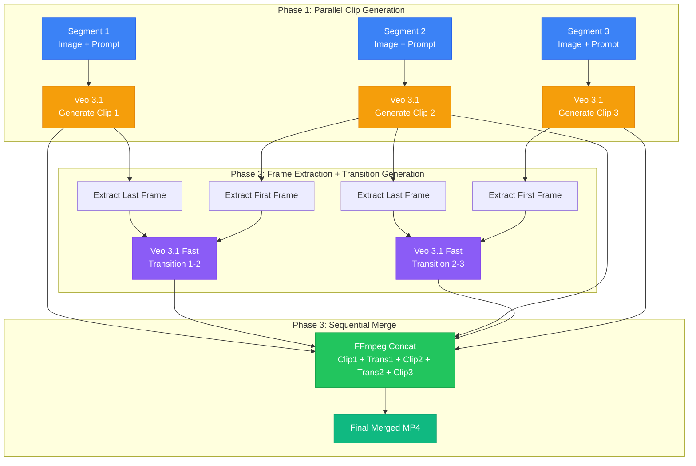
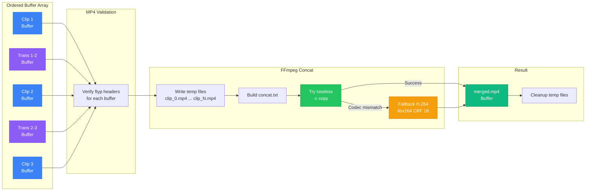
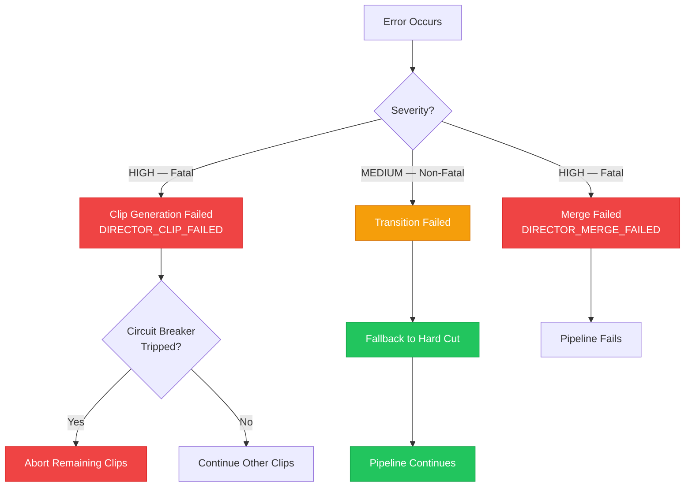

A single eight-second clip is useful for a social media post. A product commercial, a training walkthrough, or a brand story demands something longer: multiple scenes, each with its own camera direction, stitched together with smooth transitions and synchronized audio. Until recently, producing that kind of content required a production studio, an editor, and a budget.

NeuroLink's Director Mode changes the equation. You define an array of scene descriptions, point each one at a reference image, and the SDK orchestrates the entire pipeline: parallel clip generation through Veo 3.1, boundary frame extraction, AI-generated transitions using first-and-last-frame interpolation, and lossless FFmpeg merging into a single MP4. This tutorial walks through every stage of that pipeline, from your first two-scene video to a fully automated production workflow.

## Single Clip vs Multi-Scene: When You Need Director Mode

Standard video generation through NeuroLink accepts one image and one prompt, then returns a single clip of up to eight seconds. That covers product rotations, animated thumbnails, and social media loops. But the moment you need narrative structure, you hit the ceiling.

Director Mode removes it. Here is what each approach gives you:

| Capability | Single Clip | Director Mode |
|---|---|---|
| Maximum duration | 8 seconds | N clips + (N-1) transitions |
| Scene variety | One image, one prompt | Per-segment image and prompt |
| Transitions | None (manual editing) | AI-generated interpolations |
| Audio sync | Per-clip | Continuous across merged output |
| API calls | 1 | N clips + (N-1) transitions |
| Output format | Single MP4 buffer | Single merged MP4 buffer |

Director Mode triggers automatically when you supply an `input.segments` array instead of `input.images`. Each segment is a self-contained `{ prompt, image }` object, and the SDK handles everything from there.

## The Scene Direction API

At its core, Director Mode extends the `generate()` function you already use for single clips. The key difference is the `input.segments` array and the optional `output.director` configuration for transition control:

```typescript
import { NeuroLink } from '@juspay/neurolink';
import { readFile, writeFile } from 'fs/promises';

const neurolink = new NeuroLink();

const result = await neurolink.generate({
  input: {
    segments: [
      {
        prompt: 'Camera slowly pans across the product on a white table',
        image: await readFile('./scene1.jpg'),
      },
      {
        prompt: 'Dynamic zoom into product details with dramatic lighting',
        image: await readFile('./scene2-detail.jpg'),
      },
      {
        prompt: 'Wide shot pulling back to reveal the full scene',
        image: await readFile('./scene3-wide.jpg'),
      },
    ],
  },
  provider: 'vertex',
  model: 'veo-3.1',
  output: {
    mode: 'video',
    video: {
      resolution: '1080p',
      length: 6,
      aspectRatio: '16:9',
      audio: true,
    },
    director: {
      transitionPrompts: [
        'Elegant dissolve with subtle camera drift',
        'Smooth pull-back revealing the wider scene',
      ],
      transitionDurations: [4, 6],
    },
  },
  timeout: 600000,
});

if (result.video) {
  await writeFile('product-commercial.mp4', result.video.data);
  console.log(`Total duration: ${result.video.metadata?.duration}s`);
  console.log(`Segments: ${result.video.metadata?.segmentCount}`);
  console.log(`Transitions: ${result.video.metadata?.transitionCount}`);
}
```

The `transitionPrompts` array maps one-to-one with the boundaries between segments. A three-segment video has two boundaries, so you provide two transition prompts. The `transitionDurations` array lets you control how long each transition clip should be (4, 6, or 8 seconds). If you omit either, NeuroLink uses defaults: a generic cinematic transition prompt and a four-second duration.

## How the Pipeline Works

The Director Mode pipeline runs in three phases. Understanding the phases helps you plan for cost, timing, and error recovery.



**Phase 1** generates all main clips concurrently with a fixed concurrency of two. A circuit breaker trips after two consecutive failures, aborting remaining work to avoid wasted API calls. Every clip failure is fatal because the final merge requires all segments.

**Phase 2** extracts boundary frames (last frame of clip N, first frame of clip N+1) and feeds them to Veo 3.1 Fast's first-and-last-frame interpolation endpoint. Transition failures are non-fatal; they degrade to a hard cut rather than aborting the pipeline. Frame extraction includes a single retry on failure.

**Phase 3** interleaves clips and transitions into a single buffer array (`Clip1, Trans1, Clip2, Trans2, Clip3`) and merges them with FFmpeg's concat demuxer. The merge attempts lossless concatenation first and falls back to H.264 re-encoding if codec parameters differ.

## Video Analysis: Understanding Generated Content

Before chaining scenes together, you may want to analyze the content of generated clips. NeuroLink's video analysis capability uses Gemini 2.5 Flash to extract structured visual features from video files or frames:

```typescript
import { NeuroLink } from '@juspay/neurolink';
import { readFileSync } from 'fs';

const neurolink = new NeuroLink();

// Analyze a generated clip for visual quality and content
const analysis = await neurolink.generate({
  input: {
    text: 'Analyze this video clip. Describe the camera movement, lighting quality, subject motion, and overall production quality. Return structured observations.',
    files: ['./generated-clip.mp4'],
  },
  provider: 'vertex',
  model: 'gemini-2.5-flash',
  disableTools: true,
});

console.log('Video analysis:', analysis.content);
```

This is useful in a two-pass workflow: generate a clip, analyze it, then decide whether to keep it or regenerate with a refined prompt before feeding it into the Director Mode pipeline.

## Resolution and Aspect Ratio Control

Every segment in a Director Mode pipeline shares the same resolution and aspect ratio settings. This is by design: the merge step requires consistent dimensions across all clips and transitions.

```typescript
// Portrait video for Instagram Reels or TikTok
const portraitResult = await neurolink.generate({
  input: {
    segments: [
      { prompt: 'Morning coffee being poured in slow motion', image: await readFile('./coffee.jpg') },
      { prompt: 'Hands wrapping a gift box with a ribbon', image: await readFile('./wrapping.jpg') },
      { prompt: 'Gift box placed on a doorstep, camera tilts up', image: await readFile('./doorstep.jpg') },
    ],
  },
  provider: 'vertex',
  model: 'veo-3.1',
  output: {
    mode: 'video',
    video: {
      resolution: '1080p',
      length: 4,
      aspectRatio: '9:16',
      audio: true,
    },
    director: {
      transitionPrompts: [
        'Quick energetic swipe transition',
        'Fast zoom through a blur into the next scene',
      ],
      transitionDurations: [4, 4],
    },
  },
  timeout: 600000,
});
```

The available configurations map to specific output dimensions:

| Resolution | Aspect Ratio | Output Dimensions | Best For |
|---|---|---|---|
| 720p | 16:9 | 1280 x 720 | Quick previews, drafts |
| 720p | 9:16 | 720 x 1280 | Social media stories |
| 1080p | 16:9 | 1920 x 1080 | YouTube, websites, presentations |
| 1080p | 9:16 | 1080 x 1920 | TikTok, Instagram Reels |

Image preparation matters. For best results, match your input image dimensions to the target aspect ratio. You can preprocess images with `sharp` before feeding them to the pipeline:

```typescript
import sharp from 'sharp';

async function prepareImage(inputPath: string, outputRatio: '9:16' | '16:9') {
  const targetWidth = outputRatio === '16:9' ? 1920 : 1080;
  const targetHeight = outputRatio === '16:9' ? 1080 : 1920;

  return sharp(inputPath)
    .resize(targetWidth, targetHeight, {
      fit: 'cover',
      position: 'center',
    })
    .jpeg({ quality: 90 })
    .toBuffer();
}

// Use in Director Mode
const preparedImages = await Promise.all([
  prepareImage('./scene1.jpg', '16:9'),
  prepareImage('./scene2.jpg', '16:9'),
]);
```

## Synchronized Audio

Veo 3.1 generates synchronized audio by default for each clip. When Director Mode merges the final video, audio tracks from individual clips and transitions are concatenated alongside the video streams. The `audio` flag in `VideoOutputOptions` controls this behavior:

```typescript
// Audio enabled (default) — each clip and transition generates its own audio
const withAudio = await neurolink.generate({
  input: {
    segments: [
      { prompt: 'Ocean waves crashing on a rocky shore', image: await readFile('./ocean.jpg') },
      { prompt: 'Seagulls flying over calm waters at sunset', image: await readFile('./sunset.jpg') },
    ],
  },
  provider: 'vertex',
  model: 'veo-3.1',
  output: {
    mode: 'video',
    video: { resolution: '1080p', length: 8, audio: true },
  },
  timeout: 600000,
});

// Audio disabled — silent video, useful when you plan to add a voiceover or music track
const silent = await neurolink.generate({
  input: {
    segments: [
      { prompt: 'Product showcase with smooth rotation', image: await readFile('./product.jpg') },
      { prompt: 'Close-up detail shot', image: await readFile('./detail.jpg') },
    ],
  },
  provider: 'vertex',
  model: 'veo-3.1',
  output: {
    mode: 'video',
    video: { resolution: '720p', length: 6, audio: false },
  },
  timeout: 600000,
});
```

For production content where you need a continuous soundtrack, generate the video with `audio: false` and use FFmpeg to overlay your own audio track on the merged output.

## The Scene Merging Pipeline in Detail

The merge phase is the final step, and understanding it helps you troubleshoot edge cases. Here is what happens under the hood:



The merger validates every buffer for MP4 `ftyp` headers before writing temp files. A single invalid buffer fails the entire merge. Lossless concatenation is attempted first because all clips come from the same Veo model and should share codec parameters. The H.264 fallback uses `libx264` with CRF 18 and AAC audio at 192 kbps, producing high-quality output at the cost of additional processing time.

Temporary files are cleaned up in a `finally` block, so even if the merge fails, you do not accumulate orphaned files on disk.

## Production Workflow: AI-Driven Storyboard to Video

Combining LLM-powered storyboarding with Director Mode creates a fully automated video production pipeline. The LLM writes the scene descriptions, and Director Mode generates the video:

```typescript
import { NeuroLink } from '@juspay/neurolink';
import { readFile, writeFile } from 'fs/promises';

const neurolink = new NeuroLink();

// Step 1: Generate a storyboard from a brief
const storyboard = await neurolink.generate({
  input: {
    text: `Create a 3-scene storyboard for a luxury watch commercial.
Return a JSON array where each element has:
- "scene": scene number
- "prompt": a detailed video generation prompt with camera movement and lighting
- "transition": a transition prompt to the next scene (omit for last scene)

Focus on cinematic quality, dramatic lighting, and smooth camera movements.`,
  },
  provider: 'vertex',
  model: 'gemini-2.5-flash',
  output: { format: 'json' },
});

const scenes = JSON.parse(storyboard.content);

// Step 2: Map storyboard to Director Mode segments
const sceneImages = [
  await readFile('./watch-closeup.jpg'),
  await readFile('./watch-wrist.jpg'),
  await readFile('./watch-lifestyle.jpg'),
];

const result = await neurolink.generate({
  input: {
    segments: scenes.map((s: { prompt: string }, i: number) => ({
      prompt: s.prompt,
      image: sceneImages[i],
    })),
  },
  provider: 'vertex',
  model: 'veo-3.1',
  output: {
    mode: 'video',
    video: { resolution: '1080p', length: 8, aspectRatio: '16:9', audio: true },
    director: {
      transitionPrompts: scenes
        .filter((s: { transition?: string }) => s.transition)
        .map((s: { transition: string }) => s.transition),
    },
  },
  timeout: 600000,
});

if (result.video) {
  await writeFile('ai-storyboard.mp4', result.video.data);
  console.log('AI-driven commercial generated:', {
    duration: result.video.metadata?.duration,
    segments: result.video.metadata?.segmentCount,
    transitions: result.video.metadata?.transitionCount,
    fileSize: `${(result.video.data.length / 1024 / 1024).toFixed(1)} MB`,
  });
}
```

## Cost and Timing

Director Mode is powerful, but it consumes more resources than single-clip generation. Planning for cost and timing is essential for production use.

### API Call Budget

A Director Mode video with N segments generates:

- **N** main clip generation calls (Veo 3.1)
- **N-1** transition generation calls (Veo 3.1 Fast)
- **Total**: 2N - 1 API calls

A three-segment commercial uses five API calls. A ten-segment brand film uses nineteen.

### Timing Expectations

| Segments | Clips (parallel, concurrency 2) | Transitions (parallel) | Merge | Estimated Total |
|---|---|---|---|---|
| 2 | 30-120s | 30-60s | 2-5s | 1-3 minutes |
| 3 | 60-180s | 30-120s | 3-8s | 2-5 minutes |
| 5 | 90-300s | 60-240s | 5-15s | 3-9 minutes |
| 10 | 150-600s | 120-480s | 10-30s | 5-18 minutes |

Set your `timeout` accordingly. The default pipeline timeout is ten minutes (600,000 ms). For five or more segments, consider increasing it.

### Cost Control Strategies

```typescript
// Strategy 1: Preview at 720p, finalize at 1080p
const preview = await neurolink.generate({
  input: { segments: mySegments },
  provider: 'vertex',
  model: 'veo-3.1',
  output: {
    mode: 'video',
    video: { resolution: '720p', length: 4 }, // Short, low-res preview
  },
  timeout: 300000,
});

// Review the preview, then generate final version
const final = await neurolink.generate({
  input: { segments: mySegments },
  provider: 'vertex',
  model: 'veo-3.1',
  output: {
    mode: 'video',
    video: { resolution: '1080p', length: 8, audio: true },
    director: { transitionPrompts: refinedTransitions },
  },
  timeout: 600000,
});
```

> **Note:** Video generation costs scale with resolution, duration, and segment count. A single 1080p, 8-second clip can cost 10-50x what an image generation costs. A five-segment Director Mode video at 1080p could cost 100-250x an image. Budget carefully and use 720p previews to iterate on prompts before committing to final renders.
{: .prompt-warning }

## Error Handling and Partial Failures

Director Mode has built-in resilience at multiple levels. Understanding the error severity model helps you decide how to handle failures in your application:



**Fatal errors (HIGH severity)**: Clip generation failures and merge failures abort the pipeline. The circuit breaker trips after two consecutive clip failures, skipping remaining clips to avoid wasted API calls.

**Non-fatal errors (MEDIUM severity)**: Transition failures degrade gracefully to hard cuts. Frame extraction gets one retry before the transition is abandoned. The final video still renders; it just has an abrupt cut where a smooth transition would have been.

Here is how to handle errors in your application:

```typescript
import { NeuroLink } from '@juspay/neurolink';
import { readFile, writeFile } from 'fs/promises';

const neurolink = new NeuroLink();

try {
  const result = await neurolink.generate({
    input: {
      segments: [
        { prompt: 'Scene one', image: await readFile('./s1.jpg') },
        { prompt: 'Scene two', image: await readFile('./s2.jpg') },
        { prompt: 'Scene three', image: await readFile('./s3.jpg') },
      ],
    },
    provider: 'vertex',
    model: 'veo-3.1',
    output: {
      mode: 'video',
      video: { resolution: '720p', length: 6 },
    },
    timeout: 600000,
  });

  if (result.video) {
    await writeFile('output.mp4', result.video.data);

    // Check for hard cuts (transitions that failed)
    const meta = result.video.metadata;
    const expectedTransitions = (meta?.segmentCount ?? 0) - 1;
    const actualTransitions = meta?.transitionCount ?? 0;
    if (actualTransitions < expectedTransitions) {
      console.warn(
        `${expectedTransitions - actualTransitions} transition(s) fell back to hard cuts`
      );
    }
  }
} catch (error) {
  if (error.code === 'DIRECTOR_CLIP_FAILED') {
    console.error('Clip generation failed:', error.message);
    console.error('Circuit breaker tripped:', error.context?.circuitBreakerTripped);
  } else if (error.code === 'DIRECTOR_MERGE_FAILED') {
    console.error('Merge failed:', error.message);
  } else {
    console.error('Unexpected error:', error);
  }
}
```

## Creative Applications

Director Mode opens up use cases that were not practical with single-clip generation:

**Product commercials** — Three to five segments covering reveal, detail, lifestyle, and call-to-action. Each segment gets its own camera direction and lighting style. Transition prompts create cohesive flow between scenes.

**Training walkthroughs** — Capture key screens or UI states as images, write prompts describing the interaction flow, and generate a step-by-step video. Useful for onboarding videos where you need to show a sequence of distinct steps.

**Social media stories** — Four short segments in 9:16 portrait format, each four seconds long with quick transitions. Total output: approximately thirty seconds of content from four images and a few lines of code.

**Brand films** — Longer-form content with up to ten segments, 1080p resolution, and eight-second clips with six-second AI transitions. Each scene tells a different part of the brand story.

**Real estate tours** — Each segment starts from a photo of a different room. Camera prompts like "slow pan revealing the full space" and "camera tilts up to show ceiling height" create a virtual walkthrough from still photography.

## What You Have Learned

This tutorial covered the full scope of multi-scene video generation with NeuroLink and Veo 3.1:

1. **Director Mode API** — How to define segments and configure transitions using `input.segments` and `output.director`
2. **Pipeline architecture** — The three-phase flow of parallel clip generation, transition interpolation, and sequential merging
3. **Video analysis** — Using Gemini 2.5 Flash to analyze generated clips before composing the final video
4. **Resolution and aspect ratio** — How to configure output dimensions and preprocess images for consistent results
5. **Audio control** — Enabling or disabling synchronized audio generation across the merged output
6. **Merge internals** — FFmpeg concat demuxer with lossless-first strategy and H.264 fallback
7. **Cost and timing** — API call budgets, timing expectations, and preview-then-finalize strategies
8. **Error resilience** — Circuit breakers, graceful transition degradation, and application-level error handling

For single-clip video generation fundamentals, start with the introductory video generation guide. For localization workflows that combine video generation with dubbing and subtitling, see the content localization tutorial.

---

**Related posts:**

- [Video Generation with Veo 3.1: AI-Powered Video Synthesis](/posts/video-generation-veo/)
- [Image Generation with NeuroLink: Gemini Imagen and Beyond](/posts/image-generation-neurolink/)
- [MCP Circuit Breaker: Preventing Cascading Failures in AI Tool Calls](/posts/mcp-circuit-breaker-pattern/)
