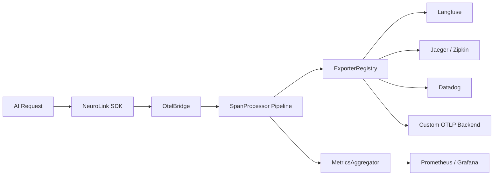
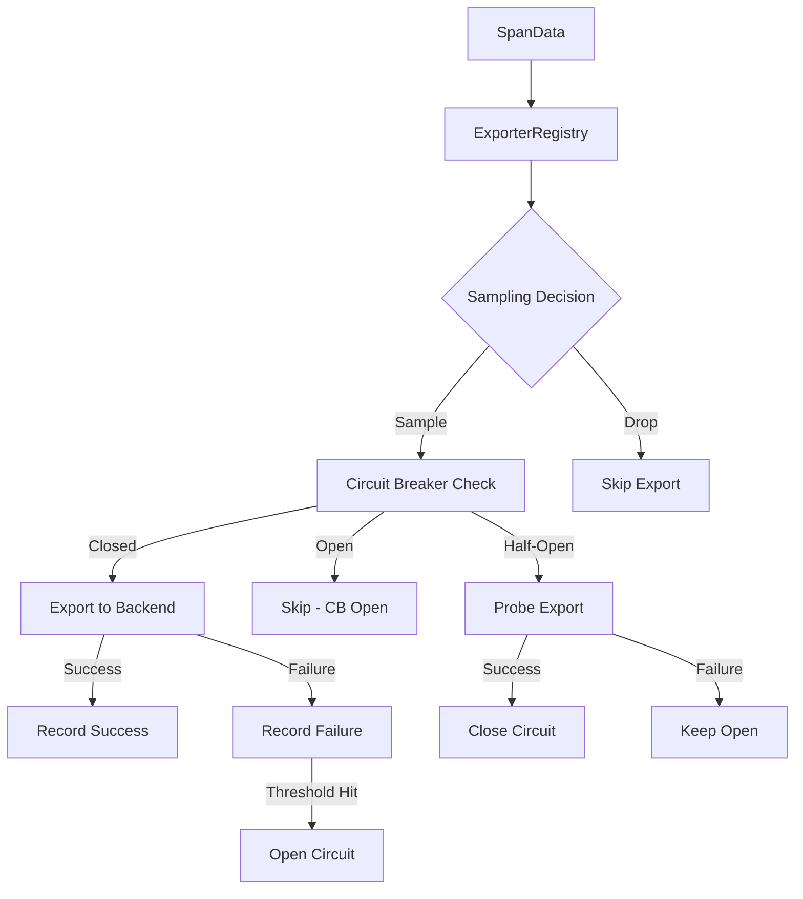
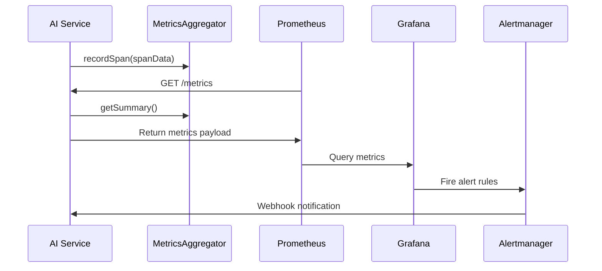

A single AI request touches more systems than you think. The prompt leaves your application, hits a load balancer, reaches a provider API, triggers tokenization, runs through a model, streams back through your middleware chain, and lands in a response object. If anything goes wrong -- a cost spike, a latency regression, a silent quality drop -- you need to know exactly where in that chain the problem started. OpenTelemetry gives you that visibility, and NeuroLink's OTEL integration makes it work for AI-specific workloads out of the box.

This tutorial walks through instrumenting your AI pipeline with OpenTelemetry using NeuroLink. You will configure the OTEL bridge, build custom exporters for HTTP and Langfuse, set up span processing pipelines, track token usage across providers, wire up the MetricsAggregator for real-time dashboards, and deploy alerting rules that catch anomalies before your users do.

## Why OpenTelemetry for AI pipelines

Traditional APM tools track HTTP requests and database queries. They were never designed for the unique telemetry surface of AI workloads: variable-length token streams, multi-provider routing decisions, cache-hit ratios on prompt prefixes, and cost-per-request calculations that depend on model-specific pricing tables.

OpenTelemetry solves this with a vendor-neutral instrumentation standard. You write spans once; they flow to Jaeger, Zipkin, Datadog, Langfuse, or any OTLP-compatible backend. NeuroLink builds on this foundation with AI-specific semantic conventions, token tracking attributes, and a bidirectional bridge between its internal observability system and the OpenTelemetry SDK.



The architecture above shows the full telemetry flow. Every AI request creates spans that pass through the span processor pipeline for enrichment, redaction, and filtering before reaching the exporter registry, which fans out to multiple backends simultaneously. The MetricsAggregator sits alongside the pipeline, computing latency percentiles, token aggregations, and cost breakdowns in real time.

## Setup and configuration

Start by installing the required packages and configuring NeuroLink's observability layer. The OTEL bridge activates automatically when you provide an endpoint.

```bash
# Install NeuroLink and OpenTelemetry dependencies
pnpm add @juspay/neurolink @opentelemetry/sdk-node \
  @opentelemetry/exporter-trace-otlp-http \
  @opentelemetry/auto-instrumentations-node \
  @opentelemetry/resources @opentelemetry/semantic-conventions
```

Set the environment variables that drive the telemetry pipeline:

```bash
# OpenTelemetry core configuration
OTEL_EXPORTER_OTLP_ENDPOINT=http://localhost:4318
OTEL_SERVICE_NAME=my-ai-service
OTEL_SERVICE_VERSION=1.0.0
NEUROLINK_TELEMETRY_ENABLED=true

# Langfuse credentials (for AI-specific observability)
LANGFUSE_PUBLIC_KEY=pk-lf-...
LANGFUSE_SECRET_KEY=sk-lf-...
LANGFUSE_BASE_URL=https://cloud.langfuse.com
```

Now configure the NeuroLink instance with the OTEL bridge and Langfuse integration running side by side:

```typescript
import { NeuroLink, getSpanProcessors } from "@juspay/neurolink";
import { NodeSDK } from "@opentelemetry/sdk-node";
import { OTLPTraceExporter } from "@opentelemetry/exporter-trace-otlp-http";
import { BatchSpanProcessor } from "@opentelemetry/sdk-trace-base";
import { getNodeAutoInstrumentations } from "@opentelemetry/auto-instrumentations-node";

// 1. Initialize NeuroLink with external provider mode
const neurolink = new NeuroLink({
  observability: {
    langfuse: {
      enabled: true,
      publicKey: process.env.LANGFUSE_PUBLIC_KEY!,
      secretKey: process.env.LANGFUSE_SECRET_KEY!,
      baseUrl: process.env.LANGFUSE_BASE_URL,
      useExternalTracerProvider: true,
      autoDetectOperationName: true,
      traceNameFormat: "userId:operationName",
    },
  },
});

// 2. Get NeuroLink's span processors for Langfuse enrichment
const neurolinkProcessors = getSpanProcessors();

// 3. Configure OTLP exporter for Jaeger/Zipkin
const otlpExporter = new OTLPTraceExporter({
  url: `${process.env.OTEL_EXPORTER_OTLP_ENDPOINT}/v1/traces`,
});

// 4. Compose the full OpenTelemetry SDK
const sdk = new NodeSDK({
  spanProcessors: [
    new BatchSpanProcessor(otlpExporter),
    ...neurolinkProcessors,
  ],
  instrumentations: [getNodeAutoInstrumentations()],
});

sdk.start();
console.log("OTEL pipeline initialized with NeuroLink bridge");
```

The `useExternalTracerProvider: true` flag is critical. It tells NeuroLink not to create its own TracerProvider, avoiding the "duplicate registration" errors you get when two OTEL SDKs fight over the global provider.

## Custom exporters: HTTP and Langfuse

NeuroLink's exporter system uses a registry pattern. Every exporter extends `BaseExporter` and implements `exportSpan`, `exportBatch`, `flush`, and `shutdown`. The registry fans out spans to all registered exporters with circuit breaker protection.



Here is how you register the OTEL exporter alongside the Langfuse exporter:

```typescript
import {
  ExporterRegistry,
  getExporterRegistry,
  OtelExporter,
  LangfuseExporter,
} from "@juspay/neurolink";

// Get the singleton registry
const registry = getExporterRegistry();

// Register the OTLP HTTP exporter
const otelExporter = new OtelExporter({
  endpoint: process.env.OTEL_EXPORTER_OTLP_ENDPOINT!,
  protocol: "http",
  serviceName: "my-ai-service",
  serviceVersion: "1.0.0",
  compression: "gzip",
  flushIntervalMs: 5000,
  resourceAttributes: {
    "deployment.environment": process.env.NODE_ENV ?? "development",
    "service.team": "ai-platform",
  },
});

// Register the Langfuse exporter
const langfuseExporter = new LangfuseExporter({
  publicKey: process.env.LANGFUSE_PUBLIC_KEY!,
  secretKey: process.env.LANGFUSE_SECRET_KEY!,
  baseUrl: process.env.LANGFUSE_BASE_URL,
  release: "1.0.0",
  flushIntervalMs: 5000,
});

// Register both and set Langfuse as default
registry.register(otelExporter);
registry.register(langfuseExporter);
registry.setDefault("langfuse");

// Configure circuit breaker for resilience
registry.configureCircuitBreaker({
  failureThreshold: 5,
  resetTimeout: 30000,
});

// Initialize all exporters
await registry.initializeAll();

// Export a span to all backends simultaneously
const result = await registry.exportToAll(spanData);
for (const [name, exportResult] of result) {
  console.log(`${name}: ${exportResult.success ? "OK" : "FAILED"}`);
}
```

The circuit breaker prevents a failing exporter from degrading the entire pipeline. After five consecutive failures, the circuit opens and the registry stops sending spans to that exporter. After 30 seconds it enters half-open state, probing with a single export. If the probe succeeds, the circuit closes and normal operation resumes.

## Span processing pipeline

Raw spans contain too much data for some backends and not enough for others. The span processor pipeline sits between span creation and export, transforming spans through a chain of processors.

NeuroLink ships five built-in processors:

| Processor | Purpose |
|-----------|---------|
| `AttributeEnrichmentProcessor` | Adds static and dynamic attributes to every span |
| `RedactionProcessor` | Strips sensitive fields like API keys and passwords |
| `TruncationProcessor` | Caps string lengths and array sizes to prevent oversized payloads |
| `FilterProcessor` | Drops spans that match a predicate (health checks, internal pings) |
| `BatchProcessor` | Buffers spans and flushes them in configurable batches |

Chain them together with `CompositeProcessor`:

```typescript
import {
  SpanProcessorFactory,
  CompositeProcessor,
  AttributeEnrichmentProcessor,
  RedactionProcessor,
  TruncationProcessor,
  FilterProcessor,
  BatchProcessor,
} from "@juspay/neurolink";

// Option 1: Use the factory for a production-ready pipeline
const pipeline = SpanProcessorFactory.createProductionPipeline({
  serviceName: "my-ai-service",
  environment: "production",
});

// Option 2: Build a custom pipeline
const customPipeline = new CompositeProcessor([
  // Enrich with deployment metadata
  new AttributeEnrichmentProcessor({
    staticAttributes: {
      "service.name": "my-ai-service",
      "deployment.environment": "production",
      "deployment.region": "ap-south-1",
    },
    dynamicAttributes: (span) => ({
      "span.processed_at": new Date().toISOString(),
      "span.has_error": span.status === 2 ? "true" : "false",
    }),
  }),
  // Redact sensitive data before export
  new RedactionProcessor({
    sensitiveKeys: [
      "api_key", "apiKey", "secret", "password",
      "token", "authorization", "credentials",
    ],
    redactedValue: "[REDACTED]",
  }),
  // Filter out noisy health-check spans
  new FilterProcessor((span) => {
    return span.name !== "health-check" && span.name !== "readiness-probe";
  }),
  // Truncate large payloads
  new TruncationProcessor({
    maxStringLength: 10000,
    maxArrayLength: 100,
  }),
]);

// Process a span through the pipeline
const processed = customPipeline.process(rawSpan);
if (processed) {
  await registry.exportToAll(processed);
}
```

The `CompositeProcessor` short-circuits if any processor returns `null`. This means the `FilterProcessor` can drop a span before redaction or truncation ever runs, saving CPU cycles.

## Token tracking across providers

Token counts drive cost calculations, but every provider reports them differently. OpenAI uses `prompt_tokens` and `completion_tokens`. Anthropic adds `cache_creation_input_tokens`. Google Gemini reports `totalTokenCount`. NeuroLink's `TokenTracker` normalizes all of these into a unified schema.

```typescript
import {
  TokenTracker,
  getTokenTracker,
  enrichSpanWithTokenUsage,
} from "@juspay/neurolink";

// Get the global singleton tracker
const tracker = getTokenTracker();

// Configure custom pricing (overrides built-in defaults)
tracker.setModelPricing("gpt-4o", {
  inputPricePerMillion: 2.50,
  outputPricePerMillion: 10.00,
  cachedInputPricePerMillion: 1.25,
});

tracker.setModelPricing("claude-sonnet-4-20250514", {
  inputPricePerMillion: 3.00,
  outputPricePerMillion: 15.00,
  cachedInputPricePerMillion: 0.30,
});

// Track usage from a simple object (no span needed)
tracker.trackUsage({
  promptTokens: 1500,
  completionTokens: 800,
  totalTokens: 2300,
  model: "gpt-4o",
  provider: "openai",
});

// Or enrich a span with token attributes for export
const enrichedSpan = enrichSpanWithTokenUsage(span, {
  promptTokens: 1500,
  completionTokens: 800,
  cacheReadTokens: 200,
  reasoningTokens: 150,
});

// Get aggregated stats
const stats = tracker.getStats();
console.log(`Total tokens: ${stats.totalTokens.toLocaleString()}`);
console.log(`Total cost: ${tracker.formatCost(stats.totalCost)}`);
console.log(`Cache read tokens: ${stats.cacheReadTokens.toLocaleString()}`);

// Breakdown by provider
for (const [provider, providerStats] of stats.byProvider) {
  console.log(
    `${provider}: ${providerStats.totalTokens} tokens, ` +
    `${tracker.formatCost(providerStats.cost)} cost, ` +
    `${providerStats.requestCount} requests`
  );
}
```

The built-in pricing database covers OpenAI, Anthropic, Google, and Mistral models. Use `loadPricingFromConfig` to load pricing from a JSON file or environment variable for models not in the defaults.

## MetricsAggregator: real-time analytics

The `MetricsAggregator` consumes spans and computes statistics that feed dashboards and alerts. It tracks latency percentiles (p50 through p99), success rates, cost breakdowns by provider and model, and time-windowed throughput calculations.

```typescript
import {
  MetricsAggregator,
  getMetricsAggregator,
} from "@juspay/neurolink";

// Get the global aggregator (or create with custom config)
const aggregator = getMetricsAggregator();

// For fine-grained control, create a custom instance
const customAggregator = new MetricsAggregator({
  maxSpansRetained: 10000,
  enableTimeWindows: true,
  timeWindowMs: 60000,     // 1-minute windows
  maxTimeWindows: 60,       // Retain 1 hour of windows
});

// Record spans as they flow through the pipeline
customAggregator.recordSpan(spanData);

// Get the full metrics summary
const summary = customAggregator.getSummary();
console.log(`Total requests: ${summary.totalSpans}`);
console.log(`Success rate: ${(summary.successRate * 100).toFixed(2)}%`);
console.log(`P95 latency: ${summary.latency.p95.toFixed(2)}ms`);
console.log(`P99 latency: ${summary.latency.p99.toFixed(2)}ms`);
console.log(`Total cost: ${customAggregator.formatCost(summary.totalCost)}`);

// Cost breakdown by model
for (const modelCost of summary.costByModel) {
  console.log(
    `${modelCost.model}: ${customAggregator.formatCost(modelCost.totalCost)} ` +
    `(${modelCost.requestCount} requests, ` +
    `${modelCost.inputTokens + modelCost.outputTokens} tokens)`
  );
}

// Time-windowed throughput analysis
const windows = customAggregator.getTimeWindows();
for (const window of windows.slice(-5)) {
  console.log(
    `${window.windowStart.toISOString()}: ` +
    `${window.requestCount} requests, ` +
    `${window.throughput.toFixed(2)} req/s, ` +
    `${(window.successRate * 100).toFixed(1)}% success`
  );
}
```

The aggregator also provides hierarchical trace views. Group related spans by `traceId` to reconstruct the full request lifecycle:

```typescript
const traces = customAggregator.getTraces();
for (const traceView of traces) {
  console.log(
    `Trace ${traceView.traceId}: ` +
    `${traceView.spanCount} spans, ` +
    `${traceView.totalDurationMs}ms, ` +
    `status=${traceView.status}`
  );
  console.log(`  Root: ${traceView.rootSpan.name}`);
  for (const child of traceView.childSpans) {
    console.log(`  Child: ${child.name} (${child.durationMs}ms)`);
  }
}
```

## Dashboarding patterns with Grafana

Connect the MetricsAggregator output to Prometheus for Grafana dashboards. Expose a `/metrics` endpoint that Prometheus scrapes at regular intervals.



Here is an Express handler that exposes MetricsAggregator data in Prometheus format:

```typescript
import express from "express";
import { getMetricsAggregator } from "@juspay/neurolink";

const app = express();

app.get("/metrics", (_req, res) => {
  const agg = getMetricsAggregator();
  const summary = agg.getSummary();
  const latency = summary.latency;

  const lines: string[] = [
    // Request counters
    `# HELP ai_requests_total Total AI requests`,
    `# TYPE ai_requests_total counter`,
    `ai_requests_total{status="success"} ${summary.successfulSpans}`,
    `ai_requests_total{status="error"} ${summary.failedSpans}`,
    "",
    // Latency histogram summary
    `# HELP ai_request_latency_ms AI request latency`,
    `# TYPE ai_request_latency_ms summary`,
    `ai_request_latency_ms{quantile="0.5"} ${latency.p50}`,
    `ai_request_latency_ms{quantile="0.9"} ${latency.p90}`,
    `ai_request_latency_ms{quantile="0.95"} ${latency.p95}`,
    `ai_request_latency_ms{quantile="0.99"} ${latency.p99}`,
    `ai_request_latency_ms_count ${latency.count}`,
    "",
    // Token usage
    `# HELP ai_tokens_total Total tokens consumed`,
    `# TYPE ai_tokens_total counter`,
    `ai_tokens_total{type="input"} ${summary.tokens.totalInputTokens}`,
    `ai_tokens_total{type="output"} ${summary.tokens.totalOutputTokens}`,
    `ai_tokens_total{type="cache_read"} ${summary.tokens.cacheReadTokens}`,
    "",
    // Cost tracking
    `# HELP ai_cost_usd_total Total AI cost in USD`,
    `# TYPE ai_cost_usd_total counter`,
    `ai_cost_usd_total ${summary.totalCost}`,
  ];

  // Per-provider cost breakdown
  for (const provider of summary.costByProvider) {
    lines.push(
      `ai_cost_usd_by_provider{provider="${provider.provider}"} ${provider.totalCost}`
    );
  }

  // Per-model cost breakdown
  for (const model of summary.costByModel) {
    lines.push(
      `ai_cost_usd_by_model{model="${model.model}",provider="${model.provider}"} ${model.totalCost}`
    );
  }

  res.set("Content-Type", "text/plain; charset=utf-8");
  res.send(lines.join("\n"));
});

app.listen(9090, () => console.log("Metrics server on :9090"));
```

## Alerting on anomalies

With metrics flowing into Prometheus, set up alert rules that catch AI-specific anomalies: cost spikes, latency regressions, provider error surges, and token budget overruns.

Create Prometheus alerting rules in `alerts.yml`:

```yaml
groups:
  - name: ai-observability-alerts
    interval: 30s
    rules:
      # Cost spike: 200% increase in hourly spend
      - alert: AICostSpike
        expr: >
          rate(ai_cost_usd_total[1h]) > 2.0 * avg_over_time(
            rate(ai_cost_usd_total[1h])[24h:1h]
          )
        for: 10m
        labels:
          severity: warning
          team: ai-platform
        annotations:
          summary: "AI cost spike detected"
          description: >
            Hourly AI spend has exceeded 200% of the 24-hour average.
            Current rate: {{ $value | printf "%.4f" }} USD/s

      # P99 latency breach
      - alert: AILatencyP99High
        expr: ai_request_latency_ms{quantile="0.99"} > 30000
        for: 5m
        labels:
          severity: critical
        annotations:
          summary: "AI P99 latency above 30 seconds"

      # Provider error rate spike
      - alert: AIProviderErrorRate
        expr: >
          rate(ai_requests_total{status="error"}[5m]) /
          rate(ai_requests_total[5m]) > 0.05
        for: 3m
        labels:
          severity: critical
        annotations:
          summary: "AI error rate above 5%"

      # Token budget overrun
      - alert: AITokenBudgetExceeded
        expr: ai_tokens_total > 10000000
        labels:
          severity: warning
        annotations:
          summary: "AI token budget exceeded 10M tokens"
```

## The OtelBridge: bidirectional context propagation

NeuroLink's `OtelBridge` is the glue between its internal span model and the OpenTelemetry SDK. It handles three critical flows: extracting trace context from incoming requests, injecting context into outgoing requests, and wrapping functions with dual-system tracing.

```typescript
import { OtelBridge } from "@juspay/neurolink";
import { SpanType } from "@juspay/neurolink";

const bridge = new OtelBridge();

// Extract trace context from incoming HTTP headers
app.use((req, _res, next) => {
  const spanContext = bridge.extractContext(req.headers as Record<string, string>);
  if (spanContext) {
    console.log(`Continuing trace: ${spanContext.traceId}`);
  }
  next();
});

// Wrap an AI operation with dual tracing
const result = await bridge.wrapWithTracing(
  "rag-pipeline",
  SpanType.AGENT_ACTION,
  async (neurolinkSpan) => {
    // Both an OTel span and a NeuroLink span are active
    neurolinkSpan.attributes["pipeline.stage"] = "retrieval";

    const docs = await vectorStore.search(query);
    neurolinkSpan.attributes["docs.count"] = docs.length;

    const response = await neurolink.generate({
      input: { text: buildPrompt(docs, query) },
    });

    return response;
  },
  (endedSpan) => {
    // Callback fires when the span ends - export to both systems
    bridge.exportToOtel(endedSpan);
  }
);

// Inject trace context into outgoing service calls
const outgoingHeaders: Record<string, string> = {};
bridge.injectContext(outgoingHeaders);
// outgoingHeaders now contains W3C traceparent and tracestate
```

## Sampling strategies for cost control

At scale, exporting every span to every backend is expensive. NeuroLink's sampling system supports ratio-based, attribute-based, priority, and composite samplers.

```typescript
import {
  SamplerFactory,
  RatioSampler,
  AttributeBasedSampler,
  CompositeSampler,
  ErrorOnlySampler,
  PrioritySampler,
} from "@juspay/neurolink";

// Sample 10% of normal traffic
const ratioSampler = new RatioSampler(0.1);

// Always sample errors and expensive models
const smartSampler = new CompositeSampler([
  new ErrorOnlySampler(),
  new AttributeBasedSampler((span) => {
    const model = span.attributes["ai.model"] as string;
    return model?.includes("gpt-4") || model?.includes("claude-3");
  }),
  new PrioritySampler([
    { predicate: (s) => s.status === 2, priority: 100 },
    { predicate: (s) => (s.durationMs ?? 0) > 10000, priority: 80 },
    { predicate: () => true, priority: 10, sampleRate: 0.1 },
  ]),
]);

// Apply the sampler to the registry
const registry = getExporterRegistry();
registry.setSampler(smartSampler);
```

This ensures that all errors and high-latency requests are always captured, expensive model calls are always traced, and normal traffic is sampled at 10% to control costs.

## Production deployment checklist

Before shipping your OTEL-instrumented AI service to production, verify each layer of the observability stack.

**Environment configuration:**

- Set `OTEL_EXPORTER_OTLP_ENDPOINT` to your collector or Jaeger instance
- Set `OTEL_SERVICE_NAME` and `OTEL_SERVICE_VERSION` for service identification
- Configure Langfuse credentials if using AI-specific observability
- Enable gzip compression on the OTLP exporter for bandwidth savings

**Span processing:**

- Enable the `RedactionProcessor` to strip API keys and PII
- Configure `TruncationProcessor` to cap payload sizes (10KB default is sensible)
- Add `FilterProcessor` rules to drop health-check and readiness-probe spans
- Use `BatchProcessor` with 100-span batches and 5-second flush intervals

**Resilience:**

- Set circuit breaker thresholds (5 failures, 30-second reset is a good default)
- Configure sampling to reduce export volume by 80-90% for high-traffic services
- Implement graceful shutdown to flush pending spans on SIGTERM

```typescript
import {
  flushOpenTelemetry,
  shutdownOpenTelemetry,
  getExporterRegistry,
} from "@juspay/neurolink";

process.on("SIGTERM", async () => {
  console.log("Graceful shutdown initiated...");

  // Flush all pending spans to exporters
  const registry = getExporterRegistry();
  await registry.flushAll();

  // Flush the OTEL SDK
  await flushOpenTelemetry();

  // Shutdown cleanly
  await registry.shutdownAll();
  await shutdownOpenTelemetry();

  console.log("Shutdown complete");
  process.exit(0);
});
```

**Health monitoring:**

- Expose a `/health/observability` endpoint that checks exporter health
- Monitor `getTotalPendingSpans()` for backpressure detection
- Set alerts on circuit breaker state changes

```typescript
app.get("/health/observability", async (_req, res) => {
  const registry = getExporterRegistry();
  const health = await registry.healthCheckAll();
  const allHealthy = await registry.isHealthy();
  const pendingSpans = registry.getTotalPendingSpans();

  const status: Record<string, unknown> = {};
  for (const [name, exporterHealth] of health) {
    const cbStatus = registry.getCircuitBreakerStatus(name);
    status[name] = {
      healthy: exporterHealth.healthy,
      circuitBreaker: cbStatus?.state ?? "closed",
      failures: cbStatus?.failures ?? 0,
    };
  }

  res.status(allHealthy ? 200 : 503).json({
    healthy: allHealthy,
    pendingSpans,
    exporters: status,
  });
});
```

## Conclusion

OpenTelemetry gives AI pipelines the same observability that backend engineers have enjoyed for years -- but with the token tracking, cost attribution, and multi-provider awareness that AI workloads demand. NeuroLink's OTEL integration builds on this foundation with a bidirectional bridge, a registry of circuit-breaker-protected exporters, a composable span processing pipeline, and a MetricsAggregator that computes latency percentiles, cost breakdowns, and throughput metrics in real time.

The key takeaways: use `useExternalTracerProvider` to avoid duplicate registration conflicts, chain span processors for enrichment, redaction, and filtering before export, track tokens through the global `TokenTracker` with per-model pricing, and wire the MetricsAggregator into Prometheus for dashboarding and alerting. With these pieces in place, you can trace every token from the moment it enters your pipeline to the moment it reaches the user.

---

**Related posts:**

- [AI Observability: Monitoring LLM Applications in Production](/posts/monitoring-observability/)
- [Debugging AI Applications: Tools, Techniques, and NeuroLink's Observability Stack](/posts/debugging-ai-applications/)
- [Multi-Scene Video Generation: Directing AI Films with Veo 3.1](/posts/multi-scene-video-generation-veo/)
