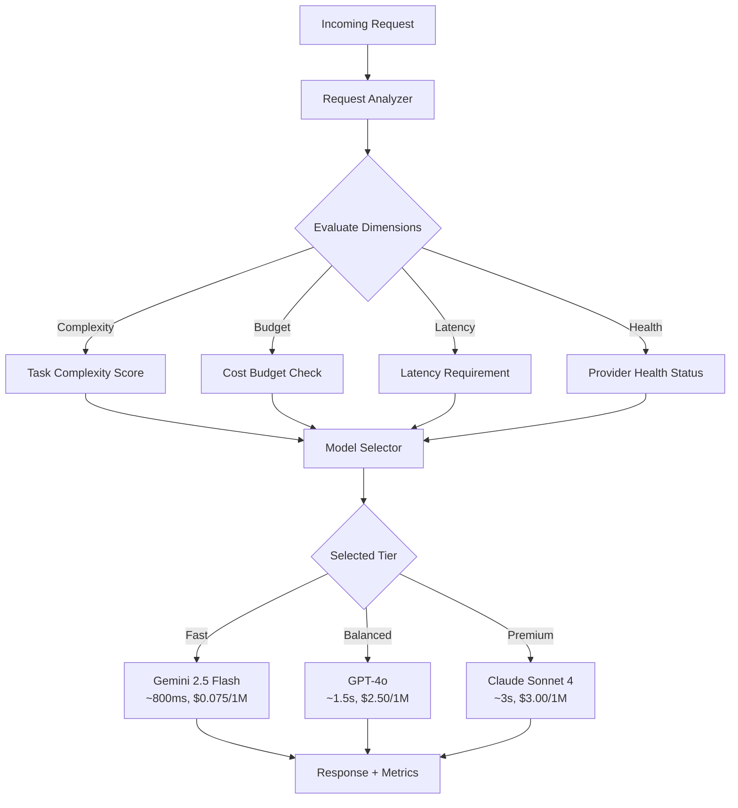
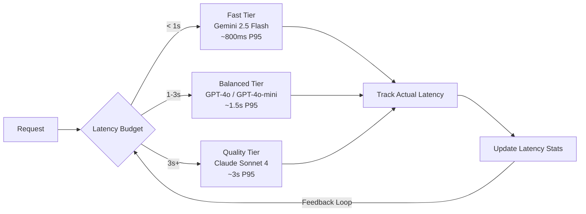
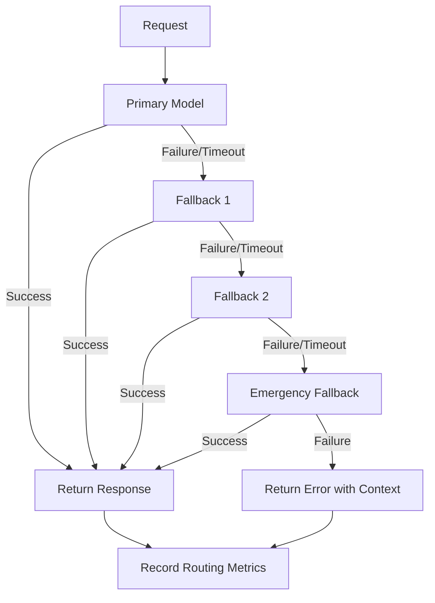

Your AI application sends every request to the same model. A one-sentence sentiment classification costs the same as a multi-step code review. A latency-sensitive autocomplete call waits behind a reasoning-heavy analysis. You are paying premium prices for commodity work and getting commodity latency for premium tasks. Runtime model selection fixes all of this by routing each request to the right model based on what that specific request actually needs.

This tutorial walks you through NeuroLink's dynamic model selection system. You will build a routing layer that evaluates every incoming request and dispatches it to the optimal model based on task complexity, cost constraints, latency budgets, and provider health -- all without changing your application code.

## Why Static Model Configuration Fails

Most AI applications start with a single model hardcoded in the configuration file. When the team realizes one model is not enough, they add a second. Then a third. Before long, the codebase is littered with model identifiers scattered across environment variables, config objects, and inline strings:

```typescript
// The static configuration trap
const CHAT_MODEL = "gpt-4o";
const SUMMARY_MODEL = "gpt-4o-mini";
const CODE_MODEL = "claude-sonnet-4-20250514";
const FAST_MODEL = "gemini-2.5-flash";

// Scattered across dozens of files...
async function handleRequest(type: string, prompt: string) {
  switch (type) {
    case "chat":
      return generate(CHAT_MODEL, prompt);
    case "summary":
      return generate(SUMMARY_MODEL, prompt);
    case "code":
      return generate(CODE_MODEL, prompt);
    default:
      return generate(FAST_MODEL, prompt);
  }
}
```

This approach breaks in production for three reasons. First, model selection is decided at deploy time, not request time. If Anthropic experiences a degradation at 3 AM, your code review pipeline is down until someone redeploys. Second, there is no cost awareness. A simple yes/no classification costs the same as a 2,000-token analysis because both route to the same model. Third, new models require code changes. When a cheaper or faster model becomes available, you need a pull request, a review cycle, and a deployment to take advantage of it.

Runtime model selection replaces this static mapping with a decision engine that evaluates each request independently and routes it to the best available model at the moment the request arrives.



## Runtime Model Switching with NeuroLink

NeuroLink's `DynamicModelProvider` replaces static enums with a runtime-configurable registry. Models are loaded from external configuration sources, validated with Zod schemas, cached for performance, and resolved through exact match, alias lookup, or fuzzy matching:

```typescript
import { dynamicModelProvider } from "@juspay/neurolink";

// Initialize the provider -- loads from config server, GitHub, or local file
await dynamicModelProvider.initialize();

// Resolve a model by provider and hint
const model = dynamicModelProvider.resolveModel("anthropic", "claude-sonnet-4");
console.log(model);
// {
//   id: "claude-sonnet-4-20250514",
//   displayName: "Claude Sonnet 4",
//   capabilities: ["functionCalling", "vision", "analysis"],
//   pricing: { input: 0.003, output: 0.015 },
//   contextWindow: 200000,
//   deprecated: false
// }

// Resolve using an alias
const latest = dynamicModelProvider.resolveModel("anthropic", "claude-latest");
// Resolves to the current best Anthropic model

// Resolve using fuzzy matching
const fuzzy = dynamicModelProvider.resolveModel("anthropic", "sonnet");
// Matches "claude-sonnet-4" via partial string match

// Get the default model for a provider when no hint is given
const defaultModel = dynamicModelProvider.resolveModel("openai");
// Returns the configured default for OpenAI
```

The resolution chain tries four strategies in order: exact match against the provider's model registry, alias lookup from the global alias map, fuzzy matching via case-insensitive substring search, and finally the provider default. This means your application code can use stable aliases like `"claude-latest"` while the underlying model updates automatically when the configuration changes.

## Task-Complexity Routing

The most impactful routing dimension is task complexity. Simple tasks produce identical quality on cheap models, while complex tasks genuinely benefit from premium models. NeuroLink's `ModelConfigurationManager` defines three tiers per provider -- fast, balanced, and quality -- that you can route to based on a complexity score:

```typescript
import { NeuroLink } from "@juspay/neurolink";

type ComplexityTier = "fast" | "balanced" | "quality";

interface ComplexitySignals {
  tokenCount: number;
  hasCodeGeneration: boolean;
  requiresReasoning: boolean;
  hasMultipleConstraints: boolean;
  isCreativeTask: boolean;
}

function assessComplexity(prompt: string): ComplexitySignals {
  const lower = prompt.toLowerCase();
  return {
    tokenCount: prompt.split(/\s+/).length,
    hasCodeGeneration:
      lower.includes("write code") ||
      lower.includes("implement") ||
      lower.includes("function"),
    requiresReasoning:
      lower.includes("analyze") ||
      lower.includes("compare") ||
      lower.includes("explain why"),
    hasMultipleConstraints:
      (lower.match(/\b(must|should|ensure|require|constraint)\b/g) || [])
        .length >= 3,
    isCreativeTask:
      lower.includes("write a story") ||
      lower.includes("compose") ||
      lower.includes("generate creative"),
  };
}

function selectTier(signals: ComplexitySignals): ComplexityTier {
  const score =
    (signals.hasCodeGeneration ? 3 : 0) +
    (signals.requiresReasoning ? 2 : 0) +
    (signals.hasMultipleConstraints ? 2 : 0) +
    (signals.isCreativeTask ? 1 : 0) +
    (signals.tokenCount > 500 ? 1 : 0);

  if (score >= 5) return "quality";
  if (score >= 2) return "balanced";
  return "fast";
}

// Model tier mapping per provider
const MODEL_TIERS: Record<ComplexityTier, { provider: string; model: string }> =
  {
    fast: { provider: "google-ai", model: "gemini-2.5-flash" },
    balanced: { provider: "openai", model: "gpt-4o" },
    quality: { provider: "anthropic", model: "claude-sonnet-4-20250514" },
  };

const neurolink = new NeuroLink();

async function complexityRoute(prompt: string) {
  const signals = assessComplexity(prompt);
  const tier = selectTier(signals);
  const route = MODEL_TIERS[tier];

  const result = await neurolink.generate({
    input: { text: prompt },
    provider: route.provider,
    model: route.model,
  });

  return { ...result, tier, signals };
}
```

The complexity scorer is intentionally simple -- keyword matching with weighted scoring. In production, you can replace it with an embedding-based classifier or a lightweight LLM call, but the keyword approach adds zero latency and handles 80% of routing decisions correctly.

## Cost-Based Routing

Cost-based routing sets a per-request budget and selects the best model that fits within it. This is useful for applications with hard cost ceilings or tiered pricing plans where free users get cheap models and paid users get premium ones:

```typescript
import { dynamicModelProvider } from "@juspay/neurolink";

interface CostConstraint {
  maxInputCostPer1K: number;
  maxOutputCostPer1K: number;
  requiredCapabilities: string[];
}

function selectByCost(constraint: CostConstraint) {
  const candidates = constraint.requiredCapabilities.length > 0
    ? dynamicModelProvider.searchByCapability(
        constraint.requiredCapabilities[0],
        {
          maxPrice: constraint.maxInputCostPer1K,
          excludeDeprecated: true,
        },
      )
    : dynamicModelProvider.getAllModels()
        .filter((m) => !m.config.deprecated)
        .filter((m) => m.config.pricing.input <= constraint.maxInputCostPer1K);

  // Filter by all required capabilities
  const qualified = candidates.filter((c) =>
    constraint.requiredCapabilities.every((cap) =>
      c.config.capabilities.includes(cap),
    ),
  );

  // Sort by quality (higher price = usually higher quality) within budget
  return qualified.sort(
    (a, b) => b.config.pricing.input - a.config.pricing.input,
  )[0] || null;
}

// Free tier: max $0.001 per 1K input tokens
const freeModel = selectByCost({
  maxInputCostPer1K: 0.001,
  maxOutputCostPer1K: 0.004,
  requiredCapabilities: ["functionCalling"],
});

// Premium tier: max $0.01 per 1K input tokens
const premiumModel = selectByCost({
  maxInputCostPer1K: 0.01,
  maxOutputCostPer1K: 0.05,
  requiredCapabilities: ["functionCalling", "vision"],
});

console.log("Free tier model:", freeModel?.config.displayName);
console.log("Premium tier model:", premiumModel?.config.displayName);
```

The `searchByCapability` method returns results sorted by price ascending, so the cheapest qualifying model comes first. Cost-based routing flips this -- you want the best model within your budget, so you sort descending and take the first result.

## Latency-Based Routing

Latency-based routing is critical for user-facing interactions where response time directly affects experience. Autocomplete needs sub-second responses. Chat needs two seconds. Batch analysis can tolerate ten seconds. Each use case maps to a different model tier:



```typescript
interface LatencyProfile {
  p50Ms: number;
  p95Ms: number;
  p99Ms: number;
  sampleCount: number;
}

class LatencyTracker {
  private profiles = new Map<string, number[]>();

  record(modelKey: string, latencyMs: number): void {
    const samples = this.profiles.get(modelKey) || [];
    samples.push(latencyMs);
    // Keep last 1000 samples
    if (samples.length > 1000) samples.shift();
    this.profiles.set(modelKey, samples);
  }

  getProfile(modelKey: string): LatencyProfile | null {
    const samples = this.profiles.get(modelKey);
    if (!samples || samples.length < 10) return null;

    const sorted = [...samples].sort((a, b) => a - b);
    return {
      p50Ms: sorted[Math.floor(sorted.length * 0.5)],
      p95Ms: sorted[Math.floor(sorted.length * 0.95)],
      p99Ms: sorted[Math.floor(sorted.length * 0.99)],
      sampleCount: sorted.length,
    };
  }
}

const latencyTracker = new LatencyTracker();

async function latencyAwareRoute(
  prompt: string,
  maxLatencyMs: number,
  neurolink: NeuroLink,
) {
  // Order models by expected latency
  const candidates = [
    { provider: "google-ai", model: "gemini-2.5-flash", key: "google-flash" },
    { provider: "openai", model: "gpt-4o-mini", key: "openai-mini" },
    { provider: "openai", model: "gpt-4o", key: "openai-4o" },
    { provider: "anthropic", model: "claude-sonnet-4-20250514", key: "claude-sonnet" },
  ];

  // Select based on tracked P95 latency
  const selected = candidates.find((c) => {
    const profile = latencyTracker.getProfile(c.key);
    return !profile || profile.p95Ms <= maxLatencyMs;
  }) || candidates[0]; // Fallback to fastest

  const startTime = Date.now();
  const result = await neurolink.generate({
    input: { text: prompt },
    provider: selected.provider,
    model: selected.model,
  });
  const actualLatency = Date.now() - startTime;

  latencyTracker.record(selected.key, actualLatency);

  return { ...result, latencyMs: actualLatency, selectedModel: selected.key };
}
```

The latency tracker creates a feedback loop. As real latency data accumulates, routing decisions become more accurate. A model that was fast last week but is now overloaded will naturally drop out of contention for latency-sensitive requests.

## A/B Testing Models

A/B testing lets you compare model quality in production without committing to a full migration. Split traffic between a control model and a challenger, collect evaluation metrics, and promote the challenger only when it proves itself:

```typescript
interface ABTestConfig {
  name: string;
  control: { provider: string; model: string };
  challenger: { provider: string; model: string };
  trafficSplitPercent: number; // Percentage to challenger
  startDate: Date;
  endDate: Date;
}

class ModelABTester {
  private tests = new Map<string, ABTestConfig>();
  private results = new Map<
    string,
    { control: number[]; challenger: number[] }
  >();

  registerTest(config: ABTestConfig): void {
    this.tests.set(config.name, config);
    this.results.set(config.name, { control: [], challenger: [] });
  }

  selectVariant(
    testName: string,
    requestId: string,
  ): { provider: string; model: string; variant: "control" | "challenger" } {
    const test = this.tests.get(testName);
    if (!test) throw new Error(`Unknown test: ${testName}`);

    const now = new Date();
    if (now < test.startDate || now > test.endDate) {
      return { ...test.control, variant: "control" };
    }

    // Deterministic split based on request ID hash
    const hash = this.hashString(requestId);
    const isChallenger = (hash % 100) < test.trafficSplitPercent;

    return isChallenger
      ? { ...test.challenger, variant: "challenger" }
      : { ...test.control, variant: "control" };
  }

  recordScore(testName: string, variant: "control" | "challenger", score: number): void {
    const results = this.results.get(testName);
    if (results) {
      results[variant].push(score);
    }
  }

  getTestResults(testName: string) {
    const results = this.results.get(testName);
    if (!results) return null;

    const avg = (arr: number[]) =>
      arr.length > 0 ? arr.reduce((a, b) => a + b, 0) / arr.length : 0;

    return {
      control: { avgScore: avg(results.control), count: results.control.length },
      challenger: { avgScore: avg(results.challenger), count: results.challenger.length },
    };
  }

  private hashString(str: string): number {
    let hash = 0;
    for (let i = 0; i < str.length; i++) {
      const char = str.charCodeAt(i);
      hash = ((hash << 5) - hash) + char;
      hash = hash & hash; // Convert to 32-bit integer
    }
    return Math.abs(hash);
  }
}

// Register an A/B test comparing GPT-4o against Claude Sonnet
const tester = new ModelABTester();
tester.registerTest({
  name: "code-review-model",
  control: { provider: "openai", model: "gpt-4o" },
  challenger: { provider: "anthropic", model: "claude-sonnet-4-20250514" },
  trafficSplitPercent: 20, // 20% to challenger
  startDate: new Date("2026-03-30"),
  endDate: new Date("2026-04-13"),
});
```

The deterministic hash ensures the same request ID always routes to the same variant, which is important for reproducibility and debugging. Start with a small traffic split (10-20%) and increase as confidence grows.

## Gradual Rollout Patterns

When promoting a challenger model from an A/B test, a gradual rollout reduces risk. Instead of switching 100% of traffic immediately, ramp up over days while monitoring quality metrics and error rates:

```typescript
interface RolloutStage {
  percent: number;
  minDurationHours: number;
  requiredMetrics: {
    minAvgScore: number;
    maxErrorRate: number;
    maxP95LatencyMs: number;
  };
}

const ROLLOUT_STAGES: RolloutStage[] = [
  {
    percent: 5,
    minDurationHours: 4,
    requiredMetrics: { minAvgScore: 7.0, maxErrorRate: 0.02, maxP95LatencyMs: 5000 },
  },
  {
    percent: 25,
    minDurationHours: 12,
    requiredMetrics: { minAvgScore: 7.0, maxErrorRate: 0.02, maxP95LatencyMs: 5000 },
  },
  {
    percent: 50,
    minDurationHours: 24,
    requiredMetrics: { minAvgScore: 7.0, maxErrorRate: 0.01, maxP95LatencyMs: 4000 },
  },
  {
    percent: 100,
    minDurationHours: 0,
    requiredMetrics: { minAvgScore: 7.0, maxErrorRate: 0.01, maxP95LatencyMs: 4000 },
  },
];

class GradualRollout {
  private currentStage = 0;
  private stageStartTime = Date.now();

  getCurrentPercent(): number {
    return ROLLOUT_STAGES[this.currentStage].percent;
  }

  canAdvance(metrics: {
    avgScore: number;
    errorRate: number;
    p95LatencyMs: number;
  }): boolean {
    const stage = ROLLOUT_STAGES[this.currentStage];
    const hoursElapsed =
      (Date.now() - this.stageStartTime) / (1000 * 60 * 60);

    if (hoursElapsed < stage.minDurationHours) return false;
    if (metrics.avgScore < stage.requiredMetrics.minAvgScore) return false;
    if (metrics.errorRate > stage.requiredMetrics.maxErrorRate) return false;
    if (metrics.p95LatencyMs > stage.requiredMetrics.maxP95LatencyMs) return false;

    return true;
  }

  advance(): void {
    if (this.currentStage < ROLLOUT_STAGES.length - 1) {
      this.currentStage++;
      this.stageStartTime = Date.now();
    }
  }

  rollback(): void {
    this.currentStage = 0;
    this.stageStartTime = Date.now();
  }
}
```

Each stage has a minimum duration and quality gates. The rollout only advances when metrics meet thresholds for the required duration. If quality drops at any stage, `rollback()` returns to the initial 5% to limit blast radius.

## Fallback Chains

Fallback chains ensure every request gets a response even when providers fail. NeuroLink's dynamic model system supports multi-source configuration loading with automatic fallback, and you can apply the same pattern to request routing:



```typescript
interface FallbackChainConfig {
  models: Array<{
    provider: string;
    model: string;
    timeoutMs: number;
    priority: number;
  }>;
  maxAttempts: number;
}

async function executeWithFallback(
  prompt: string,
  chain: FallbackChainConfig,
  neurolink: NeuroLink,
): Promise<{
  result: any;
  attemptedModels: string[];
  finalModel: string;
}> {
  const attemptedModels: string[] = [];
  const sorted = [...chain.models].sort((a, b) => a.priority - b.priority);

  for (const model of sorted.slice(0, chain.maxAttempts)) {
    const modelKey = `${model.provider}/${model.model}`;
    attemptedModels.push(modelKey);

    try {
      const controller = new AbortController();
      const timeoutId = setTimeout(
        () => controller.abort(),
        model.timeoutMs,
      );

      const result = await neurolink.generate({
        input: { text: prompt },
        provider: model.provider,
        model: model.model,
        signal: controller.signal,
      });

      clearTimeout(timeoutId);

      return {
        result,
        attemptedModels,
        finalModel: modelKey,
      };
    } catch (error) {
      console.warn(
        `Model ${modelKey} failed:`,
        error instanceof Error ? error.message : String(error),
      );
      continue;
    }
  }

  throw new Error(
    `All models in fallback chain failed. Attempted: ${attemptedModels.join(", ")}`,
  );
}

// Configure a three-tier fallback chain
const codeReviewChain: FallbackChainConfig = {
  models: [
    {
      provider: "anthropic",
      model: "claude-sonnet-4-20250514",
      timeoutMs: 10000,
      priority: 1,
    },
    {
      provider: "openai",
      model: "gpt-4o",
      timeoutMs: 8000,
      priority: 2,
    },
    {
      provider: "google-ai",
      model: "gemini-2.5-pro",
      timeoutMs: 6000,
      priority: 3,
    },
  ],
  maxAttempts: 3,
};
```

The chain orders models by priority and caps attempts at `maxAttempts`. Each model has its own timeout -- the primary gets the longest because it is the preferred choice, while fallbacks get progressively shorter timeouts since you are already behind on latency budget.

## Monitoring Model Performance

Runtime model selection generates a stream of routing decisions that you must monitor. Without observability, you cannot tell whether your routing logic is making good choices or hemorrhaging money on misclassified requests:

```typescript
interface RoutingMetrics {
  requestId: string;
  timestamp: number;
  selectedProvider: string;
  selectedModel: string;
  tier: string;
  complexityScore: number;
  latencyMs: number;
  inputTokens: number;
  outputTokens: number;
  estimatedCost: number;
  qualityScore?: number;
  wasFallback: boolean;
}

class RoutingMonitor {
  private metrics: RoutingMetrics[] = [];

  record(metric: RoutingMetrics): void {
    this.metrics.push(metric);
    // In production, send to your telemetry system
    this.checkAlerts(metric);
  }

  private checkAlerts(metric: RoutingMetrics): void {
    // Alert if cost exceeds 2x the tier average
    const tierMetrics = this.metrics.filter((m) => m.tier === metric.tier);
    const avgCost =
      tierMetrics.reduce((sum, m) => sum + m.estimatedCost, 0) /
      tierMetrics.length;

    if (metric.estimatedCost > avgCost * 2) {
      console.warn(
        `[ALERT] Request ${metric.requestId} cost ${metric.estimatedCost.toFixed(6)} ` +
        `exceeds 2x tier average of ${avgCost.toFixed(6)}`,
      );
    }

    // Alert if fallback rate exceeds 5%
    const recentMetrics = this.metrics.slice(-100);
    const fallbackRate =
      recentMetrics.filter((m) => m.wasFallback).length / recentMetrics.length;

    if (fallbackRate > 0.05) {
      console.warn(
        `[ALERT] Fallback rate is ${(fallbackRate * 100).toFixed(1)}% -- ` +
        `check primary model health`,
      );
    }
  }

  getSummary() {
    const byTier = new Map<string, RoutingMetrics[]>();
    for (const m of this.metrics) {
      const arr = byTier.get(m.tier) || [];
      arr.push(m);
      byTier.set(m.tier, arr);
    }

    const summary: Record<string, {
      count: number;
      avgLatencyMs: number;
      avgCost: number;
      fallbackRate: number;
    }> = {};

    for (const [tier, metrics] of byTier) {
      summary[tier] = {
        count: metrics.length,
        avgLatencyMs:
          metrics.reduce((s, m) => s + m.latencyMs, 0) / metrics.length,
        avgCost:
          metrics.reduce((s, m) => s + m.estimatedCost, 0) / metrics.length,
        fallbackRate:
          metrics.filter((m) => m.wasFallback).length / metrics.length,
      };
    }

    return summary;
  }
}
```

The monitoring system tracks four key dimensions: cost per tier (to validate that cheap models are actually cheap), latency per tier (to validate that fast models are actually fast), fallback rate (to detect provider degradation), and quality score (to ensure routing decisions preserve output quality).

## Production Configuration

Bringing all the routing dimensions together, here is a production-ready configuration that combines complexity routing, cost constraints, latency awareness, and fallback chains into a single decision engine:

```typescript
import { NeuroLink, dynamicModelProvider } from "@juspay/neurolink";

interface RoutingPolicy {
  name: string;
  complexityThresholds: {
    fast: number;    // Score below this -> fast tier
    balanced: number; // Score below this -> balanced tier
    // Above balanced -> quality tier
  };
  costLimits: {
    fast: { maxInputPer1K: number; maxOutputPer1K: number };
    balanced: { maxInputPer1K: number; maxOutputPer1K: number };
    quality: { maxInputPer1K: number; maxOutputPer1K: number };
  };
  latencyBudgets: {
    fast: number;
    balanced: number;
    quality: number;
  };
  fallbackEnabled: boolean;
}

const PRODUCTION_POLICY: RoutingPolicy = {
  name: "production-v1",
  complexityThresholds: {
    fast: 2,
    balanced: 5,
  },
  costLimits: {
    fast: { maxInputPer1K: 0.001, maxOutputPer1K: 0.004 },
    balanced: { maxInputPer1K: 0.005, maxOutputPer1K: 0.02 },
    quality: { maxInputPer1K: 0.015, maxOutputPer1K: 0.075 },
  },
  latencyBudgets: {
    fast: 1000,
    balanced: 3000,
    quality: 10000,
  },
  fallbackEnabled: true,
};

async function routeWithPolicy(
  prompt: string,
  policy: RoutingPolicy,
  neurolink: NeuroLink,
) {
  // Step 1: Assess complexity
  const signals = assessComplexity(prompt);
  const score =
    (signals.hasCodeGeneration ? 3 : 0) +
    (signals.requiresReasoning ? 2 : 0) +
    (signals.hasMultipleConstraints ? 2 : 0) +
    (signals.isCreativeTask ? 1 : 0) +
    (signals.tokenCount > 500 ? 1 : 0);

  let tier: "fast" | "balanced" | "quality";
  if (score < policy.complexityThresholds.fast) tier = "fast";
  else if (score < policy.complexityThresholds.balanced) tier = "balanced";
  else tier = "quality";

  // Step 2: Select model within cost limits
  const costLimit = policy.costLimits[tier];
  const candidates = dynamicModelProvider
    .getAllModels()
    .filter((m) => !m.config.deprecated)
    .filter((m) => m.config.pricing.input <= costLimit.maxInputPer1K)
    .sort((a, b) => b.config.pricing.input - a.config.pricing.input);

  const selected = candidates[0];
  if (!selected) {
    throw new Error(`No model found within cost limits for tier: ${tier}`);
  }

  // Step 3: Execute with latency timeout and fallback
  const startTime = Date.now();
  try {
    const result = await neurolink.generate({
      input: { text: prompt },
      provider: selected.provider,
      model: selected.config.id,
    });

    return {
      result,
      routing: {
        tier,
        complexityScore: score,
        selectedModel: `${selected.provider}/${selected.model}`,
        latencyMs: Date.now() - startTime,
        policy: policy.name,
      },
    };
  } catch (error) {
    if (!policy.fallbackEnabled) throw error;

    // Fallback to next cheapest model
    const fallback = candidates[1];
    if (!fallback) throw error;

    const result = await neurolink.generate({
      input: { text: prompt },
      provider: fallback.provider,
      model: fallback.config.id,
    });

    return {
      result,
      routing: {
        tier,
        complexityScore: score,
        selectedModel: `${fallback.provider}/${fallback.model}`,
        latencyMs: Date.now() - startTime,
        policy: policy.name,
        wasFallback: true,
      },
    };
  }
}
```

Deploy this configuration by setting environment variables that override the default model tiers. The `ModelConfigurationManager` reads environment variables like `GOOGLE_AI_FAST_MODEL`, `OPENAI_BALANCED_MODEL`, and `ANTHROPIC_QUALITY_MODEL` at startup, so you can swap models without redeploying:

```bash
# Production environment variables for model tiers
export GOOGLE_AI_FAST_MODEL="gemini-2.5-flash"
export OPENAI_BALANCED_MODEL="gpt-4o"
export ANTHROPIC_QUALITY_MODEL="claude-sonnet-4-20250514"

# Custom model configuration URL for dynamic updates
export MODEL_CONFIG_URL="https://api.yourcompany.com/ai/models"

# Override default cost ratings for routing decisions
export GOOGLE_AI_COST_RATING=3
export OPENAI_COST_RATING=2
export ANTHROPIC_COST_RATING=1
```

## Conclusion

Runtime model selection transforms your AI application from a static single-model system into an adaptive routing layer that optimizes every request independently. You built a complexity-based classifier that routes simple prompts to cheap models and complex prompts to premium ones. You added cost constraints that enforce per-tier budgets. You implemented latency tracking with a feedback loop that improves routing accuracy over time. You configured A/B testing for safe model evaluation and gradual rollouts for risk-free migrations. And you wrapped it all in a fallback chain that guarantees responses even when providers fail.

The key insight is that no single model is optimal for every request. By evaluating each request on its own merits -- complexity, budget, latency requirement, and provider health -- you reduce costs by 40-60% while maintaining or improving quality where it matters most.

Start with complexity routing alone. It delivers the largest cost savings with the smallest implementation effort. Add latency-based routing when you have user-facing interactions with strict response time requirements. Introduce A/B testing when you need to evaluate new models in production. The routing dimensions compose naturally, and each one you add makes the system smarter.

---

**Related posts:**

- [How to Reduce LLM Costs by 60% with Smart Model Routing](/posts/reduce-llm-costs-smart-model-routing/)
- [Multi-Provider Failover: Never Lose an API Call](/posts/provider-failover-patterns/)
- [OpenTelemetry for AI: Tracing Every Token Through Your Pipeline](/posts/opentelemetry-ai-observability/)
