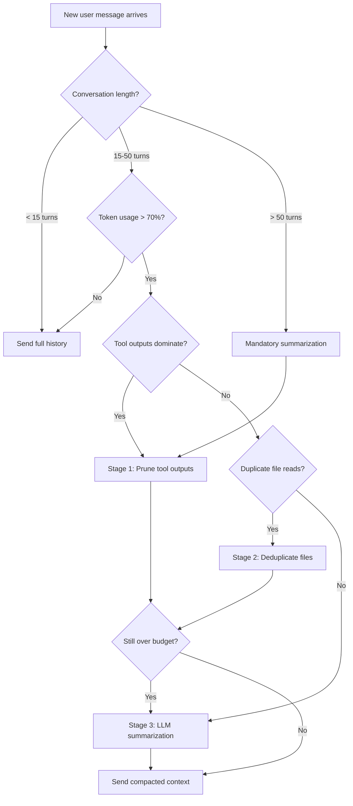
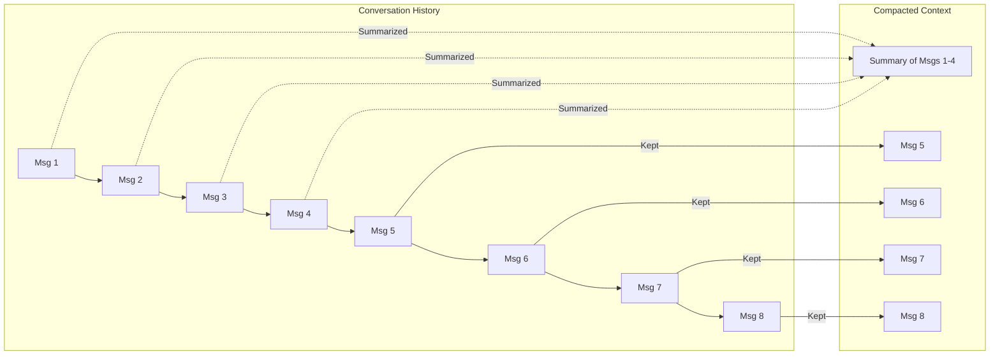
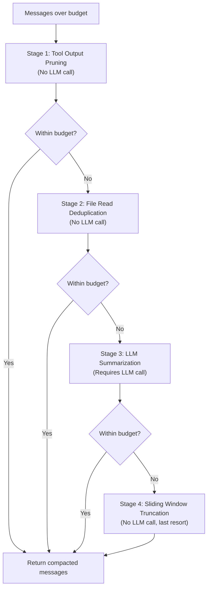

Every LLM conversation eventually hits a wall. Context windows are finite, and the longer a chat runs, the more tokens you spend re-sending old messages that no longer contribute much to the next response. Summarization is the answer: condense what happened earlier so the model keeps the gist without burning through your budget.

This tutorial walks through four progressively powerful patterns for conversation summarization with NeuroLink, culminating in the production-grade four-stage context compaction pipeline that ships with the SDK.

## When to Summarize

Not every conversation needs summarization. Short one-shot interactions finish well within any model's context window. Summarization becomes essential when conversations exhibit these characteristics:

- **Turn count exceeds 15-20 exchanges.** At that point the token cost of re-sending full history starts to dominate.
- **Tool outputs inflate context.** A single file read or API response can inject thousands of tokens into the conversation.
- **Multi-session continuity is required.** If you persist context across sessions, summaries keep storage and re-hydration costs manageable.
- **Response quality degrades.** Models tend to lose focus when the prompt grows very large, even within the technical context limit.

The following decision diagram helps you choose the right strategy for your workload.



## LLM-Powered Condensation

The most straightforward summarization approach is to ask an LLM to condense older messages into a concise paragraph while preserving key facts, decisions, and entities. NeuroLink makes this simple through its unified generation interface.

### Basic Summarizer

The following `ConversationSummarizer` class tracks messages and triggers summarization once the conversation exceeds a configurable threshold. Older messages are replaced with a summary while recent ones remain intact.

```typescript
import { NeuroLink } from '@juspay/neurolink';

type ConversationMessage = {
  role: 'user' | 'assistant' | 'system';
  content: string;
  timestamp: Date;
  important?: boolean;
};

class ConversationSummarizer {
  protected neurolink: NeuroLink;
  protected messages: ConversationMessage[] = [];
  private summary: string = '';
  private maxMessages: number;
  private summaryModel: string;

  constructor(options: { maxMessages?: number; summaryModel?: string } = {}) {
    this.neurolink = new NeuroLink();
    this.maxMessages = options.maxMessages || 10;
    this.summaryModel = options.summaryModel || 'claude-3-5-haiku-20241022';
  }

  addMessage(role: 'user' | 'assistant', content: string, important = false) {
    this.messages.push({ role, content, timestamp: new Date(), important });
    if (this.messages.length >= this.maxMessages) {
      this.summarizeAsync().catch(console.error);
    }
  }

  private async summarizeAsync() {
    const importantMessages = this.messages.filter((m) => m.important);
    const regularMessages = this.messages.filter((m) => !m.important);

    // Split regular messages: summarize first half, keep second half
    const midpoint = Math.floor(regularMessages.length / 2);
    const toSummarize = regularMessages.slice(0, midpoint);
    const toKeep = regularMessages.slice(midpoint);

    if (toSummarize.length === 0) return;

    const conversationText = toSummarize
      .map((m) => `${m.role}: ${m.content}`)
      .join('\n\n');

    const result = await this.neurolink.generate({
      input: {
        text: `Summarize this conversation concisely, preserving key facts,
decisions, and context:\n\n${conversationText}`,
      },
      provider: 'anthropic',
      model: this.summaryModel,
      maxTokens: 500,
    });

    // Merge the new summary with any existing summary
    this.summary = this.summary
      ? `${this.summary}\n\nRecent updates: ${result.content}`
      : result.content;

    this.messages = [...importantMessages, ...toKeep];
  }

  async getContext(): Promise<string> {
    const parts: string[] = [];
    if (this.summary) {
      parts.push(`[Previous conversation summary: ${this.summary}]`);
    }
    const recentMessages = this.messages
      .slice(-5)
      .map((m) => `${m.role}: ${m.content}`)
      .join('\n\n');
    if (recentMessages) parts.push(recentMessages);
    return parts.join('\n\n');
  }

  async chat(userMessage: string, markImportant = false): Promise<string> {
    this.addMessage('user', userMessage, markImportant);
    const context = await this.getContext();
    const result = await this.neurolink.generate({
      input: { text: context },
    });
    this.addMessage('assistant', result.content);
    return result.content;
  }

  getStats() {
    return {
      messages: this.messages.length,
      hasSummary: !!this.summary,
      summaryLength: this.summary.length,
      importantMessages: this.messages.filter((m) => m.important).length,
    };
  }
}
```

Key design decisions in this implementation:

1. **Important-message preservation.** Messages flagged with `important: true` are never summarized. Use this for decisions, confirmations, or any fact the user explicitly asked the model to remember.
2. **Half-and-half splitting.** Rather than summarizing everything, only the older half is condensed. This avoids an awkward gap between summary and the most recent exchanges.
3. **Cheap model for summaries.** The summarization call uses a small, fast model (Haiku) because it only needs to condense prose, not reason deeply. This keeps costs negligible.

### Hierarchical Summaries

When a conversation runs for hundreds of turns, a single summary string grows unwieldy. Progressive or hierarchical summarization solves this by maintaining multiple summary levels.

```typescript
class ProgressiveSummarizer extends ConversationSummarizer {
  private detailedSummary: string = '';
  private briefSummary: string = '';

  async summarize() {
    // Level 1: Detailed summary at 300 tokens
    this.detailedSummary = await this.summarizeText(
      this.messages.map(m => `${m.role}: ${m.content}`).join('\n'), 300,
    );

    // Level 2: Brief summary at 100 tokens (summary of the summary)
    this.briefSummary = await this.summarizeText(this.detailedSummary, 100);
  }

  private async summarizeText(
    text: string,
    maxTokens: number,
  ): Promise<string> {
    const result = await this.neurolink.generate({
      input: { text: `Summarize concisely: ${text}` },
      maxTokens,
    });
    return result.content;
  }
}
```

The brief summary is included when context is tight, and the detailed summary is used when there is room. This two-tier approach keeps the model grounded on the full arc of the conversation without consuming excessive tokens.

## Sliding Window Plus Summary Hybrid

A pure sliding window (keep the last N messages, drop the rest) is cheap and simple but throws away context permanently. A pure summarization approach preserves context but requires an LLM call every time the window fills. The hybrid combines both.



### Implementation

The `ContextWindowManager` below implements this pattern with automatic token tracking and progressive strategy selection based on how full the context window is.

```typescript
import { NeuroLink } from '@juspay/neurolink';

type Message = {
  role: 'system' | 'user' | 'assistant';
  content: string;
  tokens?: number;
};

class ContextWindowManager {
  private neurolink: NeuroLink;
  private messages: Message[] = [];
  private maxTokens: number;
  private systemMessage?: Message;

  constructor(maxTokens: number = 8000) {
    this.neurolink = new NeuroLink();
    this.maxTokens = maxTokens;
  }

  private estimateTokens(text: string): number {
    return Math.ceil(text.length / 4);
  }

  private calculateTotalTokens(messages: Message[]): number {
    return messages.reduce(
      (sum, msg) => sum + (msg.tokens || this.estimateTokens(msg.content)),
      0,
    );
  }

  setSystemMessage(content: string) {
    this.systemMessage = {
      role: 'system',
      content,
      tokens: this.estimateTokens(content),
    };
  }

  addMessage(role: 'user' | 'assistant', content: string) {
    const message: Message = {
      role,
      content,
      tokens: this.estimateTokens(content),
    };
    this.messages.push(message);
    this.pruneIfNeeded();
  }

  private pruneIfNeeded() {
    const allMessages = this.systemMessage
      ? [this.systemMessage, ...this.messages]
      : this.messages;
    const totalTokens = this.calculateTotalTokens(allMessages);

    if (totalTokens <= this.maxTokens) return;

    // Target 80% capacity to leave headroom
    const targetTokens = Math.floor(this.maxTokens * 0.8);
    let currentTokens = this.systemMessage?.tokens || 0;
    const keptMessages: Message[] = [];

    // Work backwards from most recent
    for (let i = this.messages.length - 1; i >= 0; i--) {
      const msg = this.messages[i];
      const msgTokens = msg.tokens || this.estimateTokens(msg.content);
      if (currentTokens + msgTokens <= targetTokens) {
        keptMessages.unshift(msg);
        currentTokens += msgTokens;
      } else {
        break;
      }
    }

    this.messages = keptMessages;
  }

  async summarizeOldMessages() {
    if (this.messages.length < 10) return;

    const totalTokens = this.calculateTotalTokens(this.messages);
    if (totalTokens <= this.maxTokens * 0.7) return;

    const midpoint = Math.floor(this.messages.length / 2);
    const toSummarize = this.messages.slice(0, midpoint);
    const toKeep = this.messages.slice(midpoint);

    const conversationText = toSummarize
      .map((m) => `${m.role}: ${m.content}`)
      .join('\n\n');

    const summary = await this.neurolink.generate({
      input: {
        text: `Summarize this conversation concisely, preserving key
information:\n\n${conversationText}`,
      },
      provider: 'anthropic',
      model: 'claude-3-5-haiku-20241022',
      maxTokens: 500,
    });

    this.messages = [
      {
        role: 'assistant',
        content: `[Previous conversation summary: ${summary.content}]`,
        tokens: this.estimateTokens(summary.content),
      },
      ...toKeep,
    ];
  }

  getStats() {
    const totalTokens = this.calculateTotalTokens(this.messages);
    return {
      messages: this.messages.length,
      tokens: totalTokens,
      capacity: this.maxTokens,
      usage: ((totalTokens / this.maxTokens) * 100).toFixed(1) + '%',
    };
  }
}
```

### Progressive Strategy Selection

The hybrid manager selects its strategy based on how full the context window is:

| Context Usage | Strategy | LLM Cost |
|---|---|---|
| 0-70% | No action | None |
| 70-90% | Summarize older half | One cheap LLM call |
| 90-100% | Sliding window prune | None |
| Over 100% | Aggressive truncation | None |

This graduated approach keeps LLM summarization calls to a minimum while ensuring context never overflows.

## Token Budget Strategies

Before you can summarize intelligently, you need to know how much room you have. NeuroLink's `BudgetChecker` runs before every generation call and returns a detailed breakdown of where your tokens are going.

### How the Budget Checker Works

The budget checker estimates total input tokens from five categories: system prompt, tool definitions, conversation history, the current user prompt, and file attachments. It compares the total against the model's available input space and sets a `shouldCompact` flag when usage exceeds the configured threshold (default: 80%).

```typescript
import { checkContextBudget } from '@juspay/neurolink';

const budgetResult = checkContextBudget({
  provider: 'anthropic',
  model: 'claude-sonnet-4-20250514',
  maxTokens: 4096,
  systemPrompt: 'You are a helpful assistant.',
  conversationMessages: sessionHistory,
  currentPrompt: userMessage,
  toolDefinitions: registeredTools,
  fileAttachments: uploadedFiles,
  compactionThreshold: 0.8,
});

console.log(budgetResult);
// {
//   withinBudget: true,
//   estimatedInputTokens: 42300,
//   availableInputTokens: 196000,
//   usageRatio: 0.216,
//   shouldCompact: false,
//   breakdown: {
//     systemPrompt: 45,
//     conversationHistory: 38200,
//     currentPrompt: 120,
//     toolDefinitions: 3800,
//     fileAttachments: 135
//   }
// }
```

The breakdown tells you exactly where tokens are going. In many production applications, `conversationHistory` and `toolDefinitions` are the largest consumers. This insight lets you target compaction where it will save the most.

### Token Budgets by Use Case

Different workloads need different allocations:

| Use Case | Recommended Limit | Reasoning |
|---|---|---|
| Chatbot | 4K-8K tokens | Quick responses, recent context sufficient |
| Code assistant | 16K-32K tokens | File context and diffs require space |
| Document analysis | 32K-100K tokens | Full documents need to fit |
| Long-form writing | 8K-16K tokens | Story continuity over many turns |
| Customer support | 4K tokens | Short interactions, fast resolution |

### Provider-Specific Context Limits

Each model family has different context windows. NeuroLink maintains these automatically in its provider registry, but here are the key values for reference:

```typescript
const CONTEXT_LIMITS: Record<string, number> = {
  'gpt-4o': 128_000,
  'gpt-4o-mini': 128_000,
  'gpt-4.1': 1_047_576,
  'o3': 200_000,
  'claude-opus-4-20250514': 200_000,
  'claude-sonnet-4-20250514': 200_000,
  'claude-3-5-sonnet-20241022': 200_000,
  'gemini-2.5-flash': 1_048_576,
  'gemini-2.5-pro': 1_048_576,
};
```

A 20% buffer for the response is already subtracted by the budget checker, so you do not need to account for it manually.

## The Four-Stage Compaction Pipeline

NeuroLink ships a production-grade `ContextCompactor` that orchestrates four stages of context reduction, running each stage only if the previous one did not bring the context within budget. This design minimizes cost: the cheapest stages run first, and the expensive LLM summarization call is deferred until cheaper options are exhausted.



### Stage 1: Tool Output Pruning

The cheapest stage. Tool call results (shell outputs, API responses, file contents) are often the single largest token consumers in a coding or automation session. This stage replaces old tool outputs with compact stand-ins while protecting recent outputs and outputs from critical tools.

```typescript
// From contextCompactor.ts — Stage 1 configuration
const DEFAULT_CONFIG = {
  enablePrune: true,
  pruneProtectTokens: 40_000,    // Protect the most recent 40K tokens
  pruneMinimumSavings: 20_000,   // Only prune if it saves at least 20K tokens
  pruneProtectedTools: ['skill'], // Never prune outputs from these tools
};
```

In practice, a single `cat` or `grep` result can contain 10,000+ tokens. Replacing stale tool outputs with a one-line stub like `[Tool output pruned: 12,847 tokens]` can free up enormous amounts of context without any LLM cost.

### Stage 2: File Read Deduplication

When an AI agent reads the same file multiple times during a session (common when iterating on code), each read injects the full file contents into the conversation. This stage identifies duplicate file reads and keeps only the most recent version, replacing earlier reads with a reference note.

```typescript
// Stage 2 runs only if Stage 1 was insufficient
const dedupResult = deduplicateFileReads(currentMessages);
if (dedupResult.deduplicated) {
  currentMessages = dedupResult.messages;
  stagesUsed.push('deduplicate');
}
```

This stage requires no LLM calls and is especially effective in long coding sessions where the same configuration files, type definitions, or test fixtures are read repeatedly.

### Stage 3: LLM Summarization

When pruning and deduplication are not enough, the compactor invokes an LLM to summarize older conversation turns. The SDK uses a fast, inexpensive model (Gemini 2.5 Flash by default) with a 120-second timeout. If the call fails, the pipeline gracefully falls through to Stage 4.

```typescript
// Stage 3: structured LLM summarization
const summarizeResult = await withTimeout(
  summarizeMessages(currentMessages, {
    provider: config.summarizationProvider,   // default: 'vertex'
    model: config.summarizationModel,         // default: 'gemini-2.5-flash'
    keepRecentRatio: config.keepRecentRatio,  // default: 0.3
    memoryConfig,
    targetTokens,
  }),
  120_000, // 2-minute timeout
  'LLM summarization timed out after 120s',
);
```

The `keepRecentRatio` parameter controls how much of the conversation is left untouched. With the default of 0.3, the most recent 30% of messages remain in full while the older 70% are condensed into a structured summary.

### Stage 4: Sliding Window Truncation

The last-resort fallback. If all prior stages have run and the context still exceeds the budget, the sliding window truncator removes the oldest non-system messages until the context fits.

```typescript
const truncResult = truncateWithSlidingWindow(currentMessages, {
  fraction: config.truncationFraction,   // default: 0.5
  currentTokens: stageTokensBefore,
  targetTokens: targetTokens,
  provider: provider,
  adaptiveBuffer: 0.15,
  maxIterations: 3,
});
```

The `adaptiveBuffer` of 15% ensures the truncation does not land exactly on the boundary, leaving room for the next few exchanges before another compaction is needed.

## Emergency Truncation

In extreme cases where even the sliding window cannot bring context within budget (for example, when tool definitions and the system prompt alone consume most of the available space), NeuroLink falls back to emergency content truncation. This truncates the content of individual messages rather than removing entire messages.

```typescript
import { emergencyContentTruncation } from '@juspay/neurolink';

// Strategy: sort messages by length descending, truncate the biggest first
const truncatedHistory = emergencyContentTruncation(
  messages,
  availableTokens,
  budgetBreakdown,
  provider,
);
```

The algorithm is straightforward:

1. Calculate how many tokens need to be freed.
2. Sort messages by content length, largest first.
3. Truncate each large message proportionally until the total reduction target is met.
4. Skip system messages and very short messages (under 200 characters).
5. If proportional truncation is still insufficient, fall back to keeping only the newest messages that fit.

This is a safety net, not a primary strategy. Well-tuned compaction thresholds should prevent you from reaching this point in normal operation.

## The File Summarization Service

File attachments deserve special treatment. A 500-line source file or a multi-page PDF can consume thousands of tokens, but the user's question might only relate to a small section. NeuroLink's `FileSummarizationService` handles this by producing context-aware summaries that focus on the parts relevant to the current prompt.

```typescript
import { FileSummarizationService } from '@juspay/neurolink';

const service = new FileSummarizationService({
  provider: 'vertex',
  model: 'gemini-2.5-flash',
});

// Step 1: Prepare files (extract text, estimate tokens, label type)
const prepared = service.prepareFilesForSummarization(rawFiles, 'vertex');

// Step 2: Summarize files that exceed the budget
const summarized = await service.summarizeFiles(
  prepared,
  userPrompt,          // The current user question for context-aware summaries
  {
    availableBudget: 10_000,  // Total token budget for all files
    provider: 'vertex',
  },
);

for (const file of summarized) {
  console.log(`${file.fileName}: ${file.originalTokens} -> ${file.summaryTokens} tokens`);
  console.log(`  Summarized: ${file.wasSummarized}`);
}
```

The service supports over 30 MIME types. Binary files (images, audio, video) receive a stub marker instead of a summary. Text-based files are decoded from UTF-8, and the type label (TypeScript File, PDF Document, JSON File, and so on) is included in the summarization prompt so the LLM understands the file format.

If the LLM summarization call fails, the service falls back to naive truncation so the request can still proceed.

## Implementation Walkthrough

Bringing everything together, here is a complete example that configures NeuroLink with context compaction, uses the built-in APIs to monitor context usage, and triggers compaction when needed.

### Step 1: Configure Context Compaction

```typescript
import { NeuroLink } from '@juspay/neurolink';

const neurolink = new NeuroLink({
  conversationMemory: {
    enabled: true,
    contextCompaction: {
      enabled: true,
      threshold: 0.8,              // Compact at 80% usage
      enablePruning: true,         // Stage 1: tool output pruning
      enableDeduplication: true,   // Stage 2: file read dedup
      enableSlidingWindow: true,   // Stage 4: sliding window fallback
      maxToolOutputBytes: 50_000,  // Cap tool outputs at 50KB
      maxToolOutputLines: 2000,    // Cap tool output lines
      fileReadBudgetPercent: 0.6,  // 60% of remaining context for files
    },
  },
});
```

### Step 2: Monitor Context Usage

```typescript
async function checkAndCompact(sessionId: string) {
  const stats = await neurolink.getContextStats(
    sessionId,
    'anthropic',
    'claude-sonnet-4-20250514',
  );

  if (!stats) return;

  console.log(`Messages:      ${stats.messageCount}`);
  console.log(`Input tokens:  ${stats.estimatedInputTokens}`);
  console.log(`Available:     ${stats.availableInputTokens}`);
  console.log(`Usage:         ${(stats.usageRatio * 100).toFixed(1)}%`);
  console.log(`Should compact: ${stats.shouldCompact}`);

  if (stats.shouldCompact) {
    const result = await neurolink.compactSession(sessionId);
    if (result?.compacted) {
      const saved = result.originalTokenCount - result.compactedTokenCount;
      console.log(`Freed ${saved} tokens via ${result.stagesApplied.join(', ')}`);
    }
  }
}
```

### Step 3: Build the Chat Loop

```typescript
const sessionId = 'long-running-session';

async function chat(userMessage: string) {
  // Pre-flight budget check
  await checkAndCompact(sessionId);

  // Generate with automatic memory
  const response = await neurolink.generate({
    input: { text: userMessage },
    provider: 'anthropic',
    model: 'claude-sonnet-4-20250514',
    context: { sessionId },
  });

  return response.content;
}

// This loop can run indefinitely without hitting context limits
for (let i = 1; i <= 100; i++) {
  const reply = await chat(`Tell me fact #${i} about distributed systems.`);
  console.log(`[${i}] ${reply.slice(0, 120)}...`);
}
```

## Monitoring Context Usage

Monitoring is essential for tuning your compaction settings. NeuroLink emits observability spans for every compaction operation, so you can track token savings, stage frequency, and compaction latency in your existing tracing infrastructure.

### Key Metrics to Track

| Metric | What It Tells You |
|---|---|
| `context.tokensBefore` | Input tokens before compaction |
| `context.tokensAfter` | Input tokens after compaction |
| `context.tokensSaved` | Tokens freed in this compaction cycle |
| `context.stage` | Which stages ran (prune, deduplicate, summarize, truncate) |
| `context.budgetUsage` | Pre-generation usage ratio |
| Compaction duration (ms) | Wall-clock time for the compaction pipeline |

### Alerting Thresholds

Set alerts on these conditions to catch compaction issues before they affect users:

```typescript
// Example: log a warning when compaction saves fewer tokens than expected
function onCompactionComplete(result: CompactionResult) {
  const savingsPercent =
    (result.tokensSaved / result.tokensBefore) * 100;

  if (result.stagesUsed.includes('truncate')) {
    console.warn(
      'Reached Stage 4 truncation — consider increasing compaction threshold',
    );
  }

  if (savingsPercent < 10 && result.compacted) {
    console.warn(
      `Low compaction savings: ${savingsPercent.toFixed(1)}% — ` +
      'review tool output sizes and conversation patterns',
    );
  }

  // Track in your observability stack
  metrics.record('compaction.savings_percent', savingsPercent);
  metrics.record('compaction.stages', result.stagesUsed.length);
}
```

### Summarization Strategy Comparison

Here is a summary of all the strategies covered in this tutorial, so you can pick the right one for your workload:

| Strategy | When to Use | Token Savings | Context Preservation | LLM Cost |
|---|---|---|---|---|
| Simple sliding window | Short conversations | ~90% | Low | None |
| LLM-powered summarization | Long conversations | ~80% | Medium | Low (cheap model) |
| Extractive key-point extraction | Factual conversations | ~60% | High | None |
| Hierarchical multi-level summaries | Very long conversations | ~85% | Medium-High | Low |
| Topic-based grouping | Multi-topic conversations | ~75% | High | Low |
| Four-stage compaction pipeline | Production workloads | ~70-90% | High | Minimal (deferred) |

## Conclusion

Summarization transforms finite context windows from a hard limitation into a manageable engineering constraint. Start with the simple `ConversationSummarizer` for prototypes, graduate to the sliding window hybrid for moderate workloads, and enable NeuroLink's built-in four-stage compaction pipeline when you need production-grade context management that handles tool outputs, file reads, and LLM summarization with automatic fallbacks.

The key insight is that not all context is equally valuable. Old tool outputs, duplicate file reads, and verbatim conversation history from 50 turns ago contribute far less than a well-crafted summary. By reducing context strategically rather than uniformly, you keep the model grounded on what matters while keeping costs under control.

---

**Related posts:**

- [Conversation Memory: Building Stateful AI Applications](/posts/conversation-memory-guide/)
- [Hippocampus: Persistent Memory That Learns Across Conversations](/posts/hippocampus-persistent-memory/)
- [Dynamic Model Selection: Routing AI Requests at Runtime](/posts/dynamic-model-selection-runtime/)
