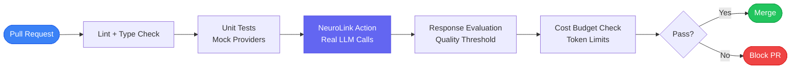
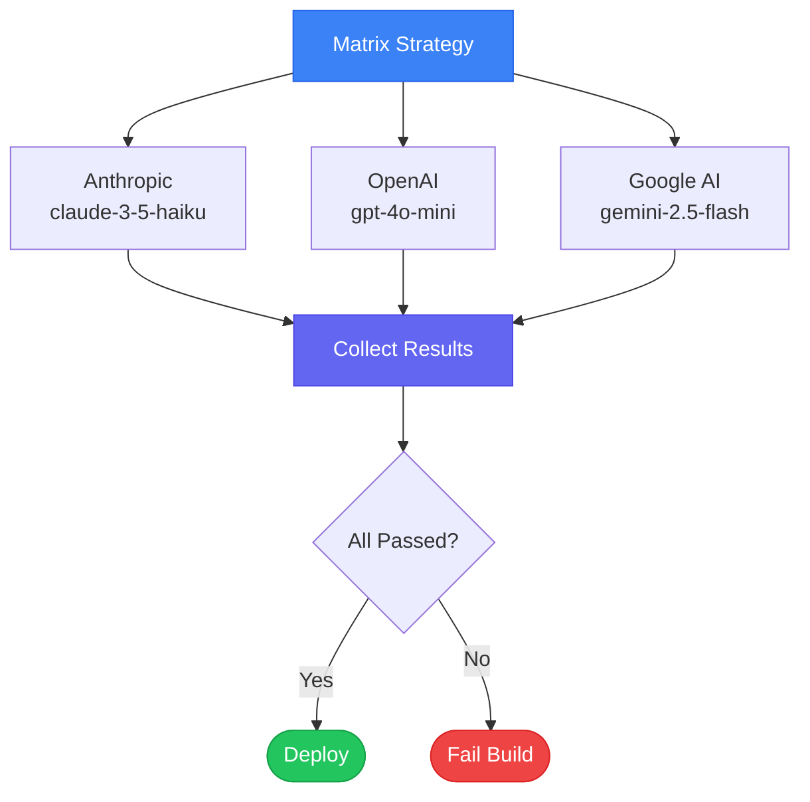
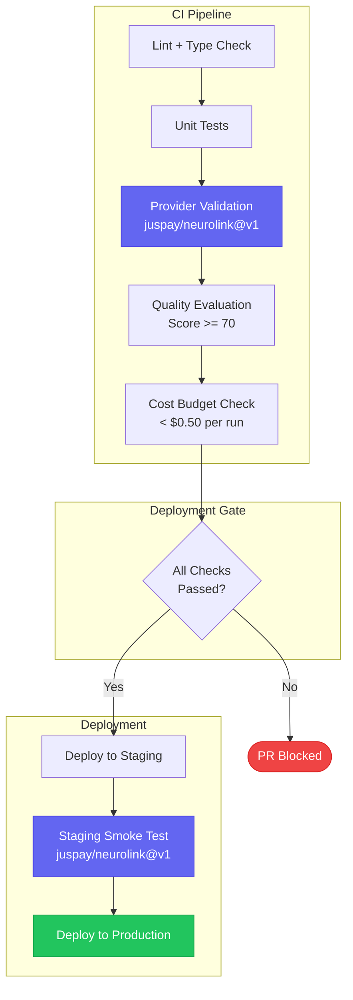

Every team that ships AI features eventually asks the same question: how do we know the model still works after this commit? Unit tests cover your application logic, but they cannot tell you whether the LLM response quality has degraded, whether a provider API is returning errors, or whether your latest prompt change doubled your token spend. The NeuroLink GitHub Action brings those checks into your pull request workflow so that every merge is backed by real provider validation, response evaluation, and cost tracking.

This guide walks through the full setup: from a minimal workflow that validates a single provider, to a production-grade pipeline with multi-provider matrix testing, budget gating, caching, and deployment gates.

---

## Why CI/CD for AI Is Different

Traditional CI/CD pipelines test deterministic code. You call a function, you get the same output every time, and you assert on that output. AI applications break that contract. The same prompt can produce different responses across runs, providers, and model versions.

That means your pipeline needs three capabilities that traditional CI lacks:

1. **Provider validation** -- confirm that each provider API is reachable and returning well-formed responses.
2. **Response quality scoring** -- evaluate whether the output meets a quality threshold, not just whether the call succeeded.
3. **Cost awareness** -- track token usage and estimated cost per run so that a prompt change that triples your spend gets caught before it reaches production.



The NeuroLink GitHub Action sits in the middle of this pipeline. It runs real LLM calls against your configured providers, collects usage metrics, evaluates response quality, and exposes all of that data as step outputs that downstream steps can gate on.

---

## The NeuroLink GitHub Action

The action is published at `juspay/neurolink@v1`. It installs the NeuroLink CLI, parses your inputs, runs a generation call against the specified provider, and sets outputs for the response, token usage, cost, and evaluation score.

Here is the core flow inside the action:

```typescript
// Simplified view of the action entry point
import * as core from "@actions/core";
import {
  parseActionInputs,
  validateActionInputs,
  maskSecrets,
  runNeurolink,
  postResultComment,
  writeJobSummary,
  setActionOutputs,
} from "../lib/action/index.js";

async function run(): Promise<void> {
  const inputs = parseActionInputs();
  maskSecrets(inputs);

  const validation = validateActionInputs(inputs);
  if (!validation.valid) {
    core.setFailed(`Validation failed: ${validation.errors.join(", ")}`);
    return;
  }

  const result = await runNeurolink(inputs);

  if (!result.success) {
    core.setFailed(`Execution failed: ${result.error}`);
    return;
  }

  await postResultComment(inputs, result);
  await writeJobSummary(inputs, result);
  setActionOutputs(result);
}
```

Every API key you pass is automatically masked in logs. The action calls `maskSecrets(inputs)` before any output is written, so even debug mode never leaks credentials.

---

## Basic Setup: Your First AI Workflow

Start with the simplest possible workflow. This validates that your Anthropic API key works and that the model returns a non-empty response on every push to your default branch.

```yaml
name: AI Smoke Test

on:
  pull_request:
    types: [opened, synchronize]

permissions:
  contents: read
  pull-requests: write

jobs:
  ai-smoke:
    runs-on: ubuntu-latest
    steps:
      - uses: actions/checkout@v4

      - name: Validate AI Provider
        uses: juspay/neurolink@v1
        id: ai
        with:
          anthropic_api_key: ${{ secrets.ANTHROPIC_API_KEY }}
          provider: anthropic
          model: claude-3-5-haiku
          prompt: "Respond with exactly: CI health check passed"
          max_tokens: "50"
          temperature: "0"
          enable_analytics: true

      - name: Verify Response
        run: |
          RESPONSE="${{ steps.ai.outputs.response }}"
          if [ -z "$RESPONSE" ]; then
            echo "ERROR: Empty response from provider"
            exit 1
          fi
          echo "Provider: ${{ steps.ai.outputs.provider }}"
          echo "Tokens: ${{ steps.ai.outputs.tokens_used }}"
          echo "Cost: ${{ steps.ai.outputs.cost }}"
```

Key decisions in this workflow:

- **`claude-3-5-haiku`** is the cheapest Anthropic model. Use it for CI validation where you need to confirm the integration works, not the model quality.
- **`temperature: "0"`** makes the output as deterministic as possible, which is what you want for a smoke test.
- **`enable_analytics: true`** activates token counting and cost estimation, which feeds the `tokens_used` and `cost` outputs.

---

## Provider Validation in Pull Requests

When your application supports multiple providers, you need to validate each one in CI. A provider outage or API change should not surprise you in production.

The action supports all 13 NeuroLink providers. Here is the quick reference for the most commonly used ones:

| Provider     | Action Input            | CI Model Recommendation |
|---|---|---|
| Anthropic    | `anthropic_api_key`     | `claude-3-5-haiku`      |
| OpenAI       | `openai_api_key`        | `gpt-4o-mini`           |
| Google AI    | `google_ai_api_key`     | `gemini-2.5-flash`      |
| Mistral      | `mistral_api_key`       | `mistral-small-latest`  |
| OpenRouter   | `openrouter_api_key`    | Any via unified routing |

The auto-detection mode (`provider: auto`) selects the best available provider based on which API keys you supply. For CI, being explicit about the provider is better because it makes failures easier to diagnose.

---

## Response Quality Testing

A successful API call is not enough. You need to know whether the response is actually good. The action supports built-in evaluation scoring when you set `enable_evaluation: true`.

```yaml
      - name: Evaluate Response Quality
        uses: juspay/neurolink@v1
        id: eval
        with:
          anthropic_api_key: ${{ secrets.ANTHROPIC_API_KEY }}
          provider: anthropic
          model: claude-sonnet-4-20250514
          prompt: |
            Generate a concise summary of the following changelog:

            - Added multi-provider failover support
            - Fixed token counting for streaming responses
            - Improved error messages for rate limit errors
            - Updated OpenAI integration to use gpt-4o-mini as default
          enable_evaluation: true
          enable_analytics: true

      - name: Quality Gate
        run: |
          SCORE="${{ steps.eval.outputs.evaluation_score }}"
          echo "Evaluation score: $SCORE"
          if [ "$SCORE" -lt 70 ]; then
            echo "FAILED: Quality score $SCORE is below threshold (70)"
            exit 1
          fi
          echo "PASSED: Quality score $SCORE meets threshold"
```

The evaluation score is a 0-100 integer. Set your threshold based on the content type:

| Content Type        | Recommended Threshold | Rationale                          |
|---|---|---|
| Customer-facing text | 80+                   | Brand accuracy matters             |
| Internal summaries   | 70+                   | Useful but not customer-visible    |
| Code generation      | 80+                   | Incorrect code is worse than none  |
| Creative content     | 60+                   | Subjective quality, wider range    |

---

## Cost Budget Checks

Token costs can spike silently when someone changes a prompt or switches to a more expensive model. Add a cost check step that fails the PR if estimated cost exceeds your budget.

```typescript
// scripts/check-ci-budget.ts
// Run after the NeuroLink action step to enforce cost limits

const MAX_COST_PER_RUN = 0.50; // USD
const MAX_TOKENS_PER_RUN = 50000;

interface CIBudgetInputs {
  cost: number;
  tokensUsed: number;
  provider: string;
  model: string;
}

function checkBudget(inputs: CIBudgetInputs): void {
  const { cost, tokensUsed, provider, model } = inputs;

  console.log(`Provider: ${provider}, Model: ${model}`);
  console.log(`Tokens used: ${tokensUsed}, Cost: $${cost.toFixed(6)}`);

  if (cost > MAX_COST_PER_RUN) {
    throw new Error(
      `Cost $${cost.toFixed(4)} exceeds budget $${MAX_COST_PER_RUN}. ` +
      `Consider using a cheaper model for CI tests.`
    );
  }

  if (tokensUsed > MAX_TOKENS_PER_RUN) {
    throw new Error(
      `Token usage ${tokensUsed} exceeds limit ${MAX_TOKENS_PER_RUN}. ` +
      `Reduce prompt size or max_tokens.`
    );
  }

  console.log("Budget check passed");
}

// Parse from environment variables set by the action outputs
const inputs: CIBudgetInputs = {
  cost: parseFloat(process.env.AI_COST || "0"),
  tokensUsed: parseInt(process.env.AI_TOKENS || "0", 10),
  provider: process.env.AI_PROVIDER || "unknown",
  model: process.env.AI_MODEL || "unknown",
};

checkBudget(inputs);
```

Wire it into your workflow by passing the action outputs as environment variables:

```yaml
      - name: Budget Check
        env:
          AI_COST: ${{ steps.ai.outputs.cost }}
          AI_TOKENS: ${{ steps.ai.outputs.tokens_used }}
          AI_PROVIDER: ${{ steps.ai.outputs.provider }}
          AI_MODEL: ${{ steps.ai.outputs.model }}
        run: npx tsx scripts/check-ci-budget.ts
```

---

## Multi-Provider Matrix Testing

When your application is configured for failover across providers, test each one independently using a GitHub Actions matrix strategy. This validates that every fallback path works.



Here is the matrix workflow:

```yaml
name: Multi-Provider Validation

on:
  pull_request:
    types: [opened, synchronize]

permissions:
  contents: read

jobs:
  provider-matrix:
    runs-on: ubuntu-latest
    strategy:
      fail-fast: false
      matrix:
        include:
          - provider: anthropic
            model: claude-3-5-haiku
            key_secret: ANTHROPIC_API_KEY
          - provider: openai
            model: gpt-4o-mini
            key_secret: OPENAI_API_KEY
          - provider: google-ai
            model: gemini-2.5-flash
            key_secret: GOOGLE_AI_API_KEY

    steps:
      - uses: actions/checkout@v4

      - name: Test ${{ matrix.provider }}
        uses: juspay/neurolink@v1
        id: test
        with:
          api_key: ${{ secrets[matrix.key_secret] }}
          provider: ${{ matrix.provider }}
          model: ${{ matrix.model }}
          prompt: "Return a JSON object with key 'status' and value 'ok'"
          temperature: "0"
          enable_analytics: true
          enable_evaluation: true

      - name: Validate ${{ matrix.provider }} Response
        run: |
          echo "Provider: ${{ matrix.provider }}"
          echo "Model: ${{ matrix.model }}"
          echo "Tokens: ${{ steps.test.outputs.tokens_used }}"
          echo "Cost: ${{ steps.test.outputs.cost }}"
          echo "Score: ${{ steps.test.outputs.evaluation_score }}"
```

Setting `fail-fast: false` ensures that all providers are tested even if one fails. This gives you a complete picture of provider health rather than stopping at the first failure.

---

## Secrets Management

Every provider API key must be stored as a GitHub Secret. Never hardcode keys in workflow files.

### Recommended Secret Naming

Use a consistent naming scheme that maps directly to the action inputs:

| Secret Name           | Action Input            | Provider    |
|---|---|---|
| `ANTHROPIC_API_KEY`   | `anthropic_api_key`     | Anthropic   |
| `OPENAI_API_KEY`      | `openai_api_key`        | OpenAI      |
| `GOOGLE_AI_API_KEY`   | `google_ai_api_key`     | Google AI   |
| `MISTRAL_API_KEY`     | `mistral_api_key`       | Mistral     |

### Automatic Credential Masking

The action automatically masks all API keys in logs before any output is written. Even with `debug: true`, your keys are safe:

```typescript
// The action calls maskSecrets() before any work begins
function maskSecrets(inputs: ActionInputs): void {
  const secretFields = [
    inputs.anthropicApiKey,
    inputs.openaiApiKey,
    inputs.googleAiApiKey,
    inputs.mistralApiKey,
    // ... all 13 provider keys
  ];

  for (const secret of secretFields) {
    if (secret) {
      core.setSecret(secret);
    }
  }
}
```

### OIDC for Cloud Providers

For AWS Bedrock and Google Vertex AI, use OIDC authentication instead of static credentials. OIDC tokens are short-lived and scoped to the workflow run.

```yaml
      # AWS Bedrock with OIDC (no static keys needed)
      - uses: aws-actions/configure-aws-credentials@v4
        with:
          role-to-assume: ${{ secrets.AWS_ROLE_ARN }}
          aws-region: us-east-1

      - uses: juspay/neurolink@v1
        with:
          provider: bedrock
          bedrock_model_id: anthropic.claude-3-5-sonnet-20241022-v2:0
          prompt: "Your prompt here"
```

---

## Caching for Speed

AI API calls are the slowest part of your CI pipeline. Cache responses for identical prompts to avoid redundant calls during re-runs and retries.

### Workflow-Level Caching Strategy

Use the GitHub Actions cache to store NeuroLink CLI installations and response caches:

```yaml
      - name: Cache NeuroLink CLI
        uses: actions/cache@v4
        with:
          path: ~/.neurolink
          key: neurolink-${{ runner.os }}-${{ hashFiles('**/package-lock.json') }}
          restore-keys: |
            neurolink-${{ runner.os }}-

      - name: Cache Node modules
        uses: actions/cache@v4
        with:
          path: node_modules
          key: node-${{ runner.os }}-${{ hashFiles('**/package-lock.json') }}
```

### Prompt Fingerprinting for Response Cache

Hash your prompt content to create a cache key. If the prompt has not changed, skip the API call entirely:

```typescript
// scripts/prompt-cache.ts
import * as crypto from "crypto";
import * as fs from "fs";

interface CacheEntry {
  promptHash: string;
  response: string;
  timestamp: number;
  provider: string;
  model: string;
}

function hashPrompt(prompt: string, model: string): string {
  return crypto
    .createHash("sha256")
    .update(`${prompt}:${model}`)
    .digest("hex")
    .slice(0, 16);
}

function getCachedResponse(
  prompt: string,
  model: string,
  maxAgeMs: number = 3600000
): CacheEntry | null {
  const hash = hashPrompt(prompt, model);
  const cachePath = `.cache/ai-responses/${hash}.json`;

  if (!fs.existsSync(cachePath)) return null;

  const entry: CacheEntry = JSON.parse(fs.readFileSync(cachePath, "utf-8"));
  const age = Date.now() - entry.timestamp;

  if (age > maxAgeMs) {
    fs.unlinkSync(cachePath);
    return null;
  }

  return entry;
}

function saveCachedResponse(
  prompt: string,
  response: string,
  provider: string,
  model: string
): void {
  const hash = hashPrompt(prompt, model);
  const cachePath = `.cache/ai-responses/${hash}.json`;

  fs.mkdirSync(".cache/ai-responses", { recursive: true });

  const entry: CacheEntry = {
    promptHash: hash,
    response,
    timestamp: Date.now(),
    provider,
    model,
  };

  fs.writeFileSync(cachePath, JSON.stringify(entry, null, 2));
}

export { hashPrompt, getCachedResponse, saveCachedResponse };
```

---

## Deployment Gating

The final piece is gating your deployment on the combined results of provider validation, quality scoring, and cost checks. Use a downstream job that depends on all previous jobs.



The gating job uses `needs` to depend on all upstream jobs and `if` conditions to check combined status:

```yaml
  deploy-gate:
    runs-on: ubuntu-latest
    needs: [lint, unit-tests, provider-matrix, quality-check, budget-check]
    if: github.ref == 'refs/heads/release' && github.event_name == 'push'
    steps:
      - name: All Gates Passed
        run: echo "All CI gates passed. Proceeding to deployment."

      - name: Deploy to Staging
        run: |
          echo "Deploying to staging environment..."
          # Your staging deployment script here

      - name: Staging Smoke Test
        uses: juspay/neurolink@v1
        with:
          anthropic_api_key: ${{ secrets.ANTHROPIC_API_KEY }}
          prompt: "Health check: confirm staging deployment is operational"
          provider: anthropic
          model: claude-3-5-haiku
          temperature: "0"
          max_tokens: "50"

      - name: Deploy to Production
        run: |
          echo "Staging verified. Deploying to production..."
          # Your production deployment script here
```

Notice the staging smoke test uses the NeuroLink action itself to verify the deployment. This confirms that the deployed application can reach AI providers from the staging environment, catching network and configuration issues before production.

---

## Complete Workflow Example

Here is a production-ready workflow that combines everything covered in this guide into a single file. Copy it as `.github/workflows/ai-cicd.yml` in your repository.

```yaml
name: AI CI/CD Pipeline

on:
  push:
    branches: [release]
  pull_request:
    branches: [release]

permissions:
  contents: read
  pull-requests: write

jobs:
  lint-and-test:
    runs-on: ubuntu-latest
    steps:
      - uses: actions/checkout@v4
      - uses: actions/setup-node@v4
        with:
          node-version: "22"
          cache: "npm"
      - run: npm ci
      - run: npm run lint
      - run: npm run type-check
      - run: npm run test:unit

  ai-validation:
    runs-on: ubuntu-latest
    needs: [lint-and-test]
    strategy:
      fail-fast: false
      matrix:
        include:
          - provider: anthropic
            model: claude-3-5-haiku
            key_secret: ANTHROPIC_API_KEY
          - provider: openai
            model: gpt-4o-mini
            key_secret: OPENAI_API_KEY
    steps:
      - uses: actions/checkout@v4

      - name: Validate ${{ matrix.provider }}
        uses: juspay/neurolink@v1
        id: validate
        with:
          api_key: ${{ secrets[matrix.key_secret] }}
          provider: ${{ matrix.provider }}
          model: ${{ matrix.model }}
          prompt: "Return JSON: {\"status\": \"ok\", \"provider\": \"${{ matrix.provider }}\"}"
          temperature: "0"
          enable_analytics: true
          enable_evaluation: true

      - name: Check Results
        run: |
          echo "Provider: ${{ matrix.provider }}"
          echo "Tokens: ${{ steps.validate.outputs.tokens_used }}"
          echo "Cost: ${{ steps.validate.outputs.cost }}"

          SCORE="${{ steps.validate.outputs.evaluation_score }}"
          if [ -n "$SCORE" ] && [ "$SCORE" -lt 60 ]; then
            echo "Quality score too low: $SCORE"
            exit 1
          fi

  deploy:
    runs-on: ubuntu-latest
    needs: [lint-and-test, ai-validation]
    if: github.ref == 'refs/heads/release' && github.event_name == 'push'
    steps:
      - uses: actions/checkout@v4
      - name: Deploy
        run: echo "All gates passed. Deploying..."
```

---

## Workflow Permissions Reference

Always use the minimum required permissions. The NeuroLink action needs different permissions depending on which features you enable:

| Feature            | Required Permission         |
|---|---|
| Basic generation    | `contents: read`            |
| PR comments         | `pull-requests: write`      |
| Issue comments      | `issues: write`             |
| AWS OIDC            | `id-token: write`           |
| Code checkout       | `contents: read`            |

If you only use the action for provider validation without posting comments, you need only `contents: read`.

---

## Debugging Failed Runs

When a workflow fails, enable debug mode to get detailed logs:

```yaml
      - uses: juspay/neurolink@v1
        with:
          debug: true
          # ... your other inputs
```

Debug output includes:

- Full request and response payloads with secrets masked
- Provider selection logic and fallback decisions
- Token counting breakdown (prompt vs completion)
- Error stack traces with context

For intermittent failures, check the action's `error` output:

```yaml
      - name: Handle Failure
        if: failure()
        run: |
          echo "Error: ${{ steps.ai.outputs.error }}"
          echo "This may be a transient provider issue."
          echo "Check provider status pages before investigating further."
```

---

## Best Practices Checklist

Use this checklist when setting up AI CI/CD with the NeuroLink GitHub Action:

- [ ] Use the cheapest model tier for CI validation (`haiku`, `gpt-4o-mini`, `gemini-flash`)
- [ ] Set `temperature: "0"` for deterministic smoke tests
- [ ] Enable `enable_analytics: true` for cost tracking on every run
- [ ] Store all API keys as GitHub Secrets with consistent naming
- [ ] Use OIDC for AWS and GCP instead of static credentials
- [ ] Set `fail-fast: false` on matrix strategies to test all providers
- [ ] Add cost budget checks that fail the PR when spend exceeds limits
- [ ] Use `enable_evaluation: true` for quality gating on critical prompts
- [ ] Cache NeuroLink CLI and node_modules between runs
- [ ] Add a staging smoke test that uses the action before production deploy
- [ ] Set `timeout: "300"` (5 minutes) to prevent hung API calls from blocking CI
- [ ] Use `post_comment: true` with `update_existing_comment: true` to avoid PR comment spam

---

## What Comes Next

You now have a CI/CD pipeline that validates AI providers, scores response quality, and gates deployments on cost budgets. From here, consider adding prompt regression tests that compare outputs against a golden dataset, integrating evaluation score trends into your monitoring dashboard, and expanding your matrix to cover all 13 providers that NeuroLink supports.

The goal is to make AI deployments as boring as any other deployment. When every merge is backed by real provider validation and quality scoring, you ship with confidence.

---

**Related posts:**

- [CI/CD for AI Applications: Testing, Building, and Deploying with Confidence](/posts/cicd-for-ai-applications/)
- [Conversation Summarization: Smart Context Management for Long Chats](/posts/conversation-summarization-patterns/)
- [Lifecycle Middleware: onFinish, onError, and onChunk Hooks](/posts/lifecycle-middleware-hooks/)
