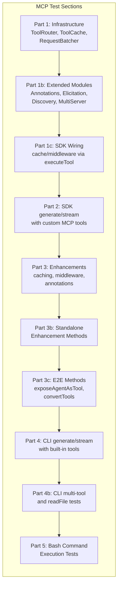
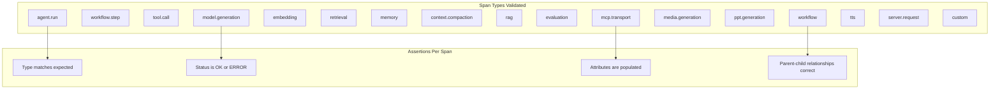
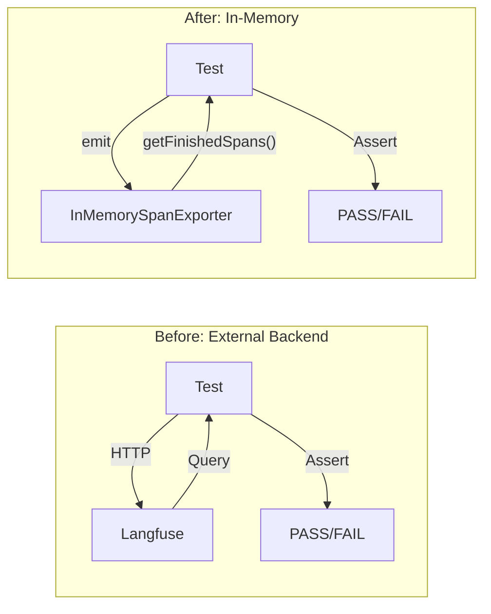

We designed NeuroLink's test strategy around one principle: if a feature ships without a dedicated test suite, it does not exist. When you build a universal AI SDK that routes traffic to 13 providers, orchestrates MCP tool chains, manages conversation memory, generates video and presentations, and exposes server adapters for four web frameworks, the surface area for regressions is enormous. Our answer is 20 continuous test suites, each focused on a single capability, all running on every commit. This post walks through why testing AI software is uniquely difficult, how we architected our suite, and what each of those 20 files actually validates.

## Why Testing an AI SDK Is Harder Than Testing a CRUD App

Traditional backend tests follow a comforting pattern: given input X, assert output Y. AI SDKs break that contract in at least five ways.

### Non-determinism at the core

Every provider returns a slightly different response for the same prompt. Temperature, model version updates, and even time-of-day routing by the provider can shift outputs. Tests that assert exact strings are fragile by design.

### External dependency explosion

NeuroLink talks to OpenAI, Anthropic, Google Vertex, Google AI Studio, AWS Bedrock, Azure OpenAI, Mistral, Hugging Face, Ollama, OpenRouter, LiteLLM, and more. Each provider has its own rate limits, authentication schemes, model naming conventions, and failure modes.

### Cost-per-test

Every real API call costs money. A naive integration test suite that hammers GPT-4 for 200 assertions would burn through credits in hours. We need to test thoroughly without bankrupting the project.

### Streaming and real-time behavior

Half of NeuroLink's value is in streaming responses chunk by chunk. Testing streaming requires validating partial results, backpressure handling, and graceful interruption -- none of which fit neatly into a synchronous assertion model.

### Multi-transport protocols

MCP alone supports stdio, HTTP, SSE, and Streamable HTTP transports. Each transport has its own connection lifecycle, error recovery, and authentication patterns that need independent verification.

## The Test Suite Architecture

Our test directory contains 20 continuous test suite files, each named `continuous-test-suite-*.ts`. Every suite is a self-contained executable that can run independently or as part of the full battery.

```mermaid
graph TD
    subgraph "20 Continuous Test Suites"
        A["continuous-test-suite.ts<br/>Core MCP + CLI"]
        B["continuous-test-suite-providers.ts<br/>13 Providers"]
        C["continuous-test-suite-mcp.ts<br/>MCP Infrastructure"]
        D["continuous-test-suite-mcp-http.ts<br/>MCP HTTP Transport"]
        E["continuous-test-suite-rag.ts<br/>RAG Processing"]
        F["continuous-test-suite-memory.ts<br/>Conversation Memory"]
        G["continuous-test-suite-middleware.ts<br/>Lifecycle Middleware"]
        H["continuous-test-suite-observability.ts<br/>OpenTelemetry"]
        I["continuous-test-suite-tracing.ts<br/>Trace Points"]
        J["continuous-test-suite-media-gen.ts<br/>Image + Video"]
        K["continuous-test-suite-tts.ts<br/>Text-to-Speech"]
        L["continuous-test-suite-ppt.ts<br/>PowerPoint Gen"]
        M["continuous-test-suite-workflow.ts<br/>Workflow Engine"]
        N["continuous-test-suite-evaluation.ts<br/>RAGAS Scoring"]
        O["continuous-test-suite-context.ts<br/>Context Compaction"]
        P["continuous-test-suite-client.ts<br/>Client SDK"]
        Q["continuous-test-suite-servers.ts<br/>Server Adapters"]
        R["continuous-test-suite-proxy.ts<br/>Claude Proxy"]
        S["continuous-test-suite-tool-reliability.ts<br/>Tool Reliability"]
        T["zod-schema-test-function.ts<br/>Zod Schema Validation"]
    end

    subgraph "Support Files"
        F1["fixtures/"]
        F2["types/"]
        F3["run-all-providers-sequential.sh"]
        F4["test-all-providers.sh"]
    end

    A --> F1
    B --> F2
```



### The execution model

Each suite follows the same pattern. It defines a list of test functions, each returning `true` (pass), `false` (fail), or `null` (skip). Provider-dependent tests skip gracefully when credentials are missing. This lets us run the full battery in CI without needing every API key configured.

```typescript
// The common test function signature across all suites
type TestFunction = {
  name: string;
  fn: () => Promise<boolean | null>;
  category?: string;
};

type TestResult = {
  name: string;
  result: boolean | null; // true = PASS, false = FAIL, null = SKIP
  error: string | null;
};
```

Every suite also respects provider-specific token limits, so the same test can run against Anthropic (8192 max tokens), Vertex (10000), or OpenAI (16384) without manual tuning.

```typescript
const PROVIDER_MAX_TOKENS: Record<string, number> = {
  anthropic: 8192,
  vertex: 10000,
  "google-ai-studio": 10000,
  "google-ai": 10000,
  openai: 16384,
  bedrock: 8192,
  ollama: 4096,
  openrouter: 4096,
};
```

## Suite 1: Provider Tests

The `continuous-test-suite-providers.ts` file is the largest single suite. It validates provider-specific features across the entire NeuroLink ecosystem.

### What it covers

- **Structured output with Zod schemas**: Vertex, Vertex Alt, Vertex Flash, and Gemini limitation detection
- **Vertex model variants**: Thinking, Chat, and Pro models
- **Gemini 3 specifics**: `isZodSchema` checks, token counting, `disableTools` flag
- **OpenRouter**: Generate, stream, tool use, structured output, and model discovery
- **Thinking levels**: Minimal, low, medium, and high reasoning modes
- **Model registry completeness**: Every registered model resolves correctly
- **Network retry and provider fallback**: Automatic recovery from transient failures
- **All-provider generate/stream loop**: Iterates through every configured provider
- **LiteLLM vision capability**: `supportsVision`, `validateImageCount`, `convertToContent`, and `countImagesInMessage`

```typescript
// Example: testing structured output across providers
import { NeuroLink } from "../dist/index.js";
import { resolveModel } from "../dist/utils/modelAliasResolver.js";

const neurolink = new NeuroLink();

// Validate that model aliases resolve correctly
const resolved = resolveModel("gpt-4o");
assert(resolved.provider === "openai");
assert(resolved.model === "gpt-4o");

// Test generate with structured output (Zod schema)
const result = await neurolink.generate({
  input: { text: "List 3 colors as JSON" },
  provider: "vertex",
  model: "gemini-2.5-pro",
  structuredOutput: colorSchema,
});
assert(result.content !== "");
```

## Suite 2: MCP Infrastructure Tests

The `continuous-test-suite-mcp.ts` file contains 45 test functions with over 185 assertions across 10 sections. This is where we validate the Model Context Protocol integration that lets AI models call external tools.



### Key components tested

- **ToolRouter**: Routes tool calls to the correct MCP server based on capability matching
- **ToolCache**: Caches tool discovery results to avoid repeated server roundtrips
- **RequestBatcher**: Batches multiple tool calls for efficiency
- **Annotations**: Validates tool metadata for safety classification
- **Elicitation**: Tests the runtime parameter elicitation protocol
- **Discovery**: Enhanced tool discovery across multiple MCP servers
- **Agent Exposure**: Tests `exposeAgentAsTool` for nested agent architectures
- **Circuit Breaker**: Validates blocking behavior when a server is unhealthy

## Suite 3: MCP HTTP Transport Tests

The `continuous-test-suite-mcp-http.ts` file tests MCP over HTTP end-to-end through the NeuroLink SDK integration layer. It validates HTTP transport connections, auth headers (Bearer and API Key), tool discovery, retry logic, rate limiting, timeout handling, SSE transport via local mock servers, and real MCP server integration with services like DeepWiki and Sequential Thinking.

## Suite 4: RAG Processing Tests

The `continuous-test-suite-rag.ts` file verifies the entire Retrieval-Augmented Generation pipeline.

### Chunking strategies tested

All 10 chunking strategies get individual validation:

1. Character-based splitting
2. Recursive character splitting
3. Sentence-level splitting
4. Token-aware splitting
5. Markdown-aware splitting
6. HTML-aware splitting
7. JSON structure-preserving splitting
8. LaTeX-aware splitting
9. Semantic splitting
10. Semantic-markdown hybrid splitting

### Factory and registry patterns

```typescript
// The RAG suite validates both Factory and Registry patterns
import {
  ChunkerFactory,
  createChunker,
  getAvailableStrategies,
} from "../src/lib/rag/ChunkerFactory.js";
import {
  ChunkerRegistry,
  getAvailableChunkers,
  getChunker,
} from "../src/lib/rag/ChunkerRegistry.js";
import {
  RerankerFactory,
  createReranker,
  getAvailableRerankerTypes,
} from "../src/lib/rag/reranker/RerankerFactory.js";

// Verify all strategies are registered and produce valid chunks
const strategies = getAvailableStrategies();
assert(strategies.length === 10);

for (const strategy of strategies) {
  const chunker = createChunker(strategy);
  const chunks = await chunker.chunk(sampleDocument);
  assert(chunks.length > 0);
  assert(chunks.every((c) => c.content.length > 0));
}
```

The suite also validates hybrid search (BM25 combined with vector fusion) and the full pipeline integration from document ingestion through retrieval.

## Suite 5: Streaming Tests

Streaming is tested across multiple suites rather than in a single dedicated file. The core `continuous-test-suite.ts`, provider tests, MCP tests, and client SDK tests all exercise streaming paths. Each validates chunk delivery, backpressure, interruption handling (SIGINT/SIGTERM), and proper finalization.

## Suite 6: Memory Tests

The `continuous-test-suite-memory.ts` file runs 14 tests covering conversation memory management.

### What it validates

- **Multi-turn generate and stream**: Conversation context persists across turns
- **Sequence handling**: Messages arrive in the correct order
- **Summarization**: Long conversations get summarized to stay within token budgets
- **Enable/disable toggle**: Memory can be turned on and off per-request
- **Redis persistence**: Conversations survive process restarts via Redis
- **Redis connection pooling**: Multiple concurrent conversations share a pool
- **Memory retrieval tools**: AI can invoke `retrieve_context` to fetch prior conversation segments
- **Conversation title generation**: Automatic title assignment based on content
- **CLI memory persistence**: Memory survives across CLI sessions
- **Cleanup**: Old conversations are properly garbage collected
- **Large context handling**: Memory works correctly with context windows approaching limits
- **Cross-session persistence**: A conversation started in one session is fully available in another
- **Tools with memory**: Tool calls interact correctly with memory state

## Suite 7: Lifecycle Middleware Tests

The `continuous-test-suite-middleware.ts` file tests the consumer-facing lifecycle callback API. These are the hooks developers use to observe and intercept AI operations.

```typescript
// The middleware suite validates these callback patterns
const result = await neurolink.generate({
  input: { text: "Hello" },
  provider: "vertex",
  onFinish: (result) => {
    // Validate result contains all expected fields
    assert(result.content !== undefined);
    assert(result.usage !== undefined);
  },
  onError: (error) => {
    // Validate error is properly categorized
    assert(error.message !== undefined);
  },
});

// Stream middleware includes chunk-level observation
const stream = await neurolink.stream({
  input: { text: "Hello" },
  provider: "vertex",
  onChunk: (chunk) => {
    // Each chunk must have content
    assert(typeof chunk === "string" || chunk.content !== undefined);
  },
  onFinish: (result) => {
    assert(result.content.length > 0);
  },
  onError: (error) => {
    // Error handler must fire on failures
    assert(error instanceof Error);
  },
});
```

Provider-dependent tests skip when credentials are not configured, keeping CI green even with partial secrets.

## Suite 8: Observability Tests

The `continuous-test-suite-observability.ts` file tests OpenTelemetry instrumentation, context management, span processors, external TracerProvider mode, and operation name detection. Crucially, all tests run locally using `InMemorySpanExporter` -- no Langfuse or external observability backend is needed.

```typescript
// OTel bootstrap happens BEFORE importing NeuroLink
import {
  InMemorySpanExporter,
  SimpleSpanProcessor,
} from "@opentelemetry/sdk-trace-base";
import { NodeTracerProvider } from "@opentelemetry/sdk-trace-node";

const spanExporter = new InMemorySpanExporter();
const traceProvider = new NodeTracerProvider({
  spanProcessors: [new SimpleSpanProcessor(spanExporter)],
});
traceProvider.register();

// Now import NeuroLink -- it picks up the registered provider
import { NeuroLink } from "../dist/index.js";
```

This pattern ensures that every span NeuroLink emits is captured and inspectable within the test process itself.

## Suite 9: Tracing Tests

The `continuous-test-suite-tracing.ts` file complements the observability suite by providing end-to-end validation of every trace point. It uses the same in-process `InMemorySpanExporter` approach but focuses on verifying that all span types (agent runs, workflow steps, tool calls, model generations, embeddings, retrievals, memory operations, context compaction, RAG, evaluation, MCP transport, media generation, and more) are correctly emitted with proper attributes and status codes.



## Suite 10: Media Generation Tests

The `continuous-test-suite-media-gen.ts` file covers image generation, image editing, image caching, and video generation across SDK generate/stream and CLI generate/stream modes. It tests both the Gemini Imagen pipeline and the Veo video synthesis pipeline.

## Suite 11: Text-to-Speech Tests

The `continuous-test-suite-tts.ts` file validates TTS functionality across the SDK. It covers `TTSProcessor` initialization, handler registration, Google TTS handler synthesis, voice listing, multiple voices and languages, audio format output (MP3 and WAV), CLI TTS flags (`--tts`, `--tts-voice`), error handling for invalid providers, stream integration with TTS, and the `GenerateResult.audio` shape.

## Suite 12: PowerPoint Generation Tests

The `continuous-test-suite-ppt.ts` file tests the PowerPoint presentation generation pipeline end-to-end, including content planning, slide generation, rendering, theming, logo injection, and PPTX file validation. If you can describe a presentation in a prompt, this suite makes sure the output is a valid `.pptx` file.

## Suite 13: Workflow Engine Tests

The `continuous-test-suite-workflow.ts` file tests the NeuroLink Workflow Engine end-to-end. It validates consensus patterns, multi-judge scoring, fallback chains, adaptive routing, checkpointing, HITL suspend/resume, workflow registry management, ensemble executors, judge scorers, response conditioners, CLI workflow commands, and branch/parallel execution.

## Suite 14: Evaluation Tests

The `continuous-test-suite-evaluation.ts` file runs 13 tests covering the RAGAS-style evaluation system. It validates `RAGASEvaluator` initialization, scoring dimensions (faithfulness, relevance, answer relevancy, context precision, context recall), the direct scoring API, the `ContextBuilder` utility, `RetryManager` behavior (including exhaustion), multi-provider evaluation, batch evaluation, custom prompt evaluation, and observability span instrumentation.

## Suite 15: Context Management Tests

The `continuous-test-suite-context.ts` file tests context compaction, budget checking (the 80% threshold), abort signals, token estimation, prompt caching, and concurrent conversation handling. These tests ensure NeuroLink manages context windows correctly even under pressure.

## Suite 16: Client SDK Tests

The `continuous-test-suite-client.ts` file tests the consumer-facing Client SDK the way real developers use it: start a real NeuroLink server (Hono adapter), connect with `NeuroLinkClient` over HTTP, generate text, stream responses, execute tools, and verify auth, interceptors, error handling, and the AI SDK adapter.

## Suite 17: Server Adapter Tests

The `continuous-test-suite-servers.ts` file verifies that server adapters export correctly, route creators and middleware factories work, real servers can start and respond to HTTP requests, streaming works via SSE, and server lifecycle (start, stop, status) is properly managed.

## Suite 18: Claude Proxy Tests

The `continuous-test-suite-proxy.ts` file tests the Claude Proxy server end-to-end. It starts the proxy, sends real requests through it, verifies responses, tests error handling, validates account management, and stops the proxy. This suite requires a built CLI and a valid OAuth token.

## Suite 19: Tool Reliability Tests

The `continuous-test-suite-tool-reliability.ts` file tests tool execution metadata, event emitter completeness, timeout enforcement, error category tracking (timeout, validation, internal), and OpenTelemetry span generation for tool operations. It validates per-tool timeout via `registerTool()` options and ensures provider/model population on stream/generate results.

## Suite 20: Zod Schema Validation

The `zod-schema-test-function.ts` file provides cross-provider Zod schema validation. It exports a `testComplexZodSchemaMultiProvider` function that the provider suite uses to verify structured output works consistently across all supported providers.

## CI Pipeline Integration

Our CI pipeline on GitHub Actions runs on every push to `release` and every pull request. The pipeline validates code quality, security, and builds before any test suite runs.

```yaml
# .github/workflows/ci.yml (simplified)
name: CI

on:
  push:
    branches: [release]
  pull_request:
    branches: [release]

jobs:
  test:
    runs-on: ubuntu-latest
    strategy:
      matrix:
        node-version: [20]
    steps:
      - uses: actions/checkout@v4
      - uses: pnpm/action-setup@v4
        with:
          version: 9
      - uses: actions/setup-node@v4
        with:
          node-version: 20
          cache: "pnpm"
      - run: pnpm install
      - run: pnpm exec svelte-kit sync
      - run: pnpm run format:check
      - run: npx eslint src/ --max-warnings=300
      - run: npx eslint test/continuous-test-suite*.ts
              test/zod-schema-test-function.ts --max-warnings=10
      - run: pnpm run validate:all
      - run: pnpm run build
      - run: pnpm run build:cli
      - run: node dist/cli/index.js --help

  quality-gate:
    runs-on: ubuntu-latest
    steps:
      - uses: actions/checkout@v4
      # ... setup steps ...
      - run: pnpm run validate
      - run: pnpm run validate:env
      - run: pnpm run validate:security
      - run: npx tsc --noEmit --strict --project tsconfig.json
```

The CI pipeline includes three parallel jobs:

1. **test**: Lint, format check, build, and CLI smoke test
2. **build-check**: Package build verification and content inspection
3. **quality-gate**: Security validation, TypeScript strict mode, and commit message format

A fourth job, **semantic-release-validation**, runs after test and build-check pass to verify the release configuration.

## Test Patterns: Mocking vs Real Calls

We use a layered approach to minimize cost while maximizing coverage.

### Layer 1: In-process validation (no API calls)

Most tests validate module exports, factory patterns, configuration parsing, and internal logic without any provider calls. These run in milliseconds.

```typescript
// Example: validating chunker factory without any API call
const strategies = getAvailableStrategies();
assert(strategies.length === 10);

const chunker = createChunker("markdown");
const chunks = await chunker.chunk("# Title\n\nParagraph one.\n\n## Section");
assert(chunks.length > 0);
```

### Layer 2: In-memory span capture (no external backends)

Observability and tracing tests use `InMemorySpanExporter` to capture and inspect OpenTelemetry spans within the test process itself. No Langfuse, Jaeger, or external collector is needed.

### Layer 3: Graceful skip for missing credentials

Provider-dependent tests check for API keys at runtime and skip with a `null` result when credentials are absent. This keeps CI green while still exercising the full suite in environments with secrets configured.

```typescript
// Provider tests skip gracefully when keys are missing
async function testVertexGenerate(): Promise<boolean | null> {
  if (!process.env.GOOGLE_APPLICATION_CREDENTIALS) {
    return null; // SKIP -- no credentials
  }

  const neurolink = new NeuroLink();
  const result = await neurolink.generate({
    input: { text: "Hello" },
    provider: "vertex",
    model: "gemini-2.5-pro",
  });

  return result.content.length > 0;
}
```

### Layer 4: Real API calls (full integration)

When credentials are present -- in local development or in a secrets-enabled CI environment -- suites execute real API calls against live providers. This catches regressions that mocks would miss, like model deprecations or changed response formats.

## Lessons Learned After 20 Suites

### One file per capability, not one file per layer

Early on, we organized tests by layer (unit, integration, e2e). That fell apart quickly because a single feature like MCP touches all three layers. Organizing by capability means the MCP suite owns everything from in-memory module validation to real server integration. When MCP breaks, you open one file.

### Skip beats fail in CI

A test that fails because of a missing API key teaches you nothing. A test that skips tells you "this path was not exercised." Our CI dashboard distinguishes PASS, FAIL, and SKIP clearly, so we always know what was actually validated.

### Token limits are per-provider configuration, not magic numbers

Hardcoding `maxTokens: 4096` across all tests leads to silent truncation on some providers and wasted tokens on others. The `PROVIDER_MAX_TOKENS` map ensures each provider is tested at its actual capacity.

### In-memory span capture is a game changer

Before we adopted `InMemorySpanExporter`, observability tests required a running Langfuse instance. That made them flaky and slow. Capturing spans in-process made these tests as fast and reliable as unit tests.



### Shell scripts for the full provider sweep

We maintain `run-all-providers-sequential.sh` and `test-all-providers.sh` scripts that iterate through every configured provider. These are not CI tests -- they are manual validation tools for pre-release checks. A full provider sweep takes 15-20 minutes but catches cross-provider inconsistencies that single-provider CI misses.

### Test suites are documentation

Each suite starts with a comprehensive JSDoc comment listing exactly what it tests, how to run it, and what environment variables it needs. When a new engineer joins the team, the test files are often the first thing they read to understand a capability.

## What Is Next

We are actively working on suite 21: a dedicated **Hippocampus persistent memory** test suite that will validate cross-session memory retrieval, memory scoring, and the vector-backed long-term memory store. Beyond that, we plan to add chaos engineering tests that randomly kill provider connections mid-stream and verify graceful recovery.

Twenty suites is not a goal -- it is a snapshot. Every new feature that ships gets its own suite before it merges. The number will keep growing. The regressions will not.

---

**Related posts:**

- [Testing AI Applications: A Complete Guide](/posts/testing-ai-applications/)
- [Live Documentation: Building an MCP Docs Server Inside Docusaurus](/posts/docusaurus-mcp-docs-server/)
- [GitHub Actions for AI: Automating NeuroLink in Your CI/CD Pipeline](/posts/github-actions-ai-cicd/)
