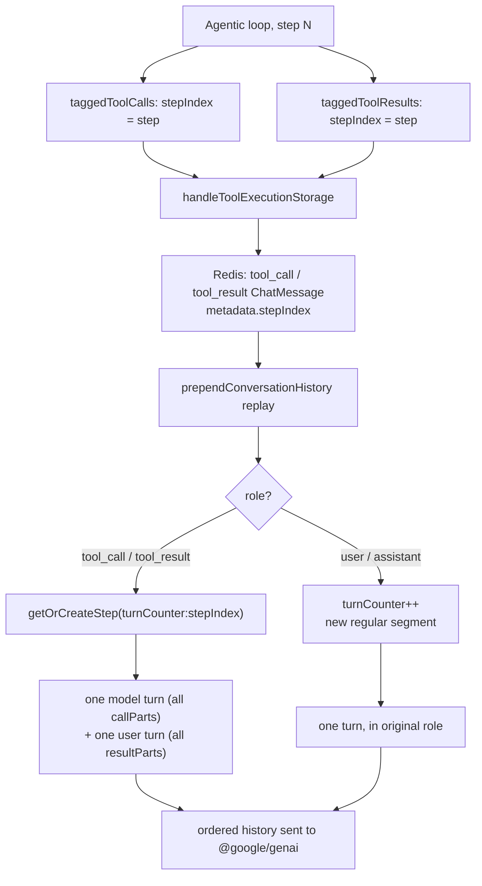

Under the hood, an agent running on Gemini 3 through NeuroLink's native Vertex path asks for two tools in parallel — say a customer lookup and an order lookup — in the same step. That's step 0 of turn 1. The conversation continues, and a few messages later the agent does it again: two more parallel tool calls, also numbered step 0, because the step counter resets at the start of every `generate()` or `stream()` call. Nothing in a bare `stepIndex` distinguishes those two step-0s from each other. Replay the stored history without knowing which turn a step belongs to, and the mechanism that is supposed to keep parallel calls grouped together will instead merge turn 1's step 0 with turn 2's step 0 into one bucket — scrambling which tool result answered which tool call, in a request built to look like a well-formed multi-turn conversation. This is the internals of the fix for that: the commit `0459627c7` (`feat(gemini3): add support for conversation memory for gemini 3 models`, 2026-04-16), and the composite key it introduced to keep multi-step tool calls in order.

## Where the step number comes from

The step number itself is nothing exotic — it's the loop counter in NeuroLink's native Vertex agentic loop, in `GoogleVertexProvider`. Both the streaming path (`runNativeGemini3StreamLoop`) and the non-streaming native path run a `while (step < maxSteps)` loop, and each iteration that produces tool calls tags them with the current `step` value before storing them:

```typescript
// Tag each tool call with the step's thoughtSignature and stepIndex
// so they can be stored on the tool_call ChatMessage metadata in Redis
// and reconstructed correctly in prependConversationHistory.
const taggedToolCalls = stepToolCalls.map((tc, i) => ({
  ...tc,
  ...(i === 0 && stepThoughtSig
    ? { thoughtSignature: stepThoughtSig }
    : {}),
  stepIndex: step,
}));
const taggedToolResults = stepToolExecs.map((te) => ({
  toolName: te.name,
  result: te.output,
  stepIndex: step,
}));
```

Both the model's thought signature (Gemini 3's reasoning-continuity token) and the step index ride along on the same tagged objects, which then go into `handleToolExecutionStorage` — the `BaseProvider` persistence hook that both native Gemini 3 loops call after executing a batch of tools. Two parallel tool calls executed in the same loop iteration get the *same* `stepIndex`; two tool calls from two different iterations get different ones. That much is simple. The hard part is what happens once those numbers reach storage and have to be turned back into a request.

## What actually lands in Redis

`stepIndex` isn't a first-class column — it's a field on `ChatMessageMetadata`, the same free-form metadata bag that already carried `thoughtSignature`, `truncated`, and `toolOutputPreview`. The commit added exactly one line to the type:

```typescript
// src/lib/types/conversation.ts
export type ChatMessageMetadata = {
  // ...
  /** Step index for reconstructing parallel vs sequential tool calls */
  stepIndex?: number;
  // ...
};
```

and `RedisConversationMemoryManager` merges it into the metadata object it builds for each `tool_call` and `tool_result` `ChatMessage` it writes:

```typescript
// src/lib/core/redisConversationMemoryManager.ts
metadata: {
  ...(toolCall.thoughtSignature
    ? { thoughtSignature: String(toolCall.thoughtSignature) }
    : {}),
  ...(toolCall.stepIndex !== null && toolCall.stepIndex !== undefined
    ? { stepIndex: Number(toolCall.stepIndex) }
    : {}),
},
```

and, on the result side, folded alongside the existing truncation/artifact fields:

```typescript
metadata: {
  // ...
  ...(truncated && { toolOutputPreview: preview }),
  ...(truncated && { originalSize }),
  ...(artifactId && { artifactId }),
  ...(toolResult.stepIndex !== null &&
  toolResult.stepIndex !== undefined
    ? { stepIndex: Number(toolResult.stepIndex) }
    : {}),
},
```

The same commit fixed a second, smaller bug in this exact block: tool-result messages used to resolve their tool name only from a `toolCallMap` keyed by `toolCallId`, with no fallback. If a result arrived whose call hadn't been persisted under a name the map recognized, the tool name silently fell back to `"unknown"`. The fix adds `String(toolResult.toolName || "unknown")` as a fallback before giving up — a one-line change, but it means a `tool_result` row that later gets replayed into history is far less likely to carry a lost tool name alongside its (now correctly numbered) step.

Two things worth being precise about here. First, `stepIndex` is optional — messages written before this shipped, or written by a code path that doesn't tag it, simply don't have it, and the reconstruction logic below has to cope with `undefined`. Second, this metadata field is the *only* place `stepIndex` is durable. Nothing else about a stored `ChatMessage` says which step it belonged to; a `tool_call` row and its matching `tool_result` row are otherwise linked only by `toolCallId` (a UUID persisted specifically because, per the type's own comment, "a parallel batch writes all calls before any result, so position carries no pairing information"). `stepIndex` and `toolCallId` are solving adjacent but different problems: one says which batch a call belongs to, the other says which specific call a specific result answers.

## The composite key

This is the part the commit is actually about. `prependConversationHistory` — the method `GoogleVertexProvider` calls to turn stored `ChatMessage[]` history back into the `{ role, parts }` array the `@google/genai` SDK expects — walks the conversation once and groups `tool_call`/`tool_result` rows into buffers keyed on more than just `stepIndex`:

```typescript
// Composite key: "<turnCounter>:<stepIndex>" ensures step 1 of
// conversational turn 1 never collides with step 1 of turn 2.
const stepMap = new Map<string, VertexToolStep>();
const segments: VertexSegment[] = [];

// Incremented each time a regular user/assistant message is encountered,
// acting as a logical turn boundary between agentic loop iterations.
let turnCounter = 0;

const makeKey = (stepIndex: number | undefined): string =>
  `${turnCounter}:${stepIndex ?? "undefined"}`;

const getOrCreateStep = (stepIndex: number | undefined): VertexToolStep => {
  const key = makeKey(stepIndex);
  if (stepMap.has(key)) {
    return stepMap.get(key)!;
  }
  const step: VertexToolStep = {
    type: "tool_step",
    callParts: [],
    resultParts: [],
  };
  stepMap.set(key, step);
  segments.push(step);
  return step;
};
```

`turnCounter` is not read from anywhere in storage — it's derived purely by walking the message list in order and incrementing on every regular `user`/`assistant` message, which is exactly the scenario in the opening paragraph: two separate agentic runs, each restarting its own `stepIndex` from 0, separated by an ordinary chat turn in between. Without `turnCounter` in the key, `getOrCreateStep(0)` called from turn 2 would resolve to the exact same `VertexToolStep` bucket that turn 1's step 0 already populated, and the replayed history would present turn 2's tool calls as though they were still part of turn 1's exchange — parallel calls from two unrelated points in the conversation grouped into one fabricated "step."

The loop that builds these buffers branches on message role:

```typescript
for (const msg of conversationMessages) {
  if (msg.role === "tool_call") {
    const step = getOrCreateStep(msg.metadata?.stepIndex);
    const fcPart: Record<string, unknown> = {
      functionCall: { name: msg.tool || "unknown", args: msg.args || {} },
    };
    if (msg.metadata?.thoughtSignature) {
      fcPart.thoughtSignature = msg.metadata.thoughtSignature;
    }
    step.callParts.push(fcPart);
    continue;
  }

  if (msg.role === "tool_result") {
    const step = getOrCreateStep(msg.metadata?.stepIndex);
    let responsePayload: unknown;
    try {
      responsePayload = msg.content
        ? { result: JSON.parse(msg.content) }
        : { result: "success" };
    } catch {
      responsePayload = { result: msg.content || "success" };
    }
    step.resultParts.push({
      functionResponse: { name: msg.tool || "unknown", response: responsePayload },
    });
    continue;
  }

  // Regular (user / assistant) message — acts as a turn boundary.
  const role = msg.role === "assistant" ? "model" : msg.role;
  if (role !== "user" && role !== "model") {
    continue;
  }
  if (!msg.content || msg.content.trim().length === 0) {
    continue;
  }

  // Increment turn counter BEFORE pushing the segment so that any
  // tool_calls that follow this message get a fresh namespace.
  turnCounter++;

  const textPart: Record<string, unknown> = { text: msg.content };
  if (msg.metadata?.thoughtSignature) {
    textPart.thoughtSignature = msg.metadata.thoughtSignature;
  }
  segments.push({ type: "regular", role, parts: [textPart] });
}
```

Notice the comment on `turnCounter++`: it fires *before* the regular message's segment is pushed, specifically so that any `tool_call` rows appearing after this point in the array get a fresh `turnCounter` value — meaning a fresh namespace for every `stepIndex` that follows. Get that ordering backwards and the boundary would be off by one message, reattaching the next turn's opening tool calls to the previous turn's bucket.

## From buffers to a well-formed request

Buffering isn't the end goal — the buffers exist to be flattened back into the alternating `model`/`user` turn structure Gemini's history validation expects. That happens in a second pass over `segments`, which — critically — preserves insertion order, because both `VertexToolStep` objects and `{ type: "regular", ... }` segments are pushed onto the *same* array as they're encountered:

```typescript
// Emit in order: each ToolStep → model turn (calls) + user turn (results)
for (const seg of segments) {
  if (seg.type === "regular") {
    history.push({ role: seg.role, parts: seg.parts });
  } else {
    if (seg.callParts.length > 0) {
      history.push({ role: "model", parts: seg.callParts });
    }
    if (seg.resultParts.length > 0) {
      history.push({ role: "user", parts: seg.resultParts });
    }
  }
}

return [...history, ...currentContents];
```

A `VertexToolStep` with three `callParts` (three parallel tool calls from the same `stepIndex`) collapses to exactly *one* `model`-role message carrying all three `functionCall` parts, followed by exactly one `user`-role message carrying all three matching `functionResponse` parts — not three separate back-and-forth exchanges. That single-message grouping is what the `@google/genai` SDK's own automatic function-calling path produces natively, and it's why the code elsewhere in the same file is careful to keep tool responses on the `user` role rather than inventing a `function` role: "the `@google/genai` SDK's `validateHistory()` only accepts `user` and `model` roles," per a comment sitting a few hundred lines away in the same provider. Get the grouping wrong — split one step's parallel calls across two messages, or merge two steps' calls into one — and the replayed history no longer matches a shape the SDK's own validator recognizes as a legitimate multi-turn conversation.

## The supporting types

None of this needed a new persistence layer. The commit's type changes are additive fields on interfaces that already existed, which is a decent chunk of why the whole feature is eight source files rather than a new subsystem:

```typescript
// src/lib/types/tools.ts — PendingToolExecution
toolCalls: Array<{
  toolName?: string;
  args?: Record<string, unknown>;
  timestamp?: Date;
  thoughtSignature?: string;
  stepIndex?: number;
  [key: string]: unknown;
}>;
toolResults: Array<{
  toolCallId?: string;
  toolName?: string;
  result?: unknown;
  error?: string;
  timestamp?: Date;
  stepIndex?: number;
  [key: string]: unknown;
}>;
```

The one genuinely new type is the pair of helper shapes `prependConversationHistory` builds its buffers out of, defined in `src/lib/types/providers.ts`:

```typescript
/**
 * Internal helpers used by the conversation-history builder in
 * providers/googleVertex.ts to merge interleaved tool call / result turns.
 */
export type VertexToolStep = {
  type: "tool_step";
  callParts: unknown[];
  resultParts: unknown[];
};

export type VertexRegularSegment = {
  type: "regular";
  role: string;
  parts: unknown[];
};

export type VertexSegment = VertexToolStep | VertexRegularSegment;
```

`callParts`/`resultParts` are typed `unknown[]` rather than something narrower — they hold raw Gemini `functionCall`/`functionResponse` part objects, and the type deliberately doesn't try to model the `@google/genai` SDK's own part shapes a second time.

## What this mechanism doesn't cover

Worth being explicit about the edges. `stepIndex` groups calls *within one stored conversation's message list* — it says nothing about ordering between messages that were never given a `stepIndex` at all (any tool call persisted before this shipped, or via a path that doesn't tag it, falls into the `"undefined"` bucket for its turn and is grouped only by turn boundary, not by original step). It also doesn't touch how `toolCallId` pairs an individual call to its individual result — that's a separate, pre-existing mechanism, and `flushPendingToolData` in `RedisConversationMemoryManager` is what actually writes every `tool_call` row in a batch before any of that batch's `tool_result` rows, which is *why* position-based pairing was unsafe in the first place and `toolCallId` had to exist. `stepIndex` answers "which step," `toolCallId` answers "which call in that step" — this post has been entirely about the first question.

## The shape of it



## Trying it

The mechanism activates on its own whenever a conversation with tool calls goes through Redis-backed memory on the native Vertex path — there's no flag to opt into it:

```typescript
import { NeuroLink } from "@juspay/neurolink";

const neurolink = new NeuroLink({
  conversationMemory: { enabled: true },
});

const result = await neurolink.generate({
  input: { text: "Look up the order and the customer record for #4821" },
  provider: "vertex",
  model: "gemini-3-pro-preview",
  context: { sessionId: "support-4821", userId: "agent-1" },
});
```

Every tool call that step produces gets a `stepIndex` on the way into Redis; every later turn in the same session gets a fresh `turnCounter` namespace on the way back out. The two never collide, which is the entire point of the composite key this post has been describing.

The provider reference is in the [NeuroLink documentation](https://docs.neurolink.ink), and the implementation is on [GitHub](https://github.com/juspay/neurolink).

---

**Related posts:**

- [Gemini 3 Native Integration: Google's Latest Models in NeuroLink](/posts/gemini-3-native-integration/)
- [Hippocampus: Persistent Memory That Learns Across Conversations](/posts/hippocampus-persistent-memory/)
- [How We Built Streaming Tool Calls: Real-Time AI at Scale](/posts/how-we-built-streaming-tool-calls/)
