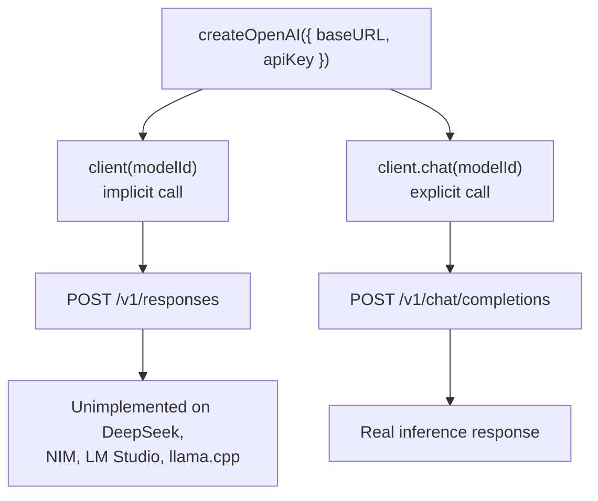

On 2026-04-26 the test matrix for NeuroLink's four newest providers came back green enough to gate the branch: 50 passing tests across real inference, real vision calls, real tool use. Then the CLI smoke tests ran, and every single one of the four new providers — DeepSeek, NVIDIA NIM, LM Studio, llama.cpp — failed the same call in the same way. Not a timeout, not an auth error — a protocol mismatch. Every request came back complaining about an endpoint, `/v1/responses`, that none of these four servers implement. The bug wasn't in any one provider's code. It was one construction pattern, shared by all four, that was wrong under the hood in the exact same way four separate times.

This post is about that bug, the commit that shipped it and the fix (`c829f4dea`, "feat(providers): integrate DeepSeek, NVIDIA NIM, LM Studio, llama.cpp"), and what the commit actually rolled out — which is not quite what "4 local providers" would suggest.

## Four providers, one commit, two very different deployment shapes

The commit adds four `BaseProvider` subclasses in `src/lib/providers/`: `deepseek.ts`, `nvidiaNim.ts`, `lmStudio.ts`, `llamaCpp.ts`. All four talk OpenAI-compatible HTTP, all four go through the AI SDK's `createOpenAI()`, and all four inherit the same OTEL tracing, error formatting, and `validateConfiguration()` contract from `BaseProvider`. That's where the similarity ends, because only two of them are actually local:

| Provider | Host | Requires | Local? |
| --- | --- | --- | --- |
| DeepSeek | `api.deepseek.com` | `DEEPSEEK_API_KEY` | No — cloud API |
| NVIDIA NIM | `integrate.api.nvidia.com` | `NVIDIA_NIM_API_KEY` | No — cloud API |
| LM Studio | `localhost:1234` | nothing (optional `LM_STUDIO_API_KEY` behind a proxy) | Yes |
| llama.cpp | `localhost:8080` | nothing (optional `LLAMACPP_API_KEY` behind a proxy) | Yes |

DeepSeek and NVIDIA NIM are billed, hosted inference — you send them a bearer token and pay per token, same shape as calling OpenAI or Anthropic. LM Studio and llama.cpp are processes you run on your own machine, with no data leaving it and no API key required for a default setup. Grouping all four as "local providers" collapses a real distinction: two of them are just two more cloud vendors NeuroLink can now proxy to, and two of them are genuinely offline. The bug this post covers hit all four the same way regardless, because it lived in the one thing they share — how the provider constructs its AI SDK client — not in anything specific to being local or hosted.

## The shared construction pattern

Every one of the four providers builds its client the same way: `createOpenAI({ baseURL, apiKey, fetch })`, pointed at that provider's OpenAI-compatible base URL. Here's llama.cpp's version, from `src/lib/providers/llamaCpp.ts`:

```typescript
const LLAMACPP_DEFAULT_BASE_URL = "http://localhost:8080/v1";
const LLAMACPP_PLACEHOLDER_KEY = "llamacpp";

this.baseURL = credentials?.baseURL ?? getLlamaCppBaseURL();
// llama-server doesn't authenticate, but the AI SDK's createOpenAI() requires
// an apiKey. Allow override via credentials/env for users who run llama-server
// behind an auth-proxying reverse-proxy.
this.apiKey =
  credentials?.apiKey ??
  process.env.LLAMACPP_API_KEY ??
  LLAMACPP_PLACEHOLDER_KEY;

this.llamaCppClient = createOpenAI({
  baseURL: this.baseURL,
  apiKey: this.apiKey,
  fetch: makeLoggingFetch("llamacpp"),
});
```

`llama-server` doesn't check the API key at all — it's a placeholder string (`"llamacpp"`) purely because `createOpenAI()`'s TypeScript signature requires an `apiKey` to be present. DeepSeek and NVIDIA NIM build the identical `createOpenAI({ baseURL, apiKey, fetch })` call, just with a real bearer token from `DEEPSEEK_API_KEY` / `NVIDIA_NIM_API_KEY` instead of a dummy value. Four providers, one client factory, one shape.

## The bug: the AI SDK defaults to the wrong API

Here's where it breaks. `createOpenAI(...)` returns a callable client object, and calling that object directly as a function — `client(modelId)` — is the natural-looking way to get a language model out of it. Every one of the four provider classes' first draft did exactly that. And in `@ai-sdk/openai` v3.0.48, calling the client that way doesn't hit `/v1/chat/completions`. It defaults to the **Responses API**, `/v1/responses` — a newer OpenAI endpoint shape that DeepSeek, NVIDIA NIM, llama.cpp, and LM Studio have never heard of, because none of them are OpenAI and none of them implement it.

`docs/provider-integration/08-feature-matrix.md`, written during this same rollout, states the bug and the fix in one line:

> `@ai-sdk/openai` v3.0.48 defaults to the **Responses API** (`/v1/responses`) when you call `createOpenAI(...)(modelId)`. None of DeepSeek / NIM / llama.cpp / LM Studio implement the Responses API — they only support `/v1/chat/completions`. **Fix:** call `.chat(modelId)` explicitly, e.g. `client.chat(modelName)` instead of `client(modelName)`. Applied to all four provider classes.

The mechanism is a plain default-vs-explicit split inside the SDK, not a bug in any of the four backends:



Nothing about this is specific to being a local server versus a cloud API — DeepSeek's hosted endpoint rejects `/v1/responses` exactly as flatly as a llama-server process running on a laptop does, because neither one is the actual OpenAI Responses API. That's also why the same one-line fix worked identically across all four: the bug lived entirely on the client-construction side, not in anything about the four upstream servers.

## Where the fix actually landed

The fix is `.chat(modelId)` in place of `client(modelId)`, applied once per provider, each with the same explaining comment. DeepSeek's version, from `src/lib/providers/deepseek.ts`:

```typescript
const deepseek = createOpenAI({
  apiKey: this.apiKey,
  baseURL: this.baseURL,
});
// .chat() returns a Chat Completions model. The default factory call
// (createOpenAI()(modelId)) hits the Responses API, which DeepSeek doesn't implement.
this.model = deepseek.chat(this.modelName);
```

NVIDIA NIM's, from `src/lib/providers/nvidiaNim.ts` — same one-liner, same one-line comment:

```typescript
const nim = createOpenAI({
  apiKey: this.apiKey,
  baseURL: this.baseURL,
  fetch: makeLoggingFetch("nvidia-nim"),
});
// .chat() — NIM exposes /v1/chat/completions, not /v1/responses
this.model = nim.chat(this.modelName);
```

And llama.cpp's, from inside `getAISDKModel()` in `llamaCpp.ts`, where the resolved model name (explicit or auto-discovered — more on that below) finally gets turned into an AI SDK model:

```typescript
// .chat() — llama-server exposes /v1/chat/completions, not /v1/responses
const resolvedModel = this.llamaCppClient.chat(modelToUse);
```

LM Studio's `lmStudio.ts` carries the identical line against its own client. Four files, four call sites, one fix, repeated verbatim because the bug was identical each time. If you're wiring up your own OpenAI-compatible endpoint against `@ai-sdk/openai`, this is worth checking regardless of which provider you're integrating — `client(modelId)` and `client.chat(modelId)` look almost interchangeable, and only one of them talks to the endpoint most self-hosted and third-party OpenAI-compatible servers actually implement.

## What only the local providers needed: auto-discovering the model

Past that shared bug, LM Studio and llama.cpp needed something DeepSeek and NVIDIA NIM never do: a way to find out which model is even running, because a local server doesn't have a fixed catalog of model IDs the way a cloud API does. Both local providers query `/v1/models` and use the first entry returned if the caller didn't pass an explicit model name. From `llamaCpp.ts`:

```typescript
protected async getAISDKModel(signal?: AbortSignal): Promise<LanguageModel> {
  if (this.model) {
    return this.model;
  }

  let modelToUse: string;
  let discoverySucceeded = false;
  // Use requestedModelName, not this.modelName — refreshHandlersForModel()
  // mutates this.modelName, so on a retry after a discovery miss the
  // FALLBACK_MODEL would look like an explicit user choice.
  const explicit = this.requestedModelName;
  if (explicit && explicit.trim() !== "") {
    modelToUse = explicit;
    discoverySucceeded = true;
  } else {
    try {
      const models = await this.getAvailableModels(signal);
      if (models.length > 0) {
        this.discoveredModel = models[0];
        modelToUse = this.discoveredModel;
        discoverySucceeded = true;
        logger.info(`llama.cpp loaded model: ${modelToUse}`);
      } else {
        modelToUse = FALLBACK_MODEL;
      }
    } catch (error) {
      logger.warn(`llama.cpp model discovery failed: ${error}`);
      modelToUse = FALLBACK_MODEL;
    }
  }

  this.refreshHandlersForModel(modelToUse);
  const resolvedModel = this.llamaCppClient.chat(modelToUse);
  if (discoverySucceeded) {
    this.model = resolvedModel;
  }
  return resolvedModel;
}
```

Two details in that function matter more than they look. First, `requestedModelName` — not `this.modelName` — is what's checked on every call, because `refreshHandlersForModel()` overwrites `this.modelName` with whatever was resolved, discovered or fallback. Reading `this.modelName` instead would make a discovery miss on one call look like the user's explicit choice on the next, permanently poisoning the auto-discovery path. Second, the resolved model is only cached (`this.model = resolvedModel`) when discovery actually succeeded — a failed discovery that fell through to `FALLBACK_MODEL` deliberately isn't memoized, so the next call gets to retry discovery instead of being stuck against a placeholder value for the model name (`"loaded-model"` for llama.cpp, `"local-model"` for LM Studio) until the whole provider instance is thrown away and rebuilt.

None of this exists in DeepSeek or NVIDIA NIM — cloud providers get a model name from the caller or a hardcoded default (`NvidiaNimModels.LLAMA_3_3_70B_INSTRUCT`, resolved via `getDefaultNimModel()`), because there's no `/v1/models` worth querying on a request-by-request basis for a fixed hosted catalog.

## A small BaseProvider change that discovery depends on

Auto-discovery only works because of a one-line change to `src/lib/core/baseProvider.ts` in the same commit: dropping `readonly` from the `modelName` field. Before this commit, every provider's `modelName` was fixed at construction time — which is fine for a cloud provider where the model is either passed in or defaulted immediately, but wrong for llama.cpp and LM Studio, where the real model name isn't known until the first `/v1/models` call resolves. Without the ability to update `modelName` after construction, `refreshHandlersForModel()` — the method both local providers call once discovery resolves — would have nothing to write the discovered name into, and `TelemetryHandler` / `MessageBuilder`, which cache `modelName` at their own construction time, would keep reporting an empty model name or a placeholder string in every span and every `result.model` for the lifetime of the provider instance.

## llama.cpp's three-strikes health check

`llama-server` under CPU inference load can be briefly unresponsive — its event loop is doing the actual token generation — so `llamaCpp.ts`'s `validateConfiguration()` retries before giving up, checking both `/health` and `/v1/models` on each attempt:

```typescript
async validateConfiguration(): Promise<boolean> {
  // Retry up to 3x with 500ms backoff. llama-server can be briefly unresponsive
  // under load (CPU inference saturates the event loop).
  const healthURL = this.baseURL.replace(/\/v1\/?$/, "/health");
  const modelsURL = `${this.baseURL.replace(/\/$/, "")}/models`;
  for (let attempt = 0; attempt < 3; attempt++) {
    try {
      const r = await proxyFetch(healthURL, { headers, signal: AbortSignal.timeout(2000) });
      if (r.ok) {
        return true;
      }
    } catch { /* fall through */ }
    try {
      const r2 = await proxyFetch(modelsURL, { headers, signal: AbortSignal.timeout(2000) });
      if (r2.ok) {
        return true;
      }
    } catch { /* fall through */ }
    await new Promise((resolve) => setTimeout(resolve, 500));
  }
  return false;
}
```

LM Studio and DeepSeek/NVIDIA NIM don't carry this retry loop — it's specific to the failure mode of a single-process local inference server saturating its own event loop under load, which a hosted multi-tenant API doesn't exhibit the same way.

## The complexity that only shows up on the cloud side: NVIDIA NIM's retry-on-400

If the local providers' extra complexity is discovery, NVIDIA NIM's is the opposite: extra request-shaping that has nothing to do with locality at all. NIM accepts several non-standard sampling parameters — `top_k`, `min_p`, `repetition_penalty`, `chat_template`, and a `chat_template_kwargs.reasoning_budget` field for controlling reasoning-model output length — passed through `providerOptions.openai.body` rather than as normal AI SDK options. `buildNvidiaNimExtraBody()` in `nvidiaNim.ts` assembles these from environment variables (`NVIDIA_NIM_TOP_K`, `NVIDIA_NIM_MIN_P`, `NVIDIA_NIM_REPETITION_PENALTY`, `NVIDIA_NIM_CHAT_TEMPLATE`) plus the caller's `thinkingLevel`.

Not every model NIM hosts accepts every one of those extras, and NIM's failure mode when it doesn't is a 400. Rather than surface that to the caller as a hard error, `executeStream()` retries once, stripping whichever field the error message named:

```typescript
let result;
try {
  result = await callStream(extraBody);
} catch (error) {
  const status = (error as { statusCode?: number })?.statusCode;
  if (status === 400) {
    const lower = errMsg.toLowerCase();
    if (lower.includes("reasoning_budget")) {
      logger.warn("NIM rejected reasoning_budget; retrying without it");
      extraBody = stripReasoningBudget(extraBody);
      result = await callStream(extraBody, ["reasoning_budget"]);
    } else if (lower.includes("chat_template")) {
      logger.warn("NIM rejected chat_template; retrying without it");
      extraBody = stripChatTemplate(extraBody);
      result = await callStream(extraBody, ["chat_template"]);
    } else {
      throw error;
    }
  } else {
    throw error;
  }
}
```

The retry-strip is applied *after* the caller's own `providerOptions.openai.body` is merged in, specifically so a caller who passed their own copy of `reasoning_budget` doesn't get it silently re-sent on the retry — the comment in the source calls this out directly: stripping before the merge would let the rejected field sneak back in through the caller's override. This is real, model-dependent complexity, and it's entirely a NIM-cloud-API concern. llama.cpp and LM Studio have no equivalent, because they don't accept these NIM-specific extras in the first place.

## The context-window footgun the new providers exposed

Shipping providers with genuinely small context windows — 8,192 tokens for both `lm-studio` and `llamacpp`, versus 64,000–128,000 for the new cloud providers and 200,000+ for the existing large ones — surfaced a bug in code that had shipped long before this commit. `getOutputReserve()` in `src/lib/constants/contextWindows.ts` computes how many tokens to reserve for model output given a context window and an optional caller-supplied `maxTokens`. Before this commit, a caller who passed `maxTokens` equal to (or larger than) the context window got a **zero-token input budget** — the entire window was reserved for output, leaving nothing for the prompt, and the request failed with `"Budget: 0 tokens"` before it was even sent upstream. Against a 200K-token cloud context window this edge case rarely came up. Against an 8,192-token local model it was one call away from happening constantly. The fix clamps the output reserve to 80% of the context window, so some input budget always survives regardless of what `maxTokens` the caller passed. The commit message notes this had been silently affecting 12 test suites.

A related normalization bug lived in the same file: `getContextWindowSize()` looks up a provider's window by exact string key, and callers reach it through whatever unnormalized provider string the CLI or config passed — `--provider lmstudio` (no hyphen), the alias `llama.cpp` (with a dot), and so on. `ProviderFactory.normalizeProviderName` runs at instantiation time, downstream of where this lookup happens, so its output never reaches the budget calculation. Without normalization, those alias forms miss the `MODEL_CONTEXT_WINDOWS` table entirely and silently fall back to `DEFAULT_CONTEXT_WINDOW`, understating the real 8K/128K windows for exactly the providers most likely to actually hit the limit. The fix adds `normalizeProviderForLookup()`, which strips non-alpha characters and maps the result through a small alias table (`lmstudio` → `lm-studio`, `nvidianim`/`nim`/`nvidia` → `nvidia-nim`, and so on) before the table lookup.

## Cost attribution for a server that costs nothing

`src/lib/utils/pricing.ts` picked up two related changes. The straightforward one: four new pricing entries, with LM Studio and llama.cpp given symbolic local rates of $1 per million tokens — not a real bill, since nothing is actually charged for tokens generated on your own hardware, but enough that NeuroLink's cost-attribution reporting produces a non-zero number after its 6-decimal rounding step, instead of silently reporting $0.00 for every local call and making local usage invisible in aggregate cost dashboards next to real DeepSeek and NIM spend. The second change treats the `_default` key inside each provider's pricing map as a genuine provider-level fallback — filtered out of normal per-model prefix matching, but used as a last resort — so a provider like `lm-studio` or `llamacpp`, which can't enumerate pricing for every GGUF model a user might load, still resolves to a defined rate instead of `undefined`.

## What Run-A actually showed

The matrix run referenced at the top of this post — what `08-feature-matrix.md` calls "Run-A," dated 2026-04-26 — is the snapshot used to gate the branch, and it's worth quoting directly rather than summarizing into something rounder than it was:

| Provider | Result |
| --- | --- |
| NVIDIA NIM | 16 PASS / 3 FAIL / 1 SKIP — full real inference: vision, tools, thinking, abort, timeout, telemetry |
| llama.cpp | 14 PASS / 2 FAIL / 1 SKIP — full real inference against `smollm2-360m.gguf` |
| DeepSeek | 15 PASS / 2 FAIL / 2 SKIP — full real inference; only a deprecated `response_format` case and a tiny-prompt memory case failed |
| LM Studio | 5 PASS / 3 FAIL / 9 SKIP — real stream, abort, and tool-stream calls verified against Qwen3 0.6B |

LM Studio's low pass count next to its high skip count isn't a weaker implementation — it's a hardware gap in the machine that ran the matrix. `brew install --cask lm-studio` refuses to install on an Intel Mac (LM Studio ships Apple Silicon-only), so most of LM Studio's 17-test suite skipped rather than failed, and the doc says outright that "on an M-series Mac, all 17 tests would behave the same as llama.cpp's 14 PASS pattern." The remaining llama.cpp and NIM failures are attributed to model-specific limits, not the provider code: a 360M-parameter GGUF model losing multi-turn context, a 70B Llama model's structured-output mode being unreliable on a short prompt — not the `.chat()` bug, which by Run-A was already fixed across all four.

## Trying a local one yourself

Pointing NeuroLink at a local llama.cpp server needs no API key and, if you don't care which model answers, no model name either — the same auto-discovery path covered above handles it:

```bash
# Start llama-server with a GGUF model already downloaded
./build/bin/llama-server -m ./models/Llama-3.2-3B-Instruct-Q4_K_M.gguf --port 8080
```

```typescript
import { NeuroLink } from "@juspay/neurolink";

const ai = new NeuroLink();

// Omit `model:` — NeuroLink discovers the loaded model from /v1/models
const result = await ai.generate({
  provider: "llamacpp",
  input: { text: "Explain the difference between a stack and a heap." },
});
```

LM Studio's flow is the same shape against `localhost:1234` instead of `:8080` — start its bundled server from the Local Server tab, then call `generate()` with `provider: "lm-studio"` and no `model`. Both defaults (`LLAMACPP_BASE_URL`, `LM_STUDIO_BASE_URL`) are overridable if the server is running on a different port or host.

## The part worth remembering

Four providers, one bug, one fix repeated four times — that's the whole story of `/v1/responses` versus `/v1/chat/completions` in this commit. But the more durable lesson generalizes past NeuroLink: any code that constructs a client with `@ai-sdk/openai`'s `createOpenAI()` and calls it directly, rather than through `.chat(modelId)`, is one SDK default away from silently targeting an endpoint that a non-OpenAI, OpenAI-compatible backend has never implemented. It worked in earlier `@ai-sdk/openai` versions where the default was Chat Completions; it stopped working the moment the SDK's default moved to the Responses API. If you're wrapping DeepSeek, a local llama-server, or any other OpenAI-compatible endpoint with this SDK, that one method call is worth checking explicitly rather than trusting the default factory call to still mean what it used to.

---

**Related posts:**

- [OpenAI-Compatible Endpoints: Connect Any API to NeuroLink](/posts/openai-compatible-endpoints/)
- [Running Local LLMs with NeuroLink and Ollama](/posts/ollama-local-llm-guide/)
- [Free-tier myths: what providers actually give you for free](/posts/free-tier-myths-what-providers-actually-give-you-for-free/)
