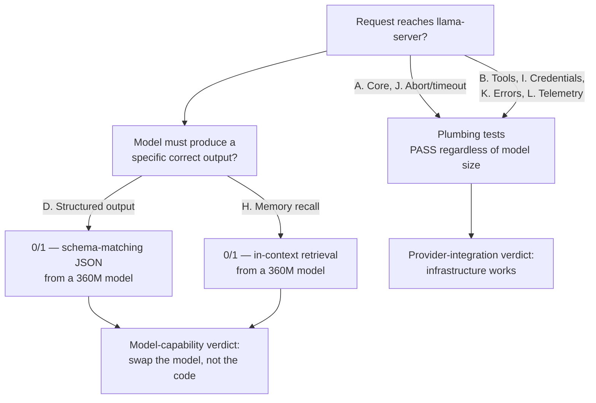

`llama-server -m smollm2-360m.gguf --port 8080` starts in under a second. No GPU, no download longer than a coffee break, no API key — NeuroLink's `llamacpp` provider auto-discovers the model from `/v1/models` and starts answering. Section A of the provider test matrix runs against it: five core generation tests, five passes. Section B, tool calling: three for three. Section J, abort and timeout: two for two. By the time the matrix reaches section D, the pattern looks like it's heading for a clean sweep — until it isn't. `D1 structured.zod.simple` comes back `0/1`. So does `H1 memory.multiturn`, three sections later. Neither is a crash, a timeout, or an error message. Both are the model answering, just not correctly enough to pass.

This post is about those two failures specifically — what the tests actually asked SmolLM2-360M to do, why the same test matrix that flags them also insists they aren't provider bugs, and the mechanism the commit uses to tell the difference. The commit is `c829f4dea`, "feat(providers): integrate DeepSeek, NVIDIA NIM, LM Studio, llama.cpp," and the two results come straight out of its own `docs/provider-integration/08-feature-matrix.md`.

## A 360-million-parameter model with a near-perfect record

SmolLM2-360M is a small instruction-tuned model — 360 million parameters, distributed as a GGUF file, small enough to run comfortably on a laptop CPU. It's not the model NeuroLink recommends for production `llamacpp` use — the provider's own docs point at `Llama-3.2-3B-Instruct-Q4_K_M` in every quick-start example — but it's exactly the kind of model someone reaches for first: fast to download, fast to load, fast to iterate against while wiring up a new provider integration. `08-feature-matrix.md`, the doc the commit ships alongside the provider code, records a full breakdown for it, headed "llamacpp test breakdown (REAL inference vs SmolLM2-360M)":

| Section | Result |
| --- | --- |
| A. Core (generate, maxTokens, temperature, stream, stream-completes) | 5/5 PASS |
| B. Tools (generate, stream, disable) | 3/3 PASS |
| C. Image | PASS (model accepts image; doesn't see, but request roundtrips) |
| D. Structured output (Zod) | 0/1 PASS |
| E. Reasoning | SKIP — no reasoning model defined |
| H. Memory (multiturn) | 0/1 PASS |
| I. Per-call credentials (baseURL override) | PASS |
| J. Abort + timeout | 2/2 PASS |
| K. Error handling (unreachable server) | PASS |
| L. Telemetry | PASS |

Read that table as two different kinds of test. Sections A, B, I, J, K, and L check whether the *plumbing* works — does a request reach `llama-server`, does streaming deliver chunks, does an abort signal actually cancel, does a telemetry span get emitted with the right attributes. None of that depends on how capable the loaded model is; it depends on whether NeuroLink's HTTP client, retry logic, and OTEL instrumentation are wired correctly. SmolLM2-360M passes all of it, because none of it asks the model to do anything hard. Sections D and H are different. They ask the model itself to produce a specific, checkable output — and that's where the ceiling shows up.

## The matrix predicted this before any inference ran

`08-feature-matrix.md` isn't only a record of what happened — most of it is a support matrix filled in before the live test run, using four symbols defined right at the top of the file: "✅ supported · ❌ not supported · ⚠️ depends on loaded model · 🟡 partial / requires extra config." Row `D1` in the per-feature table, filled in ahead of the real run, already marks the two local providers differently from the two cloud ones:

| # | Feature | Test name | DeepSeek | NVIDIA NIM | LM Studio | llama.cpp |
| --- | --- | --- | --- | --- | --- | --- |
| D1 | Generate with Zod schema → matching object | `structured.zod.simple` | ✅ | ✅ | ⚠️ | ⚠️ |

Row `H1` goes further — every single provider in the row gets the same symbol, cloud or local:

| # | Feature | Test name | DeepSeek | NVIDIA NIM | LM Studio | llama.cpp |
| --- | --- | --- | --- | --- | --- | --- |
| H1 | Multi-turn with `sessionId` retains context | `memory.multiturn` | ⚠️ (model-dependent) | ⚠️ (model-dependent) | ⚠️ (model-dependent) | ⚠️ (model-dependent) |

That's not a weaker prediction for the local providers — for `D1`, the two cloud providers (DeepSeek's chat models, NVIDIA NIM's larger hosted checkpoints) get a flat ✅ where the two local providers get "depends on loaded model," because a cloud provider's model roster is fixed and known ahead of time, while `llamacpp` and `lm-studio` can be pointed at anything from a 360M GGUF to a 70B one. For `H1`, none of the four providers gets a ✅ at all — multi-turn recall is marked as model-dependent everywhere, cloud or local, before a single live token was generated against any of them.

What running the matrix against an actual `smollm2-360m.gguf` server did was resolve those two `⚠️` marks into a concrete number for one specific point on the "depends on loaded model" range: `0/1` for both. The symbol said "it depends"; the live run against the smallest end of that range said what it depends on, and by how much.

## D1: a schema, a prompt, and a five-word answer

The structured-output test lives in `test/continuous-test-suite-new-providers.ts`, in `section4Structured()`. It defines a two-field Zod schema and a prompt that states both values outright:

```typescript
const schema = zodMod.z.object({
  city: zodMod.z.string(),
  population: zodMod.z.number(),
});

await runProviderTest("D1 structured.zod.simple", p, async (signal) => {
  const sdk = makeSdk();
  const res = await sdk.generate({
    input: {
      text: "Return an object with city='Bangalore' and population=14000000.",
    },
    provider: p.name,
    abortSignal: signal,
    schema: schema as any,
    maxTokens: 256,
  });
  const parsed = schema.safeParse((res as any)?.object ?? null);
  return parsed.success;
});
```

There's nothing adversarial about the prompt. It names both values directly — the model isn't being asked to infer Bangalore's population from world knowledge, or to reason about anything. It's being asked to copy two given values into a two-field JSON shape and get the types right: `city` as a string, `population` as a number, not a numeric string, not a value wrapped in extra prose. `08-feature-matrix.md` records the result as `0/1 PASS — small 360M model can't reliably produce schema-matching JSON`, and the file's own summary section is blunter about the cause: this is filed as "inherent to the 360M model size, not provider bugs."

That framing matters because the AI SDK's structured-output path — the thing that turns `schema:` into a validated `res.object` — is the same code path every provider in this commit uses, and the static `D1` row marks it a flat ✅ for the two cloud providers, DeepSeek and NVIDIA NIM (LM Studio gets the same ⚠️ as llama.cpp, for the same reason: its loaded model is also a caller's choice, not a fixed catalog entry). The difference isn't in NeuroLink's schema-to-JSON plumbing. It's that turning a natural-language instruction into JSON that satisfies a schema is itself a capability — instruction-following combined with reliable formatting — and a 360M-parameter model, however fast and however clean its plumbing, doesn't reliably have enough of it. `safeParse` either succeeds or it doesn't; there's no partial credit for "almost valid JSON," which is why the failure shows up as a flat `0/1` rather than something softer.

## H1: a color, two turns apart

The memory test in `section6Memory()` is even simpler to describe — a two-turn conversation across the same `sessionId`, checking whether the second answer mentions a fact stated in the first:

```typescript
await runProviderTest("H1 memory.multiturn", p, async (signal) => {
  const sdk = makeSdk();
  const sessionId = `test-${p.name}-${Date.now()}`;
  const r1 = await sdk.generate({
    input: { text: "My favorite color is mauve. Remember it." },
    provider: p.name,
    abortSignal: signal,
    sessionId,
    maxTokens: 64,
  });
  if (!r1?.content) {
    return false;
  }
  const r2 = await sdk.generate({
    input: { text: "What is my favorite color? Reply with one word." },
    provider: p.name,
    abortSignal: signal,
    sessionId,
    maxTokens: 32,
  });
  return Boolean(r2?.content?.toLowerCase().includes("mauve"));
});
```

The `sessionId` routing — NeuroLink's memory store retrieving and re-injecting turn one's content when turn two arrives — isn't what this test is measuring, and it's important to be precise about that, because it's easy to read a memory-test failure as "the memory system is broken." `08-feature-matrix.md` records the result as `0/1 PASS — small 360M model loses context`, and its own footnote on this test spells out the distinction directly:

> H1 is **model-dependent**. The infrastructure (sessionId routing, memory store) works on all four providers; whether the *model* recalls earlier turns depends on its in-context retrieval ability.

By the time `r2` is generated, the full first turn — including "mauve" — has already been re-injected into the model's context by NeuroLink's memory layer. The infrastructure did its job; the prompt handed to the model contains the word. What failed is the model's own retrieval over that context: given the earlier turn verbatim, SmolLM2-360M's reply to "what is my favorite color" didn't reliably include "mauve." That's a narrower and more specific failure than "memory doesn't work" — it's "this model, handed the right context, doesn't reliably use it."

## A FAIL, not a SKIP: the requests succeeded

`runProviderTest()`, the harness both `D1` and `H1` run through, draws a sharp line between two different outcomes that could otherwise look similar in a log:

```typescript
try {
  const passed = await fn(ac.signal);
  if (passed) {
    logTest(label, "PASS");
    record(provider.name, true);
    return true;
  }
  logTest(label, "FAIL", "assertion returned false");
  record(provider.name, false);
  return false;
} catch (err) {
  const msg = err instanceof Error ? err.message : String(err);
  if (isExpectedProviderError(msg, provider)) {
    logTest(label, "SKIP", msg.slice(0, 100));
    record(provider.name, null);
    return null;
  }
  logTest(label, "FAIL", msg.slice(0, 160));
  record(provider.name, false);
  return false;
}
```

A thrown error that matches `isExpectedProviderError` — an unconfigured credential, a server that's down — gets recorded as `SKIP`, not `FAIL`, and is excluded from the pass-rate math entirely. `D1` and `H1` are recorded as `FAIL` for `llamacpp`, which rules that path out: neither test threw. Both `sdk.generate()` calls in `H1` completed and returned `r1?.content` and `r2?.content` — the `if (!r1?.content) { return false; }` guard never fired, or the second call's assertion would have logged as a plain boolean `false` from a missing response rather than from `.includes("mauve")` failing. What made both tests fail is the `passed` boolean itself coming back `false` — `schema.safeParse(...)` rejecting the shape of a completed response, and `r2.content.toLowerCase().includes("mauve")` being `false` against a completed reply. `llama-server` answered both prompts; the answers just didn't satisfy what the test checked for. That's the same distinction the matrix's own symbol legend draws between "not supported" and "depends on loaded model" — and it's why `0/1` here means something more specific than "broken."

## The line the matrix draws between the two kinds of failure

Put D1 and H1 next to the eight sections that passed cleanly, and the shape of the matrix's own argument becomes clear:



This is the reason the commit's authors could write "model-size-inherent, not a provider bug" and mean something checkable rather than an excuse. The plumbing tests (left branch) exercise exactly the code this commit shipped — the `createOpenAI()` client construction, the `.chat()` call, the auto-discovery against `/v1/models`, the OTEL spans, the abort-signal composition. None of that code changes based on which GGUF file `llama-server` has loaded, and none of it failed. The two failing tests (right branch) exercise the loaded model's own output quality against a task that has nothing to do with HTTP, retries, or telemetry — a JSON-shaping task and an in-context-recall task. Both of those are properties of the model weights, not of NeuroLink's provider code, and swapping `smollm2-360m.gguf` for a larger checkpoint changes the right-branch outcome without touching a single line on the left.

`08-feature-matrix.md` states the practical implication directly, right after the llama.cpp breakdown table: "The 2 FAILs (D1, H1) are inherent to the 360M model size, not provider bugs. Swap in a larger model (e.g. Llama 3.2 3B) and they should pass." That's a prediction, not a verified result — the matrix run didn't go back and re-test D1/H1 against a 3B checkpoint to confirm it — and it's worth reading it as exactly that: an informed, specific expectation about what changes when you change the model, stated as a hypothesis rather than dressed up as a second measurement.

## It wasn't only the 360M model that stumbled on D1

Structured output being fragile at small model sizes is intuitive. Less intuitive: an earlier, historical pass at NVIDIA NIM's `D1` also flagged the same test — against a 70-billion-parameter model. `08-feature-matrix.md`'s "NVIDIA NIM remaining 5 failures (historical Run-B)" table lists:

| Test | Reason |
| --- | --- |
| D1 structured.zod.simple | Llama 3.3 70B's structured-output mode is finicky for tiny prompts |

The doc is explicit that this row is from "Run-B" — an earlier exploratory pass kept for historical context, not the Run-A matrix (dated 2026-04-26) that actually gated the branch, and the doc cautions that re-running today's configuration reproduces the Run-A numbers, not the Run-B narrative. So this isn't a clean apples-to-apples data point next to SmolLM2's failure, and it shouldn't be read as "NIM's D1 currently fails" — the current gating run doesn't show that. What it's worth noting for is narrower: even in an exploratory run, "finicky for tiny prompts" showed up on a model nearly 200× larger than SmolLM2-360M. Model size lowers the odds of a clean schema match, but a short, single-fact prompt is apparently a genuinely awkward shape for structured-output mode across a wider range of model sizes than "only tiny local models" would suggest — the NIM entry just isn't reproducible evidence for that on its own.

## Why LM Studio can't serve as a second local data point here

It would be useful to check whether a different small local model shows the same D1/H1 pattern, and LM Studio is the obvious place to look — it's the commit's other local provider, built on the identical `createOpenAI().chat()` construction and the identical `/v1/models` auto-discovery mechanism as `llamacpp`. But the model isn't the same one: the Run-A summary records LM Studio's result as "5 PASS / 3 FAIL / 9 SKIP — Apple Silicon Homebrew installed; Qwen3 0.6B loaded; stream + abort + tool-stream verified," so whatever LM Studio's D1 and H1 outcomes were, they'd be a data point about Qwen3 0.6B, not SmolLM2-360M — a different model at a different (larger) parameter count. And unlike the llamacpp row, `08-feature-matrix.md` doesn't give LM Studio the same section-by-section breakdown table, so which of its 5 passes and 3 fails correspond to `D1` or `H1` specifically isn't stated anywhere in the doc. A separate note in the same file, about an earlier point in testing, records `brew install --cask lm-studio` refusing to install on an Intel Mac because "LM Studio is Apple Silicon-only" — worth flagging only because it shows the environment LM Studio was tested in changed between that note and the Apple-Silicon Run-A run quoted above, which is one more reason not to treat the two local providers' numbers as directly comparable. The honest state of the evidence is one clean, fully-measured local data point — `llamacpp` against SmolLM2-360M — and no confirmed second one at a different local model size.

## What the matrix didn't bother investigating

The commit's test-failure investigation doc, `docs/provider-integration/11-test-failure-investigation.md`, drills into exactly four sub-test failures found across the whole matrix run: a RAGAS judge-prompting bug, an LM Studio server that had gone idle between iterations, an abort-signal test that hit the same `maxTokens` fallback bug fixed elsewhere in the commit, and an observability-spans test that didn't account for a provider using a different telemetry pipeline. All four turned out to be real bugs — in the test harness, not in the four new providers — and all four got fixed in the same commit.

D1 and H1 for llama.cpp aren't on that list. They weren't run down as candidate bugs at all, because the explanation was already known going in: a 360M model failing to hold a JSON schema or recall one prior turn isn't a surprising result that needs root-causing, it's the expected shape of testing against a model that small. The four sub-tests that *did* get investigated are the ones where a small-model excuse wouldn't have explained the symptom — a judge scoring the wrong thing, a server being unreachable, a budget miscalculation, a pipeline mismatch. Structured output and multi-turn recall failing on a 360M-parameter model didn't need the same scrutiny, because there was no plausible provider-code explanation competing with the obvious model-capability one.

## Everything else in the matrix that *didn't* depend on model size

It's worth being precise about what "the plumbing works" covers, because it's a longer list than it might look from the D1/H1 story alone. Section A alone checks `generate.basic`, `generate.maxTokens`, `generate.temperature`, `stream.basic`, and `stream.completes` — five separate assertions about whether a request round-trips correctly and a stream delivers and terminates properly. Section B checks that a custom tool gets called (`tools.generate.custom`, `tools.stream.custom`), and that `disableTools: true` actually suppresses tool registration (`tools.disable`) rather than silently ignoring the flag. Section C checks that an image attached via `input.files` at least reaches the model and gets a non-empty response — recorded as "model accepts image; doesn't see, but request roundtrips," which is itself a small instance of the same infrastructure/capability split: the *request* succeeds regardless of whether the loaded model has vision weights to actually use it.

Section I checks that a per-call `credentials.llamacpp.baseURL` override actually reaches the request instead of being silently dropped in favor of the environment default. Section J checks that an in-flight stream really stops when `abortSignal.abort()` fires, and that a per-call `timeout` produces NeuroLink's own `TimeoutError` rather than an ambiguous network failure. Section K checks that pointing the provider at an unreachable `llama-server` produces the friendly "Cannot connect" message instead of a raw `ECONNREFUSED` stack. Section L checks that an OTel `model.generation` span gets emitted with the right attributes and that the analytics promise resolves. Every one of those is a yes/no question about NeuroLink's own code, answerable the same way regardless of whether the model behind it has 360 million parameters or 70 billion — and SmolLM2-360M answered every one of them correctly.

## Reproducing it

The commit also shipped `test/run-provider-matrix.sh`, a bash-3.2-compatible script — but it drives a different suite set (client, middleware, tool-reliability, tracing, observability, workflow, mcp, ppt, evaluation) — context and memory appear only as extra rows in its own summary table, never as suites it actually runs — not this one. To reproduce the new-provider matrix itself — the file with `section4Structured()` and `section6Memory()` above — run it directly via `pnpm run test:new-providers` against whichever providers have credentials or a reachable local server. Pointing it at a real `llama-server` process reproduces the same split:

```bash
# Terminal 1 — start llama-server with SmolLM2-360M loaded
./build/bin/llama-server -m ./models/smollm2-360m.gguf --port 8080

# Terminal 2 — run the new-provider matrix against it
LLAMACPP_BASE_URL=http://localhost:8080/v1 \
  pnpm run test:new-providers
```

Swapping the `-m` path to a larger checkpoint — the docs' own recommended `Llama-3.2-3B-Instruct-Q4_K_M.gguf` — is the direct way to check the matrix's own prediction that D1 and H1 pass at a larger size, without changing anything about the `LLAMACPP_BASE_URL` or the test file itself. Sections A, B, I, J, K, and L should read identically either way, because none of them ask the model to do the thing that's actually hard.

## The takeaway for testing against any local model

The useful generalization here isn't specific to llama.cpp, SmolLM2, or even NeuroLink. Any test suite exercising a provider that can point at an arbitrarily small local model benefits from the same split this matrix makes explicit: tests that check whether a request reaches the server, streams correctly, respects an abort signal, or emits the right telemetry are testing *your* code, and a model swap shouldn't change their outcome. Tests that check whether the model produces schema-valid JSON or recalls an earlier turn are testing the *model*, and treating a failure there as a provider bug — filing an issue against the HTTP client, say, when the real cause is a 360M-parameter checkpoint being asked to do instruction-following it wasn't sized for — sends the fix in the wrong direction entirely. `08-feature-matrix.md`'s own two-line verdict on D1 and H1 is short precisely because the distinction it's drawing is simple once it's stated: the code that talks to `llama-server` was never what failed.

---

**Related posts:**

- [Rolling out 4 new providers (2 local, 2 cloud) — and the AI SDK bug we hit](/posts/rolling-out-4-new-providers-2-local-2-cloud-and-the-ai-sdk-bug-we-hit/)
- [Conversation Memory: Building Stateful AI Applications](/posts/conversation-memory-guide/)
- [Structured Output: JSON Schema Enforcement with NeuroLink](/posts/structured-output-json/)
