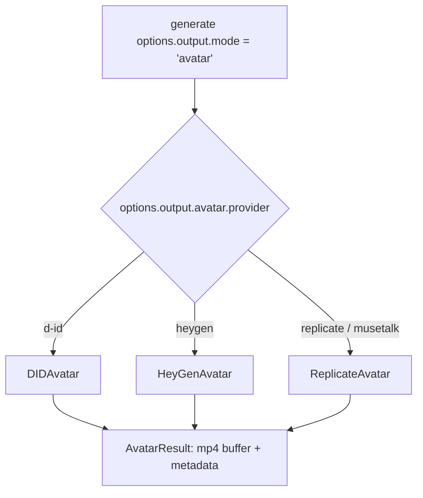

A support team wants a two-minute product walkthrough delivered by a presenter, not a slideshow with a voiceover. A localization team wants the same explainer re-recorded in eleven languages without booking a studio eleven times. A one-person team wants a talking avatar for a landing page and owns exactly one photo of themselves. None of these are video-generation problems in the sense NeuroLink already solved with Veo-style clip generation — nobody needs new footage of a scene. What they need is a still image that appears to speak, with its mouth moving in sync with a specific piece of audio. NeuroLink now ships that as its own modality: `output: { mode: "avatar" }`, backed by three providers and one dispatch layer.

## Avatar is not Video

NeuroLink already had a `video` output mode: Veo, Kling, Runway, and Replicate-hosted Wan models that synthesize *new motion* from a text prompt or a reference image. Avatar generation solves a categorically different problem, and the module's own doc comment says so directly:

```typescript
/**
 * Avatar / Lip-sync Type Definitions
 *
 * Types for generating talking-head videos by combining a portrait image
 * with narration audio (or text routed through a TTS provider first).
 *
 * Avatar is a separate modality from Video — Video is image-to-video
 * (motion synthesis); Avatar is image + audio → lip-synced video.
 *
 * @module types/avatar
 */
```

That distinction shows up everywhere downstream. Video generation is judged on how convincingly it invents new motion; avatar generation is judged on how precisely the mouth tracks a waveform that was handed to it. The three providers wired up — D-ID, HeyGen, and Replicate's MuseTalk — do not synthesize a scene at all. They take a face you already have and drive it.

## The shape of the request

Every avatar call funnels through one option bag, `AvatarOptions`, defined in `src/lib/types/avatar.ts`:

```typescript
export type AvatarOptions = {
  /** Source portrait image (Buffer, file path, or HTTPS URL). */
  image: Buffer | string;

  /**
   * Audio source — direct lip-sync.
   * Either provide `audio` OR `text` (with optional `ttsProvider` / `voice`).
   */
  audio?: Buffer | string;

  /**
   * Text for the avatar to speak. When provided without `audio`, the
   * NeuroLink dispatcher first runs TTS (`ttsProvider`) to produce audio,
   * then passes the audio to the avatar handler.
   */
  text?: string;

  /** TTS provider for text → audio when `text` is used. Default: "openai-tts". */
  ttsProvider?: string;

  /** Voice id passed through to the TTS provider when `text` is used. */
  voice?: string;

  /** Avatar provider override (e.g. "d-id", "heygen", "replicate"). */
  provider?: string;

  /** Output quality preset. */
  quality?: AvatarQuality;

  /** Output format (default: "mp4"). */
  format?: AvatarVideoFormat;

  /** Output file path (optional — buffer is always returned in the result). */
  output?: string;

  /** Per-call timeout in ms (default: 5 minutes). */
  timeout?: number;

  /** Provider-specific additional options. */
  [key: string]: unknown;
};
```

Two things are worth noticing before you write a line of code. First, `image` is required, and *either* `audio` or `text` is required — that "either/or" is not just documentation, it is enforced at the top of `AvatarProcessor.generate()`, which throws a typed `AvatarError` with code `IMAGE_REQUIRED` or `INVALID_INPUT` before any network call happens if you get it wrong. Second, `text` is a convenience path, not a shortcut around a real API call: when you pass `text` instead of `audio`, NeuroLink runs TTS first (default provider `"openai-tts"`) and hands the resulting audio buffer to the avatar handler exactly as if you had recorded it yourself. Two providers, two network round trips, one call from your code.

## One registry, three handlers

Dispatch runs through `AvatarProcessor`, a static registry that mirrors the pattern NeuroLink already uses for `TTSProcessor`, `STTProcessor`, `VideoProcessor`, and `MusicProcessor` — register a named handler once, look it up by provider string forever after:

```typescript
export class AvatarProcessor {
  private static readonly handlers = new Map<string, AvatarHandler>();

  static registerHandler(providerName: string, handler: AvatarHandler): void {
    const key = providerName.toLowerCase();
    this.handlers.set(key, handler);
  }

  static supports(providerName: string): boolean {
    return this.handlers.has(providerName.toLowerCase());
  }

  static listProviders(): string[] {
    return Array.from(this.handlers.keys());
  }

  static async generate(
    provider: string,
    options: AvatarOptions,
  ): Promise<AvatarResult> {
    // validate image/audio-or-text, look up the handler,
    // check handler.isConfigured(), then dispatch and wrap
    // the call in a MEDIA_GENERATION observability span.
  }
}
```

Every handler implements the same three-method contract, `AvatarHandler`:

```typescript
export type AvatarHandler = {
  generate(options: AvatarOptions): Promise<AvatarResult>;
  isConfigured(): boolean;
  readonly maxAudioDurationSeconds?: number;
  readonly supportedFormats?: readonly AvatarVideoFormat[];
};
```

`generate()` on the SDK's top-level `NeuroLink` class checks `options.output?.mode === "avatar"` and routes to a private `generateWithAvatar()` method, which lazily imports `AvatarProcessor` and forwards `options.output.avatar` straight through — the same request shape you build by hand when calling `AvatarProcessor.generate()` directly. That method also stamps two OpenTelemetry span attributes, `neurolink.avatar.provider` and `neurolink.avatar.bytes`, onto the generation span, so an avatar call shows up in tracing next to your ordinary chat calls rather than as a black box.



## D-ID: text or audio, your choice

D-ID's `/talks` API is the most flexible of the three — it accepts either a direct audio URL or a text-plus-voice script, and it runs its own TTS internally when you give it text without going through NeuroLink's TTS layer first. `DIDAvatar` (`src/lib/avatar/providers/DIDAvatar.ts`, 613 lines) authenticates with HTTP Basic, the API key doubling as the username:

```typescript
constructor(apiKey?: string) {
  const resolved = (
    apiKey ??
    process.env.DID_API_KEY ??
    process.env.D_ID_API_KEY ??
    ""
  ).trim();
  this.apiKey = resolved.length > 0 ? resolved : null;
  this.baseUrl = (
    process.env.DID_BASE_URL ??
    process.env.D_ID_BASE_URL ??
    "https://api.d-id.com"
  ).replace(/\/$/, "");
}
```

Because D-ID's `/talks` endpoint takes URLs, not raw bytes, the handler first uploads whatever you passed — a `Buffer`, a local path resolved to a buffer, or an existing HTTPS URL passed straight through — to D-ID's own `/images` and `/audios` upload endpoints, then submits the talk against the returned URLs:

```typescript
private async submitTalk(
  options: AvatarOptions,
  sourceUrl: string,
  audioUrl?: string,
): Promise<string> {
  const script: Record<string, unknown> = audioUrl
    ? { type: "audio", audio_url: audioUrl }
    : {
        type: "text",
        input: options.text,
        provider: {
          type: "microsoft",
          voice_id: options.voice ?? "en-US-JennyNeural",
        },
      };

  const body: Record<string, unknown> = {
    source_url: sourceUrl,
    script,
    config: { result_format: "mp4", stitch: true },
  };
  // POST ${this.baseUrl}/talks with Basic auth
}
```

Submission returns a talk id, and `pollUntilDone()` polls `GET /talks/{id}` every 3 seconds (`POLL_INTERVAL_MS = 3_000`) against a 5-minute total budget (`TOTAL_TIMEOUT_MS = 5 * 60_000`), watching for `status === "done"`. An `"error"` or `"rejected"` status throws immediately with the upstream's own description; running past the timeout throws a distinct `POLL_TIMEOUT` code so callers can tell "D-ID rejected the job" apart from "D-ID never finished." The result download goes through `readBoundedBuffer()`, capped at `MAX_VIDEO_BYTES` — 256 MiB — with a pre-check against the response's `Content-Length` header before a single byte is read, so a runaway response is rejected before it materializes in process memory.

```typescript
import { NeuroLink } from "@juspay/neurolink";
import { readFileSync, writeFileSync } from "node:fs";

const ai = new NeuroLink();
const result = await ai.generate({
  provider: "vertex", // unused — dispatch is driven by output.avatar
  output: {
    mode: "avatar",
    avatar: {
      provider: "d-id",
      image: readFileSync("./portrait.jpg"), // Buffer | path | URL
      text: "Hello, this is your AI presenter.",
      ttsProvider: "openai-tts",
      voice: "alloy",
    },
  },
});
if (result.avatar?.buffer) {
  writeFileSync("./talk.mp4", result.avatar.buffer);
}
```

Note the `provider` field on the top-level `generate()` call is a required parameter of the SDK's `GenerateOptions` but is not what selects the avatar handler — that selection happens entirely through `output.avatar.provider`. The CLI mirrors this split as `--avatarProvider`, `--avatarImage`, `--avatarText`, `--avatarVoice`, and `--avatarOutput`, all independent of the `--provider` flag.

## HeyGen: catalog avatars, longer narration

`HeyGenAvatar` (`src/lib/avatar/providers/HeyGenAvatar.ts`, 402 lines) is a narrower, asynchronous submit-and-poll flow against HeyGen's V2 API, authenticated with `X-API-Key`:

```typescript
export class HeyGenAvatar implements AvatarHandler {
  public readonly maxAudioDurationSeconds = 300; // 5 minutes
  public readonly supportedFormats: readonly AvatarVideoFormat[] = ["mp4"];

  constructor(apiKey?: string) {
    const resolved = (apiKey ?? process.env.HEYGEN_API_KEY ?? "").trim();
    this.apiKey = resolved.length > 0 ? resolved : null;
    this.baseUrl = (process.env.HEYGEN_BASE_URL ?? "https://api.heygen.com/v2").replace(/\/$/, "");
  }
}
```

The five-minute `maxAudioDurationSeconds` is five times D-ID's and Replicate's 60-second ceilings — HeyGen is built for narration-length content, not short clips. The catch is what `image` means here: HeyGen does not accept an arbitrary portrait. It expects an `avatar_id` from your own HeyGen avatar library, and the handler treats `options.image` as that id when it looks like one (a 20+ character alphanumeric string), or reads an explicit `options.avatarId` if you pass it separately:

```typescript
const avatarId =
  heyOpts.avatarId ??
  (typeof options.image === "string" &&
  /^[a-zA-Z0-9_-]{20,}$/.test(options.image)
    ? options.image
    : undefined);

if (!avatarId) {
  throw new AvatarError({
    code: AVATAR_ERROR_CODES.INVALID_INPUT,
    message:
      "HeyGen requires `avatarId` (HeyGen avatar catalog id). Pass via options.avatarId or as options.image with a valid HeyGen id.",
    // ...
  });
}
```

There is a real, documented constraint here too: if you pass `options.audio` as a raw `Buffer` instead of a URL, the handler throws rather than silently failing — HeyGen's submit endpoint needs a publicly reachable audio URL, and NeuroLink does not host files for you:

```typescript
if (options.audio !== undefined) {
  if (Buffer.isBuffer(options.audio)) {
    throw new AvatarError({
      code: AVATAR_ERROR_CODES.INVALID_INPUT,
      message:
        "HeyGen requires a publicly accessible audio URL; got a binary Buffer. Upload the audio to a hosted location and pass the HTTPS URL instead.",
      // ...
    });
  }
}
```

The text-driven path avoids that entirely, since HeyGen runs its own TTS server-side against your chosen `voice` id — you never leave NeuroLink's process:

```typescript
const ai = new NeuroLink();
const result = await ai.generate({
  provider: "vertex",
  output: {
    mode: "avatar",
    avatar: {
      provider: "heygen",
      image: "avatar_xxx",           // HeyGen avatar id
      text: "Hello from NeuroLink",  // HeyGen runs TTS internally
      voice: "voice_xxx",            // HeyGen voice id (optional)
    },
  },
});
```

Submission hits `POST /v2/video/generate`; polling hits `GET /v1/video_status.get` every 5 seconds against the same 5-minute total budget pattern D-ID uses, watching `data.status` cycle through `"pending"` → `"processing"` → `"completed"` (or `"failed"`).

## Replicate: MuseTalk, open weights, no third-party account

`ReplicateAvatar` (`src/lib/avatar/providers/ReplicateAvatar.ts`, 322 lines) routes through the same Replicate prediction-lifecycle plumbing NeuroLink's video and image-gen paths already share (`predict()` / `downloadPredictionOutput()` from `src/lib/adapters/replicate/predictionLifecycle.ts`), defaulting to a pinned MuseTalk model version:

```typescript
const DEFAULT_MODEL =
  "douwantech/musetalk:5501004e78525e4bbd9fa20d1e75ad51fddce5a274bec07b9b16d685e34eeaf8";

export class ReplicateAvatar implements AvatarHandler {
  public readonly maxAudioDurationSeconds = 60;
  public readonly supportedFormats: readonly AvatarVideoFormat[] = ["mp4"];

  isConfigured(): boolean {
    return getReplicateAuth() !== null;
  }
}
```

MuseTalk is the strictest of the three providers on inputs: it requires both `image` and `audio`, with no text-to-speech fallback of its own. Passing `text` alone fails fast, with the error message pointing you at the alternative:

```typescript
if (!options.audio) {
  throw new AvatarError({
    code: AVATAR_ERROR_CODES.AUDIO_REQUIRED,
    message:
      "Replicate avatar handler (MuseTalk) requires `audio` (Buffer or path); text-only is not supported. Use D-ID for text-driven talks or chain TTS + Replicate.",
    // ...
  });
}
```

Both the portrait and the narration are base64-encoded into `data:` URIs before submission — MuseTalk's Replicate schema takes inline data rather than uploaded assets — with a lightweight magic-byte sniff to pick the right MIME subtype:

```typescript
const imageDataUri = `data:image/${this.detectImageType(imageBuffer)};base64,${imageBuffer.toString("base64")}`;
const audioDataUri = `data:audio/${this.detectAudioType(audioBuffer)};base64,${audioBuffer.toString("base64")}`;

prediction = await predict(auth, {
  model,
  input: {
    image: imageDataUri,
    audio: audioDataUri,
    bbox_shift: 0,
    fps: 25,
  },
});
```

That `fps: 25` and `bbox_shift: 0` are MuseTalk's own inference parameters, passed through as-is — `bbox_shift` nudges the detected mouth bounding box, and NeuroLink leaves it at the model's default rather than trying to auto-tune it. Because everything runs through the shared Replicate prediction lifecycle, the same commit that added avatar support also bumped Replicate's submit timeout from 30 seconds to 90, to cover the server's own `Prefer: wait=60` window — a detail that matters for MuseTalk specifically, since it is the slowest of the three handlers to acknowledge a submission.

```typescript
const ai = new NeuroLink();
const result = await ai.generate({
  provider: "vertex",
  output: {
    mode: "avatar",
    avatar: {
      provider: "musetalk", // or "replicate" — both route here
      image: readFileSync("./portrait.jpg"),
      audio: readFileSync("./narration.mp3"),
    },
  },
});
```

## Quality is a preset, not a universal dial

`AvatarQuality` is a two-value type — `"standard" | "hd"` — and the doc comment on the type spells out exactly how thin that abstraction is once you cross a provider boundary:

```typescript
/**
 * Quality presets for avatar generation. Provider-specific mappings:
 *   - D-ID: "standard" → 720p, "hd" → 1080p
 *   - HeyGen: "standard" → 720p, "hd" → 1080p with enhancement
 *   - MuseTalk (Replicate): single quality only; "hd" is no-op
 */
export type AvatarQuality = "standard" | "hd";
```

If you set `quality: "hd"` against MuseTalk expecting a resolution bump, nothing happens — the model has one output resolution, and the option is silently ignored rather than rejected. That asymmetry is worth knowing before you build a quality toggle in a UI that assumes every avatar provider behaves the same way.

## Errors that tell you what actually went wrong

All three handlers, and the `AvatarProcessor` dispatch layer itself, throw a single typed error class, `AvatarError`, extending NeuroLink's base `NeuroLinkError` with a fixed set of codes:

```typescript
export const AVATAR_ERROR_CODES = {
  PROVIDER_NOT_SUPPORTED: "AVATAR_PROVIDER_NOT_SUPPORTED",
  PROVIDER_NOT_CONFIGURED: "AVATAR_PROVIDER_NOT_CONFIGURED",
  GENERATION_FAILED: "AVATAR_GENERATION_FAILED",
  POLL_TIMEOUT: "AVATAR_POLL_TIMEOUT",
  INVALID_INPUT: "AVATAR_INVALID_INPUT",
  AUDIO_REQUIRED: "AVATAR_AUDIO_REQUIRED",
  IMAGE_REQUIRED: "AVATAR_IMAGE_REQUIRED",
  AUDIO_TOO_LONG: "AVATAR_AUDIO_TOO_LONG",
} as const;
```

`AvatarProcessor.generate()` checks `image` and `audio`/`text` presence, and provider registration and configuration, before ever touching the network — the same fail-fast shape NeuroLink applies elsewhere, so a missing `HEYGEN_API_KEY` surfaces as `PROVIDER_NOT_CONFIGURED` immediately rather than as an opaque HTTP error three network hops later. This same release also fixed a dispatch-layer bug where `AvatarError` (along with `MusicError`, `VideoError`, and `STTError`) was getting silently re-wrapped as a generic Provider error by `baseProvider.handleProviderError` — those four now pass through unwrapped, so the specific code and message you see above actually reaches your `catch` block instead of being flattened.

## CLI usage

The same three providers are reachable without writing any TypeScript, through a matching set of CLI flags added in `src/cli/factories/commandFactory.ts`:

```bash
# D-ID: text-driven, TTS handled by D-ID itself
pnpm run cli generate "Hello world" \
  --provider d-id \
  --avatarImage ./portrait.jpg \
  --avatarText "Welcome to NeuroLink" \
  --avatarOutput ./talk.mp4

# HeyGen: catalog avatar id + voice id
pnpm run cli generate "Hello world" \
  --provider heygen \
  --avatarImage avatar_xxx \
  --avatarVoice voice_xxx \
  --avatarOutput ./avatar.mp4

# MuseTalk via Replicate: image + audio, no text path
pnpm run cli generate "" \
  --provider musetalk \
  --avatarImage ./portrait.jpg \
  --avatarAudio ./narration.mp3 \
  --avatarOutput ./avatar.mp4
```

The CLI's output-mode detector treats any `--avatarProvider`, `--avatarImage`, `--avatarText`, `--avatarAudio`, `--avatarVoice`, or `--avatarOutput` flag as a signal that this is an avatar request, and it rejects the command outright if those signals collide with `--video` or `--ppt` flags in the same invocation — you get one output mode per call, chosen explicitly or inferred unambiguously, never a silent "last flag wins."

## Configuration reference

| Provider | Env vars | Auth | Max audio | Text-to-speech |
| --- | --- | --- | --- | --- |
| D-ID | `DID_API_KEY` (or legacy `D_ID_API_KEY`), `DID_BASE_URL` | HTTP Basic | 60s | Built into D-ID (Microsoft voices) |
| HeyGen | `HEYGEN_API_KEY`, `HEYGEN_BASE_URL`, `HEYGEN_TEST_AVATAR_ID` (test-only) | `X-API-Key` header | 300s | Built into HeyGen |
| Replicate (MuseTalk) | `REPLICATE_API_TOKEN` (shared with video/image/music) | Bearer token | 60s | None — audio only |

`REPLICATE_API_TOKEN` is the one credential shared across an entire family of providers in this release — the same token authorizes Replicate-hosted video generation, image generation, music generation, and MuseTalk avatar generation, since all four go through the identical `getReplicateAuth()` / prediction-lifecycle plumbing.

## Testing without burning API credits

The avatar continuous test suite (`test/continuous-test-suite-avatar.ts`) follows the same graceful-skip pattern as the rest of NeuroLink's provider tests: registration and validation checks always run, but each provider's live end-to-end test checks for its credentials first and records a passing "skip" result rather than failing when they are absent:

```typescript
async function testDIDLive(): Promise<void> {
  const didKey = process.env.DID_API_KEY ?? process.env.D_ID_API_KEY;
  if (!didKey) {
    record("D-ID generate (skip — no DID_API_KEY)", true);
    return;
  }
  // ...loads test/fixtures/portrait.jpg + narration.mp3, calls
  // nl.generate({ output: { mode: "avatar", avatar: { provider: "d-id", ... } } }),
  // and checks the result starts with the MP4 "ftyp" magic bytes.
}
```

The registration test is a useful sanity check in its own right — it asserts `AvatarProcessor.supports()` returns `true` for all four registered provider names, including both `"replicate"` and `"musetalk"` as aliases for the same `ReplicateAvatar` handler:

```typescript
const expected = ["d-id", "heygen", "replicate", "musetalk"];
for (const name of expected) {
  record(`AvatarProcessor.supports("${name}")`, AvatarProcessor.supports(name));
}
```

Validation-error tests confirm the fail-fast contract holds without needing any credentials at all — an empty `image` string reliably produces `AVATAR_ERROR_CODES.IMAGE_REQUIRED`, and an unregistered provider name reliably produces `PROVIDER_NOT_SUPPORTED`, both before any handler is even looked up.

## Where this fits

Avatar generation is one piece of a larger release that also added image generation (Stability AI, Ideogram, Recraft), video generation (Kling, Runway, Replicate Wan), and music generation (Lyria, ElevenLabs Music, Beatoven-style Replicate models) — four new output modalities behind the same Factory-and-Registry pattern NeuroLink already used for text providers. Avatar is the one modality among those four that consumes another modality's output as an input: when you pass `text` instead of `audio`, the dispatcher runs a full TTS round trip first, using whatever `ttsProvider` you name (or `"openai-tts"` by default), and only then hands the resulting audio to D-ID, HeyGen, or MuseTalk. That composition — text through TTS, then image plus audio through lip-sync — is the whole feature in one sentence.

---

**Related posts:**

- [Video Generation with Veo 3.1: AI-Powered Video Synthesis](/posts/video-generation-veo/)
- [Text-to-Speech Integration: Build Voice-Enabled AI Apps with NeuroLink](/posts/tts-integration-guide/)
- [Image Generation with NeuroLink: Gemini Imagen and Beyond](/posts/image-generation-neurolink/)
