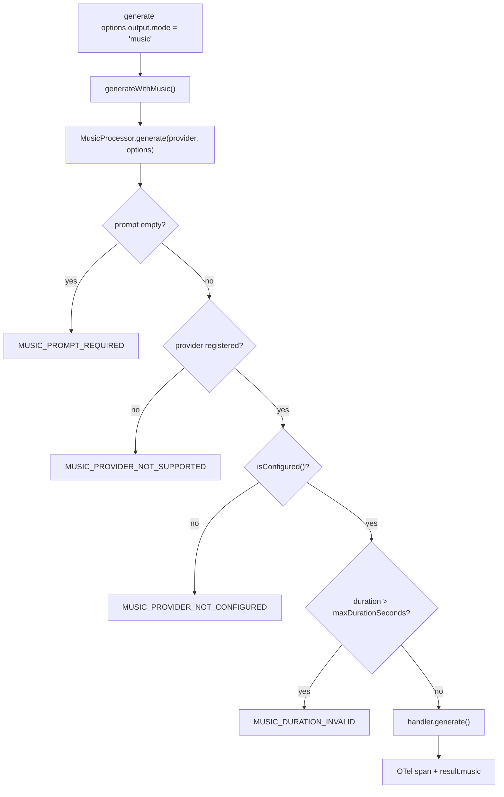

You are building a video pipeline on NeuroLink — Veo generates the footage, an avatar handler generates a talking head for the intro — and the last thing standing between you and a finished asset is a royalty-free background track. Until this release, that meant leaving the SDK entirely: pick a music API, write your own auth, your own polling loop, your own buffer handling, your own timeout logic, and wire it in as a one-off script sitting next to the rest of your NeuroLink code instead of inside it. Music was the one media type NeuroLink's factory/registry pattern hadn't reached yet.

This post is about the commit that closes that gap: a new `music` modality, a `MusicHandler` interface, a `MusicProcessor` registry, and four provider implementations — Google's Lyria 3 Pro, ElevenLabs' sound-generation endpoint, Beatoven.ai, and Replicate-hosted MusicGen — all reachable through the same `generate()` call you already use for text.

## Music is not TTS with different marketing

The type module that anchors this feature says it plainly in its own doc comment:

```typescript
/**
 * Music Generation Type Definitions
 *
 * Types for music / sound-effect generation across providers (Beatoven,
 * ElevenLabs Music, Lyria, Replicate-hosted MusicGen / Riffusion / AudioGen).
 *
 * Music is a separate modality from TTS — TTS produces voiced speech with
 * prosody; Music produces melodic / harmonic / textural audio.
 *
 * @module types/music
 */
```

That distinction is not academic. NeuroLink already had a mature voice stack — TTS and STT topologies with their own stream primitives, described in an [earlier post on voice architecture](/posts/voice-as-three-stream-topologies-tts-stt-and-full-duplex-realtime/) — and it would have been easy to bolt music onto that as "TTS without a script." Instead it ships as its own category, with its own handler interface, its own error class, and its own provider registry, sitting alongside `avatar` and `video` as one of four non-text output modes NeuroLink's CLI now exposes:

```text
Output mode: 'text' (default), 'video' (Veo/Kling/Runway/Replicate),
'ppt' (presentation), 'avatar' (D-ID/HeyGen/MuseTalk talking-head),
'music' (Beatoven/ElevenLabs/Lyria/MusicGen)
```

## The shape of a music request

`MusicOptions` and `MusicResult`, in `src/lib/types/music.ts`, define the contract every provider has to satisfy:

```typescript
export type MusicOptions = {
  /** Text prompt describing the music to generate (required). */
  prompt: string;
  /** Target duration in seconds. Provider-clamped to its supported range. */
  duration?: number;
  /** Output format (default: "mp3"). */
  format?: MusicAudioFormat;
  /** Genre hint (e.g. "ambient", "cinematic"). */
  genre?: MusicGenre;
  /** Mood / emotion hint (e.g. "uplifting", "tense"). */
  mood?: MusicMood;
  /** Tempo in BPM (provider-specific support). */
  tempo?: number;
  /** Override the music provider (e.g. "beatoven", "elevenlabs-music", "lyria", "replicate"). */
  provider?: string;
  /** Reference audio for melody / style guidance (Buffer or path). */
  referenceAudio?: Buffer | string;
  /** Output file path (optional — buffer is always returned in result). */
  output?: string;
  /** Per-call timeout in ms (default: 5 minutes). */
  timeout?: number;
  [key: string]: unknown;
};

export type MusicResult = {
  buffer: Buffer;
  format: MusicAudioFormat;
  size: number;
  duration?: number;
  provider?: string;
  metadata?: {
    latency: number;
    provider?: string;
    model?: string;
    sampleRate?: number;
    bitRate?: number;
    jobId?: string;
    [key: string]: unknown;
  };
};
```

Notice what is *not* here: there is no streaming variant. Every provider returns a complete `Buffer` once generation finishes — a deliberate simplification given that even the slowest provider in this batch (Beatoven, at up to five minutes) is still a bounded, poll-to-completion job rather than something you'd want to stream chunk by chunk.

`MusicAudioFormat` is `"mp3" | "wav" | "flac" | "ogg"`, though in practice only `mp3` and `wav` show up across the four shipped handlers — `flac` and `ogg` are there for forward compatibility with providers that might support them later.

## MusicHandler and MusicProcessor: the same registry pattern as everything else

The `MusicHandler` contract every provider implements is small on purpose:

```typescript
export type MusicHandler = {
  generate(options: MusicOptions): Promise<MusicResult>;
  isConfigured(): boolean;
  readonly maxDurationSeconds?: number;
  readonly supportedFormats?: readonly MusicAudioFormat[];
  readonly supportedGenres?: readonly string[];
};
```

And `MusicProcessor`, in `src/lib/utils/musicProcessor.ts`, is a static class holding a `Map<string, MusicHandler>` — its own doc comment calls out exactly what it's modeled on:

```typescript
/**
 * Central registry + dispatch for music-generation handlers across
 * providers (Beatoven, ElevenLabs Music, Lyria, Replicate-hosted models).
 *
 * Mirrors the static-handler-registry pattern established by
 * `TTSProcessor` / `STTProcessor` / `VideoProcessor`.
 */
export class MusicProcessor {
  private static readonly handlers = new Map<string, MusicHandler>();

  static registerHandler(providerName: string, handler: MusicHandler): void {
    const key = providerName.toLowerCase();
    this.handlers.set(key, handler);
  }

  static supports(providerName: string): boolean {
    return this.handlers.has(providerName.toLowerCase());
  }
  // ...
}
```

`MusicProcessor.generate()` does three things before it ever calls a handler: it rejects an empty prompt with `MUSIC_PROMPT_REQUIRED`, it rejects an unregistered provider name with `MUSIC_PROVIDER_NOT_SUPPORTED` (listing what *is* registered in the error message), and it rejects a duration that exceeds the handler's own `maxDurationSeconds` with `MUSIC_DURATION_INVALID` — all before a single network request goes out. It also wraps the call in an OpenTelemetry span (`SpanType.MEDIA_GENERATION`, operation `music.generate`) and records it through the same metrics aggregator every other generation call uses, so a music request shows up in your existing observability stack without extra plumbing.

Registration happens in `src/lib/factories/providerRegistry.ts`, where each handler is dynamically imported and wrapped in its own `try/catch` — a provider whose SDK dependency is missing, or whose module fails to load, gets logged and skipped rather than taking down registration for the other three:

```typescript
// ===== MUSIC HANDLER REGISTRATION =====
try {
  const { BeatovenMusic } = await import("../music/providers/BeatovenMusic.js");
  MusicProcessor.registerHandler("beatoven", new BeatovenMusic());
} catch (err) { /* logged, registration continues */ }

try {
  const { ReplicateMusic } = await import("../music/providers/ReplicateMusic.js");
  const replicateMusic = new ReplicateMusic();
  MusicProcessor.registerHandler("replicate", replicateMusic);
  MusicProcessor.registerHandler("musicgen", replicateMusic);
} catch (err) { /* ... */ }

try {
  const { ElevenLabsMusic } = await import("../music/providers/ElevenLabsMusic.js");
  const elevenLabsMusic = new ElevenLabsMusic();
  MusicProcessor.registerHandler("elevenlabs-music", elevenLabsMusic);
  MusicProcessor.registerHandler("elevenlabs-sound", elevenLabsMusic);
} catch (err) { /* ... */ }

try {
  const { LyriaMusic } = await import("../music/providers/LyriaMusic.js");
  MusicProcessor.registerHandler("lyria", new LyriaMusic());
} catch (err) { /* ... */ }
```

Two things worth noticing in that block. First, `ReplicateMusic` and `ElevenLabsMusic` each register under two names against the same instance — `replicate`/`musicgen` share one handler, as do `elevenlabs-music`/`elevenlabs-sound`, since ElevenLabs' sound-generation endpoint serves both full tracks and short SFX from the same API surface. Second, a provider that fails to construct — say, `REPLICATE_API_TOKEN` genuinely absent from the environment — still registers; `isConfigured()` is a separate, later check, not a precondition for being in the map at all.

## Four providers, four different transports

The interesting part of this commit isn't the registry — registries are boring by design — it's that the four providers behind it are architecturally nothing alike, and each handler's shape reflects that.

| Provider | Registered as | Transport | Max duration | Format | Auth |
| --- | --- | --- | --- | --- | --- |
| Google Lyria 3 Pro | `lyria` | Synchronous, single POST | 30s | wav | `GOOGLE_AI_LYRIA_API_KEY` / `GOOGLE_API_KEY` / `GOOGLE_AI_API_KEY` / `GEMINI_API_KEY` |
| ElevenLabs Music/SFX | `elevenlabs-music`, `elevenlabs-sound` | Synchronous, single POST | 22s | mp3 | `ELEVENLABS_API_KEY` (shared with TTS) |
| Beatoven.ai | `beatoven` | Async: submit → poll → download | 300s | mp3, wav | `BEATOVEN_API_KEY` |
| Replicate (MusicGen default) | `replicate`, `musicgen` | Async prediction lifecycle | 30s | mp3, wav | Replicate auth (shared adapter) |

### Lyria: audio riding inside a chat-completions-shaped response

Lyria's handler talks to `https://generativelanguage.googleapis.com/v1beta/models/{model}:generateContent` — the same Generative Language API surface used for Gemini text calls — with `generationConfig.responseModalities: ["AUDIO"]`. The audio itself comes back as base64 inside a `candidates[0].content.parts[].inlineData.data` field, the same shape a multimodal chat response would use for an inline image. A comment in the handler explains a real API surprise the code has to work around:

```typescript
// Lyria API no longer accepts `audioGenerationOptions` — duration is
// controlled implicitly by the prompt/model. Only `responseModalities`
// is allowed under `generationConfig`. Embed duration in the prompt
// so the model still gets the hint.
const promptWithDuration = `${this.buildPrompt(options)}. Duration: ${duration} seconds`;
```

There's no API parameter for duration at all — NeuroLink appends `"Duration: 16 seconds"` (or whatever you requested, clamped to 30) as plain text onto the end of the prompt and hopes the model honors it. That's a soft constraint, not an enforced one, and it's worth knowing if you're building something duration-sensitive against Lyria specifically.

### ElevenLabs: the shortest window, and a documented failure mode

ElevenLabs' handler hits `POST /v1/sound-generation` with `Accept: audio/mpeg`, and it's the strictest about duration — a hard `1` to `22` second range enforced client-side before the request even goes out:

```typescript
const requestedDuration = options.duration ?? 8;
if (requestedDuration <= 0 || requestedDuration > this.maxDurationSeconds) {
  throw new MusicError({
    code: MUSIC_ERROR_CODES.INVALID_INPUT,
    message: `ElevenLabs Music duration must be between 1 and ${this.maxDurationSeconds} seconds; got ${requestedDuration}`,
    // ...
  });
}
```

The provider's own docs page in this commit documents a specific failure mode worth flagging, because it's the kind of thing that's easy to misdiagnose as a code bug: a `401 payment_required` from ElevenLabs means the account has an open invoice, not a bad key. That distinction shows up in the commit's own quality-gate log too — the music continuous test suite ran 11 tests with 1 failure, and the commit message is explicit that the one failure was "user-side ElevenLabs invoice," not an SDK defect.

### Beatoven: the only provider that polls

Beatoven is the odd one out — a genuine async job. `BeatovenMusic.generate()` submits a compose request to `/api/v1/tracks/compose`, gets back a `task_id`, and polls `/api/v1/tasks/{taskId}` every 3 seconds for up to 5 minutes until the status flips to `"composed"` (or `"failed"`, which throws immediately rather than continuing to poll):

```typescript
private async pollUntilComposed(
  taskId: string,
  totalTimeoutMs: number,
): Promise<BeatovenTaskStatus> {
  const startTime = Date.now();
  while (Date.now() - startTime < totalTimeoutMs) {
    const status = await this.fetchTaskStatus(taskId);
    if (status.status === "composed") {
      return status;
    }
    if (status.status === "failed") {
      throw new MusicError({
        code: MUSIC_ERROR_CODES.GENERATION_FAILED,
        message: `Beatoven task ${taskId} failed: ${status.message ?? "unknown"}`,
        retriable: false,
        context: { taskId, status },
      });
    }
    await new Promise((r) => setTimeout(r, POLL_INTERVAL_MS));
  }
  throw new MusicError({
    code: MUSIC_ERROR_CODES.POLL_TIMEOUT,
    message: `Beatoven task ${taskId} did not complete within ${Math.round(totalTimeoutMs / 1000)}s`,
    retriable: true,
    context: { taskId, totalTimeoutMs },
  });
}
```

Once composed, the handler downloads the resulting track from a `track_url` the task metadata returns — and that download goes through `assertSafeUrl()` first, NeuroLink's SSRF guard, before any fetch happens. That's not decorative: a `track_url` is attacker-influenceable data coming back from a third-party API response, not a URL NeuroLink constructed itself, so it gets the same treatment any other externally-supplied URL would.

### Replicate: reusing the universal prediction lifecycle, plus a byte-sniffing detour

`ReplicateMusic` doesn't talk to a music-specific endpoint at all — it routes through `src/lib/adapters/replicate/predictionLifecycle.ts`, the same `predict()` / `downloadPredictionOutput()` pair every other Replicate-hosted modality (image, video, avatar) uses. The default model is pinned by version hash:

```typescript
const DEFAULT_MODEL =
  "meta/musicgen:7be0f12c54a8d033a0fbd14418c9af98962da9a86f5ff7811f9b3423a1f0b7d7";
```

— Meta's MusicGen, with `options.model` available as an override for Riffusion, AudioGen, or AudioLDM variants hosted on the same platform.

The one genuinely unusual piece of code in this handler is `detectAudioType()`, needed because `referenceAudio` (a melody-conditioning input MusicGen supports) has to be embedded as a `data:` URI with a correct MIME subtype, and the caller only hands over a `Buffer` or an HTTPS URL — no declared type:

```typescript
private detectAudioType(buffer: Buffer): "mp3" | "wav" | "ogg" | "mp4" | "mpeg" {
  if (buffer.length < 4) return "mp3";
  // WAV: starts with RIFF
  if (buffer[0] === 0x52 && buffer[1] === 0x49 && buffer[2] === 0x46 && buffer[3] === 0x46) {
    return "wav";
  }
  // OGG: starts with OggS
  if (buffer[0] === 0x4f && buffer[1] === 0x67 && buffer[2] === 0x67 && buffer[3] === 0x53) {
    return "ogg";
  }
  // MP3: ID3 header
  if (buffer[0] === 0x49 && buffer[1] === 0x44 && buffer[2] === 0x33) {
    return "mp3";
  }
  // MP3: MPEG sync word (0xFF 0xE0–0xFF)
  if (buffer[0] === 0xff && (buffer[1] & 0xe0) === 0xe0) {
    return "mpeg";
  }
  // M4A / AAC: "ftyp" box at offset 4
  if (buffer.length >= 8 && buffer[4] === 0x66 && buffer[5] === 0x74 && buffer[6] === 0x79 && buffer[7] === 0x70) {
    return "mp4";
  }
  return "mp3";
}
```

It's a magic-bytes sniffer, not a MIME-type trust exercise — exactly the same category of problem the image-generation side of this same commit solved for WebP detection on Recraft's output. Also worth noting: `resolveBuffer()` explicitly rejects local file paths for `referenceAudio` — only a `Buffer` or an `https://` URL is accepted, and any URL still goes through `assertSafeUrl()` before the fetch.

## Wiring `music` into `generate()`

All four handlers are invisible unless something dispatches to them, and that something is a small addition to `NeuroLink.generate()` in `src/lib/neurolink.ts`:

```typescript
if (options.output?.mode === "music") {
  return this.generateWithMusic(options, generateSpan);
}

// ...

private async generateWithMusic(
  options: GenerateOptions,
  generateSpan: Span,
): Promise<GenerateResult> {
  const musicOptions = options.output?.music;
  if (!musicOptions) {
    throw new Error(
      'output.mode="music" requires output.music with at least { provider, prompt }.',
    );
  }
  const providerName = musicOptions.provider;
  if (!providerName) {
    throw new Error(
      'output.music.provider is required (e.g. "beatoven", "elevenlabs-music", "lyria", "replicate").',
    );
  }
  const { MusicProcessor } = await import("./utils/musicProcessor.js");
  const musicResult = await MusicProcessor.generate(providerName, {
    ...musicOptions,
    prompt: musicOptions.prompt ?? options.input?.text ?? "",
  });
  generateSpan.setAttribute("neurolink.music.provider", providerName);
  generateSpan.setAttribute("neurolink.music.bytes", musicResult.size);
  return {
    content: `Music generated (${providerName}, ${musicResult.size} bytes, ${musicResult.format}).`,
    model: musicResult.metadata?.model ?? providerName,
    music: musicResult,
    // ...
  };
}
```

`generateWithMusic` falls back to `options.input?.text` for the prompt if `output.music.prompt` isn't set directly — so the same "describe what you want in `input.text`" ergonomics that work for a normal chat call also work here. The result comes back on `result.music`, alongside (not instead of) the usual `content`/`model` fields — `content` becomes a short human-readable summary rather than the audio itself, since the audio lives in `music.buffer`.

### Calling it from code

```typescript
import { NeuroLink } from "@juspay/neurolink";
import { writeFileSync } from "node:fs";

const neurolink = new NeuroLink();

const result = await neurolink.generate({
  output: {
    mode: "music",
    music: {
      provider: "lyria",
      prompt: "Uplifting orchestral cinematic with strings and brass",
      duration: 30,
    },
  },
});

if (result.music?.buffer) {
  writeFileSync("./track.wav", result.music.buffer);
}
```

Swapping `provider: "lyria"` for `"beatoven"`, `"elevenlabs-music"`, or `"replicate"` is the entire migration between providers — the request shape, the error handling, and the `result.music` contract don't change.

### Calling it from the CLI

The command factory adds `--musicProvider`, `--musicDuration`, `--musicFormat`, `--musicGenre`, `--musicMood`, `--musicTempo`, and `--musicOutput` as first-class flags, gated behind `--outputMode music` (or inferred automatically the moment any `music*` flag is present):

```bash
npx @juspay/neurolink generate "Calm piano melody for a study playlist" \
  --outputMode music \
  --musicProvider lyria \
  --musicDuration 30 \
  --musicOutput ./track.wav
```

The CLI assembles those flags into exactly the same `output.music` shape the SDK call above builds by hand:

```typescript
if (isMusicMode) {
  return {
    mode: "music" as const,
    music: {
      prompt: "", // Filled in from input.text/prompt by baseProvider
      provider: enhancedOptions.musicProvider as string | undefined,
      duration: enhancedOptions.musicDuration as number | undefined,
      format: enhancedOptions.musicFormat as "mp3" | "wav" | "flac" | "ogg" | undefined,
      genre: enhancedOptions.musicGenre as string | undefined,
      mood: enhancedOptions.musicMood as string | undefined,
      tempo: enhancedOptions.musicTempo as number | undefined,
      output: enhancedOptions.musicOutput as string | undefined,
    },
  };
}
```

And a small helper writes the buffer to disk when `--musicOutput` is set, reporting the size on success and a specific warning when the result came back with no music at all:

```typescript
if (!music) {
  console.warn(
    "⚠️  No music available in result. Music generation may not be enabled or the request failed.",
  );
  return;
}
fs.writeFileSync(musicOutputPath, music.buffer);
console.log(chalk.green(`🎵 Music saved to: ${musicOutputPath} (${sizeStr})`));
```

## Error handling: one error class, seven codes

Every failure path across all four providers throws `MusicError`, a typed subclass of NeuroLink's base error class, with one of seven codes defined in `MUSIC_ERROR_CODES`:

```typescript
export const MUSIC_ERROR_CODES = {
  PROVIDER_NOT_SUPPORTED: "MUSIC_PROVIDER_NOT_SUPPORTED",
  PROVIDER_NOT_CONFIGURED: "MUSIC_PROVIDER_NOT_CONFIGURED",
  GENERATION_FAILED: "MUSIC_GENERATION_FAILED",
  POLL_TIMEOUT: "MUSIC_POLL_TIMEOUT",
  PROMPT_REQUIRED: "MUSIC_PROMPT_REQUIRED",
  DURATION_INVALID: "MUSIC_DURATION_INVALID",
  INVALID_INPUT: "MUSIC_INVALID_INPUT",
} as const;
```

The commit's broader integration-fixes list matters here too: before this release, `TTSError`/`MusicError`/`AvatarError`/`VideoError`/`STTError` were all getting re-wrapped as generic `Provider` errors somewhere between the handler and `baseProvider.handleProviderError`. That's fixed as part of the same commit — a `MusicError` thrown by `LyriaMusic` now surfaces as a `MusicError` all the way up to your `catch` block, with its original `code` intact, rather than losing its type on the way out.

Every network-facing call in all four handlers follows the same shape: an `AbortController` with a per-request timeout, a `finally` block that always clears the timeout, and a `retriable` flag on the thrown error distinguishing "try again" (timeouts, 429s, 5xx) from "don't" (bad input, 4xx other than 429, missing credentials).



## What this doesn't do yet

Worth being direct about the current limits, because they're real and grounded in what the code actually enforces, not hedging for its own sake. Three of the four providers cap you well under a minute per call — Lyria and Replicate at 30 seconds, ElevenLabs at 22 — which makes them well suited to loops, stings, and short transitions, and a poor fit for a full soundtrack in one call. Beatoven is the outlier at up to five minutes, but it's also the slowest path, since every call is submit-then-poll rather than a single round trip. There's no streaming variant of `MusicResult` — you always wait for the complete buffer. And Lyria's duration control is a prompt-embedded hint, not an enforced parameter, so it's the least precise of the four on exact length. None of that makes music generation less real as a feature; it's the newest modality in NeuroLink's catalog, not a finished instrument for long-form composition, and the provider table above is the honest map of where each one is actually strong.

---

**Related posts:**

- [Generating talking avatars with NeuroLink](/posts/generating-talking-avatars-with-neurolink/)
- [Video Generation with Veo 3.1: AI-Powered Video Synthesis](/posts/video-generation-veo/)
- [Text-to-Speech Integration: Build Voice-Enabled AI Apps with NeuroLink](/posts/tts-integration-guide/)
