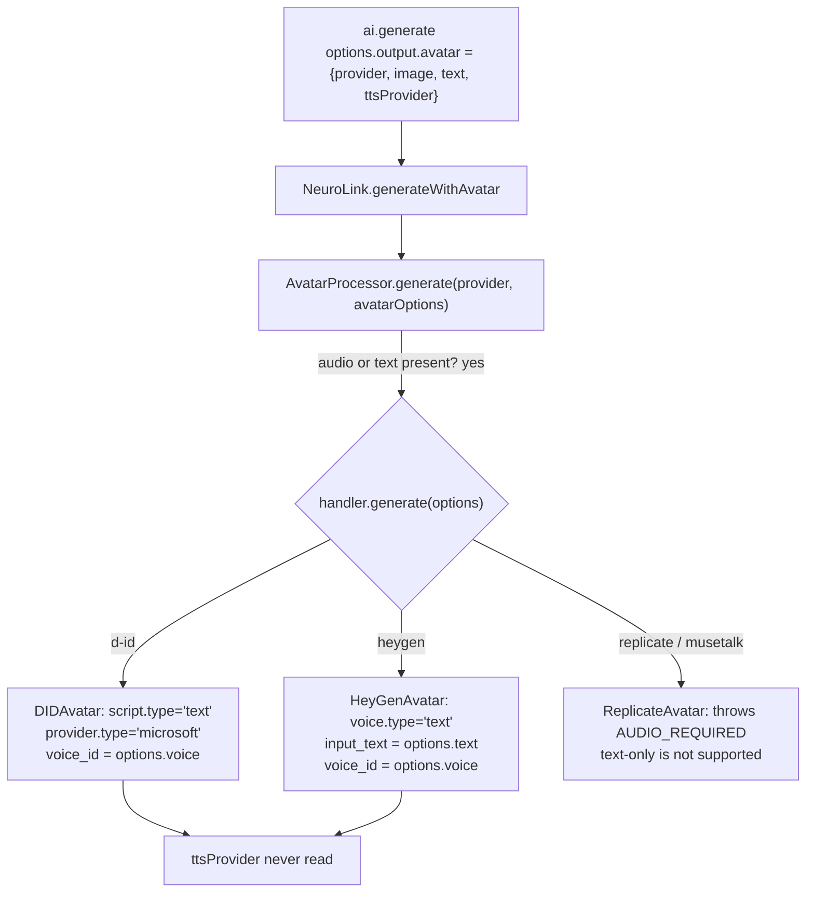

You pass `text` and `ttsProvider: "openai-tts"` to NeuroLink's new avatar mode, expecting the underlying mechanism to synthesize that text with OpenAI's voice model and hand the resulting audio to your lip-sync provider. Set the provider to D-ID and that is not what happens: D-ID never sees OpenAI, never sees `ttsProvider` at all, and instead sends your text straight to its own Microsoft-voice engine. Set the provider to `replicate` (MuseTalk) instead and the call fails outright — `text` alone is rejected before a single API request goes out. The `ttsProvider` field compiles, autocompletes, and does nothing.

This is not a bug being reported after the fact — it is what shipped, read directly out of `src/lib/avatar/providers/DIDAvatar.ts`, `HeyGenAvatar.ts`, `ReplicateAvatar.ts`, `src/lib/utils/avatarProcessor.ts`, and `src/lib/neurolink.ts`'s `generateWithAvatar`, all added in commit `00f88f671` on 2026-05-16. The engineering story here is what actually happens when you combine a portrait with narration across three lip-sync providers that disagree, sometimes sharply, about whose TTS engine gets to run and what shape the audio has to arrive in.

## What the type says versus what the code does

`AvatarOptions`, in `src/lib/types/avatar.ts`, documents an explicit contract for text-driven avatars:

```typescript
/**
 * Audio source — direct lip-sync.
 * Either provide `audio` OR `text` (with optional `ttsProvider` / `voice`).
 */
audio?: Buffer | string;

/**
 * Text for the avatar to speak. When provided without `audio`, the
 * NeuroLink dispatcher first runs TTS (`ttsProvider`) to produce audio,
 * then passes the audio to the avatar handler.
 */
text?: string;

/** TTS provider for text → audio when `text` is used. Default: "openai-tts". */
ttsProvider?: string;

/** Voice id passed through to the TTS provider when `text` is used. */
voice?: string;
```

That docstring describes a specific pipeline: text goes in, NeuroLink's own TTS layer (the same `TTSProcessor` that backs `ai.generate({ tts: { enabled: true, provider: "openai-tts" } })`) turns it into audio, and only the audio reaches the avatar provider. Nothing downstream of the type does that.

Start at the top of the call stack. `NeuroLink.generateWithAvatar`, added in the same commit, is the method `ai.generate({ output: { mode: "avatar" } })` dispatches to:

```typescript
private async generateWithAvatar(
  options: GenerateOptions,
  generateSpan: ReturnType<typeof tracers.sdk.startSpan>,
): Promise<GenerateResult> {
  const avatarOptions = options.output?.avatar;
  // ...
  const { AvatarProcessor } = await import("./utils/avatarProcessor.js");
  const avatarResult = await AvatarProcessor.generate(
    providerName,
    avatarOptions,
  );
  // ...
}
```

`avatarOptions` — the object holding your `text` and `ttsProvider` — passes through unchanged. No `TTSProcessor` import here, no synthesis step, no branch on whether `audio` is present. `AvatarProcessor.generate`, in `src/lib/utils/avatarProcessor.ts`, is the next and last stop before the provider-specific handler:

```typescript
static async generate(
  provider: string,
  options: AvatarOptions,
): Promise<AvatarResult> {
  // ...
  if (!options.audio && !options.text) {
    throw new AvatarError({
      code: AVATAR_ERROR_CODES.INVALID_INPUT,
      message:
        "Avatar generation requires either `audio` (a Buffer/URL) or `text` (to be TTS'd by the provider).",
      // ...
    });
  }
  const handler = this.getHandler(provider);
  // ...
  const result = await handler.generate(options);
  // ...
}
```

Read that validation message carefully — "text (to be TTS'd by the provider)". Not by NeuroLink. `AvatarProcessor` checks that *one of* `audio` or `text` is set and then calls `handler.generate(options)` with the object exactly as you built it. There is no third place left for a TTS round trip to happen; the options object that lands in `DIDAvatar.generate`, `HeyGenAvatar.generate`, or `ReplicateAvatar.generate` is the same object you passed to `ai.generate()`, `ttsProvider` and all. What each handler does with `text` next is a per-provider decision, and the three shipped handlers make three different ones.



## D-ID: your text, Microsoft's voice

`DIDAvatar.submitTalk`, in `src/lib/avatar/providers/DIDAvatar.ts`, builds the request body D-ID's `/talks` endpoint receives:

```typescript
private async submitTalk(
  options: AvatarOptions,
  sourceUrl: string,
  audioUrl?: string,
): Promise<string> {
  const script: Record<string, unknown> = audioUrl
    ? { type: "audio", audio_url: audioUrl }
    : {
        type: "text",
        input: options.text,
        provider: {
          type: "microsoft",
          voice_id: options.voice ?? "en-US-JennyNeural",
        },
      };
  // ...
}
```

When `options.audio` is absent, D-ID gets `script.type: "text"` with a hardcoded `provider.type: "microsoft"` — D-ID's own text-to-speech, routed through Microsoft's voice catalog on D-ID's side of the API boundary. `options.voice` is read here and does real work: it becomes the Microsoft voice id (`en-US-JennyNeural` is the fallback). `options.ttsProvider` is not referenced anywhere in this file. If you set it to `"elevenlabs"`, D-ID's talk request looks identical to one where you left it `undefined` — the field simply never reaches the request body.

This means `voice` for D-ID has to be a name from Microsoft's voice list (D-ID's `/talks` docs enumerate the supported ids), not an OpenAI or ElevenLabs voice id — passing `voice: "alloy"` (an OpenAI TTS voice) would submit a Microsoft request for a voice named `"alloy"`, which does not exist in that catalog, and D-ID's API would reject the talk at submission.

## HeyGen: same shape, different catalog, and a strict input type

`HeyGenAvatar.submitVideo` follows the identical pattern with HeyGen's own voice catalog instead of Microsoft's:

```typescript
const voiceConfig = options.audio
  ? {
      type: "audio",
      audio_url: options.audio as string,
    }
  : {
      type: "text",
      input_text: options.text,
      voice_id: options.voice ?? "1bd001e7e50f421d891986aad5158bc8",
    };
```

Same shape as D-ID — `voice_id` from `options.voice`, a default fallback voice, `ttsProvider` unused — but HeyGen's `voice_id` values come from HeyGen's own voice library, a third and separate namespace from both Microsoft's and OpenAI's. A voice id valid for D-ID is meaningless to HeyGen and vice versa; there is no shared voice vocabulary across providers here, `ttsProvider` or not.

HeyGen also diverges on the `audio` branch in a way that matters if you plan to chain NeuroLink's own TTS output into it. Look at the validation `HeyGenAvatar.generate` runs before ever building `voiceConfig`:

```typescript
if (options.audio !== undefined) {
  if (Buffer.isBuffer(options.audio)) {
    throw new AvatarError({
      code: AVATAR_ERROR_CODES.INVALID_INPUT,
      message:
        "HeyGen requires a publicly accessible audio URL; got a binary Buffer. Upload the audio to a hosted location and pass the HTTPS URL instead.",
      // ...
    });
  }
  if (
    typeof options.audio !== "string" ||
    !/^https?:\/\//i.test(options.audio)
  ) {
    throw new AvatarError({
      code: AVATAR_ERROR_CODES.INVALID_INPUT,
      message:
        "HeyGen requires a publicly accessible HTTPS audio URL; got an unsupported audio input type. Upload the audio to a hosted location and pass the HTTPS URL instead.",
      // ...
    });
  }
}
```

`AvatarOptions.audio` is typed as `Buffer | string`, and D-ID and MuseTalk both accept a raw `Buffer` — they upload it on your behalf. HeyGen refuses one outright, with an error message that tells you exactly what to do instead: host the file and pass the URL. If your plan is "call NeuroLink's TTS to get an in-memory MP3 buffer, then feed that buffer straight into avatar generation," that plan works unmodified against D-ID and MuseTalk and throws immediately against HeyGen.

## MuseTalk: no native text path at all

`ReplicateAvatar`, wrapping the MuseTalk model on Replicate, does not implement a text branch. The module comment says so up front:

```typescript
/**
 * Replicate Avatar Handler.
 *
 * MuseTalk requires both `image` and `audio` inputs — `text`-only is not
 * supported here (use D-ID for that, or chain TTS + this handler).
 */
```

and `generate` enforces it as the very first check, before any network call:

```typescript
if (!options.audio) {
  throw new AvatarError({
    code: AVATAR_ERROR_CODES.AUDIO_REQUIRED,
    message:
      "Replicate avatar handler (MuseTalk) requires `audio` (Buffer or path); text-only is not supported. Use D-ID for text-driven talks or chain TTS + Replicate.",
    category: ErrorCategory.VALIDATION,
    severity: ErrorSeverity.MEDIUM,
    retriable: false,
  });
}
```

MuseTalk is a lip-sync model, not a text-to-speech model wrapped around one — it has no voice engine to fall back on, and the error message states the workaround plainly: generate the audio yourself first. This is the one shipped path where "text through TTS, then image plus audio through lip-sync" is real, but it is a pattern you assemble by calling NeuroLink's TTS and the avatar handler as two separate steps — not something `ttsProvider` triggers for you.

`ReplicateAvatar.resolveBuffer` accepts either a `Buffer` or an HTTPS URL for both `image` and `audio`, base64-encoding whichever it gets into a data URI before submitting the Replicate prediction:

```typescript
const imageBuffer = await this.resolveBuffer(
  options.image,
  MAX_IMAGE_BYTES,
  "Replicate avatar reference image",
);
const audioBuffer = await this.resolveBuffer(
  options.audio,
  MAX_AUDIO_BYTES,
  "Replicate avatar reference audio",
);

const imageDataUri = `data:image/${this.detectImageType(imageBuffer)};base64,${imageBuffer.toString("base64")}`;
const audioDataUri = `data:audio/${this.detectAudioType(audioBuffer)};base64,${audioBuffer.toString("base64")}`;
```

That accepts a raw `Buffer` — the exact shape NeuroLink's own TTS hands back — with no hosting step required, unlike HeyGen.

## The pattern that actually works today

Given all three handlers, there are two real ways to pair a voice with a talking head, and which one applies depends on the provider you pick:

**Native per-provider TTS** — pass `text` and (optionally) a `voice` id from that specific provider's own catalog, and let D-ID or HeyGen synthesize it internally. This costs one round trip, but the `voice` value only makes sense for the provider you're calling — a Microsoft voice id for D-ID, a HeyGen catalog id for HeyGen. `ttsProvider` has no effect either way and can be left off.

**Manual chaining** — call NeuroLink's own TTS explicitly, get back a buffer, and pass that buffer as `avatar.audio`. This is the only option MuseTalk supports, and it also works against D-ID (accepts `Buffer | string`) but not against HeyGen (`Buffer` throws `INVALID_INPUT`; you'd need to host the file yourself first).

The TTS half of that second pattern is the same call the SDK already documents for plain audio generation — `ai.generate({ tts: { enabled: true, ... } })` returns `result.audio.buffer`:

```typescript
import { NeuroLink } from "@juspay/neurolink";
import { readFileSync, writeFileSync } from "node:fs";

const ai = new NeuroLink();

// Step 1: synthesize narration with NeuroLink's TTS pipeline.
const ttsResult = await ai.generate({
  input: { text: "Hello, this is your AI presenter." },
  tts: {
    enabled: true,
    provider: "openai-tts",
    voice: "alloy",
    format: "mp3",
  },
});
const narration = ttsResult.audio?.buffer;
if (!narration) {
  throw new Error("TTS synthesis did not return an audio buffer");
}

// Step 2: hand the resulting buffer to the avatar handler as `audio`,
// not `text` — this is the step ttsProvider on AvatarOptions does not
// perform for you.
const avatarResult = await ai.generate({
  provider: "vertex", // unused — avatar dispatch is driven by output.avatar
  output: {
    mode: "avatar",
    avatar: {
      provider: "musetalk", // or "d-id" — both accept a Buffer here
      image: readFileSync("./portrait.jpg"),
      audio: narration,
    },
  },
});
if (avatarResult.avatar?.buffer) {
  writeFileSync("./talk.mp4", avatarResult.avatar.buffer);
}
```

Two `ai.generate()` calls, one explicit hand-off. This is a strictly more capable pattern than the native-TTS path: it works against every shipped avatar provider that accepts a `Buffer`, it lets you pick any of the SDK's TTS providers (not just whichever the avatar provider happens to have wired internally), and it uses the exact same `voice` vocabulary as the rest of NeuroLink's TTS surface instead of switching between Microsoft's and HeyGen's separate catalogs depending on which avatar provider you called.

## What this means for `ttsProvider` as it ships

`ttsProvider` on `AvatarOptions` is a real, typed, documented field — it is not dead by accident of a rename or a half-finished refactor. Its docstring states an intended behavior precisely: NeuroLink runs TTS with the named provider, then hands the audio to the avatar handler. Reading the three handlers and the two dispatch layers between `ai.generate()` and them shows that behavior is not implemented for `d-id`, `heygen`, or `replicate` in commit `00f88f671`. The field type-checks and autocompletes in an editor; passing it changes nothing about the request any of the three handlers send.

The practical takeaway is narrow and concrete rather than a verdict on the feature: if your goal is a talking head that speaks arbitrary text, decide up front whether you want the avatar provider's own voice (D-ID's Microsoft catalog, or HeyGen's own) or NeuroLink's TTS providers. If you want NeuroLink's TTS providers — for voice consistency with the rest of your app, for provider choice, or because you're targeting MuseTalk, which has no native text path at all — synthesize the audio yourself with a `tts`-enabled `generate()` call and pass the resulting buffer as `avatar.audio`. Do not set `text` and `ttsProvider` and expect the SDK to do that hand-off for you; as shipped, nothing in the dispatch path performs it.

## Checking a provider's expectations before you build against it

The three handlers disagree enough — on voice catalogs, on whether `Buffer` audio is accepted, on whether `text` is supported at all — that the safest habit is checking the specific handler file for the provider you're targeting before writing integration code, rather than assuming `AvatarOptions`' shared type implies shared behavior underneath:

| Provider | `text` supported | `voice` catalog | `audio: Buffer` accepted |
| --- | --- | --- | --- |
| `d-id` | Yes — D-ID's own Microsoft-voice TTS | Microsoft voice ids (default `en-US-JennyNeural`) | Yes |
| `heygen` | Yes — HeyGen's own TTS | HeyGen voice catalog ids (default `1bd001e7e50f421d891986aad5158bc8`) | No — throws `INVALID_INPUT`, needs a hosted HTTPS URL |
| `replicate` / `musetalk` | No — throws `AUDIO_REQUIRED` | n/a | Yes |

None of the three columns are things `AvatarOptions`' shared type signature tells you; each is a decision made inside that provider's own `generate()` method, and the only way to know it is to read that file.

---

**Related posts:**

- [Generating talking avatars with NeuroLink](/posts/generating-talking-avatars-with-neurolink/)
- [Text-to-Speech Integration: Build Voice-Enabled AI Apps with NeuroLink](/posts/tts-integration-guide/)
- [Video Generation with Veo 3.1: AI-Powered Video Synthesis](/posts/video-generation-veo/)
