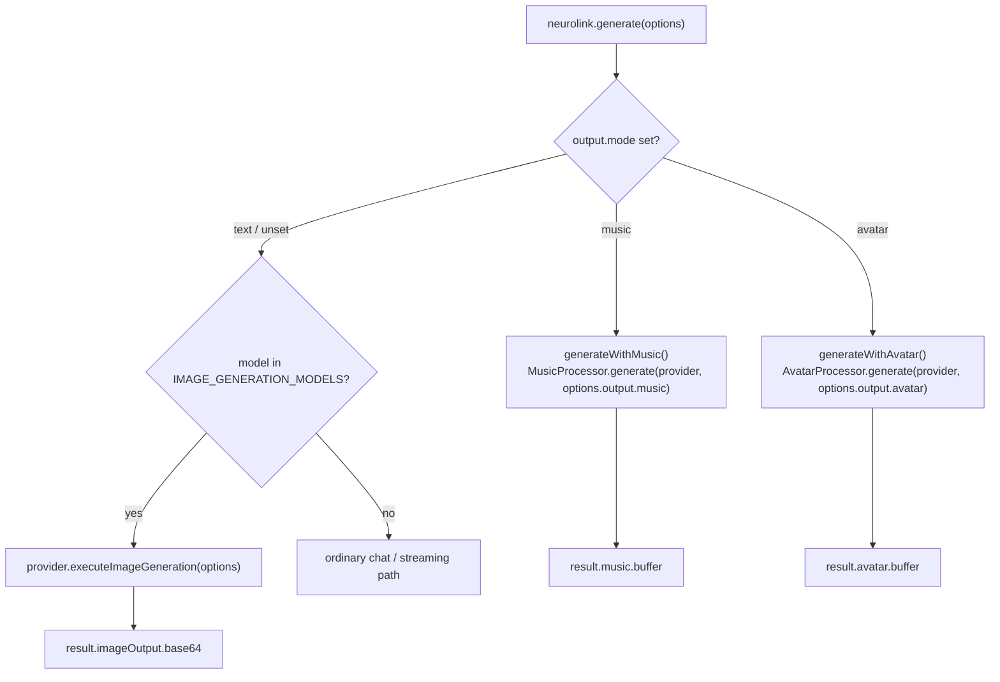

You are three days from a product launch video. The intro needs a synthetic presenter reading a script over a portrait you already have on file. The B-roll needs a handful of AI-generated product renders in a consistent style. The outro needs a sixteen-second stinger of cinematic music under the end card. Three assets, three different jobs — and choosing the right API for each one matters more than it looks, because as of one commit in this codebase, all three are reachable from the exact same `neurolink.generate()` call you already use for chat. That convenience is real, but it hides something worth knowing before you write the code: image, avatar, and music generation solve different problems, and NeuroLink dispatches each of them a different way. Get the dispatch wrong and you get a thrown error, not a wrong-but-plausible result — which, once you know what to expect from each one, is the friendlier failure mode of the three.

This is a decision guide, not a tutorial for any single modality — there are already dedicated posts on [generating talking avatars](/posts/generating-talking-avatars-with-neurolink/) and on [how music generation works](/posts/neurolink-can-now-generate-music-how-it-works/) if you want the full API surface for either. What follows is how to choose between the three, and then how to choose between the providers inside whichever one you land on.

## Three modalities, one call, two dispatch mechanisms

The first thing that trips people up is that "pick a modality" doesn't mean the same thing three times. Avatar and music are both selected through `output.mode`, a field on `GenerateOptions`:

```typescript
output?: {
  /**
   * Output mode - determines the type of content generated
   * - "text": Standard text generation (default)
   * - "video": Video generation using models like Veo 3.1
   * - "ppt": PowerPoint presentation generation
   * - "avatar": Talking-head / lip-sync video (D-ID, HeyGen, Replicate-MuseTalk)
   * - "music": Music / sound generation (Beatoven, ElevenLabs Music, Lyria, Replicate)
   */
  mode?: "text" | "video" | "ppt" | "avatar" | "music";
  avatar?: AvatarOptions;
  music?: MusicOptions;
};
```

Notice what is missing from that union: `"image"`. There is no `output.mode: "image"`, and the CLI's own `--outputMode` flag enforces the same thing — its `choices` array in `src/cli/factories/commandFactory.ts` is literally `["text", "video", "ppt", "avatar", "music"]`. Image generation is not a mode you set. It is a model you pick.

Every call into `BaseProvider.generate()` checks the requested model against a list before doing anything else:

```typescript
const isImageModel = IMAGE_GENERATION_MODELS.some((m) =>
  this.modelName.includes(m),
);
if (isImageModel && !requestsNonImageOutput) {
  logger.info(
    `Image generation model detected, routing to executeImageGeneration`,
  );
  const imageResult = await this.executeImageGeneration(options);
  return await this.enhanceResult(imageResult, options, startTime);
}
```

`IMAGE_GENERATION_MODELS`, in `src/lib/core/constants.ts`, is a flat list of model identifiers — Gemini image models, Stability's model names, Ideogram's version strings, Recraft's model IDs, OpenAI's `gpt-image-1` / `dall-e-3` / `dall-e-2`, and even a few Replicate-hosted slugs like `black-forest-labs/flux` and `stability-ai/sdxl`. A second function, `isImageGenerationModel()`, is also defined in this file with the same boundary-aware intent — but it isn't called anywhere in the dispatch path shown above, or anywhere else in `src/`, as of this commit, and running it shows the boundary check doesn't actually stop the collision its own comment describes: `isImageGenerationModel("my-V_1")` returns `true`, because `-` counts as an acceptable boundary character before the match and end-of-string counts after it. Ask for `model: "gpt-image-1"` on the `openai` provider and you get an image back. Ask for `model: "gpt-5.4"` on the same provider and you get text. The provider doesn't change; the model does.

Avatar and music never go through that model check at all — they short-circuit earlier, in `NeuroLink.generate()` itself, purely off `output.mode`:

```typescript
if (options.output?.mode === "music") {
  return this.generateWithMusic(options, generateSpan);
}
if (options.output?.mode === "avatar") {
  return this.generateWithAvatar(options, generateSpan);
}
```

That is the first real decision point: if you're picking an image provider, you pick it by naming the right model against the right provider. If you're picking avatar or music, you pick it by setting `output.mode` and filling in a nested options object — the top-level `provider` field on the call is, in both cases, not what selects the handler.

## Image generation: seven providers behind one model check

Once the `IMAGE_GENERATION_MODELS.some(...)` check matches, dispatch lands on `executeImageGeneration()`, a method every provider either inherits as a throwing stub from `BaseProvider` —

```typescript
protected async executeImageGeneration(
  _options: TextGenerationOptions,
): Promise<EnhancedGenerateResult> {
  throw new Error(
    `Image generation is not supported by the ${this.providerName} provider or the selected model.`,
  );
}
```

— or overrides with real logic. As of this release, seven providers override it — `google-ai` (Gemini image models through `@google/genai`) plus the six in this table:

| Provider | Models | Protocol | Notes |
| --- | --- | --- | --- |
| `openai` | `gpt-image-1`, `dall-e-3`, `dall-e-2` | REST, single POST to `/v1/images/generations` | Previously broken — the Vercel AI SDK can't reach the images endpoint on its own; this release added the override |
| `vertex` | `gemini-3-pro-image-preview`, `gemini-2.5-flash-image`, `gemini-3.1-flash-image-preview` | REST, single call via `google-auth-library` | Only provider that accepts a PDF as contextual input (and, in this table, the only one that accepts reference images) |
| `stability` | `stable-image-ultra`, `stable-image-core`, `sd3.5-large`/`-large-turbo`/`-medium` | REST, `multipart/form-data` to `/v2beta/stable-image/generate/{model}` | Image-only — no chat, no streaming |
| `ideogram` | `V_1` … `V_3` | REST, `/v1/ideogram-v3/generate` | Image-only; strongest at in-image text (posters, logos) |
| `recraft` | `recraftv3`, `recraftv3-svg`, `recraftv2` | REST, `/v1/images/generations` | The only one that can return native vector SVG, not just raster |
| `replicate` | `black-forest-labs/flux`, `stability-ai/sdxl`, `stability-ai/stable-diffusion` | Async prediction lifecycle (submit → poll) | The one provider that spans image, video, avatar, *and* music under the same `REPLICATE_API_TOKEN` |

Every one of them returns the same shape on success — `result.imageOutput.base64` — regardless of which provider produced it:

```typescript
const ai = new NeuroLink();
const result = await ai.generate({
  provider: "openai",
  model: "gpt-image-1",
  input: { text: "A serene mountain lake at sunrise, photorealistic" },
});
if (result.imageOutput?.base64) {
  writeFileSync("lake.png", Buffer.from(result.imageOutput.base64, "base64"));
}
```

OpenAI's own handler is worth a closer look, because it's the one this release specifically repaired. The three models it serves don't accept the same request body: `gpt-image-1` returns base64 by default and rejects `response_format` outright; `dall-e-3` and `dall-e-2` need `response_format: "b64_json"` to get base64 back instead of a hosted URL; and `dall-e-2` is the only one of the three that doesn't accept `quality` or `style`. The handler branches on all three:

```typescript
if (model === "gpt-image-1") {
  if (extras.quality) { body.quality = extras.quality; }
} else if (model.startsWith("dall-e-3")) {
  body.response_format = "b64_json";
  if (extras.quality) { body.quality = extras.quality; }
  if (extras.style) { body.style = extras.style; }
} else {
  // dall-e-2
  body.response_format = "b64_json";
}
```

`n` (image count) is clamped the same way: `gpt-image-1` and `dall-e-3` are hard-capped to 1, `dall-e-2` accepts 1 through 10. None of that clamping is optional or overridable — it mirrors what the OpenAI API itself rejects.

Six of these image dispatchers are single synchronous HTTP round trips. Only Replicate is asynchronous, because it isn't a dedicated image API at all — it's the same `predict()` / `downloadPredictionOutput()` prediction-lifecycle plumbing used for Replicate-hosted video, avatar, and music, pointed at an image model slug instead. That is also why Replicate is the only provider in this table that shows up in three of this guide's four other tables below: one credential (`REPLICATE_API_TOKEN`), one polling mechanism, four modalities.

## Avatar: image + audio (or text), and always output.mode

Avatar generation answers a narrower question than image generation does: given a portrait you already have, make it appear to say something. It never invents a new scene — the type module's own doc comment draws the line explicitly: "Video is image-to-video (motion synthesis); Avatar is image + audio → lip-synced video." Every call sets `output.mode: "avatar"` and fills `output.avatar`:

```typescript
const result = await ai.generate({
  provider: "vertex", // unused — dispatch is driven by output.avatar
  output: {
    mode: "avatar",
    avatar: {
      provider: "heygen",
      image: "avatar_xxx",          // HeyGen avatar id
      text: "Hello from NeuroLink", // HeyGen runs TTS internally
      voice: "voice_xxx",
    },
  },
});
if (result.avatar?.buffer) {
  writeFileSync("talk.mp4", result.avatar.buffer);
}
```

Three handlers register against `AvatarProcessor`: `d-id`, `heygen`, and `replicate` (aliased as `musetalk`). All three require `image`; all three require *either* `audio` or `text` — and that either/or is enforced before any network call, throwing a typed `AvatarError` with code `IMAGE_REQUIRED` or `INVALID_INPUT` if you get it wrong. Passing `text` isn't a shortcut around a real request: NeuroLink does not call any TTS provider on your behalf before dispatch — the options object, `ttsProvider` included, passes straight into the handler unchanged. D-ID and HeyGen each run their own internal TTS on `text` server-side (D-ID's Microsoft voices, HeyGen's own catalog); MuseTalk has no TTS fallback at all and throws `AUDIO_REQUIRED` if you pass `text` without `audio`. `ttsProvider` is not read by any of the three handlers.

The three handlers are not interchangeable in what `image` means. For D-ID and Replicate's MuseTalk, `image` is an actual portrait — a `Buffer`, a local path, or an HTTPS URL. For HeyGen, `image` (or the separate `avatarId` field) has to be an id from your own HeyGen avatar catalog; there's no way to hand HeyGen an arbitrary photo through this path. MuseTalk is the strictest of the three on audio, too — it has no TTS fallback of its own, so passing `text` alone fails fast with a message pointing you at the alternative: "Replicate avatar handler (MuseTalk) requires `audio`... Use D-ID for text-driven talks or chain TTS + Replicate."

## Music: a prompt, a duration, and output.mode again

Music follows the identical dispatch shape as avatar — `output.mode: "music"`, `output.music` for the details — because both are built on the same static-handler-registry pattern NeuroLink already used for `TTSProcessor` and `STTProcessor`:

```typescript
const result = await neurolink.generate({
  output: {
    mode: "music",
    music: {
      provider: "lyria",
      prompt: "Uplifting orchestral cinematic with strings and brass",
      duration: 30,
    },
  },
});
if (result.music?.buffer) {
  writeFileSync("track.wav", result.music.buffer);
}
```

Four handlers register against `MusicProcessor`: `lyria` (Google Lyria 3 Pro), `elevenlabs-music` (aliased `elevenlabs-sound`), `beatoven`, and `replicate` (aliased `musicgen`, defaulting to Meta's MusicGen). Unlike avatar, there's no shared "or" requirement between two inputs — every music call just needs `prompt`, checked once by `MusicProcessor.generate()` with a dedicated `MUSIC_PROMPT_REQUIRED` code before any handler is even looked up.

What genuinely differs between the four is how long you can ask for and how you wait for it. Lyria and Replicate cap out at 30 seconds; ElevenLabs is the strictest at 22; Beatoven alone reaches five minutes, and it's also the only one of the four that submits a job and polls for it rather than returning from a single request. Lyria has one more quirk worth knowing before you build something duration-sensitive against it: its `generateContent` endpoint doesn't accept a duration parameter at all anymore, so NeuroLink appends `"Duration: N seconds"` as plain text onto the prompt and hopes the model honors it — a soft hint, not an enforced value, unlike the hard client-side clamp ElevenLabs applies.

## The three request shapes, side by side

| | Image | Avatar | Music |
| --- | --- | --- | --- |
| Selected by | `provider` + `model` (auto-detected) | `output.mode: "avatar"` | `output.mode: "music"` |
| Required input | `input.text` (prompt) | `image` + (`audio` or `text`) | `prompt` |
| Result field | `result.imageOutput.base64` | `result.avatar.buffer` | `result.music.buffer` |
| Providers | openai, vertex, stability, ideogram, recraft, replicate | d-id, heygen, replicate/musetalk | lyria, elevenlabs-music, beatoven, replicate/musicgen |
| Dedicated error class | None — falls through to `ProviderError` / `AuthenticationError` / `RateLimitError` | `AvatarError` (8 codes) | `MusicError` (7 codes) |
| Streaming variant | No | No | No |
| CLI signal | Model name implies it | Any `--avatar*` flag | Any `--music*` flag, or `--outputMode music` |

That "dedicated error class" row is worth dwelling on, because it's the cleanest signal of how differently these three are wired internally, not just how differently they're called. Avatar and music each dispatch through their own processor (`AvatarProcessor`, `MusicProcessor`), and each processor defines its own typed error class — `AvatarError` and `MusicError` — with its own fixed set of string codes (`AVATAR_PROVIDER_NOT_CONFIGURED`, `MUSIC_DURATION_INVALID`, and so on), extending NeuroLink's base `NeuroLinkError`. This same release specifically fixed a bug where those errors, along with `VideoError` and `STTError`, were getting silently re-wrapped as generic `ProviderError`s by `baseProvider.handleProviderError` on the way out — so as of this commit, catching an `AvatarError` in your own code actually gets you an `AvatarError`, with its real code intact.

Image generation has no equivalent typed class. It runs inside the ordinary provider path — the same one a chat call takes — so its failures surface through whatever error hierarchy that provider already uses for chat: `stability.ts` throws `AuthenticationError`, `RateLimitError`, or a generic `ProviderError` depending on the HTTP status; other image providers follow the same pattern through their own `formatProviderError()` methods. If you're writing a `catch` block that needs to distinguish "bad request" from "rate limited" from "not configured," avatar and music give you a code to switch on directly; image generation gives you an error class to check the HTTP-status-derived type of, the same way you'd already be doing for a failed chat call.

## Dispatch, in one picture



The branch order matters in one subtle way: `output.mode` is checked before the image-model detector ever runs. If you set `output.mode: "avatar"` but also happen to be pointed at a `provider`/`model` pair that would otherwise match `IMAGE_GENERATION_MODELS`, avatar wins — the image detector is only reached on the `"text"` (or unset) branch.

## Choosing inside a modality, once you've chosen the modality

**Image.** If you need reference-image or PDF-grounded generation, Vertex's Gemini image models are the only ones in this list that accept that kind of contextual input directly. If you need native vector output for icons or brand assets, Recraft's `recraftv3-svg` is the only SVG-producing option here — everything else returns raster PNG/JPEG/WebP. If in-image text has to be legible — a poster title, a logo wordmark — Ideogram is built specifically for that. If you're already paying for OpenAI or Vertex for chat, their image models mean one fewer credential to manage. Stability is the pure-image specialist of the group: no chat, no streaming, image generation and nothing else.

**Avatar.** D-ID is the most flexible on input — it takes an arbitrary portrait and runs its own TTS server-side if you give it text instead of audio, with a 60-second audio ceiling. HeyGen trades that flexibility for narration length: a five-minute `maxAudioDurationSeconds`, five times D-ID's or MuseTalk's, but only against avatars already in your HeyGen catalog, not an arbitrary photo. MuseTalk (via Replicate) is the strictest of the three — audio only, no text-to-speech fallback, and it's the slowest to acknowledge a submission — but it's the one open-weights option with no dedicated avatar-vendor account required, since it rides the same `REPLICATE_API_TOKEN` as everything else you might already have wired up for Replicate video or image generation.

**Music.** Duration is the deciding constraint more often than sound quality. Beatoven is the only one of the four built for something approaching a full track — up to five minutes — at the cost of being the only one that polls rather than returning immediately. Lyria, ElevenLabs, and Replicate's MusicGen are all short-form: stings, loops, and transitions under 30 seconds, not a soundtrack in one call. If exact duration matters and you can't tolerate a soft hint, avoid Lyria specifically — its duration is prompt-embedded text, not an enforced request parameter, unlike ElevenLabs' hard client-side clamp.

## The one legitimate cross-modality dependency

These three don't generally compose — you don't feed an avatar's output into a music call, or an image into an avatar request as anything other than the portrait itself. There's exactly one place these three ever touch, and it still takes two calls, not one: if you want NeuroLink's own TTS feeding an avatar rather than the avatar provider's own voice, you call `generate()` yourself with `tts: { enabled: true }`, take the resulting `result.audio.buffer`, and pass it as `output.avatar.audio` in a second call (`d-id` and `replicate` accept a Buffer there; `heygen` rejects one with `INVALID_INPUT` and needs a hosted HTTPS URL). That's the entire scope of composition here: text through TTS, then image plus audio through lip-sync — two explicit `generate()` calls you chain in your own code, not one call NeuroLink chains for you.

Everything else in a real pipeline — generating a product image, then a presenter clip, then a background track — is three separate `generate()` calls with three separate result shapes, not one call producing all three. There's no orchestration primitive in this codebase that chains image output into avatar input or avatar output into music input; if you need that, you're writing the glue code yourself, exactly as you would for any other three-API pipeline.

## What none of the three do yet

Worth stating plainly, because it shapes what you can build today without redesigning around a gap later. None of the three modalities has a streaming variant — every call, across every provider in every table above, returns a complete buffer once generation finishes; there is no incremental image, no partial avatar frame, no streaming audio chunk. All three cap out well short of long-form content: the longest single avatar clip you can request is HeyGen's five minutes, the longest music track is Beatoven's five minutes, and image generation is inherently single-shot per call regardless of provider. And quality knobs don't travel evenly across providers within a modality — `AvatarQuality`'s own doc comment says outright that `"hd"` means 1080p on D-ID, 1080p-with-enhancement on HeyGen, and a silent no-op on MuseTalk, which has exactly one output resolution. If you're building a UI control that assumes a quality toggle behaves identically regardless of which provider is behind it, avatar generation is the modality that will surprise you first.

## Quick reference

If the deliverable is a still image from a text description — a product render, an illustration, an icon, a poster — you want image generation, selected by picking a model, not a mode. If the deliverable is an existing face saying something specific — a presenter, a localized re-record, a talking mascot — you want avatar generation, `output.mode: "avatar"`, with `image` plus `audio` or `text`. If the deliverable is a short audio bed under something else — a sting, a loop, a transition — you want music generation, `output.mode: "music"`, with a `prompt` and, if it matters, a duration your chosen provider can actually enforce rather than merely suggest to the model.

All three ship in the same release, behind the same `generate()` entry point, wired through the same Factory-and-Registry pattern NeuroLink already uses for its text providers. The convenience of one call is real. The three different dispatch mechanisms behind it, and the two different error-handling contracts, are the part worth remembering before your `catch` block assumes they all behave the same way.

---

**Related posts:**

- [NeuroLink can now generate music: how it works](/posts/neurolink-can-now-generate-music-how-it-works/)
- [Image Generation with NeuroLink: Gemini Imagen and Beyond](/posts/image-generation-neurolink/)
- [Combining avatar and voice for talking-head output](/posts/combining-avatar-and-voice-for-talking-head-output/)
