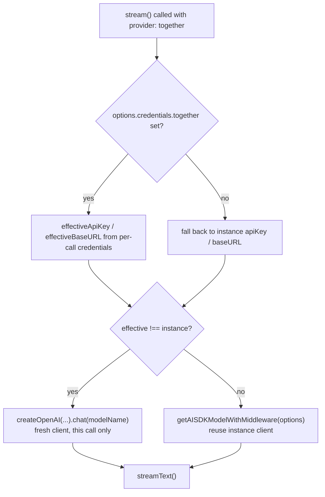

A teammate wires `--provider together --model deepseek-ai/DeepSeek-R1` into a reasoning workload, watches real completions stream back, and assumes Together AI needed a purpose-built client to make that work. It didn't need one. Together's chat API speaks the exact same request/response protocol OpenAI's does, and NeuroLink's `TogetherAIProvider` is built on that fact end to end — one `createOpenAI` call pointed at `api.together.xyz` instead of `api.openai.com`, wrapped in the same `BaseProvider` machinery every other text provider in this codebase uses.

This post walks through `src/lib/providers/togetherAi.ts`, its registration in `src/lib/factories/providerRegistry.ts`, its pricing entries in `src/lib/utils/pricing.ts`, and its (missing) entry in `src/lib/adapters/providerImageAdapter.ts` — all shipped in the same commit that added ten new chat providers and four new media modalities to NeuroLink in a single pass.

## Same protocol, different catalog

Together AI doesn't run its own model — it runs a hosted gateway in front of open-weight models from several labs: Llama, Mixtral, Qwen, DeepSeek. What it exposes to callers is a standard OpenAI-compatible `/v1/chat/completions` endpoint, and NeuroLink's provider takes that literally, the same way it does for xAI, Groq, Cohere, Fireworks AI, and every other OpenAI-shaped integration added in this commit. The entire client setup is a handful of lines:

```typescript
const together = createOpenAI({
  apiKey: this.apiKey,
  baseURL: this.baseURL,
  fetch: createLoggingFetch("together-ai"),
});
this.model = together.chat(this.modelName);
```

`this.baseURL` defaults to a module constant:

```typescript
const TOGETHER_DEFAULT_BASE_URL = "https://api.together.xyz/v1";
```

Nothing in this constructor negotiates a different auth header, parses a different response envelope, or handles a different streaming wire format. `createOpenAI` already knows how to talk to any `/v1/chat/completions`-shaped API; reaching Together's catalog is a matter of pointing that same factory somewhere other than `api.openai.com`. The class-level doc comment says as much directly:

```text
Together AI Provider
Hosted open-model gateway at api.together.xyz/v1 (OpenAI-compatible).
Llama / Mistral / Qwen / DeepSeek / Gemma / WizardLM available
server-less; pass any catalog id via `--model`.
```

`createLoggingFetch("together-ai")` is the same shared fetch wrapper every OpenAI-compatible provider in this commit opts into — it masks the request URL in logs and stack traces on non-2xx responses, so a failed call doesn't leak whatever the upstream carries in the URL. It's one line here because it's a shared utility, not because Together needed something lighter than what xAI or Groq get.

## The provider class: two different resolution orders

`TogetherAIProvider` extends `BaseProvider`, and its constructor signature matches the shape every provider in this commit uses — model name, an optional NeuroLink SDK handle, an unused region slot, and per-call credentials:

```typescript
constructor(
  modelName?: string,
  sdk?: unknown,
  _region?: string,
  credentials?: NeurolinkCredentials["together"],
) {
  const validatedNeurolink = isNeuroLink(sdk) ? sdk : undefined;
  super(modelName, "together-ai" as AIProviderName, validatedNeurolink);

  const overrideApiKey = credentials?.apiKey?.trim();
  this.apiKey =
    overrideApiKey && overrideApiKey.length > 0
      ? overrideApiKey
      : getTogetherApiKey();
  this.baseURL =
    credentials?.baseURL ??
    process.env.TOGETHER_BASE_URL ??
    TOGETHER_DEFAULT_BASE_URL;
  ...
}
```

The API key resolution has one fallback tier: a non-empty, trimmed `credentials.apiKey` wins, otherwise it falls through to `getTogetherApiKey()`, which is `validateApiKey(createTogetherAIConfig())` reading `TOGETHER_API_KEY` from the environment. The base URL resolution has two: `credentials.baseURL`, then `process.env.TOGETHER_BASE_URL`, then the hardcoded default — the knob that exists specifically so a deployment can front `api.together.xyz` with an internal gateway without touching code, only environment.

`createTogetherAIConfig()` is the same declarative shape every provider in this commit defines, and it does double duty — it's both the source `getTogetherApiKey()` reads from and the text a CLI setup command prints when the key is missing:

```typescript
export function createTogetherAIConfig(): ProviderConfigOptions {
  return {
    providerName: "Together AI",
    envVarName: "TOGETHER_API_KEY",
    setupUrl: "https://api.together.xyz/settings/api-keys",
    description: "API key",
    instructions: [
      "1. Visit: https://api.together.xyz/settings/api-keys",
      "2. Sign in to your Together AI account",
      "3. Create a new API key",
      "4. Set TOGETHER_API_KEY in your .env file",
    ],
  };
}
```

`validateApiKey` throws an `AuthenticationError`-shaped failure built from exactly this config when `TOGETHER_API_KEY` is absent — so a missing key fails at construction time with the setup URL attached, not with a bare 401 three network calls later.

## Streaming: a client rebuilt only when credentials actually diverge

`executeStreamInner` does something the xAI provider's excerpt doesn't need to show, because Together's stream path has an extra branch: it checks whether the per-call credentials actually differ from the instance-level ones before deciding whether to build a fresh client.

```typescript
const perCallCreds = options.credentials?.together;
const effectiveApiKey = perCallCreds?.apiKey?.trim() || this.apiKey;
const effectiveBaseURL = perCallCreds?.baseURL || this.baseURL;

// When per-call credentials differ from instance, build a fresh client.
const hasDifferentCreds =
  effectiveApiKey !== this.apiKey || effectiveBaseURL !== this.baseURL;
const model = hasDifferentCreds
  ? createOpenAI({
      apiKey: effectiveApiKey,
      baseURL: effectiveBaseURL,
      fetch: createLoggingFetch("together-ai"),
    }).chat(this.modelName)
  : await this.getAISDKModelWithMiddleware(options);
```

If nothing about the credentials changed for this call, the provider reuses `getAISDKModelWithMiddleware(options)` — whatever middleware chain the instance already has wired up. If a caller passes different `credentials.together.apiKey` or `credentials.together.baseURL` for just this one request, the provider constructs a throwaway `createOpenAI` client scoped to that call instead of mutating `this.model`, so a multi-tenant caller can route one request through a different Together account without any risk of that override leaking into the next call on the same provider instance.



The rest of `executeStreamInner` is the generic shape every text provider in this commit shares: `streamText` configured with `temperature`, `maxOutputTokens`, `tools`, `stopWhen: stepCountIs(options.maxSteps || DEFAULT_MAX_STEPS)`, `toolChoice: resolveToolChoice(...)`, a composed `abortSignal`, and an `onStepFinish` callback that emits tool-end events through `emitToolEndFromStepFinish` and persists tool executions via `handleToolExecutionStorage`. Nothing in that block references Together by name except the request-id prefix (`together-stream-${Date.now()}`) and the log tag inside `createLoggingFetch`.

`executeStream` itself doesn't build its own telemetry wrapping — it calls `withClientStreamSpan` with Together-specific attributes and lets the shared helper own the span lifecycle:

```typescript
protected async executeStream(
  options: StreamOptions,
  _analysisSchema?: ValidationSchema,
): Promise<StreamResult> {
  return withClientStreamSpan(
    {
      name: "neurolink.provider.stream",
      tracer: tracers.provider,
      attributes: {
        [ATTR.GEN_AI_SYSTEM]: "together-ai",
        [ATTR.GEN_AI_MODEL]: this.modelName,
        [ATTR.GEN_AI_OPERATION]: "stream",
        [ATTR.NL_STREAM_MODE]: true,
      },
    },
    async () => this.executeStreamInner(options),
    (r) => r.stream,
    (r, wrapped) => ({ ...r, stream: wrapped }),
  );
}
```

This is one of the cross-cutting fixes bundled into the same commit that added Together AI: `baseProvider.stream()` was changed to wrap its body in a `neurolink.provider.stream` OTel span via `context.with()` and a `try/finally`, so stream-side spans get the same shape generate-side spans already had. Together didn't need a special case for that — it inherits the fix by being written against the current `BaseProvider` contract.

## Two names, two separate alias systems

The provider registers under `AIProviderName.TOGETHER_AI` but is reachable by two strings, because the factory registration declares both directly:

```typescript
ProviderFactory.registerProvider(
  AIProviderName.TOGETHER_AI,
  async (
    modelName?: string,
    _providerName?: string,
    sdk?: UnknownRecord,
    _region?: string,
    credentials?: UnknownRecord,
  ) => {
    const togetherCreds = credentials as NeurolinkCredentials["together"];
    const { TogetherAIProvider } = await import("../providers/togetherAi.js");
    return new TogetherAIProvider(
      modelName,
      sdk as unknown as NeuroLink | undefined,
      undefined,
      togetherCreds,
    );
  },
  process.env.TOGETHER_MODEL || TogetherAIModels.LLAMA_3_3_70B_INSTRUCT_TURBO,
  ["together-ai", "together"],
);
```

`--provider together` and `--provider together-ai` construct the identical `TogetherAIProvider` instance — there's no separate class for the short form. The dynamic `import("../providers/togetherAi.js")` inside the factory closure means the provider module isn't loaded until something actually asks for one of those two strings; with ten new chat providers and four new modality categories landing in one commit, that keeps requiring Together from pulling in code for the other nine.

Separately, `src/lib/utils/pricing.ts` also defines a flat `PROVIDER_ALIASES` lookup table — private to that module, read only by its own `findRates()` — with its own two entries for this provider:

```typescript
const PROVIDER_ALIASES: Record<string, string> = {
  // ...
  togetherai: "together-ai",
  together: "together-ai",
  // ...
};
```

These aren't actually two independent systems that happen to agree — there's really only one: `ProviderFactory`'s registration array decides what `--provider` resolves to a constructor. `PROVIDER_ALIASES` is a private table scoped to `pricing.ts`, read only inside that module's own `findRates()`; it isn't consulted by context-window lookups or any other utility outside pricing. The CLI's own bash-completion list in `commandFactory.ts` spells out `together-ai` and `together` explicitly too, alongside the other providers' names and many of their aliases, so tab-completion offers both.

## The open-weight catalog, priced per model

`TogetherAIModels` is a ten-entry enum spanning four model families — Llama, Mixtral, Qwen, and DeepSeek — reflecting what Together actually hosts serverlessly rather than anything NeuroLink invents:

```typescript
export enum TogetherAIModels {
  LLAMA_3_3_70B_INSTRUCT_TURBO = "meta-llama/Llama-3.3-70B-Instruct-Turbo",
  LLAMA_3_1_405B_INSTRUCT_TURBO = "meta-llama/Meta-Llama-3.1-405B-Instruct-Turbo",
  LLAMA_3_1_70B_INSTRUCT_TURBO = "meta-llama/Meta-Llama-3.1-70B-Instruct-Turbo",
  LLAMA_3_1_8B_INSTRUCT_TURBO = "meta-llama/Meta-Llama-3.1-8B-Instruct-Turbo",
  MIXTRAL_8X22B_INSTRUCT = "mistralai/Mixtral-8x22B-Instruct-v0.1",
  MIXTRAL_8X7B_INSTRUCT = "mistralai/Mixtral-8x7B-Instruct-v0.1",
  QWEN_2_5_72B_INSTRUCT_TURBO = "Qwen/Qwen2.5-72B-Instruct-Turbo",
  QWEN_2_5_CODER_32B = "Qwen/Qwen2.5-Coder-32B-Instruct",
  DEEPSEEK_R1 = "deepseek-ai/DeepSeek-R1",
  DEEPSEEK_V3 = "deepseek-ai/DeepSeek-V3",
}
```

`getDefaultTogetherModel()` resolves the default the same way most providers in this commit do:

```typescript
const getDefaultTogetherModel = (): string =>
  getProviderModel("TOGETHER_MODEL", TogetherAIModels.LLAMA_3_3_70B_INSTRUCT_TURBO);
```

`src/lib/utils/pricing.ts` gives nine of those ten entries their own per-token rate, plus a `_default` fallback that also happens to equal the 70B Turbo rate:

| Model ID | Input / output per 1M tokens | Notes |
| --- | --- | --- |
| `_default` | $0.88 / $0.88 | used for any Together model id without its own row |
| `meta-llama/Llama-3.3-70B-Instruct-Turbo` | $0.88 / $0.88 | the registered default model |
| `meta-llama/Meta-Llama-3.1-405B-Instruct-Turbo` | $3.50 / $3.50 | flagship size |
| `meta-llama/Meta-Llama-3.1-70B-Instruct-Turbo` | $0.88 / $0.88 | same rate as the 3.3 default |
| `meta-llama/Meta-Llama-3.1-8B-Instruct-Turbo` | $0.18 / $0.18 | cheapest entry |
| `mistralai/Mixtral-8x22B-Instruct-v0.1` | $1.20 / $1.20 | |
| `mistralai/Mixtral-8x7B-Instruct-v0.1` | $0.60 / $0.60 | |
| `Qwen/Qwen2.5-72B-Instruct-Turbo` | $1.20 / $1.20 | |
| `deepseek-ai/DeepSeek-R1` | $7.00 / $7.00 | most expensive entry — reasoning model |
| `deepseek-ai/DeepSeek-V3` | $1.25 / $1.25 | |

`Qwen/Qwen2.5-Coder-32B-Instruct` — `QWEN_2_5_CODER_32B` in the enum — has no row of its own in that table. Selecting it doesn't fail; NeuroLink's cost-estimation code falls through to the `_default` rate for any model id it doesn't recognize, which for Together AI happens to be the same $0.88 rate as the flagship default. It's worth knowing if you're relying on per-model cost tracking for that specific model: the number you'll see is the default rate, not a Qwen-Coder-specific one, because none was ever entered.

The model-selection list surfaced elsewhere in the SDK (model-discovery / `--help`-style prompts) picks five of the ten as the ones worth recommending:

```typescript
[AIProviderName.TOGETHER_AI]: [
  { model: TogetherAIModels.LLAMA_3_3_70B_INSTRUCT_TURBO, description: "Recommended - Llama 3.3 70B Turbo" },
  { model: TogetherAIModels.LLAMA_3_1_405B_INSTRUCT_TURBO, description: "Flagship 405B" },
  { model: TogetherAIModels.QWEN_2_5_72B_INSTRUCT_TURBO, description: "Qwen 2.5 72B Turbo" },
  { model: TogetherAIModels.DEEPSEEK_R1, description: "DeepSeek R1 reasoning" },
  { model: TogetherAIModels.MIXTRAL_8X22B_INSTRUCT, description: "Mistral 8x22B MoE" },
],
```

Any of the other five enum values — including the two 8B/70B mid-tier Llamas, both Mixtral entries not listed here, or the Qwen coder model — still work as `--model` arguments; they simply aren't surfaced in that particular recommendation list.

## Error handling: five buckets, Together-specific messages

`formatProviderError` is where Together-specific behavior shows up most directly, because it's the one method that has to translate whatever `@ai-sdk/openai` surfaces from `api.together.xyz` into NeuroLink's own error types:

```typescript
protected formatProviderError(error: unknown): Error {
  if (error instanceof TimeoutError) {
    return new NetworkError(`Request timed out: ${error.message}`, "together-ai");
  }
  const errorRecord = error as UnknownRecord;
  const message =
    typeof errorRecord?.message === "string" ? errorRecord.message : "Unknown error";
  if (
    message.includes("Invalid API key") ||
    message.includes("Authentication") ||
    message.includes("401")
  ) {
    return new AuthenticationError(
      "Invalid Together AI API key. Get one at https://api.together.xyz/settings/api-keys",
      "together-ai",
    );
  }
  if (message.includes("rate limit") || message.includes("429")) {
    return new RateLimitError("Together AI rate limit exceeded. Back off and retry.", "together-ai");
  }
  if (message.includes("model_not_found") || message.includes("404")) {
    return new InvalidModelError(
      `Together AI model '${this.modelName}' not found. Browse the catalog at https://api.together.xyz/models`,
      "together-ai",
    );
  }
  return new ProviderError(`Together AI error: ${message}`, "together-ai");
}
```

Four outcomes after the `instanceof TimeoutError` check, each keyed on a message substring rather than a stable error code: authentication, rate limiting, model-not-found, and a catch-all. That's one fewer branch than xAI's five (Together's version has no dedicated quota/insufficient-credit bucket — an insufficient-credit response from Together falls through to the generic `ProviderError` branch instead of getting its own message). The model-not-found branch is the most immediately actionable of the three specific ones: instead of a bare 404, the caller gets a link straight to Together's model catalog to find a valid id.

## The vision quirk: what the docs promise and what the router allows

The getting-started guide shipped in this same commit, `docs/getting-started/providers/together-ai.md`, lists this in its Key Facts table:

```text
Vision: Yes — Llama 3.2 Vision variants
```

But `src/lib/adapters/providerImageAdapter.ts`, shipped in the identical commit, defines a `VISION_CAPABILITIES` map that every provider's multimodal routing goes through, and Together's own entry in it is empty:

```typescript
// Together AI: text-only by default; add vision variants if/when used.
"together-ai": [] as readonly string[],
```

That comment is doing real work elsewhere in the same file. `ProviderImageAdapter.supportsVision()` has an explicit guard for exactly this case:

```typescript
// An empty list means the provider has NO vision support (e.g. deepseek).
// Without this guard, the no-model branch below would return `true` for
// every provider that has an entry in VISION_CAPABILITIES — even an empty
// one — letting vision requests through to a text-only API.
if (supportedModels.length === 0) {
  return false;
}
```

And `messageBuilder.ts` is unambiguous about what happens when `supportsVision()` comes back `false`:

```typescript
// Validate provider supports vision
if (!ProviderImageAdapter.supportsVision(provider, model)) {
  throw new Error(
    `Provider ${provider} with model ${model} does not support vision processing. ` +
      `Supported providers: ${ProviderImageAdapter.getVisionProviders().join(", ")}`,
  );
}
```

Put together, that means a call like `ai.generate({ provider: "together", input: { text: "...", images: [buffer] } })` never reaches `api.together.xyz` at all — it throws inside NeuroLink's own message-building step, before any HTTP request is constructed, and the error message lists every provider that *is* registered as vision-capable instead. The getting-started doc's "Vision: Yes" line describes what Together the company offers on its own platform; the code shipped in the same commit doesn't wire that capability into NeuroLink's routing. If your integration needs to send images through a Together model, this commit doesn't support that path regardless of which Llama 3.2 Vision model id you pass — the block happens before the model id is even inspected.

## Using it

Installing and calling Together AI through NeuroLink looks like every other text provider:

```bash
npm install @juspay/neurolink
```

```typescript
import { NeuroLink } from "@juspay/neurolink";

const ai = new NeuroLink();
const result = await ai.generate({
  provider: "together",
  input: { text: "Write a haiku about RAG pipelines." },
});
console.log(result.content);
```

Picking a specific model from the catalog instead of the default:

```typescript
const result = await ai.generate({
  provider: "together",
  model: "deepseek-ai/DeepSeek-R1",
  input: { text: "Walk through this proof step by step." },
});
```

Per-call credential override, using the resolution order covered above — this is also what triggers the "fresh client, this call only" branch in `executeStreamInner`:

```typescript
const result = await ai.generate({
  provider: "together",
  input: { text: "Hello" },
  credentials: {
    together: { apiKey: "tgp_user-specific-key" },
  },
});
```

From the CLI, either alias works identically:

```bash
pnpm run cli generate "Explain MoE routing" --provider together
pnpm run cli generate "..." --provider together --model deepseek-ai/DeepSeek-R1
neurolink generate "Summarize this changelog" --provider together-ai
```

Environment configuration is three variables, two of them optional:

```bash
# Required
TOGETHER_API_KEY=tgp_your-key

# Optional: override the default model (default: meta-llama/Llama-3.3-70B-Instruct-Turbo)
TOGETHER_MODEL=meta-llama/Llama-3.3-70B-Instruct-Turbo

# Optional: override the base URL (default: https://api.together.xyz/v1)
# TOGETHER_BASE_URL=https://api.together.xyz/v1
```

## Where this fits

Together AI shipped in the same commit as nine other chat providers — xAI Grok, Groq, Cohere, Fireworks AI, Perplexity, Cloudflare Workers AI, Voyage AI, Jina AI, and Replicate's chat path — and four new media modality categories (image generation, video generation, avatar/lip-sync, and music generation), all wired through the same Factory + Registry pattern this provider uses. Reading `togetherAi.ts` on its own is a reasonable way to see what "add an OpenAI-compatible provider" costs when the upstream API needs no protocol work: a base URL, a two-tier apiKey/baseURL resolution order, a per-call credential-diff check before rebuilding the client, a four-branch error-message translation table, and a two-name alias registration. The parts that don't come for free from `BaseProvider` or `createOpenAI` — the per-model pricing table, the ten-model catalog, and the vision-capability gap between what the docs claim and what `providerImageAdapter.ts` actually allows — are exactly the parts that are facts about Together's catalog and NeuroLink's own routing code, not about the shared plumbing.

---

**Related posts:**

- [OpenAI-Compatible Endpoints: Connect Any API to NeuroLink](/posts/openai-compatible-endpoints/)
- [Generating talking avatars with NeuroLink](/posts/generating-talking-avatars-with-neurolink/)
- [NeuroLink can now generate music: how it works](/posts/neurolink-can-now-generate-music-how-it-works/)
