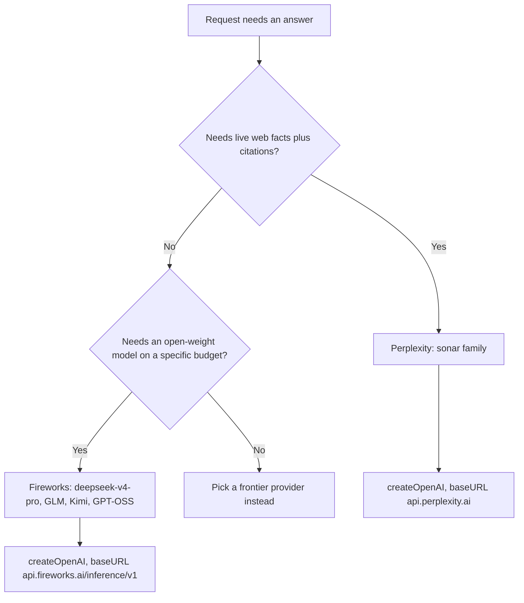

Fireworks AI and Perplexity solve different problems — one rents you a GPU running someone else's open-weight model, the other rents you a search engine that talks back and cites its sources — but they shipped in the same commit, minutes apart, as two of twelve new chat providers. That commit is `00f88f671`, "feat(providers): add 12 new providers + new modalities (avatar/music/video) + image-gen", dated 2026-05-16, and inside it the two provider classes sit a few hundred lines apart in the same `registerProvider()` block. Their code is close enough in shape that diffing them side by side is more informative than reading either alone: both wrap `createOpenAI()` from the Vercel AI SDK, both extend the same `BaseProvider`, and both were written from what is obviously the same internal checklist. This is an honest look at where that code is genuinely identical, where it diverges by exactly one design decision, and where a code comment says one thing while the shared fallback behavior says another.

## Two providers, one commit

`00f88f671` is not a small commit. It touches 166 files and adds twelve new chat/LLM providers in one pass — xAI Grok, Groq, Cohere, Together AI, Fireworks AI, Perplexity, Cloudflare Workers AI, Voyage AI, Jina AI, and Replicate's LLM path — alongside four brand-new modality categories (image generation, video generation, avatar/lip-sync, music generation). Fireworks and Perplexity are two names in that list of twelve, but they're a useful pair to isolate because `git show 00f88f671 --diff-filter=A` confirms both `src/lib/providers/fireworks.ts` (267 new lines) and `src/lib/providers/perplexity.ts` (288 new lines) were created for the first time in this exact commit — no history before it, no follow-up rewrite after it that this post is describing instead.

The commit message itself groups them once, in the "INTEGRATION FIXES UNCOVERED BY E2E SMOKE" section: "Cohere / Fireworks: default models bumped to current shipping IDs (command-r-plus retired Sept 2025 → command-a-03-2025; llama-v3p1-70b rotated out → deepseek-v4-pro)." That line is doing more work than it looks like — it's the reason Fireworks' shipped default and its own documentation disagree, which the later sections cover in detail.

## What "OpenAI-compatible" buys both of them

Neither Fireworks nor Perplexity gets a hand-written HTTP client. Both providers construct a client with the exact same call shape:

```typescript
// fireworks.ts
const fireworks = createOpenAI({
  apiKey: this.apiKey,
  baseURL: this.baseURL,
  fetch: createLoggingFetch("fireworks"),
});
this.model = fireworks.chat(this.modelName);
```

```typescript
// perplexity.ts
const perplexity = createOpenAI({
  apiKey: this.apiKey,
  baseURL: this.baseURL,
  fetch: createLoggingFetch("perplexity"),
});
this.model = perplexity.chat(this.modelName);
```

This is the same `createOpenAI` from `@ai-sdk/openai` that NeuroLink's actual OpenAI provider uses, pointed at a different `baseURL`. Fireworks' default base URL is `https://api.fireworks.ai/inference/v1`; Perplexity's is `https://api.perplexity.ai`. Both APIs speak the OpenAI chat-completions wire format closely enough that the Vercel AI SDK's OpenAI client can talk to them directly — no custom request/response mapping, no bespoke SDK. That single design decision is why the two provider files read almost like templates of each other for their first hundred lines.

## Where the constructors are identical

Strip out the provider-specific names and the two constructors are the same four steps, in the same order: resolve an override API key from per-request credentials, fall back to an env-var-backed default, resolve a base URL the same way, then build the `createOpenAI` client and log initialization.

```typescript
constructor(
  modelName?: string,
  sdk?: unknown,
  _region?: string,
  credentials?: NeurolinkCredentials["fireworks"],
) {
  const validatedNeurolink = isNeuroLink(sdk) ? sdk : undefined;
  super(modelName, "fireworks" as AIProviderName, validatedNeurolink);

  const overrideApiKey = credentials?.apiKey?.trim();
  this.apiKey =
    overrideApiKey && overrideApiKey.length > 0
      ? overrideApiKey
      : getFireworksApiKey();
  this.baseURL =
    credentials?.baseURL ??
    process.env.FIREWORKS_BASE_URL ??
    FIREWORKS_DEFAULT_BASE_URL;
  // ... createOpenAI(...) as shown above
}
```

Perplexity's constructor is the same code with `fireworks` replaced by `perplexity` throughout — `NeurolinkCredentials["perplexity"]`, `PERPLEXITY_BASE_URL`, `PERPLEXITY_DEFAULT_BASE_URL`. Both `NeurolinkCredentials["fireworks"]` and `NeurolinkCredentials["perplexity"]` are declared in `src/lib/types/providers.ts` as the identical shape: `{ apiKey?: string; baseURL?: string }`. Neither provider gets a richer credentials type than the other.

Both also route their setup config through the same `providerConfig.ts` factory pattern:

```typescript
export function createFireworksConfig(): ProviderConfigOptions {
  return {
    providerName: "Fireworks AI",
    envVarName: "FIREWORKS_API_KEY",
    setupUrl: "https://fireworks.ai/account/api-keys",
    description: "API key",
    instructions: [
      "1. Visit: https://fireworks.ai/account/api-keys",
      "2. Sign in to your Fireworks AI account",
      "3. Create a new API key",
      "4. Set FIREWORKS_API_KEY in your .env file",
    ],
  };
}
```

`createPerplexityConfig()` is the same four-field object shape with Perplexity's own URL and env var name. This is not two providers hand-built to resemble each other — it's the same `ProviderConfigOptions` contract every provider in this commit fills in, which is exactly why the interesting differences below stand out as deliberate rather than incidental.

## Fireworks: renting open-weight inference

Fireworks AI hosts open-weight models — Fireworks doesn't train its own frontier model, it serves other people's weights at low latency. The `FireworksModels` enum this commit adds has six entries:

```typescript
export enum FireworksModels {
  /** DeepSeek V4 Pro — current general-purpose default */
  DEEPSEEK_V4_PRO = "accounts/fireworks/models/deepseek-v4-pro",
  /** GLM 5.1 — Zhipu flagship */
  GLM_5P1 = "accounts/fireworks/models/glm-5p1",
  /** GLM 5 — broader coverage */
  GLM_5 = "accounts/fireworks/models/glm-5",
  /** Kimi K2.6 — Moonshot flagship */
  KIMI_K2P6 = "accounts/fireworks/models/kimi-k2p6",
  /** Kimi K2.5 — preceding Kimi */
  KIMI_K2P5 = "accounts/fireworks/models/kimi-k2p5",
  /** GPT-OSS 120B — Apache-2.0 OpenAI weights */
  GPT_OSS_120B = "accounts/fireworks/models/gpt-oss-120b",
}
```

`getDefaultFireworksModel()` reads `getProviderModel("FIREWORKS_MODEL", FireworksModels.DEEPSEEK_V4_PRO)` — so out of the box, no `FIREWORKS_MODEL` env var set, a Fireworks call goes to `accounts/fireworks/models/deepseek-v4-pro`. `modelChoices.ts`'s `TOP_MODELS_CONFIG` recommends the same model first ("Recommended - DeepSeek V4 Pro"), followed by GLM 5.1, Kimi K2.6, and GPT-OSS 120B as the other three surfaced choices — GLM_5 and KIMI_K2P5 exist in the enum but aren't in the curated top-four list.

## Perplexity: renting a search engine that talks back

Perplexity doesn't host open weights at all — its whole product is Sonar, a family of models built specifically to pair generation with live web retrieval and return citations alongside the answer. `PerplexityModels` has five entries:

```typescript
export enum PerplexityModels {
  /** Sonar — production default with web search */
  SONAR = "sonar",
  /** Sonar Pro — better reasoning + larger context */
  SONAR_PRO = "sonar-pro",
  /** Sonar Reasoning — explicit reasoning traces */
  SONAR_REASONING = "sonar-reasoning",
  /** Sonar Reasoning Pro — flagship reasoning + web */
  SONAR_REASONING_PRO = "sonar-reasoning-pro",
  /** Sonar Deep Research — long-form research with citations */
  SONAR_DEEP_RESEARCH = "sonar-deep-research",
}
```

`getDefaultPerplexityModel()` resolves to `PerplexityModels.SONAR` — plain `sonar` — and `TOP_MODELS_CONFIG` surfaces all five as recommended choices, unlike Fireworks' curated four-of-six. The `docs/getting-started/providers/perplexity.md` guide this commit adds spells out the trade: "Citations: Returned via `citations` field on the response" and, in its feature-support table, "Tool calling: No." That last line matters, because the code doesn't actually enforce it — see the next section.

## Tool calling: the comment versus the fallback

Both `executeStreamInner` methods compute whether to attach tools the same way:

```typescript
const shouldUseTools = !options.disableTools && this.supportsTools();
const tools = shouldUseTools
  ? (options.tools as Record<string, Tool>) || (await this.getAllTools())
  : {};
```

Identical line, identical logic, in both files. Perplexity's version carries a comment directly above it that neither Fireworks' nor any other provider in this commit has:

```typescript
// Perplexity Sonar's tool support is limited; default to disabled when
// not explicitly requested by the caller. The web-grounding signal is
// baked into the model itself, not exposed as tool calls.
const shouldUseTools = !options.disableTools && this.supportsTools();
```

Reading that comment in isolation, you'd expect Perplexity to behave differently from Fireworks at runtime — tools off unless the caller opts in. But neither `FireworksProvider` nor `PerplexityProvider` overrides `supportsTools()`, and at this commit `BaseProvider.supportsTools()` doesn't hardcode a per-provider answer, a capability lookup, or any provider-specific logic at all — it's a flat default every provider inherits unless it overrides the method:

```typescript
supportsTools(): boolean {
  return true;
}
```

That's the entire implementation as of `00f88f671` — there's no `modelRegistry.ts` capability lookup backing it. The practical result: `shouldUseTools` evaluates to `true` for both providers unless the caller explicitly passes `disableTools`, simply because `supportsTools()` returns `true` unconditionally — not because of any registry lookup. The comment states an intent the surrounding code doesn't enforce — Sonar's actual tool-calling behavior is whatever `api.perplexity.ai` does when it receives a `tools` array it may or may not honor, not something NeuroLink gates client-side.

## The one place the two classes actually diverge

There is exactly one behavioral difference between the two `executeStreamInner` implementations, and it's not about tools. Perplexity's method opens with logic Fireworks' doesn't have at all:

```typescript
// perplexity.ts only
const perCallCreds = options.credentials?.perplexity;
const effectiveApiKey = perCallCreds?.apiKey?.trim() || this.apiKey;
const effectiveBaseURL = perCallCreds?.baseURL || this.baseURL;
// ...
const hasDifferentCreds =
  effectiveApiKey !== this.apiKey || effectiveBaseURL !== this.baseURL;
const model = hasDifferentCreds
  ? createOpenAI({
      apiKey: effectiveApiKey,
      baseURL: effectiveBaseURL,
      fetch: createLoggingFetch("perplexity"),
    }).chat(this.modelName)
  : await this.getAISDKModelWithMiddleware(options);
```

Fireworks' `executeStreamInner` calls `await this.getAISDKModelWithMiddleware(options)` unconditionally and never reads `options.credentials?.fireworks` inside the stream path at all — its per-request credential override, if any, only takes effect through the constructor at provider-instantiation time. Perplexity re-checks per-call credentials on every streamed request and builds a fresh `createOpenAI` client when they differ from the instance's. Both providers declare the same `{ apiKey?, baseURL? }` credentials shape in `NeurolinkCredentials`, and both accept a `credentials` parameter in their constructor — but only Perplexity's code path actually re-resolves that override at call time inside `executeStreamInner`. If you're passing per-request Perplexity credentials (say, a multi-tenant app routing different customers' API keys through one NeuroLink instance), that path is honored per call. The equivalent pattern for Fireworks isn't wired into its stream method the same way.

## Cost, per million tokens

Pricing for both lives in `src/lib/utils/pricing.ts`, added in this same commit:

```typescript
fireworks: {
  _default: { input: 0.9 / 1_000_000, output: 0.9 / 1_000_000 },
  "accounts/fireworks/models/llama-v3p1-70b-instruct": { input: 0.9 / 1_000_000, output: 0.9 / 1_000_000 },
  "accounts/fireworks/models/llama-v3p1-405b-instruct": { input: 3.0 / 1_000_000, output: 3.0 / 1_000_000 },
  "accounts/fireworks/models/llama-v3p1-8b-instruct": { input: 0.2 / 1_000_000, output: 0.2 / 1_000_000 },
  "accounts/fireworks/models/llama-v3p3-70b-instruct": { input: 0.9 / 1_000_000, output: 0.9 / 1_000_000 },
  "accounts/fireworks/models/mixtral-8x22b-instruct": { input: 1.2 / 1_000_000, output: 1.2 / 1_000_000 },
  "accounts/fireworks/models/qwen2p5-72b-instruct": { input: 0.9 / 1_000_000, output: 0.9 / 1_000_000 },
  "accounts/fireworks/models/qwen2p5-coder-32b-instruct": { input: 0.9 / 1_000_000, output: 0.9 / 1_000_000 },
  "accounts/fireworks/models/deepseek-v3": { input: 0.75 / 1_000_000, output: 3.0 / 1_000_000 },
},
perplexity: {
  _default: { input: 1.0 / 1_000_000, output: 1.0 / 1_000_000 },
  sonar: { input: 1.0 / 1_000_000, output: 1.0 / 1_000_000 },
  "sonar-pro": { input: 3.0 / 1_000_000, output: 15.0 / 1_000_000 },
  "sonar-reasoning": { input: 1.0 / 1_000_000, output: 5.0 / 1_000_000 },
  "sonar-reasoning-pro": { input: 2.0 / 1_000_000, output: 8.0 / 1_000_000 },
  "sonar-deep-research": { input: 2.0 / 1_000_000, output: 8.0 / 1_000_000 },
},
```

As a table, in dollars per million tokens:

| Model | Input | Output |
| --- | --- | --- |
| Fireworks `_default` | $0.90 | $0.90 |
| Fireworks `llama-v3p1-405b-instruct` | $3.00 | $3.00 |
| Fireworks `deepseek-v3` | $0.75 | $3.00 |
| Perplexity `sonar` (default) | $1.00 | $1.00 |
| Perplexity `sonar-pro` | $3.00 | $15.00 |
| Perplexity `sonar-reasoning` | $1.00 | $5.00 |
| Perplexity `sonar-reasoning-pro` | $2.00 | $8.00 |
| Perplexity `sonar-deep-research` | $2.00 | $8.00 |

Two things worth noticing. First, Perplexity's output pricing scales up sharply with capability — `sonar-pro`'s $15/M output is five times its own input rate and fifteen times the default `sonar` output rate, which makes sense once you factor in that Sonar Pro's answers include the retrieval and citation work, not just token generation. Fireworks' pricing, by contrast, is flat input-equals-output for every model except `deepseek-v3`. Second — and this is the discrepancy the commit message hints at — **there is no `pricing.ts` entry keyed `"accounts/fireworks/models/deepseek-v4-pro"`**, even though that's the actual model `getDefaultFireworksModel()` resolves to. Every entry in the `fireworks` pricing map is an older-generation Llama/Mixtral/Qwen/DeepSeek-V3 model ID, not one of the four models `FireworksModels` actually exports as recommended (`DEEPSEEK_V4_PRO`, `GLM_5P1`, `KIMI_K2P6`, `GPT_OSS_120B`). A cost calculation against the shipped default falls through to `_default` — $0.90/$0.90 per million — which happens to match the old `llama-v3p1-70b-instruct` rate, but is not a rate anyone set specifically for `deepseek-v4-pro`, GLM, Kimi, or GPT-OSS.

## Context windows

`src/lib/constants/contextWindows.ts`, same commit:

| Model | Context window |
| --- | --- |
| Fireworks `_default` | 128,000 |
| Fireworks `llama-v3p1-70b-instruct` | 131,072 |
| Fireworks `mixtral-8x22b-instruct` | 65,536 |
| Fireworks `qwen2p5-72b-instruct` | 32,768 |
| Perplexity `_default` / `sonar` | 127,000 |
| Perplexity `sonar-pro` | 200,000 |
| Perplexity `sonar-reasoning` / `sonar-reasoning-pro` | 127,000 |
| Perplexity `sonar-deep-research` | 200,000 |

The same gap shows up here: no `"accounts/fireworks/models/deepseek-v4-pro"` key in `contextWindows.ts` either, so a caller asking NeuroLink for that model's context budget also falls back to the 128,000-token `_default`. Perplexity's table has no such gap — every one of its five enum values has an explicit context-window entry, `sonar-pro` and `sonar-deep-research` correctly called out at the larger 200,000-token figure the other three don't get.

## Error messages, side by side

Both providers implement `formatProviderError()` with the same four-branch shape — timeout, auth, rate limit, model-not-found — but the model-not-found message reflects what each vendor's catalog actually looks like:

```typescript
// fireworks.ts
if (message.includes("model_not_found") || message.includes("404")) {
  return new InvalidModelError(
    `Fireworks model '${this.modelName}' not found. Browse https://fireworks.ai/models`,
    "fireworks",
  );
}
```

```typescript
// perplexity.ts
if (message.includes("model_not_found") || message.includes("404")) {
  return new InvalidModelError(
    `Perplexity model '${this.modelName}' not found. Use sonar, sonar-pro, sonar-reasoning, sonar-reasoning-pro, or sonar-deep-research.`,
    "perplexity",
  );
}
```

Fireworks points you at a browsable catalog page because its model space is open-ended — anyone can deploy a new model to their Fireworks account, so the SDK can't enumerate valid IDs for you. Perplexity's error lists all five valid model names directly in the message, because Sonar's model space is closed and small enough to just spell out. Same error class, same trigger condition, different remedy because the two providers' model catalogs are shaped completely differently.

## Registration: aliases, defaults, credentials

`src/lib/factories/providerRegistry.ts` registers both through the identical `ProviderFactory.registerProvider()` call shape — provider enum, async factory closure that lazy-imports the provider class, default model expression, alias array:

```typescript
ProviderFactory.registerProvider(
  AIProviderName.FIREWORKS,
  async (modelName, _providerName, sdk, _region, credentials) => {
    const fireworksCreds = credentials as NeurolinkCredentials["fireworks"];
    const { FireworksProvider } = await import("../providers/fireworks.js");
    return new FireworksProvider(modelName, sdk, undefined, fireworksCreds);
  },
  process.env.FIREWORKS_MODEL || FireworksModels.DEEPSEEK_V4_PRO,
  ["fireworks"],
);

ProviderFactory.registerProvider(
  AIProviderName.PERPLEXITY,
  async (modelName, _providerName, sdk, _region, credentials) => {
    const perplexityCreds = credentials as NeurolinkCredentials["perplexity"];
    const { PerplexityProvider } = await import("../providers/perplexity.js");
    return new PerplexityProvider(modelName, sdk, undefined, perplexityCreds);
  },
  process.env.PERPLEXITY_MODEL || PerplexityModels.SONAR,
  ["perplexity", "pplx"],
);
```

The only structural difference: Perplexity gets two CLI aliases (`perplexity`, `pplx`), Fireworks gets one (`fireworks`). Both provider classes are lazy-imported inside the factory closure rather than eagerly at module load — consistent with the pattern every other provider added in this commit follows, so the CLI's startup cost doesn't grow with each new provider that a given invocation never actually calls.

## The stale default `.env.example` and the docs still show

This is the quirk the commit message flags without naming the files it left behind. `.env.example`, updated in this same commit, still reads:

```bash
# Fireworks AI (accounts/fireworks/models/llama-v3p1-70b-instruct, etc.)
FIREWORKS_API_KEY=your-fireworks-api-key
# Optional: FIREWORKS_MODEL=accounts/fireworks/models/llama-v3p1-70b-instruct
# Optional: FIREWORKS_BASE_URL=https://api.fireworks.ai/inference/v1
```

And `docs/getting-started/providers/fireworks.md`, also added in this commit, states under "Key Facts": "**Default model**: `accounts/fireworks/models/llama-v3p3-70b-instruct`". Neither of those matches what `getDefaultFireworksModel()` actually resolves to — `FireworksModels.DEEPSEEK_V4_PRO`, i.e. `accounts/fireworks/models/deepseek-v4-pro` — in the same commit's `enums.ts` and `providerRegistry.ts`. The commit message explains why the enum moved: "llama-v3p1-70b rotated out → deepseek-v4-pro," a model-retirement swap made at code-review time on the same branch. The `.env.example` comment and the markdown doc read like they were written against an earlier draft of the enum, before that swap landed, and weren't updated to match the final default. Perplexity's docs and `.env.example` entry don't have this problem — `PERPLEXITY_MODEL=sonar` matches `PerplexityModels.SONAR` exactly, because Perplexity's default model never moved mid-review the way Fireworks' did.

## Choosing between them



In practice the two rarely compete for the same call. Reach for Perplexity when the answer depends on something that changed since the model's training cutoff and you need the response to cite where it came from — `sonar` for fast search-augmented chat, `sonar-pro` when the query needs a deeper pass and a 200K-token context, `sonar-deep-research` for long-form research work. Reach for Fireworks when you want to run an open-weight model — DeepSeek, GLM, Kimi, GPT-OSS — without operating the GPUs yourself, at a flat, predictable per-token rate that doesn't change with how "hard" the question is. The two configuration reference tables in their respective docs guides make the split explicit: Perplexity's has a "Web search: Yes (native)" and "Citations: Yes" row that Fireworks' table doesn't have at all, because Fireworks isn't retrieving anything — it's just serving weights.

## Trying both

```bash
npm install @juspay/neurolink
```

```typescript
import { NeuroLink } from "@juspay/neurolink";

const neurolink = new NeuroLink();

// Fireworks — open-weight inference, flat per-token pricing
const fireworksResult = await neurolink.generate({
  provider: "fireworks",
  input: { text: "Summarize the trade-offs of Raft vs Paxos." },
});

// Perplexity — web-grounded, with citations
const perplexityResult = await neurolink.generate({
  provider: "perplexity",
  input: { text: "What did the Fed announce this week?" },
});
```

Both need only `FIREWORKS_API_KEY` / `PERPLEXITY_API_KEY` set — `FIREWORKS_API_KEY=fw_...` from [fireworks.ai/account/api-keys](https://fireworks.ai/account/api-keys), `PERPLEXITY_API_KEY=pplx-...` from [perplexity.ai/settings/api](https://www.perplexity.ai/settings/api) — and both fall back to their registry default (`deepseek-v4-pro`, `sonar`) if you don't pass a `model`. The registration code, the constructor shape, and the tool-gating logic are close enough to interchangeable that switching a call from one to the other is a one-line `provider` change. What differs is what's actually on the other end of that `baseURL` — a GPU serving open weights, or a search engine that happens to also generate text.

---

**Related posts:**

- [Rolling out 4 new providers (2 local, 2 cloud) — and the AI SDK bug we hit](/posts/rolling-out-4-new-providers-2-local-2-cloud-and-the-ai-sdk-bug-we-hit/)
- [Provider Comparison Matrix: Choosing the Right AI Provider](/posts/provider-comparison-matrix/)
- [Together AI deep dive](/posts/together-ai-deep-dive/)
