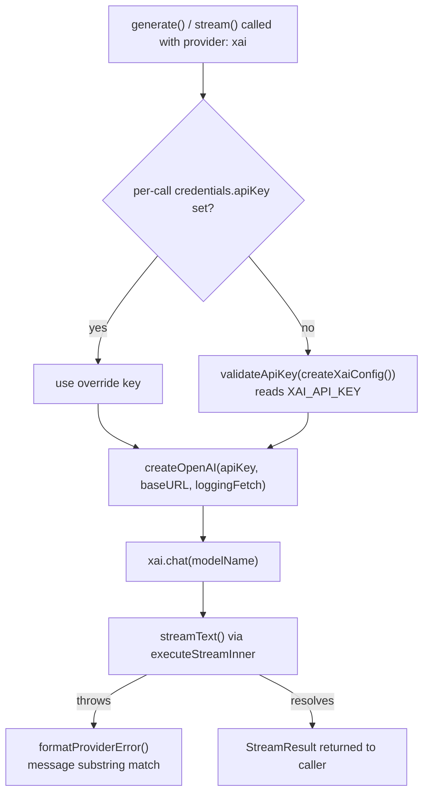

Someone on your team runs `neurolink generate "explain this stack trace" --provider grok` for the first time, gets a real answer back, and assumes xAI shipped a bespoke Grok client somewhere in `node_modules`. It didn't. Grok's chat endpoint speaks the same request/response protocol OpenAI's does, and NeuroLink's xAI integration is built entirely on that fact — one existing SDK, one base URL swap, and the same `BaseProvider` machinery every other text provider already had. The interesting part isn't a new protocol; it's what plumbing twelve providers through one registry in a single commit forces you to get right, and where Grok's own quirks — a vision model with a quarter the context window, no embeddings endpoint at all — still poke through that abstraction.

This post walks through `src/lib/providers/xai.ts`, the provider's registration in `src/lib/factories/providerRegistry.ts`, and the getting-started guide at `docs/getting-started/providers/xai.md` — all three shipped in the same commit that added twelve new chat providers and four new media modalities to NeuroLink in one pass.

## Why xAI needed no protocol work, just plumbing

xAI's own docs describe `api.x.ai/v1` as an OpenAI-compatible chat-completions endpoint, and NeuroLink's provider takes that literally. The whole client setup is four lines, using `@ai-sdk/openai`'s `createOpenAI` — the same factory the SDK's own OpenAI provider uses — pointed somewhere else:

```typescript
const xai = createOpenAI({
  apiKey: this.apiKey,
  baseURL: this.baseURL,
  fetch: createLoggingFetch("xai"),
});
this.model = xai.chat(this.modelName);
```

`this.baseURL` defaults to a module constant:

```typescript
const XAI_DEFAULT_BASE_URL = "https://api.x.ai/v1";
```

Nothing here parses a different response shape, handles a different auth header, or accounts for a different streaming protocol. `createOpenAI` already knows how to talk to any `/v1/chat/completions`-shaped endpoint; xAI's Grok models are reachable simply by telling that factory to look somewhere other than `api.openai.com`. Compare this to a provider like Replicate in the same commit, which has to poll a predictions API and handle its own timeout window — xAI got the two-hundred-line class, not the five-hundred-line one, precisely because it didn't need a bespoke transport.

The one non-obvious piece is `createLoggingFetch("xai")`. It's a fetch wrapper shared across the OpenAI-compatible providers in this commit (the source comment calls out that it "mirrors the deepseek/groq/etc. providers") — its job is to mask the request URL in logs and stack traces on non-2xx responses, so a failed call doesn't leak whatever the upstream is carrying in the URL. It's boilerplate, but it's boilerplate every OpenAI-compatible provider in this codebase opts into rather than reimplementing per provider.

## The provider class: constructor and credential resolution

`XaiProvider` extends `BaseProvider`, and its constructor signature matches the shape every provider in this commit uses — model name, an optional NeuroLink SDK handle for telemetry, an unused region slot (some providers, like Bedrock, need it; xAI doesn't), and per-call credentials:

```typescript
constructor(
  modelName?: string,
  sdk?: unknown,
  _region?: string,
  credentials?: NeurolinkCredentials["xai"],
) {
  const validatedNeurolink = isNeuroLink(sdk) ? sdk : undefined;
  super(modelName, "xai" as AIProviderName, validatedNeurolink);

  const overrideApiKey = credentials?.apiKey?.trim();
  this.apiKey =
    overrideApiKey && overrideApiKey.length > 0
      ? overrideApiKey
      : getXaiApiKey();
  this.baseURL =
    credentials?.baseURL ?? process.env.XAI_BASE_URL ?? XAI_DEFAULT_BASE_URL;
  ...
}
```

Two resolution orders are worth pulling apart, because they're not the same shape:

- **API key**: per-call `credentials.xai.apiKey` wins if it's a non-empty string after trimming; otherwise it falls through to `getXaiApiKey()`, which is just `validateApiKey(createXaiConfig())` reading `XAI_API_KEY` from the environment. There's no middle tier — either the caller hands you a key for this one call, or you're reading the process environment.
- **Base URL**: three tiers — `credentials.baseURL`, then `process.env.XAI_BASE_URL`, then the hardcoded default. This is the knob that exists specifically for proxying: point NeuroLink at an internal gateway that fronts `api.x.ai` without touching code, only environment.

`createXaiConfig()` is a small, declarative object that both drives the runtime key lookup and doubles as the source for CLI setup instructions:

```typescript
export function createXaiConfig(): ProviderConfigOptions {
  return {
    providerName: "xAI",
    envVarName: "XAI_API_KEY",
    setupUrl: "https://console.x.ai/",
    description: "API key",
    instructions: [
      "1. Visit: https://console.x.ai/",
      "2. Sign in with your xAI account",
      "3. Create an API key",
      "4. Set XAI_API_KEY in your .env file",
    ],
  };
}
```

`validateApiKey` throws a `AuthenticationError`-shaped failure when `XAI_API_KEY` is absent, using exactly this config to build the message — so a missing key fails at construction time with setup instructions attached, not with a bare network error three calls later.

## Two names, one class: the alias registration

The provider registers under `AIProviderName.XAI` but is reachable by two strings on the CLI and SDK, because the registration call declares both:

```typescript
ProviderFactory.registerProvider(
  AIProviderName.XAI,
  async (
    modelName?: string,
    _providerName?: string,
    sdk?: UnknownRecord,
    _region?: string,
    credentials?: UnknownRecord,
  ) => {
    const xaiCreds = credentials as NeurolinkCredentials["xai"];
    const { XaiProvider } = await import("../providers/xai.js");
    return new XaiProvider(
      modelName,
      sdk as unknown as NeuroLink | undefined,
      undefined,
      xaiCreds,
    );
  },
  process.env.XAI_MODEL || XaiModels.GROK_3,
  ["xai", "grok"],
);
```

That last array, `["xai", "grok"]`, is the alias list `ProviderFactory` uses to resolve whatever string the caller passed to `--provider` (or `provider:` in the SDK) down to this one factory function. `--provider xai` and `--provider grok` construct the identical `XaiProvider` instance — there's no separate "grok" class, no separate registration entry, just a second name pointing at the same one. The CLI's own bash-completion list in `commandFactory.ts` spells out both entries explicitly (`"xai"`, `"grok"`) alongside every other provider and alias NeuroLink knows about, so tab-completion offers both.

Note the dynamic `import("../providers/xai.js")` inside the factory closure — the provider module isn't loaded until something actually asks for `xai` or `grok`. With twelve new chat providers and four new modality categories landing in one commit, that's not a micro-optimization; it's what keeps requiring one provider from pulling in code for the other eleven.

Also worth registering mentally: the default model comes from `process.env.XAI_MODEL || XaiModels.GROK_3` at registration time, which is a separate read from the per-instance `getDefaultXaiModel()` used inside the class (`getProviderModel("XAI_MODEL", XaiModels.GROK_3)`) — both land on the same answer, `grok-3`, unless `XAI_MODEL` is set, but they're two different call sites doing the same environment lookup rather than one shared value.

## Streaming: the same span shape as every other provider

`executeStream` doesn't build its own OpenTelemetry wrapping — it calls `withClientStreamSpan` with xAI-specific attributes and lets the shared helper do the actual span lifecycle:

```typescript
protected async executeStream(
  options: StreamOptions,
  _analysisSchema?: ValidationSchema,
): Promise<StreamResult> {
  return withClientStreamSpan(
    {
      name: "neurolink.provider.stream",
      tracer: tracers.provider,
      attributes: {
        [ATTR.GEN_AI_SYSTEM]: "xai",
        [ATTR.GEN_AI_MODEL]: this.modelName,
        [ATTR.GEN_AI_OPERATION]: "stream",
        [ATTR.NL_STREAM_MODE]: true,
      },
    },
    async () => this.executeStreamInner(options),
    (r) => r.stream,
    (r, wrapped) => ({ ...r, stream: wrapped }),
  );
}
```

This is one of the fixes bundled into the same commit that added xAI: `baseProvider.stream()` was changed to wrap its body in a `neurolink.provider.stream` OTel span via `context.with()` and a `try/finally`, specifically so stream-side spans have the same shape generate-side spans already had. xAI didn't need a special case for this — it inherits the fix by being written against the current `BaseProvider` contract rather than an older one.

Inside `executeStreamInner`, the actual call is `streamText` from the `ai` package, configured the same way every text provider in NeuroLink configures it:

```typescript
const result = await streamText({
  model,
  messages,
  temperature: options.temperature,
  maxOutputTokens: options.maxTokens,
  tools,
  stopWhen: stepCountIs(options.maxSteps || DEFAULT_MAX_STEPS),
  toolChoice: resolveToolChoice(options, tools, shouldUseTools),
  abortSignal: composeAbortSignals(
    options.abortSignal,
    timeoutController?.controller.signal,
  ),
  experimental_telemetry: this.telemetryHandler.getTelemetryConfig(options),
  experimental_repairToolCall: this.getToolCallRepairFn(options),
  onStepFinish: ({ toolCalls, toolResults }) => {
    emitToolEndFromStepFinish(this.neurolink?.getEventEmitter(), toolResults);
    this.handleToolExecutionStorage(
      toolCalls,
      toolResults,
      options,
      new Date(),
    ).catch((error: unknown) => {
      logger.warn("[XaiProvider] Failed to store tool executions", {
        provider: this.providerName,
        error: error instanceof Error ? error.message : String(error),
      });
    });
  },
});
```

Tool calling therefore works against Grok exactly the way it works against every other provider that supports it: `resolveToolChoice` decides whether tools are even offered based on `options.disableTools` and `this.supportsTools()`, and `onStepFinish` emits tool-end events and persists tool executions through the same `handleToolExecutionStorage` path GPT and Claude calls use. Nothing in this block references `xai` by name except the log tag — it's the generic streaming shape with xAI's model slotted in.



## Model choices, and the one that doesn't fit the pattern

`XaiModels` is a plain enum, and the getting-started guide documents what each entry is actually for:

| Model ID | Context | Vision | Notes |
| --- | --- | --- | --- |
| `grok-3` | 131K | No | Default; best reasoning |
| `grok-3-mini` | 131K | No | Faster + cheaper Grok 3 |
| `grok-2-latest` | 131K | No | Previous flagship |
| `grok-2-vision-latest` | 32K | Yes | Multimodal text + image |
| `grok-beta` | 131K | No | Pre-release / experimental |

Four of the five models share the same 131K context window; `grok-2-vision-latest` doesn't, and drops to 32K. That's the first real Grok-specific quirk in this integration, and it isn't hidden anywhere in the provider code — the class itself is model-agnostic and doesn't branch on which Grok variant is selected. It only shows up if you read the docs table or hit the smaller context window in production after switching a call to the vision model without checking. If your prompts routinely sit in the 40K–130K range for a non-vision workload, switching that same call path to `grok-2-vision-latest` for an image isn't a drop-in swap — it can silently truncate context that fit comfortably on every other Grok model.

`getDefaultXaiModel()` resolves the default the same way most providers in this commit do — an environment override, or a hardcoded fallback:

```typescript
const getDefaultXaiModel = (): string =>
  getProviderModel("XAI_MODEL", XaiModels.GROK_3);
```

So `grok-3` is the default unless `XAI_MODEL` is set in the environment, independent of whatever alias (`xai` or `grok`) was used to select the provider.

## What Grok can't do: embeddings

The getting-started guide's feature matrix is blunt about this, and it's worth stating plainly because it's easy to assume otherwise from a provider that looks this much like OpenAI's:

| Feature | grok-3 | grok-3-mini | grok-2-latest | grok-2-vision | grok-beta |
| --- | --- | --- | --- | --- | --- |
| Text generation | Yes | Yes | Yes | Yes | Yes |
| Streaming | Yes | Yes | Yes | Yes | Yes |
| Tool calling | Yes | Yes | Yes | Yes | Yes |
| Structured output | Yes | Yes | Yes | Yes | Yes |
| Vision / images | No | No | No | Yes | No |
| Embeddings | No | No | No | No | No |

Every Grok model in this list is `No` on embeddings, across the board. This is a real API boundary, not a NeuroLink limitation layered on top — the same commit added two providers built specifically for the embeddings-only case, Voyage AI and Jina AI, with "friendly errors on chat calls" called out explicitly in the commit message as their reason for existing. xAI got the mirror-image treatment implicitly: nothing in `XaiProvider` implements an embeddings path, so a call that tries `ai.embed({ provider: "xai", ... })` has no method to dispatch to on this class at all. If your pipeline needs both chat and embeddings from providers reachable through NeuroLink, xAI covers exactly the first half.

## Error handling: five buckets, keyed on message text

`formatProviderError` is where Grok-specific behavior is most visible, because it's the one method in the class that has to translate whatever `@ai-sdk/openai` surfaces from `api.x.ai` into NeuroLink's own error types:

```typescript
protected formatProviderError(error: unknown): Error {
  if (error instanceof TimeoutError) {
    return new NetworkError(`Request timed out: ${error.message}`, "xai");
  }
  const errorRecord = error as UnknownRecord;
  const message =
    typeof errorRecord?.message === "string"
      ? errorRecord.message
      : "Unknown error";

  if (
    message.includes("Invalid API key") ||
    message.includes("Authentication") ||
    message.includes("401") ||
    message.includes("invalid_api_key")
  ) {
    return new AuthenticationError(
      "Invalid xAI API key. Please check your XAI_API_KEY environment variable. Get one at https://console.x.ai/",
      "xai",
    );
  }
  if (message.includes("rate limit") || message.includes("429")) {
    return new RateLimitError(
      "xAI rate limit exceeded. Back off and retry.",
      "xai",
    );
  }
  if (message.includes("model_not_found") || message.includes("404")) {
    return new InvalidModelError(
      `xAI model '${this.modelName}' not found. Use grok-2-latest, grok-3, grok-3-mini, grok-2-vision-latest, or grok-beta.`,
      "xai",
    );
  }
  if (
    message.includes("insufficient_quota") ||
    message.includes("quota exceeded")
  ) {
    return new ProviderError(
      "xAI account has insufficient quota. Top up at https://console.x.ai/",
      "xai",
    );
  }
  return new ProviderError(`xAI error: ${message}`, "xai");
}
```

Five outcomes, in order: a timeout (checked by `instanceof`, not by message), then four message-substring checks — auth, rate limit, model-not-found, quota — each mapped to a distinct NeuroLink error class (`AuthenticationError`, `RateLimitError`, `InvalidModelError`, `ProviderError`) with an xAI-specific, actionable message, and a catch-all `ProviderError` for anything that doesn't match. Every branch except the timeout one is matching on `error.message` substrings rather than a stable error code — worth knowing if you're debugging a misclassified error, since it means the mapping is only as reliable as the wording `@ai-sdk/openai` and xAI's own API happen to use for a given failure. The model-not-found branch is the most directly useful of the five in practice: it doesn't just say "not found," it lists the five valid model IDs in the message itself, so a typo'd `--model grok3` (missing the hyphen) surfaces its own fix.

`validateConfiguration()` and `getConfiguration()` round out the class with the same shape every provider exposes — the first is a cheap boolean check (`typeof this.apiKey === "string" && this.apiKey.trim().length > 0`), the second a plain object for introspection (`provider`, `model`, `defaultModel`, `baseURL`) rather than anything that re-validates against the network.

## Using it

Installing and calling xAI through NeuroLink looks like every other provider, because that's the point of the abstraction:

```bash
npm install @juspay/neurolink
```

```typescript
import { NeuroLink } from "@juspay/neurolink";

const ai = new NeuroLink();

const result = await ai.generate({
  provider: "xai",
  input: { text: "Write a TypeScript function to debounce an async function." },
});

console.log(result.content);
```

Vision, using the one model in the family that supports it:

```typescript
import { readFileSync } from "node:fs";

const screenshot = readFileSync("./screenshot.png");
const result = await ai.generate({
  provider: "xai",
  model: "grok-2-vision-latest",
  input: {
    text: "What's wrong with this UI?",
    images: [screenshot],
  },
});
```

Per-call credential override, using the resolution order covered above:

```typescript
const result = await ai.generate({
  provider: "xai",
  input: { text: "Hello" },
  credentials: {
    xai: { apiKey: "sk-user-specific-key" },
  },
});
```

From the CLI, either alias works identically:

```bash
neurolink generate "Explain quantum computing" --provider xai
neurolink generate "Explain quantum computing" --provider grok
neurolink generate "Solve this proof" --provider xai --model grok-3
neurolink generate "Describe this image" --provider xai \
  --model grok-2-vision-latest --image ./screenshot.png
```

Environment configuration is three variables, two of them optional:

```bash
# Required
XAI_API_KEY=your-xai-api-key

# Optional: override the default model (default: grok-3)
XAI_MODEL=grok-3

# Optional: override the base URL (default: https://api.x.ai/v1)
# XAI_BASE_URL=https://api.x.ai/v1
```

## Where this fits

xAI shipped in the same commit as eleven other chat providers (Groq, Cohere, Together AI, Fireworks AI, Perplexity, Cloudflare Workers AI, Voyage AI, Jina AI, and Replicate's chat path, among them) and four new media modality categories — image generation, video generation, avatar/lip-sync, and music generation — all wired through the same Factory + Registry pattern this provider uses. Reading `xai.ts` in isolation is a reasonable way to understand what "adding a provider" costs in this codebase when the upstream API is already OpenAI-compatible: a base URL, an API key resolution order, a `formatProviderError` translation table, and a two-line alias registration. The parts that look hand-tuned to Grok — the context-window drop on the vision model, the total absence of an embeddings path, the five-branch error message table — are exactly the parts that couldn't be inherited from `BaseProvider` or `createOpenAI` for free, because they're facts about xAI's API, not about NeuroLink's.

---

**Related posts:**

- [OpenAI-Compatible Endpoints: Connect Any API to NeuroLink](/posts/openai-compatible-endpoints/)
- [Generating talking avatars with NeuroLink](/posts/generating-talking-avatars-with-neurolink/)
- [NeuroLink can now generate music: how it works](/posts/neurolink-can-now-generate-music-how-it-works/)
