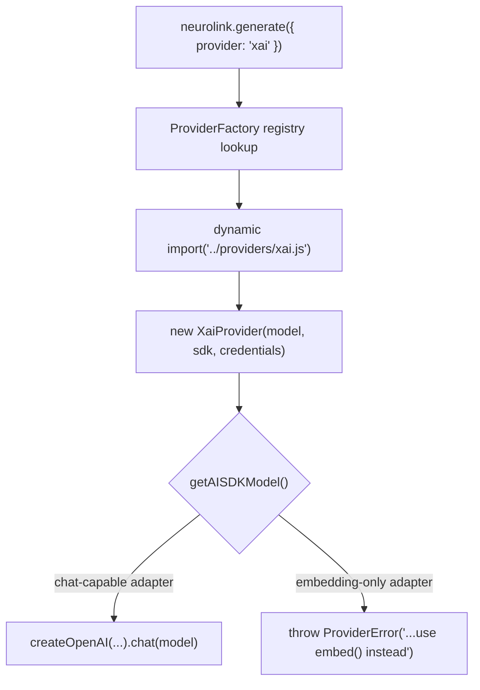

Open commit `00f88f671` and the diffstat alone is enough to make you flinch: 166 files changed, over 40,000 insertions. The commit subject reads `feat(providers): add 12 new providers + new modalities (avatar/music/video) + image-gen`. That is the kind of PR title that should have taken a team a quarter, not one engineering pass. But `git show --name-status 00f88f671` tells a more precise story than the subject line does, and the mechanism that made a batch of 12 providers tractable in a single PR is the same Factory + Registry pattern NeuroLink has used since it broke its original circular-dependency problem. This post is about that mechanism, what the diff actually contains, and where the commit's own numbers stop lining up with the code.

## What `git show --name-status` actually says

Run it against this repository and the new files under `src/lib/providers/` come back as exactly twelve `A` (added) entries:

```text
A       src/lib/providers/cloudflare.ts
A       src/lib/providers/cohere.ts
A       src/lib/providers/groq.ts
A       src/lib/providers/ideogram.ts
A       src/lib/providers/jina.ts
A       src/lib/providers/perplexity.ts
A       src/lib/providers/recraft.ts
A       src/lib/providers/replicate.ts
A       src/lib/providers/stability.ts
A       src/lib/providers/togetherAi.ts
A       src/lib/providers/voyage.ts
A       src/lib/providers/xai.ts
```

Twelve files, matching the "12" in the commit subject. But the commit message's own bullet list, headed `NEW CHAT/LLM PROVIDERS (12)`, names only ten providers: xAI Grok, Groq, Cohere, Together AI, Fireworks AI, Perplexity, Cloudflare Workers AI, Voyage AI, Jina AI, and Replicate LLM. Three of the twelve files that landed alongside those ten — `ideogram.ts`, `recraft.ts`, and `stability.ts` — are image-generation adapters, not chat providers at all; the commit message itself files them separately, under `NEW MODALITIES → Image generation`. So the file count and the provider-name list are each internally consistent, but they aren't counting the same thing. That's the discrepancy this post is built around, and it's worth working through carefully rather than repeating either number uncritically.

## The shape that made twelve providers boring

The reason a batch this size fit in one PR is that most of the new adapters aren't really twelve different integrations. They're the same integration, twelve times, with the surface area doing the varying. Six of the new files — `xai.ts`, `groq.ts`, `cohere.ts`, `cloudflare.ts`, `togetherAi.ts`, and `perplexity.ts` — all start from the identical shape: import `createOpenAI` from `@ai-sdk/openai`, build a client against a provider-specific `baseURL`, call `.chat(modelName)`, and let `BaseProvider` handle the rest.

Here's `xai.ts`, trimmed to the part that matters:

```typescript
// src/lib/providers/xai.ts
import { createOpenAI } from "@ai-sdk/openai";
import { BaseProvider } from "../core/baseProvider.js";
import { createXaiConfig, getProviderModel, validateApiKey } from "../utils/providerConfig.js";

const XAI_DEFAULT_BASE_URL = "https://api.x.ai/v1";
const getXaiApiKey = (): string => validateApiKey(createXaiConfig());

export class XaiProvider extends BaseProvider {
  private model: LanguageModel;
  private apiKey: string;
  private baseURL: string;

  constructor(modelName?: string, sdk?: unknown, _region?: string, credentials?: NeurolinkCredentials["xai"]) {
    super(modelName, "xai" as AIProviderName, isNeuroLink(sdk) ? sdk : undefined);

    const overrideApiKey = credentials?.apiKey?.trim();
    this.apiKey = overrideApiKey && overrideApiKey.length > 0 ? overrideApiKey : getXaiApiKey();
    this.baseURL = credentials?.baseURL ?? process.env.XAI_BASE_URL ?? XAI_DEFAULT_BASE_URL;

    const xai = createOpenAI({
      apiKey: this.apiKey,
      baseURL: this.baseURL,
      fetch: createLoggingFetch("xai"),
    });
    this.model = xai.chat(this.modelName);
  }
}
```

`cohere.ts` and `cloudflare.ts` might not look like OpenAI-compatible integrations at first glance — Cohere and Cloudflare Workers AI both have their own native APIs — but the adapters route through OpenAI-compatibility endpoints those vendors expose specifically so clients like this don't need bespoke request/response shapes:

```typescript
// src/lib/providers/cohere.ts
const COHERE_DEFAULT_BASE_URL = "https://api.cohere.com/compatibility/v1";
// ...
const cohere = createOpenAI({
  apiKey: this.apiKey,
  baseURL: this.baseURL,
  fetch: createLoggingFetch("cohere"),
});
this.model = cohere.chat(this.modelName);
```

```typescript
// src/lib/providers/cloudflare.ts
this.baseURL = credentials?.baseURL ?? buildCloudflareBaseURL(accountId);

const cloudflare = createOpenAI({
  apiKey: this.apiKey,
  baseURL: this.baseURL,
  fetch: createLoggingFetch("cloudflare"),
});
this.model = cloudflare.chat(this.modelName);
```

Once you've written `createXaiConfig()` and `XaiProvider`, `GroqProvider` is largely a find-and-replace of the base URL, the env var names, and the default model constant. That's not a criticism of the work — it's the entire point of standardizing on `BaseProvider` and the Vercel AI SDK's `createOpenAI` factory. It's also why a batch of six providers can land in the same PR as six other, genuinely different ones, without either category slowing the other down.

## The provider that departs from the template

Not every new chat provider fits that mold. `replicate.ts` is 523 lines — roughly double the size of `xai.ts` — because Replicate doesn't expose a chat-completions endpoint at all. It exposes a predictions API: you submit a job, poll it, and download the result once it finishes. The adapter's imports show the difference immediately:

```typescript
// src/lib/providers/replicate.ts
import { getReplicateAuth } from "../adapters/replicate/auth.js";
import { downloadPredictionOutput, predict } from "../adapters/replicate/predictionLifecycle.js";
import { MAX_IMAGE_BYTES } from "../utils/sizeGuard.js";
```

There's no `createOpenAI` here, and no `.chat()` call. Instead, `buildPromptFromOptions()` flattens NeuroLink's structured chat options down into the single prompt string Replicate-hosted Llama and Mistral models expect, because — per the comment in the source — "they don't implement OpenAI's chat-completions contract uniformly." The commit message notes this is also the piece that "completes the multi-modal Replicate story," since Replicate already had image, video, avatar, and music handlers from elsewhere in the same PR; adding chat closes the loop so one vendor covers every modality NeuroLink supports.

## The two providers that refuse to chat

Two of the twelve files aren't chat providers in even the loose sense that Replicate is — they're embedding-only, and they say so out loud. `voyage.ts` and `jina.ts` both extend `BaseProvider` but override the chat-path methods to fail on purpose, with an error message instead of a stack trace:

```typescript
// src/lib/providers/voyage.ts
protected getAISDKModel(): LanguageModel {
  throw new ProviderError(
    "Voyage AI is an embedding-only provider; chat completions are not available. Use `embed()` or `embedMany()` instead, or pick a different provider for `generate()` / `stream()`.",
    "voyage",
  );
}

protected async executeStream(
  _options: StreamOptions,
  _analysisSchema?: ValidationSchema,
): Promise<StreamResult> {
  throw new ProviderError(
    "Voyage AI is an embedding-only provider; streaming chat is not available. Use `embed()` / `embedMany()`, or pick another provider for `stream()`.",
    "voyage",
  );
}
```

`VoyageProvider` also overrides `supportsTools()` to return `false`, and its constructor logs `"Voyage Provider initialized (embeddings only)"` at debug level, so the limitation is visible before a caller ever hits the throw. The commit message groups Voyage and Jina under the chat-provider header anyway — "Voyage AI + Jina AI (embeddings-only, with friendly errors on chat calls)" — which is accurate about what the friendly-error mechanism does, but it means two of the ten named "chat/LLM providers" can't actually complete a chat call. They exist in the registry so that calling `generate()` against them fails with a message that tells you what to do instead of an opaque SDK exception.

## Wiring a provider into the Factory

None of the twelve adapters are reachable from `neurolink.generate({ provider: "xai" })` until they're registered. That happens in `src/lib/factories/providerRegistry.ts`, which grew by 488 lines in this commit — one `ProviderFactory.registerProvider()` call per new provider, each with a dynamic import so a provider you never call never gets its module loaded:

```typescript
// src/lib/factories/providerRegistry.ts
// Register xAI Grok provider
ProviderFactory.registerProvider(
  AIProviderName.XAI,
  async (
    modelName?: string,
    _providerName?: string,
    sdk?: UnknownRecord,
    _region?: string,
    credentials?: UnknownRecord,
  ) => {
    const xaiCreds = credentials as NeurolinkCredentials["xai"];
    const { XaiProvider } = await import("../providers/xai.js");
    return new XaiProvider(
      modelName,
      sdk as unknown as NeuroLink | undefined,
      undefined,
      xaiCreds,
    );
  },
  process.env.XAI_MODEL || XaiModels.GROK_3,
  ["xai", "grok"],
);
```

The last argument is a list of aliases — `["xai", "grok"]` means both `provider: "xai"` and `provider: "grok"` resolve to the same registration. Voyage's registration follows the identical shape, aliased to `["voyage", "voyage-ai"]`:

```typescript
// src/lib/factories/providerRegistry.ts
ProviderFactory.registerProvider(
  AIProviderName.VOYAGE,
  async (modelName, _providerName, sdk, _region, credentials) => {
    const voyageCreds = credentials as NeurolinkCredentials["voyage"];
    const { VoyageProvider } = await import("../providers/voyage.js");
    return new VoyageProvider(modelName, sdk as unknown as NeuroLink | undefined, undefined, voyageCreds);
  },
  process.env.VOYAGE_MODEL || VoyageModels.VOYAGE_3_5,
  ["voyage", "voyage-ai"],
);
```

This is the mechanic that turns "write a class" into "ship a provider": the registry is the single place NeuroLink's `generate()`, CLI, and model-discovery code all look up a provider name, so adding an entry here is what makes an adapter visible to every caller at once, rather than requiring a change everywhere a provider list is hardcoded. The same PR also added matching entries to `src/lib/constants/enums.ts` (286 new lines, including the `AIProviderName` values `XAI`, `GROQ`, `COHERE`, `TOGETHER_AI`, `FIREWORKS`, `PERPLEXITY`, `CLOUDFLARE`, `REPLICATE`, `VOYAGE`, `JINA`, `STABILITY`, `IDEOGRAM`, and `RECRAFT`) and to `src/cli/factories/commandFactory.ts` (419 lines changed) so the CLI's `--provider` flag recognizes the new names too.



## The provider that isn't in the file list at all

Here's where the "12" gets genuinely strange. Fireworks AI is named in the commit's own `NEW CHAT/LLM PROVIDERS (12)` list, has a registry entry, an `AIProviderName.FIREWORKS` enum value, a getting-started doc, and a `FIREWORKS_API_KEY` / `FIREWORKS_MODEL` / `FIREWORKS_BASE_URL` env contract documented in `docs/getting-started/providers/fireworks.md`. But `fireworks.ts` does not appear in the twelve-file list from `git show --name-status` above. Run the same command with copy detection made explicit and the reason shows up:

```text
$ git show --name-status -C 00f88f671 | grep fireworks
A       docs/getting-started/providers/fireworks.md
C050    src/lib/providers/mistral.ts    src/lib/providers/fireworks.ts
```

Git's copy heuristic — active by default in this repository's `diff.renames = copies` setting — scored `fireworks.ts` as 50% textually similar to the existing `mistral.ts` and classified it as a copy rather than a new addition. That's not evidence anyone hand-copied Mistral's file to bootstrap Fireworks's; there's no way to tell intent from a similarity score. What it does tell you is that a Fireworks adapter and a Mistral adapter — both OpenAI-compatible chat wrappers with a `baseURL`, an API-key env var, and a default model constant — are similar enough, line for line, that git's own diff algorithm can't tell them apart from a plain add. It's the same templated shape from the section above, just visible from a different angle: a 50%-similar file is what "boring, repeatable integration" looks like in a diff tool.

The practical upshot: whichever way you count, "12" is doing two different jobs in the commit subject. As a count of new files under `src/lib/providers/`, it's exactly right — verified above. As a count of "new chat/LLM providers," it's off in both directions: it includes three image-gen adapters that aren't chat at all, and it silently absorbs a thirteenth real, registered, documented chat provider (Fireworks) that doesn't happen to register as a new file in git's own accounting.

## Three that aren't chat providers, full stop

The remaining three files in the twelve — `stability.ts`, `ideogram.ts`, and `recraft.ts` — are image-generation adapters, and the commit is explicit that they belong to a different category (`NEW MODALITIES → Image generation`), which is exactly why grouping them under a "12 providers" headline overstates the chat-provider count. `StabilityProvider`'s chat path is a deliberate dead end:

```typescript
// src/lib/providers/stability.ts
protected async executeStream(
  _options: StreamOptions,
  _analysisSchema?: ValidationSchema,
): Promise<StreamResult> {
  throw new Error(
    "Stability AI is an image-generation-only provider; streaming chat is not available. Use generate({output:{format:'binary'}}) with a Stable Image / SD 3.5 model.",
  );
}

protected override async executeImageGeneration(
  options: TextGenerationOptions,
): Promise<EnhancedGenerateResult> {
  // ... builds and sends the Stability text-to-image / image-to-image request
}
```

These three ride on the same `BaseProvider` contract as the chat adapters — same constructor shape, same credential resolution, same error-formatting hook — but they override `executeImageGeneration` instead of `getAISDKModel`. The commit's `ImageGenService dispatch` fix (listed under `INTEGRATION FIXES UNCOVERED BY E2E SMOKE`) adds friendly errors specifically for the mismatch case: asking an image-only provider to `generate()` chat, or asking a chat-only provider to generate an image, now fails with an explanatory message instead of a confusing runtime error deep in the dispatch layer.

## Catching regressions without spending real API credits

A batch this size needed a way to verify twelve-plus new adapters without burning tokens or image-generation credits on every CI run. The same commit adds `test/continuous-test-suite-providers-mocked.ts` (1,205 new lines) alongside a shared `test/utils/mockFetch.ts` (231 lines) that intercepts `globalThis.fetch` with route-based mocks:

```typescript
// test/continuous-test-suite-providers-mocked.ts
/**
 * Mocked Contract Test Suite for New Providers
 *
 * For each provider we:
 *   1. Intercept globalThis.fetch with route-based mocks.
 *   2. Set a fake API key so the provider constructs.
 *   3. Invoke the SDK entry point (nl.generate / nl.embed / etc.).
 *   4. Assert request URL + method + auth header + body shape.
 *   5. Assert response parses into the expected SDK result.
 *   6. Verify 401 → friendly auth error; 429 → retriable; 5xx → retriable.
 */
```

This is what lets a PR this size ship with confidence: every new adapter's happy path and its 401/429/5xx error path get exercised against a mock, so a broken request-body shape or a mis-mapped error class fails in CI rather than in front of a user with a live key. The commit also widened `isExpectedProviderError()` in `test/helpers/envGuard.ts` — the function the *live* continuous test suites use to decide whether a failure is an expected, environment-dependent skip (a missing credit balance, a provider outage) rather than a genuine regression — adding a 502 Bad Gateway pattern and an Anthropic beta-not-available pattern uncovered while running the new suites end to end.

The commit message's own `QUALITY GATES` section reports the outcome of that run: `pnpm run check`, `pnpm run lint`, and `pnpm run build` all clean, plus per-suite pass counts for the live continuous suites — `image-gen-extras (4/1 — 1 fail is user-side Stability credit)` and `music (11/1 — 1 fail is user-side ElevenLabs invoice)` among them. Both listed failures are attributed to account-level billing state on the test credentials, not to the code, which is exactly the class of noise `isExpectedProviderError()` exists to filter out of a red/green signal.

## What actually shipped in this PR, categorized honestly

Pulling the categories apart, rather than repeating either of the commit's own counts, the twelve new files under `src/lib/providers/` break down like this:

| File | Category | Notable trait |
|---|---|---|
| `xai.ts` | Chat, OpenAI-compatible | `api.x.ai/v1`, `XaiModels.GROK_3` default |
| `groq.ts` | Chat, OpenAI-compatible | Same `createOpenAI` shape as xAI |
| `cohere.ts` | Chat, OpenAI-compatible | Uses Cohere's own `/compatibility/v1` endpoint |
| `cloudflare.ts` | Chat, OpenAI-compatible | Base URL built from account id |
| `togetherAi.ts` | Chat, OpenAI-compatible | Same shape, different base URL |
| `perplexity.ts` | Chat, OpenAI-compatible | Same shape, different base URL |
| `replicate.ts` | Chat, custom shape | Predictions API — submit, poll, download |
| `voyage.ts` | Embeddings-only | Chat path throws a friendly `ProviderError` |
| `jina.ts` | Embeddings-only | Same friendly-error pattern, plus reranking |
| `stability.ts` | Image-gen | Chat path is a hard `throw new Error(...)` |
| `ideogram.ts` | Image-gen | Overrides `executeImageGeneration` |
| `recraft.ts` | Image-gen | Same, notably returns WebP not PNG |

Nine of the twelve can plausibly be called chat-capable (six templated OpenAI-compatible wrappers, one custom Replicate adapter, two embeddings-only providers whose chat path is deliberately a dead end); three are image-gen only. Fireworks AI is a real, registered, thirteenth chat provider that this file-based count entirely misses, because it happens to be similar enough to an existing file that git filed it as a copy rather than an addition. None of that makes the underlying engineering work any smaller — 166 files and four new modality categories (image, video, avatar, music) landed in the same commit — but it does mean the honest description of this PR is "twelve new provider files, nine of them chat-capable, plus a thirteenth chat provider that rode in on an existing file's coattails," not a flat "12 chat providers."

## Why the shape matters more than the count

The real story here isn't the arithmetic — it's that the arithmetic is even debatable. A `BaseProvider` subclass with `createOpenAI`, a `baseURL`, and a model constant is close enough to a template that six providers can ship as near-duplicates of each other, a seventh can borrow just enough of that shape to register as a git copy of an eighth, and the actual engineering effort goes into the providers that don't fit the template at all — Replicate's polling lifecycle, the embedding-only friendly errors, the image-gen dispatch fixes the commit's own `INTEGRATION FIXES` section documents. That's the same Factory + Registry pattern this blog has covered before, doing exactly what it's for: making the boilerplate boring enough that a batch this size is a one-PR problem, and confining the genuinely new work to the handful of adapters that actually need it.

---

**Related posts:**

- [The Factory + Registry Pattern: How NeuroLink Breaks Circular Dependencies](/posts/factory-registry-pattern/)
- [Generating talking avatars with NeuroLink](/posts/generating-talking-avatars-with-neurolink/)
- [xAI / Grok integration deep dive](/posts/xai-grok-integration-deep-dive/)
