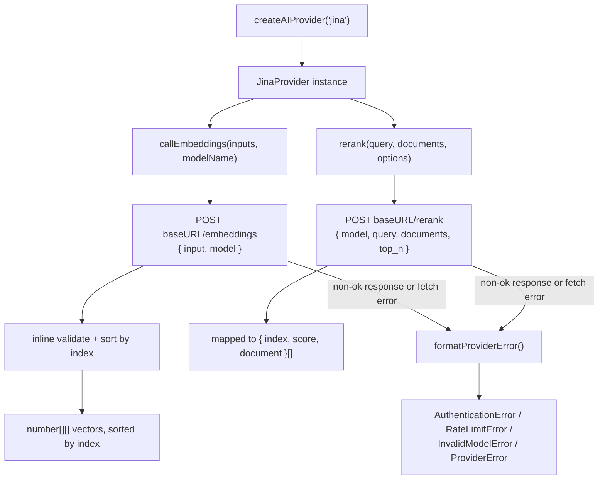

A retrieval pipeline built for English support tickets gets pointed at a new market overnight: a backlog of documents in Japanese, German, and Portuguese that need to land in the same vector space as the English ones already indexed. Jina's embeddings API is the obvious fix — one model, 89 languages, no separate index per language — and NeuroLink's `embed()` contract should make it a drop-in swap. Then someone tries to point that same call at a scanned invoice. As of the commit this post describes (`00f88f671`, 2026-05-16), NeuroLink's `embed()` contract takes a plain `string` — there is no multimodal input type and no Bedrock Titan-style image embedding to compare `JinaProvider` against. Passing anything but a string is a compile-time type error, not a runtime `ProviderError` — the mixed-modality mistake this post opens with isn't reachable through this method's signature.

That narrow signature is not an accident. It is the internals of a provider class deliberately narrower than the interface it implements, and that mechanism — not the marketing pitch — is what this post is about: `JinaProvider` in `src/lib/providers/jina.ts`, what it shares with `VoyageProvider`, and where the two quietly diverge.

## A provider that answers exactly two kinds of question

`JinaProvider` extends `BaseProvider`, the same base class every chat provider in NeuroLink extends. But its class doc comment says plainly what it is and is not:

```typescript
/**
 * Jina AI Provider — embeddings + reranking.
 *
 * Native API at api.jina.ai/v1. Chat / streaming / tool calling are not
 * supported. Use `embed()` / `embedMany()` for embeddings, or call
 * `rerank()` directly for retrieval reranking (Jina's strength).
 *
 * @see https://jina.ai/embeddings/
 */
export class JinaProvider extends BaseProvider {
```

`BaseProvider` expects a text-generation path from every subclass, so `JinaProvider` has to override two methods just to say "no" in a controlled way, instead of letting a caller's `generate()` call fall through into an SDK method that doesn't exist:

```typescript
protected getAISDKModel(): LanguageModel {
  throw new Error(
    "Jina AI is an embeddings + reranking provider; chat completions are not available. Use `embed()` / `embedMany()` / `rerank()`.",
  );
}

protected async executeStream(
  _options: StreamOptions,
  _analysisSchema?: ValidationSchema,
): Promise<StreamResult> {
  throw new Error(
    "Jina AI is an embeddings + reranking provider; streaming chat is not available.",
  );
}
```

`supportsTools()` is overridden to return `false` too, so a caller wiring tool calling into a provider chain gets a clean capability check instead of a runtime surprise. The pattern is identical to `VoyageProvider`, which sits right above `JinaProvider` in the same commit — both are embedding-only adapters wearing a chat-provider base class, and both cover the mismatch the same way: throw a specific, actionable error from the two methods that would otherwise be reached, rather than leaving the default `BaseProvider` behavior to produce a generic one.

## Wiring: how `"jina"` becomes a provider instance

The registry entry in `src/lib/factories/providerRegistry.ts` is what turns the string `"jina"` into a live `JinaProvider`:

```typescript
ProviderFactory.registerProvider(
  AIProviderName.JINA,
  async (
    modelName?: string,
    _providerName?: string,
    sdk?: NeuroLink,
    _region?: string,
    credentials?: UnknownRecord,
  ) => {
    const jinaCreds = credentials as NeurolinkCredentials["jina"];
    const { JinaProvider } = await import("../providers/jina.js");
    return new JinaProvider(modelName, sdk, undefined, jinaCreds);
  },
  process.env.JINA_MODEL || JinaModels.JINA_EMBEDDINGS_V3,
  ["jina", "jina-ai"],
);
```

Two aliases resolve to the same provider — `jina` and `jina-ai` — and the module is dynamically imported so the provider class only loads once something actually asks for it. Configuration comes from three environment variables, documented in `.env.example`:

```bash
# Jina AI — embeddings + reranking (https://jina.ai/?sui=apikey)
JINA_API_KEY=your-jina-api-key
# Optional: JINA_MODEL=jina-embeddings-v3
# Optional: JINA_BASE_URL=https://api.jina.ai/v1
```

`createJinaConfig()` in `src/lib/utils/providerConfig.ts` supplies the setup instructions `validateApiKey()` surfaces when `JINA_API_KEY` is missing — the same "here's how to get one" pattern every provider config in that file follows:

```typescript
export function createJinaConfig(): ProviderConfigOptions {
  return {
    providerName: "Jina AI",
    envVarName: "JINA_API_KEY",
    setupUrl: "https://jina.ai/?sui=apikey",
    description: "API key",
    instructions: [
      "1. Visit: https://jina.ai/?sui=apikey",
      "2. Sign in / create account",
      "3. Copy your API key",
      "4. Set JINA_API_KEY in your .env file",
    ],
  };
}
```

The constructor resolves credentials in a specific order — a per-call `credentials.jina` override, then this environment-backed default — and the base URL follows the same fallback chain: an override, then `JINA_BASE_URL`, then the hardcoded `https://api.jina.ai/v1`. That gives a request-scoped API key precedence over the instance's default without requiring a second `JinaProvider` instance just to swap credentials for one call.

## `embed()` and `embedMany()`: plain text in, validation inline

The public embedding methods are thin. `embed()` takes a plain `string` and delegates to a private `callEmbeddings()`; `embedMany()` short-circuits an empty array and otherwise does the same for a batch:

```typescript
override async embed(text: string, modelName?: string): Promise<number[]> {
  const vectors = await this.callEmbeddings([text], modelName);
  if (!vectors[0]) {
    throw new Error("Jina AI returned no embedding for the provided text");
  }
  return vectors[0];
}
```

`callEmbeddings()` POSTs to `${baseURL}/embeddings` with a 60-second timeout enforced through an `AbortController`, and validates the parsed JSON inline — there is no shared validator function yet, so this logic lives directly in `jina.ts`:

```typescript
const data = (await response.json()) as JinaEmbeddingsResponse;
if (!data.data || data.data.length === 0) {
  throw new Error("Jina embeddings response missing data");
}
if (data.data.length !== inputs.length) {
  throw new Error(
    `Jina embeddings response count mismatch: expected ${inputs.length}, got ${data.data.length}`,
  );
}
const sorted = data.data.slice().sort((a, b) => a.index - b.index);
for (let i = 0; i < sorted.length; i++) {
  if (sorted[i].index !== i) {
    throw new Error(
      `Jina embeddings response has unexpected index ordering: position ${i} has index ${sorted[i].index}`,
    );
  }
}
return sorted.map((d) => d.embedding);
```

This is JinaProvider's own logic, not shared with anyone — `VoyageProvider` has its own structurally identical version of the same three checks, thrown as a typed `ProviderError` instead of a plain `Error`, but the two aren't factored into a common function at this point in the codebase's history. A caller doing `catch (e) { if (e instanceof ProviderError) ... }` around a Jina embedding call still won't catch a malformed-response error the way it would for Voyage — it has to catch plain `Error` too — but that's because the two providers were simply written that way independently.

## `embed()`'s signature is plain text

As of this commit, `embed()` accepts only a `string`, so there is no image guard on the embedding path. `JinaProvider.embed()`'s actual signature here is:

```typescript
override async embed(
  text: string,
  modelName?: string,
): Promise<number[]> {
  const vectors = await this.callEmbeddings([text], modelName);
  if (!vectors[0]) {
    throw new Error("Jina AI returned no embedding for the provided text");
  }
  return vectors[0];
}
```

There's no `image` field to reject, because there's no multimodal input shape to accept it through in the first place — a caller can't get an image into this method at all without breaking the type checker before the code even runs.

## `rerank()`: the method that isn't on the shared interface

`embed()` and `embedMany()` are declared on `AIProvider`, so any code holding a generic provider reference can call them. `rerank()` is not part of that shared surface — it's a method that exists only on the concrete `JinaProvider` class, and the code says exactly why in its own comment:

```typescript
/**
 * Rerank a list of documents against a query.
 *
 * Returns the documents sorted by relevance (highest first), with
 * score and original index preserved so callers can map back.
 *
 * Note: not exposed on `BaseProvider` — accessed by casting to
 * `JinaProvider` or via the dedicated rerank route on the public API
 * (`POST /api/agent/rerank` in the server module, when added).
 *
 * Per-call credentials can be supplied via `options.credentials?.jina`,
 * overriding the instance-level credentials for this request only.
 */
async rerank(
  query: string,
  documents: string[],
  options: {
    model?: string;
    topN?: number;
    credentials?: NeurolinkCredentials["jina"];
  } = {},
): Promise<{ index: number; score: number; document: string }[]> {
```

That "when added" is doing real work — the comment describes a dedicated public rerank route as a planned home for this capability, not one that ships in this commit. As things stand, the only way to call `rerank()` from application code is to get a `JinaProvider` instance and use it as one, which — since `JinaProvider` itself isn't exported from the package's top-level `index.ts` — means narrowing an `unknown` value through a structural type that matches the method's own signature, rather than importing the class directly:

```typescript
import { createAIProvider } from "@juspay/neurolink";

interface JinaReranker {
  rerank(
    query: string,
    documents: string[],
    options?: { model?: string; topN?: number },
  ): Promise<{ index: number; score: number; document: string }[]>;
}

const provider = await createAIProvider("jina");
const ranked = await (provider as unknown as JinaReranker).rerank(
  "what changed in the Q3 pricing policy?",
  candidateChunks,
  { topN: 5 },
);
```

`rerank()` defaults `model` to `JinaModels.JINA_RERANKER_V2_BASE_MULTILINGUAL` when the caller doesn't specify one, and defaults `topN` to `documents.length` — so an unconfigured call returns every candidate re-sorted rather than a truncated top slice. It POSTs to `${baseURL}/rerank` with the same `AbortController`-based 60-second timeout as `callEmbeddings()`, and maps Jina's response shape back to a smaller, stable one:

```typescript
const data = (await response.json()) as JinaRerankResponse;
return (data.results ?? []).map((r) => ({
  index: r.index,
  score: r.relevance_score,
  document: documents[r.index] ?? r.document?.text ?? "",
}));
```

Note the fallback on `document`: it prefers the caller's own `documents[r.index]` — the exact string that was sent — and only falls back to whatever text Jina's response echoes back if the index lookup comes up empty. That ordering matters if a caller has since mutated the array between the request and reading the response; it means the mapped result reflects what the API scored, not necessarily what's in memory right now.

## Turning provider errors into typed errors

`formatProviderError()` is the single place raw fetch failures become NeuroLink's typed error hierarchy, and it does it with plain substring matching on the error message rather than a status-code branch, because the underlying `fetch` call has already collapsed the response into a thrown `Error`:

```typescript
protected formatProviderError(error: unknown): Error {
  const message =
    error instanceof Error
      ? error.message
      : typeof error === "string"
        ? error
        : "Unknown error";
  if (
    message.includes("401") ||
    message.toLowerCase().includes("unauthorized")
  ) {
    return new AuthenticationError(
      "Invalid Jina AI API key. Get one at https://jina.ai/?sui=apikey",
      "jina",
    );
  }
  if (
    message.includes("429") ||
    message.toLowerCase().includes("rate limit")
  ) {
    return new RateLimitError(
      "Jina AI rate limit exceeded. Back off and retry.",
      "jina",
    );
  }
  if (
    message.includes("404") ||
    message.toLowerCase().includes("model_not_found")
  ) {
    return new InvalidModelError(
      `Jina AI model '${this.modelName}' not found. See https://jina.ai/embeddings/`,
      "jina",
    );
  }
  return new ProviderError(`Jina AI error: ${message}`, "jina");
}
```

Three specific error classes — `AuthenticationError`, `RateLimitError`, `InvalidModelError` — cover the failure modes a caller is most likely to hit and can most usefully branch on, and everything else collapses into a generic `ProviderError` carrying the original message. `formatProviderError()` is invoked from both `callEmbeddings()` and `rerank()` at every place a non-timeout `fetch` failure or non-`ok` response occurs, so the same three-way classification applies to both endpoints — an expired key produces the same `AuthenticationError` whether the caller was embedding or reranking.

Timeouts get their own path, checked before `formatProviderError()` is even reached: both `callEmbeddings()` and `rerank()` catch `AbortError` specifically and wrap it in a message naming the 60-second limit, so a slow Jina response doesn't get misclassified as a generic provider error with no indication of what actually happened.

## Eight models in the enum, four in the getting-started table

`src/lib/constants/enums.ts` defines `JinaModels` with eight entries:

```typescript
export enum JinaModels {
  /** Jina Embeddings v3 — flagship multilingual (default) */
  JINA_EMBEDDINGS_V3 = "jina-embeddings-v3",
  /** Jina Embeddings v2 base English */
  JINA_EMBEDDINGS_V2_BASE_EN = "jina-embeddings-v2-base-en",
  /** Jina Embeddings v2 small English */
  JINA_EMBEDDINGS_V2_SMALL_EN = "jina-embeddings-v2-small-en",
  /** Jina Embeddings v2 base code */
  JINA_EMBEDDINGS_V2_BASE_CODE = "jina-embeddings-v2-base-code",
  /** Jina Embeddings v2 base multilingual */
  JINA_EMBEDDINGS_V2_BASE_MULTILINGUAL = "jina-embeddings-v2-base-zh",
  /** Jina ColBERT v2 — late-interaction retrieval */
  JINA_COLBERT_V2 = "jina-colbert-v2",
  /** Jina Reranker v2 base multilingual */
  JINA_RERANKER_V2_BASE_MULTILINGUAL = "jina-reranker-v2-base-multilingual",
  /** Jina Reranker v1 turbo English */
  JINA_RERANKER_V1_TURBO_EN = "jina-reranker-v1-turbo-en",
}
```

`docs/getting-started/providers/jina.md`, added in the same commit, documents four of those eight in its "Supported Models" table — the default `jina-embeddings-v3`, two more `v2` embedding variants, and the multilingual reranker. `jina-embeddings-v2-small-en`, `jina-colbert-v2`, and `jina-reranker-v1-turbo-en` are valid values the enum exposes and `JinaProvider` will happily send to the API, but they aren't in the table a reader lands on first. None of that is wrong, exactly — a model ID missing from a docs table still works if you pass it explicitly as `modelName` — but it means the enum is the more complete reference of the two if you're choosing among Jina's reranker generations or its ColBERT late-interaction option specifically.

## The request/response flow



Both request paths share the timeout mechanism, the credential-resolution order, and the error classifier; they diverge only in the endpoint, the request body shape, and the response mapping — inline validation and an index sort for embeddings, an inline `.map()` for reranking.

## Using it end to end

Generating a single embedding needs nothing beyond the environment variable and the standard factory function:

```typescript
import { createAIProvider } from "@juspay/neurolink";

const provider = await createAIProvider("jina");
const vector = await provider.embed("How does CRISPR-Cas9 work?");
console.log(vector.length); // 1024 for the default jina-embeddings-v3
```

Batching a set of documents for an index goes through `embedMany()`, which returns early on an empty array rather than making a request with an empty `input`:

```typescript
const vectors = await provider.embedMany([
  "Document one content...",
  "Document two content...",
  "Document three content...",
]);
// vectors: number[][], one entry per input, in the same order
```

Overriding the model for one call, without touching the instance-level default set by `JINA_MODEL`:

```typescript
const codeVector = await provider.embed(
  "function fibonacci(n) { return n < 2 ? n : fibonacci(n-1) + fibonacci(n-2); }",
  "jina-embeddings-v2-base-code",
);
```

And reranking, using the structural cast from earlier since `rerank()` isn't on the shared `AIProvider` type:

```typescript
const ranked = await (provider as unknown as JinaReranker).rerank(
  "what changed in the Q3 pricing policy?",
  retrievedChunks,
  { topN: 5 },
);

for (const { document, score } of ranked) {
  console.log(score.toFixed(4), document.slice(0, 80));
}
```

`ranked` comes back sorted by `relevance_score`, highest first, with the original `index` preserved — useful if the caller needs to map back to metadata (source document, page number) that was tracked alongside `retrievedChunks` but not sent to Jina itself.

## Where Jina fits in a RAG pipeline

`prepareRAGTool()` in `src/lib/rag/ragIntegration.ts` doesn't route through Jina, or through any configured embedding provider, at this commit — it has no code path that creates an embedding provider or checks for an `embed()` method. Every chunk and query it handles is embedded the same way, regardless of what (if anything) `embeddingProvider` is set to:

```typescript
/**
 * Generate deterministic embeddings for chunks.
 * Combines character-frequency (40%) with word-level hash features (60%)
 * for better semantic discrimination than pure character frequency.
 * When a real embedding provider is configured, it will be used instead.
 */
function generateSimpleEmbedding(text: string, dimension: number): number[] {
  // ...
}
```

That last line of the doc comment — 'When a real embedding provider is configured, it will be used instead' — is describing a branch that doesn't exist yet: `generateSimpleEmbedding()` is called unconditionally for both chunk indexing and query embedding. Setting `embeddingProvider: "jina"` at this point in the codebase's history has no effect on how the pipeline actually generates vectors — `JinaProvider.embed()` isn't called from `ragIntegration.ts` regardless of that setting.

The lower-level building blocks do go through the factory: `MDocument.embed()` and `createVectorQueryTool()` each call `ProviderFactory.createProvider()` for the provider they are given, check that the instance has an `embed()` method, and call it once per chunk or per query — so naming `jina` there reaches `JinaProvider.embed()`. `rerank()` has no such hook: nothing in `src/lib/rag/` calls `JinaProvider.rerank()`, so wiring Jina's reranker into a retrieval pipeline is still an explicit, provider-specific step using the casting pattern above, not something `embeddingProvider: "jina"` turns on by itself.

## What `JinaProvider` does not do

Worth stating plainly, since every capability list above is really a capability *boundary*:

- No chat, no streaming, no tool calling — `getAISDKModel()` and `executeStream()` throw by design, and `supportsTools()` returns `false`.
- No multimodal embedding input — `embed()` takes a plain `string`; there's no `image` field to reject, so a caller can't get an image into this method in the first place.
- No public, typed way to call `rerank()` without a cast — it isn't declared on `AIProvider`, and `JinaProvider` isn't exported from the package's top-level module.
- No independent error typing from `VoyageProvider` — the two providers validate embeddings responses with separate, structurally identical logic, and a malformed-response failure on `embed()` throws a plain `Error`, not the `ProviderError` a Jina caller might reasonably expect after seeing `formatProviderError()` used everywhere else in the same file.

None of these are defects on their own — they're the documented shape of an embeddings-and-reranking adapter that shares a base class with generation providers it deliberately doesn't behave like. The gap between what `AIProvider` promises and what `JinaProvider` actually implements is exactly where a caller needs to read the source once, rather than assume the shared interface tells the whole story.

---

**Related posts:**

- [How we shipped 12 providers in one PR](/posts/how-we-shipped-12-providers-in-one-pr/)
- [Embeddings and Vector Operations with NeuroLink](/posts/embeddings-vector-operations/)
- [5 Reranking Strategies for Production RAG Pipelines](/posts/rag-reranking-strategies/)
