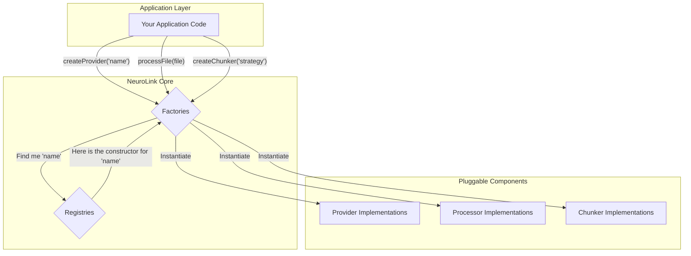

As an AI platform scales, the number of integrations explodes. You start with one model provider, then add a second for redundancy. You support plaintext, then get requests for PDF, then DOCX. You have one chunking strategy, but it performs poorly on code snippets. Soon, your core logic is littered with conditional statements, and adding a new provider or document type requires a scary refactor. To solve this, we designed a core architecture based on the Factory and Registry patterns. This post goes under the hood to explore the internals of how this design handles a dynamic and growing set of components.

This architecture provides a clean, decoupled way to manage implementations. It's a foundational pattern that we use for three key pluggable systems in NeuroLink: AI Providers, File Processors, and RAG Chunkers.

The core idea is simple:
- A **Registry** acts as a central database of available component "classes" or constructors.
- A **Factory** provides a unified interface to create an instance of a component from the registry.

This approach keeps application code stable. It asks the factory for a component by name or capability, without needing to know the specific implementation details.

## A Unified Entrypoint for AI Providers

Supporting a diverse range of language models is a competitive necessity. But directly integrating each provider's SDK creates tight coupling and makes it difficult to switch models or add new ones. The `AIProviderFactory` is our abstraction layer to solve this.

Located in `src/lib/core/factory.ts`, the `AIProviderFactory` is the single entry point for any code that needs to interact with a language model.

```typescript
// Request a provider by a specific name
const provider = await AIProviderFactory.createProvider('openai');

// Or let the factory pick the best available one
const bestProvider = await AIProviderFactory.createBestProvider({
  minQuality: 'high',
  minLatency: 'low'
});
```

The factory is responsible for creating a consistent interface for the caller, regardless of the underlying model.

It shields the rest of the application from the complexities of provider-specific initialization, authentication, and error handling.

This design relies on a companion, the `ProviderRegistry`.

The `ProviderRegistry` is where all available provider implementations are registered during application startup.

The `registerAllProviders` method, defined in `src/lib/factories/providerRegistry.ts`, is called once to catalog all the available models.

When `AIProviderFactory.createProvider` is called, it consults this registry to find the requested provider and instantiate it.

This pattern allows us to add a new model provider by simply creating a new provider class and adding it to the registry. No application code needs to change.

The factory even supports advanced use cases like dynamic model selection and fallbacks, as seen in methods like `createBestProvider` and `createProviderWithFallback`.

This architecture is the foundation for our dynamic model routing capabilities.

## Dynamic File Processing

Ingesting user content means dealing with a wide variety of file formats.

Each format requires a specific set of tools to extract its text and metadata.

Hard-coding a chain of `if/else` statements to handle this is not a scalable solution.

We use the `ProcessorRegistry` for this, defined in `src/lib/processors/registry/ProcessorRegistry.ts`.

It serves as a central dispatch for any and all file processing tasks.

```typescript
// Get the singleton instance
const registry = ProcessorRegistry.getInstance();

// Process a file buffer, letting the registry find the right processor
const result = await registry.processFile({
  filepath: 'annual-report.pdf',
  mimetype: 'application/pdf',
  content: fileBuffer
});
```

The key method is `findProcessor`.

It takes a file's mimetype and name, and uses a confidence-scoring system to determine the best processor for the job.

The `calculateConfidence` method weighs factors like:
*   A direct mimetype match (e.g., `application/pdf`).
*   A file extension match (`.pdf`).
*   The processor's declared capabilities.

This allows for robust and flexible dispatch. For example, a processor for "all text-based files" can serve as a fallback if a more specific `.csv` or `.md` processor isn't found.

New processors are added via the `register` method. This allows developers, and even other parts of the system, to extend NeuroLink's file processing capabilities at runtime.

The `initializeDefaultProcessors` function ensures that a robust set of built-in processors for common formats are always available.

## The Core Architectural Pattern

At the heart of these systems is a consistent architectural choice that prioritizes extensibility and decoupling. A factory and registry pair manages a set of pluggable components.

This is how we can visualize the data flow at a high level. The application code is completely insulated from the concrete implementations.



This design makes the system easy to manage and test.

Each component can be developed and validated in isolation.

The clear separation of concerns prevents the kind of technical debt that cripples long-term velocity.

## Abstracting Chunking Strategies

Just as there is no single best language model, there is no single best text chunking strategy.

The optimal way to split a document for Retrieval-Augmented Generation (RAG) depends heavily on the content's structure.

Splitting prose is different from splitting source code. Splitting a legal contract is different from splitting a transcript.

The `ChunkerFactory` and `ChunkerRegistry` provide the flexibility to handle this diversity.

Found in `src/lib/rag/ChunkerFactory.ts` and `src/lib/rag/ChunkerRegistry.ts`, these two classes work together to provide chunking as a service.

```typescript
// Get the factory instance
const factory = ChunkerFactory.getInstance();

// Create a chunker with a specific strategy and configuration
const chunker = await factory.createChunker({
  strategy: 'fixed-size',
  config: {
    chunkSize: 512,
    chunkOverlap: 50
  }
});
```

The application code simply asks for a chunking strategy by name.

The factory handles the instantiation, using a configuration that can be a mix of defaults and user-provided overrides.

The `ChunkerRegistry` is the source of truth for what strategies are available.

The `registerChunker` method allows the system to be extended with new algorithms.

We can even associate strategies with specific use cases.

The `getChunkersForUseCase` method allows an application to ask for all chunking strategies suitable for "source-code" or "chat-history", for example.

This allows us to build smarter, context-aware RAG pipelines.

The `getAvailableStrategies` function provides a way for user interfaces to query the system and present a list of available chunking methods to the end-user, promoting discoverability.

## Architectural Trade-offs and Benefits

Adopting this Factory and Registry architecture is not free. It introduces a layer of indirection that can make simple call stacks more complex to trace. Initial setup requires more boilerplate than direct instantiation.

However, the trade-off is overwhelmingly positive for a platform like NeuroLink.

The benefits are clear:

*   **Extreme Decoupling:** Application logic is completely shielded from implementation details. We can swap out a provider or add a file type without touching a single line of consumer code.

*   **Enhanced Extensibility:** Adding a new component is a matter of implementing a standard interface and registering it. This is a low-friction process that encourages contribution.

*   **Centralized Configuration:** The factories and registries serve as a single place to manage default configurations, fallbacks, and selection logic.

*   **Improved Testability:** Each provider, processor, and chunker can be mocked, and the factory itself can be manipulated in test environments to provide specific component instances. This is visible in our use of `resetInstance` methods in testing.

*   **Discoverability:** The registry can be queried to discover what components are available at runtime, as seen with methods like `getAvailableStrategies` and `listProcessors`.

This architecture is a key reason we can integrate new technologies and providers so quickly. It's a foundational investment in maintainability and scalability that pays dividends every day.

## Adding a new component: the three-step contract

The pattern's payoff is that extension follows the same shape every time.

For a new AI provider:

1. Create a class that extends `BaseProvider` and implements the streaming + tool surface.
2. Register a factory function in `src/lib/factories/providerRegistry.ts` so `registerAllProviders` picks it up at startup.
3. Add the provider name to the `AIProviderName` type union in `src/lib/types/providers.ts`.

For a new file processor:

1. Extend `BaseFileProcessor` and declare `canProcess(file)` + `process(file)` + `getInfo()`.
2. Register it via `ProcessorRegistry.getInstance().register(myProcessor, priority)`.
3. Add MIME-type mappings to `src/lib/processors/config/mimeTypes.ts` if the format is new.

For a new chunker:

1. Implement the chunker contract (input: document; output: array of chunks).
2. Call `ChunkerFactory.getInstance().registerChunker(strategy, factory)` once at startup.
3. Optionally tag it with use-case metadata so `getChunkersForUseCase` returns it for the right callers.

The shape is identical because the factory + registry contract is identical. The variation is in the per-component logic, not in the wiring.

---

**Related posts:**
- [Dynamic Model Selection: Routing AI Requests at Runtime](/posts/dynamic-model-selection-runtime/)
- [OpenTelemetry for AI: Tracing Every Token Through Your Pipeline](/posts/opentelemetry-ai-observability/)
- [How We Test NeuroLink: 20 Continuous Test Suites and Counting](/posts/neurolink-testing-20-test-suites/)
