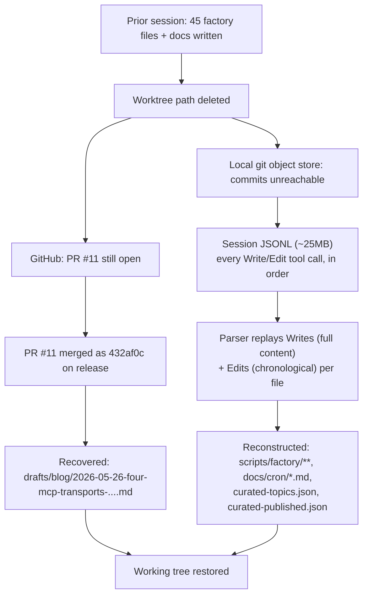

At 20:11 IST on May 27, 2026, a single commit landed in NeuroLink's marketing repository with a diffstat of 50 files and 15,029 insertions, and a message that starts with the word `recover`. It restores forty-five files under `scripts/factory/`, a cron doc, a curated topic list, and three regenerated voice-analysis artifacts — the entire machinery of an automated content pipeline that, twelve hours earlier, the local git history simply didn't contain.

Nothing about that commit, `39e51a7`, is a normal feature landing. It's a recovery operation, and it's worth reading closely because the failure it responds to isn't exotic: a worktree got deleted before its work was committed. What's unusual is what made the recovery possible — not a backup, not a stash, but the ordinary transcript a coding session leaves behind.

## What this pipeline runs, every day

Before getting into what broke, it's worth being concrete about what `scripts/factory/` actually does once it's running, because that's the shape of what briefly stopped existing. `docs/cron/content-factory-daily.md`, one of the files this commit restores, describes a `launchd` agent — `ink.neurolink.content-factory` — that fires daily at 09:17 IST and runs `scripts/content-factory-daily.sh` end to end: a branch check, a kill switch, a planner that picks the next curated topic, a drafter-plus-gates pipeline with up to three retries, a mermaid-diagram render step that drives a headless Chrome instance to screenshot every diagram to PNG, a publisher that pushes a branch and opens a PR for a human to merge, and up to three CodeRabbit review-and-fix cycles against that PR before a final notification goes out.

The first of those steps is a real, working safety check, and it's real code recovered in this same commit:

```bash
BRANCH=$(git -C "$MARKETING_DIR" rev-parse --abbrev-ref HEAD 2>/dev/null || echo unknown)
log "marketing branch: $BRANCH"
case "$BRANCH" in
  main|master|release|unknown)
    log "ABORT: unsafe branch '$BRANCH'. Switch to chore/* or feat/* first."
    shooter_push "Factory · skipped" "Unsafe branch: $BRANCH"
    exit 2
    ;;
esac
```

There's a small irony sitting right next to the outage this post is about: the script refuses to run on `main`, `master`, `release`, or an unresolvable `unknown` branch, and it notifies on that refusal instead of failing silently. It has no equivalent protection for the branch it *does* accept — a `chore/*` branch sitting in a worktree that later gets deleted is exactly as unsafe as `main` would have been, just for a different reason. The failure-mode table in the same doc lists every exit path the daily run can take, success included:

| Failure | Notification | Exit code |
|---|---|---|
| Unsafe branch | "Factory · skipped" | 2 |
| `data/.factory-pause` set | "Factory · paused" | 0 |
| No eligible curated topics | "Factory · skipped" | 0 |
| Gates failed after 3 retries | "Factory · gates failed" | 3 |
| Publisher push/PR failed | "Factory · publish failed" | 4 |
| Success | "Factory · PR opened" | 0 |

Worktree loss during interactive design work — the failure this whole post is about — isn't a row in that table. It's not a failure mode the cron script is positioned to catch, because it happens upstream of any run: in the conversation building the pipeline itself, not in the pipeline's own scheduled execution.

## What actually got lost

The commit message is specific about the failure, and specific claims are worth taking at face value rather than summarizing away. Two things were gone by the time anyone looked:

- That morning's cron commit, `b559897`, on a branch called `chore/content-factory-design`.
- Everything else built in the conversation before it — the drafter, the gates, the topic curation, the docs.

The reason given is a path problem, not a git problem: "the work happened in a worktree or clone path that's no longer present locally, and this clone's git object store doesn't contain those commits." That distinction matters. It isn't that a branch got force-pushed over, or that a rebase dropped commits that are still reachable from the reflog. The object store in the clone being worked from — the one running `git log` after the fact — never had those commits in the first place, because they were made in a different working tree that no longer exists on disk. A `git fsck --unreachable` in that clone would find nothing, because there was nothing to find. Whatever branch and commits existed lived in a worktree, and the worktree is what's gone.

This is the shape of loss that git's own safety nets don't cover. The reflog protects you from losing history *within* a repository you still have. It does nothing for history that only ever existed in a repository you don't have anymore.

## The one thing that wasn't only local

One piece of the lost work turned out to have a second home nobody had to think about in advance. The factory's own output — a blog post draft — had already been pushed to a branch and opened as a pull request against the blog repo's `release` branch. That PR, numbered 11, was open when the loss happened. By the time anyone went looking, it had been merged, landing as commit `432af0c` on `origin/release`.

GitHub, in other words, was holding a copy of one artifact — the rendered draft — that the local clone no longer had anywhere. The recovery commit records this plainly: the draft at `data/factory/drafts/blog/2026-05-26-four-mcp-transports-...md` was "pulled fresh from blog repo" rather than reconstructed, because a copy of its final content already existed somewhere durable. That post — [Four MCP transports: stdio, http, sse, websocket — picking the right one](/posts/four-mcp-transports-stdio-http-sse-websocket-picking-the-right-one/) — is on this blog today for exactly that reason: not because the pipeline that wrote it survived intact, but because its finished output had already left the pipeline's own filesystem before the loss occurred.

That's one file, out of dozens. Everything that hadn't yet shipped past the marketing repo's boundary — the scripts, the docs, the curated topic list, the generated voice data — had no such second copy. Or so it seemed, until someone remembered what else records what an agent session does.

## The second copy nobody thought of

A Claude Code session keeps its own record of what happened, independent of git entirely. Every tool call the agent makes during a session — including every `Write` that creates or overwrites a file, and every `Edit` that patches one — gets logged to a session transcript on disk, as JSONL: one JSON object per line, one line per event, in the order the events happened. That transcript exists whether or not anything downstream gets committed. It's not a git artifact and it doesn't care whether the working tree it was writing to still exists.

The commit that performed this recovery names its source directly: a 25 MB session transcript, walked in full, with "every Write/Edit tool call" preserved. A file-writing tool call carries everything needed to reconstruct the write it performed — the target path, and either the complete new content (for a `Write`) or the specific text substitution being applied (for an `Edit`). String together every event for a given path, in the order they occurred across the whole session, and you have enough to rebuild that file's final state — without git, and without the worktree it was originally written into.



## Replaying a session instead of restoring a snapshot

The recovery didn't run a diff against a backup, because there was no backup to diff against. It ran a small parser — the commit refers to it as a script that "walked the 25 MB JSONL, replayed Writes (full content) + Edits (in chronological order) per file, and reconstructed final states." The distinction between those two tool calls is what makes the replay work at all:

- A `Write` is self-contained. It carries the entire file content at the moment it ran. Replaying one just means writing that content to disk again.
- An `Edit` is not self-contained. It's a patch — a substitution applied against whatever the file already contained. Replaying an `Edit` correctly requires knowing what came before it: either an earlier `Write` for the same path, or an earlier `Edit` already replayed against it.

That's why order is load-bearing, not incidental. If a file in the session was written once and then edited four times, the only way to arrive at its true final state is to replay all five events for that path in the sequence they actually happened — the same discipline `git apply` uses on a series of patches, except here the "patches" are pulled out of an agent's own transcript instead of a git object.

The pattern generalizes past this one repo. Any tool-driven workflow that logs its file operations in order — not just Claude Code sessions — carries the same latent property: the log is a replayable record of state, independent of whatever became of the filesystem it was originally applied to. A worktree is disposable in a way its own transcript isn't, as long as something kept the transcript.

## Where the replay runs out

A chronological replay can only reconstruct what the log actually contains, and the commit is explicit about the two shapes of gap that leaves:

**Edits with no prior `Write` in scope.** The commit records "18 Edit tool calls that referenced files first written in an older session — those files weren't captured at all." An `Edit` patches existing content; if the file it targets was created in a *different* session whose transcript wasn't part of this replay, the parser has a patch with nothing to apply it to. Most of those eighteen turned out not to matter — "most were superseded by later Writes" in the same session, meaning a full rewrite eventually replaced whatever the orphaned edit had touched, so the final state was recoverable anyway through a different path. What's left is described honestly rather than papered over: "a few left as Edit-only failures, none critical."

**Non-text artifacts written outside the tool log.** The drafter in this pipeline doesn't write its own blog post drafts through the `Write` tool — it writes them directly from Node code, which means the draft's initial content never appears in the transcript at all. Any subsequent `Edit` tool call against that same file *does* appear in the log, but an `Edit` without its base content is unappliable, for the same reason as the orphaned edits above. The recovery commit's own accounting: "the drafter writes via Node, not Write tool, so the draft itself wasn't in JSONL — recovered from the merged PR." Which is exactly the fallback described earlier — the one file that had a second home on GitHub is the one file the replay structurally couldn't have reached on its own.

The lesson underneath both gaps is the same one: a tool-call log reconstructs what the tool touched, not what the process touched. Anything a script writes on its own, bypassing the logged interface, is invisible to a replay built on that log — until it's edited through the logged interface again, at which point only the edit is visible, not what it was editing.

## Not everything worth recovering needed replaying

Two of the recovered artifacts didn't go through the parser at all, because reconstructing them from a byte-for-byte replay would have been solving a harder problem than necessary for something that can be regenerated from source instead.

`voice-rules.json`, `voice-corpus.json`, and `voice-openings.txt` are the outputs of `scripts/factory/voice-extract.mjs`, a script whose own header states its nature plainly: "No LLM. Deterministic. Re-run when the corpus grows." It reads every post already published under the blog's `_posts` directory and derives voice signals from them — opening-paragraph patterns, H2 section-name conventions, code density per post, cross-link frequency. `voice-corpus.json` alone was over 8,000 lines in the recovered diff. Replaying edits against a file that size, assuming any existed in the transcript for it at all, would have been fragile in a way that re-running the extractor simply isn't. Since the extractor's output depends only on the published corpus and not on any session state, the commit just reran it — "Regenerated voice-rules.json + voice-corpus.json + voice-openings.txt by re-running voice-extract.mjs against 156 corpus posts" — and got back the same shape of output the lost run had produced, because the input corpus hadn't changed.

That's a different recovery strategy from replaying the JSONL, and it's the right one specifically because the artifact is a pure function of durable, already-published input. Anything derived that way is cheaper and more trustworthy to regenerate than to painstakingly replay.

`data/factory/curated-topics.json` went the other way — it *was* replayed, because it isn't derivable from anything else. It's fifteen hand-curated entries, each naming real anchor paths and symbols in the main NeuroLink repo, with a stated verification policy: "Every anchor_path + anchor_symbol verified to exist before listing. Drop the topic if any anchor cannot be verified." One entry, reproduced here as it exists in the recovered file:

```json
{
  "id": "arch-factory-registry-pattern",
  "title": "Factory + Registry — how one pattern handles 21 providers, 17 processors, and N chunkers",
  "anchor_paths": [
    "src/lib/factories/providerRegistry.ts",
    "src/lib/core/factory.ts",
    "src/lib/processors/registry/ProcessorRegistry.ts"
  ],
  "anchor_symbols": ["ProviderFactory", "ProviderRegistry", "ProcessorRegistry"],
  "estimated_richness": 5,
  "suggested_tone": "deep-dive",
  "prerequisite_posts": []
}
```

There's no script that regenerates that judgment. The curation work — deciding which architectural stories in the codebase were worth fifteen separate posts, and verifying each anchor actually exists — happened once, in the lost session, and the only surviving copy of that judgment was in the transcript of the conversation that produced it.

## Verifying a reconstruction is not the same as verifying code

A replayed file is not automatically a *correct* file — a parser bug, a missed event, or an out-of-order replay could all produce something that looks plausible and runs the wrong logic. So the recovery commit doesn't stop at "the files are back." It records a separate verification pass, run against the reconstructed state:

- Every `.mjs` file recovered was checked with `node --check` — a syntax pass, not a test run, but enough to catch a parser that dropped a brace or truncated a file mid-write.
- `gate-runner.mjs`, the module that orchestrates the pipeline's own quality gates, was confirmed to load without error — meaning every gate module it imports also loaded cleanly, which is a real integration check across the whole reconstructed `scripts/factory/lib/gates/` directory, not just one file in isolation.
- The narrative-opening gate — one of the pipeline's own hard gates — was run against the one post that had already shipped through this pipeline and merged, and it passed. That's a useful check specifically *because* that post's correctness could be judged independently: it was already live.
- `voice-extract.mjs` was re-run and its output shape compared against what the pre-loss run had produced, confirming the regeneration path behaved the same way twice.

None of those checks prove every reconstructed file is byte-identical to what existed before the loss. What they establish is narrower and more honest: the reconstructed pipeline is internally consistent, its modules load and parse, and the one gate it was practical to test end-to-end against a known-good output passed. That's the right bar for a recovery — not "identical to what we can no longer check," but "verified against everything that's actually checkable."

## The kind of bug that verification can't see

The checks in the previous section all confirm that code *parses and loads*. None of them can confirm that recovered *state* is still internally consistent, and the pipeline has state that lives outside any single file's syntax. `scripts/factory/lib/cursors.mjs`, also recovered in this commit, is a thin wrapper over a handful of named watermarks stored in the pipeline's topic graph:

```javascript
export const CURSOR_KEYS = {
  COMMIT_SHA: 'commit_sha',
  CHANGELOG_VERSION: 'changelog_version',
  ROADMAP_LASTLINE: 'roadmap_lastline',
  ENGAGEMENT_SCORECARD_DATE: 'engagement_scorecard_date',
  READER_LAST_SCRAPE: 'reader_last_scrape',
};
```

Each of those is a "how far has the pipeline already looked" marker — the last commit SHA a watcher scanned past, the last changelog version already turned into topic candidates, the last date an engagement scorecard was generated for. `node --check` will happily confirm that `cursors.mjs` itself is syntactically fine after a replay; it says nothing about whether the *values* those cursors point to, stored separately in the topic graph, still agree with where the rest of the recovered pipeline expects to be. A cursor that reconstructs one commit stale, or one changelog version ahead, doesn't fail to load — it just causes the next scheduled run to silently reprocess a commit it already covered, or skip one it hasn't, with no error anywhere in the chain. That's a real limit on what "the module loads and a known-good post passes one gate" can tell you: it rules out a broken reconstruction, not a subtly inconsistent one. Nothing in the recovery commit claims otherwise — the verification section lists what was checked, not a claim that everything was.

## What the recovered gate is actually checking

Since the narrative-opening gate is the one piece of the recovered pipeline this post can point at directly, it's worth a closer look at why it exists at all — because its own header explains a failure the pipeline had already lived through once before this recovery.

`gate-runner.mjs` documents the pipeline's full gate strategy in a comment at the top of the file: four hard, deterministic gates that must pass — `blog-quality`, `symbol-grounding`, `readability-links`, `numerical-claims` — plus `narrative-opening`, added later, and two more, `tone-fit` and `multi-llm-rubric`, that started life as advisory-only and were promoted to hard gates on 2026-05-26. Two advisory gates, `hhem-advisory` and `yama-review-advisory`, run for telemetry but never block. Two more — `hallucination-second-pass` and `groundedness` — are marked retired as of the same date, once the newer gates covered their concerns.

`narrative-opening.mjs` names its own reason for existing in its header comment: it was "drafted to catch what tone-fit + multi-llm-rubric advisory gates were flagging but not blocking on PR #10: openings that read like generic AI-platform marketing instead of like a NeuroLink incident-driven post." The gate's two hard checks are concrete rather than stylistic-by-vibes. The first requires a real, named tool, product, or protocol to appear somewhere in the opening 1,200 characters of the body — checked against a list that includes `NeuroLink`, `Yama`, `Hippocampus`, `MCP`, and a dozen others — on the reasoning, stated directly in the code, that "PR #10 garbage named NOTHING; every real corpus post names a component near the top." The second is a flat ban on a list of corporate-brochure phrases anywhere in the body — `paradigm shift`, `seamless integration`, `as platforms scale`, `mission-critical`, and similar — calibrated against the actual corpus: "~4% of corpus posts hit any banned phrase; PR #10 hit 9."

Those thresholds — 4% versus 9 — come from `voice-extract.mjs` having already measured the 156-post corpus before this gate was written: 14.7% of real openings start with "We designed," 28.2% contain a Juspay or NeuroLink possessive, and zero percent open with a generic abstraction or contain a banned phrase. The gate isn't guessing at what good NeuroLink writing looks like. It's encoding measurements taken from the corpus that already exists.

## A smaller repair worth a look on its own: substance signal, not commit count

One more recovered file explains a design decision that runs through the rest of the pipeline: `scripts/factory/lib/git-stat.mjs`. Its header states the reasoning directly: "Under the single-commit policy each squashed commit carries the whole change, so its diff size + touched file count is the right substance signal — not how many commits landed." That's a real constraint on the main NeuroLink repository, where a rebase-and-merge or squash policy means every merged pull request is exactly one commit in the target branch, regardless of how many commits it took to get there in review. A topic-scoring heuristic that counted commits to judge how substantial a change was would see the same number — one — for a one-line typo fix and for a multi-file refactor. So the factory doesn't count commits; it shells out per SHA instead:

```javascript
export function statSha(sha, { repo = REPO_PATH } = {}) {
  if (!sha) return { touched_files: 0, diff_added: 0, diff_removed: 0 };
  const key = `${repo}::${sha}`;
  if (cache.has(key)) return cache.get(key);
  if (!existsSync(repo)) {
    const empty = { touched_files: 0, diff_added: 0, diff_removed: 0 };
    cache.set(key, empty);
    return empty;
  }
  let out = '';
  try {
    out = execSync(`git -C ${repo} show --numstat --format= ${sha}`, {
      encoding: 'utf8',
      timeout: 8000,
      stdio: ['ignore', 'pipe', 'ignore'],
    });
  } catch {
    const empty = { touched_files: 0, diff_added: 0, diff_removed: 0 };
    cache.set(key, empty);
    return empty;
  }
  // parses numstat output into touched_files / diff_added / diff_removed
}
```

Three details are doing real work in those few lines: the result is memoized in an in-process `Map` keyed on `repo::sha`, so scoring the same commit twice inside one planner run costs one `git show` instead of two; the shell-out carries an 8-second timeout so one slow or hung SHA can't stall the whole planning pass; and a missing target repo — `existsSync(repo)` returning false — degrades to a zero-valued stat instead of throwing, so a misconfigured `NEUROLINK_REPO` environment variable produces a topic that scores as thin rather than a planner that crashes. Put those together against the commit this post is about: `39e51a7` itself, at 50 files and 15,029 insertions, is exactly the kind of SHA `statSha` would score as maximally substantial — which is a fair description of a recovery commit, even though "substantial" here means "large," not "new."

## What's still gone

The recovery commit is as clear about its limits as it is about its coverage, and the header line for that section is unambiguous: "Git commit history of all factory work (only the content survives; the commit graph is gone)."

That's a real and permanent loss, not a rounding error. Every file the pipeline built now exists in the repository with one commit — this recovery commit — as its entire authorship history. Whatever sequence of incremental commits originally shaped `gate-runner.mjs` into its current form, whatever intermediate versions of the gate strategy got tried and discarded along the way, is gone. `git blame` on any of these files today points at one commit and one date. The session transcript could reconstruct *what* the files looked like at the end of the session; it couldn't reconstruct the commit-by-commit narrative of how they got there, because that narrative only ever lived in the git objects that were lost, not in the tool-call log.

This is the honest shape of what a session transcript is and isn't. It's a record of file state over time, replayable into a final result. It is not a substitute for version control's own history — a JSONL transcript has no concept of a commit boundary, a branch point, or a reachable-from-HEAD graph. Recovering from one gets you back to where you were. It doesn't get you back the story of how you got there.

## Why a worktree failure like this is worth designing around

None of what made this recovery possible was set up in advance as a disaster-recovery plan. The session transcript exists because Claude Code logs tool calls for its own operational reasons, not because anyone anticipated needing to replay it days later. The PR on GitHub existed because the pipeline's own publishing step pushes a branch and opens a PR as a matter of course, not as a backup strategy. Both happened to be durable in a way the local worktree wasn't, and that's what closed the gap.

The generalizable point isn't "keep your session transcripts forever" — it's narrower than that. Any workflow where an agent writes files through a logged tool interface has, as a side effect, a replayable record of everything it wrote, for as long as that log survives. The record is more useful the more consistently the logged interface is used — the recovery's one structural gap, the draft written via Node instead of through the `Write` tool, exists precisely at the one point where the pipeline stepped outside its own logged path. A workflow that writes exclusively through tools an agent's harness logs is a workflow that gets this kind of recovery almost for free. One that occasionally reaches around the logged interface — for good reasons, like a drafter needing full control over file formatting — trades a little of that safety net away at exactly the points it does so.

Worth stating plainly, too: none of this should read as "worktree loss doesn't matter, it's always recoverable." It was recoverable here because a transcript happened to still exist, because the loss was caught before that transcript aged out, and because the artifact with no transcript coverage had an independent copy on GitHub. Change any one of those three conditions and the fifteen curated topics and forty-five source files in this commit have no reconstruction path at all — only the finished output that had already escaped the pipeline, if any had.

## What shipped, concretely

Stripped of the narrative, the recovery commit's own accounting is the most precise summary available, and it's worth closing with it rather than a paraphrase: forty-five factory source files under `scripts/factory/**` plus `scripts/content-factory-daily.sh`; `docs/cron/content-factory-daily.md`; `data/factory/curated-topics.json` with its fifteen verified architectural stories; regenerated voice-analysis output re-derived from 156 published posts rather than replayed; one drafter output pulled from a merged pull request instead of the session log; and `data/factory/curated-published.json`, recording that the one topic already shipped through this pipeline had, in fact, shipped. Eighteen orphaned edits and an unknown number of non-text artifacts did not make it back, and the commit says so instead of rounding up.

---

**Related posts:**

- [Meet Tara: From Slack Thread to Merged PR](/posts/meet-tara-from-slack-thread-to-merged-pr/)
- [Yama: AI-Native Code Review Powered by NeuroLink](/posts/yama-ai-code-review/)
- [The hold-and-rewrite pipeline for stale drafts](/posts/the-hold-and-rewrite-pipeline-for-stale-drafts/)
