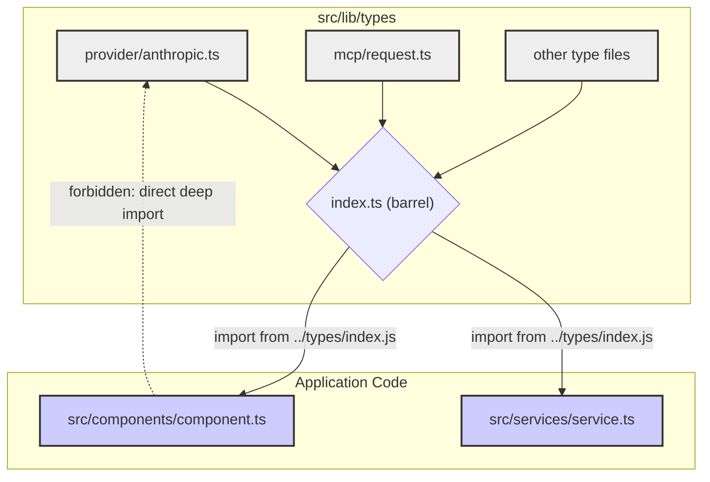

We built NeuroLink's type system on a simple, brutal principle: any type definition ambiguity that *could* cause a production incident *will* cause a production incident. This wasn't theoretical. An early incident involving a subtle type mismatch between our internal representation and a new provider's payload from Anthropic led to a cascade of `undefined` errors that took down a critical user-facing service. The post-mortem was clear: our TypeScript conventions were too loose. To enforce discipline at scale across dozens of engineers and multiple AI providers like OpenAI and Vertex AI, we encoded our hard-won lessons into a set of ten custom ESLint rules. They aren't just style suggestions; they are the steel frame of our application's stability.

The core philosophy is simple: all shared types for the entire NeuroLink application must live in one, and only one, directory: `src/lib/types/`. No exceptions. This isn't just about tidiness. It's about creating a single, unambiguous source of truth that the rest of the application can consume. When you're dealing with dozens of rapidly evolving AI models, as we discuss in [Dynamic Model Selection: Routing AI Requests at Runtime](/posts/dynamic-model-selection-runtime/), a fragmented type system is a recipe for disaster.

This centralized approach prevents "type drift," where different parts of the application have slightly different, incompatible definitions for what should be the same entity. To enforce this, we started with rules that dictate location.

## The "Where Does This Type Live?" Problem

New engineers, especially those coming from projects with different conventions, would often create types where they were needed: a local types folder sitting right next to a component instead of in the canonical location. This seems logical at first, but it quickly leads to a tangled mess of dependencies and duplicate definitions.

We forbid this with `neurolink/no-local-types-folder`.

```typescript
// src/lib/server/providers/openai/new-feature.ts

// This file will get flagged immediately.
// ERROR: A local 'types' folder is not allowed. Move to src/lib/types/ (CLAUDE.md Critical Rule 11).
import { MyNewFeatureTypes } from './types'; 

// ... implementation
```

The rule `neurolink/no-local-types-folder` aggressively flags any directory named `types` outside of the canonical `src/lib/types/`. Similarly, we prevent developers from creating one-off type aliases in component files with `neurolink/no-local-type-alias`.

A developer might be tempted to do this for a quick fix:

```typescript
// src/lib/server/some-handler.ts

// This looks innocent, but it's a hidden source of truth.
type RequestContext = {
  userId: string;
  traceId: string;
};

// ERROR: Type alias `RequestContext` must live in src/lib/types/, not here.
// (from rule neurolink/no-local-type-alias)
export function handleRequest(context: RequestContext) {
  // ...
}
```

The fix is always the same: move the type definition to its own file within `src/lib/types/` and import it back. This forces a global, shared understanding of what `RequestContext` is.

Finally, `neurolink/no-type-export-outside-types` completes the lockdown. It ensures that the *only* place a `export type` statement can appear is inside the `src/lib/types/` directory. This prevents other modules from becoming secondary sources of truth for types.

## The Global Namespace Collision Nightmare

Once all types are in one place, a new problem emerges: name collisions. In a small project, `Request` or `Response` are fine type names. In NeuroLink, which integrates with dozens of APIs from OpenAI, Anthropic, Gemini, and more, a generic name is a time bomb. Whose `Request` is it? Is it an MCP request, a provider request, or an internal API request?

We saw this happen. Two different teams working on different provider integrations both defined a `Message` type. They were structurally similar but semantically different. When they were eventually used together, chaos ensued.

Our solution is twofold. First, `neurolink/unique-type-names` scans all files in `src/lib/types/` and throws an error if the same type name is declared in more than one file.

The error message is explicit:

```text
Type name "Message" is already declared in src/lib/types/openai/messages.ts. Use a domain prefix (e.g. Client*, Server*, Mcp*) to disambiguate.
```

This forces developers to be specific — names like OpenAiMessage, ClaudeMessage, or McpMessage. There is no ambiguity.

Second, we enforce clean filenames with `neurolink/no-types-suffix-filename`. A file named RequestTypes.ts inside the types directory is redundant — the directory already tells us it holds types, so the rule forces a rename. The before-and-after is simple:

```typescript
// BAD: src/lib/types/mcpTypes.ts
// ERROR: File "mcpTypes.ts" has redundant suffix. The folder IS the types folder — rename to drop the "Types"/"Type" suffix.
export type McpRequest = { /* ... */ };

// GOOD: src/lib/types/mcp.ts
export type McpRequest = { /* ... */ };
```

This keeps the type directory clean, readable, and easy to navigate.

## Enforcing a Single, Barrel-Chested Source of Truth

So, all types live in `src/lib/types/` in uniquely named files. How do we consume them? The temptation is to write deep import paths:

```typescript
import { AnthropicRequest } from '../../../lib/types/provider/anthropic/request';
```

This is brittle. If we refactor the `types` directory, we break hundreds of imports. It also exposes the internal structure of our types library to the entire application.

The solution is a barrel file: `src/lib/types/index.ts`. This file has two strict rules enforced by our linters.

First, `neurolink/types-barrel-exports-only` ensures the barrel file does nothing but re-export types from other files using wildcard exports. It cannot define its own types or perform selective exports.

```typescript
// src/lib/types/index.ts

// GOOD:
export * from './mcp/request';
export * from './provider/openai/chat';

// BAD:
// ERROR: The types barrel must not define types locally...
export type LocalThing = { id: string };

// ERROR: The types barrel must use `export *` only. Found a selective / aliased export.
import { SomeType as AliasType } from './some/place';
export { AliasType };
```

Second, `neurolink/barrel-type-imports` forces every other file in the application to import types *only* through this barrel.

The linter will catch this:

```typescript
// BAD: Direct import
import { OpenAiChatCompletion } from 'src/lib/types/provider/openai/chat';

// Linter messageId 'useBarrel':
// Import internal types via the barrel (`../types/index.js`) instead of `src/lib/types/provider/openai/chat`.
```

And demand this:

```typescript
// GOOD: Barrel import
import { OpenAiChatCompletion } from '../types/index.js';
```

This combination creates a powerful abstraction layer. The rest of the app interacts with a single, stable type interface — the ../types/index.js barrel — while the `types` directory itself can be internally reorganized without breaking anything. This is a key enabler for the kind of deep system analysis we describe in [OpenTelemetry for AI: Tracing Every Token Through Your Pipeline](/posts/opentelemetry-ai-observability/).

Here is a diagram of the intended flow:



## Banning Type System Footguns

With the structure locked down, we moved on to eliminating language features that, while useful in other contexts, proved to be footguns in our large, multi-team codebase.

The first to go was `interface`. The ability for interfaces to be extended via declaration merging is a powerful feature, but for a centralized type system, it's a liability. It creates "spooky action at a distance," where a file can modify a type defined elsewhere, making it impossible to reason about a type's shape by looking at its definition.

Therefore, `neurolink/no-interface` was born.

```typescript
// BAD:
// ERROR: Use `type Client = {...}` instead of `interface Client`.
interface Client {
  id: string;
}

// GOOD:
type Client = {
  id: string;
};
```

We allow `interface` *only* inside `declare global {}` blocks (for augmenting the global scope), a rare and explicit exception. For our own code, it's `type` all the way down.

The second footgun was untyped errors from our provider integrations. An early version of our provider abstraction layer allowed `formatProviderError` functions to return a generic `Error`. This led to top-level handlers that were just a giant `if (e.message.includes(...))` block, which is fragile and unreliable.

The `neurolink/provider-typed-errors` rule enforces that any error formatting function must return one of our specific, typed error classes.

```typescript
// in a provider adapter...

// BAD:
// ERROR: Provider `formatProviderError` must return a typed error...
function formatProviderError(err: any): Error {
  if (err.statusCode === 401) {
    return new Error('Authentication failed');
  }
  return new Error('Generic provider error');
}

// GOOD:
function formatProviderError(err: any): NeuroLinkError {
  if (err.statusCode === 401) {
    return new AuthenticationError({ message: 'Authentication failed' });
  }
  if (err.statusCode === 429) {
    return new RateLimitError({ message: 'Rate limit exceeded' });
  }
  return new ProviderError({ message: 'Generic provider error' });
}
```

This strictness at the provider boundary allows the rest of our system to handle errors with type-safe `catch` blocks, making our error handling far more robust. This is a prerequisite for building reliable systems, a theme we explore further in [How We Test NeuroLink: 20 Continuous Test Suites and Counting](/posts/neurolink-testing-20-test-suites/).

## Securing the Codebase, One Regex at a Time

Finally, one of our most critical rules has nothing to do with type structure, but everything to do with the consequences of working with sensitive data: `neurolink/no-inline-secret-regex`.

Our platform handles API keys for dozens of services. These keys *must never* appear in logs. In the early days, developers would write ad-hoc regexes to sanitize log data.

```javascript
// This looks fine, but it's a maintenance nightmare.
const sanitizedLog = JSON.stringify(data).replace(/"(sk-[a-zA-Z0-9]+)"/g, '"***"');
```

The problem is that we now have dozens of these one-off regexes scattered across the codebase. If OpenAI changes its key format, we have to find and update all of them. If a developer writes a slightly incorrect regex, we might leak a key.

The rule `neurolink/no-inline-secret-regex` bans this practice entirely. It detects regex literals that look like they're trying to match secrets and fails the build.

The error message directs the developer to the right solution:

```text
Inline secret-redaction regex `...` is forbidden — use `sanitizeForLog` from src/lib/utils/logSanitize.js so all callers stay consistent and any pattern updates happen in one place.
```

This forces all sanitation to go through a single, audited utility function. It's a simple rule, but it provides a massive security and maintenance win.

These ten rules, born from production incidents and hard-won experience, form the backbone of NeuroLink's TypeScript architecture. They are strict, sometimes inconvenient, but they enable us to build a complex, multi-provider AI platform with confidence, knowing that an entire class of errors has been systematically eliminated.

---

---

---

**Related posts:**

- [How We Test NeuroLink: 20 Continuous Test Suites and Counting](/posts/neurolink-testing-20-test-suites/)
- [OpenTelemetry for AI: Tracing Every Token Through Your Pipeline](/posts/opentelemetry-ai-observability/)
- [Dynamic Model Selection: Routing AI Requests at Runtime](/posts/dynamic-model-selection-runtime/)
