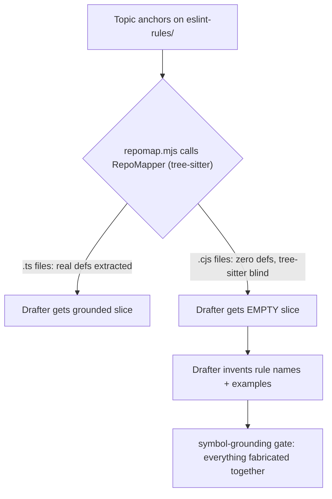

The draft was titled "Thirteen ESLint rules that hold NeuroLink's type system together." NeuroLink's ESLint plugin has ten rules. The drafter had invented three more — plausible-sounding names, plausible-sounding messages, sitting next to seven real ones in the same paragraph. Nothing about the prose gave it away; the fabricated rules read exactly like the real ones, because they were generated by the same model, in the same voice, from the same prompt. The only way to tell them apart was to go and check whether `eslint-rules/<name>.cjs` actually existed. That check is the subject of this post: a gate called symbol-grounding, and the infrastructure bug that made it blind on the exact topic it was supposed to protect.

## What the gate actually does

`scripts/factory/lib/gates/symbol-grounding.mjs` is gate 2 in the content factory's pipeline. Its job is narrow and mechanical on purpose: scan a draft's prose for every backticked identifier, and for each one, prove it refers to something real in the NeuroLink repository. Fenced code blocks are exempt — `stripFencedCode()` strips them before scanning, because code is allowed to use illustrative names — but anything backticked inline, in a sentence, has to check out.

```javascript
function stripFencedCode(body) {
  // Skip fenced ```code blocks``` — code is allowed to reference anything.
  // We only fact-check prose backticks.
  return body.replace(/```[\s\S]*?```/g, '');
}

function extractBacktickedTokens(body) {
  const prose = stripFencedCode(body);
  const tokens = new Set();
  const re = /`([^`\n]{1,80})`/g;
  let m;
  while ((m = re.exec(prose)) !== null) {
    const raw = m[1].trim();
    if (!raw) continue;
    if (ALLOWLIST.has(raw)) continue;
    if (MIME_TYPE.test(raw)) continue;
    if (/^\d+(\.\d+)?$/.test(raw)) continue; // pure number
    if (raw.length < 2) continue;
    tokens.add(raw);
  }
  return Array.from(tokens);
}
```

That's the whole extraction step: pull every `` `token` `` out of the prose, throw out the ones that are obviously not repo symbols (a short `ALLOWLIST` covers TS/JS keywords, Node globals, common CLI tools, and external SDK names like `OpenAI` or `MCP` that will never live inside the NeuroLink repo), and hand the rest to a verifier.

Nothing about that verifier is an LLM call. That's deliberate — the code comment at the top of the file spells out why:

```javascript
// Gate 2' — Symbol Grounding (deterministic, full-repo)
//
// Replaces the old groundedness gate's LLM-extracted-claims-against-touched-files
// pattern. We now:
//   1. Scan the draft body for every backticked identifier.
//   2. Classify each as a path-like or symbol-like token.
//   3. Search the WHOLE NeuroLink repo via git ls-files + git grep.
//   4. PASS if >= threshold% of identifiers map to a real file/symbol.
//
// No LLM call. Fast. Deterministic across runs. Catches actual fabrications
// (invented names) while accepting real symbols the drafter knows from the
// public repo even if they weren't in the commit's touched_files list.
```

The earlier version of this gate — asking a model whether a draft's claims matched the files touched by the commit it was written about — had a structural weakness: it could only check claims against a narrow slice of "touched" files, so a real symbol from anywhere else in the repo looked exactly as suspicious as an invented one. Replacing that with `git grep` against the whole tree removes the ambiguity. A symbol either exists in `src/**`, `docs/**`, `eslint-rules/**`, or `test/**`, or it doesn't.

## Classify first, then verify

Not every backticked token is a function name. A gate that tried to `git grep` a version number or a commit SHA the same way it greps a symbol would waste time and get the wrong answer, so the first step is classification:

```javascript
function classifyToken(t) {
  if (/^neurolink\/[a-z][a-z0-9-]+$/.test(t)) return 'eslint-rule';
  if (/^[0-9a-f]{7,40}$/.test(t)) return 'sha';
  if (/[/\\]/.test(t)) return 'path';
  if (/\.(ts|tsx|js|mjs|cjs|json|md|yaml|yml|sh|py)$/i.test(t)) return 'filename';
  if (/^v?\d+\.\d+/.test(t)) return 'version';
  if (/^[A-Z][A-Za-z0-9_]+$/.test(t)) return 'symbol'; // PascalCase class
  if (/^[a-z][A-Za-z0-9_]*$/.test(t)) return 'symbol'; // camelCase function
  if (/^[A-Z_][A-Z0-9_]+$/.test(t)) return 'symbol'; // SCREAMING_SNAKE constant
  if (/^[A-Za-z][A-Za-z0-9_.]+$/.test(t)) return 'symbol'; // dotted ref
  return 'phrase';
}
```

Each kind gets its own verification strategy in `verifyToken()`: a `path` or `filename` is checked with `git ls-files`, a `version` is checked against `CHANGELOG.md`, a `sha` is checked with `git cat-file -e`, and a plain `symbol` is checked with `git grep -l -F`. The messiest case is `phrase` — something that didn't parse cleanly as any of the above, usually because a drafter wrote something like "the `tool:start` event" or a hyphenated compound. `verifyPhrase()` tries the literal string first, and only falls back to pulling out the longest camelCase or PascalCase word inside it if the literal doesn't match:

```javascript
function verifyPhrase(phrase) {
  // 1. Direct grep for the literal phrase (catches event names like tool:start).
  const literal = gitGrepSymbol(phrase);
  if (literal) return literal;
  // A kebab/dotted literal (`gpt-5.4`, `model-access-denied`) must match as
  // written: falling back to one of its words let an invented `gpt-9.9-ultra`
  // ground on any file containing "ultra".
  if (/-/.test(phrase) && /^[A-Za-z0-9][A-Za-z0-9._:-]*$/.test(phrase)) return null;
  // 2. Pull out the longest camelCase / PascalCase word and re-check.
  const camelMatches = phrase.match(/[a-z][a-zA-Z0-9_]{3,}|[A-Z][a-zA-Z0-9_]{3,}/g) || [];
  for (const word of camelMatches.sort((a, b) => b.length - a.length)) {
    const hit = gitGrepSymbol(word);
    if (hit) return `${hit} (matched word: ${word})`;
  }
  return null;
}
```

That guard against falling back to a substring match on a kebab-case or dotted literal is there because the naive version of this function would accept almost anything: an invented model name like `gpt-9.9-ultra` would "ground" simply because some file somewhere contains the word `ultra`. Requiring a kebab or dotted token to match as written closes that hole.

Once a token is scored, the gate totals things up and compares against a threshold:

```javascript
export async function runGate({ draftPath }) {
  if (!existsSync(`${NEUROLINK_REPO}/.git`)) {
    return { verdict: 'FAIL', detail: { error: `NEUROLINK_REPO not a git repo: ${NEUROLINK_REPO}` } };
  }
  const text = readFileSync(draftPath, 'utf8');
  const body = text.replace(/^---[\s\S]*?---\n/, '');
  const tokens = extractBacktickedTokens(body);

  if (tokens.length === 0) {
    return { verdict: 'PASS', detail: { tokens: 0, note: 'no backticked identifiers in prose' } };
  }

  const results = tokens.map(verifyToken);
  const grounded = results.filter((r) => r.grounded).length;
  const total = results.length;
  const pct = Math.round((grounded / total) * 1000) / 10;
  const ungrounded = results.filter((r) => !r.grounded).slice(0, MAX_REPORT);

  return {
    verdict: pct >= THRESHOLD ? 'PASS' : 'FAIL',
    detail: { total, grounded, grounded_pct: pct, threshold: THRESHOLD, ungrounded },
  };
}
```

`THRESHOLD` defaults to 95%, read from `SYMBOL_GROUNDING_THRESHOLD`. It isn't 100%, because a draft can legitimately reference one or two real-but-external names (a competitor's product, a standards body) that the allowlist doesn't happen to enumerate; the gate is tuned to catch systematic fabrication, not to demand a perfect allowlist.

## The blind spot: a drafter that couldn't see its own lint rules

Gate design is only half the story. On 2026-05-29, this exact machinery — solid on paper — completely failed to catch anything, on the one topic it should have caught the most: a post about NeuroLink's own ESLint rules. The rule files live in `eslint-rules/*.cjs`, and the drafter's context comes from a repository-mapping step (`repomap.mjs`) that walks the repo with a tree-sitter–based tool and hands the drafter a "slice" of real, citable definitions to write from.

Tree-sitter, in this pipeline's configuration, extracts definitions from TypeScript. It does not parse CommonJS `.cjs` files. So when a topic anchored on `eslint-rules/`, the slice the drafter received was empty — not sparse, empty — and an empty slice doesn't stop a drafting model from writing about the topic anyway. It just writes about it from its own training data, or from vibes. That is exactly how the earlier draft ended up with thirteen rules when there are ten: "thirteen" was, near as we can tell, the highest rule number referenced in `CLAUDE.md`'s numbered list of engineering rules — not a count of ESLint rules at all. The drafter had latched onto an adjacent number in its context and presented it as fact.



The fix was not to relax the gate — a weaker gate would have let the thirteen-rule draft through, which defeats the entire point. The fix was to give the drafter real evidence for a source format the existing tooling couldn't see.

## Fixing the blind spot: a deterministic .cjs parser

`scripts/factory/lib/eslint-rules-evidence.mjs` is a new, narrow module whose only job is to parse the NeuroLink ESLint plugin's actual source — not summarize it, not ask a model about it, parse it — into structured, citable facts. It reads `eslint-rules/index.cjs`, which both documents each rule in a JSDoc-style comment and registers it:

```javascript
// index.cjs documents each rule in a JSDoc block, e.g.
//   *   neurolink/no-interface   → Rule 7: No `interface` (except declare merging).
function parseDescriptions(indexSrc) {
  const map = {};
  const re = /neurolink\/([a-z0-9-]+)\s*→\s*(.+?)\s*$/gm;
  let m;
  while ((m = re.exec(indexSrc)) !== null) {
    map[m[1]] = m[2].replace(/\.+$/, '').trim();
  }
  return map;
}

// module.exports = { rules: { "<key>": require("./<key>.cjs"), ... } }
function parseRegisteredRules(indexSrc) {
  const keys = [];
  const re = /["']([a-z0-9-]+)["']\s*:\s*require\(/g;
  let m;
  while ((m = re.exec(indexSrc)) !== null) keys.push(m[1]);
  return keys;
}
```

For each registered rule, it also opens that rule's own `.cjs` file and pulls the `messageIds` and message text straight out of the `meta.messages` object — the same block ESLint itself reads at runtime to render an error:

```javascript
// messageIds + text from a rule file's `meta.messages` block. Best-effort:
// scoped to the messages object so we don't grab unrelated string literals.
function parseMessages(src) {
  const blockM = src.match(/messages\s*:\s*\{([\s\S]*?)\n\s*\}/);
  const block = blockM ? blockM[1] : '';
  const out = [];
  const re = /([A-Za-z_][A-Za-z0-9_]*)\s*:\s*(['"`])(.*?)\2/g;
  let m;
  while ((m = re.exec(block)) !== null) {
    const text = m[3].trim();
    if (text.length >= 4) out.push({ id: m[1], text });
  }
  return out;
}
```

`extractEslintRules()` ties these together into a list of `{ name, file, description, messageIds, messages }` records — one per real rule, keyed by the actual filename on disk — plus a flat `symbols` set that includes each rule's full `neurolink/<rule>` name, every messageId, and a handful of ESLint authoring terms (`meta`, `create`, `context`, `messageId`, `fixable`, `schema`) that show up across every rule file and are therefore genuinely grep-able. `renderEslintRules()` then formats that list into a block the drafter's prompt can read directly, and it says the count out loud on purpose:

```javascript
export function renderEslintRules(rules) {
  if (!rules || !rules.length) return '';
  const lines = [
    'CUSTOM ESLINT RULES (real — parsed from eslint-rules/index.cjs + each rule file).',
    `There are EXACTLY ${rules.length} custom rules. Write about THESE rules by name; do not invent additional rules or rename them.`,
    'Each `neurolink/<rule>` name and each messageId below is a real, citable symbol.',
    '',
  ];
  for (const r of rules) {
    lines.push(`# \`${r.name}\`  (${r.file})`);
    if (r.description) lines.push(`  what: ${r.description}`);
    if (r.messageIds.length) lines.push(`  messageIds: ${r.messageIds.join(', ')}`);
    for (const msg of r.messages.slice(0, 2)) {
      lines.push(`  message[${msg.id}]: "${msg.text.slice(0, 160)}"`);
    }
    lines.push('');
  }
  return lines.join('\n');
}
```

That "EXACTLY N" line matters as much as the rule names themselves — the earlier failure wasn't only about inventing names, it was about inventing a count. Telling the drafter the count explicitly, sourced from the same parse that produced the names, closes both holes at once.

`repomap.mjs` wires this in as a fallback path, triggered only when a topic's anchor paths actually touch `eslint-rules/`, and it degrades gracefully if the main repo-mapper is itself unavailable:

```javascript
const wantsEslint = [...anchorPaths, ...extraPaths].some((p) => /(^|\/)eslint-rules(\/|$)/.test(p));
const eslint = wantsEslint ? extractEslintRules(repoRoot) : { rules: [], symbols: [], present: false };

try {
  ensureRepoMapper();
} catch (e) {
  if (eslint.present) {
    return { files: [], symbols: eslint.symbols, eslint_rules: eslint.rules, file_count: 0, note: 'repomapper unavailable; eslint-only slice' };
  }
  throw e;
}
```

Notice the shape of that fallback: if the tree-sitter tool throws entirely, and this topic has ESLint evidence available, the pipeline doesn't fail the topic — it serves the `.cjs`-derived slice on its own. The `eslint_rules` field rides alongside the usual `files`/`symbols` output all the way through `buildRepoMapSlice()`, so a topic anchored partly in TypeScript and partly in `eslint-rules/` gets both kinds of evidence merged into one slice.

## Teaching the gate the new symbol shape

Real evidence flowing to the drafter fixes half the problem. The other half is that `neurolink/<rule>` identifiers don't look like anything the gate's classifier already knew how to check — they contain a slash, which the classifier had always treated as a signal for a file path, and `git ls-files` was never going to find a path called `neurolink/no-interface` because that isn't a path at all; it's an ESLint rule ID. The gate needed a new branch:

```javascript
function classifyToken(t) {
  // ESLint rule identifiers (neurolink/<rule>) contain a slash but are NOT file
  // paths — ground them against the eslint-rules/ plugin, not git ls-files.
  if (/^neurolink\/[a-z][a-z0-9-]+$/.test(t)) return 'eslint-rule';
  if (/^[0-9a-f]{7,40}$/.test(t)) return 'sha';
  if (/[/\\]/.test(t)) return 'path';
  // ...
}
```

and its own verification path in `verifyToken()`:

```javascript
case 'eslint-rule': {
  // Real custom rule iff eslint-rules/<rule>.cjs exists. Invented rule
  // names (neurolink/made-up-rule) still fail — this is not a weakening.
  const base = token.split('/').pop();
  where = gitLsContains(`eslint-rules/${base}.cjs`) || gitGrepSymbol(base);
  break;
}
```

That comment — *"real rules pass, invented ones still fail — not a weakening"* — is the whole design constraint in one sentence. Adding a new classification branch is easy to get wrong in the direction of leniency: it would have been simpler to just add `eslint-rule` to a list of tokens the gate skips. Skipping it would have made the gate pass the thirteen-rule draft just as happily as a correct ten-rule one — it would have looked like a fix while removing the exact protection the post needed. Grounding `neurolink/<rule>` against the literal `.cjs` filename on disk means an invented rule name still fails the same way it always did; only the *real* rules newly pass, because they can now be found at all.

## Two more bugs that were quietly compounding the first one

The commit that shipped this fix (`a84e63a`, "ESLint .cjs grounding + infra repair; post #2 passes all gates") wasn't only about `.cjs` parsing. Its own message opens with two infrastructure failures that had been making the whole factory unable to ground *anything*, on any topic, for a stretch of time before the ESLint-specific bug was even diagnosed:

- **RepoMapper lived in `/tmp`.** The repo-mapping tool the drafter depends on was installed at `/tmp/RepoMapper` — a path that a reboot wipes clean. Once it was gone, every topic's repository slice came back empty, not just ESLint ones, and the drafter had nothing but its own guesses to write from. The fix moved it to a persistent path and changed the default so the ephemeral location can't recur:

  ```javascript
  // Persistent location (NOT /tmp — that gets wiped on reboot and silently
  // breaks grounding, which is what happened post-worktree-loss on 2026-05-29).
  const REPOMAPPER_PATH = process.env.REPOMAPPER_PATH ||
    '/Users/sachinsharma/Developer/temp/neurolink-fork/RepoMapper';
  ```

- **The daily verification cron was failing with exit 127.** `scripts/daily-verify.sh`, which runs from `launchd`, couldn't find `node` on its PATH — `launchd`'s environment doesn't inherit a shell's `nvm`-managed PATH the way an interactive terminal does. The fix sources `nvm` explicitly and extends the PATH before calling `node`:

  ```bash
  # Load nvm so `node` resolves even when launchd's PATH lacks it (fixes exit 127).
  export NVM_DIR="$HOME/.nvm"
  # shellcheck disable=SC1091
  [ -s "$NVM_DIR/nvm.sh" ] && . "$NVM_DIR/nvm.sh" >/dev/null 2>&1
  export PATH="$PATH:/opt/homebrew/bin:/usr/local/bin:$HOME/.pyenv/shims"
  ```

Neither of these bugs is glamorous, and neither one is specific to symbol-grounding — but both meant the gate was, for a period, running against a starved input (an empty repo slice) rather than a bad one. A gate can only be as good as the evidence it's checking a draft against; an empty evidence set makes every claim look equally unverifiable, real or fabricated, which is a worse failure mode than a gate that's merely strict.

## The last mile: telling illustrative code from a claimed fact

One more change in the same commit is worth calling out because it's about the *drafter's* contract, not the gate's logic. The drafting prompt's rule 11 used to read:

> **Symbol grounding** — every backticked identifier in prose must be a REAL symbol from the repository slice below. No invented file paths or function names.

That's correct as far as it goes, but it collides with something writers do constantly and reasonably: use a short illustrative name to make a point, e.g. "imagine a rule like `no-magic-numbers`" or "a file like `newFeature.ts`." Those aren't claims about NeuroLink's actual source — they're hypotheticals — but to the gate's regex, a backticked `newFeature.ts` looks exactly like an assertion that such a file exists. The updated rule draws the line explicitly:

> **Symbol grounding** — every backticked identifier IN PROSE must be a REAL symbol from the repository slice below (ESLint rule names like `neurolink/no-interface` and messageIds count as real). Hypothetical or illustrative identifiers — example file names, sample type names, made-up variables used ONLY to demonstrate a point — MUST appear ONLY inside fenced code blocks, NEVER in inline prose backticks. When in doubt, put the example in a fenced block. No invented file paths or function names in prose.

Because `stripFencedCode()` already exempts fenced code from the scan, this is a change to the drafter's *writing convention*, not the gate's *checking logic* — moving illustrative names into fenced blocks is free, and it's a much better signal to a reader anyway: a fenced block already reads as "here is an example," where an inline backtick reads as "here is a fact."

The retry loop got one more small but important upgrade in the same commit. `pipeline.mjs`'s feedback-formatting function used to summarize an ungrounded finding by echoing back a truncated slice of surrounding text:

```javascript
for (const c of (d.ungrounded || []).slice(0, 5)) {
  lines.push(`  - UNGROUNDED: ${c.text?.slice(0, 200)} (${c.reason || 'no reason'})`);
}
```

It now names the exact token that failed:

```javascript
for (const c of (d.ungrounded || []).slice(0, 8)) {
  lines.push(`  - UNGROUNDED \`${c.token}\` (${c.kind}) — not a real repo symbol; remove it, replace with a real one, or move the example into a fenced code block.`);
}
```

A retry prompt that says *"the token `no-magic-numbers` isn't real — remove it, replace it, or fence it"* gives a rewriting pass something it can act on directly. A retry prompt that echoes two hundred characters of surrounding prose makes the model re-derive which word was the problem, which is exactly the kind of ambiguity a deterministic gate exists to remove in the first place.

## What passing looked like

The commit message records the outcome plainly: with `eslint-rules-evidence.mjs` feeding real evidence into the slice, and `symbol-grounding.mjs` able to check `neurolink/<rule>` tokens against that evidence, the corrected draft — "Ten ESLint rules that hold NeuroLink's type system together," the piece that runs right alongside this one in this blog's own history — passed all seven hard gates plus both advisory checks. Ten rules, not thirteen. Every rule name backed by a real file on disk; every messageId backed by a real `meta.messages` block a reader could go check for themselves.

That is the actual point of a deterministic gate over an LLM-judged one: it doesn't get talked out of a wrong answer by fluent prose, and it doesn't need to be smarter than the model that generated the draft — it just needs to check one narrow, mechanical thing correctly, every time, for every backticked word.

## Where this leaves the pipeline

Symbol-grounding is one gate among several in this factory — narrative-opening, numerical-claims, and a handful of others each check a different failure mode a drafting model can produce. What makes this one distinctive is that its failure mode wasn't in the gate's own logic; the regex-and-git-grep machinery was sound from the start. The failure was upstream, in what the drafter was allowed to see before it ever started writing. A gate that checks a claim against nothing will always say the claim is unverifiable, and "unverifiable" is not the same signal as "false" — which is exactly why fixing the evidence pipeline, not loosening the gate, was the only fix that didn't trade one kind of wrong answer for another.

---

**Related posts:**

- [Ten ESLint rules that hold NeuroLink's type system together](/posts/ten-eslint-rules-that-hold-neurolink-s-type-system-together/)
- [How We Test NeuroLink: 20 Continuous Test Suites and Counting](/posts/neurolink-testing-20-test-suites/)
- [Structured Output from LLMs: JSON Schema Validation in TypeScript](/posts/structured-output-llm-json-schema-typescript/)
