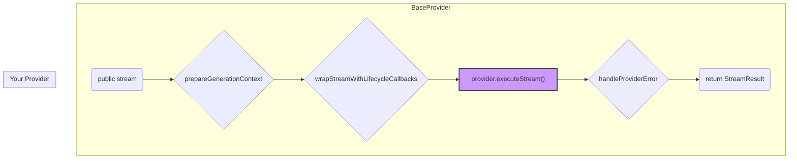

We designed NeuroLink's `BaseProvider` because every new model integration felt like starting from scratch. Adding Anthropic's Claude 3.5 Sonnet shouldn't require re-writing authentication, context management, and tool handling that we'd already perfected for OpenAI's GPT-4o and Google's Gemini on Vertex AI. Before `BaseProvider`, each new provider was a bespoke, monolithic class. The result was a constant drift in features, inconsistent error handling, and a testing matrix that was impossible to manage. The `BaseProvider` establishes a core contract: you implement the handful of methods unique to your target API, and you inherit a battle-tested engine for everything else.

This post is a deep-dive into that contract. We'll look at the abstract methods you *must* override, the rich suite of concrete functionality you get for free, and how this architecture lets us add a new provider in hours, not weeks.

## The Core Contract: What You Must Implement

When you `extend BaseProvider`, you are signing a contract. Your new class must provide implementations for a handful of abstract methods that define the provider's unique identity and core generation logic. Everything else is optional.

Here are the non-negotiables:

- `getProviderName()`: A simple string to identify the provider (e.g., "anthropic", "openai").
- `getDefaultModel()`: The default model ID to use if the user doesn't specify one.
- `getAISDKModel()`: Returns the underlying AI SDK's model object.
- `formatProviderError()`: Translates provider-specific API errors into a standardized `Error` format.
- `executeStream()`: The big one. This is where you write the actual code to call the provider's streaming generation API.

A skeleton for a new provider looks like this. Note that this is the *entire* required surface area.

```typescript
import { BaseProvider, AIProviderName, StreamOptions } from '@juspay/neurolink';
import { LanguageModel } from 'ai';

export class MyNewProvider extends BaseProvider {
  protected getProviderName(): AIProviderName {
    return 'mynewprovider';
  }

  protected getDefaultModel(): string {
    return 'super-model-v1';
  }

  protected async getAISDKModel(): Promise<LanguageModel> {
    // Fetch or construct the model object required by the
    // underlying 'ai' package, then return it.
    throw new Error('Not implemented: return the ai-SDK LanguageModel');
  }

  protected formatProviderError(error: unknown): Error {
    // Cast 'unknown' to the provider's specific error type
    // and extract the meaningful message.
    const message = (error as any)?.response?.data?.error?.message || 'Unknown provider error';
    return new Error(message);
  }

  protected async executeStream(
    options: StreamOptions,
  ): Promise<ReadableStream<Uint8Array>> {
    // 1. Get provider-specific credentials.
    // 2. Transform the generic 'options' into the provider's
    //    native request body format.
    // 3. Make the fetch() call to the provider's API endpoint.
    // 4. Return the response body stream directly.
    throw new Error('Not implemented: stream from your provider API');
  }
}
```

That's the deal. You handle the specifics of authenticating, formatting a request for your provider, and interpreting its errors. In return, you get a massive head start on building a production-ready integration.

## The `stream` vs. `executeStream` Call Chain

A common point of confusion is the relationship between the public `stream()` method and the protected `executeStream()` method you have to implement. A developer calls `provider.stream()`, but the provider-specific logic lives in `executeStream()`. What happens in between?

The `BaseProvider`'s public `stream()` method is a conductor orchestrating a complex sequence of operations that you, the provider implementer, don't have to worry about. It wraps the core `executeStream()` call with critical lifecycle hooks, context preparation, error handling, and analytics.

The flow looks something like this:



Before your `executeStream()` is ever called, `BaseProvider` has already:

1. Called `prepareGenerationContext` to build the message history, inject the system prompt, and format tool definitions.
2. Initiated tracing and analytics, firing the `onStart` callback. This is fundamental to our observability strategy, which you can read about in [OpenTelemetry for AI: Tracing Every Token Through Your Pipeline](/posts/opentelemetry-ai-observability/).
3. Wrapped the entire operation in a robust error handler (`handleProviderError`) that catches failures, formats them using your `formatProviderError` implementation, and fires the `onError` lifecycle callback.

The public `stream()` method is the unified entry point; your `executeStream()` is the unique, provider-specific plug-in.

## What You Get For Free: A Tour of Inherited Power

Implementing five methods is the price of admission. The payoff is inheriting a suite of functionality that represents thousands of hours of engineering effort.

- **Unified `generate()` and `stream()` APIs**: If you implement `executeStream()`, you get the non-streaming `generate()` method for free. `BaseProvider` implements `generate()` by simply calling `stream()` and consuming the entire result, giving users a consistent interface for both modes. This is handled by the `executeStandardGenerateFlow` method.

- **Automatic Lifecycle Callbacks**: The `wrapStreamWithLifecycleCallbacks` method is the engine for our entire instrumentation and analytics pipeline. It ensures that every generation, whether streaming or not, emits consistent `onStart`, `onToken`, `onCompletion`, and `onError` events. You don't write a single line of code for this.

- **Robust Error Handling**: The default `handleProviderError` logic in `BaseProvider` catches common network issues, timeouts, and other problems before they even reach your provider-specific code. When an error *does* come from the provider API, it's routed through your `formatProviderError` method to create a clean, standardized error message for the end user.

    ```typescript
    // src/lib/providers/openAI.ts
    public formatProviderError(error: unknown): Error {
      if (isAPIError(error)) {
        const message = error.message;
        // ... specific OpenAI error parsing ...
        return new Error(`OpenAI Error: ${message}`);
      }
      return new Error(String(error));
    }
    ```

- **Full Tool & Function Calling Support**: `BaseProvider` contains all the logic for managing tool use. It calls `getToolsForStream` to assemble available tools, uses `applyToolFiltering` to respect user-provided constraints, and automatically synthesizes the response if the model requests a tool call.

- **Automatic Context Management**: The `buildMessages` method is a sophisticated piece of logic that takes a high-level `StreamOptions` object and constructs the exact `messages` array a provider expects. It correctly orders system prompts, user messages, AI responses, and tool calls, managing the complexities of conversation history for you.

- **Image and Video Generation**: The `handleVideoGeneration` and `executeImageGeneration` methods provide standardized entry points for multi-modal generation. If your provider supports these, you can hook into these flows rather than inventing your own.

- **Embedding Endpoints**: You get `embed()` and `embedMany()` out of the box. `BaseProvider` provides a base implementation that will throw a "not supported" error, but you can easily override it by implementing the provider-specific `callEmbeddings` method.

    ```typescript
    // src/lib/providers/openAI.ts
    export class OpenAIProvider extends OpenAIChatCompletionsProvider {
      // ...
      protected override async executeImageGeneration(
        options: ImageGenerationOptions,
      ): Promise<ImageGenerationResult> {
        // ...
      }

      private async callEmbeddings(
        texts: string[],
        modelName: string,
      ): Promise<number[][]> {
        // ...
      }
      // ...
    }
    ```

This inherited functionality is a core part of our strategy for scaling AI development. It lets us focus on the unique capabilities of new models, knowing that the foundation is stable, observable, and consistent. This consistency is also critical for higher-level features like [Dynamic Model Selection: Routing AI Requests at Runtime](/posts/dynamic-model-selection-runtime/).

## The Provider as a Pluggable Component

The power of this pattern is clear when you look at our real-world providers. The `AnthropicProvider` and `GoogleVertexProvider` both extend `BaseProvider`, but their implementations of the core contract are tailored to their respective platforms.

For example, the `GoogleVertexProvider` has a massively complex `generate` method because it has to support both Gemini models and proxied Anthropic models on Vertex AI. It contains specialized logic like `executeNativeGemini3Generate` and `executeNativeAnthropicGenerate`.

```typescript
// src/lib/providers/googleVertex.ts
export class GoogleVertexProvider extends BaseProvider {
  // ...
  async generate(
    optionsOrPrompt: TextGenerationOptions | string,
  ): Promise<TextGenerationResult> {
    // ... complex logic to delegate to the correct native SDK
    if (isAnthropicModel) {
      return this.executeNativeAnthropicGenerate(options);
    } else {
      return this.executeNativeGemini3Generate(options);
    }
  }
  // ...
}
```

In contrast, the `AnthropicProvider` is much simpler because it only targets the Anthropic API. Its methods, like `getAuthHeaders`, are direct and focused.

By enforcing a small, stable contract via `BaseProvider`, we allow for this diversity in implementation while ensuring that from the outside, every provider behaves predictably. This is how we can build complex systems on top of a rapidly changing ecosystem of AI models, and it's a key reason our testing strategy, detailed in [How We Test NeuroLink: 20 Continuous Test Suites and Counting](/posts/neurolink-testing-20-test-suites/), is even feasible. The base class provides the seams and intercepts needed to validate behavior across all providers.

## Five Methods In, A Platform Out

You write five methods. You get a platform.

Four of them just describe your provider. `executeStream` does the real work. That is the whole contract.

In return, `BaseProvider` runs the lifecycle. It builds the context. It fires the callbacks. It catches the errors. It records the metrics. Your code never touches that machinery, and it never has to.

Here is what lands in your class the moment you extend it:

- `generate()` — the non-streaming path, built on your `executeStream`.
- `wrapStreamWithLifecycleCallbacks` — the `onStart`, `onToken`, and `onError` events.
- `handleProviderError` — network, timeout, and rate-limit recovery.
- `applyToolFiltering` and `getToolsForStream` — the whole tool-use pipeline.
- `embed()` and `embedMany()` — embeddings, ready to override.

None of that is yours to write. You inherit it all on day one.

This is also why our providers stay small. The `AnthropicProvider` is a few hundred lines. The `GoogleVertexProvider` runs larger, but only because Vertex hosts two model families at once. Neither one re-implements the lifecycle. Both lean on the base class for it.

That asymmetry is the point. The shared code is large. The per-provider code is small. The base class carries the weight, so each integration stays light.

It also means bugs get fixed once. A retry fix in `handleProviderError` reaches every provider at the same time. You do not chase the same fix across five files. You change the base class, and it lands everywhere.

The win is speed. A new model lands in hours. The chassis is already built, tested, and observable. You just plug in the part that is genuinely new.

---

---

**Related posts:**

- [OpenTelemetry for AI: Tracing Every Token Through Your Pipeline](/posts/opentelemetry-ai-observability/)
- [Live Documentation: Building an MCP Docs Server Inside Docusaurus](/posts/docusaurus-mcp-docs-server/)
- [Dynamic Model Selection: Routing AI Requests at Runtime](/posts/dynamic-model-selection-runtime/)
