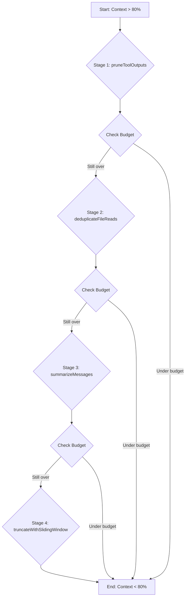

We designed NeuroLink's context compaction pipeline after a long-running support agent, powered by Anthropic's Claude, suddenly failed mid-conversation. The agent had been summarizing Bitbucket diffs and Jira issues for hours. The context window was full. The error from the provider API was clear: too many tokens. We needed an automated, multi-stage process to shrink the conversation history without losing critical information, and we needed it to run transparently before every single model call. The result is the `ContextCompactor`, a four-stage pipeline that ensures even the longest conversations fit within the model's limits.

## The Context Budget and the Compaction Trigger

Everything starts with the budget. Before NeuroLink sends a request to a provider, it runs a pre-flight check: `checkContextBudget`. This function is the gatekeeper. It calculates the token count of the current message history and compares it against the target model's maximum context window. The function returns a structured object detailing the token usage and whether compaction is recommended.

If the usage ratio exceeds our configured `DEFAULT_COMPACTION_THRESHOLD` of 0.8, the function signals that compaction is needed. This proactive check prevents the system from hitting the hard context limit and receiving an error from the provider API in the first place.

Of course, some errors are unavoidable. Different models and providers report context overflow in unique ways. Our `isContextOverflowError` function maintains a registry of provider-specific error patterns, from message text to API error codes. It uses helpers like `getContextOverflowProvider` to identify the source and `parseProviderOverflowDetails` to normalize the error structure. If we receive an error post-flight, this detector gives us a structured way to confirm the root cause and trigger compaction before retrying the call. A recognized overflow, parsed via `extractErrorMessage`, results in a typed `ContextBudgetExceededError`, which our retry logic is built to handle.

```typescript
// src/lib/context/budgetChecker.ts
export function checkContextBudget(
  messages: ChatMessage[],
  model: Model,
): ContextBudget {
  const tokenCount = countTokens(messages);
  const maxTokens = model.contextWindow;
  const usageRatio = tokenCount / maxTokens;

  return {
    tokenCount,
    maxTokens,
    usageRatio,
    shouldCompact: usageRatio > DEFAULT_COMPACTION_THRESHOLD,
  };
}
```

This proactive budgeting is the first line of defense, turning a hard failure into a graceful degradation. This is a core principle for us, and one we validate in our regression tests. You can read more about our general approach in [How We Test NeuroLink: 20 Continuous Test Suites and Counting](/posts/neurolink-testing-20-test-suites/).

## The Four-Stage Compaction Pipeline

When `checkContextBudget` returns `shouldCompact: true`, NeuroLink invokes the `ContextCompactor`. This class orchestrates a sequence of four distinct compaction strategies, ordered from least to most destructive in terms of information loss. The goal is to apply the minimum necessary force to bring the context back under budget.

The `compact` method is the entry point that runs each stage in order, checking the token count after every step. As soon as the context usage drops below the `DEFAULT_COMPACTION_THRESHOLD`, the process stops and returns the compacted message history. This short-circuiting behavior is crucial for efficiency.

```typescript
// src/lib/context/ContextCompactor.ts
export class ContextCompactor {
  constructor(private messages: ChatMessage[], private model: Model) {}

  async compact(): Promise<ChatMessage[]> {
    // Stage 1: Prune tool outputs
    let compactedMessages = pruneToolOutputs(this.messages);
    if (!this.isOverBudget(compactedMessages)) return compactedMessages;

    // Stage 2: Deduplicate file reads
    compactedMessages = deduplicateFileReads(compactedMessages);
    if (!this.isOverBudget(compactedMessages)) return compactedMessages;

    // Stage 3: Summarize messages
    compactedMessages = await summarizeMessages(compactedMessages);
    if (!this.isOverBudget(compactedMessages)) return compactedMessages;

    // Stage 4: Truncate with sliding window
    compactedMessages = truncateWithSlidingWindow(compactedMessages);
    return compactedMessages;
  }

  private isOverBudget(messages: ChatMessage[]): boolean {
    const budget = checkContextBudget(messages, this.model);
    return budget.shouldCompact;
  }
}
```



This staged approach ensures we preserve as much fidelity as possible, only resorting to heavier-handed techniques like summarization or truncation when absolutely necessary.

## Stage 1: Pruning Tool Outputs

The first and safest step is `pruneToolOutputs`. In long conversations involving many tool calls, the outputs from those tools can consume a massive number of tokens. A single API response from a tool can be thousands of tokens long, often in a verbose JSON format.

This stage walks the message history backwards and replaces the `content` of older `tool_result` messages with a placeholder message like `[Output pruned to save context]`. It leaves the most recent tool calls untouched, protecting a configurable number of tokens (`pruneProtectTokens`) from being cleared. This ensures the model has the immediate context it needs for its next turn.

We also use `generateToolOutputPreview` to create head-and-tail previews of large tool outputs *before* they are even inserted into the history. This function caps content at a size like the `DEFAULT_MAX_PREVIEW_BYTES` limit, preventing oversized tool results from bloating the context in the first place.

```json
// Before pruning
{
  "role": "tool",
  "tool_call_id": "call_abc123",
  "content": "{\"id\": 12345, \"status\": \"Closed\", ... 4000 tokens of JSON}"
}

// After pruning
{
  "role": "tool",
  "tool_call_id": "call_abc123",
  "content": "[Output pruned to save context. Original size: 4000 tokens.]"
}
```

This often frees up enough space on its own, especially for agents that act as tool orchestrators.

## Stage 2: Deduplicating File Reads

Developers often read the same file multiple times in a conversation. The `deduplicateFileReads` stage identifies when a user has attached the same file path more than once. When it finds duplicates, it removes all but the most recent `tool_result` corresponding to that file read. It identifies the relevant tool calls by matching the tool name and file path argument.

This optimization only commits its changes if it can achieve at least a 30% reduction in character count from the targeted messages. This prevents trivial changes and ensures the stage has a meaningful impact. If it only saves a handful of tokens, it's better to proceed to the next stage which might yield more significant savings.

```typescript
// src/lib/context/stages/fileReadDeduplicator.ts

// The logic identifies messages representing file reads
// from the same path and keeps only the last one.
export function deduplicateFileReads(
  messages: ChatMessage[],
  minSavingsThreshold = 0.3
): ChatMessage[] {
  const readsByPath = new Map<string, number[]>();
  // Group read message indices by file path
  messages.forEach((msg, index) => {
    if (msg.role === 'tool' && msg.tool_name === 'readFile') {
      const path = msg.tool_input.path;
      if (!readsByPath.has(path)) readsByPath.set(path, []);
      readsByPath.get(path)!.push(index);
    }
  });

  const indicesToRemove = new Set<number>();
  // Mark all but the last read for each path for removal
  for (const indices of readsByPath.values()) {
    if (indices.length > 1) {
      indices.slice(0, -1).forEach(i => indicesToRemove.add(i));
    }
  }

  // ... check savings against minSavingsThreshold before filtering ...
  return messages.filter((_, index) => !indicesToRemove.has(index));
}
```

## Stage 3: Structured Summarization

If pruning and deduplication are not enough, we move to active summarization. This is a significant step, as it replaces concrete message history with a generated summary. The `summarizeMessages` function, powered by the shared `SummarizationEngine`, is responsible for this.

The process is careful:

1. It splits the message history into a "keep" portion (the most recent messages) and a "summarize" portion (the oldest messages).
2. It uses `buildSummarizationPrompt` to construct a detailed prompt, instructing the model to create a summary structured into ten key sections (`SUMMARY_SECTIONS`), covering topics like key decisions, user preferences, and unresolved questions. This guides the model to extract the most salient information.
3. It calls the LLM via the `SummarizationEngine` to generate the summary. This engine may use a smaller, faster model specifically optimized for summarization tasks.
4. Finally, it replaces the "summarize" portion of the history with a single `system` message containing the new structured summary, often wrapped in `<condensed-summary>` tags.

```typescript
// src/lib/context/prompts/summarizationConstants.ts
export const SUMMARY_SECTIONS = [
  "Key decisions made",
  "Main topics discussed",
  "User's primary goal",
  "Key files or data mentioned",
  "Action items for the assistant",
  "Action items for the user",
  "Unresolved questions",
  "User preferences or constraints",
  "Technical discoveries",
  "Summary of the last few turns",
];
```

This is a more advanced form of context management, which you can read about in [Conversation Summarization: Smart Context Management for Long Chats](/posts/conversation-summarization-patterns/). The shared `SummarizationEngine` is also used by our persistent memory providers.

## Stage 4: Sliding Window Truncation

The final and most aggressive stage is `truncateWithSlidingWindow`. This is our implementation of the classic sliding window pattern. It simply deletes messages from the beginning of the conversation history until the token count is under the limit. It uses a helper, `findSplitIndexByTokens`, to efficiently calculate how many messages to remove.

It's a last resort because it results in total information loss for the removed messages. The logic is careful to preserve the `system` prompt and to avoid creating an invalid message sequence (e.g., an `assistant` message followed by another `assistant` message). The function `validateRoleAlternation` helps ensure the final history is well-formed by removing any orphaned roles.

After truncation, we run a `repairToolPairs` function to fix any broken `tool_call` and `tool_result` pairs that may have been separated by the truncation. This prevents sending a `tool_result` whose corresponding `tool_call` has been deleted, which would cause an API error.

```typescript
// Conceptual logic for repairing tool pairs
function repairToolPairs(messages: ChatMessage[]): ChatMessage[] {
  const toolCallIds = new Set<string>();
  // First pass: collect all tool_call_ids from assistant messages
  for (const msg of messages) {
    if (msg.role === 'assistant' && msg.tool_calls) {
      for (const call of msg.tool_calls) {
        toolCallIds.add(call.id);
      }
    }
  }

  // Second pass: filter out tool_result messages with no matching call
  return messages.filter(msg => {
    if (msg.role === 'tool') {
      return toolCallIds.has(msg.tool_call_id);
    }
    return true; // Keep all other messages
  });
}
```

## Managing History and State

Throughout this process, we are not just blindly deleting array elements. The `getEffectiveHistory` function provides a non-destructive view of the conversation, using tags to mark messages for different operations. This lets us plan the entire compaction before making a single destructive change.

- `tagForCondensation`: Marks messages that are candidates for being summarized.
- `tagForTruncation`: Marks messages that are candidates for being deleted.

These functions add metadata to each message object, which the `ContextCompactor` then reads. After the compaction plan is executed, `removeCondensationTags` and `removeTruncationTags` are called to clean up this metadata, leaving a pristine message array ready to be sent to the provider. This tagging mechanism allows us to reason about the compaction plan before making destructive changes.

```json
// Example of a message tagged for condensation
{
  "role": "user",
  "content": "Can you check the status of ticket PROJ-123?",
  "meta": {
    "compaction": "condense"
  }
}
```

## Handling Files and Budgets

File attachments present a unique challenge. A user can upload megabytes of source code, which would instantly overflow any model's context. The `FileSummarizationService` manages this. Its `checkAndSummarize` method is the primary entry point.

We enforce a separate budget for file content using `enforceAggregateFileBudget`, which ensures that file tokens do not exceed a configured percentage of the total context (`FILE_READ_BUDGET_PERCENT`, set to 0.6). The `calculateFileTokenBudget` function determines the available tokens for file content. It does this by taking the model's total window, subtracting a `NON_FILE_RESERVE` for prompts and conversation history, and then taking a fraction of the remainder.

If a file is too large, the `shouldSummarizeFiles` helper returns true, and `planFileSummarization` orchestrates a process to summarize it before its contents are ever injected into the main chat history. This process uses a specific `buildFileSummarizationPrompt`. Once all files are processed (and potentially summarized), their content is formatted and inserted into the prompt by `buildFileContextSection`. This entire subsystem is a critical part of the overall message flow that turns raw user input into a provider-ready request.

```typescript
// src/lib/context/files/budget.ts
function calculateFileTokenBudget(modelMaxTokens: number, historyTokens: number): number {
  const nonFileReserve = historyTokens + NON_FILE_RESERVE;
  const availableForFiles = modelMaxTokens - nonFileReserve;
  return Math.floor(availableForFiles * FILE_READ_BUDGET_PERCENT);
}
```

## The Last Resort

In the absolute worst-case scenario, where even after four stages of compaction the context is still too large (perhaps due to a single, massive message), `emergencyContentTruncation` is called. This function performs a brute-force truncation on the `content` field of the largest messages until the budget is met.

It operates at the character level, not the message level, using a binary search to quickly find a truncation point that gets the token count under the limit. It is a safety net to prevent a fatal error, but its use signals an extreme edge case. The `truncateSmallConversation` function handles the specific scenario where the entire history is only a few messages, but they are all too large to fit. We also use `estimatePostProcessingTokens` to leave a small buffer for any tokens that might be added during final prompt construction.

```typescript
// Conceptual logic for emergency truncation
function emergencyContentTruncation(messages: ChatMessage[], budget: number): ChatMessage[] {
  let currentTokens = countTokens(messages);
  if (currentTokens <= budget) {
    return messages;
  }

  // Find the message with the largest content field
  const largestMessage = findLargestMessage(messages);

  // Calculate how many characters to chop off
  const overflow = currentTokens - budget;
  const charsToCut = estimateCharsFromTokens(overflow);

  // Truncate the content of that message
  largestMessage.content = largestMessage.content.slice(0, -charsToCut) + "... [TRUNCATED]";

  return messages;
}
```

This multi-stage, progressively aggressive compaction strategy gives NeuroLink resilience against context window overflow, enabling robust, long-running conversations with AI agents that use tools, read files, and interact over extended periods.

---

---

**Related posts:**

- [Conversation Summarization: Smart Context Management for Long Chats](/posts/conversation-summarization-patterns/)
- [What You Actually Inherit When You Extend BaseProvider](/posts/what-you-actually-inherit-when-you-extend-baseprovider/)
