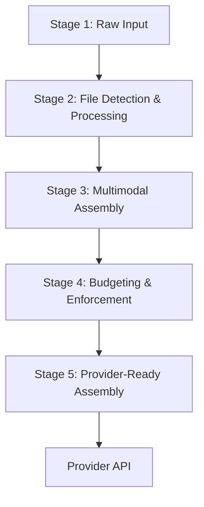

We built NeuroLink's message pipeline after a production incident took down a customer-facing chatbot. The root cause was a single user message containing a mix of text and an unsupported image format, which bypassed our validation, reached the Anthropic provider API as a malformed request, and triggered a cascading failure. The core problem wasn't just the image; it was the lack of a standardized, multi-stage process to sanitize, interpret, and structure user input before it ever touches a provider. Our ad-hoc validation checks were scattered, leading to gaps. That incident forced us to create a single, unified pipeline that converts any combination of user input into a provider-ready request.

A single user message can be deceptively complex. It might contain text, file paths, data URIs, or even raw image buffers. It could be a simple string or a rich array of mixed content types. Getting from that raw input to a valid, structured request for a specific model like Claude or Gemini is a multi-stage journey. In NeuroLink, we've formalized this into a five-stage flow that ensures every message is processed consistently, safely, and efficiently.

This flow is the backbone of our reliability, catching errors early and transforming messy inputs into the clean, structured data that provider APIs expect.



## Stage 1: Unifying Mixed Inputs

The first stage is normalization. The entry point, `buildMessagesArray`, is designed to accept a wide variety of inputs and produce a single, consistent internal message format. Your application code shouldn't have to care if a file is coming from a local path, a URL, or a buffer.

Consider this common scenario: a user uploads a CSV file for analysis, adds a text prompt, and references an image by URL. The text goes in `input.text`, and every file — whether a local path, a URL, or a `Buffer` — goes in the `input.files` array.

```typescript
// A single call accepts text plus any mix of file paths,
// URLs, or Buffers in the input.files array.
const initialMessages = await buildMessagesArray({
  input: {
    text: "Summarize the attached sales data against our quarterly goals.",
    files: [
      "/path/to/sales_q3.csv",
      "https://example.com/logo.png",
    ],
  },
  // ... provider, model, and other options
});
```

This stage normalizes the text, files, and any prior conversation turns into one uniform structure — it doesn't fetch and parse every general file yet (CSVs are the inline exception). The output is a clean `ModelMessage[]` array, the first standardized representation in our pipeline.

The key functions at this stage are:

- `buildMessagesArray`: The entrypoint that orchestrates normalization and returns the `ModelMessage[]`.
- `toModelMessage`: Maps each input and prior conversation turn into a normalized `ModelMessage`, skipping any entry whose role isn't `user`, `assistant`, or `system`.

This initial pass separates content from instructions, preparing the ground for the more intensive work to come.

## Stage 2: From File Paths to Content

Once we have a normalized list of messages and file references, we need to resolve those references into actual content. The pipeline hands each file to `FileDetector.detectAndProcess`, which identifies the type and routes it through an internal switch/case to the matching processor — `CSVProcessor`, `ImageProcessor`, `PDFProcessor`, and friends. At Juspay, we deal with dozens of file formats, from PDFs and spreadsheets to proprietary document types.

For formats beyond those built-ins, there's a separate extensibility layer: the `ProcessorRegistry`. It's a singleton that maps file types (by MIME type or extension) to custom processor classes, so you can add a new format without touching the core detector.

```typescript
// getProcessorRegistry() returns the singleton and lazily
// registers the default processors on first call.
const registry = await getProcessorRegistry();

// Register a custom processor with a registration descriptor —
// name, priority, the processor instance, and a support predicate.
registry.register({
  name: "docx",
  priority: 50,
  processor: new CustomDocxProcessor(),
  isSupported: (mimeType, filename) => filename.endsWith(".docx"),
});
```

The registry is how custom processors get found and run:

- `findProcessor` looks up a processor by MIME type and filename, breaking ties with an internal confidence score when several could apply.
- `processFile` runs the chosen processor to extract the file's text or visual content.

This registry path is opt-in, for callers who register their own processors. The built-in formats (CSV, image, PDF, and the rest) stay in `FileDetector`'s switch/case — the two are parallel paths, not nested.

Structured data like CSVs gets special treatment. Rather than dumping raw rows into the prompt, the pipeline parses the file, generates metadata, and builds tool-use instructions for the LLM with helpers like `buildCSVToolInstructions`. This deep understanding of file content is a prerequisite for effective RAG. Getting it right is the difference between a helpful answer and a hallucination, a challenge we explore further in our post on [RAG reranking strategies](/posts/rag-reranking-strategies/).

## Stage 3: Assembling Multimodal Payloads

With text and file content now in memory, the third stage assembles them into a single, multimodal message structure. Modern AI models can understand text and images in the same request, but they require a specific format. Our internal standard is an array of `content` blocks, which we later adapt for each provider.

The `ProviderImageAdapter` is central to this stage. It's a specialized class that handles all image-related logic.

- `supportsVision`: Checks if a given provider and model (e.g., `openai`, `gpt-4o`) can handle images.
- `validateImageCount`: Enforces provider-specific limits on the number of images per request.
- `convertToContent`: Takes an image buffer or path and wraps it into a standardized content block, detecting the media type as it goes. (The actual base64 encoding happens later, in `processImageToBase64`, when the simple-image path builds the final SDK parts.)

The function `buildMultimodalMessagesArray` orchestrates this assembly. It takes the accumulated text and the collected images and combines them into a single multimodal content block for the message.

```typescript
// The internal multimodal format after Stage 3 —
// Vercel AI SDK content parts, not any provider's wire shape.
const multimodalMessage = {
  role: "user",
  content: [
    { type: "text", text: "What is in this image?" },
    {
      type: "image",
      image: "iVBORw0KGgoAAAANSUhEUg...", // raw base64 or a URL
      mimeType: "image/png",
    },
  ],
};
```

This structure is provider-agnostic. It represents the *intent* of the message, not the specific API implementation. This abstraction is critical for supporting multiple providers and for advanced features like [Dynamic Model Selection](/posts/dynamic-model-selection-runtime/) where the final target isn't known until runtime.

## Stage 4: Enforcing Token and File Budgets

Before we format the message for a specific provider, we must ensure it respects their limits. Context windows are finite, and sending too much data results in an API error. More importantly, it can lead to runaway costs. This is where we enforce budgets.

We have two main functions for this:

- `enforceFileBudget`: Computes the input-token budget available for the target provider and model, then drops the files that would push the request past it — appending a short notice to the prompt for each one it excludes.
- `enforcePostProcessingBudget`: Runs after file content has been inlined. It looks at the token count of the assembled text and trims it head-and-tail if it still overflows the budget.

These checks are not just about preventing errors; they are a core part of managing long-running conversations. By strategically pruning oversized content, we can keep the context relevant and the token count manageable. This is the same principle behind more advanced techniques like [Conversation Summarization](/posts/conversation-summarization-patterns/).

```typescript
// Both budget checks size the request against the target
// model's context window, and they mutate the request in place.

// Drop the files that won't fit the available input-token budget,
// adding a notice to the prompt for each one removed.
enforceFileBudget(options, provider, model);

// If the inlined text still overflows, keep the head and tail
// and trim the middle, noting how many tokens were cut.
enforcePostProcessingBudget(options, provider, model);
```

This stage acts as a crucial guardrail, ensuring that the request we're about to build is both valid and cost-effective. We log every truncation and budget enforcement action, giving us an audit trail for debugging and cost analysis.

## Stage 5: Adapting to the Final API

The final stage gets the request provider-ready. The `convertMultimodalToProviderFormat` function assembles the content into Vercel AI SDK parts — `TextPart`, `ImagePart`, and `FilePart` — and the AI SDK then translates those into the exact wire shape each provider's API expects.

Each provider has its own quirks:

- **OpenAI** expects a content array of objects with `type` and `text` or `image_url`.
- **Anthropic** uses a similar structure but with different key names (`source` for images).
- **Google Gemini** has its own unique format for multimodal content.

Crucially, none of that lives in our code. `convertMultimodalToProviderFormat` returns one provider-agnostic array — its only real branch is whether the provider supports native PDFs, via `PDFProcessor.supportsNativePDF`. The Vercel AI SDK's per-provider adapters absorb the wire-format differences when they serialize the request.

```typescript
// Our internal format — Vercel AI SDK parts
const internalMessage = {
  role: "user",
  content: [{ type: "text", text: "Hi" }]
};

// What the AI SDK sends to OpenAI
const openaiPayload = {
  role: "user",
  content: "Hi" // OpenAI simplifies text-only messages
};

// What the AI SDK sends to Anthropic
const anthropicPayload = {
  role: "user",
  content: [{ type: "text", text: "Hi" }]
};
```

Because our pipeline stops at provider-agnostic parts and lets the AI SDK do the wire formatting, adding a provider doesn't mean touching this function at all. You register a new provider class with the SDK, and the five shared stages feed it unchanged. This clean separation also makes the system far more observable; we can log the assembled parts and trace them all the way through using tools like those described in our post on [OpenTelemetry for AI](/posts/opentelemetry-ai-observability/).

## When a Stage Fails

The stages don't all fail the same way, and that distinction matters.

Stage 3 is the one hard gate. Send an image to a text-only model and `supportsVision` returns false, so the pipeline throws before the request goes anywhere — the error names the provider, the model, and the fact that it can't process vision. A bad multimodal request never reaches the provider.

The other stages are deliberately forgiving. An unrecognized message role is filtered out rather than thrown. A file the detector can't process at all is caught, logged, and left out — the request continues without it. An oversized payload isn't rejected either: Stage 4 excludes the files that won't fit the token budget and trims overflowing text head-and-tail, appending a notice so the model knows content was cut.

That split is intentional. A capability mismatch is unrecoverable, so we fail loudly and early, by name. A too-big or partly-unreadable input usually still has a useful request inside it, so we sanitize and proceed rather than block the user.

Every drop and every truncation is logged. That audit trail is what lets us tell a deliberate degradation apart from a real bug — and it is exactly what was missing the day a malformed request slipped through our scattered checks and failed deep inside a provider call.

## The Payoff: One Pipeline, Every Provider

Five stages sounds like overhead. In practice it is the opposite.

Each stage owns exactly one job:

- `buildMessagesArray` normalizes mixed input into a clean `ModelMessage[]` array.
- `FileDetector.detectAndProcess` turns file references into real, readable content through the `ProcessorRegistry`.
- `buildMultimodalMessagesArray` combines text and images into provider-agnostic blocks.
- `enforceFileBudget` and `enforcePostProcessingBudget` hold the line on size and tokens.
- `convertMultimodalToProviderFormat` assembles the result into provider-agnostic SDK parts for the final hand-off.

Nothing leaks across those boundaries. That isolation is what makes the pipeline testable. We feed an image bound for a text-only model into Stage 3 and assert it throws before Stage 5. We exercise the budgeting stage without touching file processing. Each stage is a seam we can pull apart on its own.

It is also what makes new providers cheap. Adding one means writing a provider class and registering it with `ProviderFactory.registerProvider` — plus, for a multimodal provider, an entry in two capability tables (`VISION_CAPABILITIES` in `providerImageAdapter.ts` and `PDF_PROVIDER_CONFIGS` in `pdfProcessor.ts`, or Stage 3 and Stage 5 will reject its images and PDFs). The pipeline logic itself stays unchanged: the same input that built an Anthropic request now builds a Gemini one, and the normalization, file processing, multimodal assembly, and budgeting are already done.

So we change this pipeline less than almost any other part of NeuroLink. It is boring on purpose. Boring is exactly what you want sitting between a user and a billed API call.

We have shipped provider after provider through this exact path. Each one reused the shared stages and added a provider class. The normalization did not change. The budgeting did not change. The pipeline kept producing the same provider-agnostic parts, and the AI SDK adapter for the new provider took them from there.

That asymmetry—five shared stages reused, the provider-specific pieces confined to one class and a couple of capability tables—is the whole argument for the design. A five-stage pipeline looks like overhead on a diagram. In practice it is the cheapest way we have found to ship a new model without re-testing everything that came before it.

This five-stage flow—unify, process, assemble, budget, and adapt—turns a chaotic mix of inputs into a precise, reliable, and observable API call. It's the hidden engine that powers every `generate()` call in NeuroLink.

---

**Related posts:**

- [Conversation Summarization: Smart Context Management for Long Chats](/posts/conversation-summarization-patterns/)
- [Dynamic Model Selection: Routing AI Requests at Runtime](/posts/dynamic-model-selection-runtime/)
- [OpenTelemetry for AI: Tracing Every Token Through Your Pipeline](/posts/opentelemetry-ai-observability/)
