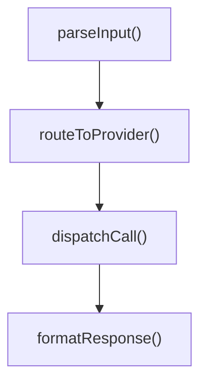
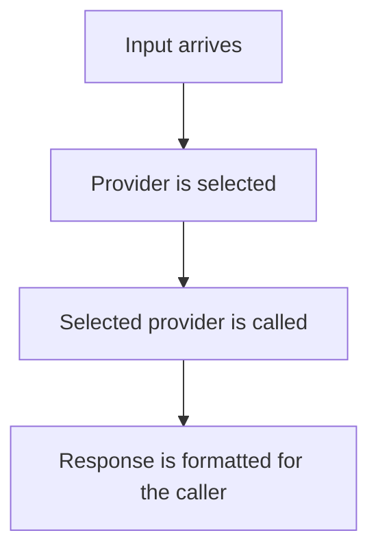

Three deep-dives were live on this blog, each one produced by the same content-factory pipeline: gate 2, symbol-grounding, checked every backticked identifier in the draft against the real NeuroLink repository with `git grep`, and all three passed. Then somebody read all three against the actual source, sentence by sentence, instead of identifier by identifier, and found that two of the three were wrong in a specific way. Not invented function names — every name in those drafts was real. Invented *wiring*: a sentence naming two real functions and asserting the first calls the second, when both existed exactly where the draft said they did and neither called the other; a component described as "the gate" that wasn't an entry point of anything; a mermaid diagram chaining five real function names into a flow that never executed in that order. Gate 2 has no mechanism for catching that — it proves a name exists, not that the sentence around it is true. This post is about the gate that shipped on 2026-06-03 to surface exactly that gap, the drafter rule that pairs with it, and why the fix is a flagger and not a verifier.

## What symbol-grounding can't see

The factory's existing accuracy gate, `scripts/factory/lib/gates/symbol-grounding.mjs`, is deliberately narrow: it extracts every backticked token from a draft's prose, classifies it (path, symbol, version, SHA, phrase), and checks each one against the real repository with `git ls-files` or `git grep`. If `` `ArchiveProcessor` `` and `` `extractGzEntries` `` both appear in the source tree, both tokens ground, and the gate passes. That is a real and useful check — it is what catches a drafter inventing an ESLint rule or a function that was never written. But it is a check on *existence*, not on *relationship*. Nothing about symbol-grounding reads a sentence like "`extractGzEntries` calls `zlib.gunzip`" and asks whether that call actually happens in that order. Two real, grounded names on either side of the word "calls" pass the gate identically whether the call is real or fabricated — as it happens, `extractGzEntries` genuinely does call `gunzip` (this blog's own decompression-bombs post walks through that exact line), but the gate has no way to tell that case apart from one where the two names were paired up wrong.

An adversarial audit of the live posts is what actually caught this. It read three deep-dives against their source commits and found the factory fabricating call-graph narratives around real symbol names — sentences like "X calls Y," "Y is the gate," claims about a function's exact return type, "a new case to the switch," a method described as `private`, a class described as "thin." Two of the three live posts were seriously inaccurate this way. The commit that shipped the fix is explicit about why this is hard to close outright: "a behavioural-accuracy gate isn't cheaply achievable (the only thing that caught this was an expensive, non-converging adversarial review)." An adversarial review that reads every claim against source doesn't run in CI on every draft — it's the kind of pass a human did once, by hand, to find the problem in the first place. So the fix that shipped is deliberately smaller than "verify every call-graph claim automatically." It's detection and prevention: a deterministic gate that surfaces every claim of this shape so a human — or the drafter, on a retry — can check it against source, plus a drafting rule that tries to stop the claims from being written in the first place.

## Nine shapes of an unverifiable claim

`gates/call-graph-claims.mjs` is registered as gate 13 in `scripts/factory/lib/gate-runner.mjs`. Its detection logic is nine regular expressions, each one targeting a specific claim shape the audit found the factory getting wrong:

```javascript
const PATTERNS = [
  { code: 'CALLS', re: /\b(calls?|invokes?|is called by|delegates? to|routes? (it|them|each|the)\b.*\bto|dispatches? (on|to))\b/i },
  { code: 'ORCHESTRATES', re: /\borchestrat(e|es|ing)\b/i },
  { code: 'GATE_ROLE', re: /\b(is the (gate|entry ?point|workhorse|engine|conductor|orchestrator)|the (gate|entry ?point) is)\b/i },
  { code: 'SWITCH', re: /\b(switch statement|switch\/case|switch over|a new case\b|case to the switch|large switch|hard-?coded switch)\b/i },
  { code: 'RETURN_TYPE', re: /\breturns?\s+(a\s+|an\s+)?`?(Promise<|ReadableStream|StreamResult|ModelMessage|[A-Z]\w+<)/ },
  { code: 'VISIBILITY', re: /\b((private|public|protected)\s+(static\s+)?(method|function|helper|field|class)|is (a )?(private|public|protected)\b)/i },
  { code: 'THIN_CLASS', re: /\b(thin|tiny|lightweight|small|slim)\s+(provider|adapter|wrapper|shim|class|layer|module|file)\b/i },
  { code: 'FN_CONTAINS', re: /\b(function|method|class)\s+(contains|holds|wraps|implements|consists of)\b/i },
  { code: 'CALL_DIRECTION', re: /\b(under the hood|behind the scenes|internally)\b.*\b(calls?|invokes?|delegates?)\b/i },
];
```

Each `code` maps to one of the shapes the audit named directly in the commit message. `CALLS` is the broadest — "calls," "invokes," "delegates to," "routes … to," "dispatches on" — because "X calls Y" was the single most common fabrication shape found. `GATE_ROLE` exists because the audit found a component flatly mislabeled as "the gate" for something it didn't gate. `RETURN_TYPE` is narrower and more surgical: it only fires on a `returns` claim followed by a capitalized type or a generic like `Promise<`, because a claim like "returns a `ReadableStream`" is a specific, checkable assertion that's cheap to get wrong and expensive to verify without reading the function's actual signature. `VISIBILITY` catches `private`/`public`/`protected` claims for the same reason — TypeScript visibility modifiers are compile-time metadata a drafter has no reliable way to know unless the slice it was given happens to include that exact line.

The scan runs line by line over the draft body, and it doesn't skip fenced code the way symbol-grounding does — it flags matches inside code fences too, just tagged separately, because a fabricated wiring claim can just as easily hide in a code comment as in prose:

```javascript
function stripFm(content) {
  return content.replace(/^---[\s\S]*?\n---\n+/, '');
}

// ...
const claims = [];
let inFence = false;
for (let i = 0; i < lines.length; i++) {
  const line = lines[i];
  if (/^```/.test(line.trim())) { inFence = !inFence; continue; }
  // Skip the Related posts link list — not call-graph prose.
  if (line.trim().startsWith('**Related posts:**')) break;
  for (const p of PATTERNS) {
    if (p.re.test(line)) {
      claims.push({ line: i + 1, code: p.code, in_code: inFence, text: line.trim().slice(0, 160) });
    }
  }
}
```

The one thing it deliberately doesn't scan is the Related-posts block at the end of a draft — the loop `break`s the moment it sees that line, the same defensive carve-out symbol-grounding needed for its own link list, so a post's outbound links never get mistaken for call-graph prose.

## Mermaid gets its own detector

The audit's worst example wasn't a sentence — it was a diagram: a mermaid flowchart that wired real function names into a sequence that had never run that way. Text claims are one regex match each; a diagram can assert an entire fabricated call chain in a handful of boxes and arrows, which is why it gets weighted more heavily than any single text pattern. `mermaidFunctionFlow` pulls every mermaid block out of the draft and looks for two signals that a diagram is asserting *function* wiring rather than *stage* wiring:

```javascript
function mermaidFunctionFlow(body) {
  const blocks = [...body.matchAll(/```mermaid\n([\s\S]*?)```/g)].map((m) => m[1]);
  const flagged = [];
  for (const block of blocks) {
    const hasEdges = /-->/.test(block);
    const fnLabels = [...block.matchAll(/[\[("']([^\]\n)"']*\b[a-z][a-zA-Z]+\(\)[^\]\n)"']*)/g)].map((m) => m[1].trim());
    // Also catch bare camelCase function-ish node ids in edges.
    const camelNodes = [...block.matchAll(/\b([a-z][a-zA-Z]{4,})\b\s*(?:-->|\{|\()/g)]
      .map((m) => m[1])
      .filter((w) => /[a-z][A-Z]/.test(w)); // camelCase only
    if (hasEdges && (fnLabels.length > 0 || camelNodes.length >= 2)) {
      flagged.push({ fnLabels, camelNodes: [...new Set(camelNodes)] });
    }
  }
  return flagged;
}
```

A block only flags if it has at least one `-->` edge — a mermaid block with no edges isn't asserting a flow at all — and then either a node label that looks like a literal function call (`something()`) or two or more camelCase node identifiers, the naming convention a JavaScript function name almost always follows and a stage label almost never does. A diagram whose nodes name stages in plain English doesn't flag anything; one whose nodes chain three or more camelCase identifiers together does, on both signals at once. The distinction the detector is drawing is exactly the one the drafter rule below asks writers to make on purpose: STAGES are safe to diagram, specific FUNCTION NAMES chained together are a claim about code the model hasn't verified. The section below shows both shapes side by side.

## Scoring is density, not correctness

The gate can't tell a true call-graph claim from a false one — nothing short of reading the source function by function can do that reliably, which is the whole reason this is a flagging gate rather than a verifying one. What it computes is how *dense* a draft is with claims of the shape the audit found unreliable, weighting a fabricated-looking mermaid flow three times a single flagged line, since one diagram can assert as much fabricated wiring as several sentences combined:

```javascript
const mermaidFlows = mermaidFunctionFlow(body);
const byCode = {};
for (const c of claims) byCode[c.code] = (byCode[c.code] || 0) + 1;

// Density = distinct flagged lines + a heavy weight for function-flow mermaid.
const total = claims.length + mermaidFlows.length * 3;
const verdict = total <= THRESHOLD ? 'PASS' : 'FAIL';
```

`THRESHOLD` defaults to 6, read from `CALL_GRAPH_CLAIM_THRESHOLD`. The commit message gives the calibration numbers the threshold was picked against: the ten-eslint post — a behaviour-altitude piece that describes what each rule catches rather than how the linter's internals call each other — scores 0. The two seriously-inaccurate deep-dives the audit flagged score 11 and 14, comfortably above the line. A threshold of 6 sits well clear of the clean baseline and well below the two posts that were actually wrong, which is the shape a calibrated detector wants: a wide enough gap that ordinary variance in writing style doesn't produce false positives or false negatives at the boundary.

The gate's own return payload spells out what a `FAIL` verdict does and doesn't mean:

```javascript
note:
  verdict === 'PASS'
    ? 'Behaviour-altitude: few specific call-graph assertions.'
    : 'Call-graph-dense. Each claim below must be verified against source or de-specified before publishing (esp. for Deep Dive posts).',
```

A `FAIL` is not "this post is wrong." It's "this post makes enough claims of the shape that was wrong before that a human should read each one against source before it goes out," with the exact line number, the pattern that matched, and up to 160 characters of context returned for every single claim.

## Advisory, on purpose — and always exit 0

Gate 13 is registered `advisory: true` in `gate-runner.mjs`, the same status as the HHEM hallucination classifier and the Yama-pattern review that sit above it in the pipeline. `runAllGates()` only short-circuits the pipeline, and only computes overall `PASS`/`FAIL`, from the non-advisory gates:

```javascript
if (shortCircuit && !g.advisory && record.verdict !== 'PASS') {
  report.short_circuited_at = g.id;
  break;
}
// ...
// Overall = all NON-ADVISORY gates pass.
const hardGates = report.gates.filter((r) => !r.advisory);
report.overall = hardGates.every((g) => g.verdict === 'PASS') ? 'PASS' : 'FAIL';
```

A call-graph-dense draft still runs every remaining gate and can still ship as an overall `PASS`. The gate's own CLI entry point makes the same choice explicit at the process level — it always exits 0, regardless of verdict:

```javascript
runGate({ draftPath: p }).then((r) => {
  console.log(JSON.stringify(r, null, 2));
  // Advisory gate: exit 0 regardless, but echo the signal.
  process.exit(0);
});
```

That's a deliberate trade-off, not an oversight, and the gate's own header comment names it directly: "it can't judge correctness — only reading the source can." Blocking on a heuristic that can't distinguish a true claim from a false one would trade one failure mode for another — false positives blocking accurate, carefully-sourced writing about real call relationships just as readily as it would catch fabrication. The commit ties the advisory status to a second piece of policy sitting at the publishing end of the pipeline instead: "pairs with the publisher's (forthcoming) no-auto-PR-for-Deep-Dive policy: deep-dives route to human review instead of auto-publishing." The gate's job is to make that human review fast — every call-graph claim already has its line number and its matched pattern by the time a reviewer opens the scorecard — not to make the review unnecessary.

## The other half: telling the drafter to stop making the claim

A gate that fires after the draft exists can only flag a problem, not prevent one. The same commit adds a sixteenth rule to the drafter's prompt, `scripts/factory/lib/drafter.mjs`, aimed at the model that writes the draft in the first place:

```text
16. **Describe behaviour, not the call graph (CRITICAL)** — symbol grounding (rule 11) only
proves a NAME exists; it does NOT prove the name does what you say. The factory's worst
failure mode is inventing plausible WIRING around real names. So do NOT assert specifics
you cannot verify from the slice: no "`X` calls `Y`" / "`Y` is the gate" / "the function
contains a switch over providers", no claims about a method's exact return type or its
`public`/`private`/`abstract` status, and do NOT pin a named function to "Stage N".
Describe each component's RESPONSIBILITY ("the file detector turns paths into content";
"the budget step trims oversized input") rather than its internal call chain. Mermaid
nodes must be STAGES or RESPONSIBILITIES, never a sequence of specific function names.
If you only know a name exists, say what it is FOR — never how it is wired. (A
deterministic gate flags every call-graph claim for human review; minimise them.)
```

Rule 16 references rule 11 — symbol grounding's own drafting rule — by number and names the exact gap between them: a name existing is not evidence that a sentence about the name is true, and the two checks the factory already had, before this commit, only covered the first. The rule's own worked examples ("the file detector turns paths into content"; "the budget step trims oversized input") are RESPONSIBILITY statements — what a component is *for* — deliberately shaped to sound almost identical to a WIRING claim while asserting nothing about who calls whom, in what order, or with what return type. That's the same distinction the mermaid detector encodes structurally: a stage label is safe because it describes a role, and a chained sequence of function names is a claim about execution order the model has no way to have verified from a repo-map slice.

## What a stage diagram looks like next to a function-flow one

The two mermaid shapes the drafter rule and the gate detector are drawing a line between aren't abstract — they're a small, concrete rewrite. A function-flow diagram like this is exactly what `mermaidFunctionFlow` is built to catch, because every node name is a specific function identifier chained in a specific order:



The same information, described at the altitude rule 16 asks for, names stages and responsibilities instead of functions:



Nothing in the second diagram is false in the way the first one can be false — it doesn't claim which function does the selecting, whether selection happens in one call or three, or what any function is named. It says what happens, at a level of specificity the drafter can actually stand behind from a repo-map slice, without asserting the internal wiring that only reading the full implementation could confirm.

## Where gate 13 sits in the pipeline

At the commit that shipped it, gate 13 is the newest of eleven registered gates in `gate-runner.mjs` — `blog-quality`, `symbol-grounding`, `numerical-claims`, `readability-links`, `markdownlint`, `narrative-opening`, `tone-fit`, `multi-llm-rubric`, `hhem-advisory`, `yama-review-advisory`, and `call-graph-claims` itself, run in that order so the cheap deterministic checks fail fast before the slower LLM-judged ones run at all. The first eight of those are hard gates — a `FAIL` on any one short-circuits the pipeline before the draft goes further. Gate 13 runs after all of them, alongside the other two advisory gates (`hhem-advisory`, `yama-review-advisory`), so by the time it sees a draft, every identifier it might flag in a `CALLS` or `GATE_ROLE` match has already passed symbol-grounding — it is never looking for a fake name, only for real names wired together in a sentence nobody has checked against source yet. Its scorecard, with every flagged line and matched pattern, is what a reviewer opens next; for a Deep Dive specifically, that review happens before the post reaches a reader at all, under the "no auto-PR for Deep Dive" policy the commit says is forthcoming on the publisher side.

## What a scorecard actually looks like

`gate-runner.mjs` writes one JSON file per gate to `data/factory/scorecards/`, and gate 13's record follows the exact shape `runGate()` returns — `verdict`, then a `detail` object carrying the threshold, the computed score, and every individual claim with its line number:

```json
{
  "verdict": "FAIL",
  "detail": {
    "threshold": 6,
    "claim_score": 11,
    "claim_count": 5,
    "mermaid_function_flows": 2,
    "by_code": { "CALLS": 3, "GATE_ROLE": 2 },
    "note": "Call-graph-dense. Each claim below must be verified against source or de-specified before publishing (esp. for Deep Dive posts).",
    "claims": [
      { "line": 42, "code": "CALLS", "in_code": false, "text": "`parseInput` calls `routeToProvider` before anything else runs." }
    ]
  }
}
```

The shape shown here follows the gate's own return statement — `claim_score`, `claim_count`, `mermaid_function_flows`, `by_code`, and `note` are the exact keys `runGate()` builds — with a `claims` entry standing in for the kind of line the gate finds. A reviewer opening this file doesn't need to re-derive anything: the `note` field states the verdict in plain language, `by_code` tells them which of the nine shapes is driving the score, and each `claims` entry has already located the exact line and the up-to-160-character snippet around it. That's the entire point of writing the gate as a deterministic scan instead of another model call — the output is a fixed, greppable shape every time, not a paragraph of prose a second reader has to reinterpret.

## What this doesn't claim to fix

The gate's own comments are careful not to oversell what shipped. It is explicitly "detection + prevention, not auto-verification" — nothing in this commit reads a function body and confirms or denies a call-graph claim automatically. A draft that avoids every one of the nine patterns and skips function-named mermaid nodes scores a clean 0 whether or not its remaining prose happens to be accurate about something the regexes don't cover — density of a specific claim *shape* is not the same thing as correctness of the *content*, and the gate's own note says as much: PASS means "few specific call-graph assertions," not "verified." The actual guard against a wrong Deep Dive shipping is the pairing this commit sets up rather than either half alone — a rule that pushes the drafter toward responsibility language it doesn't have to defend, a gate that makes whatever wiring language slips through cheap for a human to find, and, at the publishing end, a Deep Dive routing to a human before either version of that story reaches a reader.

---

**Related posts:**

- [Symbol-grounding: catching hallucinated APIs before publish](/posts/symbol-grounding-catching-hallucinated-apis-before-publish/)
- [Ten ESLint rules that hold NeuroLink's type system together](/posts/ten-eslint-rules-that-hold-neurolink-s-type-system-together/)
- [Disaster recovery from a session log](/posts/disaster-recovery-from-a-session-log/)
