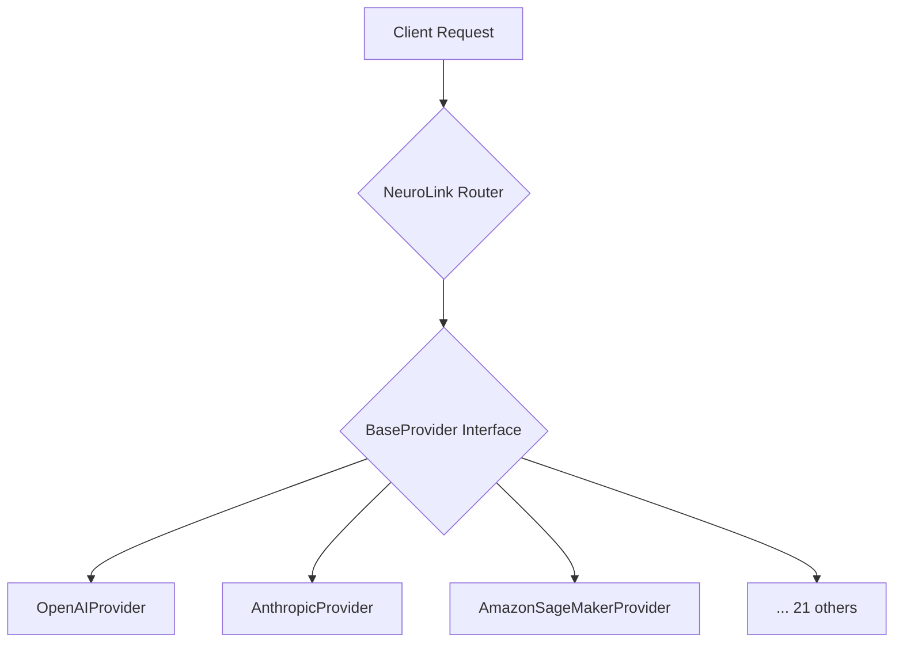

We designed NeuroLink's `BaseProvider` because our first multi-cloud AI deployment at Juspay was a mess of bespoke integration code. One function to call OpenAI, another for Anthropic, and a third, completely different beast for an early SageMaker endpoint. Each had its own error handling, its own retry logic, and its own way of formatting requests. When a new model came out, we had to write another snowflake implementation. The maintenance burden was enormous, and the risk of provider-specific bugs taking down a whole workflow was constant. Our test matrix was exploding. We needed a single, stable contract for any model provider to plug into.

This post walks through that contract — the `BaseProvider` abstract class — and the catalog of two-dozen provider adapters we have built on top of it. It is the story of how we took a chaotic landscape of external APIs and unified them behind a single, predictable interface. This pattern is central to how we can add a new provider like Groq or DeepSeek in an afternoon, not a week, and how we ensure that features like our [MCP circuit breaker](/posts/mcp-circuit-breaker-pattern/) work universally, regardless of the underlying model.

## The `BaseProvider` Contract

The core abstraction is simple: every provider is a class that extends `BaseProvider`. The base class handles the boilerplate: lifecycle management, configuration, observability, and the high-level `generate` and `embed` workflows. The concrete subclass implements a handful of protected methods that define its unique identity and behavior.

The contract surface is intentionally small. For a basic chat completion provider, you only need to implement four methods:

- `getProviderName()`: Returns a unique string identifier for the provider (e.g., `'anthropic'`, `'openai'`).
- `getDefaultModel()`: Specifies the default model ID to use if the user does not provide one (e.g., `'claude-3-opus-20240229'`).
- `getAISDKModel()`: Returns a `LanguageModel` instance from the AI SDK, which handles the low-level API communication.
- `formatProviderError()`: Translates a raw error from the provider's SDK into a standardized `Error` format that NeuroLink's other systems can understand.

```typescript
// A simplified view of the BaseProvider contract
export abstract class BaseProvider {
  // Methods to be implemented by subclasses
  protected abstract getProviderName(): AIProviderName;
  protected abstract getDefaultModel(): string;
  protected abstract getAISDKModel(): LanguageModel;
  protected abstract formatProviderError(error: unknown): Error;

  // Public-facing methods handled by the base class
  public async generate(options: GenerateOptions): Promise<GenerateResult> {
    // ... orchestrates the call using the abstract methods
  }

  public async embed(text: string, model?: string): Promise<number[]> {
    // ...
  }
}
```

This abstraction lets NeuroLink's core routing and orchestration logic treat every provider identically. A request flows through a standard pipeline, and only at the final moment does the `BaseProvider` implementation translate it into a provider-specific API call.



This design is the foundation for features like [dynamic model selection at runtime](/posts/dynamic-model-selection-runtime/), allowing us to swap providers based on cost, latency, or capability without the calling code ever knowing the difference.

## Chat Completion: The Core Workload

Most of our providers are for chat completion. The list includes all the major players: `OpenAIProvider`, `AnthropicProvider`, `GoogleAIStudioProvider`, `GroqProvider`, `MistralProvider`, `PerplexityProvider`, and many more.

For providers that offer an OpenAI-compatible API, the implementation is even simpler. They extend `OpenAIChatCompletionsProvider`, which provides a default implementation for most methods. Adding a new one, like the `NvidiaNimProvider`, can be as simple as defining the provider name and a default model.

```typescript
// src/lib/providers/nvidiaNim.ts

// The entire implementation inherits from a shared OpenAI-compatible base class.
export class NvidiaNimProvider extends OpenAIChatCompletionsProvider {
  constructor(
    // ... constructor logic
  ) {
    super(config, logger, 'NVIDIA');
  }

  protected getProviderName(): AIProviderName {
    return 'nvidia';
  }

  protected getDefaultModel(): string {
    return 'meta/llama3-70b-instruct';
  }

  // Optional: Tweak the request body before sending
  protected adjustBuildBodyOptions(
    options: BuildOllamaBodyOptions,
  ): BuildOllamaBodyOptions {
    // ... provider-specific adjustments
    return options;
  }
}
```

This pattern of layered abstractions—a general `BaseProvider` and a more specific `OpenAIChatCompletionsProvider`—drastically reduces code duplication and lets us add new chat models with minimal effort.

## From Text to Vectors: Embedding Providers

Vector embeddings are the currency of RAG and semantic search. NeuroLink uses dedicated provider adapters for embedding models, like `VoyageProvider` and `JinaProvider`. These classes extend `BaseProvider` but override the `embed` and `embedMany` methods to call their respective embedding endpoints.

The `VoyageProvider`, for example, implements the core chat methods as no-ops (since Voyage offers no chat models) and provides a concrete implementation for embeddings.

```typescript
// src/lib/providers/voyage.ts
export class VoyageProvider extends BaseProvider {
  // ... constructor and core required methods

  // This provider does not support chat.
  override supportsTools(): boolean {
    return false;
  }

  // The core embedding logic.
  override async embed(text: string, modelName?: string): Promise<number[]> {
    const response = await this.callEmbeddings([text], modelName);
    return response.embeddings[0];
  }

  private async callEmbeddings(
    texts: string[],
    modelName?: string,
  ): Promise<VoyageEmbeddingsResponse> {
    // ... logic to call the Voyage AI API
  }
}
```

This specialization ensures that embedding generation is just as standardized as chat completion.

## From Text to Pixels: Image Generation

The same adapter pattern applies to image generation providers like `StabilityProvider`, `IdeogramProvider`, and `RecraftProvider`. These adapters override a different method, `executeImageGeneration`, to handle the specifics of turning a text prompt into a visual.

The `StabilityProvider` implementation shows the pattern clearly. The main `executeStream` for chat is a stub, while the image generation logic contains the actual API call.

```typescript
// src/lib/providers/stability.ts
export class StabilityProvider extends BaseProvider {
  // ... constructor and core required methods

  // This provider does not support chat streaming.
  protected async executeStream(
    // ...
  ): Promise<AsyncGenerator<GenerateChunk, void, unknown>> {
    throw new Error('StabilityProvider does not support streaming chat.');
  }

  // The core image generation logic.
  protected override async executeImageGeneration(
    prompt: string,
    options: ImageGenerationOptions,
  ): Promise<ImageGenerationResult> {
    // ... logic to call the Stability AI API
    // ... handles different generation modes (text-to-image, image-to-image)
    // ... returns URLs or base64-encoded image data
  }
}
```

This isolates the unique concerns of image generation—like handling binary data and different aspect ratios—within the adapter, keeping the core NeuroLink pipeline clean.

## The Swiss Army Knives: Meta-Providers

Some of our most powerful adapters are meta-providers: `LiteLLMProvider`, `OpenRouterProvider`, and `OllamaProvider`. These don't connect to a single model vendor but to aggregator services that themselves route to hundreds of different models.

`OllamaProvider`, for instance, allows NeuroLink to connect to a local Ollama server, giving developers access to a huge library of open-source models running on their own machines. `LiteLLMProvider` does the same for the `litellm` proxy, unifying access to models across Azure, Bedrock, Vertex AI, and more.

These providers follow the same `BaseProvider` contract, demonstrating its flexibility. To NeuroLink's router, a request to a local Llama 3 instance via `OllamaProvider` looks identical to a request to OpenAI's GPT-4.

## Inside the SageMaker Adapter

Connecting to Amazon SageMaker is more complex than calling a simple REST API. It involves service detection, endpoint negotiation, and handling a variety of streaming formats depending on the model being served. Our `AmazonSageMakerProvider` is a mini-subsystem designed to manage this complexity.

- `AmazonSageMakerProvider`: The main adapter, which orchestrates the components. It's responsible for discovering the SageMaker endpoint and region, and it uses the `SageMakerLanguageModel` to execute requests.
- `AdaptiveSemaphore`: SageMaker endpoints have concurrency limits. The `AdaptiveSemaphore` is a client-side mechanism we built to avoid overloading them. It dynamically adjusts the number of parallel requests based on observed latency and error rates, using methods like `acquire` to wait for a slot and `recordSuccess` or `recordError` to provide feedback.
- `StreamingParserFactory`: Different models deployed on SageMaker use different streaming protocols. A Llama model's output stream is not the same as a Hugging Face model's. The `StreamingParserFactory` inspects the response and returns the correct parser (`LlamaStreamParser`, `HuggingFaceStreamParser`, etc.) to decode the stream of `Uint8Array` chunks into text.
- `SageMakerError`: Error responses from SageMaker can be verbose and complex. We use a custom `SageMakerError` class and a `handleSageMakerError` function to parse these errors, extract key information, and determine if the operation is retryable using `isRetryableError`. This is a direct lesson from the early days of inconsistent error handling.

```typescript
// src/lib/providers/sagemaker/adaptive-semaphore.ts
export class AdaptiveSemaphore {
  // ...
  async acquire(): Promise<void> {
    // ... logic to acquire a permit, waiting if concurrency limit is reached
  }

  release(): void {
    // ... logic to release a permit
  }

  recordSuccess(responseTimeMs: number): void {
    // ... may increase concurrency limit if performance is good
  }

  recordError(responseTimeMs?: number): void {
    // ... decreases concurrency limit on failures
  }
}
```

This collection of tools makes interacting with SageMaker as predictable as any other provider. For more details on the low-level mechanics, see our post on [what you actually inherit when you extend BaseProvider](/posts/what-you-actually-inherit-when-you-extend-baseprovider/).

## Taming Gemini's Native API

While most modern APIs have converged on similar patterns, some, like Google's native Gemini API, have unique quirks. Our Google provider adapter uses a suite of helper functions to normalize Gemini's behavior before it even reaches the core `BaseProvider` logic.

The functions in `googleNativeGemini3.ts` act as a protective barrier, sanitizing inputs and normalizing outputs.

- `sanitizeForGoogleFunctionName`: Tool function names in Gemini have strict validation rules. This function cleans up proposed names to ensure they are compliant.
- `sanitizeSchemaForGemini`: Gemini has its own opinions about JSON schema definitions for tools. This function traverses a tool schema and adjusts it to match what the API expects.
- `buildNativeToolDeclarations`: This takes NeuroLink's internal tool definition and transforms it into the verbose `Tool` declaration structure required by the native Gemini SDK.
- `collectStreamChunks` and `extractTextFromParts`: These helpers are responsible for processing the response stream, which can contain a mix of text, tool calls, and other metadata, and extracting a clean string of text.

These functions are a perfect example of the adapter pattern at a finer granularity. They adapt the idiosyncratic world of one specific API to the standardized world of NeuroLink's internal models, ensuring that even the most unique provider plays by the same set of rules.

---

**Related posts:**

- [What You Actually Inherit When You Extend BaseProvider](/posts/what-you-actually-inherit-when-you-extend-baseprovider/)
- [Dynamic Model Selection: Routing AI Requests at Runtime](/posts/dynamic-model-selection-runtime/)
- [From User Input to Provider API: The Five-Stage Message Flow](/posts/from-user-input-to-provider-api-the-five-stage-message-flow/)
