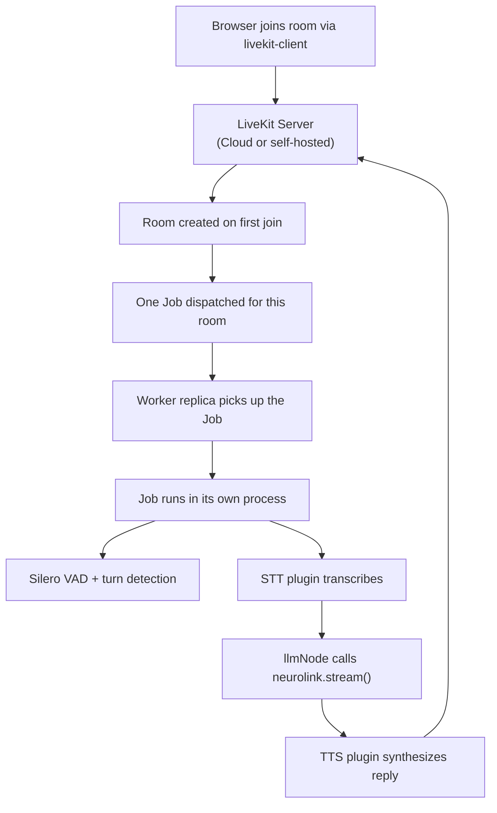

Three in the afternoon on a Tuesday, and your voice agent goes from four concurrent calls to forty in about a minute — a campaign email just landed. If the agent were a single Node process juggling all forty conversations on one event loop, caller eleven would already be hearing dead air while caller ten's speech-to-text callback finishes running. NeuroLink's LiveKit voice agent doesn't work that way. Under the hood, every call gets its own operating-system process, and the scaling story is about how many of those processes you're willing to run, not how cleverly one process multiplexes many calls.

This is the design that shipped in commit `26fdac5f7`, `feat(voice): add LiveKit WebRTC voice agent integration`, which added `docs/features/livekit-voice-agent.md` and the `src/lib/voice/livekit/` module behind the `@juspay/neurolink/livekit` export. The doc's own "Scaling" section states the model in one sentence: "LiveKit Agents uses a Worker→Job model: a worker registers with the LiveKit server and is dispatched one Job per room, each Job running in its own process... Scale by adding worker replicas." Everything below unpacks what that sentence actually costs and buys you, using the real functions the commit shipped.

## The unit of concurrency is a process, not a call

Most real-time systems scale by adding concurrency inside a process — more event-loop callbacks, more worker threads, a connection pool. NeuroLink's LiveKit integration scales by adding *processes*. Each room — one active call — is dispatched by the LiveKit server as a **Job**, and the LiveKit Agents runtime runs that Job in its own process, separate from every other Job the same worker is handling.

That's a deliberate trade-off, and the docs are explicit about what it buys:

- **Isolation.** A crash, an unhandled rejection, or a runaway tool call in one call's process cannot take down any other call. The blast radius of a bug is exactly one conversation.
- **Linear scaling.** Capacity is "how many Job processes can this host (or this fleet) run," which is a resource-accounting problem, not a concurrency-tuning problem inside a single runtime.
- **Restart isolation.** If a worker process itself dies, only the Jobs it was running are affected — they restart on another worker, without disturbing calls handled elsewhere.

The cost is that each process pays its own fixed overhead — its own STT/TTS provider connections and its own copy of NeuroLink's conversation memory client. Semantic turn detection adds a further cost, but — as the "per-worker cost, not a per-call one" section below explains — it's paid once per worker, not once per Job process, so it doesn't multiply the way the other two do. That overhead is the real subject of this post, because it's what actually determines how many concurrent rooms a given worker host can carry.

## Registering a worker: `startVoiceAgentWorker`

A "worker" in this model is a long-lived Node process that registers with the LiveKit server under an `agentName` and then sits there, waiting to be handed Jobs. NeuroLink's integration wraps that registration in one function, `startVoiceAgentWorker`, exported from `src/lib/voice/livekit/voiceAgentWorker.ts`:

```typescript
// voice-agent-worker.ts — run as its own Node process
import { startVoiceAgentWorker } from "@juspay/neurolink/livekit";

await startVoiceAgentWorker({
  agentFile: new URL("./voice-agent-entry.js", import.meta.url).pathname,
  agentName: "neurolink-voice",
});
```

The implementation is short, and it's worth reading in full because everything about how a worker gets Jobs is visible in it:

```typescript
export async function startVoiceAgentWorker(
  options: LiveKitWorkerLaunchOptions,
): Promise<void> {
  const server = resolveLiveKitServerConfig();
  const { cli, WorkerOptions } = await import("@livekit/agents");

  if (resolveEouTurnDetection().enabled) {
    await registerEouTurnDetectorRunner();
  }

  cli.runApp(
    new WorkerOptions({
      agent: options.agentFile,
      agentName: options.agentName ?? DEFAULT_AGENT_NAME,
      wsURL: server.url,
      apiKey: server.apiKey,
      apiSecret: server.apiSecret,
    }),
  );
}
```

`resolveLiveKitServerConfig`, from `config.ts` in the same module, reads `LIVEKIT_URL`, `LIVEKIT_API_KEY`, and `LIVEKIT_API_SECRET` from the environment — the same three values whether you're pointed at LiveKit Cloud, a self-hosted `livekit-server`, or `livekit-server --dev` on a laptop. `DEFAULT_AGENT_NAME` is `"neurolink-voice"`, used when the caller doesn't override it. `cli.runApp` is `@livekit/agents`' own entry point; NeuroLink's contribution is resolving configuration and wiring the `llmNode` adapter, not reimplementing worker registration.

One connection detail matters for how you deploy this: the worker connects **outbound** to the LiveKit server and receives dispatched Jobs over that same connection. Nothing needs to reach the worker from outside — no inbound port, no tunnel, no ingress rule pointed at it. That's true identically for LiveKit Cloud and for a self-hosted server, and it's why a worker running on a laptop against a Cloud project can receive Jobs with zero network configuration beyond the three env vars above.

## What happens when a room fills

The dispatch path, end to end, looks like this:



Nothing in this path is specific to the *first* room. Room forty-one triggers the identical sequence as room one: the LiveKit server dispatches a Job, some registered worker picks it up, and that Job gets its own process. Whether room forty-one gets picked up immediately or queues briefly depends entirely on whether a worker replica has capacity to accept another Job — which is the actual scaling lever.

## Scaling by adding worker replicas

Because each worker is a stateless-ish process that only needs the three LiveKit env vars plus whatever STT/TTS/LLM credentials the agent config references, running more of them is the entire scaling mechanism. There's no shared in-process state between workers to coordinate — the "Scaling" section of the docs states this plainly: "Scale by adding worker replicas; a worker failure restarts affected Jobs on another worker without impacting others."

In practice that means:

- **Horizontal, not vertical.** You don't tune concurrency knobs on an existing worker process to accept more Jobs; you run more worker processes, on more hosts or more containers, all registered under the same `agentName`.
- **No sticky routing needed.** Any registered worker can pick up any dispatched Job — the LiveKit server does the assignment, not application code.
- **Failure is contained to the Jobs a dead worker was running.** If a worker host is killed — an OOM, a bad deploy, a spot-instance reclaim — the Jobs it was running are redispatched to a surviving worker. Calls in flight on *other* workers are untouched.

This is the same shape as scaling any Job/queue-worker system (Sidekiq, BullMQ, Celery), applied to real-time voice instead of background tasks — the "task" here is just "run a live conversation for as long as the room stays open."

## What each Job process actually costs

"Add worker replicas" only answers *how* to scale; it doesn't answer *how many rooms per host*. That number is set by what one Job process holds onto for the duration of a call, and the docs are specific about three costs:

1. **STT and TTS provider connections.** Each Job opens its own connection to whatever STT/TTS plugins the agent config selects (Deepgram, ElevenLabs, Cartesia, and others — configured per-job through `buildStt`/`buildTts` in `voiceAgent.ts`). These are per-call, not shared, because each Job is its own process with its own module state.
2. **Conversation memory.** The NeuroLink instance built inside `createNeuroLink` — invoked once per Job, inside that Job's process — carries whatever `conversationMemory` configuration it was given. In-memory storage is per-process by construction; a Redis-backed store is the documented option "important because each call runs in its own job process," so history is available across worker replicas rather than pinned to whichever process happened to run the call.
3. **The semantic end-of-utterance (EOU) model, if enabled.** This is the single largest fixed per-worker cost the docs call out by name.

## The EOU model is a per-worker cost, not a per-call one

Semantic turn detection — opted into with `LIVEKIT_EOU_TURN_DETECTION=true` — runs a small ML model (`@livekit/agents-plugin-livekit`'s `turnDetector.EnglishModel`) that scores whether a speaker has actually finished talking, rather than relying on VAD silence alone. `resolveEouTurnDetection`, in `config.ts`, documents its own cost in its doc comment: the model "adds ~200MB RAM per worker and ~10ms per turn-end," and it is English-only — the multilingual variant is intentionally never registered.

That "per worker" phrasing matters for capacity planning, and `voiceAgentWorker.ts` shows exactly why. Registration happens once, at worker startup, before `cli.runApp` — not once per Job:

```typescript
/**
 * Register the English EOU inference runner in the worker process.
 *
 * Must run before `cli.runApp`: the worker only spawns the shared inference
 * executor when `InferenceRunner.registeredRunners` is non-empty at startup,
 * and passes that registry to the executor process. Importing the plugin
 * registers both English and multilingual runners, so we delete multilingual to
 * keep only the English model loaded.
 */
async function registerEouTurnDetectorRunner(): Promise<void> {
  const { InferenceRunner } = await import("@livekit/agents");
  // Importing the plugin's turn-detector module triggers registerRunner().
  await import("@livekit/agents-plugin-livekit");
  delete InferenceRunner.registeredRunners[EOU_METHOD_MULTILINGUAL];
}
```

Two things fall out of this. First, the ~200MB is a **worker-level** cost you pay once when the worker starts, shared by every Job that worker runs afterward — it does not multiply per concurrent call the way STT/TTS connections do. Second, the deliberate deletion of the multilingual runner (`EOU_METHOD_MULTILINGUAL = "lk_end_of_utterance_multilingual"`) is itself a scaling decision: importing the plugin registers *both* models, and the multilingual one is discarded specifically so a worker that only needs English doesn't pay for a second large model it will never use. If your voice agent needs both languages, that trade-off is one you'd have to revisit — the code as shipped keeps only English.

Whether to enable EOU at all is therefore a capacity question as much as a UX one: it measurably improves turn-taking (a user who pauses mid-sentence — "I'd like to book a flight to… London" — isn't cut off at the pause), but every worker replica that runs it commits roughly 200MB of RAM to a model that sits loaded for the worker's entire lifetime, whether or not a Job happens to be using it at that instant.

## Inactivity shutdown: reclaiming a Job's resources

Because each Job holds real, per-call resources for as long as it runs — STT/TTS connections, memory, and (indirectly) a share of the worker's EOU model — a call that never hangs up is not a free idle process. It's a process still holding its STT/TTS sockets open. The commit ships an inactivity watchdog for exactly this, configured with one environment variable:

```bash
VOICE_INACTIVITY_TIMEOUT_MS=600000   # default 10 minutes; set <=0 to disable entirely
```

A timer tracks how long a call has been idle; any real activity — the user speaking, the agent speaking, a new conversation item — resets it. If nothing happens within the threshold, the watchdog triggers the Job's graceful shutdown, the same clean teardown path used when a call ends normally. The default is ten minutes; lowering it reclaims worker capacity faster on workloads with many short, abandoned calls, and raising it accommodates workflows with long expected silences. This is the other half of the scaling story: adding worker replicas grows capacity, and inactivity shutdown stops that capacity from leaking away to calls nobody is actually on anymore.

## Barge-in doesn't change the scaling model

It's worth being clear about what *isn't* a scaling concern here: interruption handling. When LiveKit detects the user talking over the agent, it cancels the in-flight `llmNode`, and that cancellation is propagated into `neurolink.stream()` via an abort signal so the in-flight LLM call — and any tool call it's mid-execution on — stops promptly. That's entirely intra-process: it changes what one Job is doing right now, not how many Jobs exist or which worker they're running on. The `brain.ts` module that implements this exposes a deliberately small, transport-agnostic surface — given a transcript, a `conversationId`, and an abort signal, it returns a NeuroLink stream — precisely so this logic doesn't need to know anything about worker replicas, Job dispatch, or process boundaries at all.

## Cloud vs. self-hosted: the other axis of scaling cost

Everything above is about *process* capacity. The other cost axis is the LiveKit server itself, and the two supported topologies price scaling differently:

| Topology | Media plane | Per-call cost |
| --- | --- | --- |
| **Cloud (managed)** | LiveKit's servers, rooms auto-created on first join | Billed per participant-minute; a call has two participants (user + agent), and a free Build tier covers development |
| **Self-hosted** | `livekit-server` on your own infrastructure (for example, Kubernetes) | No per-minute media fee; cost is the compute and bandwidth of running the server and workers yourself |

Application code is identical across both — only `LIVEKIT_URL` and the API credentials change, because `resolveLiveKitServerConfig` reads the same three variables regardless of which topology is behind them. The choice is about *where the scaling cost shows up*: Cloud turns concurrent-room growth directly into a metered bill with none of the SFU operations to run yourself; self-hosting turns it into infrastructure you provision and keep healthy, in exchange for no per-minute charge. Worker-replica scaling — the subject of this post — is identical either way, because it happens on your infrastructure in both cases; only the room/media side of the equation moves between the two.

## When a new replica sits idle

The most common scaling surprise is a worker that starts cleanly and then receives no Jobs at all. The commit's own troubleshooting guide points at the two settings that decide dispatch:

- **`LIVEKIT_URL`.** A replica pointed at a different LiveKit server (a staging URL left in one environment file, say) registers successfully — just with the wrong server, so the rooms you are watching never reach it.
- **`agentName`.** Workers are matched to rooms by name. A replica started with a different `agentName` than the rest of the fleet is a separate agent as far as the server is concerned, and it only gets Jobs addressed to that name.

For LiveKit Cloud, the guide adds one more check: confirm the worker process is actually running and its outbound connection is established. No inbound exposure is required, so there is no load-balancer or firewall rule to get wrong on the worker side.

The inactivity watchdog has a related failure mode in the other direction. Setting `VOICE_INACTIVITY_TIMEOUT_MS` to `0` (or any non-positive value) disables it entirely, and calls then end only on an explicit hang-up or a transport disconnect. That is a legitimate choice for workflows with long, expected silences, but on a fleet sized for short calls it lets abandoned calls hold their Job processes until the transport finally drops.

## Sizing a rollout

Putting the pieces together, planning worker capacity for a given concurrent-call target comes down to:

1. **Fixed per-worker cost.** ~200MB for the EOU model, if you enable it, paid once per worker process regardless of how many Jobs that worker ends up running.
2. **Per-Job cost, multiplied by concurrent calls on that worker.** STT/TTS connection overhead and NeuroLink's conversation-memory client, both scoped to the Job's process.
3. **How aggressively idle Jobs get reclaimed.** `VOICE_INACTIVITY_TIMEOUT_MS`, tuned down if abandoned calls are common in your traffic pattern, tuned up if long silences are expected and legitimate.
4. **How many worker replicas you run**, which is the lever that actually raises your concurrent-room ceiling — everything else determines how much headroom each replica gives you before you need another one.

None of this requires touching the application's conversation logic — `defineVoiceAgent`, the `llmNode` adapter, and `brain.ts` are unaware of how many other Jobs exist. That separation is what lets "how do I handle more calls" stay a deployment question (run more worker processes) instead of a rewrite of the conversation code.

## Trying it yourself

If you already have the LiveKit voice agent running from `docs/features/livekit-voice-agent.md`'s Usage Example section, testing the scaling model doesn't require a large deployment — it requires running `startVoiceAgentWorker` more than once:

```bash
# Terminal 1 — first worker replica
node voice-agent-worker.js

# Terminal 2 — second worker replica, same agentName
node voice-agent-worker.js
```

Both processes register under the same `agentName` ("neurolink-voice" by default) against the same `LIVEKIT_URL`. Open two calls and you should see each one dispatched to a different worker process — confirmable by adding a log line at the top of the agent entry file's `createNeuroLink` and watching which terminal prints it for which room. Kill one of the two worker processes mid-call on its Job, and the docs' restart-isolation claim is directly observable: the call on the surviving worker is unaffected, while the call whose worker died gets redispatched.

## What this post isn't claiming

The Worker→Job model bounds *how* NeuroLink's LiveKit integration scales; it doesn't set a specific number of rooms per host — that depends on your STT/TTS provider's own connection limits, your host's memory, and whether EOU is enabled, none of which this commit hardcodes. It also doesn't include an autoscaler: nothing in `26fdac5f7` spins worker replicas up or down automatically in response to load — "scale by adding worker replicas" describes the mechanism the architecture supports, not a control loop that does it for you. That's infrastructure you'd still build on top, whether that's a Kubernetes HPA watching queue depth or a simpler fixed-replica-count deployment sized for peak.

---

**Related posts:**

- [Security considerations for voice agents](/posts/security-considerations-for-voice-agents/)
- [Voice-First Hotel Concierge with Multi-Provider Routing](/posts/voice-first-hotel-concierge/)
- [Speech-to-Text and Text-to-Speech with NeuroLink](/posts/speech-to-text-neurolink/)
