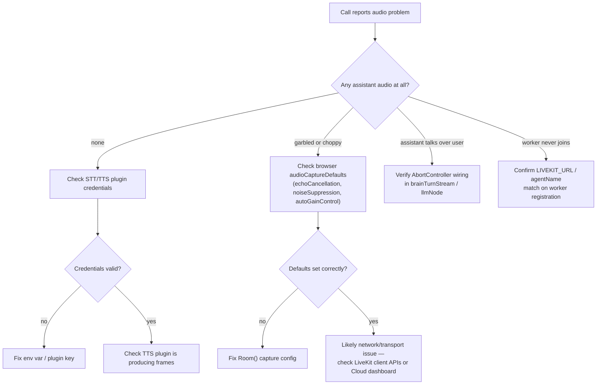

A call connects. The browser shows the room as joined, the mic indicator is live, the agent's job process is running — and no audio comes back. Not an error, not a disconnect. Just silence where a reply should be. That is the failure mode this post is about, and it is also the hardest one to triage from a stack trace, because nothing threw.

NeuroLink's LiveKit voice agent (`docs/features/livekit-voice-agent.md`) splits a call across three systems: the browser's WebRTC stack, LiveKit's transport and turn-detection layer, and NeuroLink's brain. A silent call can originate in any of the three, and the fix is different for each. This is a walk through where audio actually breaks in this integration, using the five entries LiveKit's own troubleshooting section documents, the credential and frame checks behind them, and what the per-Job process model means when a call ends on its own.

## Three systems, one silence

The integration's own division-of-responsibility table draws the boundary plainly:

| Concern | Owner |
| --- | --- |
| WebRTC transport, AEC, jitter, Opus | LiveKit |
| VAD, turn detection, interruption | LiveKit Agents |
| Worker-per-call process isolation & scaling | LiveKit Agents |
| STT / TTS | LiveKit plugins (configurable) |
| LLM, tool-calling, memory | NeuroLink |
| Conversation history source of truth | NeuroLink memory (`conversationId`) |

That table is the first triage tool, because it tells you what NeuroLink is not responsible for. Echo, jitter, and codec problems live entirely inside LiveKit's WebRTC stack — NeuroLink never touches raw audio frames. NeuroLink's own surface is narrower than "voice": it is `neurolink.stream()` producing tokens, and nothing about audio capture, playback, or packet handling. When a call goes silent, the first question is not "what's wrong with NeuroLink" — it's which of the three layers the silence started in.

The `llmNode` seam is the boundary between the second and third layers: LiveKit hands it a transcript, and `neurolink.stream()` hands back tokens. Everything before that seam (mic capture, VAD, STT) is LiveKit's problem; everything after it (TTS, playback) is LiveKit's again, with NeuroLink only responsible for the middle.

## The five documented failure modes

The docs' Error Handling & Troubleshooting section lists five entries, and each one maps to a different point in that chain:

```text
Worker not receiving Jobs
  → the worker → LiveKit registration link is broken

No assistant audio
  → STT/TTS plugin credentials, or TTS not producing frames

Assistant talks over the user / does not stop on interruption
  → abort-on-interrupt isn't wired into neurolink.stream()

Long silence during tool calls
  → expected: no audio while a tool runs inside stream()

Tools not available in voice
  → createNeuroLink isn't returning an instance with tools registered
```

Two of these — "no assistant audio" and "assistant talks over the user" — are audio-specific, and they are the two this post spends the most time on. The other three are worth knowing so you don't waste time chasing an audio bug that is actually a registration, latency, or configuration issue wearing an audio symptom.

## "No assistant audio": the two things the docs actually tell you to check

The troubleshooting entry for this is short, deliberately so — it isn't a deep WebRTC-stack debugger, it's two checks:

- Verify STT/TTS plugin credentials.
- Check that the TTS plugin is producing frames for the room.

Both checks point at the same layer: STT and TTS are pluggable provider modules (`@livekit/agents-plugin-<name>`), each configured with that provider's own API key via environment variables. From the Configuration section:

```env
DEEPGRAM_API_KEY=
ELEVENLABS_API_KEY=        # or CARTESIA_API_KEY
```

A silent call with no error thrown is the signature of a credential that authenticates but degrades quietly, or a plugin that never got a key at all and fails on the first request without ever reaching the browser as a visible error — the failure happens entirely inside the worker process, on the server side of the room, where the browser has nothing to show for it. The doc's second bullet — "check that the TTS plugin is producing frames" — is there because a credential problem and a synthesis problem look identical from the browser: silence either way. The only way to tell them apart is to look at what the TTS plugin itself logged for that call, which is why the credential check comes first: it's cheaper to rule out.

The integration wires provider plugins in `voiceAgent.ts` through two functions, `buildStt` and `buildTts`, and the docs note this explicitly as the extension point: "Adding a provider from the list above is a small, isolated change in those two functions." If a custom STT/TTS provider was recently added or swapped, that's where to look — a typo in the env var name the plugin reads, or a provider that needs an extra field (`voice`, `model`) the default config doesn't set, both surface as this same "no assistant audio" symptom.

## Rule out the browser before the server

Before chasing server-side credentials, it's worth confirming the browser side is even capturing and playing audio correctly, because the integration's browser client snippet sets three WebRTC capture defaults that matter for real-world audio quality:

```typescript
import { Room } from "livekit-client";

const room = new Room({
  audioCaptureDefaults: {
    echoCancellation: true,
    noiseSuppression: true,
    autoGainControl: true,
  },
});

await room.connect(url, token); // room is auto-created on first join
await room.localParticipant.setMicrophoneEnabled(true);
// remote audio tracks (the agent's voice) play automatically
```

These three run client-side, for free, with no LiveKit Cloud dependency:

- `echoCancellation` stops the agent's own voice from being re-captured by the mic and fed back into STT as if the user said it.
- `noiseSuppression` removes steady ambient noise that can otherwise push VAD's activation threshold past its cutoff.
- `autoGainControl` normalizes mic level, so a quiet speaker doesn't fall below the threshold VAD uses to decide a turn even started.

If any of these three is missing or explicitly disabled somewhere in a custom `Room` setup, the symptom is not "no audio" but "bad audio" — echo, false turn cuts, or a caller who sounds like they never started speaking because their level never crossed the VAD floor. That's a distinct enough failure signature from silence that it's worth ruling in or out early rather than assuming every audio complaint routes to the server.

## Barge-in: when the assistant talks over the user

The second audio-adjacent entry is the opposite symptom — audio that doesn't stop when it should. The doc's fix is one sentence: "Verify abort-on-interrupt is wired: LiveKit's cancellation must abort the in-flight `neurolink.stream()` (and any active tool)."

The mechanism behind that sentence lives in `voiceAgent.ts`, in `brainTurnStream`. Each turn wraps the brain's async generator in a `ReadableStream`, backed by an `AbortController`:

```typescript
function brainTurnStream(
  brain: LiveKitVoiceBrain,
  transcript: string,
  conversationId: string,
  onAbortedBeforeOutput?: () => void,
): ReadableStream<string> {
  const controller = new AbortController();
  const generator = brain.streamReply({
    transcript,
    conversationId,
    signal: controller.signal,
  });
  // ...
  return new ReadableStream<string>({
    async pull(streamController) {
      // ...
    },
    cancel() {
      controller.abort();
      if (!producedOutput) {
        onAbortedBeforeOutput?.();
      }
    },
  });
}
```

When LiveKit detects the user has started speaking over the agent, it cancels the framework's `llmNode` for that turn. `ReadableStream`'s `cancel()` callback is where that cancellation actually reaches NeuroLink: it calls `controller.abort()`, which propagates into `brain.streamReply`'s `signal` and stops the in-flight `neurolink.stream()` call. If the assistant keeps talking through an interruption, the fault is almost never in the interruption detection itself — LiveKit's side of that is Silero VAD plus the framework's own barge-in logic, and it is reliable. The fault is downstream: something between the framework's cancel and `neurolink.stream()`'s abort signal isn't connected, most often a custom `llmNode` override that doesn't route through `brainTurnStream`, or a TTS buffer that keeps draining audio it already generated before the cancellation arrived.

The Runtime Flow section names this sequence directly:

1. The assistant is speaking.
2. LiveKit detects user speech and cancels the current `llmNode`.
3. The abort signal cancels the in-flight `neurolink.stream()` (and any active tool).
4. The session yields to the user.

Step 3 is the one to instrument if barge-in looks broken: confirm the abort signal you pass into `stream()` is the same one `ReadableStream.cancel()` receives, not a fresh, unconnected `AbortController`.

## Two things that look like bugs but are the process model working as designed

The five troubleshooting bullets above are what the docs give you for a genuine audio failure. Before reaching for them, though, it's worth knowing two properties of how this integration runs on LiveKit Agents, because both can produce a "something's wrong" moment that isn't a bug at all.

LiveKit Agents uses a Worker→Job model: a worker registers with the LiveKit server and is dispatched one Job per room, and each Job runs in its own process. A worker failure restarts the Jobs it was holding on another worker, without touching calls already running elsewhere. If one call goes silent while a call on the same worker keeps working, that per-Job isolation is why the failure didn't spread, though a worker that itself fails still has its Jobs restarted on another worker.

The second is an inactivity watchdog, which explains a call that ends on its own; NeuroLink logs an `Inactivity timeout ... reached` info line naming the room, but only when `NEUROLINK_DEBUG=true` is set. A timer tracks how long the call has gone without real activity — the user speaking, the agent speaking, or a new conversation item being added — and any of those resets it. Once the idle time crosses a threshold, the watchdog calls the Job's graceful shutdown, the same clean teardown a normal hangup uses:

```env
VOICE_INACTIVITY_TIMEOUT_MS=600000   # default 10 minutes; set <=0 to disable entirely
```

Ten minutes is the default. A call that was working, went quiet because nobody said anything, and then simply ended without an error is very likely this watchdog doing its job, not a fresh audio failure to chase. Lower the value to reclaim worker resources faster on short calls; raise it, or set it to `0` to disable the watchdog outright, for workflows with long expected silences that shouldn't be treated as abandoned.

Neither of these is a transport-level debugger — they don't tell you anything about codec, jitter, or connection quality. What they do is rule out two specific false alarms — a call that failed because an unrelated call's worker crashed, and a call that ended because it sat idle past the timeout — before you spend time running the five checks above against a call that was never actually broken.

It's also worth knowing why NeuroLink doesn't add any connection-state or connection-quality handling itself: `brain.ts` exposes a deliberately small surface to the transport — a transcript, a `conversationId`, and an abort signal in, a NeuroLink stream out. Connection state and quality are room-level LiveKit concerns that live entirely on the other side of that boundary; the brain layer doesn't subscribe to them. That narrow surface is also what keeps the integration reusable if a transport other than LiveKit is ever added.

Practically: if a call ends and the logs show nothing at the NeuroLink layer — no thrown error, no aborted stream, nothing in `brainTurnStream` — check the watchdog threshold and the worker's process health before assuming a fresh audio bug. Those two checks cost a config read and a process list; the five troubleshooting bullets are the deeper investigation, worth reaching for once the process-lifecycle explanation is ruled out.

## A decision tree for a silent or broken call



## Silence that isn't a bug: tool calls

The fourth troubleshooting entry, "long silence during tool calls," is included specifically to stop this from being misdiagnosed as an audio failure. While a tool runs inside `neurolink.stream()`, no tokens are produced, so nothing reaches TTS, so there is genuinely no audio to play — this is expected, not a defect. The doc's suggested mitigation is to instruct the model to speak a brief acknowledgment before invoking a tool, and/or emit a status event over a LiveKit data channel for the UI to render. If a "no audio" report correlates with a tool-using turn (a lookup, a booking action, anything that goes through NeuroLink's MCP or registered-tool path), the fix is a UX one — filling the dead air — not a transport or credential fix.

## "Tools not available" isn't an audio bug either

The fifth entry is a configuration check, not a transport one: "Ensure the `createNeuroLink` factory returns an instance with tools registered, and that tools are not disabled." Because each call runs in its own job process and rebuilds the NeuroLink instance fresh via `createNeuroLink`, a tools regression here is almost always the factory function itself — not registering the expected tool set for that call, or a feature flag disabling tools before the factory returns. Worth ruling out before assuming an audio or transport issue when a voice call simply can't do things a text call on the same NeuroLink instance can.

## What this doesn't cover

It's worth being honest about the size of the surface here. LiveKit's own troubleshooting section for this integration is five short entries, most of them a single check apiece — this is not a packet-level WebRTC debugger, and NeuroLink does not ship one. The Extensibility Roadmap lists "Tool-call UI events" (emitting structured start/result events to the client for live status) as a future item, which would help with the tool-silence case above, though the commit's opt-in data-channel event bridge (`events.enabled`) already forwards `tool-start` and `tool-result` events. There is no SDP inspector, no per-packet loss dashboard, and no NeuroLink-side equivalent of a WebRTC `getStats()` wrapper — for that level of detail you're working directly with LiveKit's own client APIs and, on LiveKit Cloud, its dashboard, not anything NeuroLink adds on top.

What NeuroLink does add is the seam-level visibility: the abort-signal wiring in `brainTurnStream` for barge-in, the inactivity watchdog (alongside LiveKit Agents' own per-Job process isolation) that rule out two common false alarms, and the five documented checks for the most common "nothing came back" reports. For most production incidents — credential rot, a missed abort wire-up, a tool call eating the turn — that's the level the fix actually lives at, not deeper in the WebRTC stack itself.

## Quick reference

- **No audio at all** → STT/TTS credentials (`DEEPGRAM_API_KEY`, `ELEVENLABS_API_KEY`/`CARTESIA_API_KEY`) first, then whether the TTS plugin is producing frames.
- **Choppy or echoing audio** → confirm `audioCaptureDefaults` (`echoCancellation`, `noiseSuppression`, `autoGainControl`) are actually set on the browser's `Room`.
- **Degraded mid-call, not silent from the start** → check LiveKit's own client APIs or, on LiveKit Cloud, its dashboard for connection-quality signals — NeuroLink doesn't add transport-level visibility here.
- **Assistant won't stop talking on interruption** → trace the abort signal from LiveKit's cancel into `neurolink.stream()`'s `signal`, via `brainTurnStream`.
- **Silence lines up with a tool call** → expected; add an acknowledgment phrase or a data-channel status event, not a transport fix.
- **Voice call can't use tools a text call can** → check what `createNeuroLink` actually registers for that call, and whether tools are flagged off.
- **Worker seems to never pick up the call** → confirm `LIVEKIT_URL` and `agentName` match between the worker's registration and the dispatch config.

None of these require touching WebRTC internals directly. They require knowing which of the three systems — browser, LiveKit transport, NeuroLink brain — actually owns the symptom you're looking at, and the division-of-responsibility table at the top of this post is the fastest way to get there.

---

**Related posts:**

- [Security considerations for voice agents](/posts/security-considerations-for-voice-agents/)
- [Speech-to-Text and Text-to-Speech with NeuroLink](/posts/speech-to-text-neurolink/)
- [Scaling LiveKit rooms for production voice agents](/posts/scaling-livekit-rooms-for-production-voice-agents/)
