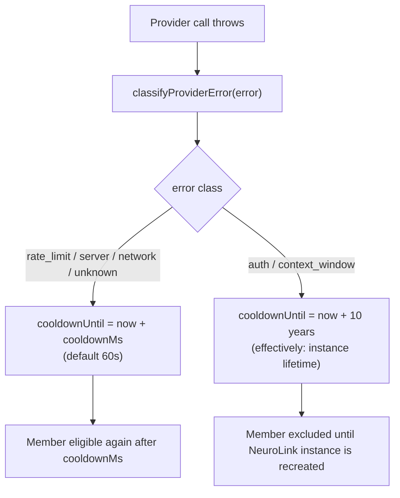

Two providers are configured in a pool: OpenAI first, Anthropic second. OpenAI starts returning 429s under load. A naive retry loop would try OpenAI again, get another 429, try a third time, and burn three round trips before giving up. A naive "just switch on any error" loop would do the opposite mistake: the moment OpenAI's API key expires, it gets retried anyway thirty seconds later, fails identically, and keeps eating a slot in the rotation forever. Under the hood, `ModelPool` treats those two failures differently on purpose — the whole mechanism turns on classifying *what kind* of error came back before deciding what to do about it. This post is about `src/lib/routing/modelPool.ts` and the error-classification utilities it shares with the rest of NeuroLink, from the commit that introduced them: `cea22bda5`, "feat(routing): model-tier router + multi-provider ModelPool with error-class fallback," shipped 2026-06-20 as part of `@juspay/neurolink` v9.77.0.

## Two new primitives, one shared question

The commit adds two independent, opt-in constructor options to `NeuroLink`: `requestRouter` and `modelPool`. Both answer variations of the same question — "which provider and model should this call actually use?" — but at different points in a call's lifecycle.

`requestRouter` runs *before* a call starts, once, and only inspects the request itself: is it a vision request, is it large, does it carry tools. `createDefaultRequestRouter` in `src/lib/routing/requestRouter.ts` builds a synchronous router from three optional tiers (`visionTier`, `largeTier`, `smallTier`), each an object of the shape `{ provider, model, region? }`. Its decision logic is a fixed, three-step check:

```typescript
// src/lib/routing/requestRouter.ts
// 1. Vision
if (ctx.requiresVision) {
  return tierToDecision(visionTier, "vision request detected");
}

// 2. Large input or tool-heavy
const tokenCount = ctx.estimatedInputTokens ?? 0;
if (tokenCount >= largeTokenThreshold || ctx.hasTools) {
  return tierToDecision(
    largeTier,
    ctx.hasTools ? "tool-enabled request" : "large input detected",
  );
}

// 3. Default small/fast tier — only when config.smallTier is explicitly
//    provided.
if (config?.smallTier !== undefined) {
  return tierToDecision(smallTier, "default small tier");
}

return {};
```

`ModelPool`, the other primitive, runs *during* a call, potentially several times in sequence: it holds an ordered list of `{ provider, model?, region?, weight? }` members and, on failure, decides whether the member that just failed should be tried again soon or should be written off for good. That "should be tried again soon" decision is the part this post is actually about — the mechanism NeuroLink calls error-class fallback.

## Classifying an error before doing anything with it

Everything in `ModelPool`'s failure handling is downstream of one function: `classifyProviderError`, exported from `src/lib/routing/modelPool.ts`. It takes an `unknown` error — the pool has no idea in advance what shape a given provider's SDK will throw — and returns one of six `ProviderErrorClass` values defined in `src/lib/types/modelPool.ts`: `"rate_limit" | "auth" | "context_window" | "server" | "network" | "unknown"`.

The function checks a fixed, ordered sequence of rules, and the order matters because some error shapes could plausibly match more than one bucket:

```typescript
// src/lib/routing/modelPool.ts
export function classifyProviderError(error: unknown): ProviderErrorClass {
  const status = extractHttpStatus(error);
  const msg = /* error.message, coerced from Error | object | primitive */;
  const lower = msg.toLowerCase();

  // 1. Rate limit
  if (
    status === 429 ||
    /rate.?limit|quota exceeded|too many requests|requests per minute/.test(lower)
  ) {
    return "rate_limit";
  }

  // 2. Auth / access denied
  if (
    status === 401 ||
    status === 403 ||
    error instanceof AuthenticationError ||
    error instanceof AuthorizationError ||
    error instanceof ModelAccessDeniedError ||
    looksLikeModelAccessDenied(error) ||
    /unauthori[sz]ed|forbidden|invalid api.?key|api key|access denied|authentication failed|permission denied|unauthenticated/.test(lower)
  ) {
    return "auth";
  }

  // 3. Context window
  if (
    /context.?length|maximum context|token.*exceed|exceeds.*context|too.?long|input.*too.?large/.test(lower)
  ) {
    return "context_window";
  }

  // 4. Server error
  if (
    (status !== undefined && status >= 500 && status < 600) ||
    /server error|internal server|overloaded|service unavailable|bad gateway|gateway timeout/.test(lower)
  ) {
    return "server";
  }

  // 5. Network
  if (
    /econnreset|etimedout|enotfound|network error|socket hang up|connection refused|connection reset/.test(lower)
  ) {
    return "network";
  }

  return "unknown";
}
```

Rate limit is checked first because a 429 with a "quota exceeded" message could otherwise also read as an auth failure if you're pattern-matching loosely — putting it first means a rate-limited request never gets misfiled as a permission problem. Auth comes second and is the only class that checks typed error classes in addition to string patterns: `AuthenticationError`, `AuthorizationError`, and `ModelAccessDeniedError` are NeuroLink's own typed errors, and the function also calls `looksLikeModelAccessDenied`, a helper from `src/lib/utils/providerErrorClassification.ts` that matches LiteLLM-style "team not allowed" and "team can only access models=[...]" messages even when no typed class is present. Everything else falls through string-pattern matching on the lowercased message, in order, until nothing matches and the function returns `"unknown"`.

`extractHttpStatus` is a small helper worth noting on its own: it reads `error.status` first, then `error.statusCode`, because different provider SDKs stamp the field under different names — the deep-dive on `providerFallback` covers the same split (hand-rolled clients use `.statusCode`; official SDKs like `@anthropic-ai/sdk` use `.status`), and `classifyProviderError` has to handle both to classify errors from any provider consistently.

## Retryable versus permanent: the cooldown decision

Classifying the error is only step one. What `ModelPool` actually *does* with a classification is decide how long the failed member stays out of rotation, via `recordFailure`:

```typescript
// src/lib/routing/modelPool.ts
recordFailure(member: ModelPoolMember, errorClass: ProviderErrorClass): void {
  const key = this.memberKey(member);
  const cooldown = RETRYABLE_ERROR_CLASSES.has(errorClass)
    ? this.now() + this.cooldownMs
    : this.now() + PERMANENT_COOLDOWN_MS;
  this.state.set(key, { cooldownUntil: cooldown });
}
```

There are exactly two outcomes, gated by one `Set` lookup. `RETRYABLE_ERROR_CLASSES` contains four of the six classes: `"rate_limit"`, `"server"`, `"network"`, and `"unknown"`. The other two — `"auth"` and `"context_window"` — fall to the `else` branch and get `PERMANENT_COOLDOWN_MS`, which the source defines as `10 * 365 * 24 * 60 * 60 * 1000` — ten years, expressed in milliseconds, as a deliberate stand-in for "effectively forever for this process." The retryable branch gets `this.cooldownMs`, which defaults to `DEFAULT_COOLDOWN_MS = 60_000` (one minute) but is configurable per pool via `ModelPoolConfig.cooldownMs`.

Why those two specific classes get the permanent treatment is spelled out directly in the source comments: auth failures mean the credentials are wrong, and context-window failures mean the payload is bigger than that model's window — neither condition is going to resolve itself between one call and the next within the same process lifetime. Retrying them wastes a round trip on a guaranteed-identical failure. The other four classes are genuinely transient: a rate limit clears, a 5xx recovers, a network blip passes.

The interesting inclusion is `"unknown"` in the retryable set, and the module's own comment explains the reasoning rather than leaving it implicit:

> `"unknown"` is deliberately included: because the classification is uncertain, treating an unrecognised error as permanent could retire a healthy member due to a one-off network blip or a non-standard error message. A timed cooldown lets the member recover automatically.

That's the design principle underneath the whole split: a permanent cooldown is a strong, hard-to-reverse claim, so it's reserved for the two classes the code is *certain* are structural. Everything the classifier isn't sure about — including genuinely not knowing what happened — defaults to the safer, self-healing outcome.

There's a second comment in the source worth surfacing, because it changes how "permanent" should actually be read:

> Because `ModelPool` is stored as a long-lived field on the `NeuroLink` instance (`neurolink.ts` constructor), a "permanent" cooldown blocks the member for the entire lifetime of the `NeuroLink` instance, not just the current call.

The ten-year constant isn't really "ten years" in practice — it's "until this `NeuroLink` object is garbage collected." A long-running server process that constructs one `NeuroLink` instance at startup and reuses it for every request will carry a permanently-cooled-down member for as long as the process runs, even if the underlying credentials get fixed. The state map (`Map<string, { cooldownUntil: number }>`) is entirely instance-local and, per the class's own doc comment, "resets on construction" — so a redeploy, not a retry, is what actually clears a permanent cooldown.



## Selecting the next member

Classification and cooldown decide *when* a member becomes eligible again; `selectNext` decides *which* eligible member gets tried on a given attempt. It first computes `availableMembers()` — every configured member whose cooldown has expired or was never set — then filters out any keys the caller has already tried this call, via an `excludedKeys: Set<string>` parameter. Each member's identity for this bookkeeping is a stable string built by `memberKey`: `` `${provider}:${model ?? "*"}:${region ?? "*"}` ``.

Three strategies are supported, set via `ModelPoolConfig.strategy` (default `"priority"`):

- **`"priority"`** — always return `candidates[0]`, i.e. the first available member in configuration order. This is the simplest strategy: a primary/secondary/tertiary ordering where the pool always prefers the earliest member that isn't cooling down.
- **`"round-robin"`** — advance an internal `cursor` through the *original* member list order (not the filtered candidate order), skipping any member not in the current candidate set, and persist the new cursor position for the next call.
- **`"weighted"`** — compute a cumulative weight over the candidates (`member.weight ?? 1` each), then pick using `cursor % totalWeight` against the running sum, advancing the cursor afterward so repeated calls rotate through members roughly in proportion to their weight.

All three strategies share the same escape hatch: `selectNext` returns `undefined` when no candidates remain, which is how the caller knows every member is currently cooling down and it's time to give up on the pool entirely for this call.

## Wiring the pool into `generate()` and `stream()`

`ModelPool` itself has zero provider imports — its own file comment calls this out explicitly: "This module is PURE (no provider imports, no circular dependencies). It works exclusively with provider NAMES + (provider, model, region) tuples." The actual wiring into a live call happens in `src/lib/neurolink.ts`, in two nearly-parallel blocks: one inside the `generate()` code path, one inside the streaming path (`createMCPStream`). Both follow the same shape — a `for` loop bounded by `pool.maxAttempts` (which defaults to `config.members.length` when `maxAttempts` isn't set), calling `pool.selectNext(triedKeys)` each iteration:

```typescript
// src/lib/neurolink.ts — generate() ModelPool path (abridged)
for (let attempt = 0; attempt < maxPoolAttempts; attempt++) {
  const member = pool.selectNext(triedKeys);
  if (!member) {
    break; // all available members exhausted
  }
  triedKeys.add(pool.memberKey(member));

  options.provider = member.provider as AIProviderName;
  options.model = member.model ?? undefined;
  options.region = member.region ?? undefined;

  try {
    const poolProvider = await AIProviderFactory.createProvider(
      member.provider as AIProviderName,
      options.model,
      !options.disableTools,
      this as unknown as UnknownRecord,
      options.region,
      this.resolveCredentials(options.credentials),
    );
    const poolResult = await poolProvider.generate({ ...options, conversationMessages });
    pool.recordSuccess(member);
    return { /* ...normalized TextGenerationResult... */ };
  } catch (poolError) {
    if (isAbortError(poolError)) {
      throw poolError;
    }
    if (isNonRetryableProviderError(poolError)) {
      pool.recordFailure(member, classifyProviderError(poolError));
      throw new Error(`[ModelPool] non-retryable: ${poolError.message}`, { cause: poolError });
    }
    pool.recordFailure(member, classifyProviderError(poolError));
    poolLastError = poolError instanceof Error ? poolError : new Error(String(poolError));
  }
}
```

Two details in that loop are easy to miss but matter for correctness. First, `isNonRetryableProviderError` — a separate, stricter check from `src/lib/utils/providerErrorClassification.ts`, shared with the rest of `neurolink.ts` — still short-circuits the loop entirely even inside a pool: a genuinely non-retryable error (typed `InvalidModelError`, `AuthenticationError`, a non-retryable HTTP status, or a deterministic client-error message pattern) stops the pool immediately rather than burning the remaining attempts. Second, on both the non-retryable and the plain-failure path, the caught error gets rethrown wrapped in a bare `new Error(...)`, never as the original typed error class. The comment in the source explains why: this prevents `runWithFallbackOrchestration` — NeuroLink's separate `modelChain`/`providerFallback` retry layer — from mistaking the wrapped error for a fresh `ModelAccessDeniedError` and starting a second, redundant retry layer on top of a pool that has already exhausted every member.

The streaming path mirrors this, with one addition: because a stream's failure can happen *during* consumption rather than at handle-acquisition, success and failure are recorded from inside a wrapping async generator, not immediately after `provider.stream()` returns a handle:

```typescript
// src/lib/neurolink.ts — createMCPStream ModelPool path (abridged)
const wrappedStream = (async function* () {
  try {
    yield* poolStreamResult.stream;
    streamPool.recordSuccess(capturedMember);
  } catch (streamConsumeErr) {
    streamPool.recordFailure(capturedMember, classifyProviderError(streamConsumeErr));
    throw streamConsumeErr;
  }
})();
```

The commit's own comment on this is explicit about why: "Recording success at handle-acquisition time (before any tokens are delivered) would mean a mid-stream provider drop is never reflected as a cooldown." A provider that hands back a valid stream object and then drops the connection three chunks in still needs to count as a failure for that member.

## The router steps aside when a pool is configured

`requestRouter` and `modelPool` can technically both be set on the same `NeuroLink` instance, but when they are, the router doesn't get to run. `applyRequestRouter` — the private method that invokes a configured `requestRouter` before a call — checks for this explicitly:

```typescript
// src/lib/neurolink.ts
if (this.modelPool) {
  logger.debug(
    "[NeuroLink] applyRequestRouter: skipped — modelPool takes precedence",
  );
  return;
}
```

The reasoning, per the comment above that check, is about avoiding silent ownership confusion: the pool unconditionally overrides `options.provider`/`options.model` for whichever member it selects on each attempt, so letting the router set those fields first would mean the pool immediately clobbers a value the router just computed — and worse, it would make the pool's own overrides start bypassing the router's normal "only run if the caller didn't pin both provider and model" guard on the second and later attempts, since after the first override `options.provider` and `options.model` are both set. Skipping the router outright when a pool exists avoids that whole class of bug rather than trying to reconcile the two.

## Configuring a pool

Everything above is internal machinery; the actual configuration surface is small. A pool is opt-in, passed as `modelPool` on `NeurolinkConstructorConfig`, using the `ModelPoolConfig` shape from `src/lib/types/modelPool.ts`:

```typescript
import { NeuroLink } from '@juspay/neurolink';

const neurolink = new NeuroLink({
  credentials: {
    openai: { apiKey: process.env.OPENAI_API_KEY },
    anthropic: { apiKey: process.env.ANTHROPIC_API_KEY },
  },
  modelPool: {
    members: [
      { provider: 'openai', model: 'gpt-4o' },
      { provider: 'anthropic', model: 'claude-haiku-4-5-20251001' },
    ],
    strategy: 'priority',
    cooldownMs: 60_000,
  },
});

// No provider/model needed on the call itself — the pool supplies both.
const result = await neurolink.generate({
  input: { text: 'Summarize this incident report...' },
});
```

Every field on `ModelPoolConfig` besides `members` is optional: `strategy` defaults to `"priority"`, `cooldownMs` defaults to 60 seconds, and `maxAttempts` defaults to `members.length` — one attempt per configured member, in the worst case. Setting `maxAttempts` lower than `members.length` caps how many members a single call will try even if more are available; setting it higher has no effect once every member has been attempted once, since `triedKeys` prevents re-selecting an already-attempted member within the same call.

## A later refinement, not a rewrite

A later commit, `8ae086b13` ("fix(proxy): let a ModelPool fail over when one member's model is missing," 2026-08-05), narrows the non-retryable check specifically for the pool's two catch sites: its own commit message describes adding `isNonRetryableForPool`, which treats a model-not-found error as retryable *within a pool* — reasoning that a 404 naming a retired model on member #1 says nothing about whether member #2's different model exists — while leaving `classifyProviderError` and the general `isNonRetryableProviderError` contract, described above, otherwise unchanged. It's a targeted fix to one edge case in the failure-handling path this post covers, not a redesign of the classification or cooldown mechanism itself.

## Choosing between the classes NeuroLink already gives you

| Situation | Class | Cooldown | Why |
|---|---|---|---|
| 429, "rate limit exceeded" | `rate_limit` | Timed (default 60s) | Clears on its own once the window resets |
| 401/403, expired API key | `auth` | Permanent (instance lifetime) | Credentials won't fix themselves mid-process |
| "context length exceeded" | `context_window` | Permanent (instance lifetime) | That model's window is fixed; won't grow between calls |
| 502/503, "service unavailable" | `server` | Timed (default 60s) | Provider-side outage, typically transient |
| `ECONNRESET`, "socket hang up" | `network` | Timed (default 60s) | Connectivity blip, not a config problem |
| Anything unrecognized | `unknown` | Timed (default 60s) | Classification is uncertain — don't retire a healthy member on a guess |

## A checklist before you configure a ModelPool

- Order `members` deliberately when using `strategy: "priority"` — the first member is tried on every call until it starts failing; it is not a random or best-guess ordering.
- Set `cooldownMs` to match how quickly you expect transient failures on your providers to clear; the 60-second default is a reasonable starting point, not a tuned value for any specific provider's rate-limit window.
- Remember that a permanent cooldown from an `auth` or `context_window` failure lasts for the life of the `NeuroLink` instance, not the call — a long-running server needs a restart (or a fresh instance) to clear a stale credential's cooldown once it's fixed.
- Don't set both `requestRouter` and `modelPool` expecting them to compose — the router is skipped entirely whenever a pool is configured, by design.
- If a pool member exists specifically as a fallback for "this exact model might not be available," confirm which NeuroLink version you're on: the base classification in `classifyProviderError` treats a model-not-found error the same as any other non-retryable error unless the `8ae086b13` refinement is present.
- Watch `logger.debug` output during rollout — both the `generate()` and streaming pool paths log which member is being attempted on every iteration, which is the fastest way to confirm the strategy and cooldowns are behaving as configured.

---

**Related posts:**

- [How We Built Multi-Provider Failover: Never Losing an API Call](/posts/how-we-built-multi-provider-failover/)
- [Dynamic Model Selection: Routing AI Requests at Runtime](/posts/dynamic-model-selection-runtime/)
- [Twenty-four providers, one BaseProvider: the adapter catalog](/posts/twenty-four-providers-one-baseprovider-the-adapter-catalog/)
