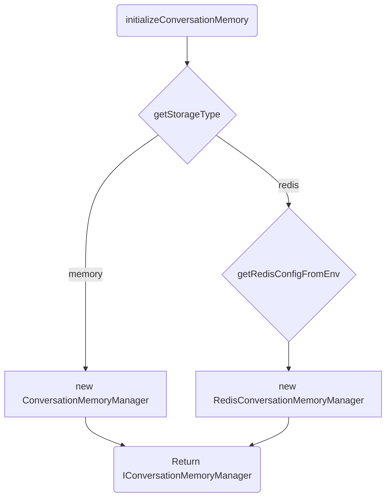

Any application that keeps conversation history has to answer the same architecture question: where does the state live? Local development runs fastest with a zero-dependency, in-memory session store. A production deployment spread across multiple processes, on the other hand, needs a persistent, shared backend like Redis so a user's session survives even if the request lands on a different process next time. Writing application code that forks on `process.env.NODE_ENV` or scatters `if/else` checks across the agent and tool-use logic is a direct path to brittle, untestable systems. NeuroLink's conversation memory factory exists to avoid that: a single, clean interface for conversation history, and a factory that picks the right backend at startup instead of leaking that decision into the rest of the codebase.

The core problem is separating the *what* from the *how*. An AI agent needs to store a turn, retrieve context for the next API call, and maybe clear a session. It should not need to know if that session lives in a `Map` object on the local process or in a Redis cluster an ocean away. The `storeConversationTurn` method should have a single, predictable signature regardless of the underlying storage mechanism. This post dives into the source of how NeuroLink's `initializeConversationMemory` and `createConversationMemoryManager` functions make that choice, how the `IConversationMemoryManager` interface enforces the contract, and how the Redis implementation solves subtle race conditions that the in-memory version never sees. For a higher-level overview of memory strategies, our previous post on [Conversation Memory: Building Stateful AI Applications](/posts/conversation-memory-guide/) is a good starting point.

## The Interface Contract: `IConversationMemoryManager`

Everything starts with the contract. The `IConversationMemoryManager` type defines the surface area that all memory backends must expose. It guarantees that any component asking for a memory manager gets an object with a predictable, consistent set of methods. There is no "if redis then do this" logic in the consuming code. This abstraction is the key to decoupling our application logic from our infrastructure.

The interface, defined in `src/lib/types/conversationMemoryInterface.ts`, focuses on core responsibilities:

- `initialize`: A method to prepare the manager, which for the `RedisConversationMemoryManager` acquires a client from the pool via `getPooledRedisClient` before accepting requests. The in-memory `ConversationMemoryManager` has a near-empty implementation that just marks itself ready.
- `storeConversationTurn`: The primary write method. It takes the session ID and the latest turn (user message, assistant reply) and appends it to the session's history. This is also the point where summarization is triggered.
- `getSession`: Retrieves the entire session object, including messages and metadata. It returns `undefined` if a session does not exist.
- `buildContextMessages`: The most critical method for the agent. It takes a session ID and constructs the precise list of `ChatMessage` objects to be sent to the LLM, including any summaries and respecting token limits.
- `clearSession`: Deletes a single session. This is used for user-requested data deletion or automated cleanup. It returns a boolean indicating if a session was found and deleted.
- `clearAllSessions`: A more powerful admin-level function to wipe the store. In Redis, this scans for every key under the manager's namespace (via `SCAN`, not a blocking `KEYS` call) and deletes them in batches — it doesn't touch the whole Redis database, but it still removes every session for every user and requires caution.
- `getStats`: Provides observability into the memory store, returning counts of active sessions and total messages. The Redis version gets this info from `getPoolStats`.
- `getSessionMessages` and `setSessionMessages`: Low-level "escape hatch" methods for directly reading or overwriting the message history of a session, used for complex migration or repair scripts.
- `close`: An optional method to gracefully shut down connections. This is vital for the `RedisConversationMemoryManager` to call `releasePooledRedisClient` and terminate the connection pool without leaking resources.

```typescript
export type IConversationMemoryManager = {
  initialize(): Promise<void> | void;

  storeConversationTurn(options: StoreConversationTurnOptions): Promise<void>;

  getSession(
    sessionId: string,
    userId?: string
  ): Promise<SessionMemory | undefined> | SessionMemory | undefined;

  buildContextMessages(
    sessionId: string,
    userId?: string,
    enableSummarization?: boolean,
    requestId?: string
  ): Promise<ChatMessage[]> | ChatMessage[];

  clearSession(sessionId: string, userId?: string): Promise<boolean> | boolean;

  clearAllSessions(): Promise<void> | void;

  getStats(): Promise<ConversationMemoryStats> | ConversationMemoryStats;

  getSessionMessages(
    sessionId: string,
    userId?: string
  ): Promise<ChatMessage[]>;

  setSessionMessages(
    sessionId: string,
    messages: ChatMessage[],
    userId?: string
  ): Promise<void>;

  close?(): Promise<void>;
};
```

This contract ensures that whether we're using the simple `ConversationMemoryManager` or the production-grade `RedisConversationMemoryManager`, the calling code never changes. The responsibility for persistence is entirely encapsulated.

## The Factory Predicate: `getStorageType` and `getRedisConfigFromEnv`

The choice of which implementation to instantiate happens once, at application startup. `initializeConversationMemory` is the entry point that makes the decision: it calls `getStorageType` (unless an explicit Redis config was already passed in, which forces Redis) and, for Redis, `getRedisConfigFromEnv`, then hands the result to `createConversationMemoryManager` — a smaller factory function that just switches on the already-decided storage type and constructs the matching manager.

First, `getStorageType` reads the `STORAGE_TYPE` environment variable. It normalizes the value to either `"memory"` or `"redis"` and defaults to `"memory"` if the variable is missing or invalid. This provides a simple, universal switch.

```typescript
// Simplified for clarity
export function getStorageType(): StorageType {
  const storageType = process.env.STORAGE_TYPE?.toLowerCase();
  if (storageType === 'redis') {
    return 'redis';
  }
  return 'memory';
}
```

Second, if the type is `"redis"`, `getRedisConfigFromEnv` assembles the full connection configuration from around ten `REDIS_*` environment variables, like `REDIS_HOST`, `REDIS_PORT`, and `REDIS_PASSWORD` (or a single `REDIS_URL`, including a `rediss://` URL for TLS). None of them are required at this step — anything left unset is simply passed through as `undefined` and picked up later by the connection layer's own defaults (`localhost`, port `6379`, and so on). This keeps all environment-specific parsing cleanly isolated in one place.

```typescript
// Simplified for clarity
function getRedisConfigFromEnv(): RedisStorageConfig {
    return {
        host: process.env.REDIS_HOST,
        port: process.env.REDIS_PORT ? Number(process.env.REDIS_PORT) : undefined,
        password: process.env.REDIS_PASSWORD,
        db: process.env.REDIS_DB ? Number(process.env.REDIS_DB) : undefined,
        keyPrefix: process.env.REDIS_KEY_PREFIX,
        // A rediss:// REDIS_URL is how TLS is requested — there's no separate flag.
        url: process.env.REDIS_URL,
    };
}
```

The overall selection logic is straightforward:



This clean predicate, driven entirely by the environment, lets us switch from a local, ephemeral store to a shared, persistent one without touching a single line of application code. It's a core principle that simplifies both development and our deployment pipeline, a topic we touch on in [How We Test NeuroLink: 20 Continuous Test Suites and Counting](/posts/neurolink-testing-20-test-suites/).

## The Redis Race Condition: `storeToolExecution` and `flushPendingToolData`

Moving to a distributed backend like Redis introduces problems the simple in-memory `Map` never has. The most subtle one is handling tool use. An agentic workflow that uses tools generates at least two messages in rapid succession: the assistant's tool-call message and the user's tool-result message. If these are written to Redis in two separate `SET` commands, a different server process could read the conversation history *between* those two writes. It would see the tool call but not the result, leading to a corrupted state and likely causing the agent to repeat the call or fail entirely.

The `RedisConversationMemoryManager` solves this with a two-phase commit strategy. `storeToolExecution` is declared as an optional method on the shared `IConversationMemoryManager` interface, so any backend can implement it — the in-memory manager just appends the tool-call and tool-result messages straight to the session since there's no cross-process read to race against. The Redis manager's implementation doesn't write directly to Redis. Instead, it stages the tool call and result messages in a private, in-memory `Map` called `pendingToolExecutions`, keyed by session and user. This staging step is synchronous and very fast.

```typescript
// A simplified view of the problem: two separate writes create a race window
async function storeTurn_RACE_CONDITION(sessionId, message) {
  const conversation = await redis.get(sessionId);
  conversation.messages.push(message);
  await redis.set(sessionId, conversation); // Write #1: tool_calls
  // ANOTHER PROCESS CAN READ THE INCOMPLETE STATE HERE
}

async function storeToolResult_RACE_CONDITION(sessionId, resultMessage) {
    const conversation = await redis.get(sessionId);
    conversation.messages.push(resultMessage);
    await redis.set(sessionId, conversation); // Write #2: tool_results
}
```

The actual implementation avoids this. The staged data is only written to Redis when the *next* regular `storeConversationTurn` call occurs. That function's logic includes a call to `flushPendingToolData`, which pushes the pending tool messages into the history and writes the entire, consistent state to Redis in a single, atomic operation. This guarantees that no other process can ever observe an incomplete tool-use pair. The `flushPendingToolData` method checks the `pendingToolExecutions` map, and if it finds data for the current session, it prepends those messages to the new ones being stored and then clears the pending entry.

```typescript
// Simplified logic inside RedisConversationMemoryManager
private pendingToolExecutions = new Map<string, ChatMessage[]>();

private flushPendingToolData(sessionId: string, newMessages: ChatMessage[]): ChatMessage[] {
    const pending = this.pendingToolExecutions.get(sessionId);
    if (pending) {
        this.pendingToolExecutions.delete(sessionId);
        return [...pending, ...newMessages];
    }
    return newMessages;
}

// In storeConversationTurn:
// const messagesToStore = this.flushPendingToolData(sessionId, newMessages);
// await redis.set(getSessionKey(sessionId), serializeConversation(messagesToStore));
```

This ensures that `storeConversationTurn` becomes the single, atomic commit point for all session modifications, elegantly solving the race condition without resorting to expensive Redis locking.

## The Summarization Engine: A Shared Responsibility

While the storage mechanism differs, both memory managers share the responsibility of keeping conversation history from exceeding the model's context window. They delegate this task to a common `SummarizationEngine`.

When `storeConversationTurn` is called, both implementations invoke `checkAndSummarize`. This method, part of the shared engine, performs a series of steps:

1. It estimates the token count of the current conversation history using `estimateTokens`.
2. It compares this count to a configurable limit, determined by `getEffectiveTokenThreshold`. This threshold is dynamically calculated based on the `MEMORY_THRESHOLD_PERCENTAGE` constant (0.8, i.e. 80%) and the specific context window of the model being used.
3. If the threshold is exceeded, it triggers `generateSummary`.

The summary generation itself uses a sophisticated prompt-building function, `buildSummarizationPrompt`, which constructs a detailed request for the LLM to condense the history. This prompt instructs the model to identify key entities, user intent, and unresolved questions to create a dense, useful summary. The function `createSummarySystemMessage` then wraps the LLM's output in a `ChatMessage` object with the `system` role. This process is critical for maintaining long-running conversations and is part of our broader strategy for managing context, which we detail in [Four-stage context compaction: what runs when the model window fills up](/posts/four-stage-context-compaction-what-runs-when-the-model-window-fills-up/).

```typescript
function buildSummarizationPrompt(messages: ChatMessage[]): string {
    const history = messages.map(m => `${m.role}: ${m.content}`).join('\n');
    return `Please summarize the following conversation. Identify the main topics, key decisions, and any unresolved questions.
---
${history}
---
Summary:`;
}
```

The `generateSummary` function takes the oldest messages, generates the summary, and then replaces them with the single new summary message. This new, shorter message list is then handed back to the memory manager to be persisted. By delegating this common, complex logic to the `SummarizationEngine`, we keep the `ConversationMemoryManager` and `RedisConversationMemoryManager` focused on their primary job: storage.

## Redis-Only Capabilities

The `RedisConversationMemoryManager` also adds capabilities that wouldn't make sense for a transient, in-memory store. It manages a reference-counted connection pool via `getPooledRedisClient` and `releasePooledRedisClient` so concurrent callers share existing connections instead of opening a new one each time. This avoids the latency of establishing a fresh TCP connection for every request. A separate `isRedisHealthy` helper sends a `PING` command to a client and checks for a `PONG` reply, for callers that want to probe connectivity directly; the manager's own `getHealthStatus` check reports connection state from the client's own `isOpen` flag instead.

It also introduces an async `generateConversationTitle` method. On the first turn of a brand-new session, it dispatches a background job using `setImmediate` to generate a descriptive title from the user's message (e.g., "API Key Rate Limit Issue") without blocking the main conversation flow. This title is then stored with the session metadata, providing a much better user experience for browsing session history via the `getUserAllSessionsHistory` method, a feature the simple in-memory manager has no need for.

```typescript
// Simplified: title generation is dispatched from storeConversationTurn
// only when this is a brand-new session (no existing conversation yet).
if (!conversation) {
    setImmediate(async () => {
        const title = await this.generateConversationTitle(options.userMessage);
        await this.redisClient.set(getSessionKey(sessionId), title); // persisted with the session
    });
}

async generateConversationTitle(userMessage: string): Promise<string> {
    // Makes a cheap, dedicated LLM call to turn the first user message into a short title
    ...
}
```

Finally, the Redis manager provides methods for user-centric session management, such as `getUserSessions`, which reads a Redis set keyed by `userId` (populated as sessions are created) to find all of that user's session IDs in one round trip. `clearAllSessions`, by contrast, does need to enumerate the whole namespace and uses `scanKeys` for that. Per-user session lookup is impossible in the single-process in-memory store but is essential for multi-session user experiences. These enhancements are possible because the `IConversationMemoryManager` contract provides a solid foundation, while the factory pattern gives us the flexibility to layer on backend-specific features where they add the most value.

---

**Related posts:**

- [From User Input to Provider API: The Five-Stage Message Flow](/posts/from-user-input-to-provider-api-the-five-stage-message-flow/)
- [Twenty-four providers, one BaseProvider: the adapter catalog](/posts/twenty-four-providers-one-baseprovider-the-adapter-catalog/)
- [How We Test NeuroLink: 20 Continuous Test Suites and Counting](/posts/neurolink-testing-20-test-suites/)
