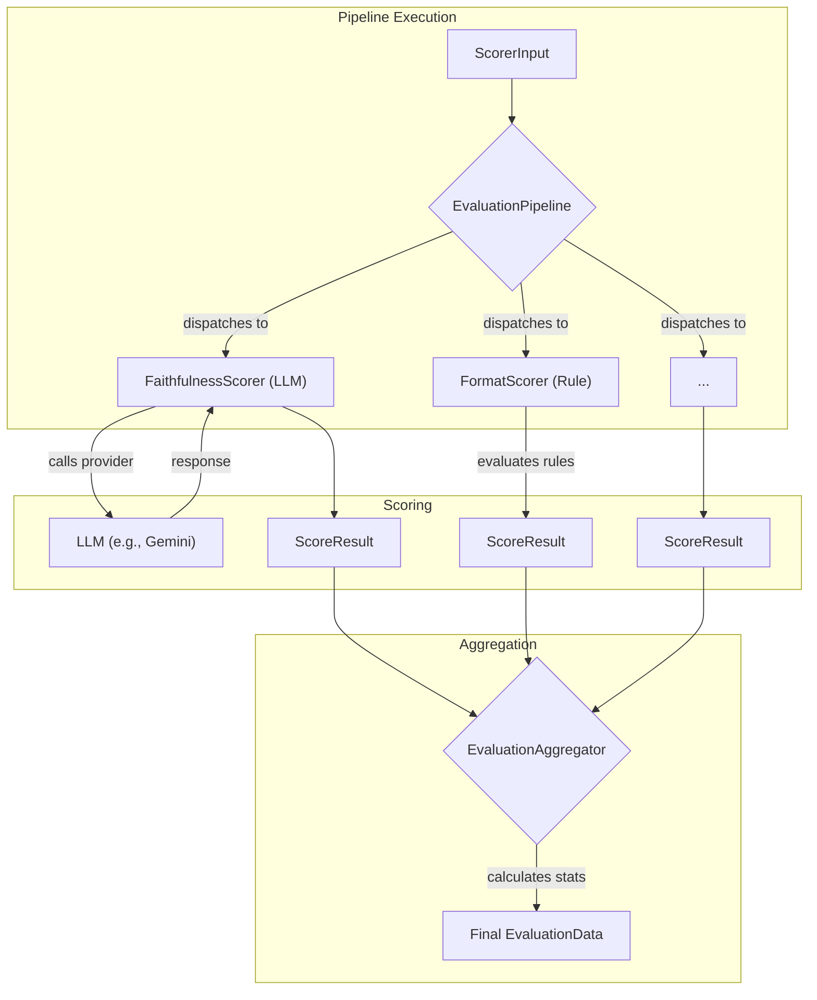

We designed NeuroLink's scorer hierarchy because a single, monolithic evaluation function was impossible to test, extend, or debug. When a RAG pipeline's `FaithfulnessScorer` started returning anomalous scores after a Gemini API update, we had no way to isolate it from the `ToxicityScorer` or the deterministic `FormatScorer` running in the same evaluation pass. A failure in one check could silently corrupt the entire result. We needed a system where every evaluation concern was a distinct, composable class, managed by a predictable pipeline.

This post dives deep into that architecture. It's the next level of detail from our previous post on [Model Evaluation and Scoring: RAGAS-Style Quality Assessment](/posts/model-evaluation-scoring/), which covered the *what* of our metrics. Here, we cover the *how*: the class hierarchy, the pipeline orchestrator, and the observability hooks that make our evaluation system robust and extensible.

## The Scorer Class Hierarchy

At the root of the system is `BaseScorer`. This abstract class defines the universal contract for any scorer: a `score` method that takes an input and returns a result. It also provides foundational utilities that all scorers inherit, including input validation, score normalization, and a robust `executeWithRetry` mechanism for handling transient network failures.

From this base, the hierarchy splits into two distinct branches.

- `BaseLLMScorer` is the parent for any evaluation that requires a provider call. It introduces the core abstractions for this pattern: an abstract `generatePrompt` method to create the provider-specific prompt and an abstract `parseResponse` method to interpret the model's output. It handles the mechanics of the actual API call through its `callLLM` method.

- `BaseRuleScorer` is the parent for deterministic, offline evaluations. It operates without any external LLM calls. Instead, it manages a collection of `ScorerRule` objects and provides an `evaluateRule` method to execute them. It supports multiple modes for combining rule results, such as requiring all rules to pass (`all`), any rule to pass (`any`), or calculating a weighted score.

This division ensures a clean separation of concerns. A scorer either talks to an LLM or it does not. There is no ambiguity.

```typescript
// All scorers, regardless of type, share a common foundation.
export abstract class BaseScorer {
  // The universal contract for all scorers
  abstract score(input: ScorerInput): Promise<ScoreResult>;

  // Built-in resilience for any scorer
  protected async executeWithRetry<T>(
    fn: () => Promise<T>,
    ...
  ): Promise<T>;
}

// For scorers that call a provider like OpenAI or Anthropic
export abstract class BaseLLMScorer extends BaseScorer {
  abstract generatePrompt(input: ScorerInput): string;
  abstract parseResponse(response: string): Partial<ScoreResult>;

  protected async callLLM(prompt: string): Promise<string>;
}

// For deterministic, offline checks
export abstract class BaseRuleScorer extends BaseScorer {
  abstract getRules(): ScorerRule[];
  abstract evaluateRule(rule: ScorerRule, input: ScorerInput): RuleResult;
}
```

## The Scorer Implementations

The `scorers/` directory contains the concrete implementations of this hierarchy. NeuroLink ships with over a dozen pre-built scorers, each targeting a specific quality dimension.

The LLM-based scorers, which extend `BaseLLMScorer`, include:

- `FaithfulnessScorer`: Checks if the model's answer is factually grounded in the provided context.
- `HallucinationScorer`: Detects statements that are not supported by the context.
- `AnswerRelevancyScorer`: Measures if the answer directly addresses the user's question.
- `ContextPrecisionScorer`: Evaluates if the context provided to the LLM was relevant and concise.
- `ToxicityScorer`: Flags harmful, offensive, or biased language.
- `SummarizationScorer`: Assesses the quality of a summary against the original text.
- `ToneConsistencyScorer`: Checks if the response adheres to a specified tone.

The rule-based scorers, which extend `BaseRuleScorer`, handle deterministic checks:

- `FormatScorer`: Validates that the output conforms to a required format (e.g., JSON, XML, Markdown).
- `KeywordCoverageScorer`: Ensures specific keywords are present in the output.
- `LengthScorer`: Checks if the output is within a given length range.

A special case is `ContentSimilarityScorer`, which extends `BaseScorer` directly. It uses algorithms like Jaccard and Levenshtein distance to measure similarity without an LLM call.

```typescript
// src/lib/evaluation/scorers/llm/answerRelevancyScorer.ts
export class AnswerRelevancyScorer extends BaseLLMScorer {
  // Each LLM scorer implements a specific prompt generation strategy.
  generatePrompt(input: ScorerInput): string {
    const { question, answer } = input;
    if (!question || !answer) {
      throw new Error("Question and answer are required for AnswerRelevancyScorer.");
    }
    // The prompt asks a separate evaluation model to grade the primary model's output.
    return `
      Given the question: "${question}"
      And the answer: "${answer}"

      Please evaluate the relevancy of the answer to the question on a scale of 1 to 10.
      A score of 1 means completely irrelevant.
      A score of 10 means perfectly relevant.
      Provide your reasoning in a JSON object with "score" and "reason" fields.
    `;
  }

  // It also implements a corresponding response parser.
  parseResponse(response: string): Partial<ScoreResult> {
    const json = this.extractJSON(response);
    return {
      score: json?.score,
      reasoning: json?.reason,
    };
  }
}
```

## Registration and Custom Builders

Scorers aren't used via direct instantiation. Instead, they are managed by the `ScorerRegistry`. On startup, `ScorerRegistry.registerBuiltInScorers()` dynamically imports and registers all the standard scorers, making them available by ID.

For cases where a full class is overkill, we built `ScorerBuilder`. This fluent API lets you define a custom scorer programmatically. You can create simple rule-based scorers for checking patterns, keywords, or length on the fly. For more complex logic, `createFunctionScorer` wraps any function into a valid scorer object, and `composeScorers` can combine multiple scorers into a single, weighted evaluation.

```typescript
// Dynamically creating a rule-based scorer without a new class.
const jsonFormatScorer = ScorerBuilder.create('custom-json-check', 'JSON Format Check')
  .description('Ensures the output is valid JSON')
  .type('rule')
  .customRule({
    id: 'is-json',
    name: 'Is Valid JSON',
    evaluate: (input: ScorerInput) => {
      try {
        JSON.parse(input.answer);
        return { passed: true, score: 1, reasoning: 'Output is valid JSON.' };
      } catch (e) {
        return { passed: false, score: 0, reasoning: `JSON parsing failed: ${e.message}` };
      }
    },
  })
  .build();
```

## The Evaluation Pipeline

Individual scorers are the building blocks. The `EvaluationPipeline` is the engine that runs them. It takes a set of scorers and an input, executes the scorers, and aggregates their results. This architecture is distinct from the main API request lifecycle described in [From User Input to Provider API: The Five-Stage Message Flow](/posts/from-user-input-to-provider-api-the-five-stage-message-flow/); this is a dedicated, post-processing evaluation stage.

We use the `PipelineBuilder` to construct pipelines. It offers a fluent API for adding scorers, setting execution policies, and defining aggregation strategies. You can run scorers in parallel with `parallel()` for speed or in sequence with `sequential()` for dependent checks. You can also configure whether the pipeline should `stopOnFailure()` or `continueOnFailure()`.



The builder produces an `EvaluationPipeline` instance, ready to execute. For common use cases, we ship a set of `PipelinePresets` like `safety`, `rag`, `quality`, and `codeGeneration`, which provide pre-configured pipelines for turnkey evaluations.

```typescript
// Building a RAG quality pipeline using the fluent API
const ragPipeline = await PipelineBuilder.create('rag-quality-pipeline')
  .description('Evaluates the quality of a RAG system response.')
  .addScorer('faithfulness')
  .addScorer('answer-relevancy')
  .addScorer('context-precision')
  .aggregateWith('weighted')
  .withWeights({
    'faithfulness': 0.5,
    'answer-relevancy': 0.3,
    'context-precision': 0.2,
  })
  .parallel()
  .timeout(5000)
  .buildAndInitialize();

// const results = await ragPipeline.evaluate(myScorerInput);
```

## Batch Processing at Scale

Evaluating a single interaction is useful, but robust quality assessment requires running evaluations over large datasets. The `BatchEvaluator` is designed for this purpose. It wraps an `EvaluationPipeline` and provides methods like `evaluateBatch` to run the pipeline against an array of inputs. It manages concurrency to avoid overwhelming providers and includes per-item retry logic.

The `BatchStrategy` in `pipeline/strategies/` complements this by defining how to process raw arrays of `ScorerInput`, allowing for different dispatch and concurrency patterns for large-scale jobs. This is a core part of our internal quality control, as detailed in [How We Test NeuroLink: 20 Continuous Test Suites and Counting](/posts/neurolink-testing-20-test-suites/).

```typescript
// An example of how the BatchEvaluator might be invoked
async function runBulkEvaluation(pipeline: EvaluationPipeline, dataset: ScorerInput[]) {
  const batchEvaluator = new BatchEvaluator(pipeline, {
    concurrency: 10, // Process 10 items in parallel
    itemRetry: 2,    // Retry each failed item up to 2 times
  });

  const results = await batchEvaluator.evaluateBatch(dataset);

  const aggregator = new EvaluationAggregator(results);
  const stats = aggregator.calculateStatistics();
  console.log('Batch evaluation complete:', stats);
}
```

## The Factory and Registry Bridge

To integrate the evaluation system with NeuroLink's core provider model, we use the `EvaluatorFactory` and `EvaluatorRegistry`. This pattern mirrors how we manage providers across the platform, as seen in our [adapter catalog](/posts/twenty-four-providers-one-baseprovider-the-adapter-catalog/).

The `EvaluatorRegistry` is a singleton that holds named evaluation strategies and pipeline presets (`default`, `strict`, `rag`). The `EvaluatorFactory` resolves these names, selects the appropriate backing LLM for scorers via environment variables like `NEUROLINK_RAGAS_EVALUATION_PROVIDER`, and instantiates the fully configured `EvaluationPipeline`. This decouples the pipeline definition from the specific runtime environment.

```typescript
// Using the factory to get a pre-configured evaluator
async function getPipelineForEnvironment() {
  const factory = new EvaluatorFactory(EvaluatorRegistry.getInstance());

  // Resolves the 'rag' preset and configures its LLM scorers
  // based on environment variables.
  const ragEvaluator = await factory.create('rag');

  return ragEvaluator;
}
```

## Observability and Reporting

A black-box evaluation pipeline is a blind spot. We built `ObservabilityHooks` to provide deep visibility into the evaluation process. It's a typed event emitter that fires lifecycle events: `pipeline:start`, `pipeline:end`, `scorer:start`, and `scorer:end`.

You can subscribe to these events to log performance, trace execution, or collect metrics. We ship a `MetricsCollector` that does exactly this. The `createMetricsCollectorHook` adapter wires the collector to the pipeline's events, automatically tracking per-scorer latency, success rates, and score distributions. For external systems, we also provide adapters like `LangfuseAdapter` to stream evaluation data to third-party observability platforms. Finally, `ReportGenerator` can consume the aggregated data to produce human-readable quality reports.

```typescript
// Subscribing to pipeline events for custom logging
const pipeline = await new PipelineBuilder().addScorer('toxicity').buildAndInitialize();

const hooks = new ObservabilityHooks();
hooks.on('scorer:start', ({ id }) => console.log(`Scorer ${id} started.`));
hooks.on('scorer:end', ({ id, result }) => {
  console.log(`Scorer ${id} finished with score ${result.score}.`);
});

pipeline.setHooks(hooks);
// Now, running pipeline.evaluate() will trigger the log messages.
```

## Structured Error Handling

Reliable automation depends on predictable error handling. Every potential failure point in the evaluation pipeline, from input validation to provider timeouts, is mapped to a set of `EvaluationErrorCodes`. When a scorer or pipeline fails, it does so with a structured error, not just a generic exception. This allows consuming systems to build robust retry and alerting logic tailored to the specific failure mode.

```typescript
try {
  await pipeline.evaluate(input);
} catch (e) {
  if (e.code === EvaluationErrorCodes.PROVIDER_UNAVAILABLE) {
    // Specific logic for when the evaluation model is down
    console.error("Evaluation provider is unavailable. Retrying later.");
  } else {
    // General error handling
    console.error("An unexpected evaluation error occurred:", e.message);
  }
}
```

---

**Related posts:**

- [What You Actually Inherit When You Extend BaseProvider](/posts/what-you-actually-inherit-when-you-extend-baseprovider/)
- [How We Test NeuroLink: 20 Continuous Test Suites and Counting](/posts/neurolink-testing-20-test-suites/)
