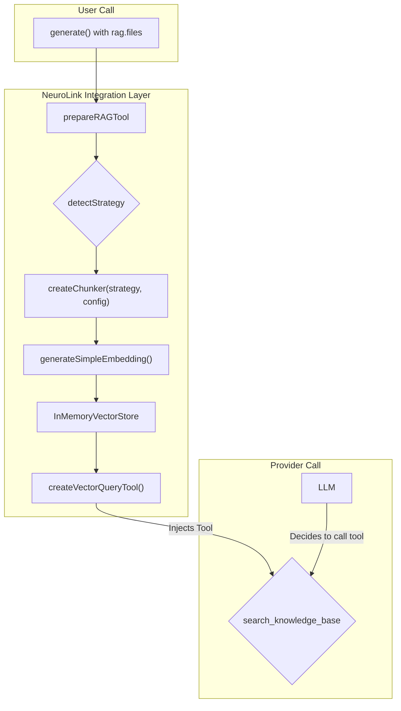

We designed NeuroLink's RAG integration because developers needed to ground generation in a set of documents without wiring up a whole pipeline. A simple call to `generate()` or `stream()` with a list of files should just work. The problem was that our powerful, standalone `RAGPipeline` was overkill for one-off questions over a handful of uploaded PDFs or Markdown files. Developers faced a choice: either commit to a full-scale RAG setup or manually Frankenstein file content into a prompt. The gap between a persistent, multi-stage pipeline and a single, in-context query is where `prepareRAGTool` lives.

This post dives deep into the integration layer that makes RAG a zero-setup feature of `generate()` and `stream()`. For a walkthrough of building a standalone application with our RAG components, see our earlier post, [Building a RAG Application with TypeScript: Complete Tutorial](/posts/rag-application-typescript-tutorial/). Here, we focus on the magic that happens behind the scenes.

## From File Path to Chunking Strategy

It starts with a file path. A user provides a list of files, and NeuroLink has to turn them into useful context. Different files need different handling: a Markdown file is best chunked by its headers, an HTML file by its structure, and a JSON file by its object boundaries. Blindly applying one strategy to all files produces low-quality chunks and irrelevant search results.

Our solution is an explicit routing map, `EXTENSION_TO_STRATEGY`. This `Record<string, ChunkingStrategy>` is the first stop inside `prepareRAGTool`. The `detectStrategy` function uses it to route each file to the correct chunking logic based on its extension.

```typescript
// From ragIntegration.ts — the actual strategy map
const EXTENSION_TO_STRATEGY: Record<string, ChunkingStrategy> = {
  '.md': 'markdown',
  '.mdx': 'markdown',
  '.html': 'html',
  '.htm': 'html',
  '.json': 'json',
  '.tex': 'latex',
  '.latex': 'latex',
  '.txt': 'recursive',
  '.csv': 'recursive',
  '.xml': 'recursive',
  '.yaml': 'recursive',
  '.yml': 'recursive',
  '.ts': 'recursive',
  '.js': 'recursive',
  '.py': 'recursive',
  '.java': 'recursive',
  '.go': 'recursive',
  // ... and so on for other language extensions
};

function detectStrategy(filePath: string): ChunkingStrategy {
  const ext = extname(filePath).toLowerCase();
  return EXTENSION_TO_STRATEGY[ext] || 'recursive'; // Fallback
}
```

If a file type is not in the map — PDF files included, since `.pdf` has no explicit entry — we fall back to the `recursive` character-based chunker. This provides a robust baseline for unknown and binary-extracted formats, and makes the system's behavior predictable: when in doubt, apply the general-purpose recursive splitter.

Notice that source code extensions like `.ts`, `.js`, and `.py` also map to `'recursive'`. There is no special `'code'` strategy in `ChunkingStrategy`; the recursive splitter handles code files well enough for the lightweight in-context use case that `prepareRAGTool` targets.

## The createChunker Function

Once `detectStrategy` returns a strategy name like `'markdown'` or `'json'`, we need an actual chunker instance. We abstract this behind `createChunker`, a factory function exported from `ChunkerFactory.ts`. You can see a similar pattern across NeuroLink's architecture in our post [Inside ConversationMemoryFactory: How NeuroLink Picks and Wires a Memory Backend](/posts/inside-conversationmemoryfactory-how-neurolink-picks-and-wires-a-memory-backend/).

```typescript
// How prepareRAGTool uses createChunker — from ragIntegration.ts
import { createChunker } from './ChunkerFactory.js';

for (const { path, content, strategy } of fileContents) {
  const chunker = await createChunker(strategy, {
    maxSize: chunkSize,
    overlap: Math.min(chunkOverlap, Math.floor(chunkSize * 0.5)),
  });

  const chunks = await chunker.chunk(content, {
    metadata: { source: path },
  });

  for (const chunk of chunks) {
    allChunks.push({
      text: chunk.text,
      metadata: { ...chunk.metadata, source: path },
    });
  }
}
```

`createChunker` takes a strategy name and a configuration object (`{ maxSize, overlap }`), and returns an initialized `Chunker` instance. The input to `chunker.chunk()` is a plain string along with an optional metadata bag — there is no `MDocument` wrapper here. This keeps the integration lean and avoids pulling in heavier document-model abstractions.

## Lightweight Embeddings without a Model Call

A full RAG pipeline often uses a powerful sentence-transformer model for embeddings, which can introduce latency and cost. For the lightweight `generate()` integration, we needed something faster that didn't require a network call.

The answer is `generateSimpleEmbedding`. This function creates a 128-dimensional vector (`EMBEDDING_DIMENSION = 128`) using a deterministic, non-ML approach based on FNV-1a hashing. It generates the vector by blending two types of features across the full dimension:

- **60% Word-Level Hashes:** It tokenizes the input text, hashes each word using `hashWord` (which runs the FNV-1a algorithm), and increments the corresponding index in a word-embedding array.
- **40% Character Frequency:** It iterates over every character in the text and increments the index `charCode % dimension` in a separate character-embedding array.

The two full-dimension arrays are then combined element-wise as `0.4 * charEmbedding[i] + 0.6 * wordEmbedding[i]` and normalized to a unit vector. There is no partitioned slot allocation — both feature types contribute to every position in the vector, blended by their respective weights.

The FNV-1a algorithm is chosen for its excellent distribution properties and high performance. We use the standard 32-bit offset basis of `2166136261` and prime of `16777619`.

```typescript
// Simplified conceptual logic from generateSimpleEmbedding
function generateSimpleEmbedding(text: string, dimension: number): number[] {
  const charEmbedding = new Array(dimension).fill(0);
  const wordEmbedding = new Array(dimension).fill(0);

  // Character-frequency features: charCode % dimension
  for (let i = 0; i < text.length; i++) {
    const idx = text.charCodeAt(i) % dimension;
    charEmbedding[idx] += 1;
  }

  // Word-level FNV-1a hash features
  const words = text.toLowerCase().replace(/[^a-z0-9\s]/g, '').split(/\s+/).filter(w => w.length > 1);
  for (const word of words) {
    const idx = hashWord(word, dimension); // FNV-1a hash % dimension
    wordEmbedding[idx] += 1;
  }

  // Blend across the full vector: 40% char, 60% word
  const combined = new Array(dimension);
  for (let i = 0; i < dimension; i++) {
    combined[i] = 0.4 * charEmbedding[i] + 0.6 * wordEmbedding[i];
  }

  // Normalize to unit vector
  const magnitude = Math.sqrt(combined.reduce((sum, v) => sum + v * v, 0));
  if (magnitude > 0) {
    for (let i = 0; i < dimension; i++) combined[i] /= magnitude;
  }
  return combined;
}
```

This approach is fast, has no external dependencies, and is effective for in-context retrieval where the document set is small and known ahead of time. At 128 dimensions it is also memory-efficient: even thousands of chunks can sit comfortably in the `InMemoryVectorStore`.

## The Injected Knowledge-Base Tool

After chunking and embedding, the data is loaded into an `InMemoryVectorStore`. The final step inside `prepareRAGTool` is to create a tool that the provider can call. This is where `createVectorQueryTool` comes in. It wraps the vector store in a Zod-validated tool schema, creating a function named `search_knowledge_base`.

This dynamically created tool is then injected into the list of tools available for the `generate()` or `stream()` call. The AI provider — be it Claude, Gemini, or OpenAI — sees `search_knowledge_base` as just another available function.

Here is a diagram illustrating the entire flow:



When the user's query requires information from the provided files, the model calls this tool, which executes a similarity search against the in-memory vector store and returns the most relevant chunks.

## Guaranteeing Source Diversity

A common failure mode in RAG is retrieving a dozen chunks that all come from the same long document, missing out on potentially more relevant context from other files. This is especially problematic when dealing with a mix of short and long files.

We built `diversifyResults` to counteract this. After the initial vector search, this function post-processes the results to ensure they are drawn from a variety of source documents.

```typescript
// The actual signature from ragIntegration.ts
function diversifyResults(
  results: VectorQueryResult[],
  topK: number,
): VectorQueryResult[]

// Conceptual usage inside the search_knowledge_base tool execute handler
const fetchK = fileContents.length > 1 ? topK * 3 : topK;
const rawResults = await vectorStore.query({ indexName, queryVector, topK: fetchK });

// Apply source-file diversity for multi-file RAG
const results = fileContents.length > 1
  ? diversifyResults(rawResults, topK)
  : rawResults.slice(0, topK);
```

`diversifyResults` takes a flat results array and a plain integer `topK`. It groups results by source file, then performs a **round-robin selection**: it walks the groups in order, taking one result from each in turn, cycling until `topK` items have been collected. This ensures that if five source files are loaded, the first five results will each come from a different file — prioritizing coverage over pure similarity score. This step is crucial for providing the model with a balanced and comprehensive view of the knowledge base.

This is part of the larger challenge of context management, which we also cover in [Four-stage context compaction: what runs when the model window fills up](/posts/four-stage-context-compaction-what-runs-when-the-model-window-fills-up/).

## The Resilience Handlers — Available but Not Wired In

`ragIntegration.ts` calls `generateSimpleEmbedding` and `vectorStore.upsert`/`query` directly, with no retry wrapper in the hot path. For the local FNV-1a hashing and in-process vector store this is the right trade-off: both operations are CPU-bound and essentially infallible, so the overhead of a retry loop would be wasted.

The retry infrastructure does exist for when you swap in a network-backed embedding provider. `src/lib/rag/resilience/RetryHandler.ts` exports two specialized singletons:

- **`EmbeddingRetryHandler`** — defaults to `maxRetries: 5` and `initialDelay: 2000 ms`, tuned for rate-limited embedding APIs.
- **`VectorStoreRetryHandler`** — defaults to `maxRetries: 3` and `initialDelay: 1000 ms`, tuned for connection-level transients.

Both extend `RAGRetryHandler`, whose retry method is `executeWithRetry()`:

```typescript
import {
  EmbeddingRetryHandler,
  VectorStoreRetryHandler,
} from './resilience/RetryHandler.js';

// Example: wrapping a network embedding call with the handler
const embeddingRetryHandler = new EmbeddingRetryHandler({
  maxRetries: 5,
  initialDelay: 2000,
  backoffMultiplier: 2,
});

const vectorStoreRetryHandler = new VectorStoreRetryHandler({
  maxRetries: 3,
  initialDelay: 1000,
});

// Using executeWithRetry (not .execute)
await embeddingRetryHandler.executeWithRetry(() =>
  myNetworkEmbeddingProvider.embed(chunk.content, 128)
);
```

When you configure `embeddingProvider` on the `RAGConfig`, the `createVectorQueryTool` path picks up that provider; wrapping its calls with `EmbeddingRetryHandler` is the recommended pattern for production deployments that use remote embedding models.

---

**Related posts:**

- [Grading the model: the scorer hierarchy and evaluation pipeline](/posts/grading-the-model-the-scorer-hierarchy-and-evaluation-pipeline/)
- [Seventeen file processors, six categories, one priority system](/posts/seventeen-file-processors-six-categories-one-priority-system/)
- [From User Input to Provider API: The Five-Stage Message Flow](/posts/from-user-input-to-provider-api-the-five-stage-message-flow/)
