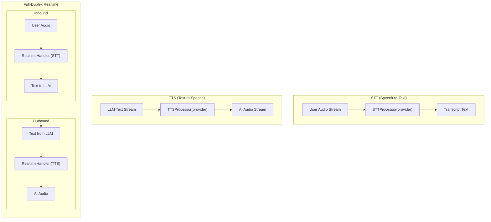

We designed NeuroLink's `ChunkedAudioStream` because our first real-time voice demos with ElevenLabs were collapsing under load. A fast text-to-speech (TTS) provider generating audio chunks faster than a client's network could consume them would lead to uncontrolled buffer growth, memory exhaustion, and dropped WebSocket connections. We needed a stream primitive that understood backpressure natively, queuing data when downstream consumers were busy and draining it gracefully when they were ready. This became the foundation for all three of our voice topologies: speech-to-text, text-to-speech, and full-duplex conversational agents.

While our provider abstraction pattern is a good starting point, the engineering required for robust voice streaming runs much deeper. This post dives into the audio-specific architecture: the stream primitives, the full-duplex state machine, codec handling, and the subtle but critical differences between providers like OpenAI and Gemini.

## The Three Voice Topologies

At its core, all voice interaction in NeuroLink is modeled as one of three streaming topologies. This is a deliberate simplification. Instead of a dozen unique provider integrations, we think in terms of three fundamental data flows. Our provider abstraction, which we've detailed in a [previous post on provider abstractions](/posts/provider-abstraction/), handles the API specifics; the topologies handle the data mechanics.

- **Speech-to-Text (STT):** An inbound audio stream is converted to a text stream. This is a one-way flow from the user to the system.
- **Text-to-Speech (TTS):** An outbound text stream is converted to an audio stream. This is a one-way flow from the system to the user.
- **Full-Duplex Realtime:** Two streams operate concurrently. An inbound audio stream (user speaking) and an outbound audio stream (AI speaking), often with complex turn-taking logic.

These topologies are composed from a common set of streaming and audio-processing primitives.



## Streaming Primitives: Backpressure and Composition

The foundation of our voice system is `stream-handler.ts`. It knows nothing about audio formats or AI providers; it only knows how to move buffers of data efficiently and reliably.

The core component is `ChunkedAudioStream`. It's an EventEmitter that implements a critical feature: backpressure. When a downstream consumer can't keep up, the `write()` method returns `false`, and the stream buffers subsequent data until the consumer emits a `drain` event. This prevents the memory blowouts we saw in our early prototypes. The high-water mark, which defaults to 64 KB, is the key tuning parameter.

```typescript
// A simplified view of the backpressure mechanism in ChunkedAudioStream
class ChunkedAudioStream {
  private highWaterMark = 64 * 1024; // 64 KB
  private buffer: Buffer = Buffer.alloc(0);
  private pendingData: Buffer[] = [];

  write(data: Buffer): boolean {
    // Check BEFORE appending — avoids the race where processData() could emit
    // 'drain' synchronously mid-call, causing a producer waiting on 'false'
    // to deadlock (see stream-handler.ts:102–109).
    const willOverflow =
      this.buffer.length + data.length > this.highWaterMark;
    if (willOverflow) {
      this.pendingData.push(data); // queue for later, once drain fires
      return false; // signal the producer to pause
    }

    this.processData(data);
    return true;
  }

  // processData() emits 'resume'/'drain' when the buffer falls below
  // highWaterMark / 2, then replays pending chunks via recursive write() calls.
}
```

The key point is that overflow is evaluated _before_ the data is appended, and overflowing chunks go into a separate `pendingData: Buffer[]` queue rather than the main buffer. This was a deliberate correction to avoid a deadlock that could occur when `processData()` emitted `drain` synchronously during a `write()` call.

On top of this primitive, we build compositional tools:

- **`StreamMerger`**: Combines multiple `ChunkedAudioStream` instances into one. Useful for scenarios where multiple audio sources need to be processed as a single stream.
- **`StreamSplitter`**: Takes a single `ChunkedAudioStream` and fans it out to multiple consumers. This allows, for instance, a single live audio feed to be simultaneously transcribed, recorded, and analyzed for sentiment.

Finally, the file provides `streamToAsyncIterable` and `asyncIterableToStream`, two essential bridges between the classic EventEmitter-based push streams and the modern `for await...of` pull-based consumption pattern common in the rest of NeuroLink.

## The Audio Codec Layer: Pure Functions

The `audio-utils.ts` file is our universal toolkit for audio manipulation. It contains a collection of pure functions with no provider dependencies. This is our sanctum of audio processing, ensuring that format detection, conversion, and analysis are consistent everywhere.

The most critical function is `detectAudioFormat`. It inspects the initial bytes of a buffer using byte comparisons to identify the audio format (WAV, MP3, Ogg Opus, Ogg Vorbis) without relying on file extensions or MIME types, which can be unreliable.

```typescript
// audio-utils.ts: Magic byte detection
function detectAudioFormat(buffer: Buffer): TTSAudioFormat | null {
  if (buffer.length < 12) return null;

  // Check for RIFF (WAV) — full RIFF....WAVE signature
  if (buffer[0] === 0x52 && buffer[1] === 0x49 && buffer[2] === 0x46 && buffer[3] === 0x46 &&
      buffer[8] === 0x57 && buffer[9] === 0x41 && buffer[10] === 0x56 && buffer[11] === 0x45) {
    return 'wav';
  }
  // Check for MP3 (ID3 tag or frame sync)
  if (
    (buffer[0] === 0x49 && buffer[1] === 0x44 && buffer[2] === 0x33) || // ID3
    (buffer[0] === 0xff && (buffer[1] & 0xe0) === 0xe0)                 // Frame sync
  ) {
    return 'mp3';
  }
  // Check for OggS container — then distinguish Opus from Vorbis
  if (buffer[0] === 0x4f && buffer[1] === 0x67 && buffer[2] === 0x67 && buffer[3] === 0x53) {
    // Opus pages carry an "OpusHead" magic string in the first ~200 bytes
    const opusOffset = buffer.indexOf('OpusHead');
    return (opusOffset !== -1 && opusOffset < 200) ? 'opus' : 'ogg';
  }
  return null;
}
```

Note that the OggS container is a two-step check: a buffer that opens with `OggS` but does _not_ contain `OpusHead` in the first 200 bytes returns `'ogg'`, not `'opus'`. Both are distinct `TTSAudioFormat` values used in downstream codec branching. The WAV check also verifies the full `RIFF....WAVE` signature (bytes 0–3 and 8–11) using byte comparisons rather than string conversion.

Other key responsibilities in this file include:

- **Header Creation**: `createWavHeader` constructs a valid WAV header for raw PCM audio data, a common requirement before sending audio to many STT providers.
- **Resampling**: `resamplePcm` changes the sample rate of PCM audio, another frequent preprocessing step to meet provider requirements (e.g., downsampling from 48kHz to 16kHz).
- **Duration Calculation**: `calculateDuration` dispatches to format-specific helpers (`calculateWavDuration`, `estimateMp3Duration`, `estimateOpusDuration`) to provide duration estimates from audio buffers.
- **Format Conversion**: `convertAudioFormat` abstracts away format changes, though full cross-format conversion currently requires pre-processing with an external tool like ffmpeg.

## A Unified Error Taxonomy

Provider APIs are inconsistent in how they report failures. A connection timeout from one provider might be a `504` HTTP error, while another might be a cryptic WebSocket close code. `errors.ts` solves this by defining a structured error hierarchy for all voice operations.

The base class is `VoiceError`, which extends our global `NeuroLinkError`. From there, we specialize:

- **`STTError`**: For speech-to-text failures. It includes static factory methods for common problems like `STTError.audioTooLong(durationSeconds, maxDurationSeconds, provider?)`, `STTError.invalidFormat(format, supportedFormats?, provider?)`, and `STTError.languageNotSupported(language, supportedLanguages?, provider?)`.
- **`RealtimeError`**: For full-duplex session failures. This class provides factories for issues like `RealtimeError.connectionFailed(reason, provider?, originalError?)`, `RealtimeError.sessionTimeout(timeoutMs, provider?)`, and `RealtimeError.protocolError(reason, provider?, originalError?)`.

When a provider handler in NeuroLink catches a provider-specific exception, its job is to map that exception to one of these standard error types. This ensures the rest of the system can react to failures programmatically without needing to know the specifics of ElevenLabs, Deepgram, or Google. All factory methods are positional; note that `languageNotSupported` takes `(language: string, supportedLanguages?: string[], provider?: string)` — not an options object.

```typescript
// Example: A provider handler normalizes a failure
try {
  // some provider-specific API call
} catch (e) {
  if (e.message.includes('unsupported language')) {
    throw STTError.languageNotSupported('es-MX', undefined, 'some_provider');
  }
  // ... other mappings
}
```

## Provider Registries: `TTSProcessor` and `STTProcessor`

The `TTSProcessor` and `STTProcessor` are classes whose methods are exclusively static, acting as central registries for their respective handlers. This pattern is fundamental to NeuroLink's design and is shared across many domains, as detailed in our post on [the adapter catalog](/posts/twenty-four-providers-one-baseprovider-the-adapter-catalog/).

Their job is simple but essential:

1. **Registration**: A `registerHandler` method allows a new provider implementation (e.g., `OpenAITTS`, `DeepgramSTT`) to be added to the system at runtime.
2. **Retrieval**: A `getHandler` method allows other parts of the system to request a specific provider's handler by name.
3. **Synthesis/Transcription**: A static `synthesize` or `transcribe` method acts as the main entry point. It looks up the requested provider, ensures it's configured, and delegates the call.

This decouples the core logic from the concrete implementations. The main NeuroLink application can request a transcription from "deepgram" without ever importing the `DeepgramSTT` class directly.

## The Full-Duplex State Machine

Full-duplex, real-time conversation is the most complex topology. The `BaseRealtimeHandler` abstract class defines the state machine that all real-time providers must implement. This ensures a consistent lifecycle and predictable behavior, regardless of the underlying WebSocket protocol.

The state machine is simple and robust:

1. **`disconnected`**: The initial and final state.
2. **`connecting`**: The transient state after `connect()` is called.
3. **`connected`**: The operational state, where `sendAudio` and `sendText` are valid.
4. **`disconnecting`**: The transient state after `disconnect()` is called.
5. **`error`**: A terminal fault state.

Any provider extending `BaseRealtimeHandler` uses the `protected emitStateChange` method to broadcast transitions to the subclass implementor. It is a `protected` hook — external consumers observe state changes via the `onStateChange` callback registered on `RealtimeEventHandlers` (via the `on(handlers)` method at `RealtimeVoiceAPI.ts:484`). This keeps the internal state machine sealed from application code while still providing a clean subscription surface.

## Provider Divergence: `OpenAIRealtime` vs. `GeminiLive`

Even with a strong abstraction like `BaseRealtimeHandler`, provider capabilities can diverge. A key example is turn detection—deciding when the user has stopped talking so the AI can respond.

- **`OpenAIRealtime`**: This handler exposes client-side voice activity detection (VAD) configuration. The `connect` method passes parameters for `turn_detection` down to the WebSocket session via a private `sendSessionUpdate` message. The client is responsible for deciding when a turn is over and calling `triggerResponse`.

```typescript
// In OpenAIRealtime, we configure turn detection on the client's behalf
class OpenAIRealtime extends BaseRealtimeHandler {
  async connect(config: RealtimeConfig) {
    // ... setup WebSocket
    await this.sendSessionUpdate(config); // Sends VAD config
    // ...
  }
}
```

- **`GeminiLive`**: In contrast, Google's Gemini Live API handles VAD on the server side. The client simply streams audio. NeuroLink's `GeminiLive` handler reflects this; its `triggerResponse` method is a deliberate no-op. The configuration sent in its private `sendSetup` method is about audio formats, not turn detection.

This difference is a critical architectural detail that our abstraction contains. The application logic simply calls `triggerResponse` when it thinks a turn is over. For `OpenAIRealtime`, this sends a control message. For `GeminiLive`, it does nothing, because the server is already handling it. The abstraction holds. This is a recurring theme in our system, where a single interface must map cleanly onto the many stages of the [message processing flow](/posts/from-user-input-to-provider-api-the-five-stage-message-flow/).

## The LiveKit Integration Layer

For developers building full-fledged voice agents, we provide an integration with LiveKit, an open-source WebRTC stack. The files in the `src/lib/voice/livekit/` directory provide the brain for this.

- **`createVoiceBrain`**: This function is explicitly transport-independent — the module header states "this module never touches a transport." It accepts a `LiveKitBrainConfig` (a configured `neurolink` instance plus optional `provider`, `model`, `systemPrompt`, `temperature`, `maxTokens`, and `userId`) and returns a `{ streamReply }` async generator. Each call to `streamReply(turn)` delegates to `neurolink.stream()` and yields text deltas for that turn. Room setup, VAD, STT/TTS plugins, and event listener wiring live entirely in `defineVoiceAgent` in `voiceAgent.ts`.
- **`defineVoiceAgent`**: This is the main server-side entry point. It uses `createVoiceBrain` and wires in dependencies like Silero VAD for endpoint detection.
- **Configuration**: `resolveLiveKitServerConfig` and `resolveBrainDefaults` provide environment-based configuration, allowing developers to set API keys and server URLs without hard-coding them.
- **`attachEventBridge`**: This async function bridges events between the LiveKit room's data channel and the NeuroLink event emitter, forwarding text deltas, tool start/result, and HITL prompts to the browser as versioned envelopes and routing control messages (HITL responses) back.

## The Provider Handlers

Finally, the `src/lib/voice/providers/` directory contains the concrete implementations. We ship with handlers for a wide range of services.

- **STT Providers**: `DeepgramSTT`, `AzureSTT`, `OpenAISTT`, `GoogleSTT`. Each implements the `STTHandler` interface, which requires `transcribe`, `getSupportedFormats`, and `isConfigured`. Note that `transcribeStream` is an _optional_ method on `STTHandler` — not all providers need to implement streaming transcription, though `DeepgramSTT` does.
- **TTS Providers**: `OpenAITTS`, `ElevenLabsTTS`, `AzureTTS`, `CartesiaTTS`, `FishAudioTTS`. Each implements the `TTSHandler` interface, centered around the `synthesize` method.
- **Realtime Providers**: `OpenAIRealtime` and `GeminiLive`, which extend `BaseRealtimeHandler` as discussed.

Each class is a thin adapter, responsible only for translating NeuroLink's standard models and errors into the provider's specific API format. For example, the `CartesiaTTS` handler contains logic for `mapOutputFormat` to convert our standard `TTSAudioFormat` enum into the format strings Cartesia's API expects.

By isolating all provider-specific logic here, the rest of the NeuroLink voice system remains clean, stable, and easy to reason about.

---

**Related posts:**

- [Grading the model: the scorer hierarchy and evaluation pipeline](/posts/grading-the-model-the-scorer-hierarchy-and-evaluation-pipeline/)
- [Why Every Native Provider Must Wire the Same Tool-Persistence Hook](/posts/why-every-native-provider-must-wire-the-same-tool-persistence-hook/)
- [Inside ConversationMemoryFactory: How NeuroLink Picks and Wires a Memory Backend](/posts/inside-conversationmemoryfactory-how-neurolink-picks-and-wires-a-memory-backend/)
- [Four-stage context compaction: what runs when the model window fills up](/posts/four-stage-context-compaction-what-runs-when-the-model-window-fills-up/)
- [Inside NeuroLink's RAG: The generate() Integration Bridge](/posts/inside-neurolink-s-rag-the-generate-integration-bridge/)
