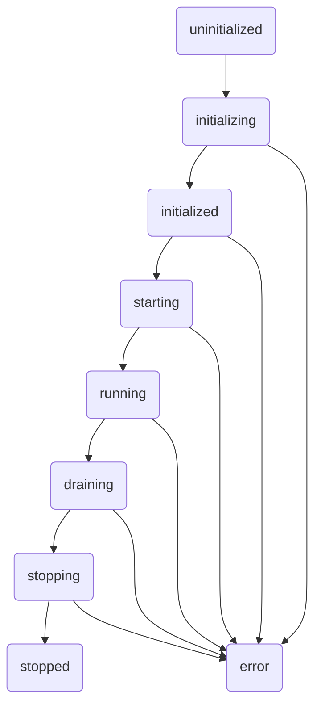

We designed NeuroLink's server adapters for brownfield integration because our first users at Juspay already had complex, mature Express.js backends. They couldn't just throw away years of work to adopt a new AI stack. We needed a way to drop NeuroLink's MCP routes, Claude proxy endpoints, and agent execution APIs directly into their existing `app`, not force them to start over from scratch. The entire server subsystem is built around this principle: your app, your server, your lifecycle. NeuroLink is a guest in your house.

Our previous post, [Server Adapters: Building AI APIs with Hono, Express, Fastify, or Koa](/posts/server-adapters/), covers the greenfield case: creating a brand new AI server from zero. This post goes deeper, exploring the architecture that makes brownfield integration safe and composable. We'll walk through the abstract base class, the state machine, the dynamic factory, the route groups, and the framework-agnostic middleware that let you wire NeuroLink into any running application.

## The `BaseServerAdapter` Contract

Everything starts with the contract defined in `BaseServerAdapter`. This abstract class is the foundation for all framework-specific implementations. It guarantees that whether you're using Express, Fastify, Hono, or Koa, the core behavior remains consistent.

The contract mandates nine abstract methods that every concrete adapter must implement:

- `initializeFramework()`
- `registerFrameworkRoute()`
- `registerFrameworkMiddleware()`
- `start()`
- `stop()`
- `getFrameworkInstance()`
- `stopAcceptingConnections()`
- `closeServer()`
- `forceCloseConnections()`

This common interface ensures that NeuroLink's core logic can orchestrate the server lifecycle without knowing the specific details of the web framework in use.

```typescript
// A simplified view of the abstract contract
export abstract class BaseServerAdapter {
  // ...
  protected abstract initializeFramework(): void;
  protected abstract registerFrameworkRoute(route: RouteDefinition): void;
  protected abstract registerFrameworkMiddleware(middleware: MiddlewareDefinition): void;
  public abstract start(): Promise<void>;
  public abstract stop(): Promise<void>;
  public abstract getFrameworkInstance(): unknown;
  // ...
}
```

Alongside the methods, the base class manages a strict, nine-state lifecycle (`ServerLifecycleState`) that prevents operations from running in the wrong order, like trying to register routes on a server that is already running or stopping a server that was never started.

## The Server Lifecycle

To manage complexity and prevent race conditions, every adapter instance moves through a well-defined state machine. This is the `ServerLifecycleState`.



This state machine is not just internal bookkeeping. It provides clear, predictable behavior, ensuring that connection draining, server shutdown, and resource cleanup happen in a graceful, deterministic sequence. When a server enters the `error` state, it's a terminal condition requiring a new instance.

## The Dynamic `ServerAdapterFactory`

To avoid forcing users to install and bundle web frameworks they don't use, we built the `ServerAdapterFactory`. Instead of static imports that would pull in all four frameworks, the factory uses dynamic `import()` expressions to load only the requested adapter at runtime.

If your project uses Express, the code for `HonoServerAdapter`, `KoaServerAdapter`, and `FastifyServerAdapter` is never loaded into memory or included in your final bundle.

The main entry point is `create(options: ServerAdapterFactoryOptions)`, which receives a single options object containing `framework`, `neurolink`, and an optional `config`. The switch statement inside performs the dynamic import directly — there is no delegation to a sub-method:

```typescript
// src/lib/server/factory/serverAdapterFactory.ts (abridged)
// The real create() also caches each loaded adapter class in a static map and
// short-circuits the switch on repeat calls for the same framework.
export class ServerAdapterFactory {
  public static async create(
    options: ServerAdapterFactoryOptions,
  ): Promise<BaseServerAdapter> {
    const { framework, neurolink, config } = options;

    switch (framework) {
      case 'express': {
        const { ExpressServerAdapter } =
          await import('../adapters/expressAdapter.js');
        return new ExpressServerAdapter(neurolink, config);
      }
      case 'fastify': {
        const { FastifyServerAdapter } =
          await import('../adapters/fastifyAdapter.js');
        return new FastifyServerAdapter(neurolink, config);
      }
      case 'hono': {
        const { HonoServerAdapter } =
          await import('../adapters/honoAdapter.js');
        return new HonoServerAdapter(neurolink, config);
      }
      case 'koa': {
        const { KoaServerAdapter } =
          await import('../adapters/koaAdapter.js');
        return new KoaServerAdapter(neurolink, config);
      }
      default:
        throw new Error(`Unknown framework: ${framework}`);
    }
  }

  // Convenience wrappers — each calls create({ framework, neurolink, config })
  public static async createExpress(
    neurolink: NeuroLink,
    config?: ServerAdapterConfig,
  ): Promise<BaseServerAdapter> {
    return ServerAdapterFactory.create({ framework: 'express', neurolink, config });
  }
  // ... createHono, createFastify, createKoa follow the same pattern
}
```

This keeps NeuroLink's footprint minimal and respects the dependency choices of the host application.

## The Brownfield Hook: `getFrameworkInstance()`

This is the most critical method for existing applications. The `ServerAdapterFactory` tutorials for greenfield projects hide this detail, but `getFrameworkInstance()` is the key to unlocking brownfield integration.

It returns the raw, underlying web framework application instance. For `ExpressServerAdapter`, it's the `Express` app object. For `FastifyServerAdapter`, it's the `FastifyInstance`.

This allows you to create a NeuroLink adapter, initialize it, and then mount its routes as a middleware onto your main application, rather than ceding control of the server startup to NeuroLink.

Here's how an existing Express app would do it:

```typescript
import express from 'express';
import { NeuroLink, ServerAdapterFactory } from '@juspay/neurolink';

// Your existing Express application
const app = express();
app.use(express.json());

app.get('/my-own-api/v1/health', (req, res) => {
  res.status(200).send({ status: 'ok' });
});

// Now, let's add NeuroLink
async function addNeuroLink() {
  // Construct a NeuroLink instance first — the factory requires it
  const neurolink = new NeuroLink({ /* your config */ });

  const neurolinkAdapter = await ServerAdapterFactory.create({
    framework: 'express',
    neurolink,
  });

  // initialize() registers all routes and middleware onto the adapter.
  // Skipping this call leaves the returned Express app with zero NeuroLink routes.
  await neurolinkAdapter.initialize();

  // This is the hook! Get the underlying Express app instance.
  const neurolinkApp = neurolinkAdapter.getFrameworkInstance() as express.Application;

  // Mount NeuroLink's entire API surface onto a specific path
  app.use('/neurolink', neurolinkApp);

  console.log('NeuroLink routes mounted on /neurolink');
}

addNeuroLink();

// You remain in control of starting your server
const PORT = process.env.PORT || 3000;
app.listen(PORT, () => {
  console.log(`Main application server running on port ${PORT}`);
});
```

This is the pattern. Your app stays in charge. NeuroLink's routes are just another piece of middleware. This composability is central to our design, and it's a concept we explore in other subsystems like our provider architecture. For more on that, see [Twenty-four providers, one BaseProvider: the adapter catalog](/posts/twenty-four-providers-one-baseprovider-the-adapter-catalog/).

## Composable Endpoints: RouteGroup Factories

NeuroLink's API surface is not a monolith. It's a collection of modular `RouteGroup` objects, each created by a dedicated factory function. This allows you to pick and choose which functionality you want to expose.

The primary route groups live in `src/lib/server/routes/`:

- `createAgentRoutes`: The core agent endpoints for execution (`/execute`, `/stream`) and the `/embed` and `/embed-many` routes for generating single and batch vector embeddings.
- `createMCPRoutes`: Endpoints for managing and interacting with MCP tool servers.
- `createMemoryRoutes`: APIs for inspecting and managing conversation memory, a topic we dive into in [Inside ConversationMemoryFactory: How NeuroLink Picks and Wires a Memory Backend](/posts/inside-conversationmemoryfactory-how-neurolink-picks-and-wires-a-memory-backend/).
- `createToolRoutes`: APIs for listing and managing registered tools.
- `createHealthRoutes`: Simple health check endpoints.
- `createOpenAIProxyRoutes`: A proxy for routing requests to OpenAI.
- `createClaudeProxyRoutes`: A sophisticated multi-account, rate-limit-aware proxy for Anthropic's Claude models.
- `createOpenApiRoutes`: Serves an OpenAPI specification for all registered routes.

The `createAllRoutes` function composes these factories into a `RouteGroup` array; `registerAllRoutes` is a convenience wrapper that calls `createAllRoutes` and then registers each group with an adapter. You can build your own composition to expose a smaller, more targeted API surface.

The five core route groups (agent, tool, MCP, memory, health) are always included. Proxy route groups are **opt-in**: you must pass `{ proxy: true }` (or the per-format flags `claudeProxy`/`openaiProxy`) to `createAllRoutes` to include them.

```typescript
// Always included
function createCoreRoutes(basePath: string): RouteGroup[] {
  return [
    createAgentRoutes(basePath),
    createToolRoutes(basePath),
    createMCPRoutes(basePath),
    createMemoryRoutes(basePath),
    createHealthRoutes(basePath),
  ];
}

// Proxy routes require opt-in:
// createAllRoutes(basePath, { proxy: true })
// — this enables both Claude and OpenAI proxy endpoints
```

## Framework-Agnostic Middleware

Just as routes are modular, so is our middleware. We defined a generic `MiddlewareDefinition` that can be applied to any route, regardless of the underlying framework. The concrete adapter (`ExpressServerAdapter`, etc.) is responsible for translating this generic definition into the framework's specific middleware format.

This allows us to write essential cross-cutting logic once. Key middleware includes:

- `createAuthMiddleware`: Creates auth middleware from a `ServerServerAuthConfig` (`{ type, validate, skipPaths, … }`). The `validate` callback is where you supply your own verification logic. `ApiKeyStore` is a helper class you can use to back that callback; for direct API-key auth without a custom validator, see `createApiKeyAuthMiddleware`.
- `createRateLimitMiddleware`: Provides rate limiting with configurable stores like `InMemoryRateLimitStore`.
- `createAbortSignalMiddleware`: Manages request cancellation and propagates abort signals to downstream services, which is critical for long-running AI tasks. This is especially important when dealing with tool calls that might hang. We discuss the importance of tool-related hooks in [Why Every Native Provider Must Wire the Same Tool-Persistence Hook](/posts/why-every-native-provider-must-wire-the-same-tool-persistence-hook/).
- `createRequestValidationMiddleware`: Validates incoming request bodies against an internal `ValidationConfig` / `MiddlewareRequestSchema` type system (not Zod).

Because these are framework-agnostic, they attach cleanly to any `RouteGroup` and work seamlessly across Express, Fastify, Hono, and Koa.

```typescript
// src/lib/server/middleware/common.ts (simplified)
// The real handler wraps this in an OpenTelemetry span, measures with
// process.hrtime.bigint() for nanosecond precision, formats as `${ms.toFixed(2)}ms`,
// and also sets a Server-Timing header.
export function createTimingMiddleware(): MiddlewareDefinition {
  return {
    name: 'timing',
    order: 0,
    handler: async (ctx, next) => {
      const start = Date.now();
      const result = await next();
      const duration = Date.now() - start;
      // Adapters read response headers from ctx.responseHeaders
      ctx.responseHeaders = ctx.responseHeaders || {};
      ctx.responseHeaders['X-Response-Time'] = `${duration}ms`;
      return result;
    },
  };
}
```

The adapter then translates this `MiddlewareDefinition` into the appropriate function signature for the target framework. This design keeps the business logic of our middleware completely decoupled from the transport layer.

---

**Related posts:**

- [From User Input to Provider API: The Five-Stage Message Flow](/posts/from-user-input-to-provider-api-the-five-stage-message-flow/)
- [What You Actually Inherit When You Extend BaseProvider](/posts/what-you-actually-inherit-when-you-extend-baseprovider/)
- [Four-stage context compaction: what runs when the model window fills up](/posts/four-stage-context-compaction-what-runs-when-the-model-window-fills-up/)
