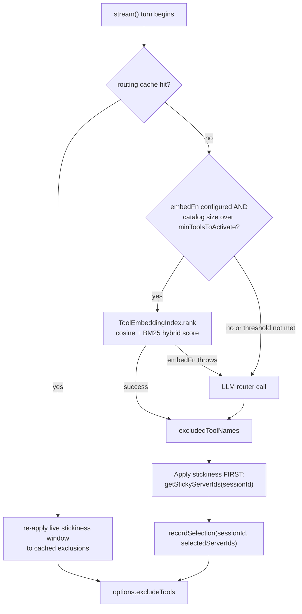

A host application registers forty MCP servers on NeuroLink — three hundred tool names on the wire. Under the hood, pre-call tool routing runs a cheap router LLM before every `stream()` turn: it reads the catalog and the user's query and excludes the servers that don't look relevant, via `excludeTools`. That call is cheap relative to the main generation, but it's still a full model round trip, every turn, for a decision that's really just "which of these three hundred short descriptions looks like this query" — exactly the kind of ranking problem an embedding index solves in single-digit milliseconds instead of a network hop. This is the mechanism NeuroLink added to skip the router call entirely once the catalog is large enough to make that trade-off worth it — and the commit that added it landed in the same file, on the same day, as a set of correctness fixes to a second mechanism it now has to cooperate with: per-session server stickiness.

## Where this sits in the routing stack

Pre-call tool routing itself isn't new here — it shipped earlier, in `d78d6912b`, as a router LLM call that maps a user query and a server catalog to an exclusion list. A companion commit an hour before this one, `a1e0f81ef` ("apply routing in generate(), add decision telemetry, routing cache + session stickiness"), wired that router into `generate()`/`stream()`, added an LRU+TTL cache for routing decisions (`ToolRoutingCache`), and added session stickiness: once the router picks a set of servers for a session, those servers stay warm — excluded from exclusion, effectively — for the next few turns, so a multi-turn conversation about the same topic doesn't re-route (and potentially flap) on every message.

The commit this post is about, `1cdbbb609` ("feat(tool-routing): embedding fast-path + tool-granularity narrowing," `@juspay/neurolink` 9.78.0, 2026-06-20), adds a new module, `src/lib/core/toolRoutingEmbedding.ts`, that gives the router an alternative to calling an LLM at all. It doesn't touch `toolRoutingCache.ts` — the stickiness bookkeeping itself is untouched — but it substantially rewrites the call site in `src/lib/neurolink.ts` that decides when the cache and stickiness logic run, because the embedding fast-path now has to slot into that same sequence without breaking either the caching contract or the stickiness window. The two mechanisms don't just coexist in this diff; the diff is largely about making them cooperate correctly.

## The hybrid retriever: cosine plus BM25

`toolRoutingEmbedding.ts` is explicitly documented as PURE — no provider imports, no circular dependencies. The caller injects an `embedFn: (texts: string[]) => Promise<number[][]>`, so the module itself never knows which embedding provider is in use. Its job is entirely: given a query and a set of `{ name, text }` items, rank them.

The scoring is a hybrid of two independently-normalized components:

```typescript
// src/lib/core/toolRoutingEmbedding.ts
const DEFAULT_WEIGHTS: ToolRetrievalWeights = { cosine: 0.8, bm25: 0.2 };

export function cosineSimilarity(a: number[], b: number[]): number {
  if (a.length === 0 || b.length === 0 || a.length !== b.length) {
    return 0;
  }
  let dot = 0;
  let magA = 0;
  let magB = 0;
  for (let i = 0; i < a.length; i++) {
    dot += a[i] * b[i];
    magA += a[i] * a[i];
    magB += b[i] * b[i];
  }
  if (magA === 0 || magB === 0) {
    return 0;
  }
  return dot / (Math.sqrt(magA) * Math.sqrt(magB));
}
```

`cosineSimilarity` is defensive on three fronts: it returns `0` — never throws — for empty vectors, mismatched lengths, or zero magnitude, all of which would otherwise be a division by zero or a meaningless comparison. That matters because the ranking pipeline runs on every catalog item on every turn; a single malformed embedding vector shouldn't take down the whole comparison.

The lexical half is a small, self-contained BM25 implementation, `Bm25Corpus`, built with the standard Robertson/Sparck-Jones IDF formula and the usual `k1`/`b` free parameters:

```typescript
// src/lib/core/toolRoutingEmbedding.ts
/** BM25 free-parameter k1 — controls term-frequency saturation. */
const BM25_K1 = 1.5;
/** BM25 free-parameter b — controls document-length normalisation. */
const BM25_B = 0.75;

score(docIndex: number, query: string): number {
  if (docIndex < 0 || docIndex >= this.docs.length) {
    return 0;
  }
  const queryTokens = tokenize(query);
  if (queryTokens.length === 0) {
    return 0;
  }
  const doc = this.docs[docIndex];
  const docLength = doc.tokens.length;
  let total = 0;
  for (const qt of queryTokens) {
    const tf = doc.tf.get(qt) ?? 0;
    if (tf === 0) {
      continue;
    }
    const idf = this.idf.get(qt) ?? 0;
    const numerator = tf * (BM25_K1 + 1);
    const denominator =
      tf + BM25_K1 * (1 - BM25_B + BM25_B * (docLength / this.avgDocLength));
    total += idf * (numerator / denominator);
  }
  return total;
}
```

The module's own comment calls this out as "a TF-IDF/BM25 hybrid consistent with the `InMemoryBM25Index` in `src/lib/rag/retrieval/hybridSearch.ts`, adapted for a read-once static corpus" — tool descriptions don't change mid-turn, so the corpus is built once and reused rather than re-indexed on every query.

Why combine a dense (embedding) score with a sparse (lexical) one at all, instead of ranking on cosine similarity alone? Embeddings are good at capturing semantic intent but can miss an exact identifier match — a tool literally named `getStickyServerIds` should score highly against a query that mentions "sticky," even if the embedding space doesn't place that token especially close to the query's vector. BM25 catches the literal term match; cosine catches the paraphrase. The `0.8`/`0.2` default weighting keeps the semantic signal dominant while still letting an exact lexical hit break ties or rescue a candidate the embedding space alone would rank lower.

Both raw score arrays go through the same min-max normalization before combining, so neither scale can dominate just because BM25 scores happen to run larger in absolute terms than cosine similarities:

```typescript
// src/lib/core/toolRoutingEmbedding.ts
function normalizeScores(scores: number[]): number[] {
  if (scores.length === 0) {
    return [];
  }
  let min = scores[0] ?? 0;
  let max = scores[0] ?? 0;
  for (let i = 1; i < scores.length; i++) {
    const s = scores[i] ?? 0;
    if (s < min) min = s;
    if (s > max) max = s;
  }
  const range = max - min;
  if (range === 0) {
    return scores.map(() => 0);
  }
  return scores.map((s) => (s - min) / range);
}
```

Note the `range === 0` branch: when every item scores identically (a degenerate catalog, or a component that produced no signal at all), the function returns all zeros rather than dividing by zero — the hybrid score then falls back entirely on whichever component *did* produce a spread.

## `ToolEmbeddingIndex`: caching vectors, not just scores

The class that ties the two scorers together, `ToolEmbeddingIndex`, is where the module's header-comment claim — that this 'benchmarks at sub-10 ms when embedding vectors are cached' — actually comes from. Its `rank()` method embeds only the texts it hasn't seen before:

```typescript
// src/lib/core/toolRoutingEmbedding.ts
async rank(
  query: string,
  opts: { topK: number; weights?: ToolRetrievalWeights; timeoutMs?: number },
): Promise<ToolRetrievalRankedResult[]> {
  if (this.items.length === 0) {
    return [];
  }
  const weights = opts.weights ?? DEFAULT_WEIGHTS;

  const uncachedTexts = [
    ...new Set(
      this.items
        .map((item) => item.text)
        .filter((text) => !this.vectorCache.has(text)),
    ),
  ];

  if (uncachedTexts.length > 0) {
    const vectors = await withTimeout(
      this.embedFn(uncachedTexts),
      opts.timeoutMs ?? 10000,
      "ToolEmbeddingIndex.embed",
    );
    for (let i = 0; i < uncachedTexts.length; i++) {
      const vec = vectors[i];
      if (vec !== undefined) {
        this.vectorCache.set(uncachedTexts[i], vec);
      }
    }
  }
  // ... query embedding, BM25 corpus build, scoring, sort, slice(0, topK)
}
```

The `vectorCache` is a plain `Map<string, number[]>` keyed by item text, and the constructor accepts an optional shared cache so the same `Map` reference can persist across multiple `ToolEmbeddingIndex` instances — which is exactly what `neurolink.ts` does with it, covered below. Only the *tool* descriptions are cached this way; the query vector is re-embedded on every call, because the module's own comment is explicit that "the query is not cached since it changes every turn — caching query vectors is the caller's responsibility if desired."

The fail-safe contract is stated twice in the source comments and enforced by simply not having a `try`/`catch` around the `embedFn` calls inside `rank()`: any error the injected function throws — a network failure, an unsupported-provider error, a timeout — propagates straight out of `rank()` uncaught. `ToolEmbeddingIndex` itself never decides what "failure" should mean for the rest of the routing pipeline; that decision belongs entirely to the caller, one layer up in `toolRouting.ts`.

The convenience wrapper `selectRelevantToolNames()` is the public entry point most callers use — it builds a throwaway `ToolEmbeddingIndex`, ranks, and returns just the names:

```typescript
// src/lib/core/toolRoutingEmbedding.ts
export async function selectRelevantToolNames(
  query: string,
  items: ToolRetrievalItem[],
  opts: ToolRetrievalSelectOptions,
): Promise<string[]> {
  const index = new ToolEmbeddingIndex(items, opts.embedFn, opts.vectorCache);
  const ranked = await index.rank(query, {
    topK: opts.topK,
    weights: opts.weights,
    timeoutMs: opts.timeoutMs,
  });
  return ranked.map((r) => r.name);
}
```

## Deciding whether to run it at all

`toolRouting.ts` gates the fast-path behind a threshold, not a blanket "always try embedding first" rule. `runEmbeddingFastPath()` counts the routable tools — everything except always-include servers — and bails out to a no-op result (`embeddingActivated: false`) if the count is below `minToolsToActivate`, which defaults to 20:

```typescript
// src/lib/core/toolRouting.ts
const routableToolCount = routableServers.reduce(
  (sum, server) => sum + server.toolNames.length,
  0,
);

if (routableToolCount < opts.minToolsToActivate) {
  logger.debug(
    "[ToolRouting] L2 embedding skipped — catalog below threshold",
    { toolCount: routableToolCount, minToolsToActivate: opts.minToolsToActivate },
  );
  return noop;
}
```

Below that threshold, an LLM router call is already fast and cheap enough — twenty tool descriptions round-trip through a small model quickly — so there's no real win from adding an embedding provider call, a second network dependency, into the turn. The retrieval documents themselves are one per tool, combining the owning server's description with the tool name, so the embedding sees both the broader context and the specific identifier:

```typescript
// src/lib/core/toolRouting.ts
const items: ToolRetrievalItem[] = routableServers.flatMap((server) =>
  server.toolNames.map((toolName) => ({
    name: toolName,
    text: `${server.description} — ${toolName}`,
  })),
);
```

And the whole attempt is wrapped in one `try`/`catch`, which is where the fail-open contract that `ToolEmbeddingIndex.rank()` deliberately doesn't implement finally gets enforced:

```typescript
// src/lib/core/toolRouting.ts
} catch (embeddingError) {
  logger.warn(
    "[ToolRouting] L2 embedding fast-path failed, falling back to LLM router",
    {
      error:
        embeddingError instanceof Error
          ? embeddingError.message
          : String(embeddingError),
    },
  );
  return noop;
}
```

An embedding provider outage, a bad API key, or a provider that simply doesn't implement `embedMany()` all land here and produce the same outcome: routing falls through to the pre-existing LLM router path, untouched, one function below. The turn never breaks because the embedding layer failed.

## Two granularities for the same ranked list

Once ranking succeeds, `runEmbeddingFastPath()` has a set of top-K tool names, and it has to turn that into an exclusion list two different ways depending on `granularity`:

- **`"server"`** (the default) keeps a server if *any* of its tools survived the top-K cut, and excludes every tool belonging to a server where *none* did. This preserves the original tool-routing semantics — whole servers in or out — so switching on the embedding fast-path doesn't change what a host application already expects from `excludeTools`.
- **`"tool"`** excludes every individual tool not in the top-K set, regardless of which server owns it. A server with ten tools where only two are relevant to the query keeps just those two, instead of all ten riding along because one sibling tool matched.

```typescript
// src/lib/core/toolRouting.ts — server-granularity branch
const keptServerIds = new Set(
  routableServers
    .filter((server) =>
      server.toolNames.some((toolName) => topToolSet.has(toolName)),
    )
    .map((server) => server.id),
);
const excludedServers = routableServers.filter(
  (server) => !keptServerIds.has(server.id) && !alwaysSet.has(server.id),
);
const excludedToolNames = excludedServers.flatMap((server) => server.toolNames);
```

Tool-level granularity only makes sense once an embedding-based ranking exists at all — the LLM router only ever picks whole servers, since asking it to reason about every individual tool name in the prompt would push the router call's cost right back up to where the fast-path is trying to avoid. That's why `granularity: "tool"` silently falls back to `"server"` behavior whenever the embedding path is disabled or fails: there's no other mechanism in the codebase that could honor a tool-level exclusion request.

## Where stickiness has to fit

This is the part of the commit that isn't really about embeddings at all, but had to change anyway once the embedding fast-path existed as a second way to *reach* the point where stickiness gets applied. Before this commit, the cache-hit and cache-miss branches in `neurolink.ts` were two almost-parallel blocks of code, each independently emitting telemetry and each applying stickiness slightly differently. The commit collapses that into a single sequence where stickiness is applied identically regardless of which of the three paths — cache hit, embedding fast-path, or LLM router — produced the exclusion list.

The cache-hit branch re-applies the *current* stickiness window to a cached exclusion list, rather than trusting whatever stickiness state existed when the entry was written:

```typescript
// src/lib/neurolink.ts — cache-hit branch
// Decrement stickiness turn counter even on a cache hit so the window
// advances correctly regardless of whether the LLM router ran
// (Finding 3). Re-apply stickiness to the cached exclusion list so
// the live stickiness window, not the one at write-time, is honoured
// (Finding 2 complement: we stored the pre-stickiness list, so
// re-applying here gives the correct per-turn view).
let cachedExcluded = cached.excludedToolNames;
if (stickinessEnabled && sessionId) {
  try {
    const stickyIds = cache.getStickyServerIds(sessionId);
    if (stickyIds.length > 0) {
      cachedExcluded = cachedExcluded.filter(
        (toolName) =>
          !stickyIds.some((id) => toolName.startsWith(`${id}_`)),
      );
    }
  } catch {
    // Stickiness failure is non-fatal.
  }
}
```

The comment names the reasoning directly: the routing cache stores the *pre-stickiness* exclusion list (Finding 2), so a cache hit has to re-run the stickiness filter every time rather than caching the post-stickiness result — otherwise a server that only just went stale would stay artificially excluded (or included) based on whatever session happened to populate that cache entry first.

On the non-cached paths — whether the exclusions came from the embedding fast-path or the LLM router — the same stickiness application happens right after the raw exclusion list is captured, and the ordering is the other half of what this commit fixes:

```typescript
// src/lib/neurolink.ts
// Snapshot the raw (pre-stickiness) exclusion list before applying
// stickiness overrides. The cache stores this snapshot so future cache
// hits can re-apply the then-current stickiness state (Finding 2).
const preStickinessExcludeTools = routedExcludeTools;

// Apply stickiness FIRST: the sticky ids were recorded on a prior turn and
// represent servers that should stay warm for the current turn. Consuming
// (decrementing) them before recordSelection ensures the window covers the
// correct set of future turns rather than burning one count on the same
// turn the selection is recorded (off-by-one fix).
if (stickinessEnabled && cache && sessionId) {
  try {
    const stickyIds = cache.getStickyServerIds(sessionId);
    // ...filter routedExcludeTools by stickyIds, same startsWith(`${id}_`) check...
  } catch {
    // Stickiness failure is non-fatal.
  }
}
```

`getStickyServerIds()` and `recordSelection()` are the same two `ToolRoutingCache` methods `a1e0f81ef` added; this commit doesn't touch `toolRoutingCache.ts` at all. What changes is *when*, in the turn's control flow, they get called relative to each other. Reading `getStickyServerIds(sessionId)` before calling `recordSelection(sessionId, ...)` for this turn's own selection matters because `getStickyServerIds()` decrements the sticky entry's remaining-turns counter as a side effect — call it after recording this turn's selection and the freshly-recorded entry gets decremented on the same turn it was written, burning one turn of stickiness for nothing. The "Apply stickiness FIRST" comment is the commit's shorthand for that ordering constraint, and `resolvedDecision.selectedServerIds` (the servers this turn actually picked, from whichever of the three paths ran) is what gets passed to `recordSelection()` afterward:

```typescript
// src/lib/neurolink.ts
if (stickinessEnabled && sessionId) {
  try {
    cache.recordSelection(sessionId, resolvedDecision.selectedServerIds);
  } catch {
    // Stickiness failure is non-fatal.
  }
}
```



## Persisting embedding vectors across turns

The `ToolEmbeddingIndex.rank()` vector cache is only useful if it survives past a single call, and a fresh `Map` per turn would defeat the module's "sub-10 ms when embedding vectors are cached" design goal entirely — every turn would re-embed the whole catalog from scratch. `neurolink.ts` fixes that by holding one `Map` at the instance level:

```typescript
// src/lib/neurolink.ts
// Persisted vector cache for the L2 embedding fast-path (ITEM B). Populated
// on the first turn and reused across subsequent turns so tool embedding
// vectors are computed once. Cleared when the catalog changes via
// setToolRoutingServers() so stale vectors are never reused.
private toolRoutingVectorCache?: Map<string, number[]>;
```

It's lazily created the first time an embedding provider is successfully resolved for a turn, and passed into `resolveToolRoutingExclusions()` as `embeddingVectorCache` so `runEmbeddingFastPath()` can forward it into `selectRelevantToolNames()`. The one place this cache gets thrown away is `setToolRoutingServers()`, the method hosts call when the server catalog changes at runtime:

```typescript
// src/lib/neurolink.ts
this.toolRoutingConfig.servers = servers;
// Clear the persisted vector cache so tool vectors are recomputed against
// the new catalog on the next turn (stale vectors must never be reused).
this.toolRoutingVectorCache = undefined;
// Cached routing decisions are catalog-dependent too; force the next turn
// to recompute exclusions against the new server/tool set.
this.toolRoutingCacheInstance = undefined;
```

Both caches get invalidated together, and deliberately: a stale routing-decision cache entry referencing a server id that no longer exists is exactly the kind of bug that a partial invalidation would introduce, so `setToolRoutingServers()` resets both rather than trying to selectively evict only the affected keys.

## Resolving the embedding provider itself

`toolRoutingEmbedding.ts` never imports a provider — the `embedFn` it receives has to come from somewhere, and building it is `neurolink.ts`'s job, done fresh on each turn from `routingConfig.embedding`:

```typescript
// src/lib/neurolink.ts
const embProviderName =
  embeddingCfg.provider ??
  ((options.provider && options.provider !== "auto"
    ? options.provider
    : undefined) as string | undefined) ??
  routingConfig.routerModel?.provider;

if (embProviderName) {
  const embProvider = await AIProviderFactory.createProvider(
    embProviderName,
    embeddingCfg.model,
    true,
    this as unknown as Record<string, unknown>,
    undefined,
    this.resolveCredentials(options.credentials),
  );
  routingEmbedFn = (texts: string[]) =>
    withTimeout(
      embProvider.embedMany(texts, embeddingCfg.model),
      embeddingCfg.timeoutMs ?? 10000,
    );
}
```

The provider resolution order — explicit `embedding.provider` config, then the current call's `provider` (unless it's `"auto"`), then the router model's provider — mirrors the fallback pattern NeuroLink already uses elsewhere for optional overrides, and the whole block sits inside its own `try`/`catch`. If `AIProviderFactory.createProvider()` throws (an unknown provider name, missing credentials) or the resolved provider's `embedMany()` isn't actually implemented, `routingEmbedFn` simply stays `undefined` and the fast-path's own gate — `if (embedFn)` in `toolRouting.ts` — skips it for that turn without any special-casing at the call site.

## Configuring it

Every new surface here is additive to `ToolRoutingConfig` and defaults to the pre-existing behavior. A host enabling all three mechanisms together — routing, stickiness, and the embedding fast-path with tool-level granularity — configures it on `NeurolinkConstructorConfig.toolRouting`:

```typescript
import { NeuroLink } from '@juspay/neurolink';

const neurolink = new NeuroLink({
  credentials: {
    openai: { apiKey: process.env.OPENAI_API_KEY },
  },
  toolRouting: {
    enabled: true,
    servers: mcpServerCatalog, // ToolRoutingServerDescriptor[]
    alwaysIncludeServerIds: ['core-utils'],
    cache: { enabled: true, ttlMs: 60_000 },
    stickiness: { enabled: true, turns: 3 },
    embedding: {
      enabled: true,
      provider: 'openai',
      model: 'text-embedding-3-small',
      topK: 20,
      minToolsToActivate: 20,
      weights: { cosine: 0.8, bm25: 0.2 },
    },
    granularity: 'tool',
  },
});
```

Every field under `embedding` is optional; the module's own defaults — `topK: 20`, `minToolsToActivate: 20`, `{ cosine: 0.8, bm25: 0.2 }`, a 10-second `timeoutMs` — reproduce a reasonable starting point without tuning anything. Setting `granularity: 'tool'` without `embedding.enabled: true` is harmless: the type allows it, but `runEmbeddingFastPath()` never runs, so routing silently stays at server granularity.

## What the telemetry sees

`ToolRoutingDecision` — the shape passed into a host's `emitDecision` callback and mirrored onto the active OpenTelemetry span — gained three optional fields in this commit, all `undefined` unless the embedding path actually ran:

```typescript
// src/lib/types/toolRouting.ts
/** True when the L2 embedding fast-path ran and produced candidate results. */
embeddingActivated?: boolean;
/**
 * Number of tool candidates produced by the embedding retriever before the
 * post-embedding server or tool filtering step.
 */
candidateToolCount?: number;
/**
 * Granularity at which exclusions were applied ("server" or "tool").
 */
granularity?: "server" | "tool";
```

They're consumed the same defensive way the rest of `emitDecision` is: wrapped in a `try`/`catch` whose comment reads "Telemetry must never affect routing behaviour," and each field is set on the span only when it's actually present, so a dashboard built before this commit shipped keeps working against decisions where these three fields are simply absent.

## Reference: what each knob does

| Config field | Default | Effect |
|---|---|---|
| `embedding.enabled` | `false` | Master switch for the L2 fast-path; off means routing behaves exactly as before this commit |
| `embedding.minToolsToActivate` | `20` | Catalog tool count below which the fast-path is skipped and the LLM router runs directly |
| `embedding.topK` | `20` | Number of top-ranked tool candidates the retriever keeps |
| `embedding.weights` | `{ cosine: 0.8, bm25: 0.2 }` | Relative weight of semantic vs. lexical match in the hybrid score |
| `embedding.provider` / `embedding.model` | falls back to the call's provider | Which provider's `embedMany()` computes the vectors |
| `embedding.timeoutMs` | `10000` | Timeout on each embedding call, independently of the router's own `timeoutMs` |
| `granularity` | `"server"` | Whether unpicked tools are excluded per-server or individually; `"tool"` requires the embedding path to be active |
| `stickiness.enabled` / `stickiness.turns` | `false` / `3` | Unrelated to the embedding path directly, but now applied identically regardless of which routing path produced the exclusion list |

## A checklist before turning this on

- Confirm your configured (or call-time) provider actually implements `embedMany()` — `AIProviderFactory.createProvider()` succeeding doesn't guarantee it; a provider without embedding support throws when `routingEmbedFn` is first invoked, which is caught and treated as a fast-path failure for that turn, not a startup error.
- Leave `minToolsToActivate` at or above the LLM router's own comfortable catalog size — the fast-path exists to skip a call that's already getting expensive, not to replace a cheap one.
- If you set `granularity: 'tool'`, verify your tool descriptions are distinctive enough at the individual-tool level; the retrieval text is `${server.description} — ${toolName}`, so two tools sharing an identical server description differ only by name in the embedding input.
- Don't assume a cached routing decision reflects the current stickiness window — it doesn't, by design; `cachedExcluded` is recomputed against `getStickyServerIds()` on every cache hit, which is also why a cache hit still needs `sessionId` to behave correctly under stickiness.
- If you supply your own `emitDecision` callback, treat `embeddingActivated`, `candidateToolCount`, and `granularity` as optional fields, not guaranteed ones — they're absent on decisions where the embedding path never ran, including every decision from before this commit shipped.
- Call `setToolRoutingServers()` whenever the catalog changes at runtime, not just on `enabled` toggles — it's the only thing that clears the persisted vector cache, and a stale vector for a tool description that changed meaning would silently skew ranking without throwing.

---

**Related posts:**

- [Embeddings and Vector Operations with NeuroLink](/posts/embeddings-vector-operations/)
- [ModelPool's error-class fallback design](/posts/modelpools-error-class-fallback-design/)
- [Jina embeddings on NeuroLink](/posts/jina-embeddings-on-neurolink/)
