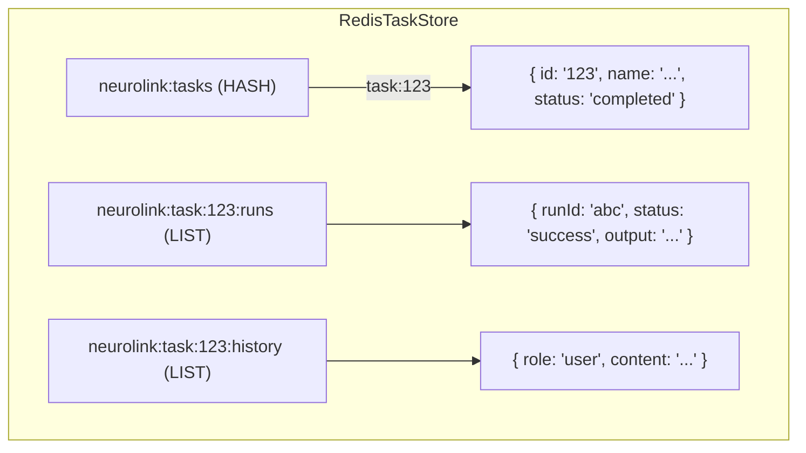

We designed NeuroLink's `TaskManager` because a server restart was killing a multi-hour autoresearch task ninety minutes into its run. The user's request to "write a full competitive analysis of the top 5 players in the observability space" kicked off a long-running job, but because the scheduler lived in server memory, a routine deployment wiped out the task state completely. We needed a durable, persistent, and observable system for scheduling AI work that could survive process death, isolate failures, and report its progress. That meant building a full scheduled-work engine with swappable backends and persistence layers right into the NeuroLink core.

## The Public Surface: `TaskManager`

The entire task subsystem exposes a single public entry point: the `TaskManager` class. It's the unified facade for creating, managing, and observing scheduled work. On startup, its private `doInitialize()` method reads the system configuration to select and instantiate two key dependencies: a `TaskStore` for persistence and a `TaskBackend` for scheduling. The backend is managed by the `TaskBackendRegistry`; the corresponding store is selected implicitly — the `bullmq` backend pairs with `RedisTaskStore` and `node-timeout` pairs with `FileTaskStore`. The `ensureInitialized` method wraps this logic, ensuring the async setup completes before any other methods are called.

Once initialized, `TaskManager` immediately calls `rescheduleActiveTasks()`. This critical step queries the store for any tasks that were in an `active` state before the process shut down. It then re-arms them by calling the backend's `schedule` method for each one, ensuring that a server restart doesn't drop a single cron job or interval-based task. An `initPromise` guard makes this entire setup idempotent, so even if multiple services try to initialize the `TaskManager` concurrently, the setup code runs only once.

```typescript
// A simplified Task definition
interface Task {
  id: string;
  name: string;
  type: 'standard' | 'autoresearch';
  status: 'pending' | 'active' | 'paused' | 'completed' | 'failed' | 'cancelled';
  schedule: CronSchedule | IntervalSchedule | OnceSchedule;
  // CronSchedule:     { type: 'cron';     expression: string; timezone?: string }
  // IntervalSchedule: { type: 'interval'; every: number }        // ms
  // OnceSchedule:     { type: 'once';     at: Date | string }
  // ... and many other fields
}
```

The `TaskManager` is also responsible for all CRUD operations on tasks. Methods like `create`, `get`, `list`, `update`, `pause`, `resume`, `run`, and `delete` provide the primary API for interacting with tasks from application code. Each of these methods validates its input before delegating the core logic to the configured store or backend. The `update` method is special, as it uses a `rollbackTaskUpdate` mechanism to revert changes to the store if the corresponding backend scheduling action fails, maintaining system consistency.

```typescript
// Inside TaskManager.doInitialize()
private async doInitialize(): Promise<void> {
  const backendName = this.config.backend ?? TASK_DEFAULTS.backend;

  // 1. Select the store based on backend name
  if (backendName === 'bullmq') {
    const { RedisTaskStore } = await import('./store/redisTaskStore.js');
    this.store = new RedisTaskStore(this.config);
  } else {
    const { FileTaskStore } = await import('./store/fileTaskStore.js');
    this.store = new FileTaskStore(this.config);
  }
  await this.store.initialize();

  // 2. Create the backend via the registry
  this.backend = await TaskBackendRegistry.create(backendName, this.config);
  await this.backend.initialize();

  // 3. Create the executor, then reschedule tasks active before restart
  this.executor = new TaskExecutor(this.neurolink, this.store, this.emitter);
  await this.rescheduleActiveTasks();
}
```

## The Scheduling Backends: BullMQ vs. Node Timers

NeuroLink ships with two implementations of the `TaskBackend` interface, selectable at configuration time via the `TaskBackendRegistry`. This allows developers to choose the right trade-off between external dependencies and scheduling durability. The registry's `register` method allows for custom backends, while `registerDefaults` wires up the two built-in options.

The default and production-recommended backend is `BullMQBackend`. It translates NeuroLink task schedules into jobs managed by a BullMQ queue, which is backed by Redis. This provides robust, distributed scheduling that survives process restarts and can be inspected with standard Redis tooling. The backend uses `loadBullMQ` to dynamically import the necessary library, avoiding a hard dependency for users who don't need it. The Redis connection itself is configured via `getConnectionConfig`.

- `cron` and `interval` schedules map to BullMQ's `upsertJobScheduler`. This method creates or updates a repeatable job definition. The cron path passes `{ pattern: schedule.expression }` and the interval path passes `{ every: schedule.every }`.
- `once` schedules map to `queue.add(task.name, jobData, { jobId: task.id, delay })`, where the delay is computed inline as `Math.max(0, at.getTime() - Date.now())`.

All jobs are pushed to a single, well-known queue name, defined by the `QUEUE_NAME` constant (`"neurolink-tasks"`).

```typescript
// Inside BullMQBackend.schedule()
if (schedule.type === 'cron') {
  await queue.upsertJobScheduler(
    task.id,
    { pattern: schedule.expression, ...(schedule.timezone ? { tz: schedule.timezone } : {}) },
    { name: task.name, data: jobData },
  );
} else if (schedule.type === 'interval') {
  await queue.upsertJobScheduler(
    task.id,
    { every: schedule.every },
    { name: task.name, data: jobData },
  );
} else if (schedule.type === 'once') {
  const at = typeof schedule.at === 'string' ? new Date(schedule.at) : schedule.at;
  const delay = Math.max(0, at.getTime() - Date.now());
  await queue.add(task.name, jobData, { jobId: task.id, delay });
}
```

For development or environments without Redis, we provide the `NodeTimeoutBackend`. Its only external dependency is `croner` for parsing cron expressions; beyond that it uses only Node's built-in timers. It relies on `croner` to handle `cron` expressions and standard `setInterval` and `setTimeout` calls for the other schedule types. It maintains its state entirely in an in-memory `Map` of task IDs to `ScheduledEntry` handles. This trade-off is often acceptable for local testing or simple, single-node deployments, but it offers no observability and guarantees no persistence. The `cancel` method calls the private `clearEntry()` helper, which calls `cronJob.stop()` for cron schedules, `clearInterval()` for interval timers, and `clearTimeout()` for one-shot timers.

```typescript
// Inside NodeTimeoutBackend.schedule() for a 'once' task
const at = typeof schedule.at === 'string' ? new Date(schedule.at) : schedule.at;
const delay = Math.max(0, at.getTime() - Date.now());
entry.timeoutId = setTimeout(() => {
  this.executeTask(entry);
  this.scheduled.delete(task.id);
}, delay);
```

## The Persistence Stores: Redis vs. Filesystem

Just as the scheduling mechanism is pluggable, so is the persistence layer. The `TaskStore` interface defines the contract for saving and retrieving task state, with methods like `save`, `get`, `list`, `appendRun`, `getRuns`, `appendHistory`, and `getHistory`. NeuroLink provides two concrete implementations.

`RedisTaskStore` is the production default. It models the entire system's state within Redis, using specific data structures for efficiency. It ensures a connection is available via `ensureConnected` before any operation.

- All task definitions are stored in a single Redis Hash located at the key defined by `TASKS_HASH` (i.e. `neurolink:tasks`). A `KEY_PREFIX` of `"neurolink:"` is applied to all RedisTaskStore keys to avoid collisions within Redis.
- The run history for each task is kept in a List, with the key generated by the `taskRunsKey` function (e.g., `neurolink:task:{id}:runs`).
- Conversation history for continuation tasks lives in another List at the key from `taskHistoryKey` (e.g., `neurolink:task:{id}:history`).

When a task completes, fails, or is cancelled, the `applyRetentionTTL` method sets a Redis `EXPIRE` on the run-log and conversation-history keys for that task, automatically cleaning up old data without a separate garbage collection process. Note that Redis does not support per-field TTL on a Hash, so the task entry in the main hash is not auto-expired and must be removed via `delete()` or BullMQ's own cleanup. This prevents Redis memory from growing indefinitely with stale run data.



The alternative is `FileTaskStore`. It serializes the primary task map to a single `tasks.json` file. To prevent data corruption from partial writes, it uses an atomic write pattern: writes go to a temporary `.tmp` file first, which is then atomically renamed over the original `tasks.json`. Run logs are stored as separate `.jsonl` (JSON Lines) files, such as `{taskId}.jsonl`. The `pruneRunLog` method is called periodically to trim these files to a maximum number of entries, defined by `TASK_DEFAULTS.maxRunLogs`, to prevent unbounded disk usage.

One important caveat: `FileTaskStore` persists task definitions and run logs to disk, but conversation history for continuation-mode tasks is held in memory only and will be lost on restart. Only `RedisTaskStore` persists history durably.

```json
// Example structure of a tasks.json file in FileTaskStore
{
  "version": 1,
  "tasks": {
    "task-abc-123": {
      "id": "task-abc-123",
      "name": "Analyze Q3 Earnings",
      "status": "active",
      "schedule": { "type": "cron", "expression": "0 9 * * 1" }
    },
    "task-def-456": {
      "id": "task-def-456",
      "name": "Summarize daily news",
      "status": "active",
      "schedule": { "type": "interval", "every": 3600000 }
    }
  }
}
```

## Driving the Work: The `TaskExecutor`

The `TaskExecutor` is where the scheduled work actually happens. When a schedule fires, the backend invokes the `execute` method with the relevant `Task` object. The executor's primary job is to manage the run lifecycle, from fetching the latest task state to recording the outcome and handling failures with a robust retry mechanism. Its private `executeOnce` method contains the actual generation call, keeping the retry loop in `execute()` cleanly separated from the single-run logic.

Not all errors are created equal. A temporary network hiccup or a model provider's `503` error shouldn't cause a multi-hour task to fail permanently. The executor maintains a `TRANSIENT_PATTERNS` array of lowercase strings and uses the `isTransientError` function to decide if an error is retryable by checking `msg.includes(p)` against each pattern. A `TaskError` can be thrown with a specific `TaskErrorCodes` value to signal specific failure modes.

```typescript
// From src/lib/tasks/taskExecutor.ts
const TRANSIENT_PATTERNS = [
  'rate limit',
  'rate_limit',
  'too many requests',
  '429',
  '503',
  '502',
  '504',
  'timeout',
  'econnreset',
  'econnrefused',
  'network',
  'overloaded',
];
```

If an error is deemed transient, the executor will retry up to the configured number of times, as defined in `TASK_DEFAULTS.retry.maxAttempts`. The delay between retries follows a flat array of backoff millisecond values. This simple policy dramatically improves the reliability of long-running tasks. After handling retries, `TaskExecutor` delegates the core logic. For most tasks, this means calling `neurolink.generate()`, the same entry point used for standard chat completions, which is detailed in [From User Input to Provider API: The Five-Stage Message Flow](/posts/from-user-input-to-provider-api-the-five-stage-message-flow/).

```typescript
// Retry configuration in TASK_DEFAULTS
const TASK_DEFAULTS = {
  // ...
  retry: {
    maxAttempts: 3,
    backoffMs: [30000, 60000, 300000], // flat number array, in ms
  },
  // ...
};
```

## The Autoresearch Loop

A special case is the `autoresearch` task type. These tasks are not a single `generate` call but a complex, multi-step process designed for autonomous problem-solving. This logic is handled by a dedicated function, `executeAutoresearchTick`.

This function maintains a stateful `ResearchWorker` for each active research task, held in a module-level `workerCache` (a simple `Map`). The `getOrCreateWorker` function retrieves an existing worker from the cache or creates a new one. Each "tick" of the task advances the worker through a state machine. The `inferNextPhase` function determines the next state by analyzing which tools the model used in the previous step. Its signature is `inferNextPhase(currentPhase: ExperimentPhase, calledTools: string[]): ExperimentPhase | null` — it takes two parameters and returns `null` if no phase advancement is indicated. The tool names are all prefixed with `research_` (e.g., `research_get_context`, `research_write_candidate`, `research_run_experiment`). The `phaseAfterTool` helper contains the core phase-advancement mapping.

The nine phases of the research lifecycle are:

- `bootstrap` (initial planning)
- `baseline` (initial measurement to establish a performance floor)
- `propose` (suggest a concrete action)
- `edit` (refine the plan or code)
- `commit` (save the work)
- `run` (execute a tool or code)
- `evaluate` (analyze the result of the run)
- `record` (document findings)
- `accept_or_revert` (decide if the last step was productive)

This explicit state machine, driven by model behavior, allows `autoresearch` tasks to tackle complex problems that require planning, execution, and self-correction. To prevent memory leaks, the exported `clearWorkerCache` function clears all cached workers when the `TaskManager` shuts down. For more on how NeuroLink manages state, see [Inside ConversationMemoryFactory: How NeuroLink Picks and Wires a Memory Backend](/posts/inside-conversationmemoryfactory-how-neurolink-picks-and-wires-a-memory-backend/).

```typescript
// Real signature and tool names for inferNextPhase
// (src/lib/tasks/autoresearchTaskExecutor.ts)
function inferNextPhase(
  currentPhase: ExperimentPhase,
  calledTools: string[],
): ExperimentPhase | null {
  // Returns null if no advancement is indicated.
  // Key tool → phase mappings:
  //   'research_get_context'      → 'propose'
  //   'research_read_file'        → 'edit'
  //   'research_write_candidate'  → 'commit'
  //   'research_commit_candidate' → 'run'
  //   'research_run_experiment'   → 'evaluate'
  //   'research_parse_log'        → 'record'
  //   'research_record'           → 'accept_or_revert'
  //   'research_accept'           → 'propose'
  //   'research_revert'           → 'propose'
}
```

## Tasks as Tools: The `createTaskTools` Factory

To make the entire task system available to AI agents, we followed a standard NeuroLink pattern: expose it as a set of tools. The `createTaskTools` function is a factory that takes a `TaskManager` instance and returns a suite of five AI-callable tools. This pattern is also used for exposing other capabilities, as discussed in [Why Every Native Provider Must Wire the Same Tool-Persistence Hook](/posts/why-every-native-provider-must-wire-the-same-tool-persistence-hook/). Each tool is a self-contained object with a schema for validation and a handler function that calls the underlying `TaskManager`.

```typescript
// The five tools created by the factory
const tools = {
  createTask: {
    // schema: Zod schema for task creation parameters
    // handler: (params) => taskManager.create(params)
  },
  listTasks: {
    // schema: Zod schema for filtering options
    // handler: (params) => taskManager.list(params)
  },
  getTaskRuns: {
    // schema: Zod schema for task ID and pagination
    // handler: (params) => taskManager.runs(params.taskId)
  },
  deleteTask: {
    // schema: Zod schema for task ID
    // handler: (params) => taskManager.delete(params.taskId)
  },
  runTaskNow: {
    // schema: Zod schema for task ID
    // handler: (params) => taskManager.run(params.taskId)
  },
};
```

Binding these functions to a `TaskManager` instance via a closure gives the AI a safe, high-level API to schedule and manage its own work, completing the circle. An AI agent can now create a long-running research task to offload complex work, monitor its progress with `getTaskRuns`, and decide on next steps based on the results, all without human intervention. This capability is fundamental to building autonomous agents on the NeuroLink platform.

---

---

**Related posts:**

- [Inside NeuroLink's RAG: The generate() Integration Bridge](/posts/inside-neurolink-s-rag-the-generate-integration-bridge/)
- [Voice as Three Stream Topologies: TTS, STT, and Full-Duplex Realtime](/posts/voice-as-three-stream-topologies-tts-stt-and-full-duplex-realtime/)
- [NeuroLink Brownfield Integration: Express & Fastify Adapters](/posts/dropping-neurolink-into-an-existing-express-or-fastify-app-and-the-embed-route/)
