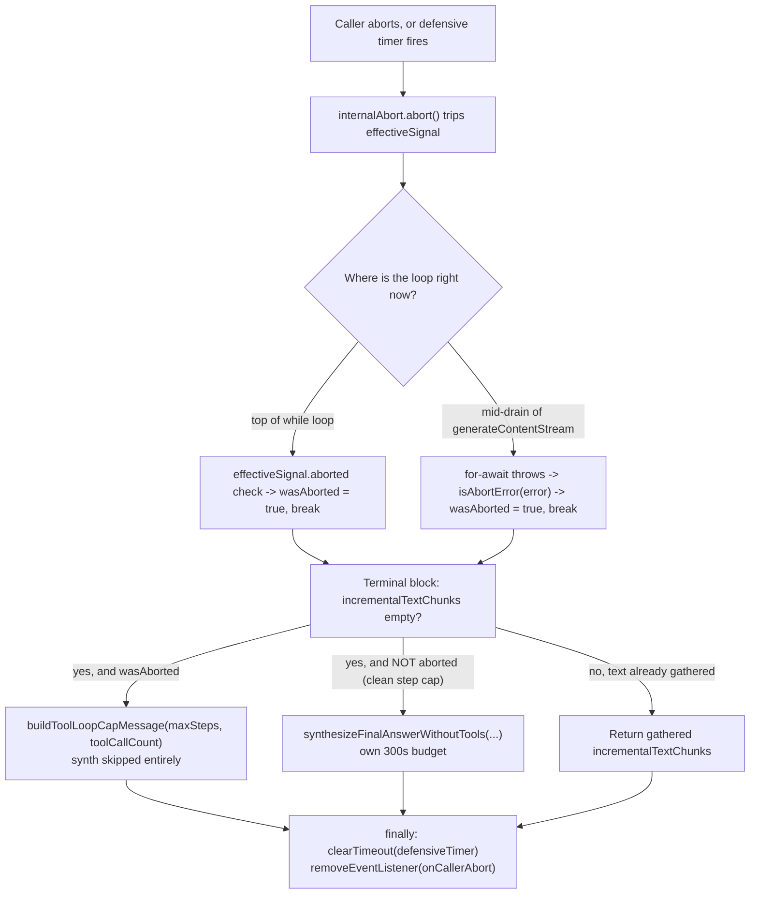

An agent asks Gemini 3, through NeuroLink's native Vertex AI integration, to work through a multi-step task. Eighteen minutes and 74 tool calls later, it is still going. Thirty of those calls happened *after* the caller asked it to stop. The mechanism responsible for stopping it — `options.abortSignal`, passed all the way down from `neurolink.stream()` — was never actually read by the code running the loop. This is the internals of that bug: how it hid behind a fix that looked complete, and the commit that closed it, `60ff17521` (`fix(vertex): honor abortSignal + graceful step-cap message in native Gemini-3 loop`, 2026-07-01).

## What the earlier fix actually covered

This wasn't the first bug in this loop. An earlier fix — the commit message calls it "the 9.79.3 lost-prose fix" — had already solved a related problem: `executeNativeGemini3Generate` and `executeNativeGemini3Stream`, the two agentic loops in `GoogleVertexProvider` (`src/lib/providers/googleVertex.ts`) that drive Gemini-3's native tool calling, would hit `maxSteps` and throw away whatever text the model had produced across all those steps, replacing it with a canned placeholder:

```typescript
// Before this commit's change to handleMaxStepsTermination
return (
  lastStepText ||
  `[Tool execution limit reached after ${maxSteps} steps. The model continued requesting tool calls beyond the limit.]`
);
```

That fix made `handleMaxStepsTermination`, the shared helper in `src/lib/providers/googleNativeGemini3.ts`, prefer real accumulated text over the placeholder whenever the model had produced any. It also started reading the SDK's own `finishReason` off each streamed chunk instead of defaulting to `"unknown"`. Both were real bugs, and both were fixed correctly, for the case the fix was built around: **a model that keeps writing prose across steps while it also calls tools.**

That case is not the only shape a Gemini-3 turn can take.

## Why a pure tool-calling turn has no prose to preserve

Gemini-3 can run an entire multi-step turn — planning, calling tools, reading results, calling more tools — without emitting a single character of user-visible text along the way. What it emits instead is `thoughtSignature` and `functionCall` parts: structured reasoning and structured calls, with no `text` field at all until (if ever) it decides to write a final answer.

`executeNativeGemini3Stream` accumulates step text by filtering exactly that field:

```typescript
// Extract text from raw parts after stream completes
// This avoids SDK warning about non-text parts (thoughtSignature, functionCall)
const stepText = rawResponseParts
  .filter(
    (part): part is { text: string } =>
      typeof (part as Record<string, unknown>).text === "string",
  )
  .map((part) => part.text)
  .join("");
```

When every part across every step is `thoughtSignature` or `functionCall`, that filter returns nothing, every step. `incrementalTextChunks` — the array the earlier fix relies on to decide "did the model produce anything worth keeping" — stays empty for the entire turn. The prose-preservation branch the 9.79.3 fix added has nothing to preserve, so it never fires, and the loop falls straight through to the maxSteps branch with an empty `finalText`. The 18-minute, 74-tool-call run this commit's message describes is exactly that: a turn that was never going to produce prose along the way, running unchecked because nothing about the loop was watching the clock, and nothing about it was reading `options.abortSignal` at all.

## The abortSignal that was accepted but never wired

`options.abortSignal` exists on the public `generate()`/`stream()` options object already — NeuroLink accepts a caller-supplied `AbortSignal` on every provider. But before this commit, neither native Gemini-3 loop passed it anywhere. The `generateContentStream` call in both `executeNativeGemini3Generate` and `executeNativeGemini3Stream` looked like this:

```typescript
// Before
const stream = await client.models.generateContentStream({
  model: modelName,
  contents: currentContents,
  config,
});
```

No `abortSignal` field on `config`, no check of `options.abortSignal.aborted` anywhere in the `while (step < maxSteps)` loop. A caller could abort the request and the loop would keep stepping — calling tools, appending to `currentContents`, calling the model again — for as long as it took to either produce prose (which, per the previous section, might be never) or exhaust `maxSteps` on its own. The abort had nowhere to land.

## An internal AbortController, not a pass-through

The fix doesn't just forward `options.abortSignal` into `config.abortSignal` directly. It wraps it in an internal `AbortController`, because two independent things need to be able to trip the same signal: the caller aborting, and a defensive wall-clock ceiling in case the caller never does. The scaffolding is identical in both `executeNativeGemini3Generate` and `executeNativeGemini3Stream`, and the comment in the diff says explicitly what it's modeled on — "mirrors executeNativeAnthropicStream," NeuroLink's equivalent loop for the Anthropic native provider:

```typescript
// Abort scaffolding (mirrors executeNativeAnthropicStream). The native
// Gemini SDK cancels via config.abortSignal, so drive an internal
// AbortController: the caller's signal and a defensive wall-clock timer
// both trip it, and every request/tool-exec receives effectiveSignal.
const streamTimeoutMs =
  parseTimeout(options.timeout) ?? DEFAULT_GEMINI_STREAM_TIMEOUT_MS;
const internalAbort = new AbortController();
const onCallerAbort = () => internalAbort.abort();
options.abortSignal?.addEventListener("abort", onCallerAbort);
const defensiveTimer = setTimeout(() => {
  logger.warn(
    `[GoogleVertex] Native Gemini turn exceeded ${streamTimeoutMs}ms — aborting`,
  );
  internalAbort.abort();
}, streamTimeoutMs);
const effectiveSignal = internalAbort.signal;
if (options.abortSignal?.aborted) {
  internalAbort.abort();
}
let wasAborted = false;
```

`DEFAULT_GEMINI_STREAM_TIMEOUT_MS` is new too, added to `src/lib/core/constants.ts` alongside the other loop-tuning constants (`DEFAULT_MAX_STEPS`, `DEFAULT_TOOL_MAX_RETRIES`):

```typescript
/** Defensive wall-clock ceiling for a native Gemini-3 agentic turn (generate + stream). */
export const DEFAULT_GEMINI_STREAM_TIMEOUT_MS = 300_000;
```

Five minutes, overridable per call via `options.timeout` (parsed through the existing `parseTimeout` helper). It exists as a backstop independent of the caller ever supplying `abortSignal` at all — a turn with no caller abort and no prose output still can't run forever.

`effectiveSignal`, not the raw `options.abortSignal`, is what actually goes on the wire. Every `generateContentStream` call in the loop body now reads:

```typescript
const stream = await client.models.generateContentStream({
  model: modelName,
  contents: currentContents,
  config: { ...config, abortSignal: effectiveSignal },
});
```

A shallow clone of `config` on every request — the loop's own `config` object is never mutated, so nothing downstream that reads it later sees a stray `abortSignal` bolted onto shared state. The same `effectiveSignal` is also threaded into tool execution for that step, so a tool call in flight when the signal trips gets cancelled along with the model request, not left to finish on its own schedule.

## From a re-thrown AbortError to a graceful break

Wiring the signal into the request is half the fix. The other half is what happens when it actually fires. `generateContentStream`'s `for await` loop throws when its underlying signal aborts mid-drain — and before this commit, *any* error out of that loop (abort or otherwise) was treated identically:

```typescript
} catch (error) {
  logger.error("[GoogleVertex] Native SDK error", error);
  throw this.handleProviderError(error);
}
```

Re-throwing an abort exactly like a genuine provider failure is a problem specific to this codebase's fallback design: a thrown error from the native loop routes into a second, unbounded fallback call elsewhere in the request path. An abort that re-throws doesn't stop the turn — it restarts a piece of it, on a request that has no timeout of its own. The fix adds a new helper, `isAbortError`, exported from `googleNativeGemini3.ts`:

```typescript
/**
 * Detect whether an error represents an abort/cancellation (from an
 * AbortSignal firing during a fetch/stream drain). Used by the native
 * Gemini-3 agentic loops to break gracefully rather than re-throw.
 */
export function isAbortError(error: unknown): boolean {
  if (!error) {
    return false;
  }
  const e = error as { name?: string; message?: string; code?: number };
  return (
    e.name === "AbortError" ||
    (typeof e.message === "string" && /abort/i.test(e.message)) ||
    (typeof DOMException !== "undefined" &&
      error instanceof DOMException &&
      e.code === 20)
  );
}
```

Three checks, in order of how directly they name the failure: the SDK's own `AbortError` name, a message that mentions "abort" (case-insensitive, since not every layer that can throw here normalizes to a named error), and `DOMException` code 20 — the standard `AbortError` code for a `DOMException` specifically, which is what some fetch implementations throw instead of a plain `Error`.

Both catch sites in both loops now branch on it:

```typescript
} catch (error) {
  // A mid-drain abort surfaces as an AbortError from the `for await`.
  // Break gracefully into the terminal block instead of re-throwing
  // (a re-throw would route the caller's abort into a second unbounded
  // fallback stream()). Dual check as with the inner catch:
  // effectiveSignal.aborted (a signal we tripped) OR isAbortError(error)
  // (an abort-shaped throw) — either means "stop", not a real failure.
  if (effectiveSignal.aborted || isAbortError(error)) {
    wasAborted = true;
    break;
  }
  logger.error("[GoogleVertex] Native SDK error", error);
  throw this.handleProviderError(error);
}
```

The dual condition matters: `effectiveSignal.aborted` catches the case where the loop tripped its own signal (the defensive timer, or a caller abort already observed) even if whatever bubbled up from the SDK isn't abort-shaped by the time it reaches the catch block; `isAbortError(error)` catches the case where the thrown error itself clearly says "aborted" even if `effectiveSignal.aborted` hasn't been checked yet at that exact point. Either one is enough to treat this as "stop, not fail" and `break` out of the `while (step < maxSteps)` loop into the terminal handling — gathered tool results already pushed onto `currentContents` are preserved, they just don't get a further round trip.

The loop also checks the signal proactively, not just reactively in a catch block, at the top of every iteration:

```typescript
while (step < maxSteps) {
  if (effectiveSignal.aborted) {
    wasAborted = true;
    break;
  }
  step++;
  ...
```

An abort that lands between steps — after one `generateContentStream` call finishes and before the next one starts — is caught here rather than requiring a new request to even begin before the loop notices anything changed.

## Why the recovery synth had to become abort-aware too

There's a third piece, and it's the one the commit message is most specific about: **skipping the recovery synth entirely on the aborted path.** The 9.79.3 fix had already added a fallback for the case where the loop hits `maxSteps` with no text to show for it — `synthesizeFinalAnswerWithoutTools`, a second, tools-disabled request that asks the model to just answer in plain text given what's already in `currentContents`. That fallback carries its own timeout budget. Firing it after an abort would mean: the caller asked this turn to stop, the turn kept running past the wall-clock cap that was supposed to bound it, and *then* issued another request with up to 300 more seconds of budget. That's not a fix for the runaway — it's the runaway with an extra step bolted on.

The fix makes the synth call abort-aware at its own entry point, not just at the call site that decides whether to invoke it:

```typescript
// Already aborted — never issue the synth request (would add +300s after a
// blown budget). Return empty so the caller maps to the graceful message.
if (abortSignal?.aborted) {
  return { text: "", inputTokens: 0, outputTokens: 0 };
}
```

`synthesizeFinalAnswerWithoutTools` now takes an optional trailing `abortSignal` parameter (folded into its own shallow-cloned `config`, same pattern as the main loop, so its own network request can be cancelled too):

```typescript
const synthConfig: Record<string, unknown> = {
  ...config,
  ...(abortSignal ? { abortSignal } : {}),
};
```

And the terminal block that decides whether to call it at all branches on `wasAborted` before ever reaching the synth path:

```typescript
if (incrementalTextChunks.length > 0) {
  // text already gathered from prior steps — nothing to synthesize
} else if (wasAborted) {
  // Aborted turn — skip synth entirely so it can never add +300s after
  // a blown budget. Deliver exactly one graceful cap chunk.
  logger.warn(
    `[GoogleVertex] Tool call loop aborted mid-turn; ` +
      `returning a graceful cap message.`,
  );
  finalText = buildToolLoopCapMessage(maxSteps, toolCallCount);
} else {
  // clean step-cap exhaustion with no text — synth still runs, with its
  // own budget, exactly as the 9.79.3 fix left it
  const synth = await this.synthesizeFinalAnswerWithoutTools(
    client,
    modelName,
    config,
    currentContents,
    useFinalResultTool,
    parseTimeout(options.timeout) ?? DEFAULT_GEMINI_STREAM_TIMEOUT_MS,
    effectiveSignal,
  );
  ...
}
```

The clean step-cap path — the model kept calling tools, never got aborted, just ran out of steps — keeps its synth attempt exactly as before. Only the aborted path skips it, because only the aborted path has already spent the budget the synth would need to borrow.

## One cap message, not two copies of the placeholder text

Before this fix, the bracketed placeholder string existed in two places that could drift independently: inline in both native Gemini loops, and again inside the shared `handleMaxStepsTermination`. The fix replaces both with one function:

```typescript
/**
 * Build a graceful, user-facing message for when a single agentic turn hits
 * the step cap (or is aborted mid-turn) without producing a final answer.
 * Replaces the legacy bracketed "Tool execution limit reached" placeholder.
 */
export function buildToolLoopCapMessage(
  maxSteps: number,
  toolCallCount: number,
): string {
  const calls =
    toolCallCount > 0
      ? `I gathered information across ${toolCallCount} tool call${
          toolCallCount === 1 ? "" : "s"
        } but `
      : "I ";
  return (
    `${calls}reached the ${maxSteps}-step limit for a single turn before I could finish. ` +
    `Please narrow the request or break it into smaller asks and I'll continue.`
  );
}
```

`handleMaxStepsTermination` itself shrinks to calling it instead of inlining its own copy of the string:

```typescript
return lastStepText || buildToolLoopCapMessage(maxSteps, 0);
```

Two differences from the old placeholder text are worth naming. First, tone: the old string read like an internal log line that leaked into a chat response — `"[Tool execution limit reached after N steps...]"`, brackets and all. `buildToolLoopCapMessage` reads like something meant for the person on the other end of the conversation, and it tells them what to do about it (narrow the request, or split it up), not just what happened. Second, the tool-call count is now a real parameter instead of being absent from the message entirely — the terminal block in both loops computes it as `allToolCalls.filter((tc) => tc.toolName !== "final_result").length` before building the message, so a turn that gathered real tool output before hitting the cap says so, distinct from a turn that produced nothing at all.

## What finishReason means now

The commit is specific that this part is deliberately *unchanged*: a clean step-cap exhaustion that doesn't end in a successful synth still maps to `"tool-calls"` as the finish reason, and every other outcome — a normal completion, an aborted turn, a successful synth — maps from whatever the SDK itself reported. `hitStepLimit` is computed as `step >= maxSteps && !wasAborted`, so an aborted turn is never mistaken for a clean step-cap exhaustion even though both end up producing the same graceful cap message via `buildToolLoopCapMessage`. The two paths reach a similar-looking user-facing string through genuinely different `finishReason` values, which matters for anything downstream — retry logic, dashboards, the fallback provider chain — that branches on `finishReason` rather than string-matching the message text.

## The abort path, end to end



## Twenty-seven cases, not a smoke test

The commit ships alongside `test/continuous-test-suite-gemini-abort.ts` — 998 lines, run via `pnpm run test:gemini-abort` (wired into `package.json` as `"test:gemini-abort": "npx tsx test/continuous-test-suite-gemini-abort.ts"`). The commit message counts 27 cases; the file's own header describes what they cover: the pure exported helpers (`buildToolLoopCapMessage`, `isAbortError`, `handleMaxStepsTermination`), both loops driven through a mock-injected `client.models.generateContentStream`, `synthesizeFinalAnswerWithoutTools`'s abort-awareness, and — worth calling out specifically — a source-level regression grep.

That last one is a direct assertion against the bug this post is about recurring silently:

```typescript
await test(
  "regression: 'Tool execution limit reached after' absent from googleVertex.ts and googleNativeGemini3.ts",
  () => {
    // asserts the deleted placeholder string does not reappear in either file
  },
);
```

A handful of the other case names give a sense of what "abort-aware" actually had to mean in practice, beyond just "the signal exists":

- `"generate: abort mid-drain -> loop breaks (no throw), synth skipped, cap message, call count < maxSteps"`
- `"generate: abort BETWEEN steps (loop-entry guard) -> graceful cap message"`
- `"generate: every request config.abortSignal === effectiveSignal; original config not mutated"`
- `"generate: tool execute receives the same abortSignal as the request; aborted tool call does not count as failure"`
- `"stream: pure-runaway, synth empty -> exactly ONE non-empty graceful chunk"`
- `"synth: already-aborted signal -> returns {text:''} WITHOUT calling generateContentStream"`

That fourth one matters on its own: an abort mid-tool-execution could plausibly have been recorded as a tool *failure* by the existing `failedTools` retry-tracking map, which would have meant an aborted turn quietly poisoning a tool's retry budget for the rest of the conversation. The test suite checks that it doesn't.

## What this fix doesn't claim

`DEFAULT_GEMINI_STREAM_TIMEOUT_MS` is a wall-clock ceiling on a single agentic turn, not a guarantee about how quickly any individual `generateContentStream` request returns once its own drain has started — a slow chunk can still take as long as the underlying stream takes to deliver it; what the fix bounds is the loop as a whole, including how many further steps it's willing to take. And the fix is scoped to exactly the two loops the commit names: `executeNativeGemini3Generate` and `executeNativeGemini3Stream` inside `GoogleVertexProvider`. It doesn't claim to have audited abort handling across every other native provider loop in the codebase — it explicitly borrows its shape from one that had already solved this (`executeNativeAnthropicStream`, per the diff's own comment), which means the pattern existed in the codebase before this fix, just not yet here. Gemini-3's tool-only reasoning turns were the gap; this closes that specific one.

---

**Related posts:**

- [Gemini 3 Native Integration: Google's Latest Models in NeuroLink](/posts/gemini-3-native-integration/)
- [Why Every Native Provider Must Wire the Same Tool-Persistence Hook](/posts/why-every-native-provider-must-wire-the-same-tool-persistence-hook/)
- [stepIndex bookkeeping: keeping multi-step calls in order](/posts/stepindex-bookkeeping-keeping-multi-step-calls-in-order/)
