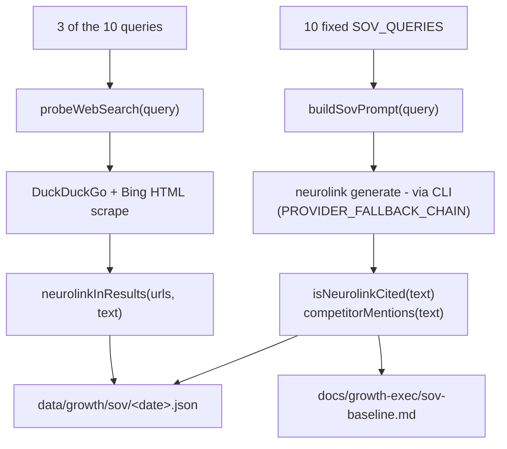

Ask NeuroLink's own CLI a simple question — "what's the best TypeScript AI SDK in 2026?" — routed through the same provider fallback chain NeuroLink ships to every user, and something uncomfortable happens: NeuroLink never comes up. Not once, across ten different phrasings of that kind of question, across two different model providers answering them. That is not an anecdote from someone pasting a prompt into a chat window and screenshotting the result. It is the output of a measurement system that shipped on 2026-07-04 specifically to produce that number on demand, the same way every time, so it can be tracked instead of just felt.

This post is about that system — `scripts/growth/ai-sov-probe.mjs` — how it asks the question, how it decides whether NeuroLink was mentioned, why it uses NeuroLink's own CLI to do the asking, and what a 0% baseline does and doesn't tell you.

## Why "share of voice" needed a different definition here

Share of voice is an old marketing metric: how often does your brand show up relative to competitors, across some set of channels. The channels used to be press mentions, ad impressions, search rankings. In 2026 a fair number of people looking for "a TypeScript SDK for OpenAI and Anthropic" are not typing that into a search box at all — they're asking a model, in a chat window or an IDE assistant, and taking whatever it recommends. If a model's answer to that question never includes you, you don't lose a search ranking; you lose a category of recommendation entirely, and it's invisible unless someone goes and asks the model itself.

That's the gap `ai-sov-probe.mjs` targets. It's a narrow, mechanical definition of AI SOV: out of a fixed set of developer-shaped queries, in how many does the model's answer mention NeuroLink at all. No sentiment scoring, no ranking position, no "was it the top pick" — just presence versus absence, because presence is the precondition for everything else and this system's job was to establish whether that precondition holds yet.

## Ten queries, one prompt shape

The probe runs ten fixed queries, defined as a literal array in the script rather than generated per run, so the same ten questions get asked every time this is re-run and the trend line means something:

```javascript
const SOV_QUERIES = [
  'best TypeScript AI SDK 2026',
  'LangChain alternative TypeScript',
  'MCP client library TypeScript',
  'multi-provider LLM SDK',
  'TypeScript SDK for OpenAI and Anthropic',
  'voice AI SDK TypeScript',
  'RAG library TypeScript',
  'AI agent framework TypeScript',
  'Vercel AI SDK alternative',
  'run 24 LLM providers one API',
];
```

Each query gets wrapped in the same instruction template before it goes to the model — the query itself never changes shape, only the topic inside it does:

```javascript
function buildSovPrompt(query) {
  return `A developer asks: "${query}"

Please recommend the best tools, libraries, or frameworks that answer this question. Be specific — list the top options with a short reason for each. Focus on TypeScript/JavaScript ecosystem unless the query says otherwise.

Format your response as a plain bulleted list. Include library names, package names, or URLs where relevant.`;
}
```

That framing matters for two reasons the script's authors were clearly deliberate about. First, it asks for a *list* of options rather than a single best answer, which is closer to how a developer would actually phrase a search and gives NeuroLink more surface area to appear on than a forced single pick would. Second, it asks for package names and URLs explicitly, which is what makes the citation check below workable — the prompt is engineered to make the model name things, not just describe categories.

## Dogfooding the CLI to measure the CLI's own SDK

The interesting design choice here isn't the prompt — it's what sends it. `ai-sov-probe.mjs` doesn't call any provider's HTTP API directly. It shells out to NeuroLink's own CLI, the exact binary published as `neurolink` from `@juspay/neurolink`'s `dist/cli/index.js`:

```javascript
function neurolinkGenerate(prompt, opts = {}) {
  const provider = opts.provider;
  const model = opts.model;
  const temperature = opts.temperature ?? 0.3;
  const maxTokens = opts.maxTokens || 1024;

  const args = [
    'neurolink', 'generate', '-',
    '--provider', provider,
    '--model', model,
    '--temperature', String(temperature),
    '--maxTokens', String(maxTokens),
  ];
  const cmd = args.map(a => `'${a.replace(/'/g, "'\\''")}'`).join(' ');
  try {
    const out = execSync(cmd, {
      input: prompt,
      timeout: 60_000,
      stdio: ['pipe', 'pipe', 'pipe'],
      maxBuffer: 5 * 1024 * 1024,
      env: process.env,
    });
    return { ok: true, text: out.toString('utf8').trim() };
  } catch (e) {
    return {
      ok: false,
      error: String(e.message || e).slice(0, 300),
      stderr: e.stderr?.toString('utf8')?.slice(-500) || '',
    };
  }
}
```

That's `neurolink generate -` — the CLI's stdin mode — piping the prompt in and reading the response back out via `execSync`, with a 60-second timeout and a 5MB output buffer. The script's own header comment says this mirrors an existing pattern: "env loading (mirrors engagement-evaluate.mjs pattern)", pointing at `scripts/engagement-evaluate.mjs`, an earlier script that scores draft social replies the same way. So the SOV probe isn't the first script in this repo to drive the product through its own CLI rather than reimplementing a provider client; it's reusing a shape that already existed.

The practical effect is that every one of the ten "what would you recommend" questions is answered by a model NeuroLink itself routed to, using NeuroLink's own provider abstraction and fallback logic — the same code path a real user's `generate()` call would take. Measuring "does the model recommend NeuroLink" through NeuroLink's own multi-provider routing is about as direct a dogfooding loop as this kind of measurement gets.

## The fallback chain that decided which model actually answered

Which model answers each query isn't fixed to one provider. The script defines a fallback chain and walks it until one provider succeeds:

```javascript
const PROVIDER_FALLBACK_CHAIN = [
  { provider: 'groq', model: 'llama-3.1-8b-instant' },
  { provider: 'anthropic', model: 'claude-3-haiku-20240307' },
  { provider: 'openai', model: 'gpt-4o-mini' },
  { provider: 'vertex', model: 'gemini-2.5-pro' },
];

function generateWithFallback(prompt, opts = {}) {
  const chain = cliProvider && cliModel
    ? [{ provider: cliProvider, model: cliModel }, ...PROVIDER_FALLBACK_CHAIN]
    : PROVIDER_FALLBACK_CHAIN;

  for (const { provider, model } of chain) {
    const result = neurolinkGenerate(prompt, { provider, model, ...opts });
    if (result.ok) return { ...result, provider, model };
    console.error(`  [fallback] ${provider}/${model} failed: ${result.error.slice(0, 80)}`);
  }
  return { ok: false, error: 'all providers failed', provider: null, model: null };
}
```

Groq's `llama-3.1-8b-instant` is first in line — fast and on a free tier, a sensible default for ten throwaway probe calls. In the run recorded for 2026-07-04, that chain actually mattered: the raw results show five of the ten queries answered by `groq/llama-3.1-8b-instant` and the other five falling through to `vertex/gemini-2.5-pro`, alternating query by query. The script doesn't log *why* Groq didn't answer those five — that detail isn't captured in the stored output — but the fallback chain existing at all is what kept the probe run from failing outright when one provider had trouble with half the calls.

## Deciding whether NeuroLink got mentioned

Scoring a free-text response for "did this mention the product" is done with a small, fixed set of regexes, not a second LLM call judging the first one's output:

```javascript
const NEUROLINK_PATTERNS = [
  /neurolink/i,
  /neurolink\.ink/i,
  /neurolink[\s\-_]?sdk/i,
  /@juspay\/neurolink/i,
];

function isNeurolinkCited(text) {
  return NEUROLINK_PATTERNS.some(p => p.test(text));
}
```

Competitor presence is tracked the same way, against a fixed watchlist rather than anything the model volunteers on its own:

```javascript
const COMPETITORS = [
  { name: 'Vercel AI SDK', patterns: [/vercel[\s\-]?ai/i, /ai[\s\-]?sdk.*vercel/i, /@ai[\s\-]?sdk/i] },
  { name: 'LangChain', patterns: [/langchain/i] },
  { name: 'LlamaIndex', patterns: [/llamaindex/i, /llama[\s\-]?index/i] },
  { name: 'LiteLLM', patterns: [/litellm/i] },
  { name: 'OpenRouter', patterns: [/openrouter/i] },
  { name: 'Mastra', patterns: [/mastra/i] },
  { name: 'Haystack', patterns: [/haystack/i] },
  { name: 'PortkeyAI', patterns: [/portkey/i] },
];
```

This is a deliberately cheap scoring method — a handful of case-insensitive regexes, no second model call to interpret ambiguity, no fuzzy matching. That's a real limitation: it can't tell you the model recommended NeuroLink *favorably* versus mentioning it only to dismiss it, and it will miss a paraphrase that never uses any of those four strings. What it buys in exchange is that the score is fully deterministic and free to compute — running it again on the same stored response always produces the same verdict, which matters for a baseline you intend to compare future runs against.

## What actually came back on day one

Ten queries went out through the fallback chain above. All ten got a response. Zero of them mentioned NeuroLink:

| # | Query | Answered by | NeuroLink cited? | Competitors mentioned |
|---|-------|-------------|-------------------|------------------------|
| 1 | best TypeScript AI SDK 2026 | groq / llama-3.1-8b-instant | No | — |
| 2 | LangChain alternative TypeScript | vertex / gemini-2.5-pro | No | LlamaIndex |
| 3 | MCP client library TypeScript | groq / llama-3.1-8b-instant | No | — |
| 4 | multi-provider LLM SDK | vertex / gemini-2.5-pro | No | LangChain |
| 5 | TypeScript SDK for OpenAI and Anthropic | groq / llama-3.1-8b-instant | No | — |
| 6 | voice AI SDK TypeScript | vertex / gemini-2.5-pro | No | — |
| 7 | RAG library TypeScript | groq / llama-3.1-8b-instant | No | — |
| 8 | AI agent framework TypeScript | vertex / gemini-2.5-pro | No | Vercel AI SDK, LangChain, LlamaIndex |
| 9 | Vercel AI SDK alternative | groq / llama-3.1-8b-instant | No | Vercel AI SDK |
| 10 | run 24 LLM providers one API | vertex / gemini-2.5-pro | No | LiteLLM |

Across the ten successful probes, the recorded competitor tally was LlamaIndex and LangChain and Vercel AI SDK at two mentions each, LiteLLM at one. NeuroLink's own count across all ten: zero. For query 1, `groq/llama-3.1-8b-instant`'s actual response opened with Microsoft Azure Cognitive Services and Google Cloud AI Platform as its top two picks for "best TypeScript AI SDK 2026" — not even a TypeScript-native SDK, let alone NeuroLink. That's the flavor of answer the regex scorer was reading: not hostile, not aware NeuroLink exists to reject it, just answering from whatever the underlying model already associates with the question.

## A second probe, over plain web search

The same script also runs three of the ten queries through web search directly, independent of any LLM, using a small hand-rolled scraper against DuckDuckGo's HTML endpoint and Bing rather than an official search API:

```javascript
async function probeWebSearch(query) {
  const encoded = encodeURIComponent(query);
  const engines = [
    { name: 'DuckDuckGo', url: `https://html.duckduckgo.com/html/?q=${encoded}&kl=us-en` },
    { name: 'Bing', url: `https://www.bing.com/search?q=${encoded}&cc=US&setlang=en` },
  ];
  const engineResults = [];
  for (const engine of engines) {
    try {
      const resp = await fetchUrl(engine.url, { timeout: 15_000 });
      if (resp.status !== 200) {
        engineResults.push({ engine: engine.name, ok: false, error: `HTTP ${resp.status}` });
        continue;
      }
      const { urls, text } = parseSearchResults(resp.body, engine.name);
      const mention = neurolinkInResults(urls, text);
      engineResults.push({
        engine: engine.name,
        ok: true,
        neurolink_found: mention.found,
        neurolink_url_hit: mention.urlHit,
        neurolink_text_hit: mention.textHit,
        result_url_count: urls.length,
        sample_urls: urls.slice(0, 10),
      });
    } catch (e) {
      engineResults.push({ engine: engine.name, ok: false, error: String(e.message).slice(0, 200) });
    }
  }
  return engineResults;
}
```

`parseSearchResults` is intentionally unsophisticated — it regex-matches `href="..."` attributes out of the raw HTML response and strips tags from the body to get a plain-text blob, rather than parsing a DOM. `neurolinkInResults` then checks two independent signals: does any result URL contain "neurolink", or does the visible result text match one of the same `NEUROLINK_PATTERNS` regexes used for the LLM probes. Either one counts as a hit.

For the three queries probed this way on 2026-07-04 — `MCP client library TypeScript`, `multi-provider LLM SDK`, `TypeScript SDK for OpenAI and Anthropic` — Bing returned results for all three and found NeuroLink in none of them. DuckDuckGo returned results for the first query and also found nothing, and errored out on the other two rather than returning zero results for them, which the report records honestly as "⚠️ Error" rather than folding it into the miss count. Combined web finding: 0 of 3 queries surfaced neurolink.ink.

## The whole pipeline, end to end



Both probe paths — the LLM one and the web one — land in the same two output artifacts: a full JSON record under `data/growth/sov/2026-07-04.json` with every raw response snippet and score, and a rendered summary at `docs/growth-exec/sov-baseline.md` for anyone who wants the numbers without reading JSON. The script writes both unconditionally, every run, which is what makes re-running it later a comparison rather than a one-off report.

## Reading a 0% baseline correctly

The temptation with a number like "0 out of 10" is to read it as an indictment. It isn't one, and the script's own generated summary resists that framing — its interpretation section, rendered directly from the computed percentage, states plainly: "NeuroLink has 0% AI SOV in the tested query set. The library is not yet appearing in LLM recommendations for TypeScript AI SDK queries. This is the baseline to beat." Baseline, not verdict. A brand-new measurement of an existing, unaddressed gap doesn't tell you the gap got worse today; it tells you today is the first day anyone measured it precisely enough to compare against tomorrow.

It's also worth being honest about what this number can't distinguish. A regex-based citation check can't tell the difference between "the model genuinely doesn't know NeuroLink exists" and "the model knows but this particular sampling temperature and prompt phrasing happened not to surface it" — the probe runs each query once, at `temperature: 0.3`, not several times averaged. Ten queries is also a small, fixed sample tuned toward developer-search phrasing; it says something specific about that slice of queries and nothing directly about, say, questions phrased as "how do I add tool calling to my chatbot," which aren't in the list. The report format documents which ten queries were asked precisely so a reader can judge for themselves whether those are the right ten, rather than trusting a percentage detached from its inputs.

What the recommended next steps in the generated report point at, given that constraint, is upstream of the probe script itself: publishing content that targets the exact phrasing these queries use, making sure docs and README consistently use the terms a developer would actually type, and getting listed on the comparison pages and awesome-lists that LLM training data and retrieval-augmented search both draw from. The probe measures a symptom; treating the cause is a separate, ongoing effort this baseline exists to check the progress of.

## Part of a larger batch, not a standalone script

`ai-sov-probe.mjs` didn't ship alone. The same commit that added it — `d30d71d`, dated 2026-07-04 — added five sibling measurement scripts in one pass: an npm-download attribution script splitting internal-CI traffic from external human installs, a competitor-velocity tracker, a dependents scan, a weekly north-star metrics dashboard, and a Google Search Console keyword-diagnosis script, each with its own JSON output under `data/growth/` and its own narrative summary under `docs/growth-exec/`. The commit message calls the group what it is: "measurement systems." AI SOV is one instrument in that set, specifically the one asking whether an LLM would tell a developer about NeuroLink at all — not download counts, not search rankings, but the newest channel developers actually ask questions through.

## Running it yourself

The script takes a provider/model override, a dry-run mode that skips real LLM calls entirely, and a date override for the output filename:

```bash
node scripts/growth/ai-sov-probe.mjs
node scripts/growth/ai-sov-probe.mjs --provider groq --model llama-3.1-8b-instant
node scripts/growth/ai-sov-probe.mjs --provider anthropic --model claude-3-haiku-20240307
node scripts/growth/ai-sov-probe.mjs --dry-run
node scripts/growth/ai-sov-probe.mjs --out-date 2026-07-04
```

`--dry-run` is worth calling out on its own: it skips every network call, both the CLI invocations and the web scrape, and fabricates a stub result set (`neurolink_cited: false`, two hardcoded competitor names) so the full pipeline — JSON write, markdown render, console summary — can be exercised without spending API calls or waiting on ten sequential generations plus two web scrapes. That's the same shape of guard a CI job would want before wiring this into a recurring schedule: prove the plumbing works without paying for the probe every time you touch the script.

The two output files are the whole point of running it more than once. `data/growth/sov/<date>.json` keeps a permanent, per-day record with every response snippet and score; `docs/growth-exec/sov-baseline.md` gets overwritten each run with the latest human-readable summary. Point a future run's `--out-date` at a later day, diff the two JSON files, and the ten-query, regex-scored slice of "does an LLM recommend NeuroLink" either moved or it didn't — which is a more concrete question than "do we feel like AI visibility is improving," and the whole reason this script exists is to keep answering it the same way every time it's asked.

---

**Related posts:**

- [How We Built Multi-Provider Failover: Never Losing an API Call](/posts/how-we-built-multi-provider-failover/)
- [NeuroLink vs LangChain: When to Use Which (An Honest Comparison)](/posts/neurolink-vs-langchain/)
- [NeuroLink CLI Mastery: 15 Commands Every AI Developer Should Know](/posts/neurolink-cli-mastery/)
