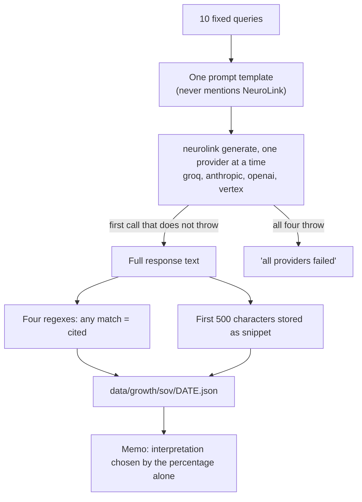

NeuroLink's first AI share-of-voice run ended with a headline number: **0 of 10**. The probe sent ten fixed questions to language models, scored each answer for any mention of NeuroLink, and found none. As a count that is true. As a measurement it is much thinner, and the engineering behind the number is the interesting part: which models answered, what they actually returned, and what the script does when an answer is empty, cut short or beside the point.

Everything below is read from the private marketing repository at `328f48a`, the last commit before this post's publish time. The run is one file, `data/growth/sov/2026-07-04.json`, written at 07:10 IST by a script that was committed about 41 seconds later together with the file itself and a baseline memo. The data does not record which version of the script ran; this reads the committed one, which was committed after the run. Nothing was re-run for this post, so there are no new probes here, only a close reading of the first one. Code blocks are excerpts from the files at that commit, trimmed and re-indented.

## One script, ten questions

The probe is a single Node script, `scripts/growth/ai-sov-probe.mjs`, 588 lines. Its header says what it is for:

```javascript
// scripts/growth/ai-sov-probe.mjs
// Runs 10 fixed queries against an LLM ("what would you recommend?") and
// scores whether NeuroLink is cited in the response. Also probes 3 of the
// queries via DuckDuckGo/Bing web search to check if neurolink.ink appears
// in organic results.
```

The ten questions are fixed, and one prompt template wraps every one of them:

```javascript
// scripts/growth/ai-sov-probe.mjs
const SOV_QUERIES = [
  'best TypeScript AI SDK 2026',
  'LangChain alternative TypeScript',
  'MCP client library TypeScript',
  'multi-provider LLM SDK',
  'TypeScript SDK for OpenAI and Anthropic',
  'voice AI SDK TypeScript',
  'RAG library TypeScript',
  'AI agent framework TypeScript',
  'Vercel AI SDK alternative',
  'run 24 LLM providers one API',
];
```

```javascript
// scripts/growth/ai-sov-probe.mjs
function buildSovPrompt(query) {
  return `A developer asks: "${query}"

Please recommend the best tools, libraries, or frameworks that answer this question. Be specific — list the top options with a short reason for each. Focus on TypeScript/JavaScript ecosystem unless the query says otherwise.

Format your response as a plain bulleted list. Include library names, package names, or URLs where relevant.`;
}
```

The prompt never mentions NeuroLink and never expands an abbreviation, and the script passes no flag asking for search or tools. The CLI version and its default tool set are not recorded, so whether a model could look anything up is unknown, and nothing in the stored answers suggests one did. Each question gets one successful reply, at temperature 0.3 with a budget of 600 output tokens; if a provider fails, the prompt goes to the next one.

The script does not import the SDK. It shells out to the `neurolink` command, found on `PATH` by its bare name, and passes the prompt on stdin:

```javascript
// scripts/growth/ai-sov-probe.mjs
const args = [
  'neurolink', 'generate', '-',
  '--provider', provider,
  '--model', model,
  '--temperature', String(temperature),
  '--maxTokens', String(maxTokens),
];
const cmd = args.map(a => `'${a.replace(/'/g, "'\\''")}'`).join(' ');
try {
  const out = execSync(cmd, {
    input: prompt,
    timeout: 60_000,
    stdio: ['pipe', 'pipe', 'pipe'],
    maxBuffer: 5 * 1024 * 1024,
    env: process.env,
  });
  return { ok: true, text: out.toString('utf8').trim() };
```

That makes the transport the `neurolink` command, assuming the one on `PATH` is the published CLI, but not NeuroLink's routing. The script keeps a four-entry list of providers (groq with an 8B Llama model, then anthropic, openai and vertex with `gemini-2.5-pro`) and walks it itself, one separate `neurolink generate` call per provider with an explicit `--provider` and `--model`:

```javascript
// scripts/growth/ai-sov-probe.mjs
function generateWithFallback(prompt, opts = {}) {
  // If CLI args specify a provider, try that first, then fallback chain.
  const chain = cliProvider && cliModel
    ? [{ provider: cliProvider, model: cliModel }, ...PROVIDER_FALLBACK_CHAIN]
    : PROVIDER_FALLBACK_CHAIN;

  for (const { provider, model } of chain) {
    const result = neurolinkGenerate(prompt, { provider, model, ...opts });
    if (result.ok) return { ...result, provider, model };
    console.error(`  [fallback] ${provider}/${model} failed: ${result.error.slice(0, 80)}`);
  }
  return { ok: false, error: 'all providers failed', provider: null, model: null };
}
```

Scoring is four case-insensitive regular expressions, and an answer counts as citing NeuroLink if any one of them matches:

```javascript
// scripts/growth/ai-sov-probe.mjs
// Strings/patterns that indicate NeuroLink is mentioned.
const NEUROLINK_PATTERNS = [
  /neurolink/i,
  /neurolink\.ink/i,
  /neurolink[\s\-_]?sdk/i,
  /@juspay\/neurolink/i,
];
```

All four contain the text `neurolink`, so the first pattern alone decides every verdict, and it would also match an answer that said "not NeuroLink". The test runs on the full reply, but only the first 500 characters of each reply are written to disk. The whole flow, from question to memo, looks like this:



## What the run recorded

The file holds ten answers, all marked successful, and none flagged as citing NeuroLink. Here they are one by one, with what the stored text shows:

| # | Question | Answered by | Seconds (whole fallback loop) | Stored characters | What the stored text shows |
|---|---|---|---|---|---|
| 1 | best TypeScript AI SDK 2026 | groq / llama-3.1-8b-instant | 2.3 | 500 | Led with Azure and Google Cloud platforms |
| 2 | LangChain alternative TypeScript | vertex / gemini-2.5-pro | 39.1 | 160 | Cut off at source after one bullet |
| 3 | MCP client library TypeScript | groq / llama-3.1-8b-instant | 2.6 | 500 | Misread MCP as the Minecraft Protocol |
| 4 | multi-provider LLM SDK | vertex / gemini-2.5-pro | 38.5 | 184 | Cut off at source after one bullet |
| 5 | TypeScript SDK for OpenAI and Anthropic | groq / llama-3.1-8b-instant | 2.8 | 500 | On topic (package names not checked); cut at 500 characters by the script |
| 6 | voice AI SDK TypeScript | vertex / gemini-2.5-pro | 37.5 | 179 | Cut off at source after one bullet |
| 7 | RAG library TypeScript | groq / llama-3.1-8b-instant | 2.8 | 500 | Misread RAG as a UI term |
| 8 | AI agent framework TypeScript | vertex / gemini-2.5-pro | 38.6 | 500 | On topic; cut at 500 characters by the script |
| 9 | Vercel AI SDK alternative | groq / llama-3.1-8b-instant | 3.4 | 500 | Echoes the question, then led with cloud platforms |
| 10 | run 24 LLM providers one API | vertex / gemini-2.5-pro | 38.8 | 193 | Cut off at source after one bullet |

The "answered by" column alternates strictly between two models. In the "stored characters" column, six answers hit the 500-character ceiling that the script applies, and four stop well before it.

## Two models behind one label

The file header and the baseline memo name one model. The memo says so on its fourth line:

```markdown
<!-- docs/growth-exec/sov-baseline.md -->
**LLM evaluator:** groq / llama-3.1-8b-instant  
```

The script fills those fields from the first probe that succeeded, not from the majority:

```javascript
// scripts/growth/ai-sov-probe.mjs
// Determine actual provider used (first successful probe).
const firstOk = llmResults.find(r => r.ok && r.provider);
if (firstOk) { activeProvider = firstOk.provider; activeModel = firstOk.model; }
```

Five answers came from `llama-3.1-8b-instant` on groq, at 2.3 to 3.4 seconds each. The other five, queries 2, 4, 6, 8 and 10, came from `gemini-2.5-pro` on vertex, at 37.5 to 39.1 seconds each. The command line that ran is not recorded. If the script used its default list, then because the list is tried in order and the first success wins, a vertex label means the groq, anthropic and openai attempts for that query all failed first. Each failed attempt printed one line to stderr, cut to 80 characters of the error message; that output was not saved and is not in the repository. The latency figure is the time around the whole loop, so on that reading it includes those failed attempts:

```javascript
// scripts/growth/ai-sov-probe.mjs
const t0 = Date.now();
const r = generateWithFallback(prompt, { temperature: 0.3, maxTokens: 600 });
const latency_ms = Date.now() - t0;
```

The 13.9 times gap between the two means is therefore not a clean measure of Gemini's speed. If the default list ran, it also contains the failed attempts before Gemini answered, and the data does not say how long each took.

## Four answers that stop after one bullet

Every vertex answer starts with the same line, which the CLI printed to stdout and the script stored as part of the reply: "The user provided project/location will take precedence over the API key from the environment variables." In four of the five, nothing much follows it. Query 2 is the clearest:

```json
// data/growth/sov/2026-07-04.json
{
  "query": "LangChain alternative TypeScript",
  "ok": true,
  "provider": "vertex",
  "model": "gemini-2.5-pro",
  "neurolink_cited": false,
  "competitors_mentioned": [
    "LlamaIndex"
  ],
  "response_snippet": "The user provided project/location will take precedence over the API key from the environment variables.\n- **LlamaIndex.TS** (`llamaindex` on npm): A direct and",
  "latency_ms": 39084
},
```

After the notice there is one bullet, cut off mid-sentence, and the record still says `"ok": true`. The four short answers hold 55, 79, 74 and 88 characters of actual answer, and end with "A direct and", "building LLM-", "Use the `@google-cloud" and "to call over 1". They are under the 500-character cap, so this is the whole of what the CLI wrote to stdout. Nothing in the script is built to notice:

```javascript
// scripts/growth/ai-sov-probe.mjs
  return { ok: true, text: out.toString('utf8').trim() };
} catch (e) {
  return {
    ok: false,
    error: String(e.message || e).slice(0, 300),
    stderr: e.stderr?.toString('utf8')?.slice(-500) || '',
  };
}
```

A reply counts as a success as soon as the process exits without throwing. There is no retry on a short reply, no check of finish reason or token usage, and no check that the text is non-empty, so an empty or cut-off answer is stored as `ok: true` with `neurolink_cited: false`. A model that did not mention NeuroLink and a model that said almost nothing produce the same record.

The data cannot say why these four stopped, because token counts and finish reasons are not stored. One candidate cause, and the only one the repository documents, is in a sibling script that makes the same CLI call. Its comment explains that Gemini 2.5 Pro's thinking mode eats the output budget, and it passes a larger budget and a thinking budget of zero. The probe passes 600 tokens and no thinking budget:

```javascript
// a sibling script that makes the same CLI call
// Pass prompt via stdin to avoid shell-quoting hell.
// --maxTokens 4096: Gemini 2.5 Pro's 'thinking' mode silently eats output
// budget; need headroom. --thinkingBudget 0 disables thinking so the model
// outputs the JSON directly (fast + deterministic for structured eval).
```

That is an inference from the code, not something the run proves.

## A small model reading the question wrong

The other half of the answers has a different problem. The 8B model answered quickly and fluently, and misread two of the ten questions. For "MCP client library TypeScript" it recommended `mcp-client`, "A TypeScript library for interacting with the Minecraft Protocol (MCP) server", and `mc-data`, for working with Minecraft data. For "RAG library TypeScript" it recommended `RAG.js`, "for building reusable UI components in TypeScript", and "React Abstract Grid (RAG)". The prompt never says which MCP or which RAG is meant, and this model read them as the Minecraft Protocol and as a UI term. Only one model answered each question, so the run cannot say whether a different model would have.

Two more answers from the same model are off target without misreading an abbreviation. For "best TypeScript AI SDK 2026" its first two items were Microsoft Azure Cognitive Services and Google Cloud AI Platform, and for "Vercel AI SDK alternative" it opened by echoing the question and then led with cloud platforms. In both, the first items are general cloud platforms rather than TypeScript AI SDKs, and the rest of each reply is not stored. That echo is also why the memo counts Vercel AI SDK twice: one of its two mentions is the question repeated back.

Put the two problems together and the ten answers sort like this. Four were cut off at source. Two misread the question. Two led with general cloud platforms instead of TypeScript SDKs. That leaves two answers that are on topic and not cut off at source: query 5, where the 8B model listed the OpenAI and Anthropic SDKs by name, and query 8, where Gemini's stored text lists LangChain.js and Vercel AI SDK before the 500-character cap (the competitor field also records LlamaIndex, from the part of the reply that was not stored). Neither mentioned NeuroLink. Those two are the evidence behind "0 of 10".

## The web half extracted nothing

Three of the questions were also run against web search, on DuckDuckGo's HTML endpoint and on Bing, with plain HTTPS requests from Node. No browser renders the page, and only HTTP 200 is accepted:

```javascript
// scripts/growth/ai-sov-probe.mjs
const engines = [
  {
    name: 'DuckDuckGo',
    url: `https://html.duckduckgo.com/html/?q=${encoded}&kl=us-en`,
  },
  {
    name: 'Bing',
    url: `https://www.bing.com/search?q=${encoded}&cc=US&setlang=en`,
  },
];

const engineResults = [];
for (const engine of engines) {
  try {
    const resp = await fetchUrl(engine.url, { timeout: 15_000 });
    if (resp.status !== 200) {
      engineResults.push({ engine: engine.name, ok: false, error: `HTTP ${resp.status}` });
      continue;
```

The script does not parse result blocks. It collects every absolute `href` on the page and drops any URL containing `duckduckgo.com`, `bing.com`, `microsoft.com`, `google.com`, `javascript:` or `privacy`, or 300 characters or longer, which would also drop ordinary result pages hosted on a Google or Microsoft domain:

```javascript
// scripts/growth/ai-sov-probe.mjs
const hrefPattern = /href=["']([^"']+)["']/gi;
const urls = [];
let m;
while ((m = hrefPattern.exec(html)) !== null) {
  const u = m[1];
  if (
    u.startsWith('http') &&
    !u.includes('duckduckgo.com') &&
    !u.includes('bing.com') &&
    !u.includes('microsoft.com') &&
    !u.includes('google.com') &&
    !u.includes('javascript:') &&
    !u.includes('privacy') &&
    u.length < 300
  ) {
    urls.push(u);
  }
}
```

Six fetches were made. DuckDuckGo answered two of them with HTTP 202, which the script records as an error and parses no further. The other four returned HTTP 200, and for all four the extractor found no result URLs at all:

```json
// data/growth/sov/2026-07-04.json
"engine": "Bing",
"ok": true,
"neurolink_found": false,
"neurolink_url_hit": false,
"neurolink_text_hit": false,
"result_url_count": 0,
"sample_urls": []
```

So "Not found" in the memo means the link extractor returned nothing and the first 6000 characters of page text held no NeuroLink match. It does not show that a results page was read. The memo's table row, `| Web results with neurolink.ink | 0 / 3 queries |`, does not say so. The raw pages were not saved, so the cause is unknown: a consent page, results rendered by script, or the link filter are all candidates. What the script lacks is a positive control. It never showed that it could extract a URL from any page, so an empty list could not mean anything.

## A headline written before the data

The memo's interpretation and its four recommended next steps are not derived from the answers. They are text in the script, chosen by the percentage alone. Here is the branch for 0%:

```javascript
// scripts/growth/ai-sov-probe.mjs
if (neurolink_sov_pct === 0) {
  lines.push('**NeuroLink has 0% AI SOV** in the tested query set. The library is not yet appearing in LLM recommendations for TypeScript AI SDK queries. This is the baseline to beat.');
```

If every probe had failed, the success count would be zero, the percentage would still be zero, and the memo would print the same interpretation and the same four next steps, even though the table above it would read 0 of 10 succeeded. A run with no answers and a run with ten answers that never mention NeuroLink get the same verdict sentence. The script also writes the memo unconditionally, and the memo path is not keyed by date:

```javascript
// scripts/growth/ai-sov-probe.mjs
const jsonPath = join(SOV_DATA_DIR, `${outDate}.json`);
writeFileSync(jsonPath, JSON.stringify(jsonOut, null, 2));
console.error(`[ai-sov-probe] Wrote JSON: ${jsonPath}`);

// Markdown summary.
const md = renderMarkdown(summary, llmResults, webResults, meta);
const mdPath = join(GROWTH_EXEC_DIR, 'sov-baseline.md');
writeFileSync(mdPath, md);
```

A dry run, which makes no model call and always reports 0%, writes the memo to that same fixed path, and the JSON too if it is run on the same date, so one accidental dry run could replace the real baseline.

## What a valid baseline needs

The probe lacks, or only partly has, each of the following. All of it follows from reading the first run:

1. Store the full reply, its finish reason and its token usage, not a 500-character cut.
2. Treat a reply under a minimum length as a failed probe, and retry or flag it instead of counting it as a success.
3. Strip the CLI notice before scoring and storing. Another script in the same repository already strips it and rejects empty output; the probe does neither.
4. Spell out MCP and RAG in the prompt, or choose questions without abbreviations.
5. Report how many answers came from each model, instead of naming the first success in the header and memo.
6. Prove the scraper on a page that has results before an empty list is allowed to mean anything, and store the HTTP status and page size for every fetch, not only the failures.
7. Choose the headline from the data. "No valid answers" and "valid answers, none mention us" are different sentences.
8. Guard the memo write so that a dry run cannot replace a real baseline.

## What 0 of 10 does say

It says that two on-topic answers, one from a small model and one from Gemini 2.5 Pro, did not mention NeuroLink in a single sample at temperature 0.3 when asked for the best TypeScript tools. That is a real observation and a weak one. The other eight answers say little: four stop after one bullet, two misread the question, and two led with general cloud platforms. The web probe produced no usable result data. The memo calls the result "the baseline to beat". It is better described as a baseline to redo, with a probe that can tell an answer that leaves NeuroLink out from an answer that says nothing at all.

---

**Related posts:**

- [Model Evaluation and Scoring: RAGAS-Style Quality Assessment](/posts/model-evaluation-scoring/)
- [Hitting the SmolLM2 ceiling](/posts/hitting-the-smollm2-ceiling/)
- [NeuroLink vs LangChain: When to Use Which (An Honest Comparison)](/posts/neurolink-vs-langchain/)
