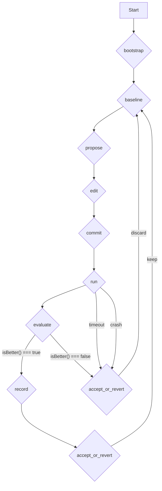

We designed NeuroLink's autoresearch subsystem because our own test suites were becoming a performance bottleneck. At Juspay, a human engineer would propose an optimization to a critical path, but validating it across our 20+ continuous test suites was a slow, manual process that blocked other work. We needed a system where an AI could take a high-level goal—like "reduce p99 latency in the Claude proxy"—and then autonomously design, execute, and validate its own experiments against our codebase. Autoresearch is that system: a self-contained AI agent that optimizes its own test suite inside a git repo, driven by a nine-phase experiment loop.

This isn't just about running tests. It's about giving the AI the tools to form a hypothesis, edit the code, run a benchmark, and decide whether its change was an improvement—all without human intervention. The system needed to be robust, safe, and observable. It required a strict policy engine to prevent the AI from modifying protected code, a state machine to track every experiment, and a deterministic evaluation function to judge the outcome.

## The Nine-Phase Experiment Loop

The entire autoresearch process is a state machine. The `ResearchWorker` moves an experiment through nine distinct phases, from `bootstrap` to `accept_or_revert`. Each phase grants the AI a different set of tools and a different objective. This ensures that the AI can't, for example, try to commit a change before it has successfully run a test.

The `ExperimentPhase` type defines the legal states, and the transitions are managed exclusively by the `ResearchWorker`. This strict progression is the core of the system's safety.

```typescript
export type ExperimentPhase =
  | "bootstrap"
  | "baseline"
  | "propose"
  | "edit"
  | "commit"
  | "run"
  | "evaluate"
  | "record"
  | "accept_or_revert";
```

We can visualize the loop and its key transitions using Mermaid. A failure or a discarded result at almost any stage forces a revert, sending the system back to the last known-good commit to start a new cycle.



## The Conductor: ResearchWorker

The `ResearchWorker` is the orchestrator that drives the entire experiment loop. It's a stateful class that composes all the other components: the state store, the policy engine, the prompt compiler, and the experiment runner. Its main entry point for a single cycle is `runExperimentCycle`, a long-running async method that steps through the phases, calls the LLM for decisions, and executes the resulting actions.

The worker is also responsible for observability. It uses an injected `AutoresearchEmitter` to fire events for every significant lifecycle moment, defined in the `AutoresearchEventMap`. This allows other parts of the NeuroLink system to monitor the progress of a research session in real-time.

```typescript
export class ResearchWorker {
  // ...
  async runExperimentCycle(description: string): Promise<ExperimentRecord> {
    // ... orchestrates the 9 phases ...
  }

  setEmitter(emitter: AutoresearchEmitter): void {
    this.emitter = emitter;
  }

  private emit(event: string, ...args: unknown[]): void {
    this.emitter?.emit(event, ...args);
  }
  // ...
}
```

This event-driven approach is critical for integrating autoresearch into larger automated workflows, much like how we use a central `TaskManager` to [schedule all AI work across different backends](/posts/two-backends-two-stores-one-taskmanager-how-neurolink-schedules-ai-work/).

## State Management: The ResearchStateStore

An autonomous agent that can be stopped and started must be able to persist its state. The `ResearchStateStore` is responsible for exactly that. It serializes the complete `ResearchState` object—which includes the current phase, experiment history, and accepted commit hash—to a JSON file on disk.

To prevent corruption from partial writes, it uses an atomic write-then-rename strategy. It first writes the new state to a temporary file and then, only on successful write, renames it to the final destination. The `load` and `save` methods provide the core interface for the `ResearchWorker`.

```typescript
export class ResearchStateStore {
  constructor(repoPath: string, statePath: string) {
    // ...
  }

  async load(): Promise<ResearchState | null> {
    // ... reads and parses the state file
  }

  async save(state: ResearchState): Promise<void> {
    // ... atomic write and rename
  }

  async update(patch: Partial<ResearchState>): Promise<ResearchState> {
    // ... loads, applies patch, and saves
  }
}
```

This persistent memory is philosophically similar to the problem solved by our [conversation memory backends](/posts/inside-conversationmemoryfactory-how-neurolink-picks-and-wires-a-memory-backend/), which give stateless LLMs a history of past interactions. Here, the history is of past experiments.

## Guardrails: The RepoPolicy

Giving an AI write access to a git repository is inherently risky. The `RepoPolicy` class acts as the gatekeeper, enforcing rules about which files the AI is allowed to read and modify. It's configured with a `ResearchConfig` object that defines `mutablePaths` and `immutablePaths`.

Every file operation requested by the AI is first checked against the policy. The `isWriteAllowed` method ensures the AI doesn't touch critical configuration, the test runner itself, or other parts of the NeuroLink source. The `validateCommit` method inspects the set of staged files before a `git commit` is allowed to proceed, ensuring no protected files have been tampered with.

```typescript
export class RepoPolicy {
  constructor(private config: ResearchConfig) {
    // ...
  }

  isWriteAllowed(filePath: string): boolean {
    // ... checks against mutablePaths and immutablePaths
  }

  isProtected(filePath: string): boolean {
    // ... checks if a path is explicitly protected
  }

  async validateCommit(stagedFiles: string[]): Promise<void> {
    for (const file of stagedFiles) {
      if (!this.isWriteAllowed(file)) {
        throw new Error(`Commit validation failed: modification of protected file ${file}`);
      }
    }
  }
}
```

## Running the Code: ExperimentRunner

Once the AI has edited and committed a change, we need to run the experiment. The `ExperimentRunner` is a simple but crucial component responsible for spawning the user-defined `runCommand` from the `ResearchConfig`.

Critically, it runs the command under a strict timeout. Long-running or hung tests are a common failure mode, and the runner ensures they don't stall the entire research loop indefinitely. Its `run` method returns an `ExperimentSummary` object, which is then parsed by `parseExperimentSummary` to extract the key metrics for evaluation.

```typescript
export class ExperimentRunner {
  constructor(private config: ResearchConfig) {}

  async run(): Promise<ExperimentSummary> {
    // Spawns this.config.runCommand with a timeout
    // Captures stdout, stderr, and exit code
  }
}
```

## Assembling Prompts: The PromptCompiler

The AI's behavior is guided by a series of prompts. The `PromptCompiler` is responsible for constructing these prompts from a user-provided `program.md` file and injecting phase-specific context. It builds two main prompts: a system prompt and a cycle prompt.

The `buildSystemPrompt` method creates the high-level instructions that are constant for the entire research session. The `buildCyclePrompt` method runs before every LLM call, injecting the current `ResearchState`, experiment history, and the list of tools available in the current `ExperimentPhase`.

```typescript
export class PromptCompiler {
  constructor(private config: ResearchConfig) {}

  async buildSystemPrompt(): Promise<string> {
    // Reads program.md and constructs the base instructions
  }

  async buildCyclePrompt(
    state: ResearchState,
    tools: Record<string, unknown>
  ): Promise<string> {
    // Injects current state, history, and available tools
  }
}
```

## Recording History: The ResultRecorder

To make the system auditable, we need to record every single experiment. The `ResultRecorder` appends a summary of each completed experiment to two different files: a human-readable `results.tsv` and a machine-readable JSONL file.

The `appendTsv` and `appendJsonl` methods handle the serialization and writing. Before persisting the record, it strips any sensitive raw output to ensure logs are clean. This dual-format logging provides both a quick way to view progress and a robust format for downstream analysis.

```typescript
export class ResultRecorder {
  constructor(private config: ResearchConfig) {
    // ...
  }

  async appendTsv(record: ExperimentRecord): Promise<void> {
    // ... appends a line to results.tsv
  }

  async appendJsonl(record: ExperimentRecord): Promise<void> {
    // ... appends a line to the JSONL file
  }

  async getStats(): Promise<ExperimentStats> {
    // ... calculates stats from the recorded history
  }
}
```

## Phase-Gated Tooling

The AI's capabilities are not static; they change with the experiment phase. The `createResearchTools` function constructs a dozen AI-callable tools for interacting with the file system and git repository. However, not all tools are available at all times.

The `getPhaseToolPolicy` function defines which tools are permitted in each `ExperimentPhase`. For example, the tool for editing files is only available in the `edit` phase, and the tool for committing changes is only available in the `commit` phase. Before each LLM call, the `ResearchWorker` calls `getToolFilterForCurrentPhase` to get the allowlist of tool names to include in the prompt.

```typescript
// A simplified view of the policy structure
const PHASE_POLICIES: Record<ExperimentPhase, { include: string[] }> = {
  bootstrap: { include: ["readFile", "listDirectory"] },
  propose: { include: ["readFile", "listDirectory", "proposeChange"] },
  edit: { include: ["readFile", "listDirectory", "editFile"] },
  // ... and so on
};

export function getPhaseToolPolicy(phase: ExperimentPhase): PhaseToolPolicy {
  return PHASE_POLICIES[phase];
}
```

## Judging the Outcome: Pure Evaluation Logic

After an experiment runs, the system must decide if the change was an improvement. This logic is intentionally isolated into two pure, deterministic functions: `isBetter` and `decideOutcome`.

The `isBetter` function takes the baseline metric and the new metric, along with a `MetricDirection` ("lower" or "higher") from the configuration, and returns a boolean. The `decideOutcome` function uses this result to produce one of four `ExperimentStatus` values: `keep`, `discard`, `crash`, or `timeout`. This separation makes the core evaluation logic trivial to test and reason about, which is essential for a system that makes autonomous decisions. This is a core principle we apply across NeuroLink, especially in our [model grading and scorer hierarchy](/posts/grading-the-model-the-scorer-hierarchy-and-evaluation-pipeline/).

```typescript
function isBetter(
  direction: MetricDirection,
  baseline: number,
  latest: number
): boolean {
  return direction === "higher" ? latest > baseline : latest < baseline;
}

function decideOutcome(
  summary: ExperimentSummary,
  baselineMetric: number,
  config: ResearchConfig
): ExperimentStatus {
  // ... uses isBetter to return keep, discard, crash, or timeout
}
```

By composing these focused, single-responsibility components, the autoresearch subsystem provides a powerful and safe framework for AI-driven code optimization. It turns the vague goal of "improving performance" into a structured, observable, and repeatable scientific process executed by an AI.

---

**Related posts:**

- [Two backends, two stores, one TaskManager: how NeuroLink schedules AI work](/posts/two-backends-two-stores-one-taskmanager-how-neurolink-schedules-ai-work/)
- [Grading the model: the scorer hierarchy and evaluation pipeline](/posts/grading-the-model-the-scorer-hierarchy-and-evaluation-pipeline/)
- [Inside ConversationMemoryFactory: How NeuroLink Picks and Wires a Memory Backend](/posts/inside-conversationmemoryfactory-how-neurolink-picks-and-wires-a-memory-backend/)
