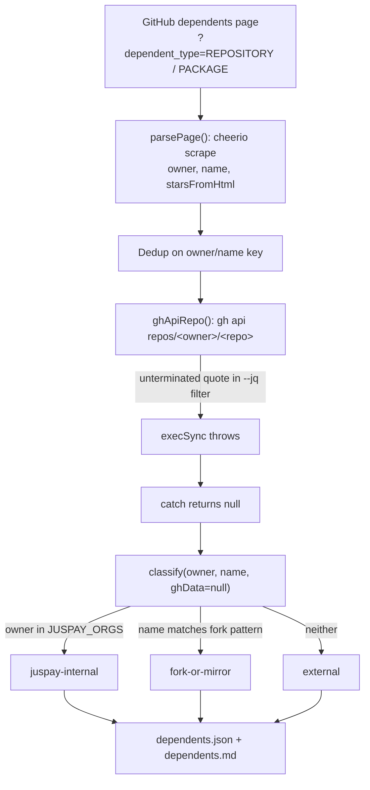

GitHub's "Used by" count on the `juspay/neurolink` repo page is a single number, and underneath it sits the real engineering problem this post is about. Click through to the dependents graph behind that badge and the number turns into a list of repositories — some genuinely built on top of the package, some just Juspay's own internal tooling importing its own SDK, at least one that is a fork of the repo itself rather than a consumer of it. For a growth team looking for case-study material, the raw count is close to useless: it doesn't say which of those repos belong to a stranger who chose to depend on your package, which is the entire point of collecting them at all. The mechanism that matters is not "count the dependents" — GitHub already does that — it's "tell the three categories apart without a human reading fourteen repo pages one at a time."

`scripts/growth/dependents-scan.mjs`, which shipped on 2026-07-04 alongside five other growth-measurement scripts in the same commit, is that classifier. It scrapes the dependents graph with cheerio, sorts every repo it finds into `external`, `juspay-internal`, or `fork-or-mirror`, and writes both a JSON snapshot and a markdown scoreboard. It also shipped with a one-character bug in its enrichment step that meant, on the run that produced the committed output, every single classification was made without the data source the script's own commit message and doc notes claim it had.

## What the dependents graph actually offers

GitHub's dependents graph lives at a predictable URL — `https://github.com/<owner>/<repo>/network/dependents` — and it supports two query variants that return different, overlapping sets:

- `?dependent_type=REPOSITORY` — repositories that import the package in code GitHub can see.
- `?dependent_type=PACKAGE` — repositories referenced only through a `package.json` or lockfile entry, without necessarily importing anything.

`dependents-scan.mjs` scrapes both variants for `REPO_SLUG = 'juspay/neurolink'` and takes the union, deduplicated on a lowercased `owner/name` key:

```javascript
const startUrls = [
  `${BASE_URL}?dependent_type=REPOSITORY`,
  `${BASE_URL}?dependent_type=PACKAGE`,
];

for (const startUrl of startUrls) {
  let url = startUrl;
  let page = 0;

  while (url && page < MAX_PAGES) {
    page++;
    const html = await fetchHtml(url);
    const { repos, nextUrl } = parsePage(html, url);

    for (const r of repos) {
      const key = `${r.owner}/${r.name}`.toLowerCase();
      if (!seen.has(key)) {
        seen.add(key);
        allRepos.push(r);
      }
    }

    if (!nextUrl) break;
    url = nextUrl;
  }
}
```

`MAX_PAGES` is capped at 10 per variant, and `fetchHtml` aborts any single request that runs past `HTTP_TIMEOUT_MS` (30 seconds) using an `AbortController`. Neither cap mattered for `juspay/neurolink` at the time this ran — the whole scan surfaced 14 unique repos, well inside one page — but they're the difference between a script that degrades gracefully on a popular package and one that hangs indefinitely walking a cursor-paginated graph with no page limit.

## Parsing a page GitHub didn't build an API for

GitHub does not expose the dependents graph through its REST or GraphQL API — it's a server-rendered HTML page, which is why this script reaches for `cheerio` (already a project dependency, pinned at `^1.2.0` in `package.json`) instead of a fetch-and-parse-JSON call. `parsePage` locates each dependent row with a `data-test-id` selector and pulls the owner/repo out of the hovercard links GitHub attaches to author and repo names:

```javascript
function parsePage(html, baseUrl) {
  const $ = cheerioLoad(html);
  const repos = [];

  $('[data-test-id="dg-repo-pkg-dependent"]').each((_, el) => {
    const links = $(el).find('a[data-hovercard-type]');
    let owner = null;
    let name = null;

    links.each((_, a) => {
      const type = $(a).attr('data-hovercard-type');
      const href = $(a).attr('href') || '';
      if (type === 'organization' || type === 'user') {
        owner = href.replace(/^\//, '');
      } else if (type === 'repository') {
        const parts = href.replace(/^\//, '').split('/');
        if (parts.length === 2) {
          owner = parts[0];
          name = parts[1];
        }
      }
    });

    if (!owner || !name) return;
    // ...
  });
```

The star count comes from a separate, more fragile path: find the `svg.octicon-star` icon inside the row, then read the text node that sits next to it in the same parent element and parse it as an integer, stripping thousands-separator commas first. There is no data attribute carrying the star count as a clean number — the script is reading a rendered icon's sibling text, which is exactly the kind of thing that breaks the next time GitHub reshuffles its markup without warning. Pagination is handled the same way: the script looks for an anchor whose visible text matches `/next/i` and whose `href` contains `dependents`, because GitHub's disabled "Next" button on the last page renders without an `href` at all rather than as a link with `disabled` set. Both of these are reasonable choices for scraping a page nobody guarantees a stable structure for — and both are why this script, unlike an API client, needs the classification logic downstream to tolerate incomplete rows rather than trust every field it parsed.

## Turning fourteen rows into three questions worth asking

A raw list of repo names answers nothing on its own. The question a growth team actually has is: which of these are outreach targets? `classify()` answers it with three ordered rules:

```javascript
const JUSPAY_ORGS = new Set(['juspay']);
const FORK_NAME_PATTERN = /neurolink|juspay__/i;

function classify(owner, name, ghData) {
  if (JUSPAY_ORGS.has(owner.toLowerCase())) return 'juspay-internal';
  if (ghData && ghData.fork) return 'fork-or-mirror';
  if (FORK_NAME_PATTERN.test(name)) return 'fork-or-mirror';
  return 'external';
}
```

The order matters: an owner in the `juspay` org is classified as internal before the fork check ever runs, so a Juspay-owned mirror of the SDK still counts as "ours," not as noise to discard. Anything left over — not Juspay, not flagged as a fork by the GitHub API, and without `neurolink` or `juspay__` in its own repo name — is `external`, the category the whole script exists to surface. It's a deliberately narrow definition of noise: a repo only gets filtered into `fork-or-mirror` if the API confirms it's a fork *or* its name pattern-matches, not on a lower bar like low star count or an empty description. A genuine but tiny external dependent stays external.

On the run committed in this repo, the union of both `dependent_type` variants classified into:

| Category | Count |
|----------|------:|
| **External** | **2** |
| Juspay-internal | 11 |
| Fork / mirror | 1 |
| **Total** | **14** |

Eleven of fourteen is Juspay's own repos depending on its own SDK — expected, and not interesting for outreach. One is a mirror repo whose name literally embeds `juspay__neurolink`, caught cleanly by `FORK_NAME_PATTERN`. Two are genuinely external: individual GitHub accounts, outside the `juspay` org, with no fork flag and no name collision, who chose to add `@juspay/neurolink` as a dependency of their own project. That's the entire yield of the scrape — a 2-in-14 signal rate — and it's also exactly the number a growth team can act on without drowning in noise: two names to look at, not fourteen.

## The enrichment step that never ran

The script doesn't stop at what it scraped from HTML. For every unique repo, `ghApiRepo()` shells out to the `gh` CLI to pull a verified star count, the fork flag, and a description directly from the GitHub API — the scraped star count from the page is treated as a fallback, not the source of truth:

```javascript
const GH_CLI = '/opt/homebrew/bin/gh';

function ghApiRepo(ownerRepo) {
  try {
    const out = execSync(`${GH_CLI} api repos/${ownerRepo} --jq '{stars:.stargazers_count,fork:.fork,private:.private,description:.description,html_url:.html_url,pushed_at:.pushed_at}`, {
      timeout: 15_000,
      stdio: ['ignore', 'pipe', 'ignore'],
    }).toString();
    return JSON.parse(out);
  } catch {
    return null;
  }
}
```

Read that `--jq` argument closely. The `jq` filter opens with `'{stars:...` — a single quote, then a JSON-object-shaped filter — and the string simply ends with `pushed_at:.pushed_at}` and a closing backtick. The opening `'` is never closed. `execSync` runs this through a shell, and a shell handed an unterminated single quote treats everything after it — including the rest of the command line and the process's own newline — as still inside the quote. There is no matching `'` anywhere later in the string to close it. The shell either errors immediately with something like "unexpected EOF while looking for matching `''`, or hangs waiting for more input that never arrives before `execSync`'s own `timeout: 15_000` kills it. Either outcome throws, and the `try/catch` around it does exactly what a `catch` block does: it returns `null` and moves on, silently.

The data this script actually wrote confirms it. Every one of the 14 entries in the committed `data/growth/dependents.json` — external, internal, and fork alike — carries `"ghEnriched": false`. One of the internal rows, `juspay/yama`, is representative of the shape every entry took that run:

```json
{
  "owner": "juspay",
  "name": "yama",
  "ownerRepo": "juspay/yama",
  "stars": 3,
  "starsFromHtml": 3,
  "fork": false,
  "ghEnriched": false,
  "category": "juspay-internal"
}
```

`fork: false` here is not a verified API result — it's the hardcoded fallback the enrichment code path assigns when `ghData` is `null` (`ghData ? ghData.fork : false`). For every repo in this run, the fork detection that `classify()` depends on for its second rule never actually executed; every classification fell through to the HTML-derived name-pattern check instead. It happened to land on the same answers a working `gh api` call would likely have produced here — nothing in this particular 14-repo set looks like a false negative — but that's luck in the data, not a property of the code. A dependent repo that was a genuine, undisclosed-by-name fork (no `neurolink` or `juspay__` in its own name) would have been misclassified as `external` on this exact run, because the one signal that could have caught it — the API's own `fork` boolean — was never fetched.

The generated doc, `docs/growth-exec/dependents.md`, states the intended design faithfully and, on this run, inaccurately in the same breath: "Stars are sourced from the GitHub API where available; HTML-scraped as fallback." On the run that produced this file, the API path was never *available* — not because of rate limiting or an expired token, but because of a missing character in a shell string, three lines into the function meant to reach it.

## What the classifier looked like end to end



Nothing in this flow is a crash the script's own operator would notice. `main()` still prints a clean summary line per repo, writes both output files, and exits 0. The bug is invisible from the CLI output; it's only visible by reading `ghEnriched` in the JSON it wrote, or by trying to re-run the same `--jq` string directly in a shell.

## Sorting for the reader, not the data

Once classification finishes, the script sorts external repos to the top — by design, since they're the only category worth a human's attention — then internal, then forks, breaking ties within each group by star count descending:

```javascript
const ORDER = { external: 0, 'juspay-internal': 1, 'fork-or-mirror': 2 };
enriched.sort((a, b) => {
  const od = (ORDER[a.category] ?? 9) - (ORDER[b.category] ?? 9);
  if (od !== 0) return od;
  return b.stars - a.stars;
});
```

`buildMarkdown()` then renders three separate tables — one per category — into `docs/growth-exec/dependents.md`, each with an explicit note on what the category means and why it matters for outreach. The external table is captioned, verbatim in the source: "the highest-priority targets for outreach, testimonials, and case-study content" — which is the whole reason this script exists inside a growth-engineering pipeline rather than as a one-off curiosity check. The two external repos surfaced by this run are individually-owned projects outside Juspay's GitHub org; naming them here would publish outreach targets before anyone on the growth team has actually reached out, so this post reports the aggregate counts rather than the repo names — the same restraint the internal doc itself applies by keeping that table private to `docs/growth-exec/`.

## Where this fits in the growth-measurement suite

`dependents-scan.mjs` didn't ship alone. The same commit — `d30d71d`, 2026-07-04 — added five sibling scripts under `scripts/growth/`: `npm-attribution.mjs` (splits npm download counts into internal-CI versus external-human share), `competitor-velocity.mjs` (snapshots competitor GitHub stars and npm downloads for star-velocity deltas), `weekly-metrics.mjs` (a north-star dashboard combining npm, GitHub, Bluesky, and Dev.to numbers, with a matching `launchd` plist to run it on a schedule), `gsc-keywords.mjs` (pulls Search Console queries and flags "striking distance" rankings), and `ai-sov-probe.mjs` (asks an LLM a fixed set of recommendation questions and scores whether NeuroLink gets cited). Each one follows the same shape as `dependents-scan.mjs`: scrape or query an external source, write a dated JSON snapshot under `data/growth/`, and render a companion markdown summary under `docs/growth-exec/` for humans to read without touching the raw data. `dependents-scan.mjs` is the one in that batch built specifically to turn a public GitHub signal into individually-addressable case-study leads, rather than an aggregate trend line.

## What re-running it gets you, and what it still can't

The script is idempotent in the sense that matters for a growth pipeline: `node scripts/growth/dependents-scan.mjs` re-scrapes both dependent-type variants fresh every time, so a re-run reflects whoever has added the package as a dependency since the last snapshot, not a diff against the old one. A `--json` flag skips the file writes entirely and prints the same object to stdout, useful for piping into something else without touching the repo. Re-running it today, with the `--jq` quote fixed, would additionally get a verified `fork` boolean and a real description for every row — neither of which this run had.

What it still doesn't do: it has no notion of *when* a dependent repo added NeuroLink, so a growth team reading this output can't tell a wildly enthusiastic early adopter from a repo that depended on `@juspay/neurolink` for a single afternoon last week. It also inherits every fragility of scraping a page GitHub reserves the right to restructure — the `data-test-id` selector, the octicon-star sibling-text parse, and the `/next/i` text match on the pagination link are all one GitHub frontend refactor away from silently returning zero rows instead of failing loudly. Unlike the `gh api` bug, an empty scrape would at least be visible in the summary counts; a wrong scrape, from a selector that half-matches, would not be.

The lesson worth carrying past this one script: a `try { } catch { return null }` around a shell-out is the right shape for a fallback path, and it is also exactly the shape that turns a typo into a silent, permanent no-op. The enrichment step here wasn't undertested because nobody thought about the failure case — the whole point of the fallback was to survive `gh` being unauthenticated or rate-limited. It was undertested because nothing checked that the *success* path had ever actually fired.

---

**Related posts:**

- [Symbol-grounding: catching hallucinated APIs before publish](/posts/symbol-grounding-catching-hallucinated-apis-before-publish/)
- [Flagging call-graph claims automatically](/posts/flagging-call-graph-claims-automatically/)
- [The hold-and-rewrite pipeline for stale drafts](/posts/the-hold-and-rewrite-pipeline-for-stale-drafts/)
