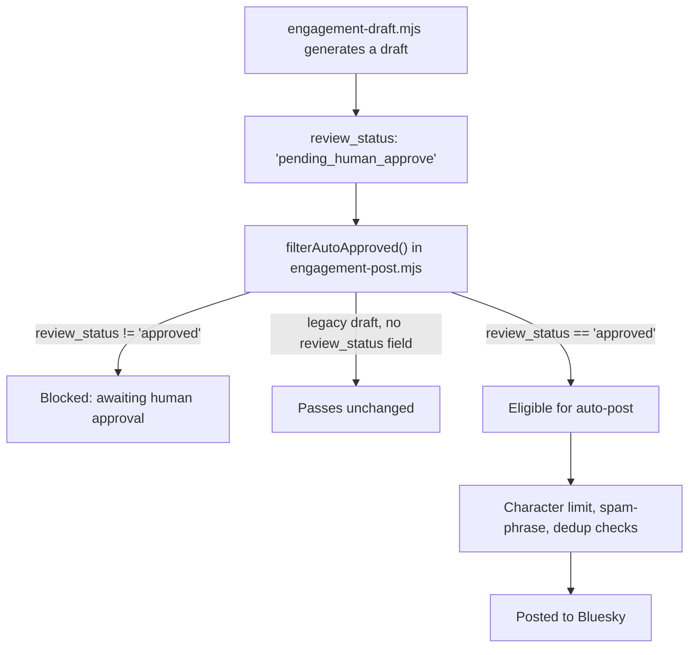

Four decision memos had already shipped a recommendation: turn on automated Bluesky replies, because the pipeline was "95% built" and the switch was one file touch. The memo quoted Bluesky's community guidelines to justify the risk level — "critical violations demonstrating intent to abuse the site result in permanent removal on first offense." It read like due diligence. Nobody had actually checked whether that sentence exists in Bluesky's guidelines. It doesn't.

That line, and three other things like it, are why this post exists. We designed a second review pass specifically to catch what a first pass of research agents gets confidently, plausibly wrong about its own conclusions — and the mechanism that pass used, what it found, and what shipped as a result of it are the subject of this post. It's grounded entirely in one commit to our growth-engineering repository, `50b5e99`, dated 2026-07-04.

## Two passes, not one

The first pass is `docs/GROWTH-STRATEGY-2026-07.md`, and its own header describes how it was built: "10 parallel deep-research agents (one per growth dimension, each web-grounded) → synthesis → an adversarial completeness critic → live verification of every load-bearing claim against `juspay/neurolink`, `juspay/neurolink-blog`, and the marketing repo." The doc's author line credits a 13-agent research workflow for the whole thing.

That pipeline produced an ICE-ranked backlog of twelve items (impact, confidence, effort — highest-priority first) and four open decisions that needed a human call rather than a researcher's judgment: comparison-content strategy, Product-Hunt-vs-Hacker-News launch framing, YouTube commitment level, and which of two competing automation builds to do first. Ranked at 98 and 96 respectively, the top two backlog items were "turn Bluesky engagement live" and "add a postinstall star/Discord CTA." Both looked, on paper, like the cheapest wins available.

That would normally be the end of it — ship the strategy, start executing the backlog top-down. Instead, a second pass ran against the first pass's own output, and it is the one this post is about. The strategy document's own changelog names it directly: "second adversarial pass — 41 agents." The re-review's consolidated write-up, `docs/growth-exec/rereview-verdicts.md`, describes its scope as "adversarial re-review of all 4 decisions (D1–D4) + independent feasibility/ROI verdicts on B01–B12, with live repo verification and web-grounded claims" — every open decision, and every single backlog item, not a sample of either.

All of this sat on top of a specific, stated problem, because the backlog and the four decisions weren't abstract exercises — they existed to close one gap the strategy document names in its own opening line: "NeuroLink has a usage-to-recognition gap, not a content gap." The npm download count was real. The star count, the Discord membership, and the blog's actual distribution reach were not keeping pace with it. Every item in the backlog, and every one of the four decisions, was a proposed way to close that specific gap — which is exactly why getting the facts underneath each proposal right mattered more than getting the strategic framing right. The framing was already correct. The risk was in the specifics underneath it.

## What the second pass actually checked

The structure that survives in the decision memos is a refute-then-adjudicate pattern, not a single fact-check sweep. D4, the automation-order decision, spells it out at the top of its final section: "Judge: Claude Code (claude-sonnet-4-6), final pass after two independent refuter verdicts." Two refuters read the original memo independently, each returned "revise / high confidence," and a judge pass then resolved every material claim between them against the live repository — not by picking a winner, but by re-checking each disputed point directly against source: the actual file, the actual line number, the actual live policy page. D1, the comparison-content decision, records the same shape in its own words: "Refutation round: two high-confidence refuter passes against this memo."

That is the part of the exercise worth naming precisely, because "we red-teamed our own content" can mean several different things. This wasn't a single model re-reading its own draft and softening a few claims. It was independent refuters attacking the memo's specific claims, followed by a separate adjudication pass whose job was to re-verify — not average the refuters' opinions, resolve them against ground truth. Five things it found are worth walking through individually, because each one is a genuinely different failure mode, not the same mistake wearing four costumes.

The four decisions the second pass reviewed, and what came out the other side:

| Decision | Question | Final verdict |
| --- | --- | --- |
| D1 | Should the content factory build a new comparison-post template? | Upheld, with the competitor baseline and two mis-sourced statistics corrected |
| D2 | Product Hunt then Hacker News, or the reverse? | Upheld, with four factual corrections to the launch copy and automation assumptions |
| D3 | How much should a solo operator commit to YouTube? | Channel creation upheld; monthly cadence commitment made conditional |
| D4 | Which automation to build first — engagement-live or the repurposing pipeline? | Direction upheld; effort estimates and safety gates rewritten |

Three of the four kept their recommendation outright. The fourth kept its first step and revised the commitment attached to the second. None of the four flipped.

## Finding one: a credential sitting in checked-in source

`scripts/engagement-post.mjs` builds its Bluesky client from environment variables, with a fallback if the environment variable is unset:

```typescript
// Before — a plaintext app-password fallback shipped in source
const BS_PASSWORD = process.env.BLUESKY_APP_PASSWORD || /* a literal password string */;
```

D4's adjudication section calls this out under its own heading, "R9. Hardcoded credential not flagged," and states plainly that "this plaintext app-password fallback is in a checked-in source file. The memo audited this file closely but did not surface this. The credential should be removed from source immediately regardless of which option is chosen." The first-pass research agents had read `engagement-post.mjs` closely enough to describe its auth flow in detail elsewhere in the same memo — and still missed the one line that mattered most. The fix that shipped in `50b5e99` removes the fallback and refuses to run instead of substituting a default:

```typescript
// After — refuse to start rather than fall back to a hardcoded secret
const BS_PASSWORD = process.env.BLUESKY_APP_PASSWORD;
if (!BS_PASSWORD) {
  console.error('BLUESKY_APP_PASSWORD not set — source .env before running. Refusing to continue.');
  process.exit(1);
}
```

That's the entire fix: five lines, in one file. Finding it took a second, independently-directed reading pass, not more time spent on the first one — the first pass had already spent plenty of time on this exact file.

## Finding two: a citation nobody checked

The original engagement-live decision assessed Bluesky's spam-enforcement risk by quoting community-guideline language about repeat violations. D4's adjudication, under "R5. Fabricated citation," is unambiguous about what happened next: "Confirmed by refuter's live fetches of the Community Guidelines and ToS. The quoted language ... does not appear in either document. The ToS says only 'We may suspend, restrict, or terminate your Account... at any time, without prior notice.' The claim was fabricated and used as the primary escalator for the risk rating."

The distinction the adjudication draws afterward is the part worth keeping, because it's more useful than "the memo lied." The core rule the original memo was trying to support — that Bluesky's developer guidelines define automated replies as spam regardless of quality — is real, and correctly quoted elsewhere in the same memo. The escalator sentence bolted onto it was not. A refuter that simply agreed the risk was "probably about right" would have left a fabricated quote propping up a real conclusion. Because the refuter fetched the actual policy pages live instead of trusting the citation, the final memo keeps the real rule and drops the invented one — and the risk framing changes as a direct result: from "likely permanent removal on first offense" to "the risk is real and unambiguous, but that specific enforcement severity is not documented for low-volume, quality-gated engagement."

This wasn't the only invented statistic the pass caught. The YouTube-commitment decision, D3, had originally cited "68% of technical creators quit within 3 months" as a reason to move cautiously on a new channel. The re-review's verdict on it is short: "ungrounded — no web source found. Remove from §2a." The underlying argument for caution didn't need the number and survived without it; the number itself just wasn't real.

## Finding three: a gate that gated nothing

This is the finding with the widest blast radius, because it's a logic bug, not a documentation error. `scripts/engagement-draft.mjs` writes a `review_status` field onto every draft it generates. Before this commit, it hard-coded that field to `'auto_post_with_eval_gate'`. Meanwhile, the function in `engagement-post.mjs` responsible for deciding which drafts are safe to auto-publish — `filterAutoApproved()` — checked whether a draft had already been replied to, whether it had been marked `rejected`, whether it exceeded the character limit, and whether it matched a spam-phrase blocklist. It never read `review_status` at all. D4's adjudication states the consequence directly: "If engagement-live were toggled on today, drafts would flow directly to auto-post," regardless of what the `review_status` field said, because nothing in the filter chain looked at it.

The fix touches both files. `engagement-draft.mjs` now writes `'pending_human_approve'` instead of the old default:

```typescript
// engagement-draft.mjs — every generated draft now starts unapproved
review_status: 'pending_human_approve',
```

And `filterAutoApproved()` in `engagement-post.mjs` gained the check that was missing:

```typescript
// engagement-post.mjs — the gate the field was always supposed to have
if (d.review_status && d.review_status !== 'approved') {
  reasons.push(`awaiting human approval (review_status=${d.review_status})`);
}
```

The comment attached to that check in the shipped diff explains the backward-compatibility reasoning: "Auto-generated drafts carry review_status and must be human-approved before posting; legacy human-authored drafts (no field) pass unchanged." That's a deliberate choice — a draft with no `review_status` field at all (hand-written before the field existed) still passes, but every machine-generated draft from this point forward is blocked until something external sets it to `approved`. The same commit applies the field, retroactively, to that day's already-generated draft batch in `data/engagement-drafts/2026-07-04.json`, so the fix isn't only forward-looking — it closes the gap on drafts that already existed when the bug was found.

## Finding four: wrong in the other direction

Not every correction in this pass made something look more dangerous or less finished. The automation-order memo had described Dev.to's live-publishing path as unbuilt — its Step 1 described "promoting `dryRunDevto()` to live with a `fetch()` call," as though the network call still needed writing. The adjudication's verdict on that claim: "`devto.mjs` lines 64–133 implement `publishDevto()` completely. `publisher.mjs` lines 275–278 already call it... The live path is entirely present. Wiring Dev.to live requires zero coding — only setting two env vars." The memo had overestimated effort exactly as confidently as it had underestimated risk elsewhere, and by a similar margin: from a multi-step build down to a fifteen-minute config change.

The same pattern shows up in the engagement pipeline's own drafting step. The original memo's plan described "Add a new script `engagement-draft.mjs`" as roughly a day of new work. The re-review's finding: the script already existed and was already wired into the daily cron job, called at lines 57–61 of `engagement-daily.sh`. The actual problem wasn't a missing build — it was that the drafter had silently stopped producing output weeks earlier, which is a diagnostic task, not a construction one.

Not every effort estimate in that same memo moved the same direction, which is worth showing side by side rather than describing in isolation:

| Piece of work | Original estimate | Corrected estimate |
| --- | --- | --- |
| `engagement-draft.mjs` drafting script | ~1 day to build | Already built and wired; needs a diagnostic fix |
| Dev.to live publishing | Promote `dryRunDevto()` to live | Already fully implemented; two env vars |
| Bluesky thread publishing | "Reuse `bsAuth()`" | New function needed; the helper isn't importable as-is — 3–5 hours |
| Shooter human-approval bridge | 2–4 hours | 1–2 days; bidirectional polling isn't wired for this use case |
| Full human-in-loop engagement, end to end | 1.5 days | 4–6 days |

Getting effort estimates wrong in the optimistic direction wastes engineering time planning work that's already done; getting them wrong in the pessimistic direction, as with the credential and the citation, creates risk that ships. A review pass that only ever found the second kind would look thorough and still be lopsided.

D1's comparison-content template got the same treatment on its own engineering estimate. The original memo priced the factory-integration work at one day. The re-review traced the actual surgery required — a new dispatch path through `planner.mjs`, `drafter.mjs`, and `gate-runner.mjs`, three separate files that each needed a `kind: comparison` code path added — and revised the estimate to 1.5–2 days. The direction of that correction runs the same way as the Shooter bridge: not wrong in kind, just wrong in scope, once someone actually opened the three files instead of estimating from the outside.

## Finding five: confidently wrong numbers, across the whole backlog

The re-review didn't stop at the flashy engagement-live bug. Its own scope statement says it covered "independent feasibility/ROI verdicts on B01–B12" — every item in the original twelve-item backlog, not just the top two. Most kept their verdict of CONFIRM with only a note attached; several got REVISE, with a corrected ranking and a corrected reason:

| Item | Original ICE | Revised ICE | Verdict |
| --- | --- | --- | --- |
| Fix GitHub repo description + topics | 100 | 95 | REVISE — provider count must be reconciled first |
| Ship the landing-page SSR fix | 100 | 100 | CONFIRM — branch-complete, unchanged |
| Turn Bluesky engagement live | 98 | 45 | REVISE — findings one through three above |
| SEO-optimize ~30 striking-distance posts | 95 | 60 | REVISE — the keyword data this depends on has never been fetched |
| Postinstall star/Discord CTA | 96 | 40 | REVISE — npm v12 and pnpm v10 block the delivery channel by default |
| npm download attribution | 94 | 85 | REVISE — directional floor, not a validated weekly number |
| README badges + star-history + Community section | 92 | 75 | REVISE — a Discord badge would advertise a near-empty server |
| Awesome-list PRs | 90 | 70 | REVISE — already listed in one list; the other is the wrong product category |
| Reliable Search Console pull | 90 | 75 | REVISE — has never produced real data; auth is broken, not flaky |
| Distribute the seven comparison posts | 86 | 55 | REVISE — refresh-first is a blocking prerequisite |
| Unblock two stuck factory topics | 84 | 84 | CONFIRM — root cause identified, fix unchanged |
| Per-post repurposing pipeline | 68 | 55 | REVISE — LinkedIn and the post-merge trigger are net-new, not partly built |

Three of those rows are worth a sentence each, because they show the same failure mode recurring in places that had nothing to do with Bluesky. The awesome-list item assumed a new submission was needed; the re-review found NeuroLink was already listed in one of the two target lists, merged months earlier, and that the real action was a reclassification PR plus a description fix — and that the second list was the wrong product category to submit to at all, something a document already on file had flagged. The Search Console item assumed the data pipeline was "flaky" — intermittently working. The re-review's correction is sharper than that: the keyword-data directory has never held a single real snapshot, the authentication token has been invalid since before this review even started, and the one run that looked like a success actually returned zero impressions for every page it checked. "Flaky" and "has never worked" call for different fixes, and only one of them is accurate.

The stuck-factory-topics item is the cleanest example of a correct diagnosis surviving scrutiny unchanged. The original backlog entry guessed the blockage was a content-quality problem. The re-review traced it to something more mechanical: four blog posts had merged without a corresponding update to a tone-assignment file, so every factory run since had been failing a voice-consistency check regardless of how good the draft was — a corpus-consistency bug, not a writing problem. That diagnosis held up against refutation exactly as written, which is why its ranking didn't move at all.

The postinstall correction is the clearest case of a number that was arithmetic on a wrong premise rather than a wrong fact by itself. The original stars-per-month projection assumed a fixed click-through rate against roughly 22K monthly installs executing a postinstall script. The re-review's finding wasn't that the click-through assumption was miscalibrated — it's that a large and growing share of that install base runs a package manager that silently refuses to run the script at all. A correct click-through rate applied to a channel that mostly doesn't fire produces a number with the right shape and the wrong meaning.

A quieter version of the same pattern surfaced in the npm-download-attribution item. Its script had already run and produced a 78%-external / 22%-internal split, flagged at medium-low confidence. The re-review's structural objection: the method treats weekend traffic as a proxy for non-CI (human) usage, and "weekends exceeded weekdays" in two separate months that happened to coincide with burst-release windows — meaning the proxy itself breaks exactly when a release ships on a weekend. The number wasn't discarded; it was downgraded from a metric to "a directional floor," which is a more honest label for the same data.

## What survived — the direction, not the confidence

It would be a cleaner story if the red-team pass had reversed the recommendations. It mostly didn't. D4's own section on this, "What survives refutation," keeps the strategic call unchanged: build the repurposing pipeline first, then human-approved engagement, and do not enable full-auto posting. D1 keeps its recommendation too — "Option B upheld... No structural flaw found by refuters" — while correcting the SDK version baseline and citation sourcing underneath it.

D2's Product-Hunt-then-Hacker-News sequencing survives in the same way, and its four corrections are worth listing because none of them touch the sequencing decision itself: a stale "18+ months in production" claim gets replaced with an accurate one grounded in the actual open-source date; a "zero-touch scheduled publish" assumption turns out to require either a manual push or a new scheduled workflow, because the existing deploy automation only triggers on a push or a manual dispatch, not on a clock; a planned launch-day tweet turns out to have no automation path at all behind it, for lack of credentials; and a provider count quoted as "24+" in launch copy against "21+" in the package manifest gets reconciled to the actual registered count. Every one of those is a fact a launch depends on getting right, and none of them changes whether the launch should happen or in what order.

Even the automation-order decision's own effort estimates got a full rewrite without the recommendation moving. The revised build order from D4's adjudication:

| Step | Action | Revised effort |
| --- | --- | --- |
| 0 | Remove the hardcoded credential fallback | 5 minutes |
| 1 | Set the two Dev.to live env vars — the code path already exists | 15 minutes |
| 2 | Extract the shared auth helper and add live Bluesky thread posting | 3–5 hours |
| 3 | Diagnose why the drafter stopped producing output | 1–2 hours |
| 4 | Wire the `review_status` gate on both sides | 30 minutes |
| 5 | Build the human-approval bridge (new directory, new CLI arg, new notification flow) | 2–3 days |
| 6 | Full-auto posting | do not build |

That pattern — direction unchanged, confidence and details corrected — is what an adversarial pass against your own output is actually good for. It is not a mechanism for discovering that the underlying strategy was wrong. It's a mechanism for discovering which of the load-bearing facts underneath a correct-shaped strategy were asserted rather than verified, and removing exactly those facts before anyone acts on them.

## The flow the fix actually enforces



The important edge in that diagram is the one from `C` to `D`. Before this commit, every arrow out of `filterAutoApproved()` skipped straight past `review_status` — the field existed on the data, and looked like it was doing something, but nothing in the code path read it, so every draft behaved as if it were already approved. The fix doesn't add a new stage to the pipeline. It makes an existing field, one that was already being written and already looked load-bearing, actually load-bearing.

## What a review pass like this doesn't buy you

It's worth being precise about the limits here too, because the commit's own supporting documents are precise about them. The `review_status` gate blocks auto-post for anything the drafter generates — but there is still no built approval mechanism upstream of it. Nothing in this commit builds the tooling that would let a human actually mark a draft `approved`; that gate exists, and is closed by default, which is the safety property that matters, but the door to open it deliberately still has to be built separately. The revised build-order table above prices that door at two to three days of new work, not a config flag.

D1's re-review surfaces a related gap in a different gate entirely — the one that stops the content factory from generating comparison claims about named competitors. The refuter's finding there: "the gate is hard only for literal-name sentences; it is advisory for pronoun references and cross-sentence paraphrase." A sentence that names a competitor directly gets blocked deterministically. A sentence that refers back to "it" two sentences later, still describing the same competitor, does not get the same treatment — which is exactly the kind of gap a first read of a gate's pass rate would not surface, because the gate still reports a high pass rate; it just isn't being tested against the case that matters. The memo's own conclusion is not "fix this before shipping anything" — it's that "mandatory human review remains the real safety net" for that specific gap, which is a narrower and more honest claim than "the gate handles this."

None of that is a criticism of running the review. It's the reason to run one: a system that checks its own gates for coverage gaps, rather than trusting a pass rate, is the only way those two sentences above get written down instead of assumed.

## The one decision that actually moved

Every example so far kept its direction and had its supporting facts corrected. D3, the YouTube-commitment decision, is the one case in the four where the re-review changed the commitment itself, not just the reasoning under it. The original strategy had already said "create the channel now" and "record two to three tutorials manually," stated as a flat recommendation. The re-review's verdict reframes it as conditional: create the channel now, unconditionally, but only commit to a recurring monthly video cadence "if funnel-fix items are on track by end of Week 4; otherwise hold at channel-only." The channel-creation step didn't move. The commitment level attached to what comes after it did, and it moved because of a fact check that had nothing to do with video content at all — it came from the same factory-runway correction that shows up in the backlog table above. The original strategy assumed roughly three weeks of ready-to-adapt blog topics feeding a video pipeline. The corrected number, after accounting for one quarantined and one soft-failing topic, was closer to 2.2 weeks. A commitment sized against three weeks of runway and a commitment sized against 2.2 weeks of runway are different commitments, even though nothing about YouTube itself changed between the two passes.

That's a useful edge case to hold onto alongside the "direction survives" pattern from every other decision: sometimes the fact that moves isn't even in the decision being reviewed. It's in a shared assumption — factory throughput, in this case — that several different decisions were quietly relying on, and correcting it in one place changes the safe commitment level in another.

## What shipped

Nine files changed in `50b5e99`, 1,908 lines added and 25 removed. Four of the added files are the decision memos themselves (D1 through D4), a fifth is the consolidated verdicts document, and the remaining changes are the two script fixes plus the strategy document's own changelog entry recording what moved and why. Nothing about the recommendation direction changed in any of the four decisions. The credential is gone from source. The citation that didn't exist is gone from the risk framing. The field that looked like a gate is now one. And three backlog rankings — plus one attribution metric relabeled from a number to a floor — moved to reflect facts a first pass had asserted instead of checked.

## Takeaways for anyone running agents against their own agents' output

A few things generalize past this specific commit:

- **A high verification claim in a first pass is not the same as verification.** The original strategy document already claimed "live verification of every load-bearing claim." That claim was itself true of most of the document and false of at least five specific things in it — a hardcoded credential, two fabricated citations, an unwired gate, and three miscalibrated rankings. Trusting a document's own verification claim instead of re-running verification is exactly the gap a second pass exists to close.
- **Refute, then adjudicate, beats re-read-and-soften.** The structure that produced real findings here was two independent refuters attacking the memo's specific claims, followed by a separate adjudication pass that re-checked each disputed point against the live source — not a single model asked to "double-check itself," which tends to reproduce its own first answer with more hedging.
- **A field that looks like a gate isn't one until something reads it.** `review_status` existed on every draft for a while before this commit, and looked like exactly the safety mechanism the pipeline needed. It wasn't, because the one function positioned to enforce it never checked it. The bug wasn't in the data model — it was in the silence between two files that each looked, individually, correct.
- **Effort estimates fail in both directions, and only one of them ships risk.** Dev.to's "unbuilt" live path was actually a fifteen-minute config change; that mistake wastes planning time. The Bluesky credential and the fabricated citation were the opposite kind of mistake, and those are the ones that would have shipped consequences if the review hadn't caught them first.
- **A gate's pass rate tells you nothing about the cases it wasn't built to catch.** The competitor-claims gate passes cleanly on literal names and says nothing about pronoun references. That distinction only surfaces when someone is specifically looking for what a deterministic check can't reach, not when someone is checking whether the check currently passes.
- **Direction surviving a red-team pass is the expected outcome, not a wasted exercise.** All four decisions kept their original recommendation. The value wasn't in reversing a call — it was in removing the load-bearing facts underneath each correct call that would have been wrong to act on as written.

---

**Related posts:**

- [Human-in-the-Loop (HITL) Security Guide for NeuroLink](/posts/hitl-guardrails-guide/)
- [Scraping the dependents graph to find real users](/posts/scraping-the-dependents-graph-to-find-real-users/)
- [Probing our own AI share-of-voice](/posts/probing-our-own-ai-share-of-voice/)
