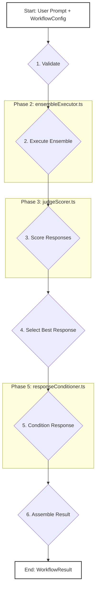

We designed NeuroLink's `WorkflowRunner` because a single prompt-response call to an LLM is a solved problem; orchestrating a dozen concurrent calls to models from OpenAI, Anthropic, and Google, having a separate AI judge the quality of each response, and then synthesizing a single best answer is an architectural nightmare. Before we built the workflow system, our application code was a tangled mess of `Promise.all` calls, manual timeouts, and nested `if/else` blocks to parse which model's output was worth showing the user. We needed a declarative, six-phase pipeline that could run, score, and refine responses without a single line of boilerplate in the calling service.

At its core, `runWorkflow` is a six-phase pipeline that takes a user prompt and a workflow definition and returns a single, high-quality, conditioned response. This entire process is designed to be deterministic and observable, turning a chaotic fan-out/fan-in problem into a structured series of transformations.

The six phases are:

1. **Validation**: A quick pre-flight check ensures the workflow configuration is valid.
2. **Execution**: The system runs the user prompt against an ensemble of models, in parallel or in sequence.
3. **Scoring**: One or more "judge" models evaluate the raw responses from the execution phase.
4. **Selection**: The system picks the best response based on the judge scores.
5. **Conditioning**: The selected response is refined, potentially by synthesizing an entirely new answer.
6. **Result Assembly**: All timing, token counts, and scores are packaged into a final `WorkflowResult` object.

This flow is visualized below.



## The Configuration Layer

Everything in the workflow system starts with a `WorkflowConfig`. This is a declarative object that defines every stage of the pipeline: which models to run, which judges to use for scoring, and how to condition the final response. We use Zod to define a strict `WorkflowConfigSchema` that provides strong validation and type safety from the start.

The configuration is centralized in `src/lib/workflow/config.ts`. This file exports helpers like `validateWorkflowConfig`, `mergeWithDefaults`, and `hasJudge` that let other parts of the system safely inspect a workflow's definition. It also defines the `DEFAULT_EXECUTION_CONFIG`, which sets system-wide defaults like a `modelTimeout` of 15000ms and a `judgeTimeout` of 10000ms.

A typical configuration might define two models and one judge.

```typescript
import { createWorkflowConfig } from './config';

const sampleWorkflow = createWorkflowConfig({
  workflowId: 'example-quality-check',
  models: [
    { provider: 'openai', model: 'gpt-4-turbo' },
    { provider: 'anthropic', model: 'claude-3-opus' },
  ],
  judges: [
    {
      provider: 'google',
      model: 'gemini-1.5-pro',
      prompt: 'You are a fair evaluator. Which response is better? Justify your choice.',
      synthesizeImprovedResponse: true,
    },
  ],
  conditioning: {
    synthesisModel: { provider: 'azure', model: 'gpt-4o' },
    rules: ['add-confidence-statement', 'add-model-attribution'],
  },
});
```

The function `usesModelGroups` checks if the config specifies sequential execution layers, a powerful feature for complex workflows where the output of one model group becomes the input for the next.

## The Core Execution Layer

The core logic lives in `src/lib/workflow/core/`. This directory contains the TypeScript files that implement the heart of the pipeline, moving from raw prompt to finished result.

### workflowRunner.ts: The Central Orchestrator

The main entry point is `runWorkflow` in `workflowRunner.ts`. This function is the master conductor. It doesn't execute models or judges directly; instead, it sequences the six phases of the pipeline. It calls helpers for each distinct stage, starting with `executeModels`, then `scoreResponses`, then `selectBestResponse`, and finally `conditionFinalResponse`. Its responsibility is orchestration and data flow, ensuring the output of one phase correctly feeds into the next. It's also responsible for assembling the final `WorkflowResult`, collecting timing metrics and token counts from each stage.

```typescript
// Simplified signature for the main entry point
export async function runWorkflow(
  config: WorkflowConfig,
  prompt: string,
  inputs?: Record<string, any>
): Promise<WorkflowResult> {
  // ... orchestration logic ...
}
```

### ensembleExecutor.ts: Parallel Model Execution

The heavy lifting of the execution phase happens in `ensembleExecutor.ts`. The primary function here is `executeEnsemble`, which takes the list of models from the `WorkflowConfig` and runs them in parallel. We use a promise-limiting library to manage concurrency, governed by the `parallelism=10` setting in `DEFAULT_EXECUTION_CONFIG`.

Each model call is wrapped in `executeWithTimeout`, which also handles retries. If a model provider returns an empty response, the system will retry up to `MAX_ATTEMPTS=2` times before marking it as a failure. For more complex scenarios, `executeModelGroups` can be used to run layers of models sequentially. This component is a great example of how we build resilient systems, a topic we also explored in our post on the [MCP circuit breaker pattern](/posts/mcp-circuit-breaker-pattern/).

```typescript
// Simplified signature for the parallel executor
export async function executeEnsemble(
  config: WorkflowConfig,
  prompt: string,
  inputs?: Record<string, any>
): Promise<EnsembleResponse[]> {
  // ... parallel execution logic with pLimit ...
}
```

### judgeScorer.ts: AI-Powered Response Grading

Once the ensemble returns a set of responses, they're passed to `scoreEnsemble` in `judgeScorer.ts`. This is where NeuroLink's "AI grading AI" capability comes to life, a concept we detail further in `[Grading the model: the scorer hierarchy and evaluation pipeline](/posts/grading-the-model-the-scorer-hierarchy-and-evaluation-pipeline/)`.

Depending on the configuration, this file's logic will dispatch to either `executeSingleJudge` or `executeMultiJudge`. The multi-judge path runs all configured judges in parallel via `Promise.all` and then uses `aggregateJudgeScores` to average their scores. This function also calculates a consensus level using `calculateConsensusLevel`, which measures how much the different judges agreed on the best response. The final output is a structured object containing a numeric score between `MIN_SCORE` (0) and `MAX_SCORE` (100) for each response.

```typescript
// Simplified signature for the scoring entry point
export async function scoreEnsemble(
  config: WorkflowConfig,
  prompt: string,
  responses: EnsembleResponse[]
): Promise<MultiJudgeScores | JudgeScores> {
  // ... logic to dispatch to single or multi-judge execution ...
}
```

### responseConditioner.ts: Refining the Final Answer

After scoring and selection, the winning response enters the conditioning phase, managed by `responseConditioner.ts`. The `conditionResponse` function checks `isConditioningEnabled` and then applies a series of transformations.

The most powerful transformation is `synthesizeImprovedResponse`. If the judge configuration included `synthesizeImprovedResponse: true`, the judge not only scores the responses but also generates a new, superior answer. The conditioning phase will prioritize this synthesized response over the original model outputs. If no synthesized response exists, it can be configured to call a `synthesisModel` (defaulting to `azure/gpt-4o`) to create one. Finally, it applies metadata rules like `addConfidenceStatement` and `addModelAttribution`.

```typescript
// The conditioner can add metadata or synthesize a new response
export async function conditionResponse(
  config: WorkflowConfig,
  bestResponse: EnsembleResponse,
  scores: JudgeScores | MultiJudgeScores,
  ensembleTime: number
): Promise<ConditionedResponse> {
  // ... synthesis and metadata logic ...
}
```

### workflowRegistry.ts: Managing Workflow Definitions

To make workflows reusable, we needed a central store. `workflowRegistry.ts` provides a simple in-memory `Map` for this purpose. The `registerWorkflow` function validates a `WorkflowConfig` and adds it to the registry, while `getWorkflow` retrieves it by ID. This allows services to define complex workflows at startup and then execute them by name, without passing the entire configuration object on every call. The `getRegistryStats` function provides observability into how many workflows are registered.

```typescript
// The registry provides simple, in-memory storage for workflow configs.
const workflowRegistry = new Map<string, WorkflowConfig>();

export function registerWorkflow(config: WorkflowConfig): boolean {
  // ... validation and registration logic ...
  workflowRegistry.set(config.workflowId, config);
  return true;
}
```

## Utilities: Validation and Metrics

Two files in `src/lib/workflow/utils/` provide critical supporting services: validation and metrics.

### workflowValidation.ts: Pre-flight Checks

A bad configuration can cause silent failures or unexpected costs. The `validateWorkflow` function in `workflowValidation.ts` prevents this. It runs a series of checks, like `validateModels` and `validateJudges`, to ensure the configuration is not just schema-valid, but also logically sound. For instance, it checks for conflicts and ensures that any specified models are supported by our [adapter catalog](/posts/twenty-four-providers-one-baseprovider-the-adapter-catalog/). The `validateForExecution` function is a stricter version called by `runWorkflow` just before execution begins.

```typescript
// Example validation check for model providers
function validateModels(models: WorkflowModelConfig[]): ValidationIssues {
  const issues: ValidationIssues = [];
  for (const model of models) {
    if (!SUPPORTED_PROVIDERS.includes(model.provider)) {
      issues.push({ message: `Unsupported provider: ${model.provider}` });
    }
  }
  return issues;
}
```

### workflowMetrics.ts: Measuring Performance

You can't improve what you can't measure. `workflowMetrics.ts` introduces the `WorkflowMetrics` class, an observer that can be attached to workflows to record performance data. It tracks execution times, token usage, and failure rates.

This file also contains the `compareWorkflows` function, which implements our standard formula for A/B testing two different workflows. It computes a weighted score where quality accounts for 40%, confidence 30%, speed 20%, and cost 10%. This gives us a consistent way to determine if a new workflow is objectively better than an old one.

```typescript
// Standard weights for comparing workflow performance
const DEFAULT_WEIGHTS = {
  quality: 0.4,
  confidence: 0.3,
  speed: 0.2,
  cost: 0.1,
};

export function compareWorkflows(
  resultsA: WorkflowResult[],
  resultsB: WorkflowResult[],
  weights = DEFAULT_WEIGHTS
): ComparisonResult {
  // ... metric calculation logic ...
}
```

## Pre-wired Workflow Presets

To make common patterns easier to use, we ship four pre-configured workflows in `src/lib/workflow/workflows/`. These are ready-to-use `WorkflowConfig` objects that can be imported and run directly.

- `QUALITY_MAX_WORKFLOW`: A standard configuration aimed at maximizing response quality.
- `CONSENSUS_3_WORKFLOW`: Uses three different judges and selects the response with the highest consensus score.
- `MULTI_JUDGE_5_WORKFLOW`: A heavy-duty configuration that uses five judges for maximum evaluation rigor.
- `FAST_FALLBACK_WORKFLOW`: Prioritizes speed, using faster models and a simpler scoring strategy.

These presets are created using helper functions like `createMultiJudgeWorkflow` and `createConsensus3WithPrompt`, which provide a fluent API for building complex configurations programmatically.

```typescript
// Example of a preset definition
export const CONSENSUS_3_WORKFLOW: WorkflowConfig = createConsensus3WithPrompt({
  workflowId: 'system-consensus-3',
  // ... configuration for 3 judges ...
});
```

By composing these different components—configuration, execution, scoring, conditioning, and validation—the workflow system provides a powerful and flexible abstraction for building sophisticated, multi-model AI interactions. It turns a complex orchestration problem into a declarative configuration, letting developers focus on the "what" instead of the "how."

---

**Related posts:**

- [Grading the model: the scorer hierarchy and evaluation pipeline](/posts/grading-the-model-the-scorer-hierarchy-and-evaluation-pipeline/)
- [Twenty-four providers, one BaseProvider: the adapter catalog](/posts/twenty-four-providers-one-baseprovider-the-adapter-catalog/)
- [Two backends, two stores, one TaskManager: how NeuroLink schedules AI work](/posts/two-backends-two-stores-one-taskmanager-how-neurolink-schedules-ai-work/)
